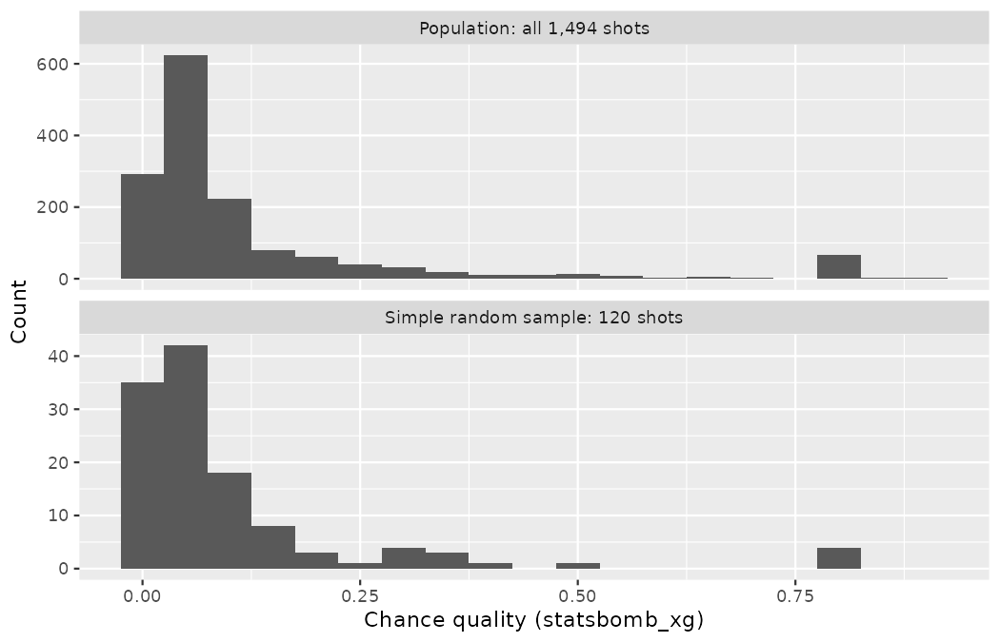
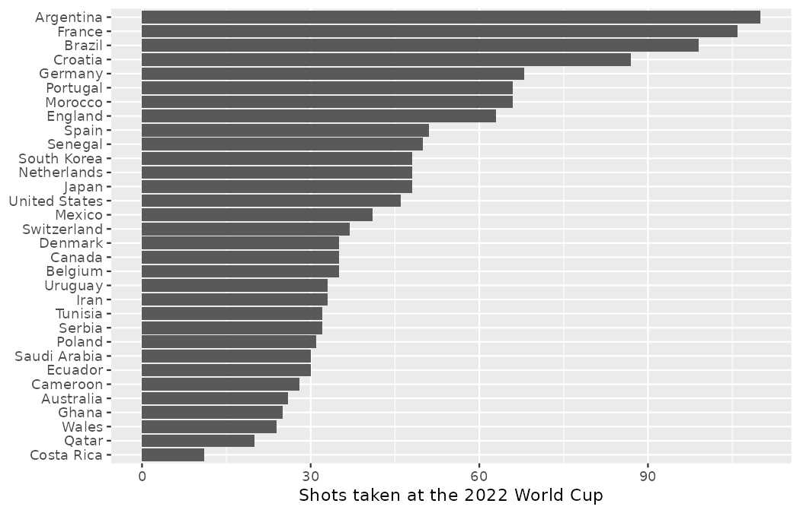

# Study design {#sec-data-design}

::: {.chapterintro}
Before digging into the details of working with data, we stop to think about how data come to be.
That is, if the data are to be used to make broad and complete conclusions about a player, a market, or a tournament, then it is important to understand who or what the data represent.
One important aspect of data provenance is sampling.
Knowing how the observational units — the shots, the matches, the prospects — were selected from a larger entity will allow for generalizations back to the population from which the data were randomly selected.
Additionally, by understanding the structure of the study, causal relationships ("the drill improved his finishing") can be separated from those relationships which are only associated ("players on that drill happened to finish better").
A good question to ask oneself before working with the data at all is, "How were these observations collected?".
A scout who asks it will learn a lot about the data by understanding its source — and will be far harder to fool.
:::

## Sampling principles and strategies {#sec-sampling-principles-strategies}

The first step in conducting research is to identify topics or questions that are to be investigated.
A clearly laid out research question is helpful in identifying what subjects or cases should be studied and what variables are important.
This is as true at Northbridge United as in any laboratory: when Marta Vidal, the sporting director, commissions a piece of analysis, the first thing Priya Rao's team does is pin down precisely what is being asked and of whom.
It is also important to consider *how* data are collected so that the data are reliable and help achieve the research goals.

### Populations and samples

Consider the following three research questions:

1.  What is the average chance quality (xG) of shots taken in the South American under-20 leagues this season?
2.  Over the last five years, what is the average number of academy seasons a Northbridge United graduate needed before making a first-team debut?
3.  Does a new high-intensity finishing program raise conversion rates in academy forwards?

Each research question refers to a target **population**.
In the first question, the target population is all shots taken in the South American under-20 leagues this season, and each shot represents a case.
Oftentimes, it is not feasible to collect data for every case in a population.
Collecting data for an entire population is called a **census**.
A census is difficult because it is too expensive to collect data for the entire population — no club can send scouts to every under-20 fixture on a continent, and no data provider logs them all — but it might also be because it is difficult or impossible to identify the entire population of interest!
Instead, a sample is taken.
A **sample** is the data you have.
Ideally, a sample is a small fraction of the population.
For instance, the 60 shots (or some other number) a regional scout logged from the matches they attended might be selected, and this sample data may be used to provide an estimate of the population average and to answer the research question.

::: {.callout-tip title="Check your understanding"}
For the second and third questions above, identify the target population and what represents an individual case.

------------------------------------------------------------------------

The question *"Over the last five years, what is the average number of academy seasons a Northbridge United graduate needed before making a first-team debut?"* is only relevant to graduates who made a debut; the average cannot be computed using a player who never debuted.
Thus, only Northbridge academy graduates who made a first-team debut in the last five years represent cases in the population under consideration.
Each such graduate is an individual case.
For the question *"Does a new high-intensity finishing program raise conversion rates in academy forwards?"*, an academy forward represents a case.
The population includes all academy forwards who could be put through the program.
:::

### Parameters and statistics

In most statistical analysis procedures, the research question at hand boils down to understanding a numerical summary.
The number (or set of numbers) may be a quantity you are already familiar with (like the average, or a conversion rate — the proportion of shots scored) or it may be something you learn through this text (like the slope and intercept from a least squares model, provided in @sec-least-squares-regression).

A numerical summary can be calculated on either the sample of observations or the entire population.
However, measuring every unit in the population is usually prohibitive.
So, a "typical" numerical summary is calculated from a sample.
Yet, we can still conceptualize calculating the average chance quality of every shot taken in every professional league in the world.

We use specific terms in order to differentiate when a number is being calculated on a sample of data (**sample statistic**) and when it is being calculated or considered for calculation on the entire population (**population parameter**).
The terms statistic and parameter are useful for communicating claims and models and will be used extensively in later chapters which delve into making inference on populations.

::: {.callout-tip title="Check your understanding"}
The average chance quality across all 1,494 shots of the 2022 Men's World Cup is a single number describing the whole tournament.
The average chance quality across the 120 shots a scout happened to log at that tournament is also a single number.
Which is the parameter and which is the statistic?

------------------------------------------------------------------------

If the population of interest is "all shots at the 2022 World Cup", then the average over all 1,494 shots is the population parameter, and the average over the scout's 120 logged shots is a sample statistic — an estimate of the parameter computed from the data at hand.
(This tournament is a rare treat: the event data constitute a census of its shots, so we can actually compute the parameter and check our samples against it.
We will exploit exactly this in @sec-samp-methods.)
:::

### Anecdotal evidence

Consider the following possible responses to the three research questions:

1.  A pundit raved about an under-20 match where three goals flew in from outside the box, so the chance quality being created in that market must be extraordinary.
2.  I know two academy graduates who needed seven seasons to make their debut, so it must take longer to come through at Northbridge than at other clubs.
3.  A rival club's striker went on a two-month scoring drought right after adopting the new finishing program, so the program must not work.

Each conclusion is based on data.
However, there are two problems.
First, the data only represent one or two cases.
Second, and more importantly, it is unclear whether these cases are actually representative of the population.
Data collected in this haphazard fashion are called **anecdotal evidence**.

::: {.callout-important title="Anecdotal evidence"}
Be careful of data collected in a haphazard fashion.
Such evidence may be true and verifiable, but it may only represent extraordinary cases and therefore not be a good representation of the population.
:::

Anecdotal evidence typically is composed of unusual cases that we recall based on their striking characteristics.
A thirty-yard screamer sticks in the memory; the forty preceding shots that rolled harmlessly wide do not.
For instance, we are more likely to remember the two academy graduates who needed seven seasons than the six others who debuted within three.
This is the *highlight-reel fallacy*, and it is the occupational disease of scouting: "I watched him twice and he was electric" is a sentence built from the two most memorable data points a scout owns.
Instead of looking at the most unusual cases, we should examine a sample of many cases that better represent the population.

### Sampling from a population

We might try to estimate the seasons-to-debut figure for Northbridge academy graduates in the last five years by collecting a sample of graduates.
All graduates who debuted in the last five years represent the *population*, and graduates who are selected for review are collectively called the *sample*.
In general, we always seek to *randomly* select a sample from a population.
The most basic type of random selection is equivalent to how raffles are conducted.
For example, in selecting graduates, we could write each graduate's name on a raffle ticket and draw 10 tickets.
The selected names would represent a random sample of 10 graduates.
Picture the population as a large cloud of dots — one dot per graduate — and the sample as ten dots pulled out of the cloud entirely at random, each dot equally likely to be pulled.

::: {.callout-note title="Worked example"}
Suppose we ask a youth coach who happens to specialize in goalkeepers to select several graduates for the study.
Which players do you think they might pick?
Do you think their sample would be representative of all graduates?

------------------------------------------------------------------------

They might pick a disproportionate number of goalkeepers and defenders they worked with closely — the dots they pull come from one corner of the cloud, not from the whole of it.
When selecting samples by hand, we run the risk of picking a **biased** sample, even if our bias is unintended.
Goalkeepers tend to debut later than outfield players, so this seemingly harmless shortcut would systematically distort the estimate.
:::

If someone was permitted to pick and choose exactly which graduates were included in the sample, it is entirely possible that the sample would overrepresent that person's interests, which may be entirely unintentional.
This introduces **bias** into a sample; when the selection procedure itself systematically favors some parts of the population over others, the result is called **sample bias**.
Sampling randomly helps address this problem.
The most basic random sample is called a **simple random sample** and is equivalent to drawing names out of a hat to select cases.
This means that each case in the population has an equal chance of being included, and knowing that one case has been drawn provides essentially no information about which other cases were favored.
Stated precisely, a simple random sample of 10 graduates is one drawn so that every possible group of 10 graduates has the same chance of being the selected sample — the raffle above achieves exactly this.

The act of taking a simple random sample helps minimize bias.
However, bias can crop up in other ways.
Even when people are picked at random, e.g., for surveys, caution must be exercised if the **non-response rate** is high.
For instance, suppose Emil Sørensen, Northbridge's head of scouting, emails a development questionnaire to 200 randomly selected players released from the academy over the last decade.
If only 30% of them actually respond, then it is unclear whether the results are **representative** of the entire population: the players who went on to good careers elsewhere may be far happier to reply than those for whom football ended at eighteen.
This **non-response bias** can skew results.
Randomly selecting *who is asked* does not guarantee randomness in *who answers*.

Another common downfall is a **convenience sample**, where individuals who are easily accessible are more likely to be included in the sample.
For instance, if a scout only files reports on matches at grounds within an hour's drive of home, those reports will not represent the whole league, let alone a continental market.
The most seductive convenience sample in this industry is the highlight reel: the clips are right there, pre-cut, and every one of them was chosen *because* something notable happened in it.
Agent-submitted footage is a convenience sample assembled by someone with a financial interest in the conclusion.
It is often difficult to discern what sub-population a convenience sample represents.

::: {.callout-tip title="Check your understanding"}
Several online platforms let anyone upload clips of a prospect and post a rating, and these ratings come only from people who go out of their way to provide one.
If 50% of the crowd ratings for a prospect are negative, do you think this means that 50% of qualified observers rate the prospect negatively?
Why?

------------------------------------------------------------------------

Answers will vary.
From our own experience of such platforms, people tend to rant after a bad performance more readily than they post measured praise after an ordinary one, while an agent's circle may flood the page with raves; neither group is a random draw from qualified observers.
For this reason, we suspect crowd ratings carry bias of unknown direction and size.
However, since our experiences may not be representative either, we also keep an open mind — the honest answer is that a self-selected sample tells us very little about the population proportion.
:::

### Four sampling methods {#sec-samp-methods}

Almost all statistical methods are based on the notion of implied randomness.
If data are not collected in a random framework from a population, these statistical methods — the estimates and errors associated with the estimates — are not reliable.
Here we consider four random sampling techniques: simple, stratified, cluster, and multistage sampling.

We will demonstrate all four on a population we can, for once, see in full: the 1,494 shots of the 2022 Men's World Cup, introduced in @sec-data-hello.
Because the event data are a census of the tournament's shots, the population parameter — the average chance quality per shot — can be computed exactly, and every sampling method can be judged against it.
Imagine, though, that the data feed did not exist and Emil had to estimate tournament-wide chance quality by *sending scouts*: every shot logged costs travel, accreditation, and attention.
That is the position most clubs are in for most competitions, and it is why sampling strategy matters.

```r
library(dplyr)
library(readr)
library(tidyr)
library(ggplot2)

wc2022_shots <- read_csv("data/derived/wc2022_shots.csv")
wc2022_matches <- read_csv("data/derived/wc2022_matches.csv")

wc2022_shots |>
  summarize(shots = n(), mean_xg = mean(statsbomb_xg))
#> # A tibble: 1 × 2
#>   shots mean_xg
#>   <int>   <dbl>
#> 1  1494   0.126
```

The target of every estimator below is this population parameter: a mean chance quality of 0.126 per shot.

**Simple random sampling** is probably the most intuitive form of random sampling.
Each of the 1,494 shots belongs to one of the tournament's 32 teams.
To take a simple random sample of 120 shots, we could write a slip of paper for every shot of the tournament, drop the slips into a bucket, shake the bucket around until we are sure the slips are all mixed up, then draw out slips until we have the sample of 120 shots.
In general, a sample is referred to as "simple random" if each case in the population has an equal chance of being included in the final sample *and* knowing that a case is included in a sample does not provide useful information about which other cases are included.

In code, the bucket is a seeded `slice_sample()`:

```r
set.seed(201)
srs120 <- wc2022_shots |>
  slice_sample(n = 120)

srs120 |>
  summarize(shots = n(), teams = n_distinct(team), mean_xg = mean(statsbomb_xg))
#> # A tibble: 1 × 3
#>   shots teams mean_xg
#>   <int> <int>   <dbl>
#> 1   120    29   0.105
```

This particular draw estimates 0.105 — below the true 0.126, purely by the luck of which 120 slips came out of the bucket.
A different seed would give a different estimate.
The figure below places the sample's distribution of chance quality next to the population's.

```r
bind_rows(
  wc2022_shots |> mutate(source = "Population: all 1,494 shots"),
  srs120 |> mutate(source = "Simple random sample: 120 shots")
) |>
  ggplot(aes(x = statsbomb_xg)) +
  geom_histogram(binwidth = 0.05) +
  facet_wrap(~ source, ncol = 1, scales = "free_y") +
  labs(x = "Chance quality (statsbomb_xg)", y = "Count")
```

{fig-alt="Two stacked histogram panels of chance quality, one for the population of all 1,494 shots and one for the 120-shot simple random sample. Both are strongly right-skewed, with the tallest bar at the far left and a small isolated spike near 0.78." width=85%}

The claims we are about to make about the two panels can — and therefore should — be computed rather than eyeballed:

```r
bind_rows(
  wc2022_shots |> mutate(source = "population"),
  srs120 |> mutate(source = "sample")
) |>
  group_by(source) |>
  summarize(
    shots = n(),
    xg_below_005 = sum(statsbomb_xg < 0.05),
    penalties = sum(shot_type == "Penalty")
  )
#> # A tibble: 2 × 4
#>   source     shots xg_below_005 penalties
#>   <chr>      <int>        <int>     <int>
#> 1 population  1494          684        64
#> 2 sample       120           60         4
```

Both histograms are strongly right-skewed and look alike in shape: the tallest bar in each panel is the leftmost one (684 of the 1,494 population shots have xG below 0.05, as do 60 of the 120 sampled shots), the counts fall away quickly as chance quality rises, and each panel shows a small isolated spike near 0.78 — penalties, which the xG model stores at 0.7835 apiece (64 of them in the population, 4 of which landed in this sample).
A representative sample should reproduce the population's shape like this, just more coarsely.

**Stratified sampling** is a divide-and-conquer sampling strategy.
The population is divided into groups called **strata**.
The strata are chosen so that similar cases are grouped together, then a second sampling method, usually simple random sampling, is employed within each stratum.
In our shot population, each of the 32 teams is a natural stratum, because teams differ enormously in both shot volume and shot quality — a deep tournament run multiplies a team's shots:

```r
wc2022_shots |>
  count(team, sort = TRUE) |>
  slice(c(1:3, 30:32))
#> # A tibble: 6 × 2
#>   team           n
#>   <chr>      <int>
#> 1 Argentina    110
#> 2 France       106
#> 3 Brazil        99
#> 4 Wales         24
#> 5 Qatar         20
#> 6 Costa Rica    11
```

```r
wc2022_shots |>
  count(team) |>
  ggplot(aes(x = n, y = reorder(team, n))) +
  geom_col() +
  labs(x = "Shots taken at the 2022 World Cup", y = NULL)
```

{fig-alt="A horizontal bar chart of shots taken by each of the 32 teams, sorted from Argentina with 110 shots at the top down to Costa Rica with 11 shots at the bottom, a ten-fold range." width=85%}

The bar chart lays out all 32 teams from Argentina (110 shots) at the top down to Costa Rica (11 shots) at the bottom — a ten-fold range, with the champions and fellow finalists France stacked far above the group-stage casualties.
A simple random sample of 120 shots follows these proportions: by chance it may contain a dozen Argentine shots and none at all from the smallest strata (the seed-201 draw above covered only 29 of the 32 teams).
Under stratified sampling we instead might randomly sample 4 shots from each of the 32 teams, guaranteeing every team a voice:

```r
set.seed(202)
strat128 <- wc2022_shots |>
  group_by(team) |>
  slice_sample(n = 4) |>
  ungroup()

strat128 |>
  summarize(shots = n(), teams = n_distinct(team), mean_xg = mean(statsbomb_xg))
#> # A tibble: 1 × 3
#>   shots teams mean_xg
#>   <int> <int>   <dbl>
#> 1   128    32   0.134
```

One caution: the plain average above treats Costa Rica's 4 sampled shots and Argentina's 4 sampled shots as equally important, even though Argentina contributed ten times as many shots to the population.
A proper stratified estimate re-weights each team's sample mean by that team's true share of the population:

```r
team_sizes <- wc2022_shots |>
  count(team, name = "team_shots")

strat128 |>
  group_by(team) |>
  summarize(team_mean_xg = mean(statsbomb_xg)) |>
  left_join(team_sizes, by = "team") |>
  summarize(weighted_mean_xg = weighted.mean(team_mean_xg, team_shots))
#> # A tibble: 1 × 1
#>   weighted_mean_xg
#>              <dbl>
#> 1            0.140
```

This draw lands at 0.134 unweighted and 0.140 weighted, against the truth of 0.126 — sampling variability again; neither the simple random sample nor the stratified sample is entitled to hit the parameter exactly, and no single draw tells you which *method* is better.
(Comparing methods requires studying how estimates behave across many repeated samples, an idea we develop from @sec-foundations-randomization onward.)
The point of showing both estimators is the design contrast, not a horse race between two seeds.

**Stratified sampling** is especially useful when the cases in each stratum are very similar with respect to the outcome of interest.
The downside is that analyzing data from a stratified sample is a more complex task than analyzing data from a simple random sample — the re-weighting step above was the first taste of that.
The analysis methods introduced in this book would need to be extended to analyze data collected using stratified sampling.

::: {.callout-tip title="Check your understanding"}
A scout stratifies a 120-shot mini-population by team and samples 4 shots from each of its two teams.
Team A took 100 of the 120 shots, and its 4 sampled shots average 0.20 xG; Team B took the other 20 shots, and its 4 sampled shots average 0.05 xG.
Compute the unweighted average of the two team means and the weighted stratified estimate of the population mean.
Which is the appropriate estimate, and why?

------------------------------------------------------------------------

Unweighted: $(0.20 + 0.05)/2 = 0.125.$
Weighted: $(100 \times 0.20 + 20 \times 0.05)/120 = 21/120 = 0.175.$
The weighted estimate is the appropriate one: Team A contributed $100/120$ of the population's shots, so its sample mean must carry $100/120$ of the weight — exactly the role `weighted.mean()` played above, where Argentina's 110 shots outweighed Costa Rica's 11.
An unweighted average would let the small stratum drag the estimate far below what the population plausibly looks like.
:::

::: {.callout-note title="Worked example"}
Why would it be good for cases within each stratum to be very similar?

------------------------------------------------------------------------

We might get a more stable estimate for the subpopulation in a stratum if the cases are very similar, leading to more precise estimates within each group.
If every one of a team's shots carries roughly that team's typical chance quality, then even 4 shots pin down the team's mean well.
When we combine these estimates into a single estimate for the full population, that population estimate will tend to be more precise since each individual group estimate is itself more precise.
:::

In a **cluster sample**, we break up the population into many groups, called **clusters**.
Then we sample a fixed number of clusters and include all observations from each of those clusters in the sample.
A **multistage sample** is like a cluster sample, but rather than keeping all observations in each cluster, we would collect a random sample within each selected cluster.

For the shot population, the natural cluster is the *match*: shots come bundled into 64 matches, and a scout attends matches, not individual shots.
Suppose Emil's travel budget stretches to accrediting scouts for only 8 of the 64 matches.
A cluster sample randomly selects the 8 matches and logs *every* shot in them:

```r
set.seed(203)
match_sample <- wc2022_matches |>
  slice_sample(n = 8)

cluster_shots <- wc2022_shots |>
  semi_join(match_sample, by = "match_id")

cluster_shots |>
  summarize(
    matches = n_distinct(match_id), shots = n(), mean_xg = mean(statsbomb_xg),
    penalties = sum(shot_type == "Penalty"), shootout_kicks = sum(period == 5)
  )
#> # A tibble: 1 × 5
#>   matches shots mean_xg penalties shootout_kicks
#>     <int> <int>   <dbl>     <int>          <int>
#> 1       8   225   0.155        20             18
```

This cluster sample estimates 0.155 — noticeably above the true 0.126, and the miss is instructive.
Two of the eight randomly drawn matches happened to be quarter-finals decided on penalty shootouts, and shootout kicks enter the data as penalties with a stored chance quality of 0.7835 each; as the summary shows, this draw contains 20 penalties among its 225 shots, 18 of them shootout kicks.
When you sample only 8 clusters, one or two unusual clusters can swing the whole estimate: cluster samples buy cheap travel at the price of this volatility.

With a **multistage sample**, we keep the 8 sampled matches but log only a random subset of shots within each — say the analysis team has time to fully tag at most 15 shots per attended match:

```r
set.seed(204)
match_sample_2 <- wc2022_matches |>
  slice_sample(n = 8)

multistage_shots <- wc2022_shots |>
  semi_join(match_sample_2, by = "match_id") |>
  group_by(match_id) |>
  slice_sample(n = 15) |>
  ungroup()

multistage_shots |>
  summarize(matches = n_distinct(match_id), shots = n(), mean_xg = mean(statsbomb_xg))
#> # A tibble: 1 × 3
#>   matches shots mean_xg
#>     <int> <int>   <dbl>
#> 1       8   116   0.137
```

(The sample holds 116 shots rather than $8 \times 15 = 120$ because one of the drawn matches produced only 11 shots in total, so it contributes all 11.)

Sometimes cluster or multistage sampling can be more economical than the alternative sampling techniques: 8 accreditations instead of tickets scattered across 64 matches.
Also, unlike stratified sampling, these approaches are most helpful when there is a lot of case-to-case variability within a cluster but the clusters themselves do not look very different from one another.
A single match already contains tap-ins, headers, and forty-yard punts — enormous within-cluster variability — while one group-stage match resembles the next far more than Argentina's shot profile resembles Costa Rica's.
(As our shootout-laden draw showed, when clusters *do* differ sharply — group stage versus knockout ties — the method feels it.)
A downside of these methods is that more advanced techniques are typically required to analyze the data, though the methods in this book can be extended to handle such data.

::: {.callout-note title="Worked example"}
Suppose Emil wants standardized in-person reports on about 150 shots from a foreign league to calibrate his scouts against the data feed.
The league's 16 stadiums host matches that are more or less like the next, but the distances between the cities are substantial, and every additional city visited multiplies hotel and travel costs.
What sampling method should Emil use?

------------------------------------------------------------------------

A simple random sample of shots would likely scatter the scouts across nearly every stadium in the league, which could make data collection expensive.
Stratified sampling would be a challenge since it is unclear how we would build strata of similar shots before seeing them.
However, cluster sampling or multistage sampling seem like very good ideas.
With multistage sampling, we could randomly select a handful of the matches, then randomly select the shots to be fully worked up from within each attended match.
This could reduce data collection costs substantially in comparison to a simple random sample, and the sample would still yield reliable information, even if we would need to analyze the data with more advanced methods than those introduced in this book.
:::

::: {.callout-tip title="Check your understanding"}
Classify the sampling method in each of Priya's three plans for surveying the injury records of the roughly 5,000 academy players registered across the federation's 250 academies.
Plan A: randomly select 12 academies and collect the injury log of *every* player at each.
Plan B: randomly select 12 academies, then collect the logs of 10 randomly chosen players per academy.
Plan C: group all registered players by position, then randomly sample 40 players within each position group.

------------------------------------------------------------------------

Plan A is cluster sampling: the academies are the clusters, and every observational unit inside a sampled cluster is taken.
Plan B is multistage sampling: clusters are sampled first, then units are randomly subsampled within each.
Plan C is stratified sampling: every stratum (position group) is represented, with random sampling inside each stratum.
:::

## Experiments {#sec-experiments}

Studies where the researchers assign treatments to cases are called **experiments**.
When this assignment includes randomization, e.g., using a coin flip to decide which training program a player receives, it is called a **randomized experiment**.
Both terms — like *placebo* and *observational study* later in this chapter — appeared informally in @sec-data-hello; we now give them their formal treatment.
Randomized experiments are fundamentally important when trying to show a causal connection between two variables.
Recall the distinction from @sec-data-hello: the tournament shot data record what football happened to produce, whereas in an experiment the club *decides* who gets what.
At Northbridge, every randomized experiment lives inside the club — Jonas Beck's academy is where treatments can actually be assigned — because nobody gets to randomize a World Cup.

### Principles of experimental design {#sec-principles-experimental-design}

Throughout this section we will follow a randomized experiment Jonas Beck, Northbridge's academy director, might design: does a new high-intensity finishing program raise conversion rates in academy forwards, compared to the standard training curriculum?
Four principles govern the design.

1.  **Controlling.**
    Researchers assign treatments to cases, and they do their best to **control** any other differences in the groups.[^02-data-design-1]
    For example, players might complete their assigned finishing block at different points of a session: some fresh at the start, others exhausted after a full training load, and fatigue would then contaminate the comparison.
    To control for the effect of fatigue, Jonas may instruct every player to complete their assigned block first thing in the session, after the same standardized warm-up, with the same number of repetitions.

[^02-data-design-1]: This is a different concept than a *control group*, which we discuss in the second principle and in @sec-reducing-bias-human-experiments.

2.  **Randomization.**
    Researchers randomize players into treatment groups to account for variables that cannot be controlled.
    For example, some players may arrive as naturally better finishers than others due to position and playing history.
    In this example playing position is a **confounding variable**[^02-data-design-2], which is defined as a variable that is associated with both the explanatory and response variables and is not itself a consequence of the explanatory variable.
    If strikers were allowed to volunteer for the exciting new program, the program group would be stacked with players who convert well anyway.
    Randomizing players into the treatment or control group helps even out such differences.

[^02-data-design-2]: Also called a **lurking variable**, **confounding factor**, or a **confounder**.

::: {.callout-important title="Confounding variable"}
A **confounding variable** is one that is associated with both the explanatory and response variables and is not itself a consequence of the explanatory variable.
Because it is associated with both variables, it prevents the study from concluding that the explanatory variable caused the response variable.
Consider a silly example from club operations, with hot drinks sold at the stadium as the explanatory variable and the number of muscle injuries in the same fixtures as the response variable (which may seem highly correlated in the club's records).
Cold weather is associated with both variables, and therefore we cannot conclude that high hot-drink sales are a cause of more muscle injuries.

Confounding variables may or may not be measured as part of the study.
Regardless, drawing cause-and-effect conclusions is difficult in an observational study because of the ever-present possibility of confounding variables.
:::

3.  **Replication.**
    The more cases researchers observe, the more accurately they can estimate the effect of the explanatory variable on the response.
    In a single study, we **replicate** by collecting a sufficiently large sample — enough forwards in each training arm, not one prized prospect per group.
    What is considered sufficiently large varies from experiment to experiment, but at a minimum we want to have multiple subjects (experimental units) per treatment group.
    Another way of achieving replication is replicating an entire study to verify an earlier finding — running the drill trial again the following season, or at a partner academy.
    The term **replication crisis** refers to the ongoing methodological crisis in which past findings from scientific studies in several disciplines have failed to be replicated.
    **Pseudoreplication** occurs when individual observations under different treatments are heavily dependent on each other.
    For example, suppose you have 50 academy players in an experiment where you're recording each player's finishing assessment at 10 sessions throughout the trial.
    By the end, you will have 50 $\times$ 10 = 500 measurements.
    Reporting that you have 500 observations would be considered pseudoreplication, as the repeated assessments of a given player are not independent of each other.
    Pseudoreplication often happens when the wrong entity is replicated, and the reported sample sizes are exaggerated.

4.  **Blocking.**
    Researchers sometimes know or suspect that variables, other than the treatment, influence the response.
    Under these circumstances, they may first group individuals based on this variable into **blocks** and then randomize cases within each block to the treatment groups.
    This strategy is often referred to as **blocking**.
    For instance, if we are looking at the effect of the finishing program on conversion, we might first split the forwards into a high-baseline block and a low-baseline block using last season's conversion figures, then randomly assign half the players from each block to the control group and the other half to the treatment group.
    Picture the pool of forwards divided into the two blocks first, and only then a coin flipped within each block: the result is that each treatment group receives the same number of proven finishers and the same number of raw ones, so a lopsided draw cannot hand one program all the natural goalscorers.

It is important to incorporate the first three experimental design principles into any study, and this book describes applicable methods for analyzing data from such experiments.
Blocking is a slightly more advanced technique, and statistical methods in this book may be extended to analyze data collected using blocking.

::: {.callout-tip title="Check your understanding"}
In Jonas's trial, name one variable he can *control*, one he should *randomize over*, and one he might *block* on.

------------------------------------------------------------------------

Control: the session conditions — warm-up, repetition count, time of session — can be fixed to be identical for everyone.
Randomize: everything that cannot be fixed, such as a player's motivation, growth spurt timing, or playing history; random assignment spreads these evenly across the groups on average.
Block: a variable known in advance to influence conversion, such as last season's conversion rate (or position), so that each program receives a comparable mix.
:::

### Reducing bias in human experiments {#sec-reducing-bias-human-experiments}

Randomized experiments have long been considered to be the gold standard for data collection, but they do not ensure an unbiased perspective into the cause-and-effect relationship in all cases.
Studies on human beings — and footballers are aggressively human — are perfect examples where bias can unintentionally arise.
Here we reconsider Jonas's trial of the new finishing program.
In particular, the club wants to know if the program raises conversion in academy forwards.

Jonas designed a randomized experiment because the club wanted to draw causal conclusions about the program's effect.
The academy forwards who volunteered for the trial[^02-data-design-3] were randomly placed into two study groups.
One group, the **treatment group**, received the new high-intensity finishing program.
The other group, called the **control group**, continued with the standard training curriculum.

[^02-data-design-3]: Human subjects in a study are often called **volunteers**, **participants**, or — around a training ground — simply "the lads in the trial".

Put yourself in the place of a player in the study.
If you are in the treatment group, you are handed a glossy new program that the coaches seem excited about, and you anticipate it will help you.
On the other hand, a player in the other group carries on with the same old drills, perhaps quietly deflated at missing out.
These perspectives suggest there are actually two effects in this study: the one of interest is the effectiveness of the program, and the second is an emotional effect of (not) receiving it — belief, motivation, resentment — which is difficult to quantify.

Researchers aren't usually interested in the emotional effect, which might bias the study.
To circumvent this problem, researchers do not want players to know which group they are in.
When researchers keep the participants uninformed about their treatment, the study is said to be **blind**.
But there is one problem: if a player does not receive any new-looking training, they will know they're in the control group.
A solution to this problem is to give a fake treatment to players in the control group.
This is called a **placebo**, and an effective placebo is the key to making a study truly blind.
In a training-ground trial, the placebo is a *sham drill*: a session block with the same contact time, the same novelty and presentation, and the same coaching attention as the new program, but whose content is believed to have no effect on finishing — elaborate new rondo variations, say.
However, offering such a fake treatment may not be ethical in certain experiments.
For example, in the club's medical and injury-prevention work, typically the control group must get the current standard of care.
Oftentimes, a placebo results in a slight but real improvement in participants — players who believe they are on a cutting-edge program train with more conviction and may genuinely finish a little better.
This effect has been dubbed the **placebo effect**.

The players are not the only ones who should be blinded: coaches and researchers can unintentionally bias a study.
When a coach knows a player has been given the real program, they might inadvertently give that player more attention or more generous marks in the end-of-trial finishing assessment than a player they know is on the sham drill.
To guard against this bias, which again has been found to have a measurable effect in some instances, most modern studies employ a **double-blind** setup where the coaches who grade the assessments and interact with the players are, just like the players, unaware of who is or is not receiving the treatment.[^02-data-design-4]

[^02-data-design-4]: There are always some staff involved in the study who do know which players are receiving which program — someone has to run the sessions.
    However, they do not grade the assessments and do not tell the blinded assessors who is receiving which program.

::: {.callout-tip title="Check your understanding"}
Look back to the study in @sec-case-study-stents-strokes, where the academies randomized players to the new high-intensity finishing program or to standard training and assessed conversion at 30 days and at season end.
Is this an experiment?
Was the study blinded?
Was it double-blinded?

------------------------------------------------------------------------

The academies assigned the players into their training groups, so this study was an experiment.
However, the players could distinguish what treatment they received, because you cannot spend weeks inside a high-intensity finishing program without noticing.
There was no sham drill in that design, so this study was not blind.
The study could not be double-blind since it was not blind.
:::

::: {.callout-tip title="Check your understanding"}
For the study in @sec-case-study-stents-strokes, could the designers have employed a placebo?
If so, what would that placebo have looked like?

------------------------------------------------------------------------

Ultimately, can we make players think they are receiving an innovative program when they are not?
In fact, we can: the sham drill described above — matched contact time, matched novelty, content believed inert for finishing — is the training-ground analogue of a **sham surgery** in medicine, where the patient undergoes a procedure without receiving the active treatment, and still collects the placebo effect.
:::

You may have questions about the ethics of sham drills.
These questions may have even arisen in your mind in the general experiment context, where a possibly helpful program was withheld from players in the control group; the main difference is that a sham drill actively *spends* a young player's limited development time on content chosen to be useless, while withholding a treatment only maintains a player's current training.

There are always multiple viewpoints of experiments and placebos, and rarely is it obvious which is ethically "correct".
For instance, is it fair to burn a semester of an academy prospect's development on an inert drill?
However, if we do not use sham drills, the club may end up rolling out a costly program that has no real effect; if this happens, coaching hours and budget will be diverted away from methods that are known to be helpful.
Ultimately, this is a difficult situation where we cannot perfectly protect both the players who have volunteered for the trial and the players who may benefit (or not) from the program in future intakes.

Finally, note that some club interventions cannot be blinded by any amount of ingenuity.
Consider a load-management protocol that caps a player's sprint load in the days before a match, monitored through GPS vests.
The club can randomize *which* players are placed on the protocol — the experiment is still randomized, and still supports causal conclusions about the protocol as delivered — but a player always knows whether his minutes are being managed, and no sham protocol can hide it.
There is no placebo possible; the emotional effect of being "wrapped in cotton wool" travels with the treatment, and the analyst must simply acknowledge it when interpreting the results.

## Observational studies {#sec-observational-studies}

Studies where no treatment has been explicitly applied (or explicitly withheld) are called **observational studies**.
For instance, studies on the tournament shot data described in @sec-data-basics would be considered observational, as they rely on **observational data**: nobody assigned Argentina its shots.

Making causal conclusions based on experiments is often reasonable, since we can randomly assign the explanatory variable(s), i.e., the treatments.
However, making the same causal conclusions based on observational data can be treacherous and is not recommended.
Thus, observational studies are generally only sufficient to show associations or form hypotheses that can be later checked with experiments — which, for a club, usually means checked inside the academy, since the wider footballing world does not submit to randomization.

Here is a live example.
At the 2022 World Cup, headed shots were converted at a lower rate than shots struck with the foot:

```r
wc2022_shots |>
  filter(body_part != "Other") |>
  mutate(body_part = if_else(body_part == "Head", "Head", "Foot")) |>
  group_by(body_part) |>
  summarize(shots = n(), goals = sum(goal), conversion = mean(goal))
#> # A tibble: 2 × 4
#>   body_part shots goals conversion
#>   <chr>     <int> <int>      <dbl>
#> 1 Foot       1229   164      0.133
#> 2 Head        252    28      0.111
```

(We set aside the 13 shots recorded with `body_part` equal to `"Other"` — chests, backs, and one or two knees.)
Headers converted at 0.111, foot shots at 0.133.
Does this mean heading the ball *causes* worse finishing — that a scout should mark down a striker for aerial play, or that a coach should train players out of attempting headers?

No!
The comparison is observational, and there is a variable lurking behind it: *how the chance arrived*.
Headers do not occur at random moments; they overwhelmingly arrive from corners, free kicks, and other dead-ball deliveries — contested, high-traffic situations at awkward angles — while foot shots are far more often taken in open play.
The data make the imbalance stark:

```r
wc2022_shots |>
  filter(body_part != "Other") |>
  mutate(
    body_part = if_else(body_part == "Head", "Head", "Foot"),
    dead_ball = play_pattern %in% c("From Corner", "From Free Kick", "From Throw In")
  ) |>
  group_by(body_part) |>
  summarize(shots = n(), prop_dead_ball = mean(dead_ball))
#> # A tibble: 2 × 3
#>   body_part shots prop_dead_ball
#>   <chr>     <int>          <dbl>
#> 1 Foot       1229          0.491
#> 2 Head        252          0.770
```

Fully 77.0% of headed shots came out of dead-ball possessions, against 49.1% of foot shots.
Picture the causal diagram as a triangle: at the top sits *how the chance arrived* (the delivery pattern), with one solid arrow running down to *headed attempt* — crosses and corners produce headers — and another solid arrow running down to *goal scored* — scrambled dead-ball chances are simply harder to convert.
Between the two bottom boxes, from headed attempt to goal scored, there is only a question mark: the direct effect of using the head, if any, is not identified by this comparison.
The delivery pattern is a confounding variable — the very concept defined in @sec-principles-experimental-design — associated with both the explanatory variable (body part) and the response (goal).
The presence of confounding variables is what inhibits the ability for observational studies to make causal claims.
While one method to justify making causal conclusions from observational studies is to exhaust the search for confounding variables, there is no guarantee that all confounding variables can be examined or measured.
This particular confounder is not done with us: it returns when we build models with many predictors in @sec-model-mlr and again in @sec-inf-model-logistic.

There is also a blunter distortion hiding in the foot group, one this book makes a standing convention of flagging (@sec-data-applications examines it in detail): every one of the tournament's 64 penalty kicks — uncontested shots from twelve yards, 43 of them scored — is a *footed* shot, so the foot group's 0.133 is partly penalties rather than finishing.

```r
wc2022_shots |>
  filter(body_part != "Other", shot_type == "Open Play") |>
  mutate(body_part = if_else(body_part == "Head", "Head", "Foot")) |>
  group_by(body_part) |>
  summarize(shots = n(), goals = sum(goal), conversion = mean(goal))
#> # A tibble: 2 × 4
#>   body_part shots goals conversion
#>   <chr>     <int> <int>      <dbl>
#> 1 Foot       1117   119      0.107
#> 2 Head        252    28      0.111
```

Restricted to open play, foot conversion falls to $119/1117 = 0.1065$ — *below* the headers' $0.1111,$ which is unchanged because every header in these data is an open-play shot.
So the raw header "deficit" was mostly penalties, while the delivery-pattern confounding diagrammed above is the deeper, subtler layer: it persists inside the open-play frame, where headers still arrive disproportionately from corner and cross deliveries, and no filter can remove it — only design, or modeling of the kind previewed above, can address it.

::: {.callout-tip title="Check your understanding"}
Northbridge's database shows a negative association across players: the more shots a player attempts per match, the lower his conversion rate tends to be.
It is unreasonable to conclude from this that shooting often *causes* poor finishing.
Suggest a variable that might explain the negative relationship.

------------------------------------------------------------------------

Answers will vary.
Shot selection is a strong candidate: high-volume shooters are often licensed to attempt speculative long-range efforts, so their average chance quality per shot is lower, dragging conversion down.
A player's role matters too — a target forward feeding on close-range chances shoots rarely but converts often.
Chance quality is associated with both shot volume and conversion, so it is a plausible confounder.
:::

Observational studies come in two forms: prospective and retrospective studies.
A **prospective study** identifies individuals and collects information as events unfold.
For instance, Northbridge's matchday logging program is prospective: at the start of the season Emil assigns each scout a set of fixtures and a structured report template, and the reports accumulate match by match as the season happens — the scouting-department cousin of the long-running cohort studies in medicine, where participants are recruited first and followed for years.
**Retrospective studies** collect data after events have taken place, e.g., analysts may re-tag historical video to code events that were never logged live.
The tournament event data used throughout this book are retrospective in exactly this sense: every shot of the 2022 World Cup and the 2025 Women's Euro was coded from video after the fact.
Some datasets may contain both prospectively- and retrospectively-collected variables, such as a recruitment dossier that gathers a prospect's pre-signing history from archives and then follows his development live after he joins.

## Chapter review {#sec-chp2-review}

### Summary

A proficient analyst will have a good sense of the types of data they are working with and how to visualize the data in order to gain a complete understanding of the variables.
Equally important, however, is the data source.
In this chapter, we have discussed randomized experiments — the club-internal kind, where Jonas Beck can flip coins — and taking good, random, representative samples from a population, whether of shots, matches, or academy graduates.
When we discuss inferential methods (starting in @sec-foundations-randomization), the conclusions that can be drawn will be dependent on how the data were collected.
@tbl-randsampValloc summarizes how sampling and assignment methods relate to the scope of inference, and regularly revisiting it will be important when making conclusions from a given data analysis.[^02-data-design-5]

[^02-data-design-5]: Derived from similar figures in Chance & Rossman (2018) and Ramsey & Schafer (2012), via *Introduction to Modern Statistics*.

|  | Random assignment of treatments | No random assignment |
|:---|:---|:---|
| **Random sample from the population** | Causal conclusions, generalizable to the population (rare: e.g., a drill trial on a random sample of all academy forwards in a federation) | Association only, generalizable to the population (e.g., a random sample of tournament shots) |
| **Non-random sample** | Causal conclusions, limited to the sample (the usual club experiment: volunteers at one academy) | Association only, limited to the sample (e.g., agent-submitted clips) |

: Analysis conclusions should be made carefully according to how the data were collected. Very few datasets come from the top left box, because random assignment of treatments can usually only be given to volunteers. Both representative (ideally random) sampling and experiments (random assignment of treatments) are important for how statistical conclusions can be made on populations. {#tbl-randsampValloc}

### Terms

The terms introduced in this chapter are presented below, alphabetized.
If you're not sure what some of these terms mean, we recommend you go back in the text and review their definitions.
You should be able to easily spot them as **bolded text**.

|  |  |  |
|:-----------------------|:-----------------------|:----------------------|
| anecdotal evidence | experiment | replication |
| bias | multistage sample | replication crisis |
| blind | non-response bias | representative |
| blocking | non-response rate | retrospective study |
| census | observational study | sample |
| cluster | placebo | sample bias |
| cluster sampling | placebo effect | sample statistic |
| confounding variable | population | simple random sample |
| control | population parameter | simple random sampling |
| control group | prospective study | strata |
| convenience sample | pseudoreplication | stratified sampling |
| double-blind | randomized experiment | treatment group |

: Terms introduced in this chapter. {#tbl-terms-chp-2}

## Exercises {#sec-chp2-exercises}

Answers to odd-numbered exercises can be found in [Appendix -@sec-exercise-solutions-02]. Final answers to the even-numbered exercises are in [Appendix -@sec-appendix-even-answers].

::: {.exercises}

:::

------------------------------------------------------------------------

Adapted from *Introduction to Modern Statistics* by Çetinkaya-Rundel & Hardin (CC BY-SA 4.0); this adaptation is likewise CC BY-SA 4.0. Match data: StatsBomb open data.
