# Exploring categorical data {#sec-explore-categorical}

::: {.chapterintro}
This chapter focuses on exploring **categorical** data using summary statistics and visualizations.
The summaries and graphs presented in this chapter are created using statistical software; however, since this might be your first exposure to the concepts, we take our time in this chapter to detail how to create them.
Where possible, we present multivariate plots; plots that visualize the relationship between multiple variables.
Mastery of the content presented in this chapter will be crucial for understanding the methods and techniques introduced in the rest of the book — a scout who cannot read a two-way table cannot read a scouting report.
:::

In this chapter we will work with the World Cup shot data that you've previously seen in @sec-data-hello.
The `shots50` dataset from @sec-data-hello represents a sample from a larger dataset called `wc2022_shots`, which contains every shot logged at the 2022 Men's World Cup — 1,494 of them.
We will examine the relationship between `body_part`, which for these data can take a value of `Right Foot`, `Left Foot`, or `Head`, and the shot's result, which we collapse from the detailed `outcome` variable into the binary question a scout ultimately cares about: `goal` or `no goal`.
Both variables are categorical, so the tools of this chapter — tables of counts and proportions, and the plots built from them — are exactly the tools the job requires.

::: {.callout-note title="Data"}
The `wc2022_shots` and `weuro2025_shots` data are derived from StatsBomb open data, with one row per shot.
Throughout the book they are read from `data/derived/` relative to the project root.
These are observational data: nobody assigned shots to feet or heads at random, so — recall the lesson of @sec-data-design — everything we find in them is an *association*, never a demonstration of cause.
:::

## Contingency tables and bar plots

We begin by loading the data and checking the levels of `body_part`.

```r
library(dplyr)
library(readr)
library(tidyr)
library(ggplot2)

wc2022_shots <- read_csv("data/derived/wc2022_shots.csv")

wc2022_shots |>
  count(body_part)
#> # A tibble: 4 × 2
#>   body_part      n
#>   <chr>      <int>
#> 1 Head         252
#> 2 Left Foot    449
#> 3 Other         13
#> 4 Right Foot   780
```

There is a fourth level, `Other`, covering the 13 shots struck with a chest, shoulder, or some other part of the anatomy that the laws of the game tolerate.
Thirteen shots are too few to say anything useful about, so we drop them — and we say so, because silently discarding data is how analyses stop being reproducible.
That leaves $1,494 - 13 = 1,481$ shots.
We also create the collapsed `result` variable.

```r
wc_bp <- wc2022_shots |>
  filter(body_part != "Other") |>
  mutate(
    body_part = factor(body_part, levels = c("Right Foot", "Left Foot", "Head")),
    result = factor(if_else(goal, "goal", "no goal"), levels = c("goal", "no goal"))
  )

wc_bp |>
  count(result, body_part) |>
  pivot_wider(names_from = body_part, values_from = n)
#> # A tibble: 2 × 4
#>   result  `Right Foot` `Left Foot`  Head
#>   <fct>          <int>       <int> <int>
#> 1 goal             102          62    28
#> 2 no goal          678         387   224
```

@tbl-wc-bp-result-totals summarizes the two variables, with totals attached.
A table that summarizes data for two categorical variables in this way is called a **contingency table**.
Each value in the table represents the number of times a particular combination of variable outcomes occurred.
For example, the value 102 corresponds to the number of shots in the dataset that were struck with the right foot and scored.
Row and column totals are also included.
The **row totals** provide the total counts across each row and the **column totals** down each column.

|         | Right Foot | Left Foot | Head | Total |
|:--------|-----------:|----------:|-----:|------:|
| goal    |        102 |        62 |   28 |   192 |
| no goal |        678 |       387 |  224 | 1,289 |
| Total   |        780 |       449 |  252 | 1,481 |

: A contingency table for result and body part at the 2022 Men's World Cup (shots with body part `Other` excluded). {#tbl-wc-bp-result-totals}

We can also create a table that shows only the overall percentages or proportions for each combination of categories, or we can create a table for a single variable, such as the one shown in @tbl-wc-bp-totals for the `body_part` variable.

```r
wc_bp |>
  count(body_part)
#> # A tibble: 3 × 2
#>   body_part      n
#>   <fct>      <int>
#> 1 Right Foot   780
#> 2 Left Foot    449
#> 3 Head         252
```

| body_part  | Count |
|:-----------|------:|
| Right Foot |   780 |
| Left Foot  |   449 |
| Head       |   252 |
| Total      | 1,481 |

: A table summarizing the frequencies of each value of the body part variable. {#tbl-wc-bp-totals}

A **bar plot** is a common way to display a single categorical variable.
The first plot below displays the counts of `body_part`; in the second, the counts are converted into proportions, showing the proportion of shots that are in each level.

```r
wc_bp |>
  count(body_part) |>
  mutate(proportion = n / sum(n))
#> # A tibble: 3 × 3
#>   body_part      n proportion
#>   <fct>      <int>      <dbl>
#> 1 Right Foot   780      0.527
#> 2 Left Foot    449      0.303
#> 3 Head         252      0.170

ggplot(wc_bp, aes(x = body_part)) +
  geom_bar() +
  labs(x = "Body part", y = "Count")

wc_bp |>
  count(body_part) |>
  mutate(proportion = n / sum(n)) |>
  ggplot(aes(x = body_part, y = proportion)) +
  geom_col() +
  labs(x = "Body part", y = "Proportion")
```

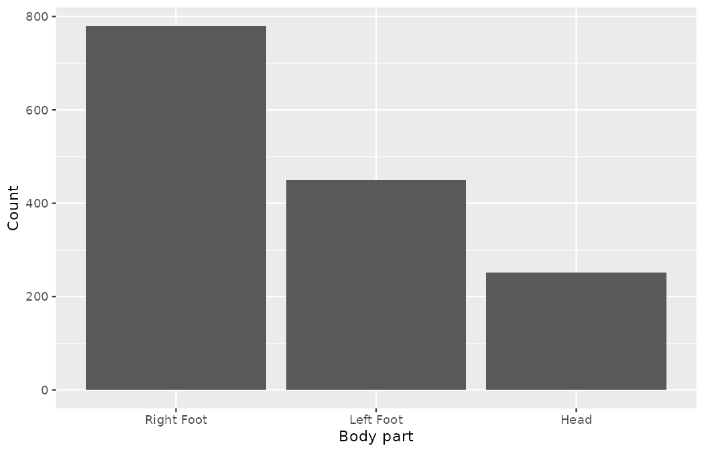{fig-alt="A bar plot of shot counts by body part: the right-foot bar is tallest by a clear margin, the left-foot bar reaches a bit under two thirds of its height, and the head bar is the shortest." width=85%}

{fig-alt="The same three bars on a proportion scale, making the shares explicit: 52.7 percent of shots right-footed, 30.3 percent left-footed, and 17.0 percent headers." width=85%}

Both plots show the same ordering: the right-foot bar is tallest by a clear margin, the left-foot bar reaches a bit under two thirds of its height, and the head bar is the shortest.
The proportion version makes the shares explicit — 52.7% of these shots were struck right-footed, 30.3% left-footed, and 17.0% were headers.
Only the axis changes between the two plots; the geometry of the bars is identical.

::: {.callout-tip title="Check your understanding"}
Roughly one shot in six at this World Cup was a header.
Does the bar plot of counts or the bar plot of proportions make that fact easier to read off, and why?

------------------------------------------------------------------------

The proportion plot: the head bar sits at 0.170 on a 0-to-1 scale, which translates directly to "about one in six."
From the count plot you would need to divide 252 by the total 1,481 yourself.
Counts and proportions carry the same information; the choice of scale determines which questions the reader can answer without arithmetic.
:::

## Visualizing two categorical variables

### Bar plots with two variables

We can display the distributions of two categorical variables on a bar plot concurrently.
Such plots are generally useful for visualizing the relationship between two categorical variables.
To have a second tournament in play — and to build a variable we will reuse for the rest of the book — we switch to the 2025 Women's Euro data and derive a *position group* for each shooter from the detailed `position` string: defenders (`DF`), midfielders (`MF`), and forwards (`FW`).
Define the mapping once, here, and reuse it verbatim whenever a chapter needs position groups:

```r
weuro2025_shots <- read_csv("data/derived/weuro2025_shots.csv")

weuro_pos <- weuro2025_shots |>
  mutate(
    pos_group = case_when(
      position == "Goalkeeper" ~ "GK",
      grepl("Back", position) ~ "DF",
      grepl("Midfield", position) ~ "MF",
      .default = "FW"
    )
  )

weuro_pos |>
  count(pos_group)
#> # A tibble: 4 × 2
#>   pos_group     n
#>   <chr>     <int>
#> 1 DF          155
#> 2 FW          418
#> 3 GK            2
#> 4 MF          338
```

The order of the `case_when()` clauses matters: a "Left Wing Back" is a defender, so the `Back` rule must fire before any rule that would catch "Wing."
Positions containing `Back` map to `DF`, positions containing `Midfield` map to `MF`, and everything remaining — wings, center forwards, strikers — maps to `FW`.
Two shots were taken by goalkeepers (both penalties, as it happens); two observations cannot support comparisons, so we drop them and note it, leaving 911 shots.

```r
weuro_pos <- weuro_pos |>
  filter(pos_group != "GK") |>
  mutate(
    pos_group = factor(pos_group, levels = c("FW", "MF", "DF")),
    shot_type = factor(shot_type, levels = c("Open Play", "Free Kick", "Penalty"))
  )

weuro_pos |>
  count(pos_group, shot_type) |>
  pivot_wider(names_from = shot_type, values_from = n, values_fill = 0)
#> # A tibble: 3 × 4
#>   pos_group `Open Play` `Free Kick` Penalty
#>   <fct>           <int>       <int>   <int>
#> 1 FW                402           4      12
#> 2 MF                308           6      24
#> 3 DF                141           1      13
```

The three plots below visualize the relationship between `pos_group` and `shot_type` in three different ways.

```r
# Stacked bar plot
ggplot(weuro_pos, aes(x = pos_group, fill = shot_type)) +
  geom_bar() +
  labs(x = "Position group", y = "Count", fill = "Shot type")

# Standardized bar plot
ggplot(weuro_pos, aes(x = pos_group, fill = shot_type)) +
  geom_bar(position = "fill") +
  labs(x = "Position group", y = "Proportion", fill = "Shot type")

# Dodged bar plot
ggplot(weuro_pos, aes(x = pos_group, fill = shot_type)) +
  geom_bar(position = "dodge") +
  labs(x = "Position group", y = "Count", fill = "Shot type")
```

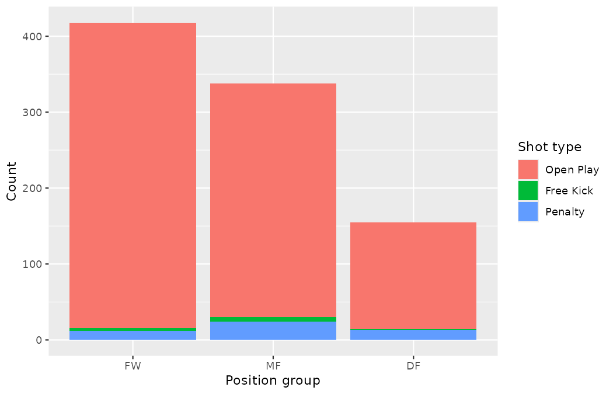{fig-alt="A stacked bar plot with one bar per position group and shot-type counts stacked within each bar: forwards take the most shots at 418, with the free-kick and penalty segments thin slivers perched on top of tall open-play blocks." width=85%}

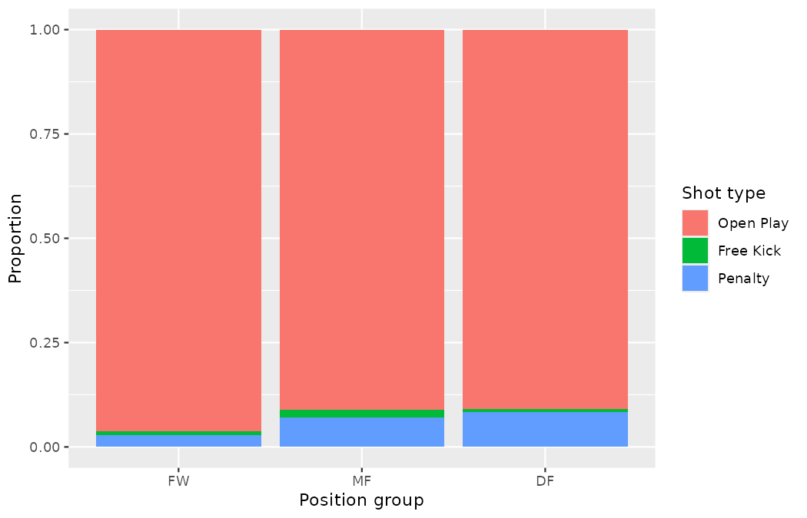{fig-alt="A standardized bar plot in which every position-group bar is stretched to height 1, so segments show proportions within each group; the penalty segment visibly widens from forwards to midfielders to defenders." width=85%}

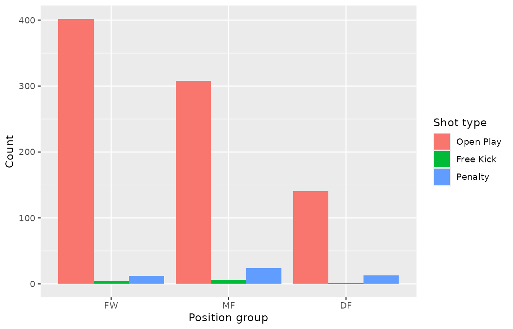{fig-alt="A dodged bar plot with shot-type bars standing side by side within each position group: open-play bars dominate every group, while the free-kick bars of 4, 6, and 1 shots are nearly invisible next to bars of 402 and 308." width=85%}

The first is a **stacked bar plot**: one bar per position group, with the shot-type counts stacked within each bar.
This plot most clearly displays that forwards take the most shots (418, against 338 for midfielders and 155 for defenders).
It is difficult to say, based on this plot alone, how the shot-type mix varies across position groups, because the free-kick and penalty segments are thin slivers perched on top of tall open-play blocks.

The second is a **standardized bar plot** (also known as a **filled bar plot**): every bar is stretched to height 1, so the segments show proportions within each position group.
The proportions behind it are worth printing:

```r
weuro_pos |>
  count(pos_group, shot_type) |>
  group_by(pos_group) |>
  mutate(proportion = n / sum(n))
#> # A tibble: 9 × 4
#> # Groups:   pos_group [3]
#>   pos_group shot_type     n proportion
#>   <fct>     <fct>     <int>      <dbl>
#> 1 FW        Open Play   402    0.962
#> 2 FW        Free Kick     4    0.00957
#> 3 FW        Penalty      12    0.0287
#> 4 MF        Open Play   308    0.911
#> 5 MF        Free Kick     6    0.0178
#> 6 MF        Penalty      24    0.0710
#> 7 DF        Open Play   141    0.910
#> 8 DF        Free Kick     1    0.00645
#> 9 DF        Penalty      13    0.0839
```

In the standardized plot the penalty segment visibly widens as you move from forwards (2.9% of their shots) to midfielders (7.1%) to defenders (8.4%).
Be careful before turning that gradient into a scouting claim about who clubs *choose* as penalty takers: most of this tournament's penalties were not in-game penalties at all, and splitting the kicks by whether they came in a period-5 shoot-out changes the story.

```r
weuro_pos |>
  filter(shot_type == "Penalty") |>
  mutate(setting = if_else(period == 5, "shoot-out", "in-game")) |>
  count(setting, pos_group) |>
  pivot_wider(names_from = pos_group, values_from = n)
#> # A tibble: 2 × 4
#>   setting      FW    MF    DF
#>   <chr>     <int> <int> <int>
#> 1 in-game       5     8     1
#> 2 shoot-out     7    16    12
```

Only 14 of the 49 outfield penalties were awarded in play, and those went almost entirely to attacking players — 13 of the 14 to forwards or midfielders, a single one to a defender — which is what "designated penalty taker" should look like.
The other 35 kicks came in shoot-outs, where five or more different players per team must step up, so the taker pool deepens by necessity: 12 of the 13 defender penalties in these data are shoot-out kicks (as were both penalties by the goalkeepers we dropped earlier).
The defenders' wide penalty segment is a shoot-out artifact, not evidence that clubs hand their spot kicks to center backs.
Since the proportions of shot types vary across the groups, we can conclude that the two variables are associated for this sample — but *why* they are associated took a third variable to see, echoing the lesson of @sec-data-applications.

The third is a **dodged bar plot**: the shot-type bars stand side by side within each position group.
This plot most clearly displays that open-play shots dominate every position group, and it makes the raw counts of all nine combinations easy to read — but the free-kick bars (4, 6, and 1) are nearly invisible next to bars of 402 and 308.

::: {.callout-note title="Worked example"}
Examine the three bar plots above.
When is the stacked, dodged, or standardized bar plot the most useful?

------------------------------------------------------------------------

The stacked bar plot is most useful when it's reasonable to assign one variable as the explanatory variable (here `pos_group`) and the other variable as the response (here `shot_type`), since we are effectively grouping by one variable first and then breaking it down by the other.

Dodged bar plots are more agnostic in their display about which variable, if any, represents the explanatory and which the response variable.
It is also easy to discern the number of cases in each of the nine different group combinations.
However, one downside is that it tends to require more horizontal space, and when two groups are of very different sizes — as we see for defenders (155 shots) relative to forwards (418) — it is difficult to discern whether there is an association between the variables.

The standardized bar plot is helpful if the primary variable in the stacked bar plot is relatively imbalanced — here, open play so dwarfs the set-piece categories that the simple stacked plot is nearly useless for checking an association.
The major downside of the standardized version is that we lose all sense of how many cases each of the bars represents: the defenders' bar looks just as authoritative as the forwards' bar, though it rests on far fewer shots.
:::

### Mosaic plots

A **mosaic plot** is a visualization technique suitable for contingency tables that resembles a standardized stacked bar plot with the benefit that we still see the relative group sizes of the primary variable as well.
The packages that draw mosaic plots automatically do nothing you cannot do yourself, and building one by hand makes its logic — *box areas are proportional to counts* — impossible to miss.

To get started, we break a square into columns, one for each position group, with column widths proportional to each group's share of the 911 shots.

```r
widths <- weuro_pos |>
  count(pos_group, name = "group_total") |>
  mutate(
    xmax = cumsum(group_total) / sum(group_total),
    xmin = xmax - group_total / sum(group_total)
  )

widths
#> # A tibble: 3 × 4
#>   pos_group group_total  xmax  xmin
#>   <fct>           <int> <dbl> <dbl>
#> 1 FW                418 0.459 0
#> 2 MF                338 0.830 0.459
#> 3 DF                155 1     0.830

ggplot(widths) +
  geom_rect(aes(xmin = xmin, xmax = xmax, ymin = 0, ymax = 1),
            fill = "grey60", color = "white", linewidth = 2) +
  geom_text(aes(x = (xmin + xmax) / 2, y = 0.5, label = pos_group)) +
  theme_void()
```

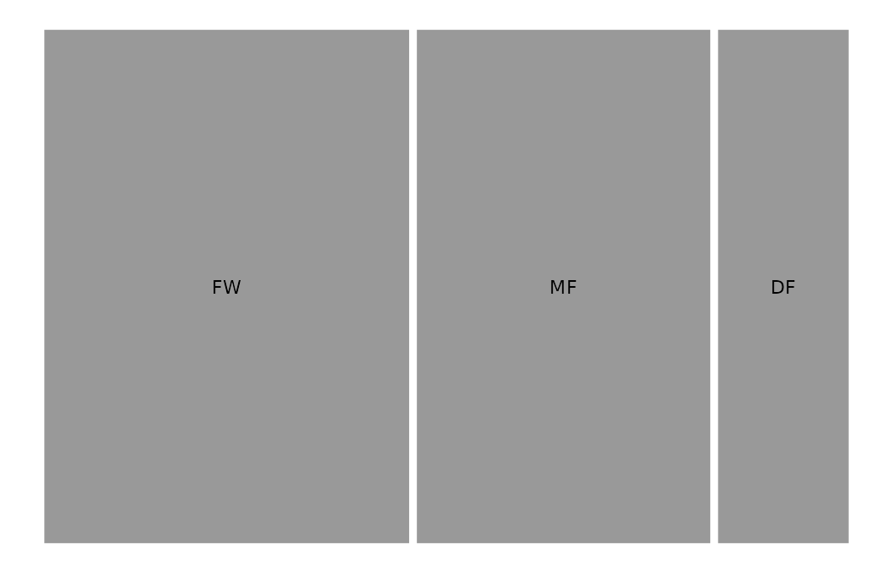{fig-alt="A square broken into three grey columns labeled FW, MF, and DF, with column widths proportional to each group's share of the 911 shots: the forwards' column occupies 45.9 percent of the width, the midfielders' 37.1 percent, and the defenders' a slim 17.0 percent." width=85%}

Each column represents a position group, and the column widths correspond to the proportion of shots from each group: the forwards' column occupies 45.9% of the square's width, the midfielders' 37.1%, and the defenders' a slim 17.0%.
There are visibly fewer shots by defenders than by forwards.
In general, mosaic plots use box *areas* to represent the number of cases in each category.

Next we split each column vertically, in proportion to that group's shot-type mix.

```r
mosaic_data <- weuro_pos |>
  count(pos_group, shot_type) |>
  left_join(widths, by = "pos_group") |>
  group_by(pos_group) |>
  mutate(
    ymax = cumsum(n) / group_total,
    ymin = ymax - n / group_total
  ) |>
  ungroup()

mosaic_data
#> # A tibble: 9 × 8
#>   pos_group shot_type     n group_total  xmax  xmin  ymax  ymin
#>   <fct>     <fct>     <int>       <int> <dbl> <dbl> <dbl> <dbl>
#> 1 FW        Open Play   402         418 0.459 0     0.962 0
#> 2 FW        Free Kick     4         418 0.459 0     0.971 0.962
#> 3 FW        Penalty      12         418 0.459 0     1     0.971
#> 4 MF        Open Play   308         338 0.830 0.459 0.911 0
#> 5 MF        Free Kick     6         338 0.830 0.459 0.929 0.911
#> 6 MF        Penalty      24         338 0.830 0.459 1     0.929
#> 7 DF        Open Play   141         155 1     0.830 0.910 0
#> 8 DF        Free Kick     1         155 1     0.830 0.916 0.910
#> 9 DF        Penalty      13         155 1     0.830 1     0.916

ggplot(mosaic_data) +
  geom_rect(
    aes(xmin = xmin, xmax = xmax, ymin = ymin, ymax = ymax, fill = shot_type),
    color = "white", linewidth = 2
  ) +
  labs(x = "Position group", y = "Proportion within group", fill = "Shot type")
```

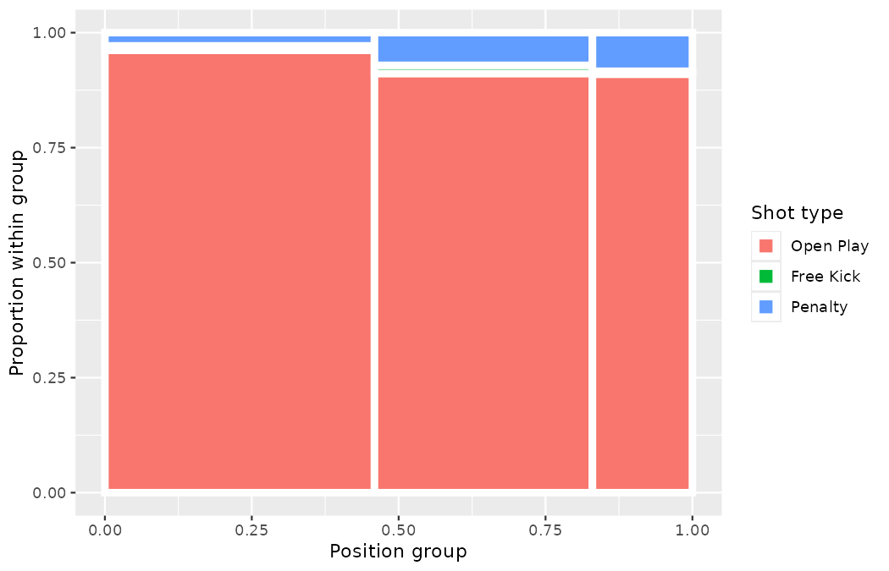{fig-alt="A mosaic plot with a column per position group, each split vertically in proportion to that group's shot-type mix: large lower open-play blocks with thin free-kick and penalty strips above, the penalty strip noticeably thicker in the defenders' column than in the forwards'." width=85%}

This mosaic plot displays the relationship between position group and shot type.
Each column is split proportionally to that group's shots of each type.
For example, the first column represents shots by forwards, and it is divided into open-play shots (the large lower block, reaching to 0.962) with thin free-kick and penalty strips above.
As another example, the top segment of the third column represents defenders' penalties, which reaches down to 0.916 — a noticeably thicker strip than the forwards' penalty strip.
We can again use this plot to see that the `pos_group` and `shot_type` variables are associated, since some columns are divided in different vertical locations than others, which was the same technique used for checking an association in the standardized bar plot.

In the mosaic above, we chose to first split by position group.
However, we could have instead first split by shot type.
Like with the bar plots, it's common to use the explanatory variable to represent the first split in a mosaic plot, and then for the response to break up each level of the explanatory variable — if these labels are reasonable to attach to the variables under consideration.

```r
widths2 <- weuro_pos |>
  count(shot_type, name = "group_total") |>
  mutate(
    xmax = cumsum(group_total) / sum(group_total),
    xmin = xmax - group_total / sum(group_total)
  )

mosaic_data2 <- weuro_pos |>
  count(shot_type, pos_group) |>
  left_join(widths2, by = "shot_type") |>
  group_by(shot_type) |>
  mutate(
    ymax = cumsum(n) / group_total,
    ymin = ymax - n / group_total
  ) |>
  ungroup()

ggplot(mosaic_data2) +
  geom_rect(
    aes(xmin = xmin, xmax = xmax, ymin = ymin, ymax = ymax, fill = pos_group),
    color = "white", linewidth = 2
  ) +
  labs(x = "Shot type", y = "Proportion within group", fill = "Position group")
```

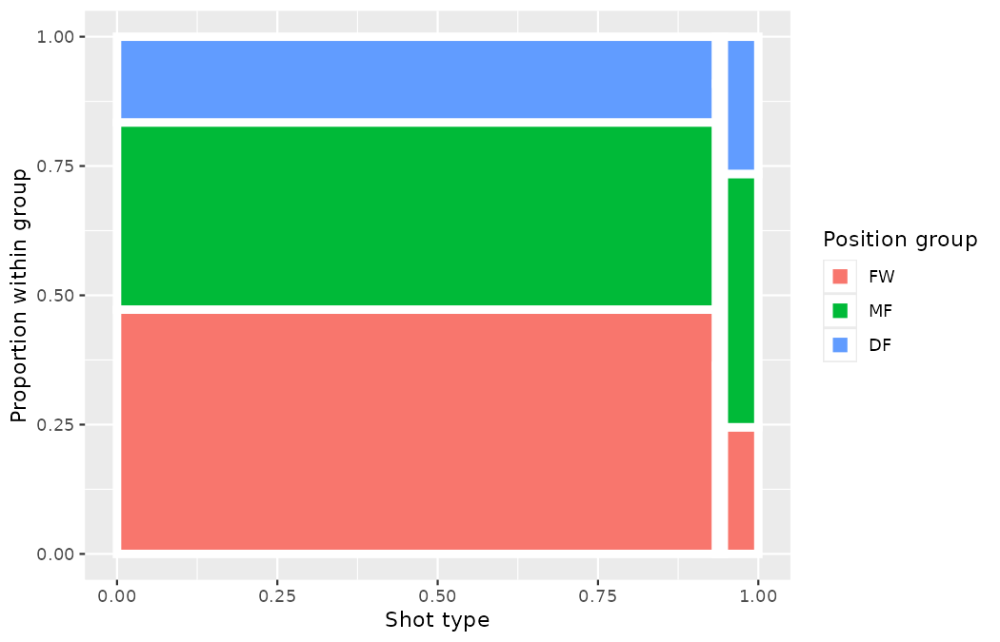{fig-alt="A flipped mosaic plot dominated by a single enormous open-play column covering 93.4 percent of the width, with a sliver for free kicks and a narrow penalty column whose internal split — midfielders 49.0 percent, defenders 26.5 percent, forwards 24.5 percent — inverts the open-play shares." width=85%}

The flipped mosaic is dominated by a single enormous open-play column ($851/911 = 93.4\%$ of the width), with a sliver for free kicks (1.2%) and a narrow penalty column (5.4%).
Within the penalty column, though, the split is striking: midfielders account for $24/49 = 49.0\%$ of outfield penalties, defenders $13/49 = 26.5\%$, and forwards only $12/49 = 24.5\%$ — the inverse of their open-play shares ($402/851 = 47.2\%$, $308/851 = 36.2\%$, $141/851 = 16.6\%$).

::: {.callout-tip title="Check your understanding"}
In the flipped mosaic, the "Penalty" column is narrow but its internal split differs sharply from the "Open Play" column's split.
What does that combination of features tell a scout, and which single feature of a mosaic plot communicates the "narrow" part?

------------------------------------------------------------------------

The differing splits say the variables are associated: *which* position group takes a shot depends on the shot type, with midfielders and defenders over-represented among penalty kicks relative to their open-play shares — driven, as we computed earlier in this section, by the shoot-outs that force the taker pool deep into the back line.
The narrowness — column *width*, which is proportional to the number of shots of that type — warns that the penalty pattern rests on only 49 shots, far fewer than the 851 open-play shots, so it is measured with much less precision.
Bar heights in a standardized bar plot cannot carry that warning; mosaic widths can.
:::

## Row and column proportions

In the previous sections we inspected visualizations of two categorical variables in bar plots and mosaic plots.
However, we have not discussed how the values in the bar and mosaic plots that show proportions are calculated.
In this section we will investigate the fractional breakdown of one variable in another, and we can modify our contingency table to provide such a view.
We return to the World Cup body-part data of @tbl-wc-bp-result-totals.
@tbl-wc-bp-row-proportions shows **row proportions** for @tbl-wc-bp-result-totals, which are computed as the counts divided by their row totals.
The value 102 at the intersection of goal and Right Foot is replaced by $102 / 192 = 0.531,$ i.e., 102 divided by its row total, 192.
So, what does 0.531 represent?
It corresponds to the proportion of *goals* that were struck with the right foot.

```r
wc_bp |>
  count(result, body_part) |>
  group_by(result) |>
  mutate(proportion = n / sum(n)) |>
  select(-n) |>
  pivot_wider(names_from = body_part, values_from = proportion)
#> # A tibble: 2 × 4
#> # Groups:   result [2]
#>   result  `Right Foot` `Left Foot`  Head
#>   <fct>          <dbl>       <dbl> <dbl>
#> 1 goal           0.531       0.323 0.146
#> 2 no goal        0.526       0.300 0.174
```

|         | Right Foot | Left Foot |  Head | Total |
|:--------|-----------:|----------:|------:|------:|
| goal    |      0.531 |     0.323 | 0.146 |  1.00 |
| no goal |      0.526 |     0.300 | 0.174 |  1.00 |

: A contingency table with row proportions for result and body part. {#tbl-wc-bp-row-proportions}

A contingency table of the **column proportions** is computed in a similar way, where each is computed as the count divided by the corresponding column total.
@tbl-wc-bp-column-proportions shows such a table, and here the value 0.111 indicates that 11.1% of headers were scored.
This rate is lower compared to shots with the right foot (13.1%) or the left foot (13.8%) — pooling the feet, $164/1229 = 13.3\%$ of footed shots became goals.
Because these rates vary between the three levels of `body_part` (`Right Foot`, `Left Foot`, `Head`), this provides evidence that the `result` and `body_part` variables may be associated.

```r
wc_bp |>
  count(result, body_part) |>
  group_by(body_part) |>
  mutate(proportion = n / sum(n)) |>
  select(-n) |>
  pivot_wider(names_from = body_part, values_from = proportion)
#> # A tibble: 2 × 4
#>   result  `Right Foot` `Left Foot`  Head
#>   <fct>          <dbl>       <dbl> <dbl>
#> 1 goal           0.131       0.138 0.111
#> 2 no goal        0.869       0.862 0.889

(102 + 62) / (780 + 449)
#> [1] 0.1334418
```

|         | Right Foot | Left Foot |  Head |
|:--------|-----------:|----------:|------:|
| goal    |      0.131 |     0.138 | 0.111 |
| no goal |      0.869 |     0.862 | 0.889 |
| Total   |       1.00 |      1.00 |  1.00 |

: A contingency table with column proportions for result and body part. {#tbl-wc-bp-column-proportions}

Row and column proportions can also be thought of as **conditional proportions** as they tell us about the proportion of observations in a given level of a categorical variable conditional on the level of another categorical variable.
The column proportion 0.111 is the proportion of shots that scored *conditional on* the shot being a header; the row proportion 0.146 is the proportion of shots that were headers *conditional on* the shot being a goal.
Same table, opposite conditioning — and, as the numbers show, not the same value.

We could also have checked for an association between `result` and `body_part` in @tbl-wc-bp-row-proportions using row proportions.
When comparing these row proportions, we would look down columns to see if the fraction of right-footed, left-footed, and headed shots varied between the goals and the non-goals: headers make up 14.6% of the goals but 17.4% of the non-goals.

Before moving on, a word of caution the data themselves force on us.
Do *not* read the header deficit — 11.1% versus 13.3% for feet — as "heading is a worse skill."
Recall the confounding lesson of @sec-data-design: headers overwhelmingly arrive from crosses and corners, contested and at awkward angles, so the *chance quality* differs systematically between the body parts.
The conditional proportions describe an association in observational data; they do not isolate a cause.

There is a second caution, cruder than confounding, which the book's penalty convention (recall @sec-data-applications) obliges us to show rather than bury: the two foot columns contain all 64 of the tournament's penalty kicks — footed by every taker, uncontested by law — and the header column contains none.

```r
wc_bp |>
  filter(shot_type == "Open Play") |>
  mutate(body = if_else(body_part == "Head", "Head", "Foot")) |>
  group_by(body) |>
  summarize(shots = n(), goals = sum(goal), conversion = mean(goal))
#> # A tibble: 2 × 4
#>   body  shots goals conversion
#>   <chr> <int> <int>      <dbl>
#> 1 Foot   1117   119      0.107
#> 2 Head    252    28      0.111
```

Restricted to open play, footed conversion drops to $119/1117 = 0.107,$ *below* the headers' $28/252 = 0.111$ (unchanged, since every header in the data is an open-play shot) — so most of the header "deficit" in @tbl-wc-bp-column-proportions was penalty kicks, not heading.
Whenever a conditional proportion involves a group that penalties can only fall on one side of, this book will show the comparison penalties in and penalties out.

::: {.callout-tip title="Check your understanding"}
What does 0.323 represent in @tbl-wc-bp-row-proportions?
What does 0.138 represent in @tbl-wc-bp-column-proportions?

------------------------------------------------------------------------

0.323 represents the proportion of goals that were struck with the left foot.
0.138 represents the proportion of left-footed shots that were scored.
:::

::: {.callout-tip title="Check your understanding"}
What does 0.174 represent in @tbl-wc-bp-row-proportions?
What does 0.889 represent in @tbl-wc-bp-column-proportions?

------------------------------------------------------------------------

0.174 represents the fraction of non-goals that were headers.
0.889 represents the fraction of headers that did not result in a goal.
:::

::: {.callout-note title="Worked example"}
Scouts and analysts use statistics to build shot-danger filters.
By noting specific characteristics of a shot as it is logged, an analyst may be able to classify some shots as likely goals or likely non-goals with reasonable accuracy.
One such characteristic is whether the shooter was under defensive pressure at the moment of the strike.
We'll focus on the `under_pressure` and `goal` variables of the full `wc2022_shots` data; these variables are summarized in a contingency table below.
Which would be more helpful to a scout hoping to predict shot outcomes from this table: row or column proportions?

```r
wc_press <- wc2022_shots |>
  mutate(
    pressure = if_else(under_pressure, "under pressure", "not under pressure"),
    result = factor(if_else(goal, "goal", "no goal"), levels = c("goal", "no goal"))
  )

wc_press |>
  count(result, pressure) |>
  pivot_wider(names_from = pressure, values_from = n)
#> # A tibble: 2 × 3
#>   result  `not under pressure` `under pressure`
#>   <fct>                  <int>            <int>
#> 1 goal                     171               24
#> 2 no goal                 1085              214
```

|         | not under pressure | under pressure | Total |
|:--------|-------------------:|---------------:|------:|
| goal    |                171 |             24 |   195 |
| no goal |              1,085 |            214 | 1,299 |
| Total   |              1,256 |            238 | 1,494 |

: A contingency table for result and pressure at the 2022 Men's World Cup. {#tbl-wc-pressure-count}

------------------------------------------------------------------------

A scout watching a shot unfold knows whether the shooter is under pressure *before* knowing the outcome, so the useful direction is: how does the proportion of goals change within each pressure state?
With `result` as the rows, that corresponds to the *column* proportions of @tbl-wc-pressure-count — the proportion of pressured shots that score, and the proportion of unpressured shots that score.

```r
wc_press |>
  count(pressure, result) |>
  group_by(pressure) |>
  mutate(proportion = n / sum(n))
#> # A tibble: 4 × 4
#> # Groups:   pressure [2]
#>   pressure           result      n proportion
#>   <chr>              <fct>   <int>      <dbl>
#> 1 not under pressure goal      171      0.136
#> 2 not under pressure no goal  1085      0.864
#> 3 under pressure     goal       24      0.101
#> 4 under pressure     no goal   214      0.899
```

A smaller fraction of pressured shots are scored ($24/238 = 10.1\%$) compared to unpressured shots ($171/1256 = 13.6\%$).
This information on its own is insufficient to classify a shot as goal or no goal — about 90% of shots miss in *both* groups.
Yet, when we carefully combine this information with many other characteristics, we stand a reasonable chance of building a useful shot-danger model, which is essentially what the `statsbomb_xg` variable is.
This example points out that row and column proportions are not equivalent.
Before settling on one form for a table, it is important to consider each to ensure that the most useful table is constructed.

Hold on to this particular 3.5-percentage-point gap.
Whether a difference of $0.101$ versus $0.136$ could plausibly be produced by chance alone is *exactly* the question we will learn to answer in @sec-foundations-randomization, where this same under-pressure split becomes the chapter's central permutation test — run both with and without the 64 penalties sitting in the unpressured pile, per the book's penalty convention.
For now we can only say the two variables appear associated in this sample.
:::

::: {.callout-note title="Worked example"}
Look back to @tbl-wc-bp-row-proportions and @tbl-wc-bp-column-proportions.
Are there any obvious scenarios where one might be more useful than the other?

------------------------------------------------------------------------

Here, unlike the loan-style examples where neither direction is privileged, the two variables do have a natural explanatory-response ordering: the body part is fixed the moment the ball arrives, and the result follows.
Usually it is most useful to "condition" on the explanatory variable — so the column proportions of @tbl-wc-bp-column-proportions, the conversion rate within each body part, are what a scout would quote.
The row proportions answer a different, retrospective question ("of the tournament's goals, what share were headers?"), which is useful for describing how goals were manufactured, but not for judging any one shot as it happens.
When no explanatory-response direction is reasonable to attach — say, `first_time` and `under_pressure` — neither table is automatically more useful, and it is worth computing both.
:::

## Pie charts

A **pie chart** is shown below alongside a bar plot representing the same information.
Pie charts can be useful for giving a high-level overview to show how a set of cases break down.
However, it is also difficult to decipher certain details in a pie chart.
For example, the right-foot slice is obviously the biggest, but judging *how much* bigger the left-foot share is than the header share (30.3% versus 17.0%) takes real effort in the pie chart, while the bar plot hands you the comparison directly.

```r
# Pie chart: a stacked bar of counts, wrapped around a circle
wc_bp |>
  count(body_part) |>
  ggplot(aes(x = "", y = n, fill = body_part)) +
  geom_col(width = 1, color = "white") +
  coord_polar(theta = "y") +
  theme_void() +
  labs(fill = "Body part", title = "Body part")

# Bar plot of the same counts
ggplot(wc_bp, aes(x = body_part, fill = body_part)) +
  geom_bar(show.legend = FALSE) +
  labs(x = "Body part", y = "Count")
```

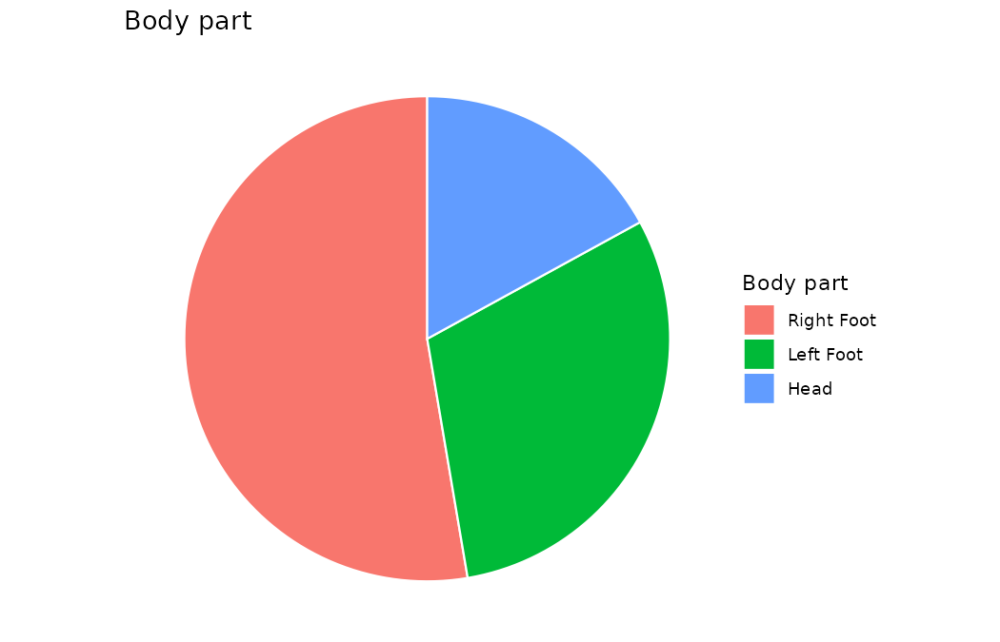{fig-alt="A pie chart of body part with three slices: the right-foot slice is obviously the biggest, but judging how much bigger the left-foot share is than the header share takes real effort." width=85%}

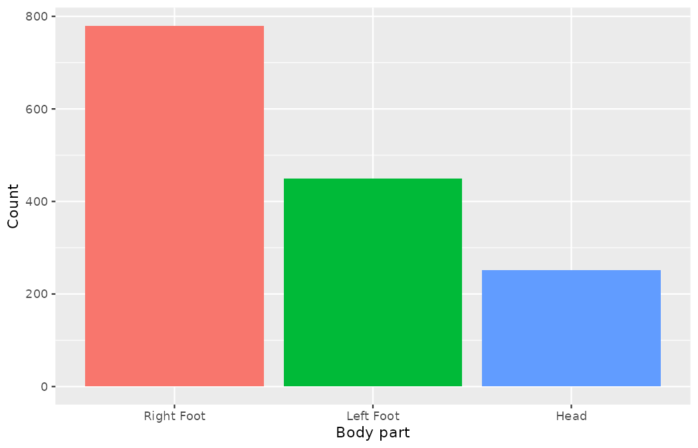{fig-alt="A bar plot of the same body-part counts, which hands the reader the left-foot versus header comparison directly through aligned bar lengths." width=85%}

Note what the pie-chart code reveals: in ggplot2 a pie chart *is* a single stacked bar transformed into polar coordinates — `coord_polar(theta = "y")` wraps the count axis around a circle.
The pie chart has no axes at all; every judgment the reader makes is a judgment about angles and areas, which human eyes handle far less accurately than the aligned lengths of a bar plot.

Pie charts can work well when the goal is to visualize a categorical variable with very few levels, and especially if each level represents a simple fraction (e.g., one-half, one-quarter, etc.) — "just over half of these shots were right-footed" survives the polar transformation.
However, they can be quite difficult to read when they are used to visualize a categorical variable with many levels.
The `play_pattern` variable of `wc2022_shots` has nine levels, and it makes the point brutally.

```r
wc2022_shots |>
  count(play_pattern, sort = TRUE) |>
  mutate(proportion = n / sum(n))
#> # A tibble: 9 × 3
#>   play_pattern       n proportion
#>   <chr>          <int>      <dbl>
#> 1 Regular Play     446     0.299
#> 2 From Throw In    298     0.199
#> 3 From Free Kick   285     0.191
#> 4 From Corner      223     0.149
#> 5 From Goal Kick    80     0.0535
#> 6 Other             68     0.0455
#> 7 From Counter      56     0.0375
#> 8 From Keeper       21     0.0141
#> 9 From Kick Off     17     0.0114
```

```r
# Pie chart of nine play patterns
wc2022_shots |>
  count(play_pattern, sort = TRUE) |>
  mutate(play_pattern = reorder(play_pattern, -n)) |>
  ggplot(aes(x = "", y = n, fill = play_pattern)) +
  geom_col(width = 1, color = "white") +
  coord_polar(theta = "y") +
  theme_void() +
  labs(fill = "Play pattern", title = "Play pattern")

# Sorted bar plot of the same counts
wc2022_shots |>
  count(play_pattern, sort = TRUE) |>
  mutate(play_pattern = reorder(play_pattern, n)) |>
  ggplot(aes(x = n, y = play_pattern)) +
  geom_col() +
  labs(x = "Count", y = "Play pattern")
```

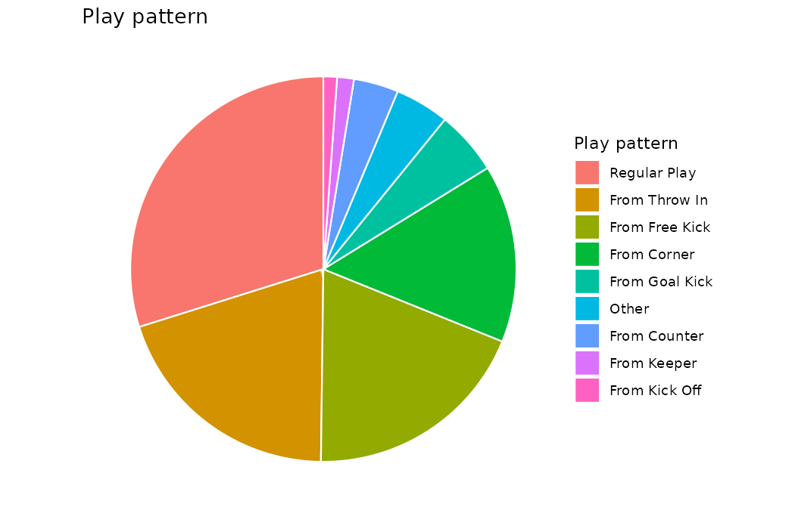{fig-alt="A pie chart of nine play patterns in which the throw-in and free-kick slices are essentially indistinguishable and the smallest slices blur into an unreadable fringe of near-identical wedges." width=85%}

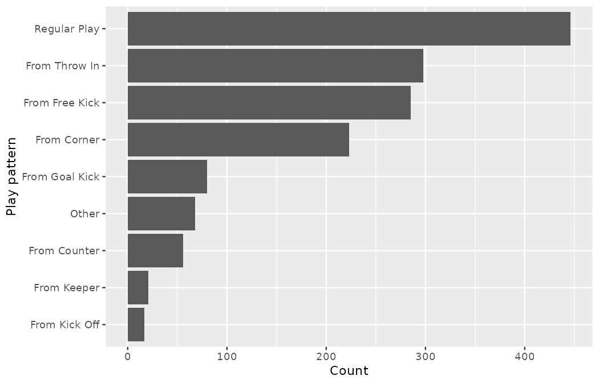{fig-alt="A sorted horizontal bar plot of the same nine play-pattern counts, with the full ordering legible at a glance from Regular Play's 446 shots down to the 17 shots from kick-off possessions." width=85%}

In the pie chart, the slices for shots from throw-in possessions (19.9%) and from free-kick possessions (19.1%) are essentially indistinguishable — twelve shots apart in 1,494 — and the four smallest slices (goal kicks, "other", counters, keeper distributions, kick-offs) blur into an unreadable fringe of near-identical wedges.
In the sorted bar plot, the full ordering is legible at a glance, right down to the 17 shots that arrived within a possession started at kick-off.
In this case, it is far easier to compare the counts of each play pattern using the bar plot than the pie chart.
If Marta Vidal ever asks whether the club's opponents generate more shots from throw-ins or free kicks, do not answer her with a pie.

## Waffle charts

Another useful technique of visualizing categorical data is a **waffle chart**.
Waffle charts can be used to communicate the proportion of the data that falls into each level of a categorical variable.
Just like with pie charts, they work best when the number of levels represented is low.
However, unlike pie charts, they can make it easier to compare proportions that represent non-simple fractions.
The idea: a $10 \times 10$ grid of 100 squares, each square representing 1% of the data, colored by level.
No dedicated package is needed — like the mosaic plot, a waffle is a computation we can do ourselves, which keeps the logic visible: count, convert to shares, round to squares, tile.

```r
waffle_bp <- wc_bp |>
  count(body_part) |>
  mutate(share = n / sum(n), squares = round(share * 100))

waffle_bp
#> # A tibble: 3 × 4
#>   body_part      n share squares
#>   <fct>      <int> <dbl>   <dbl>
#> 1 Right Foot   780 0.527      53
#> 2 Left Foot    449 0.303      30
#> 3 Head         252 0.170      17

waffle_bp |>
  uncount(squares) |>
  mutate(idx = row_number() - 1, col = idx %% 10, row = idx %/% 10) |>
  ggplot(aes(x = col, y = row, fill = body_part)) +
  geom_tile(color = "white", linewidth = 1.5) +
  coord_equal() +
  theme_void() +
  labs(fill = NULL, title = "Body part")
```

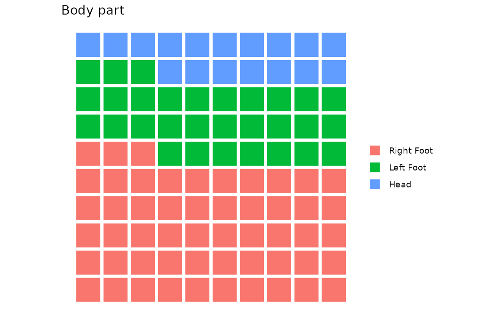{fig-alt="A 10-by-10 waffle chart of 100 squares colored by body part, each square representing 1 percent of the shots: 53 right-foot squares, 30 left-foot squares, and 17 header squares." width=85%}

Here `uncount(squares)` replicates each row of `waffle_bp` once per square, and the arithmetic on `idx` lays the squares into a 10-wide grid.
Two operators do that tiling work: `%%` is the remainder after whole-number division, so `idx %% 10` cycles 0 through 9 and gives each square its column, while `%/%` is whole-number division with the remainder discarded, so `idx %/% 10` ticks up by one after every ten squares and gives the row.
The rounded squares happen to sum to exactly 100 here $(53 + 30 + 17)$; with other data the roundings can sum to 99 or 101, in which case you must add or remove a square from the level with the largest rounding error — a detail the packaged waffle functions handle silently, and one worth having tripped over once yourself.
Reading the chart, "53 squares out of 100" is a count, not an angle: comparing 30 left-foot squares against 17 header squares is a matter of counting rows, which is precisely the non-simple-fraction comparison the pie chart fumbled.

A second waffle, this time for the Women's Euro position groups defined earlier in this chapter:

```r
waffle_pos <- weuro_pos |>
  count(pos_group) |>
  mutate(share = n / sum(n), squares = round(share * 100))

waffle_pos
#> # A tibble: 3 × 4
#>   pos_group     n share squares
#>   <fct>     <int> <dbl>   <dbl>
#> 1 FW          418 0.459      46
#> 2 MF          338 0.371      37
#> 3 DF          155 0.170      17

waffle_pos |>
  uncount(squares) |>
  mutate(idx = row_number() - 1, col = idx %% 10, row = idx %/% 10) |>
  ggplot(aes(x = col, y = row, fill = pos_group)) +
  geom_tile(color = "white", linewidth = 1.5) +
  coord_equal() +
  theme_void() +
  labs(fill = NULL, title = "Position group")
```

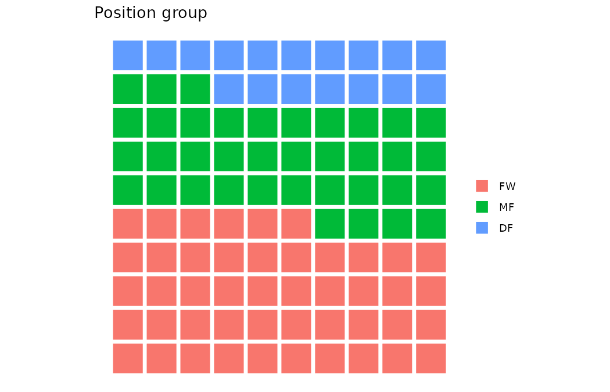{fig-alt="A 10-by-10 waffle chart of the Women's Euro position groups: 46 forward squares, visibly short of a half-grid, with midfielders and defenders splitting the rest roughly two-to-one at 37 and 17 squares." width=85%}

Again the squares sum to 100 $(46 + 37 + 17).$
Forwards took a touch under half the tournament's outfield shots — 46 squares, visibly short of a half-grid — while midfielders and defenders split the rest roughly two-to-one.

::: {.callout-tip title="Check your understanding"}
A colleague wants a single chart showing the nine-level `play_pattern` distribution and suggests a waffle chart, "since waffles are better than pies."
Is the waffle likely to fix the problem?

------------------------------------------------------------------------

No.
The waffle's advantage over the pie is *within-comparison precision* (counting squares beats judging angles), but both share the same weakness: with many levels, small categories become tiny scattered patches of color that are hard to distinguish.
Shots from keeper distributions would get one square and kick-offs one square, in nine competing colors.
The number of levels, not the shape of the chart, is the problem — the sorted bar plot remains the right tool.
:::

::: {.callout-note title="The fast version: reading a numerical distribution"}
The plots in the section below describe a *numerical* variable, and they speak a vocabulary whose proper chapter is still ahead of you.
Here is the fast version, one sentence per tool.

-   A *histogram* divides the variable's range into equal-width bins and draws one bar per bin: the height of each bar counts the observations landing in that bin.
-   A *mode* is a prominent peak in the distribution — a stretch of values where the observations pile up.
-   The *median* is the middle value: half the observations sit below it and half above.
-   The *quartiles* cut off the middle half of the data, and the box in a box plot spans exactly that middle half — from the value with a quarter of the observations below it to the value with a quarter above — with the median drawn as the line inside.
-   The *whiskers* extend from the box out to the most distant observations still within ordinary range, and any points plotted individually beyond them are *outliers*, observations unusually far from the rest.
-   A distribution is *right skewed* when a long, thin tail stretches out toward the larger values on the right.

Each of these gets its full treatment in [Chapter -@sec-explore-numerical]; this box is just enough to read the pictures below.
:::

## Comparing numerical data across groups

Some of the more interesting investigations can be considered by examining numerical data across groups.
In this section we will expand on a few methods we have already seen to make plots for numerical data from multiple groups on the same graph, as well as introduce a few new methods for comparing numerical data across groups.

We will revisit the full `wc2022_shots` dataset and compare the chance quality — the `statsbomb_xg` variable — for shots that were scored versus shots that were not.
A caution before we start: `goal` is the outcome that xG models are built to anticipate, and these are observational data besides, so nothing in this section demonstrates *why* any shot went in.
What the comparison does tell a scout is descriptive and valuable: how different, in distribution, are the chances that become goals from the chances that do not — and whether the difference is a shift, a change of shape, or both.

Of the 1,494 shots at the 2022 Men's World Cup, 195 were goals and 1,299 were not.
The table below shows a small random sample of four shots from each group, drawn with a seed so you can reproduce it.

```r
wc_result <- wc2022_shots |>
  mutate(result = factor(if_else(goal, "goal", "no goal"), levels = c("goal", "no goal")))

set.seed(401)
wc_result |>
  select(player, team, statsbomb_xg, result) |>
  group_by(result) |>
  slice_sample(n = 4) |>
  arrange(result, statsbomb_xg)
#> # A tibble: 8 × 4
#> # Groups:   result [2]
#>   player                            team        statsbomb_xg result
#>   <chr>                             <chr>              <dbl> <fct>
#> 1 Craig Goodwin                     Australia         0.191  goal
#> 2 Davy Klaassen                     Netherlands       0.348  goal
#> 3 Lionel Andrés Messi Cuccittini    Argentina         0.488  goal
#> 4 Teun Koopmeiners                  Netherlands       0.784  goal
#> 5 Abdelkarim Hassan Al Haj Fadlalla Qatar             0.0234 no goal
#> 6 Axel Witsel                       Belgium           0.0253 no goal
#> 7 Robert Lewandowski                Poland            0.0332 no goal
#> 8 Nicolás Alejandro Tagliafico      Argentina         0.0518 no goal
```

Even in a sample of eight, the pattern that will dominate this section is visible: the four goals carry far more chance quality than the four non-goals, and one of the goals sits at the penalty value — stored as $0.7835,$ printed as $0.784$ by the three-significant-digit display — which we will meet again shortly.

Color can be used to split histograms (see @sec-histograms for an introduction to histograms) for numerical variables by levels of a categorical variable.
An example of this is shown in the first plot below.
The **side-by-side box plot** is another traditional tool for comparing across groups.
An example is shown in the second plot, where there are two box plots (see @sec-boxplots for an introduction to box plots), one for each group, placed into one plotting window and drawn on the same scale.

```r
ggplot(wc_result, aes(x = statsbomb_xg, fill = result)) +
  geom_histogram(binwidth = 0.05, alpha = 0.5) +
  labs(x = "Chance quality (xG)", y = NULL, fill = "Result")

ggplot(wc_result, aes(x = statsbomb_xg, y = result, color = result)) +
  geom_boxplot() +
  labs(x = "Chance quality (xG)", y = NULL, color = "Result")
```

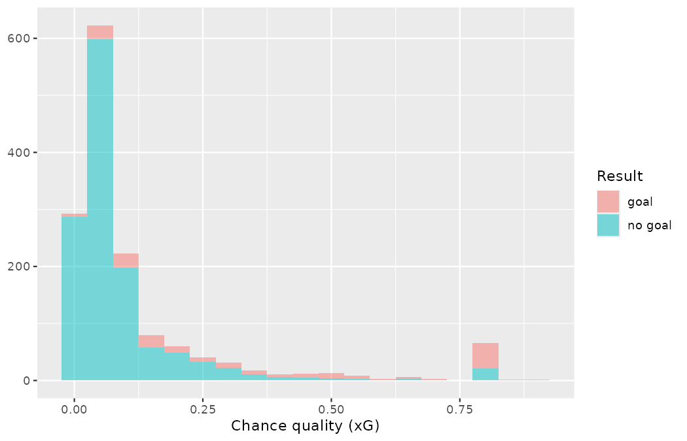{fig-alt="A color-split histogram of chance quality by result: the no-goal distribution is a tall spike hugging zero with a long, thin right tail, while the goal distribution is lower and far more spread out, with a second unmistakable peak near 0.78 — the penalty spot." width=85%}

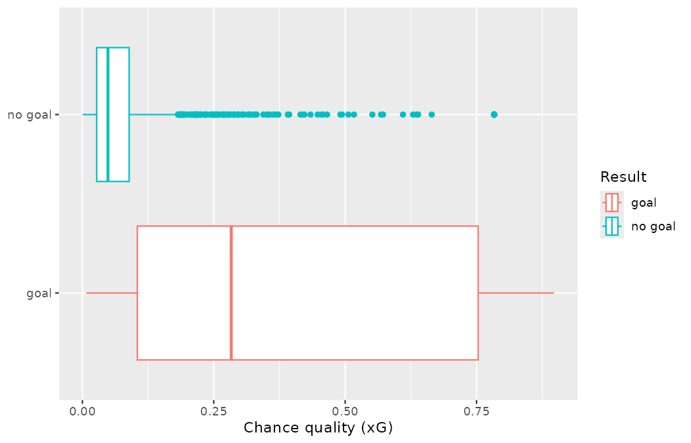{fig-alt="Side-by-side box plots of chance quality for goals and non-goals on the same scale: the goal group's box is far wider and centered much higher, and many observations sit as outlier dots above the no-goal group's upper whisker." width=85%}

The numerical summaries behind the plots:

```r
wc_result |>
  group_by(result) |>
  summarize(
    shots = n(),
    mean_xg = mean(statsbomb_xg),
    median_xg = median(statsbomb_xg),
    q1 = quantile(statsbomb_xg, 0.25),
    q3 = quantile(statsbomb_xg, 0.75)
  )
#> # A tibble: 2 × 6
#>   result  shots mean_xg median_xg     q1     q3
#>   <fct>   <int>   <dbl>     <dbl>  <dbl>  <dbl>
#> 1 goal      195  0.373     0.283  0.105  0.753
#> 2 no goal  1299  0.0887    0.0486 0.0271 0.0890
```

In the histogram, the no-goal distribution is a tall spike hugging zero — 1,010 of the 1,299 misses carry less than $0.1$ xG — with a long, thin right tail, plus a small isolated bump near $0.78.$
The goal distribution is lower and far more spread out, with its own concentration at low xG (45 of the 195 goals came from chances under $0.1$) and a second, unmistakable peak in the bin covering $0.775$–$0.825,$ holding 45 goals.
That second peak has a name: the penalty spot.
All 64 World Cup penalties in these data are assigned an identical stored chance quality of $0.7835$ (recall from @sec-data-applications that displays round it to $0.783$ or $0.784$), and 43 of them were scored — so penalties plant a spike at $0.7835$ in the goal group and a smaller one (the 21 misses) in the no-goal group.

```r
wc2022_shots |>
  filter(shot_type == "Penalty") |>
  summarize(n = n(), mean_xg = mean(statsbomb_xg), goals = sum(goal))
#> # A tibble: 1 × 3
#>       n mean_xg goals
#>   <int>   <dbl> <int>
#> 1    64   0.784    43
```

Whenever you plot tournament xG, decide consciously whether to keep penalties (and explain the spike, as we do here) or to filter to `shot_type == "Open Play"` and say so; silently leaving the spike for your reader to puzzle over is the worst of both options.

::: {.callout-tip title="Check your understanding"}
Use the plots and summaries above to compare chance quality across the two groups.
What do you notice about the approximate center of each group?
What do you notice about the variability between groups?
Is the shape relatively consistent between groups?
How many *prominent* modes are there for each group?

------------------------------------------------------------------------

The goals come from far better chances on average: the median xG of a scored shot is about $0.28,$ versus about $0.05$ for a shot that was not scored.
The variability is also dramatically larger for the goal group — the middle half of the goal group spans from about $0.11$ to $0.75$ of xG, roughly ten times the span of the middle half of the no-goal group ($0.03$ to $0.09$).
Both distributions are strongly right skewed with their tallest peak near zero, but the shapes are not identical: the goal group has two prominent modes — the low-xG peak and the penalty spike at $0.7835$ — while the no-goal group has one prominent mode near zero (its penalty bump of 21 shots is barely visible against 1,299).
The box plots indicate there are many observations far above the upper whisker in the no-goal group; with over a thousand shots piled near zero, chances of even moderate quality register as outliers.
:::

::: {.callout-tip title="Check your understanding"}
What components of each plot — the color-split histogram and the side-by-side box plot — do you find most useful?

------------------------------------------------------------------------

The side-by-side box plots are especially useful for comparing centers and spreads at a glance, and they make the huge gap in medians impossible to miss.
The histograms are more useful for seeing distribution shape, skew, and modes — the penalty spike at $0.7835$ is obvious in the histogram and completely invisible in the box plot, which is a reminder that a box plot compresses a distribution down to five-ish numbers.
:::

Another useful visualization for comparing numerical data across groups is a **ridge plot**, which combines density plots (see @sec-boxplots for an introduction to density plots) for various groups drawn on the same scale in a single plotting window.

```r
library(ggridges)

ggplot(wc_result, aes(x = statsbomb_xg, y = result, fill = result, color = result)) +
  geom_density_ridges(alpha = 0.5) +
  labs(x = "Chance quality (xG)", y = NULL, fill = "Result", color = "Result")
```

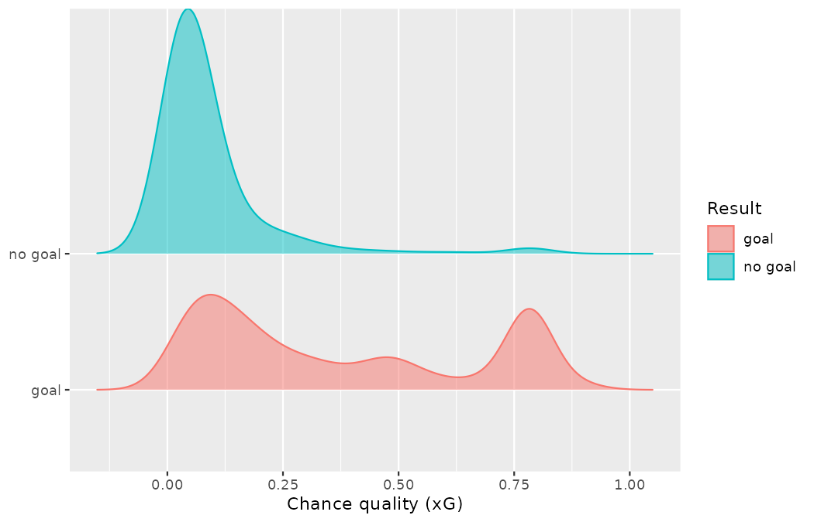{fig-alt="A ridge plot of chance quality for goals and non-goals: the no-goal ridge rises into a single sharp peak just above zero and decays quickly, while the goal ridge is flatter and wider, with its main peak at low xG and a clear second hump around 0.78." width=85%}

The no-goal ridge rises into a single sharp peak just above zero and decays quickly.
The goal ridge is flatter and wider, with its main peak also at low xG and a clear second hump around $0.78$ — the penalty spike again, now rendered as a bump in a smooth curve.

::: {.callout-tip title="Check your understanding"}
What components of the ridge plot do you find most useful compared to the histogram and box plot?

------------------------------------------------------------------------

The ridge plot gives us a better sense of the shape, and especially the modality, of each group's distribution: the bimodality of the goal group reads instantly as two humps.
One caution specific to ridge plots: each ridge is scaled separately, so — like the standardized bar plot earlier in this chapter — the plot hides the fact that one group (1,299 non-goals) has nearly seven times the observations of the other (195 goals).
:::

One last visualization technique we'll highlight for comparing numerical data across groups is **faceting**.
In this technique we split (facet) the graphical display of the data across plotting windows based on groups.
The first plot below displays the same information as the color-split histogram, however here the distributions of xG for goals and non-goals are faceted across two plotting windows, preserving the same scale on the x and y axes for easier comparison.
An advantage of this approach is that it extends to splitting the data across levels of two categorical variables, which allows for displaying relationships between three variables.
For the second categorical variable we bring in the second tournament: we stack the two shot datasets, apply the position-group mapping defined earlier in this chapter to both, and facet by `result` and `competition` simultaneously.

```r
both <- bind_rows(wc2022_shots, weuro2025_shots) |>
  mutate(
    pos_group = case_when(
      position == "Goalkeeper" ~ "GK",
      grepl("Back", position) ~ "DF",
      grepl("Midfield", position) ~ "MF",
      .default = "FW"
    )
  ) |>
  filter(pos_group != "GK") |>
  mutate(
    pos_group = factor(pos_group, levels = c("FW", "MF", "DF")),
    result = factor(if_else(goal, "goal", "no goal"), levels = c("goal", "no goal"))
  )

both |>
  count(competition)
#> # A tibble: 2 × 2
#>   competition     n
#>   <chr>       <int>
#> 1 wc2022       1494
#> 2 weuro2025     911
```

Dropping the two goalkeeper penalties again (there were no goalkeeper shots at the men's World Cup) leaves $1494 + 911 = 2405$ shots.

```r
# Facet by one variable: result
ggplot(both, aes(x = statsbomb_xg, fill = result)) +
  geom_histogram(binwidth = 0.05, show.legend = FALSE) +
  facet_grid(result ~ .) +
  labs(x = "Chance quality (xG)", y = NULL)

# Facet by two variables: result and competition
ggplot(both, aes(x = statsbomb_xg, fill = result)) +
  geom_histogram(binwidth = 0.05, show.legend = FALSE) +
  facet_grid(result ~ competition) +
  labs(x = "Chance quality (xG)", y = NULL)
```

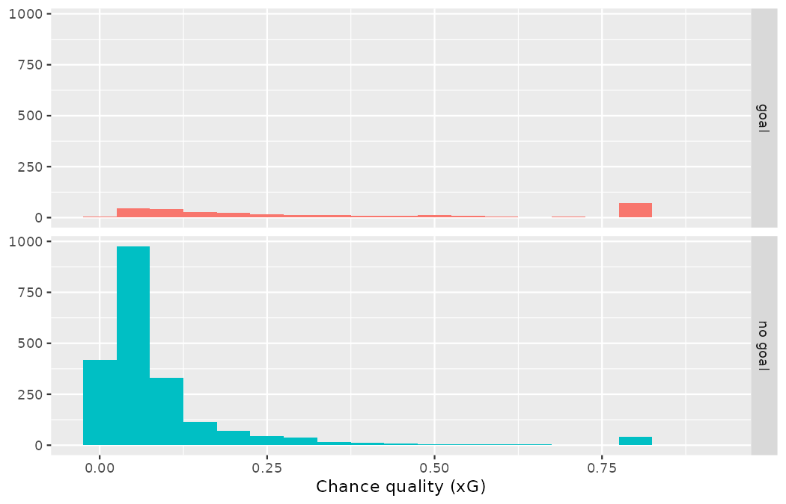{fig-alt="Histograms of chance quality faceted into two vertically stacked panels by result, goals above and non-goals below, preserving the same x and y scales for easier comparison." width=85%}

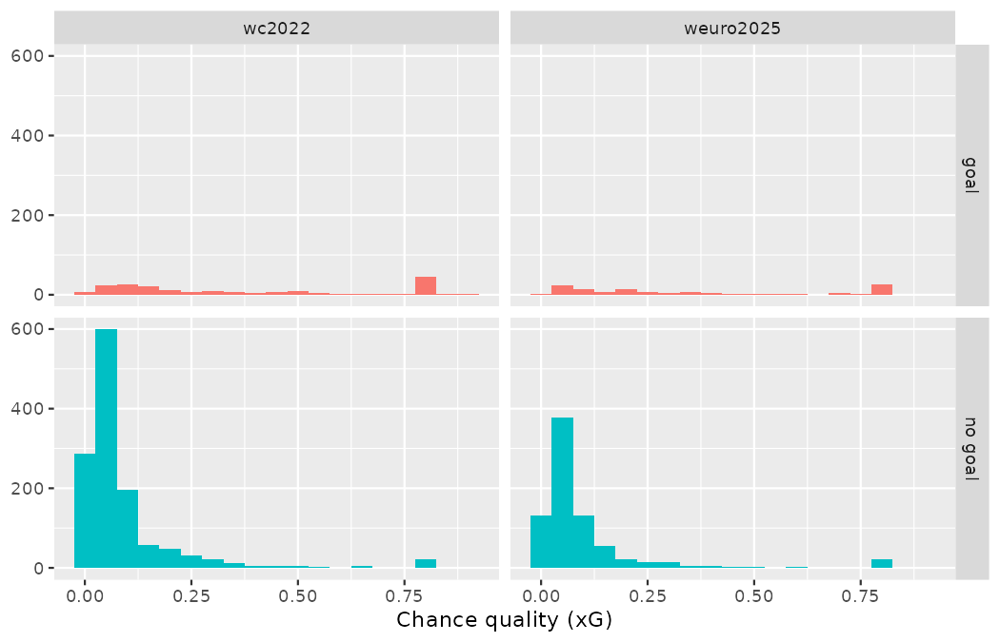{fig-alt="A four-panel grid of chance-quality histograms faceted by result and competition: each no-goal panel is a spike at zero with a long tail, and each goal panel is flatter, right skewed, and shows the penalty bump — the same pattern in both competitions." width=85%}

In the four-panel figure:

-   top left represents 2022 World Cup shots that were goals,
-   top right represents 2025 Women's Euro shots that were goals,
-   bottom left represents World Cup shots that were *not* goals, and finally
-   bottom right represents Women's Euro shots that were *not* goals.

The reassuring finding is replication: the pattern is the same in both competitions.
Each no-goal panel is a spike at zero with a long tail; each goal panel is flatter, right skewed, and shows the penalty bump (penalties carry the same stored xG of $0.7835$ in the Women's Euro data as well).

We can continue building upon this visualization to add one more variable, the position group of the shooter.
In the ridge plot below, we represent `pos_group` on the vertical axis within each panel, so a single figure now relates four variables: chance quality, result, competition, and position group.

```r
ggplot(both, aes(x = statsbomb_xg, y = pos_group, fill = pos_group, color = pos_group)) +
  geom_density_ridges(alpha = 0.5) +
  facet_grid(result ~ competition) +
  labs(x = "Chance quality (xG)", y = NULL, fill = "Position group", color = "Position group")
```

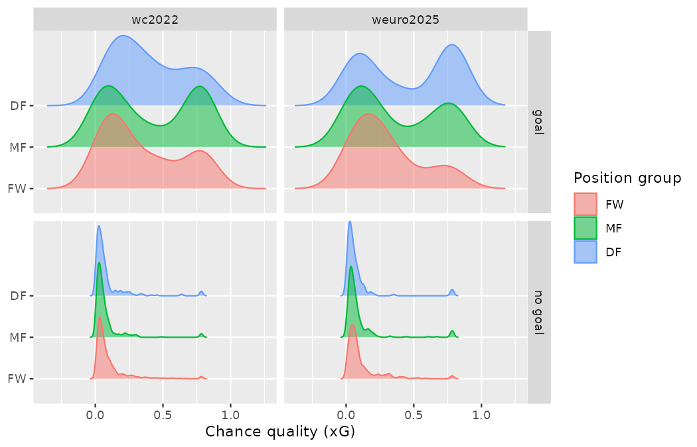{fig-alt="A ridge plot faceted by result and competition, with position group on the vertical axis within each panel, relating four variables at once: chance quality, result, competition, and position group." width=85%}

::: {.callout-tip title="Check your understanding"}
Based on the four-variable ridge plot, what can you say about how chance quality varies depending on result, competition, and position group?
The group medians below will help you calibrate what the ridges show.

```r
both |>
  group_by(competition, result, pos_group) |>
  summarize(shots = n(), median_xg = median(statsbomb_xg), .groups = "drop")
#> # A tibble: 12 × 5
#>    competition result  pos_group shots median_xg
#>    <chr>       <fct>   <fct>     <int>     <dbl>
#>  1 wc2022      goal    FW          127    0.235
#>  2 wc2022      goal    MF           47    0.348
#>  3 wc2022      goal    DF           21    0.358
#>  4 wc2022      no goal FW          605    0.0570
#>  5 wc2022      no goal MF          439    0.0426
#>  6 wc2022      no goal DF          255    0.0438
#>  7 weuro2025   goal    FW           60    0.224
#>  8 weuro2025   goal    MF           45    0.251
#>  9 weuro2025   goal    DF           17    0.424
#> 10 weuro2025   no goal FW          358    0.0643
#> 11 weuro2025   no goal MF          293    0.0529
#> 12 weuro2025   no goal DF          138    0.0435
```

------------------------------------------------------------------------

Two patterns hold in *both* competitions.
First, regardless of position group, the goal panels sit far to the right of the no-goal panels: every position group's scored shots have median xG above $0.22,$ while every group's unscored shots have median xG below $0.07.$
Second, within the goal panels, forwards' goals come from the *lowest*-quality chances (median xG $0.235$ at the World Cup, $0.224$ at the Euro), while midfielders' and defenders' goals concentrate at higher xG — midfielders take most penalties, and defenders score largely from close-range set-piece chances.
Treat the defender ridges in the goal panels with care, though: they rest on only 21 and 17 goals, so their shapes are the least stable in the figure — the width warning from the mosaic plot, in a new costume.
:::

::: {.callout-important title="Why not a table of twelve medians instead?"}
Notice that the honest reading of the four-variable figure required the twelve group medians printed alongside it.
Multivariate plots and small summary tables are collaborators, not rivals: the plot shows shape and makes cross-panel comparison instant; the table pins down the values and the group sizes.
A scouting report that contains only one of the two is half a report.
:::

## Chapter review {#sec-chp4-review}

### Summary

Fluently working with categorical variables is an important skill for a scouting analyst — position groups, body parts, play patterns, and shot results will follow you through every chapter of this book.
In this chapter we have introduced different visualizations and numerical summaries applied to categorical variables.
The graphical visualizations are even more descriptive when two variables are presented simultaneously.
We presented bar plots (stacked, standardized, and dodged), mosaic plots, pie charts, waffle charts, and estimations of conditional proportions — and we closed by comparing a numerical variable, chance quality, across the levels of categorical variables with side-by-side box plots, ridge plots, and faceting.
Two threads to carry forward: conditional proportions run in two directions and you must choose the direction that matches the question; and every association found in these observational tables — headers versus feet, pressure versus none — awaits the formal treatment of chance that begins in @sec-foundations-randomization.

### Terms

The terms introduced in this chapter are presented below, alphabetized.
If you're not sure what some of these terms mean, we recommend you go back in the text and review their definitions.
You should be able to easily spot them as **bolded text**.

|  |  |  |
|:-----------------------|:-----------------------|:----------------------|
| bar plot | faceting | row totals |
| column proportions | filled bar plot | side-by-side box plot |
| column totals | mosaic plot | stacked bar plot |
| conditional proportions | pie chart | standardized bar plot |
| contingency table | ridge plot | waffle chart |
| dodged bar plot | row proportions |  |

: Terms introduced in this chapter. {#tbl-terms-chp-04}

## Exercises {#sec-chp4-exercises}

Answers to odd-numbered exercises can be found in [Appendix -@sec-exercise-solutions-04]. Final answers to the even-numbered exercises are in [Appendix -@sec-appendix-even-answers].

::: {.exercises}

:::

------------------------------------------------------------------------

Adapted from *Introduction to Modern Statistics* by Çetinkaya-Rundel & Hardin (CC BY-SA 4.0); this adaptation is likewise CC BY-SA 4.0. Match data: StatsBomb open data.
