# Exploring numerical data {#sec-explore-numerical}

::: {.chapterintro}
This chapter focuses on exploring **numerical** data using summary statistics and visualizations.
The summaries and graphs presented in this chapter are created using statistical software; however, since this might be your first exposure to the concepts, we take our time in this chapter to detail how to create them.
Mastery of the content presented in this chapter will be crucial for understanding the methods and techniques introduced in the rest of the book — a scout who cannot read a distribution of chance quality cannot read a striker.
:::

Consider the `statsbomb_xg` variable from the `shots50` dataset, which records the chance quality — the expected-goals value — for each of 50 shots from the 2022 Men's World Cup.

This variable is numerical since we can sensibly discuss the numerical difference between the quality of two chances: a shot at 0.30 xG is a better chance than one at 0.05 xG, and the difference of 0.25 means something.
On the other hand, shirt numbers are not numerical: the number 9 shirt is not "two better" than the number 7 shirt.
Shirt numbers, like match identifiers, are categorical variables that happen to be written with digits.

Throughout this chapter, we will apply numerical methods using the `shots50` sample and the full tournament datasets, which were introduced in @sec-data-basics.
If you'd like to review the variables in the shot data, return to the data dictionary there.

::: {.callout-note title="Data"}
All real data in this chapter are read from the derived StatsBomb open-data files in `data/derived/`: `wc2022_shots.csv` (1,494 shots from the 2022 Men's World Cup) and `weuro2025_shots.csv` (913 shots from the 2025 Women's Euro).
Every code block below can be run from the repository root to reproduce every number quoted in the prose.
:::

The chapter's working sample is rebuilt with exactly the code that created it in @sec-data-basics:

```r
library(dplyr)
library(readr)
library(tidyr)
library(ggplot2)

wc2022_shots <- read_csv("data/derived/wc2022_shots.csv")

set.seed(101)
shots50 <- wc2022_shots |> slice_sample(n = 50)
```

## Scatterplots for paired data {#sec-scatterplots}

A **scatterplot** provides a case-by-case view of data for two numerical variables.
Before drawing one, be explicit — as we insisted in @sec-data-hello — about what the observational unit is.
In the team-level scatterplot drawn below, the observational unit is a *team*: we aggregate the 1,494 World Cup shots into one row per team, recording how many shots each team took and how many goals it scored across the tournament.

```r
team_totals <- wc2022_shots |>
  group_by(team) |>
  summarize(shots = n(), goals = sum(goal))

team_totals |>
  arrange(desc(shots)) |>
  slice_head(n = 5)
#> # A tibble: 5 × 3
#>   team      shots goals
#>   <chr>     <int> <int>
#> 1 Argentina   110    23
#> 2 France      106    18
#> 3 Brazil       99    10
#> 4 Croatia      87    15
#> 5 Germany      68     6
```

```r
ggplot(team_totals, aes(x = shots, y = goals)) +
  geom_point(alpha = 0.6, shape = 21, size = 3) +
  labs(x = "Shots taken in the tournament", y = "Goals scored")
```

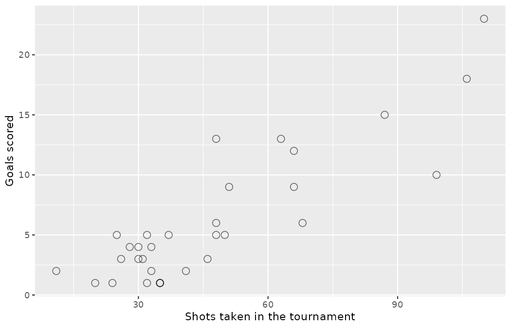{fig-alt="A scatterplot of 32 points, one per team, of goals scored against shots taken in the tournament. The relationship is clearly positive, with Argentina in the far top-right corner at 110 shots and 23 goals and Costa Rica in the bottom-left with 11 shots." width=85%}

In any scatterplot, each point represents a single case.
Since there are 32 teams in `team_totals`, there are 32 points in the scatterplot.
The relationship is clearly positive: teams that generate more shots score more goals.
Argentina, the eventual champions, sit in the far top-right corner with 110 shots and 23 goals; Costa Rica sit in the bottom-left with just 11 shots across their three matches.
Per the book's convention of flagging penalty and shoot-out kicks wherever they matter (recall @sec-data-applications), note that these totals count period-5 shoot-out kicks as shots — Argentina's 110 and 23 include 9 shoot-out kicks, 8 of them converted — so the deep-run teams' points are pushed up and to the right partly by the shoot-outs their draws forced.
Notice also that the points are not glued to a line — Brazil took 99 shots but scored only 10 goals, while Croatia scored 15 from 87.
That vertical scatter around the trend is, in scouting terms, finishing over- and under-performance, and it will get a starring role when we fit lines in @sec-model-slr.

A scatterplot need not show a straight-line trend to be useful.
For a second example, we change the observational unit again: this time each case is a *minute on the match clock*.
StatsBomb's `minute` variable runs continuously, with the second half starting at minute 45, so we first convert each shot's minute into "minutes into its half" and then count shots per clock minute across the regulation halves of all 64 matches (dropping the 86 shots from extra time and penalty shoot-outs, periods 3 to 5).

```r
shots_by_clock <- wc2022_shots |>
  filter(period <= 2) |>
  mutate(clock = if_else(period == 2, minute - 45, minute)) |>
  count(clock, name = "shots")

ggplot(shots_by_clock, aes(x = clock, y = shots)) +
  geom_point(alpha = 0.6, shape = 21, size = 3) +
  geom_smooth(linetype = "dashed", se = FALSE) +
  labs(
    x = "Minutes into the half",
    y = "Shots across all regulation halves"
  )
```

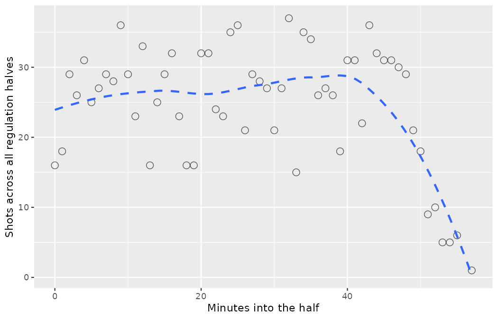{fig-alt="A scatterplot of shot counts per minute-of-the-half with a dashed smoothing line: counts bounce around a roughly constant level through the regulation 45 minutes and the first few added minutes, then fall away steeply as fewer halves last that long — an evidently nonlinear pattern." width=85%}

::: {.callout-note title="Worked example"}
The plot drawn by the code above shows the number of shots logged in each minute-of-the-half, pooled across both halves of all 64 matches.
What can be said about the relationship between these variables?

------------------------------------------------------------------------

The relationship is evidently **nonlinear**, as highlighted by the dashed smoothing line.
Shot counts bounce around a roughly constant level — between about 15 and 37 shots per minute — throughout the regulation 45 minutes and even hold that level through the first three or four added minutes, and then fall away steeply: 21 shots in minute 49, 9 in minute 51, and a single shot at minute 57, because progressively fewer halves last that long.
A straight line would be a terrible description of this pattern.
This is different from the team-level shots-versus-goals scatterplot, which showed very little, if any, curvature in its trend.
:::

::: {.callout-tip title="Check your understanding"}
What do scatterplots reveal about the data, and how are they useful?

------------------------------------------------------------------------

Answers may vary.
Scatterplots are helpful in quickly spotting associations relating variables, whether those associations come in the form of simple trends or whether those relationships are more complex — for a scout, they are the fastest way to see whether two aspects of performance move together.
:::

::: {.callout-tip title="Check your understanding"}
Describe two variables that would have a horseshoe-shaped association in a scatterplot $(\cap$ or $\frown).$

------------------------------------------------------------------------

Consider the case where your vertical axis represents something "good" and your horizontal axis represents something that is only good up to a point.
A player's age and their transfer value fit this description: value tends to rise through a player's early twenties, peak in the mid-twenties, and decline thereafter.
Weekly training load and match-day sprint performance work too: too little load leaves a player undercooked, too much leaves them fatigued or injured.
:::

## Dot plots and the mean {#sec-dotplots}

Sometimes we are interested in the distribution of a single variable.
In these cases, a dot plot provides the most basic of displays.
A **dot plot** is a one-variable scatterplot; an example using the chance quality of the 50 shots in `shots50` is drawn by the code below.

```r
ggplot(shots50, aes(x = statsbomb_xg)) +
  geom_dotplot(binwidth = 0.02) +
  labs(x = "Chance quality (xG)", y = NULL) +
  theme(
    axis.text.y = element_blank(),
    axis.ticks.y = element_blank()
  )
```

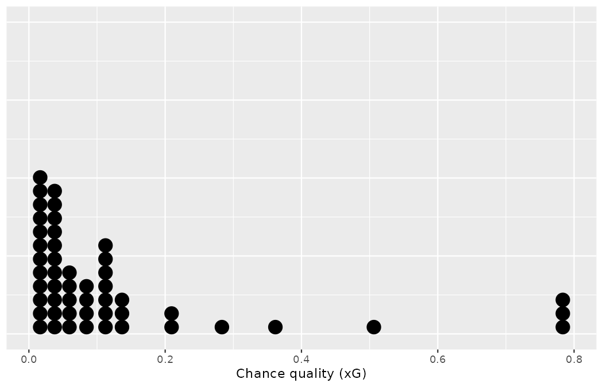{fig-alt="A dot plot of the chance quality of the 50 sampled shots: the dots pile up heavily below 0.10 xG, thin out quickly to the right, and three isolated dots sit far out at 0.78." width=85%}

The dots pile up heavily below 0.10 xG, thin out quickly to the right, and three isolated dots sit far out at 0.78 — we will meet those three shots again shortly.

The **mean**, often called the **average**, is a common way to measure the center of a **distribution** of data.
To compute the mean chance quality, we add up all 50 xG values and divide by the number of observations:

```r
shots50 |>
  summarize(n = n(), mean_xg = mean(statsbomb_xg))
#> # A tibble: 1 × 2
#>       n mean_xg
#>   <int>   <dbl>
#> 1    50   0.127
```

The sample mean is often labeled $\bar{x}.$
Take the symbol apart before using it: the letter $x$ is a generic placeholder for the variable of interest — here, a shot's xG value — and the bar drawn over the $x$ (read "x-bar") communicates that we have averaged those values.
For these 50 shots, $\bar{x} = 0.127$ xG.
It is useful to think of the mean as the balancing point of the distribution: if the dot plot were a plank with the dots as weights, it would balance at 0.127.

::: {.callout-important title="Mean"}
The sample mean can be calculated as the sum of the observed values divided by the number of observations:

$$ \bar{x} = \frac{x_1 + x_2 + \cdots + x_n}{n} $$
:::

Three more pieces of notation appear in that formula, and each deserves a plain-words reading before we move on.
The subscript in $x_1$ indexes *which observation* we mean: $x_1$ is the first shot's xG value, $x_2$ the second's.
The letter $n$ denotes the *sample size* — the number of observations we have.
And the general symbol $x_i$ uses the placeholder index $i$ to stand for "the $i^{th}$ observation, whichever one we happen to be pointing at."

::: {.callout-tip title="Check your understanding"}
Examine the equation for the mean.
What does $x_1$ correspond to?
And $x_2$?
Can you infer a general meaning to what $x_i$ might represent?

------------------------------------------------------------------------

$x_1$ corresponds to the chance quality of the first shot in the sample, $x_2$ to the second shot's chance quality, and $x_i$ corresponds to the xG value of the $i^{th}$ shot in the dataset.
For example, if $i = 4,$ then we are examining $x_4,$ which refers to the fourth shot in the dataset.
:::

::: {.callout-tip title="Check your understanding"}
What was $n$ in this sample of shots?

------------------------------------------------------------------------

The sample size was $n = 50.$
:::

The `shots50` dataset is a random sample from a larger population of shots — the full 2022 World Cup.
We could compute a mean for the entire population in the same way as the sample mean.
However, the population mean has a special label: $\mu.$
The symbol $\mu$ is the Greek letter *mu* (pronounced "mew") and represents the average of all observations in the population.
Sometimes a subscript, such as $_x,$ is used to represent which variable the population mean refers to, e.g., $\mu_x.$
Oftentimes it is too expensive — or, for a scout, physically impossible — to measure the population mean precisely: nobody watches every shot in every league.
So we typically estimate $\mu$ using the sample mean, $\bar{x}.$

::: {.callout-note title="Worked example"}
Although a scout in the stands cannot *calculate* the average chance quality across all shots of a tournament from the handful they saw, they can *estimate* it using their sample.
Based on the sample of 50 shots, what would be a reasonable estimate of $\mu_x,$ the mean xG of all shots in the tournament?

------------------------------------------------------------------------

The sample mean, 0.127, provides a rough estimate of $\mu_x.$
While it is not perfect, this is our single best guess — our **point estimate** — of the average chance quality of all the shots in the population under study.
In @sec-foundations-randomization and beyond, we will develop tools to characterize the accuracy of point estimates, like the sample mean.
As you might have guessed, point estimates based on larger samples tend to be more accurate than those based on smaller samples.

Our data grant us a luxury a working scout rarely has: the population is fully logged, so we can check.

```r
wc2022_shots |>
  summarize(n = n(), mean_xg = mean(statsbomb_xg))
#> # A tibble: 1 × 2
#>       n mean_xg
#>   <int>   <dbl>
#> 1  1494   0.126
```

The true tournament mean is $\mu_x = 0.126$ xG per shot — our 50-shot point estimate of 0.127 landed remarkably close.
Do not expect to be so lucky every time; quantifying how lucky is the business of @sec-foundations-randomization.
:::

The mean is useful because it allows us to rescale or standardize a metric into something more easily interpretable and comparable.
Suppose Priya Rao, Northbridge United's lead data analyst, wants to know whether a newly designed scout-report template produces fewer factual errors than the club's standard template.
This is a constructed Northbridge scenario, but the arithmetic trap it illustrates is one analysts fall into weekly.
A trial of 1,500 player evaluations is set up, where 500 evaluations are filed on the new template and 1,000 on the standard template in the comparison group.
Data-quality staff then count every factual error (wrong club, wrong foot, misattributed goal) in each batch:

```r
template_trial <- tribble(
  ~metric,                  ~`new template`, ~`standard template`,
  "Evaluations filed",                  500,                 1000,
  "Total factual errors",               200,                  300
)

template_trial
#> # A tibble: 2 × 3
#>   metric               `new template` `standard template`
#>   <chr>                         <dbl>               <dbl>
#> 1 Evaluations filed               500                1000
#> 2 Total factual errors            200                 300
```

Comparing the raw counts of 200 to 300 errors would make it appear that the new template is better, but this is an artifact of the imbalanced group sizes.

Instead, we should look at the average number of errors per evaluation in each group:

-   New template: $200 / 500 = 0.4$ errors per evaluation
-   Standard template: $300 / 1000 = 0.3$ errors per evaluation

The standard template has a *lower* average number of errors per evaluation than the new template.
The raw counts pointed in exactly the wrong direction.

::: {.callout-note title="Worked example"}
Come up with another example where the mean is useful for making comparisons.

------------------------------------------------------------------------

Emil Sørensen, Northbridge's head of scouting, reviews the travel logs of his regional scouts at the end of each season.
One scout covered 11,000 km of travel across 625 logged working hours.
The scout's average distance per working hour puts that workload into a standard unit that can be compared across the whole 48-scout network:

$$ \frac{11000\text{ km}}{625\text{ hours}} = 17.6\text{ km per hour} $$

By standardizing to kilometers per working hour, Emil can compare scouts assigned to compact city regions against scouts covering entire countries, something the raw totals hide.
:::

::: {.callout-note title="Worked example"}
Suppose we want to compute the average chance quality per shot across the whole 2022 World Cup.
Each team's showing in each match can be summarized as one row — a *team-match* — and it is tempting to average the per-team-match mean xG values.
What would be a better approach?

------------------------------------------------------------------------

Let us first build the team-match data, because we will use it many times in this book.
The code below aggregates `wc2022_shots` into one row per (match, team): the number of shots, the total and per-shot chance quality, the goals scored, and two mix shares — the proportion of shots taken under pressure and the proportion arising from dead-ball situations (corners, free kicks, and throw-ins).

```r
team_match <- wc2022_shots |>
  group_by(match_id, team) |>
  summarize(
    n_shots = n(),
    total_xg = sum(statsbomb_xg),
    goals = sum(goal),
    prop_under_pressure = mean(under_pressure),
    prop_set_piece = mean(play_pattern %in%
      c("From Corner", "From Free Kick", "From Throw In")),
    .groups = "drop"
  )

nrow(team_match)
#> [1] 127
```

Note the row count: 64 matches involve $64 \times 2 = 128$ team-matches, but `team_match` has only 127 rows.
Costa Rica registered *no shots at all* away to Spain in the 7--0 group-stage defeat, so that team-match simply has no shot rows to aggregate.
Keep this missing row in mind whenever you use `team_match`.

The `team_match` rows are special in that each row actually represents many individual shots — anywhere from 2 (the Netherlands, in one of their group games) to 31 (Germany, against Costa Rica).
If we were to simply average the per-team-match mean xG values, we would be treating a 2-shot outing and a 31-shot barrage equally in the calculations.
Instead, we should compute the total xG across all team-matches and divide by the total number of shots — which is exactly the pooled mean over all 1,494 shots.

```r
team_match |>
  summarize(
    unweighted = mean(total_xg / n_shots),
    pooled = sum(total_xg) / sum(n_shots)
  )
#> # A tibble: 1 × 2
#>   unweighted pooled
#>        <dbl>  <dbl>
#> 1      0.119  0.126
```

The pooled tournament mean is 0.126 xG per shot; the simple average of the 127 team-match means is only 0.119.
The two disagree because high-volume team-matches tend to feature slightly better average chances, and the simple average refuses to give them the extra weight their shot counts deserve.

This example used what is called a **weighted mean**: each team-match's mean was weighted by its number of shots.
:::

::: {.callout-tip title="Check your understanding"}
In the weighted-mean example, which teams' performances are *over-weighted* by the naive unweighted average of team-match means?

------------------------------------------------------------------------

Team-matches with very few shots — like Costa Rica's low-volume outings or the Netherlands' 2-shot match — count exactly as much as Germany's 31-shot performance in the unweighted average, so low-volume team-matches are over-weighted relative to their actual contribution to the tournament's shots.
:::

## Histograms and shape {#sec-histograms}

Dot plots show the exact value for each observation.
They are useful for small datasets but can become hard to read with larger samples — try dot-plotting all 1,494 World Cup shots.
Rather than showing the value of each observation, we prefer to think of the value as belonging to a *bin*.
For example, in the `shots50` sample, we can create a table of counts for the number of shots with chance quality between 0 and 0.1 xG, then the number with chance quality between 0.1 and 0.2, and so on.
Observations that fall on the boundary of a bin (e.g., exactly 0.10) are allocated to the lower bin.

```r
shots50 |>
  mutate(xg_bin = cut(statsbomb_xg, breaks = seq(0, 0.8, 0.1))) |>
  count(xg_bin, name = "shots", .drop = FALSE)
#> # A tibble: 8 × 2
#>   xg_bin    shots
#>   <fct>     <int>
#> 1 (0,0.1]      32
#> 2 (0.1,0.2]    10
#> 3 (0.2,0.3]     3
#> 4 (0.3,0.4]     1
#> 5 (0.4,0.5]     0
#> 6 (0.5,0.6]     1
#> 7 (0.6,0.7]     0
#> 8 (0.7,0.8]     3
```

The binned counts are plotted as bars by the code below into what is called a **histogram**.
Note that the histogram resembles a more heavily binned version of the stacked dot plot from @sec-dotplots.

```r
ggplot(shots50, aes(x = statsbomb_xg)) +
  geom_histogram(breaks = seq(0, 0.8, 0.1)) +
  labs(x = "Chance quality (xG)", y = "Count")
```

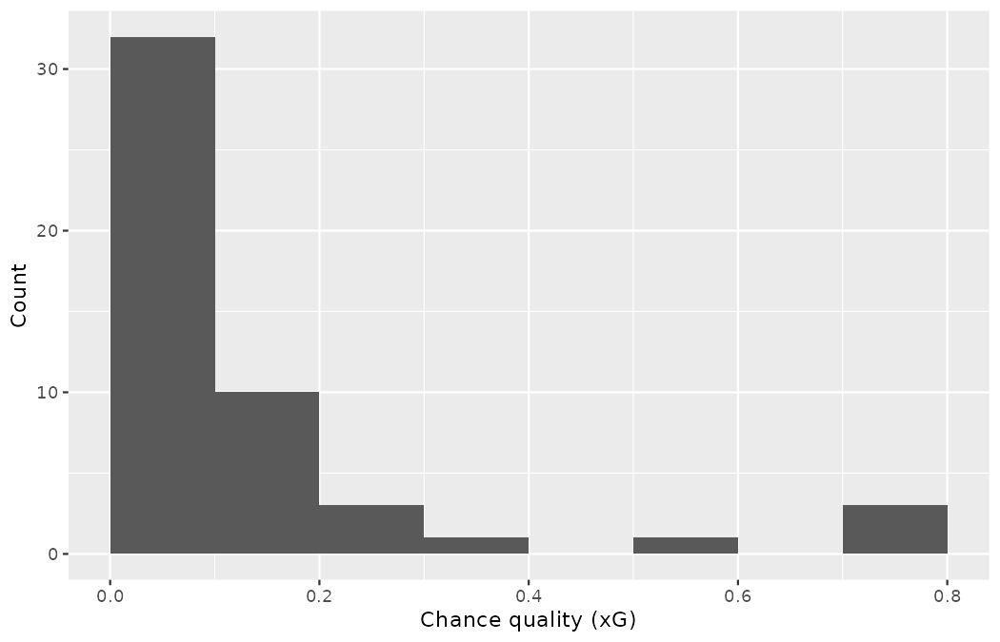{fig-alt="A histogram of the 50 chance qualities in bins of width 0.1: the leftmost bar holds 32 shots and the bars fall away quickly to the right, with only a handful of shots above 0.3 xG — a right-skewed shape." width=85%}

Histograms provide a view of the **data density**.
Higher bars represent where the data are relatively more common.
For instance, there are many more shots with chance quality between 0 and 0.1 xG — 32 of the 50, nearly two thirds — than shots between 0.2 and 0.3 in the sample.
The bars make it easy to see how the density of the data changes relative to the chance quality.

Histograms are especially convenient for understanding the shape of the data distribution.
The histogram suggests that most chances are of low quality, while only a handful of shots exceed 0.3 xG.
When the distribution of a variable trails off to the right in this way and has a longer right **tail**, the shape is said to be **right skewed**.[^ch5-skew]

[^ch5-skew]: Other ways to describe data that are right skewed: skewed to the right, skewed to the high end, or skewed to the positive end.

```r
ggplot(shots50, aes(x = statsbomb_xg)) +
  geom_density(fill = "grey60", alpha = 0.5) +
  labs(x = "Chance quality (xG)", y = "Density")
```

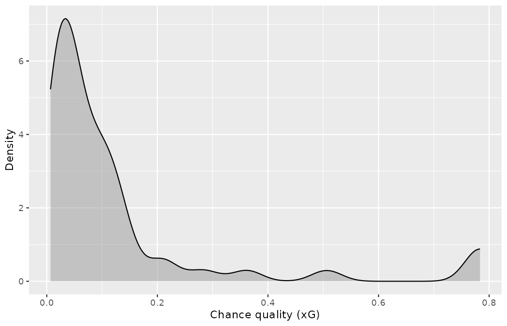{fig-alt="A density plot of the sample's chance quality: the curve rises to a single sharp peak near 0.03 xG, slides down a long right tail, and shows one last low bump out near 0.78 — the three penalties." width=85%}

The code above draws a **density plot**, which is a smoothed out histogram.
The technical details for how to draw density plots (precisely how to smooth out the histogram) are beyond the scope of this text, but you will note that the shape, scale, and spread of the observations are displayed similarly in a histogram as in a density plot.
For our sample, the density curve rises to a single sharp peak near 0.03 xG, slides down a long right tail, and shows one last low bump out near 0.78 — the three penalties again.

Variables with the reverse characteristic — a long, thinner tail to the left — are said to be **left skewed**.
We also say that such a distribution has a long left tail.
Variables that show roughly equal trailing off in both directions are called **symmetric**.
Left-skewed variables are rarer in shooting data than right-skewed ones, but they exist: think of the proportion of a season's matches a first-choice goalkeeper starts, which piles up near 1 with a thin tail of injury-hit seasons trailing left.

::: {.callout-important title="Long tails to identify skew"}
When data trail off in one direction, the distribution has a **long tail**.
If a distribution has a long left tail, it is left skewed.
If a distribution has a long right tail, it is right skewed.
:::

::: {.callout-tip title="Check your understanding"}
Besides the mean (since it was labeled), what can you see in the dot plot of the 50 chance qualities that you cannot see in their histogram?

------------------------------------------------------------------------

The chance quality of each individual shot.
The histogram tells you 32 shots fell below 0.1 xG; the dot plot still shows each one of them.
:::

In addition to looking at whether a distribution is skewed or symmetric, histograms can be used to identify modes.
A **mode** is represented by a prominent peak in the distribution.
There is only one prominent peak in the histogram of the `shots50` chance qualities.

A definition of *mode* sometimes taught in math classes is the value with the most occurrences in the dataset.
However, for many real-world datasets — xG values are recorded to many decimal places — it is common to have *no* observations with the same value in a dataset, making this definition impractical in data analysis.

The code below draws histograms that have one, two, or three prominent peaks.
Such distributions are called **unimodal**, **bimodal**, and **multimodal**, respectively.
Any distribution with more than two prominent peaks is called multimodal.
The three datasets are constructed — Priya keeps a set of these fabricated distributions on hand for training Northbridge's junior analysts — and the seeded code below rebuilds them exactly.

```r
set.seed(503)
constructed_modes <- tibble(
  metric_a = rchisq(65, 6),
  metric_b = c(rchisq(25, 5.8), rnorm(40, 20, 2)),
  metric_c = c(rchisq(25, 3), rnorm(25, 15), rnorm(15, 25, 1.5))
)

constructed_modes |>
  pivot_longer(everything(), names_to = "metric", values_to = "value") |>
  ggplot(aes(x = value)) +
  geom_histogram(binwidth = 2, boundary = 0) +
  facet_wrap(~metric, nrow = 1) +
  labs(x = NULL, y = NULL)
```

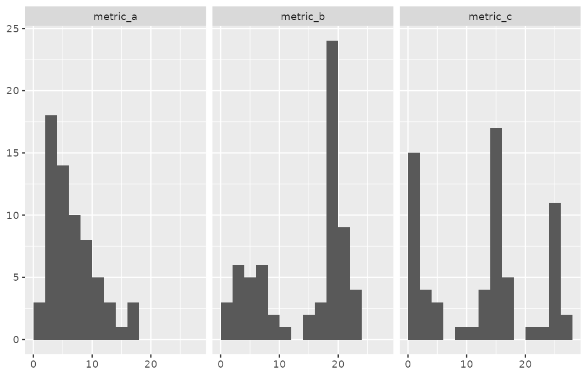{fig-alt="Three side-by-side histograms of constructed metrics: the first rises to one prominent peak and trails off to the right (unimodal), the second has a cluster of small values and a dominant second peak near 20 (bimodal), and the third shows three separated clumps near 0, 15, and 25 (multimodal)." width=85%}

With this seed, `metric_a` rises to one prominent peak (18 observations in its tallest bar, just below the value 4) and trails off to the right — unimodal.
`metric_b` has a cluster of small values and a second, dominant peak near 20 (24 observations in that bar) — bimodal.
`metric_c` shows three separated clumps, with tall bars near 0, near 15, and near 25 — multimodal.
Notice that `metric_a` has some minor bumps on its way down the right tail that we did not count, since each differs from its neighboring bins by only a few observations: we count *prominent* peaks, not just any peak.

::: {.callout-note title="Worked example"}
The histogram of the `shots50` chance qualities reveals only one prominent mode.
Is the distribution unimodal, bimodal, or multimodal?

------------------------------------------------------------------------

Recall the prefixes: *uni-* denotes one prominent peak, *bi-* two, and *multi-* more than two.
With a single prominent peak, the distribution is unimodal.
:::

::: {.callout-tip title="Check your understanding"}
Northbridge's academy holds an open day where the heights of everyone on the pitch — the under-15 trialists and the adult coaching staff — are measured for kit ordering.
How many modes would you expect in this height dataset?

------------------------------------------------------------------------

There might be two height groups visible in the dataset: the young trialists and the adult coaches.
That is, the data are probably bimodal.
:::

Looking for modes isn't about finding a clear and correct answer about the number of modes in a distribution, which is why *prominent* is not rigorously defined in this book.
The most important part of this examination is to better understand your data.

## Variance and standard deviation {#sec-variance-sd}

The mean was introduced as a method to describe the center of a variable, and **variability** in the data is also important.
A striker whose chance quality is steady around 0.12 xG per shot and a striker who mixes tap-ins with 30-yard speculative efforts can share the same mean while being entirely different scouting propositions.
Here, we introduce two measures of variability: the variance and the standard deviation.
Both of these are very useful in data analysis, even though their formulas are a bit tedious to calculate by hand.
The standard deviation is the easier of the two to comprehend, as it roughly describes how far away the typical observation is from the mean.

We call the distance of an observation from its mean its **deviation**.
Below are the deviations for the $1^{st},$ $2^{nd},$ $3^{rd},$ and $50^{th}$ shots in the `shots50` sample, working to four decimal places (the sample mean is $\bar{x} = 0.1271$):

$$
\begin{aligned}
x_1 - \bar{x} &= 0.0067 - 0.1271 = -0.1204 \\
x_2 - \bar{x} &= 0.0810 - 0.1271 = -0.0461 \\
x_3 - \bar{x} &= 0.0085 - 0.1271 = -0.1186 \\
&\vdots \\
x_{50} - \bar{x} &= 0.0420 - 0.1271 = -0.0851 \\
\end{aligned}
$$

If we square these deviations and then take an average, the result is equal to the sample **variance**, denoted by $s^2.$
Read the symbol as two parts: the letter $s$ is reserved for a sample's spread, and the superscript $2$ reminds us that the deviations have been *squared* on the way in.

$$
s^2 = \frac{(-0.1204)^2 + (-0.0461)^2 + \cdots + (-0.0851)^2}{50 - 1} = \frac{0.0145 + 0.0021 + \cdots + 0.0072}{49} = 0.0367
$$

We divide by $n - 1,$ rather than dividing by $n,$ when computing a sample's variance.
There's some mathematical nuance here, but the end result is that doing this makes this statistic slightly more reliable and useful.
The honest accounting of that nuance arrives in [Chapter -@sec-inference-one-mean], where the same $n - 1$ resurfaces as a distribution's degrees of freedom — and finally gets its explanation.

Notice that squaring the deviations does two things.
First, it makes large values relatively much larger — the three 0.78-xG penalties dominate this sum.
Second, it gets rid of any negative signs.

::: {.callout-important title="Standard deviation"}
The sample standard deviation can be calculated as the square root of the sum of the squared distance of each value from the mean divided by the number of observations minus one:

$$s = \sqrt{\frac{\sum_{i=1}^n (x_i - \bar{x})^2}{n-1}}$$
:::

One new symbol appears in that formula and it will follow us for the rest of the book, so take it apart now.
The capital Greek letter $\Sigma$ (*sigma*) is an instruction to *add up*; the decorations $i=1$ (below) and $n$ (above) say to run the index $i$ from the first observation to the last.
So $\sum_{i=1}^n (x_i - \bar{x})^2$ reads, in plain words: "for each shot $i$ from 1 to $n,$ take its deviation from the mean, square it, and add all $n$ results together."

The **standard deviation** is defined as the square root of the variance:

$$s = \sqrt{0.0367} = 0.1916$$

R computes both in one line each, confirming the hand arithmetic:

```r
shots50 |>
  summarize(var_xg = var(statsbomb_xg), sd_xg = sd(statsbomb_xg))
#> # A tibble: 1 × 2
#>   var_xg sd_xg
#>    <dbl> <dbl>
#> 1 0.0367 0.192
```

While often omitted, a subscript of $_x$ may be added to the variance and standard deviation, i.e., $s_x^2$ and $s_x^{},$ if it is useful as a reminder that these are the variance and standard deviation of the observations represented by $x_1,$ $x_2,$ ..., $x_n.$

::: {.callout-important title="Variance and standard deviation"}
The variance is (almost) the average squared distance from the mean — the divisor is $n - 1$ rather than $n,$ the nuance flagged above.
The standard deviation is the square root of the variance.
The standard deviation is useful when considering how far the data are distributed from the mean.

The standard deviation represents the typical deviation of observations from the mean.
Often about 68% of the data will be within one standard deviation of the mean and about 95% will be within two standard deviations.
However, these percentages are not strict rules.
:::

Like the mean, the population values for variance and standard deviation have special symbols: $\sigma^2$ for the variance and $\sigma$ for the standard deviation.
The symbol $\sigma$ is the lowercase Greek letter *sigma* (the capital form, $\Sigma,$ you just met as the summation instruction; the lowercase form names the population standard deviation), and the same estimation logic applies as with $\mu$ and $\bar{x}:$ we rarely see the whole population, so we estimate $\sigma$ with $s.$

How do those "68% and 95%" figures fare on our skewed sample?
Let us count rather than trust:

```r
shots50 |>
  summarize(
    n_within_1_sd = sum(abs(statsbomb_xg - mean(statsbomb_xg)) <= sd(statsbomb_xg)),
    n_within_2_sd = sum(abs(statsbomb_xg - mean(statsbomb_xg)) <= 2 * sd(statsbomb_xg))
  )
#> # A tibble: 1 × 2
#>   n_within_1_sd n_within_2_sd
#>           <int>         <int>
#> 1            45            47
```

For the chance quality variable, 45 of the 50 shots (90%) sit within 1 standard deviation of the mean, and 47 of 50 (94%) within 2 standard deviations — a long way from "about 68%" in the first case.
The culprit is the strong right skew: the interval $\bar{x} \pm s$ — read the new symbol $\pm$ as "plus or minus", one step of size $s$ down from the mean and one step up — runs from $-0.06$ to $0.32,$ which swallows the entire dense low-xG mass and excludes only the five most extreme chances.
The 68/95 guideline works best for symmetric, bell-shaped distributions and misfires on skewed ones — a caution to carry into @sec-foundations-mathematical, where bell-shaped distributions take center stage.

::: {.callout-tip title="Check your understanding"}
A scout logs four shots by a trialist, with chance qualities $0.05,$ $0.10,$ $0.15,$ and $0.30$ xG.
Compute the sample standard deviation $s$ by hand, following the formula: mean, deviations, squared deviations, divide by $n - 1,$ square root.

------------------------------------------------------------------------

The mean is $\bar{x} = (0.05 + 0.10 + 0.15 + 0.30)/4 = 0.15.$
The deviations are $-0.10,$ $-0.05,$ $0,$ and $0.15;$ their squares are $0.0100,$ $0.0025,$ $0,$ and $0.0225,$ which sum to $0.0350.$
Dividing by $n - 1 = 3$ gives the variance $s^2 = 0.0350/3 \approx 0.0117,$ and taking the square root gives $s = \sqrt{0.0117} \approx 0.108$ xG — confirmed in R by `sd(c(0.05, 0.10, 0.15, 0.30))`, which returns $0.108.$
Notice that the single good chance at $0.30$ contributes $0.0225$ of the $0.0350$ total: nearly two thirds of the variance comes from one shot, a small preview of the robustness discussion later in this chapter.
:::

::: {.callout-tip title="Check your understanding"}
A good description of the shape of a distribution should include modality and whether the distribution is symmetric or skewed to one side.
Using as an example the three constructed distributions that follow this callout — the code and figure appear immediately after it — explain why such a description is important.

------------------------------------------------------------------------

The figure drawn below shows three distributions that look quite different, but all have the same mean (0), variance, and standard deviation (1).
Using modality, we can distinguish between the first (bimodal) and the last two (unimodal).
Using skewness, we can distinguish between the last (right skewed) and the first two.
While a picture, like a histogram, tells a more complete story, we can use modality and shape (symmetry/skew) to characterize basic information about a distribution.
:::

The three distributions referenced above are another of Priya's constructed training sets: standardized fitness-test scores for three fabricated squads, engineered so that the summary statistics agree while the shapes do not.

```r
set.seed(504)
squad_a <- c(rep(-0.975, 1000), rep(0.975, 1000))
squad_b <- rnorm(2000)
squad_c <- qchisq(seq(0.26, 0.8, 0.0005), 4)

fitness_scores <- tibble(
  score = c(
    (squad_a - mean(squad_a)) / sd(squad_a),
    (squad_b - mean(squad_b)) / sd(squad_b),
    (squad_c - mean(squad_c)) / sd(squad_c)
  ),
  squad = rep(c("A", "B", "C"),
              times = c(length(squad_a), length(squad_b), length(squad_c)))
)

fitness_scores |>
  group_by(squad) |>
  summarize(n = n(), mean = round(mean(score), 2), sd = round(sd(score), 2))
#> # A tibble: 3 × 4
#>   squad     n  mean    sd
#>   <chr> <int> <dbl> <dbl>
#> 1 A      2000     0     1
#> 2 B      2000     0     1
#> 3 C      1081     0     1

ggplot(fitness_scores, aes(x = score)) +
  geom_histogram(binwidth = 1) +
  facet_grid(squad ~ ., scales = "free_y") +
  labs(x = NULL, y = NULL)
```

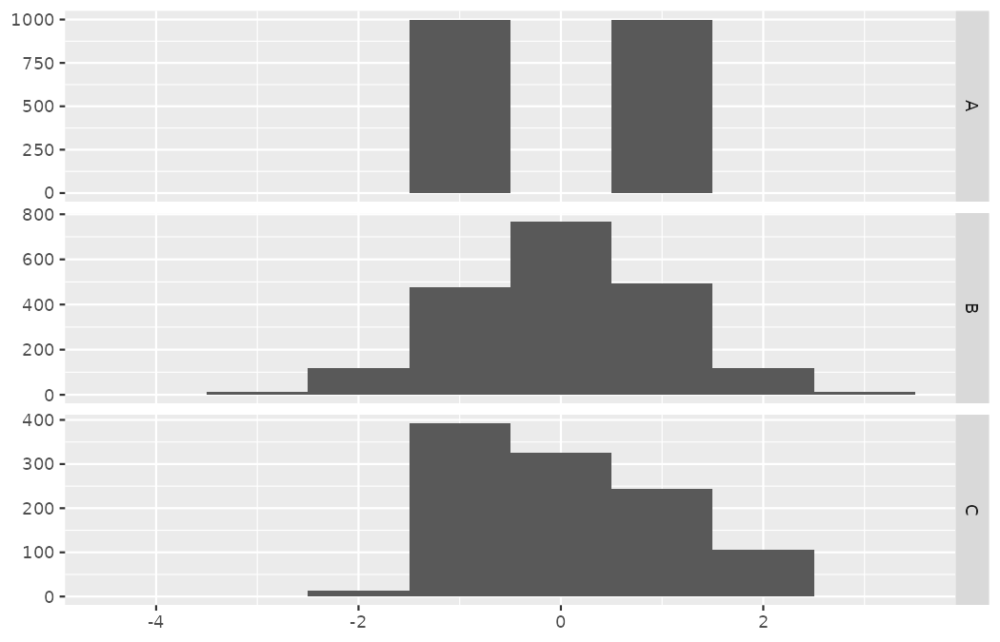{fig-alt="Three vertically stacked histograms of standardized fitness scores that share identical means and standard deviations: squad A is two towers at minus 1 and plus 1 with nothing between, squad B is a symmetric bell centered at 0, and squad C is right skewed, running from about minus 1.5 out to plus 2.1." width=85%}

Squad A's histogram is two towers at $-1$ and $+1$ with nothing between (bimodal); squad B's is the familiar symmetric bell centered at 0; squad C's is right skewed, running from about $-1.5$ out to $+2.1.$
Identical means, identical standard deviations — three completely different squads.

::: {.callout-note title="Worked example"}
Describe the distribution of the chance quality variable using its histogram from @sec-histograms.
The description should incorporate the center, variability, and shape of the distribution, and it should also be placed in context: the xG of 50 sampled World Cup shots.
Also note any especially unusual cases.

------------------------------------------------------------------------

The distribution of chance quality is unimodal and skewed to the high end.
Most of the 50 shots are low-quality chances below 0.1 xG, the mean sits at 0.127 with a standard deviation of 0.192, and the distribution trails out to a few exceptionally good chances — most notably the three penalties at 0.78 xG, which sit far from every open-play shot in the sample.
:::

In practice, the variance and standard deviation are sometimes used as a means to an end, where the "end" is being able to accurately estimate the uncertainty associated with a sample statistic.
For example, in @sec-foundations-mathematical the standard deviation is used in calculations that help us understand how much a sample mean — a scout's average rating, a sampled conversion rate — varies from one sample to the next.

## Box plots, quartiles, and the median {#sec-boxplots}

A **box plot** summarizes a dataset using five statistics while also identifying unusual observations.
The code below draws a dot plot and a box plot of the chance quality variable from the `shots50` sample.[^ch5-spear]

[^ch5-spear]: Box plots were introduced by Mary Eleanor Spear, who considered them to be a particular type of bar plot; see page 166 of Spear (1952).
    Mistakenly, box plots are often attributed to John Tukey, who was the first person to call them "box-and-whisker plots."

```r
ggplot(shots50, aes(x = statsbomb_xg)) +
  geom_dotplot(binwidth = 0.02) +
  labs(x = NULL, y = NULL) +
  theme(
    axis.text.y = element_blank(),
    axis.ticks.y = element_blank()
  )

ggplot(shots50, aes(x = statsbomb_xg)) +
  geom_boxplot(outlier.size = 2.5) +
  labs(x = "Chance quality (xG)") +
  theme(
    axis.text.y = element_blank(),
    axis.ticks.y = element_blank()
  )
```

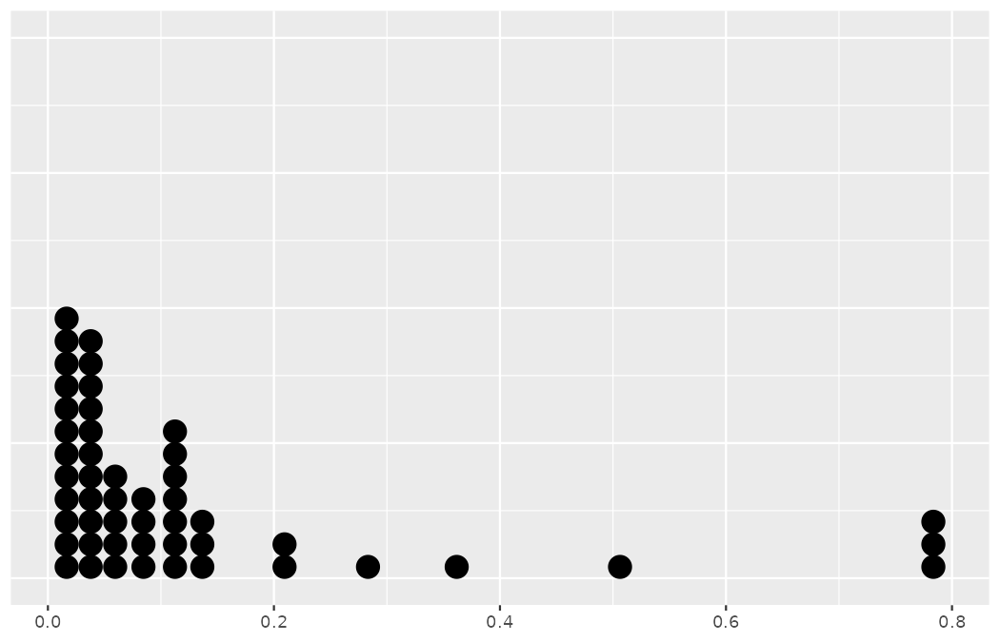{fig-alt="A dot plot of the 50 chance qualities, drawn on the same scale as the box plot below it for comparison, with the dense pile of low-xG dots on the left and a few isolated dots trailing right." width=85%}

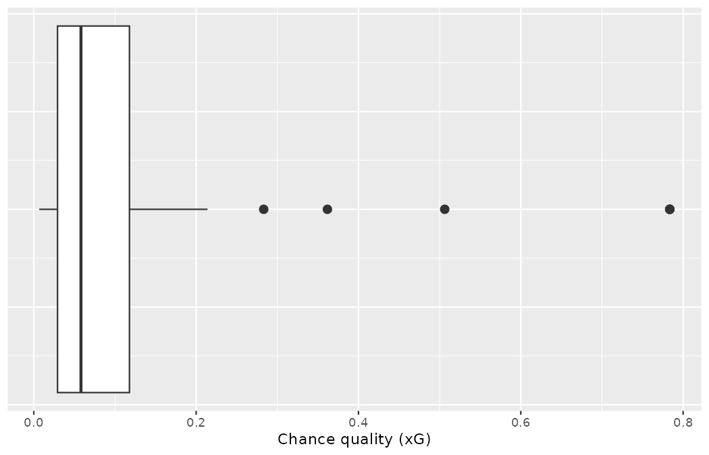{fig-alt="A box plot of the chance quality of the 50 sampled shots: the box spans the middle half of the data with the median line near 0.06, the upper whisker stops at 0.214, and the six most extreme shots are drawn as individual outlier dots." width=85%}

The dark line inside the box represents the **median**, which splits the data in half.
50% of the data fall below this value and 50% fall above it.
Since in the `shots50` sample there are 50 observations (an even number), the median is defined as the average of the two observations closest to the $50^{th}$ percentile.
The code below arranges all 50 chance qualities in ascending order (rounded to three decimal places for display), reading left to right, then row by row:

```r
matrix(sort(round(shots50$statsbomb_xg, 3)), byrow = TRUE, ncol = 10)
#>       [,1]  [,2]  [,3]  [,4]  [,5]  [,6]  [,7]  [,8]  [,9] [,10]
#> [1,] 0.007 0.009 0.009 0.013 0.015 0.016 0.020 0.020 0.020 0.021
#> [2,] 0.022 0.026 0.028 0.032 0.033 0.033 0.034 0.034 0.039 0.040
#> [3,] 0.042 0.042 0.047 0.050 0.058 0.059 0.068 0.069 0.081 0.081
#> [4,] 0.083 0.088 0.103 0.106 0.107 0.109 0.110 0.120 0.122 0.132
#> [5,] 0.140 0.141 0.205 0.214 0.283 0.362 0.506 0.783 0.783 0.783
```

We can see that the $25^{th}$ and the $26^{th}$ values are 0.058 and 0.059, and their average, 0.058, is the median — the thick line inside the box plot's box.
When there are an odd number of observations, there will be exactly one observation that splits the data into two halves, and in such a case that observation is the median (no average needed).

::: {.callout-important title="Median: the number in the middle"}
If the data are ordered from smallest to largest, the **median** is the observation right in the middle.
If there are an even number of observations, there will be two values in the middle, and the median is taken as their average.
:::

The second step in building a box plot is drawing a rectangle to represent the middle 50% of the data.
The length of the box is called the **interquartile range**, or **IQR** for short.
It, like the standard deviation, is a measure of variability in data.
The more variable the data, the larger the standard deviation and IQR tend to be.
The two boundaries of the box are called the **first quartile** (the $25^{th}$ percentile, i.e., 25% of the data fall below this value) and the **third quartile** (the $75^{th}$ percentile, i.e., 75% of the data fall below this value), and these are often labeled $Q_1$ and $Q_3,$ respectively.
The notation is the letter $Q$ for *quartile* with a subscript naming which quartile is meant; the median is, in this language, the second quartile, though we rarely write $Q_2.$

::: {.callout-important title="Interquartile range (IQR)"}
The IQR interquartile range is the length of the box in a box plot.
It is computed as

$$IQR = Q_3 - Q_1,$$

where $Q_1$ and $Q_3$ are the $25^{th}$ and $75^{th}$ percentiles, respectively.

A **percentile** is a number with a specified percent of the observations below it and the rest above.
For example, the $90^{th}$ percentile of a combine's sprint speeds is the speed with 90% of the tested players below that value and 10% of players above it.
:::

For the `shots50` chance qualities:

```r
shots50 |>
  summarize(
    median_xg = median(statsbomb_xg),
    q1 = quantile(statsbomb_xg, 0.25),
    q3 = quantile(statsbomb_xg, 0.75),
    iqr = IQR(statsbomb_xg)
  )
#> # A tibble: 1 × 4
#>   median_xg     q1    q3    iqr
#>       <dbl>  <dbl> <dbl>  <dbl>
#> 1    0.0581 0.0292 0.118 0.0886
```

::: {.callout-tip title="Check your understanding"}
What percent of the data fall between $Q_1$ and the median?
What percent is between the median and $Q_3$?

------------------------------------------------------------------------

Since $Q_1$ and $Q_3$ capture the middle 50% of the data and the median splits the data in the middle, 25% of the data fall between $Q_1$ and the median, and another 25% falls between the median and $Q_3.$
:::

Extending out from the box, the **whiskers** attempt to capture the data outside of the box.
The whiskers of a box plot reach to the minimum and the maximum values in the data, unless there are points that are considered unusually high or unusually low, which are identified as potential **outliers** by the box plot.
These are labeled with a dot on the box plot.
The purpose of labeling the outlying points — instead of extending the whiskers to the minimum and maximum observed values — is to help identify any observations that appear to be unusually distant from the rest of the data.
There are a variety of formulas for determining whether a particular data point is considered an outlier, and different statistical software use different formulas.
A commonly used formula — the one we adopt in this book — is that any observation beyond $1.5\times IQR$ away from the first or the third quartile is considered an outlier.
In a sense, the box is like the body of the box plot and the whiskers are like its arms trying to reach the rest of the data, up to the outliers.

Let us apply the $1.5\times IQR$ rule to our sample.
The upper cutoff is $Q_3 + 1.5 \times IQR = 0.118 + 1.5 \times 0.089 = 0.251:$

```r
shots50 |>
  summarize(
    upper_fence = quantile(statsbomb_xg, 0.75) + 1.5 * IQR(statsbomb_xg),
    n_outliers = sum(statsbomb_xg > upper_fence),
    whisker_end = max(statsbomb_xg[statsbomb_xg <= upper_fence])
  )
#> # A tibble: 1 × 3
#>   upper_fence n_outliers whisker_end
#>         <dbl>      <int>       <dbl>
#> 1       0.251          6       0.214
```

Six shots exceed the cutoff — the chances at 0.283, 0.362, and 0.506, plus the three penalties at 0.7835 — so the upper whisker stops at the largest non-outlying value, 0.214, and the six extreme shots are drawn as individual dots (the three penalties overplot at the same position).
The lower cutoff, $Q_1 - 1.5 \times IQR,$ is negative, and since xG cannot be negative, no shot can be a low outlier here; the lower whisker simply reaches the minimum, 0.007.

::: {.callout-important title="Outliers are extreme"}
An **outlier** is an observation that appears extreme relative to the rest of the data.
Examining data for outliers serves many useful purposes, including

-   identifying strong skew in the distribution,
-   identifying possible data collection or data entry errors, and
-   providing insight into interesting properties of the data.

Keep in mind, however, that some datasets have a naturally long skew and outlying points do **not** represent any sort of problem in the dataset.
Our six flagged shots are not errors — penalties and clean one-on-ones really are that much better than the average chance, and a scout should be *glad* the box plot points at them.
:::

::: {.callout-tip title="Check your understanding"}
Using the box plot drawn at the start of this section, estimate the values of $Q_1,$ $Q_3,$ and the IQR for chance quality in the `shots50` sample.

------------------------------------------------------------------------

These visual estimates will vary a little from one person to the next: $Q_1 \approx 0.03,$ $Q_3 \approx 0.12,$ IQR $\approx 0.12 - 0.03 = 0.09.$
The computed values were 0.029, 0.118, and 0.089.
:::

## Robust statistics

How are the sample statistics of the `shots50` chance qualities affected by the shot at the top of the sample — the stored penalty value 0.7835?
Three shots share that value — all penalties — and we will experiment on one of them: Harry Kane's penalty for England, the only shot by Kane in the sample.

```r
shots50 |>
  filter(statsbomb_xg == max(statsbomb_xg)) |>
  select(player, team, shot_type, outcome, statsbomb_xg)
#> # A tibble: 3 × 5
#>   player           team    shot_type outcome statsbomb_xg
#>   <chr>            <chr>   <chr>     <chr>          <dbl>
#> 1 Marcelo Brozović Croatia Penalty   Goal           0.784
#> 2 Marko Livaja     Croatia Penalty   Post           0.784
#> 3 Harry Kane       England Penalty   Goal           0.784
```

(The table prints $0.784$ because the stored value $0.7835$ is rounded up by the three-significant-digit display; the three-decimal matrix in @sec-boxplots rounded the very same shots down to $0.783.$)

What would have happened if the xG model had rated Kane's chance at only 0.15?
What would happen to the summary statistics if it had scored the penalty even higher, at 0.98 — a near-certain goal?
The two conjectured scenarios are built below, plotted alongside the original data as faceted dot plots, and the sample statistics are computed under each scenario.

```r
shots50_down <- shots50 |>
  mutate(statsbomb_xg = if_else(player == "Harry Kane", 0.15, statsbomb_xg))
shots50_up <- shots50 |>
  mutate(statsbomb_xg = if_else(player == "Harry Kane", 0.98, statsbomb_xg))

robust_check <- bind_rows(
  shots50      |> mutate(scenario = "Original data"),
  shots50_down |> mutate(scenario = "Move 0.7835 to 0.15"),
  shots50_up   |> mutate(scenario = "Move 0.7835 to 0.98")
) |>
  mutate(scenario = factor(scenario, levels = c(
    "Original data", "Move 0.7835 to 0.15", "Move 0.7835 to 0.98"
  )))

robust_check |>
  group_by(scenario) |>
  summarize(
    median = median(statsbomb_xg),
    iqr = IQR(statsbomb_xg),
    mean = mean(statsbomb_xg),
    sd = sd(statsbomb_xg)
  )
#> # A tibble: 3 × 5
#>   scenario            median    iqr  mean    sd
#>   <fct>                <dbl>  <dbl> <dbl> <dbl>
#> 1 Original data       0.0581 0.0886 0.127 0.192
#> 2 Move 0.7835 to 0.15 0.0581 0.0886 0.114 0.167
#> 3 Move 0.7835 to 0.98 0.0581 0.0886 0.131 0.207
```

| Scenario | Median | IQR | Mean | SD |
|:---|---:|---:|---:|---:|
| Original data | 0.058 | 0.089 | 0.127 | 0.192 |
| Move 0.7835 to 0.15 | 0.058 | 0.089 | 0.114 | 0.167 |
| Move 0.7835 to 0.98 | 0.058 | 0.089 | 0.131 | 0.207 |

: A comparison of how the median, IQR, mean, and standard deviation change as the value of an extreme observation from the original chance quality data changes. The median and IQR are robust; the mean and standard deviation are not. {#tbl-shots50-robust}

```r
ggplot(robust_check, aes(x = statsbomb_xg)) +
  geom_dotplot(binwidth = 0.02) +
  facet_grid(scenario ~ .) +
  labs(x = "Chance quality (xG)", y = NULL)
```

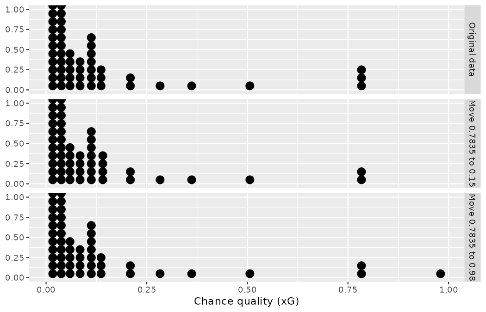{fig-alt="Faceted dot plots of the original sample and the two conjectured scenarios in which the extreme 0.7835 value is moved to 0.15 or to 0.98: the dense low-xG bulk of the distribution is unchanged, and only the far right tail differs across the three panels." width=85%}

::: {.callout-tip title="Check your understanding"}
Which is more affected by extreme observations, the mean or median?
Is the standard deviation or IQR more affected by extreme observations?

------------------------------------------------------------------------

The mean is affected more than the median.
The standard deviation is affected more than the IQR.
:::

The median and IQR are called **robust statistics** because extreme observations have little effect on their values: moving the most extreme value generally has little influence on these statistics.
On the other hand, the mean and standard deviation are more heavily influenced by changes in extreme observations, which can be important in some situations.

::: {.callout-note title="Worked example"}
The median and IQR did not change under the two scenarios in @tbl-shots50-robust.
Why might this be the case?

------------------------------------------------------------------------

The median and IQR are only sensitive to numbers near $Q_1,$ the median, and $Q_3.$
Since values in these regions are stable in the three datasets — we only moved a value in the far right tail — the median and IQR estimates are also stable.
:::

You might not be surprised that the answer to the question "which is better, the mean or the median?" is: *it depends*.
The two statistics measure different things, and so their use is dependent on the context in the analysis.
Consider the following scouting scenarios:

*   Is it better to measure the average transfer-fee profit per academy graduate or the median profit per graduate?
    -   If concern is about the overall financial return of the academy, the mean is a better measure to assess what is happening across the whole program. One €40M sale can fund a decade of coaching, and the academy could have a positive median profit per graduate and still be losing money overall.
    -   If concern is around understanding what the *typical* graduate returns — say, to set realistic expectations for any one prospect — the median profit per graduate would tell you more.

*   If Priya wants to know how long scouts wait for match video to load on the club's scouting platform, does she want the mean amount of time or the median amount of time?
    -   The mean leads to an understanding of the overall amount of working time being wasted across the network.
    -   The median tells you about the typical scout's experience.
    -   However, if the video loads within a second for 50% of the scouts but takes more than a minute for 10% of them, the median doesn't give the information Priya needs. In that scenario, she might want an upper percentile, like the 95th percentile.

::: {.callout-tip title="Check your understanding"}
The distribution of chance quality in the `shots50` sample is right skewed, with a few excellent chances lingering out into the right tail.
If you were wanting to understand the quality of a typical chance in the sample, should you be more interested in the mean or median?

------------------------------------------------------------------------

If we are looking to simply understand what a typical individual chance looks like, the median (0.058 xG) is probably more useful.
However, if the goal is to understand something that scales well — such as how many goals a team should expect to accumulate across hundreds of shots — then the mean (0.127 xG) would be more useful, since total expected goals is the mean times the number of shots.
:::

Regardless of the choice of centrality statistic (either mean or median), for most analyses, it is important to consider more than just the centrality.
Other statistics like upper and lower percentiles, IQR, or standard deviation provide information about the variability of the observations.
And visualizing the data through a graphical representation will typically provide a wealth of information necessary for understanding the full data picture associated with the research question.

## Transforming data {#sec-transforming-data}

When data are very strongly skewed, we sometimes transform them, so they are easier to model.
Our example is a variable every recruitment department tracks: how many shots each player attempted across a tournament.
We aggregate the 2025 Women's Euro shot data to one row per player:

```r
weuro2025_shots <- read_csv("data/derived/weuro2025_shots.csv")

player_shots <- weuro2025_shots |>
  group_by(player, team) |>
  summarize(shots = n(), goals = sum(goal), .groups = "drop")

player_shots |>
  summarize(
    n_players = n(),
    mean_shots = mean(shots),
    median_shots = median(shots),
    max_shots = max(shots)
  )
#> # A tibble: 1 × 4
#>   n_players mean_shots median_shots max_shots
#>       <int>      <dbl>        <int>     <int>
#> 1       215       4.25            3        25

player_shots |>
  arrange(desc(shots)) |>
  slice_head(n = 5)
#> # A tibble: 5 × 4
#>   player                    team            shots goals
#>   <chr>                     <chr>           <int> <int>
#> 1 Klara Bühl                Germany Women's    25     1
#> 2 Esther Gonzalez Rodríguez Spain Women's      24     4
#> 3 Emma Stina Blackstenius   Sweden Women's     20     3
#> 4 Alexia Putellas Segura    Spain Women's      18     3
#> 5 Aitana Bonmati Conca      Spain Women's      17     1
```

Of the 215 players who attempted at least one shot, the median attempted just 3, while Germany's Klara Bühl attempted 25.
Fifty-nine players took exactly one shot, and 130 of the 215 (60.5%) took three or fewer.
The distribution is heavily right skewed, as the histogram drawn by the code below shows.

```r
ggplot(player_shots, aes(x = shots)) +
  geom_histogram(binwidth = 2, boundary = 0) +
  labs(x = "Shots attempted in the tournament", y = "Count (players)")
```

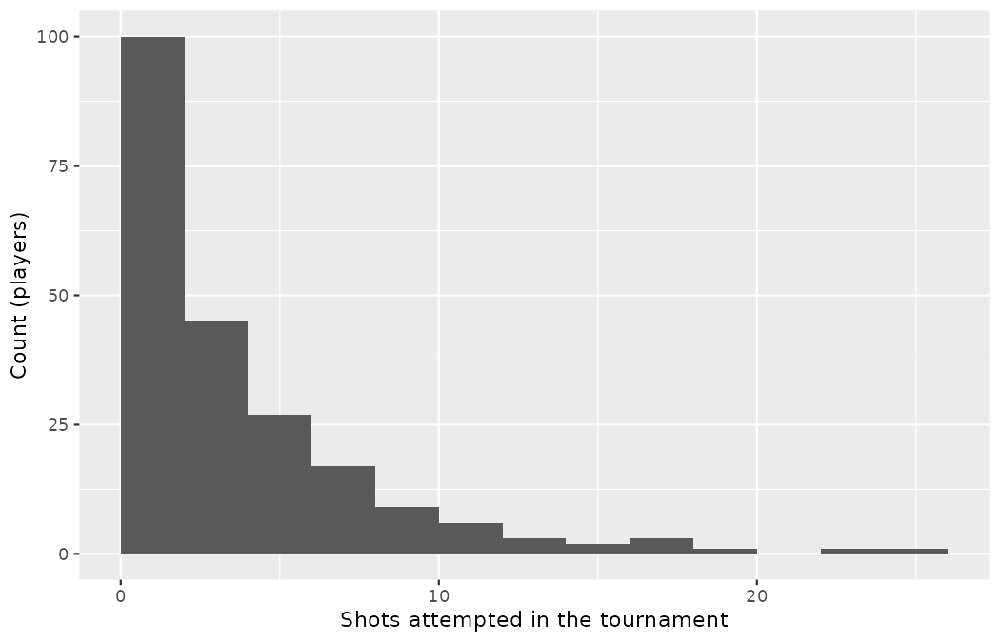{fig-alt="A heavily right-skewed histogram of shots attempted per player: most of the 215 players fall into the leftmost bins, while the axis stretches out to 25 to accommodate a handful of high-volume shooters." width=85%}

::: {.callout-note title="Worked example"}
Consider the histogram of per-player shot counts drawn above, which shows extreme skew.
What characteristics of the plot keep it from being useful?

------------------------------------------------------------------------

Most of the data fall into the leftmost bins — 130 of the 215 players sit in the first two bars — and the extreme skew stretches the axis out to 25 to accommodate a handful of high-volume shooters, obscuring many of the potentially interesting details at the low values.
:::

There are some standard transformations that may be useful for strongly right skewed data where much of the data is positive but clustered near zero.
A **transformation** is a rescaling of the data using a function.
For instance, a plot of the logarithm (base 10) of the shot counts results in the new histogram drawn below.
The notation $\log_{10}$ deserves a plain-words reading before we use it: $\log_{10}(x)$ is the power to which 10 must be raised to recover $x.$
So $\log_{10}(10) = 1$ and $\log_{10}(100) = 2,$ and each extra unit on the transformed axis means "ten times as many"; Bühl's 25 shots map to $\log_{10}(25) \approx 1.40.$

```r
ggplot(player_shots, aes(x = log10(shots))) +
  geom_histogram(binwidth = 0.1, boundary = 0) +
  labs(x = expression(log[10] * "(Shots attempted)"), y = "Count (players)")
```

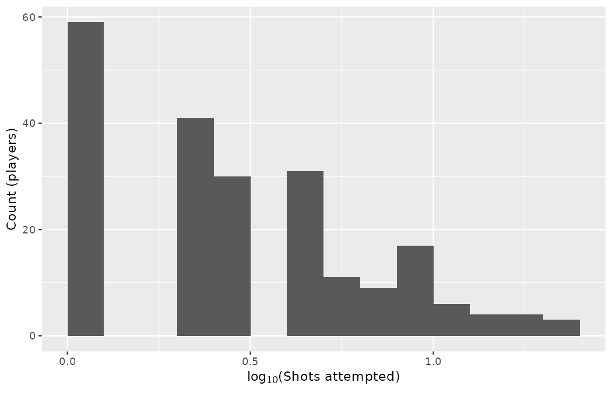{fig-alt="A histogram of the base-10 logarithm of shots attempted: the long right tail is pulled in, though the whole-number shot counts make it spiky, with an isolated bar of 59 one-shot players at 0 and further spikes at the logs of 2 and 3." width=85%}

The transformed data are far less skewed: the long right tail is pulled in, and the high-volume shooters no longer look like a different species.
Be honest about what the transform cannot do, though: shot counts are whole numbers, so the transformed histogram is spiky rather than smooth — the 59 one-shot players form an isolated bar at $\log_{10}(1) = 0,$ with further spikes at $\log_{10}(2) \approx 0.30$ and $\log_{10}(3) \approx 0.48.$
By reining in the outliers and extreme skew, transformations often make it easier to build statistical models for the data.

Transformations can also be applied to one or both variables in a scatterplot.
A scatterplot of goals scored against shots attempted is drawn by the first code block below.
It is difficult to decipher any detail among the low-volume players because the shots variable is so strongly skewed: over 60% of the points are squeezed into the left edge of the plot.
However, if we apply a $\log_{10}$ transformation to the shots axis, as in the second plot, the crowd of low-volume players is spread out, and the positive association — more attempts, more goals — can be inspected across the whole range.
In fact, we may be interested in fitting a trend line to data like these when we explore methods around fitting regression lines in @sec-model-slr.

```r
ggplot(player_shots, aes(x = shots, y = goals)) +
  geom_point(alpha = 0.4) +
  labs(x = "Shots attempted", y = "Goals scored")

ggplot(player_shots, aes(x = log10(shots), y = goals)) +
  geom_point(alpha = 0.4) +
  labs(x = expression(log[10] * "(Shots attempted)"), y = "Goals scored")
```

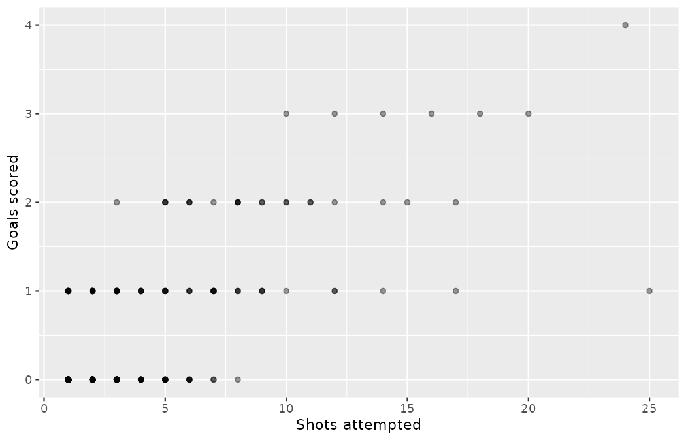{fig-alt="A scatterplot of goals scored against raw shots attempted, with over 60 percent of the points squeezed into the left edge of the plot by the strong skew of the shots variable." width=85%}

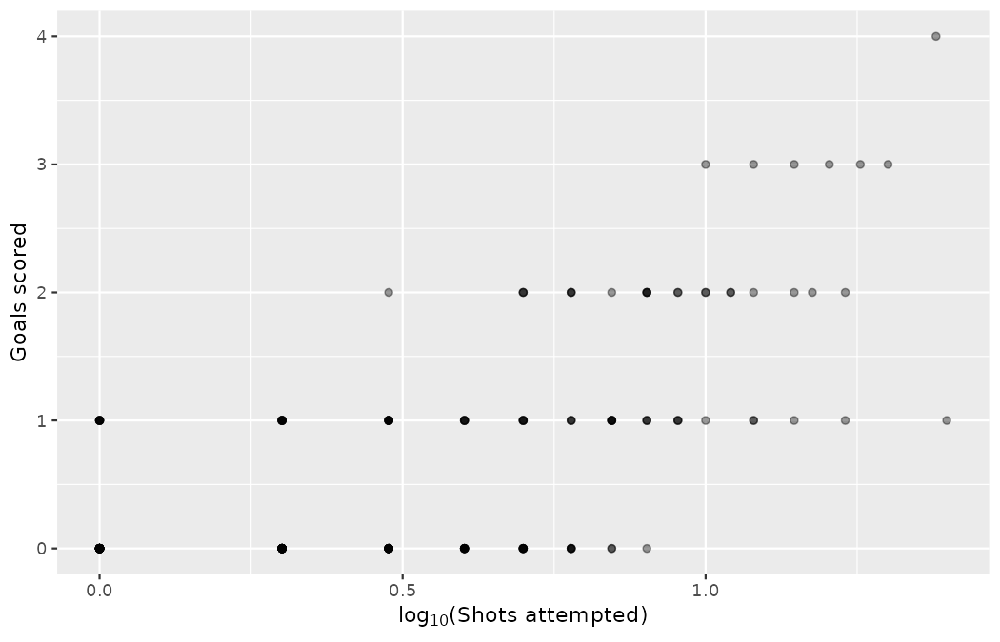{fig-alt="The same scatterplot with a log base-10 transformation applied to the shots axis: the crowd of low-volume players is spread out, and the positive association — more attempts, more goals — can be inspected across the whole range." width=85%}

Either version rewards a scout's second look: Klara Bühl's point sits at the extreme right with 25 shots and just 1 goal, a volume shooter whose finishing lagged her chance creation in this tournament — precisely the kind of case a scatterplot surfaces and a summary statistic buries.

Transformations other than the logarithm can be useful, too.
For instance, the square root $(\sqrt{\text{original observation}})$ and inverse $\bigg(\frac{1}{\text{original observation}}\bigg)$ are commonly used by data scientists.
Common goals in transforming data are to see the data structure differently, reduce skew, assist in modeling, or straighten a nonlinear relationship in a scatterplot.

::: {.callout-tip title="Check your understanding"}
Marta asks why you plotted $\log_{10}(\text{shots})$ rather than the raw shot counts.
Give the two-part answer: what property of the shot-count distribution makes the $\log_{10}$ transformation helpful here, and why could you *not* apply the same transformation to the `goals` column of `player_shots`?

------------------------------------------------------------------------

Shot counts are positive and strongly right skewed — they run from 1 up to Bühl's 25, more than an order of magnitude — so the logarithm compresses the sparse right tail and spreads out the crowded low counts, making the bulk of the distribution legible.
The `goals` column resists the same treatment because 129 of the 215 players scored no goals at all, and $\log_{10}(0)$ is undefined: a log transformation requires strictly positive values.
In general, reach for $\log_{10}$ when data are positive, clustered near zero, and stretched across orders of magnitude; when zeros are present, either a different transformation (such as the square root) or a modeling approach that tolerates zeros is needed.
:::

## Mapping data

Shots happen at *places* on a pitch, and dot plots, scatterplots, and box plots can miss the true nature of such data as spatial.
When we encounter spatial data, we should create an **intensity map**, where colors are used to show higher and lower values of a variable across a surface.

Our derived shot files carry no pitch coordinates, so this section works with a constructed Northbridge scenario: Priya is piloting a tracking-data feed, and sketches what its zone summaries would look like.
She divides the attacking half into a grid — five distance bands from goal (band 1 nearest the goal) crossed with six channels across the pitch (channels 3 and 4 central) — and constructs, in the seeded code below, an average chance quality for shots from each zone: a baseline, plus a bonus that grows with centrality and shrinks with distance, plus a little random noise.

```r
set.seed(501)
pitch_zones <- expand_grid(band = 1:5, channel = 1:6) |>
  mutate(
    centrality = 1 - abs(channel - 3.5) / 5,
    mean_xg = round(0.04 + 0.30 * centrality / band + rnorm(n(), 0, 0.012), 3)
  )

pitch_zones |> slice_head(n = 6)
#> # A tibble: 6 × 4
#>    band channel centrality mean_xg
#>   <int>   <int>      <dbl>   <dbl>
#> 1     1       1        0.5   0.197
#> 2     1       2        0.7   0.257
#> 3     1       3        0.9   0.315
#> 4     1       4        0.9   0.313
#> 5     1       5        0.7   0.24
#> 6     1       6        0.5   0.173

ggplot(pitch_zones, aes(x = channel, y = band, fill = mean_xg)) +
  geom_tile() +
  scale_fill_viridis_c() +
  scale_y_reverse() +
  labs(x = "Channel (across the pitch)", y = "Distance band (1 = nearest goal)",
       fill = "Mean xG")
```

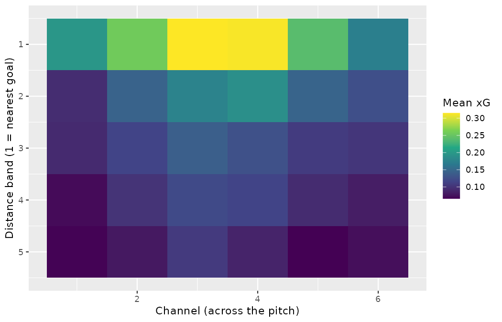{fig-alt="An intensity map of a five-band by six-channel pitch grid colored by average chance quality: zones glow hottest close to goal and in the central channels, and fade with distance and width — close and central." width=85%}

The color key indicates which colors correspond to which values.
Intensity maps are not generally very helpful for reading precise values in any given zone, but they are very helpful for seeing spatial trends and generating interesting research questions or hypotheses.

::: {.callout-note title="Worked example"}
What interesting features are evident in the pitch-zone intensity map drawn above?

------------------------------------------------------------------------

Two gradients dominate.
First, chance quality decays with distance: the average of the six zones in band 1 is 0.249 xG, falling to 0.146 in band 2 and just 0.080 in band 5 — and the drop is steepest between the first two bands.
Second, central beats wide within every band: the hottest zone is band 1, channel 3 (0.315), while the coldest is a wide zone in the most distant band (band 5, channel 5, at 0.066).
Together they say what every finishing coach preaches: close and central.
A real feed would add the wrinkles this constructed grid smooths over — penalties, angles, defensive traffic.
:::

::: {.callout-tip title="Check your understanding"}
Marta Vidal asks whether the intensity map can tell her the exact average xG of shots from the zone in band 2, channel 4.
What should Priya answer, and what is the map good for instead?

------------------------------------------------------------------------

Reading exact values off a color scale is unreliable — that is what the underlying table is for (the constructed value there is 0.190).
The map's job is to reveal spatial structure at a glance — the close-and-central gradient — and to prompt questions worth investigating, such as why one zone glows hotter than its mirror image on the other flank.
:::

## Chapter review {#sec-chp5-review}

### Summary

Fluently working with numerical variables is an important skill for a scouting analyst — chance quality, shot counts, minutes, fees, and sprint speeds are all numerical.
In this chapter we have introduced different visualizations and numerical summaries applied to numeric variables.
The graphical visualizations are even more descriptive when two variables are presented simultaneously.
We presented scatterplots, dot plots, histograms, and box plots.
Numerical variables can be summarized using the mean, median, quartiles, standard deviation, and variance — and you now know which of these to trust when a stray penalty sits in the tail of the sample: the median and IQR are robust to extreme observations, the mean and standard deviation are not.

### Terms

The terms introduced in this chapter are presented below, alphabetized.
If you're not sure what some of these terms mean, we recommend you go back in the text and review their definitions.
You should be able to easily spot them as **bolded text**.

|  |  |  |
|:-----------------------|:-----------------------|:----------------------|
| average | IQR | standard deviation |
| bimodal | left skewed | symmetric |
| box plot | mean | tail |
| data density | median | third quartile |
| density plot | multimodal | transformation |
| deviation | nonlinear | unimodal |
| distribution | outlier | variability |
| dot plot | percentile | variance |
| first quartile | point estimate | weighted mean |
| histogram | right skewed | whiskers |
| intensity map | robust statistics |  |
| interquartile range | scatterplot |  |

: Terms introduced in this chapter. {#tbl-terms-chp-05}

## Exercises {#sec-chp5-exercises}

Answers to odd-numbered exercises can be found in [Appendix -@sec-exercise-solutions-05]. Final answers to the even-numbered exercises are in [Appendix -@sec-appendix-even-answers].

::: {.exercises}

:::

------------------------------------------------------------------------

Adapted from *Introduction to Modern Statistics* by Çetinkaya-Rundel & Hardin (CC BY-SA 4.0); this adaptation is likewise CC BY-SA 4.0. Match data: StatsBomb open data.
