# Applications: Explore {#sec-explore-applications}

::: {.chapterintro}
You have now built the full exploratory toolkit: summarizing and visualizing categorical variables (@sec-explore-categorical), summarizing and visualizing numerical variables (@sec-explore-numerical), and the design vocabulary needed to say what a dataset can and cannot support (@sec-data-hello, @sec-data-design).
This applications chapter asks a question the previous chapters postponed: once *you* understand the data, how do you make *someone else* understand it?

We work through a single case study on the effective communication of exploratory results, using real tournament data and one constructed Northbridge United scenario, and close with a hands-on walkthrough, a lab assignment, and a review.
:::

## Case study: Effective communication of exploratory results {#sec-case-study-effective-comms}

Graphs can powerfully communicate ideas directly and quickly — often more directly than the paragraphs of prose it would take to describe the same pattern.
Unfortunately, however, there are times when an image conveys a message which is inaccurate or misleading.

In a football club this is not an academic worry.
Marta Vidal, Northbridge United's sporting director, will give the figure page of a scouting dossier perhaps thirty seconds before a transfer meeting.
Whatever those figures communicate in thirty seconds *is* the analysis, as far as the decision is concerned.
A technically correct plot that misleads the eye is, for scouting purposes, a wrong plot.

This chapter focuses on how graphs can best be utilized to present data accurately and effectively.
Along with data modeling, creative visualization is somewhat of an art.
However, even with an art, there are recommended guiding principles.
We provide a few best practices for creating data visualizations, each illustrated with the material of this book: shots, tournaments, and the recommendations of a scouting network.

Throughout, we use the two tournaments you have carried since @sec-data-hello — the 2022 Men's World Cup and the 2025 Women's Euro — and we load them once here:

```r
library(dplyr)
library(readr)
library(tidyr)
library(ggplot2)
library(purrr)

wc2022_shots    <- read_csv("data/derived/wc2022_shots.csv")
weuro2025_shots <- read_csv("data/derived/weuro2025_shots.csv")
wc2022_matches  <- read_csv("data/derived/wc2022_matches.csv")
```

### Keep it simple

When creating a graphic, keep in mind what it is that you'd like your reader to see.
Colors should be used to group items or differentiate levels in meaningful ways.
Colors can be distracting when they are only used to brighten up the plot.

Consider a one-slide summary Priya Rao was asked to prepare on how Argentina — the eventual champions, and the deep-run anchor we return to throughout this book — generated their shots at the 2022 World Cup.
The variable `play_pattern` classifies each shot by the phase of possession it came from, and Argentina took 110 shots across nine patterns:

```r
argentina_pattern <- wc2022_shots |>
  filter(team == "Argentina") |>
  count(play_pattern, sort = TRUE)

print(argentina_pattern, n = 9)
#> # A tibble: 9 × 2
#>   play_pattern       n
#>   <chr>          <int>
#> 1 Regular Play      40
#> 2 From Throw In     17
#> 3 From Corner       15
#> 4 From Free Kick    15
#> 5 Other             14
#> 6 From Counter       5
#> 7 From Goal Kick     2
#> 8 From Keeper        1
#> 9 From Kick Off      1
```

The first draft of the slide showed these nine counts as a pie chart — and the presentation software, helpfully, tilted it into three dimensions.
The flat version is produced by the code below.

```r
ggplot(argentina_pattern, aes(x = "", y = n, fill = play_pattern)) +
  geom_col(width = 1) +
  coord_polar(theta = "y") +
  theme_void() +
  labs(fill = "Play pattern")
```

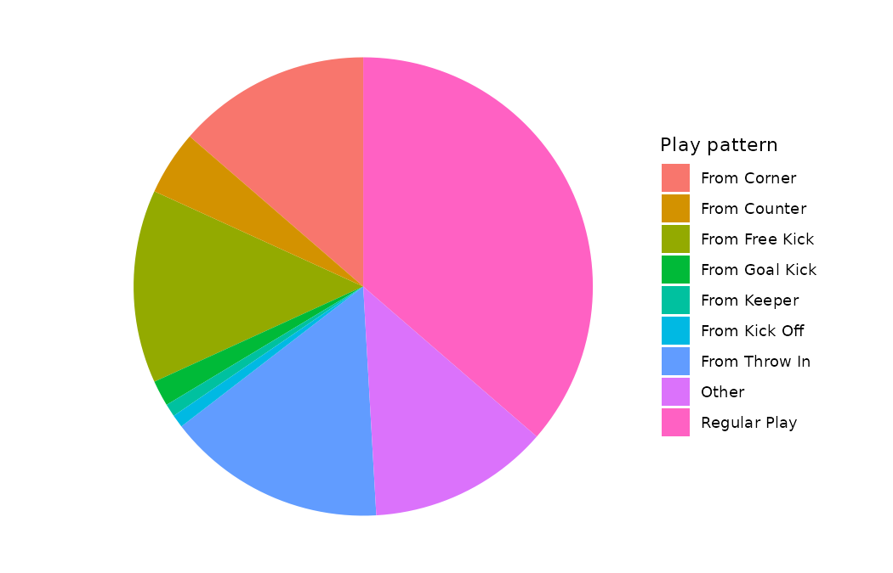{fig-alt="A pie chart of Argentina's 110 shots at the 2022 World Cup cut into nine slices in nine unrelated colors, one per play pattern. The Regular Play slice is visibly the largest, while the smallest slices collapse into indistinguishable slivers." width=85%}

The result is a disc cut into nine slices in nine unrelated colors.
The `Regular Play` slice is visibly the largest, but can your eye tell how different `From Corner` (15 shots) is from `From Free Kick` (15 shots) or from `Other` (14 shots)?
The three slices are indistinguishable, and the four smallest slices — 5, 2, 1, and 1 shots — collapse into slivers whose labels crowd each other.
Additionally, the colors in the pie chart do not mean anything: `play_pattern` has no ordering and no grouping that the rainbow encodes, so the palette is pure distraction.
And the three-dimensional tilt of the slide-deck version makes matters strictly worse: perspective foreshortens the slices at the back and inflates the ones at the front, so the *drawn areas* no longer even match the counts they are supposed to represent.

As an alternative, a sorted bar plot is produced by the code below.

```r
ggplot(argentina_pattern, aes(x = n, y = reorder(play_pattern, n))) +
  geom_col() +
  labs(x = "Number of shots", y = NULL)
```

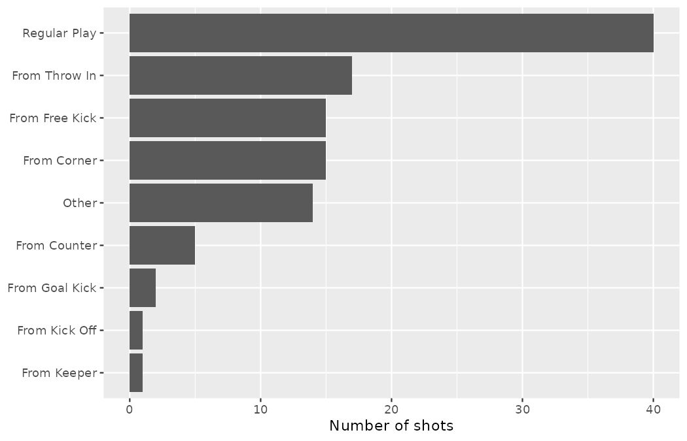{fig-alt="A horizontal bar plot of Argentina's shots by play pattern, sorted from Regular Play with 40 shots at the top down to From Keeper and From Kick Off with one shot each at the bottom." width=85%}

Now the nine patterns run down the y-axis from `From Kick Off` and `From Keeper` (1 shot each) at the bottom to `Regular Play` (40 shots) at the top, each with a bar whose length is the count.
Notice how much easier it is to identify the magnitude of the differences across categories — the eye reads `Regular Play` at more than twice `From Throw In`, and the 15--15--14 cluster is now three bars of visibly equal length rather than three indistinguishable wedges — while not being distracted by other aspects of the image.
Typically, a bar plot will be easier for the reader to digest than a pie chart, especially if the categorical data being plotted has more than just a few levels; with nine levels of `play_pattern`, there is no contest.

::: {.callout-tip title="Check your understanding"}
Marta's takeaway from the slide should be "Argentina generated just over a third of their shots from sustained open play, and about the same volume again from throw-ins, corners, and free kicks combined."
Which of the two graphics lets her verify that sentence in thirty seconds, and why?

------------------------------------------------------------------------

The sorted bar plot.
Verifying the sentence requires *comparing magnitudes*: `Regular Play` (40 of 110 shots, about 36%) against the sum of `From Throw In`, `From Corner`, and `From Free Kick` (17 + 15 + 15 = 47).
Bars share a common baseline, so lengths can be compared and mentally added; pie slices differ in angle, arc, and area at once, and human vision judges none of these accurately — let alone their sums.
:::

### Use color to draw attention

There are many reasons why you might choose to add **color** to your plots.
An important principle to keep in mind is to use color to draw attention.
Of course, you should still think about how visually pleasing your visualization is, and if you're adding color for making it visually pleasing without drawing attention to a particular feature, that might be fine.
However, you should be critical of default coloring and explicitly decide whether to include color and how.

Here is the scenario.
Northbridge's summer recruitment brief asks for an aerial-threat striker, and Marta wants one figure showing how headed chances compare, in average chance quality, with chances struck by either foot.
Recall from @sec-explore-categorical that we set aside the `Other` body-part category (only 13 shots at the 2022 World Cup, a mix of chests, knees, and misrecorded events); we do the same here and say so on the slide.

```r
bodypart_xg <- wc2022_shots |>
  filter(body_part != "Other") |>
  group_by(body_part) |>
  summarize(shots = n(), mean_xg = mean(statsbomb_xg))

bodypart_xg
#> # A tibble: 3 × 3
#>   body_part  shots mean_xg
#>   <chr>      <int>   <dbl>
#> 1 Head         252   0.106
#> 2 Left Foot    449   0.115
#> 3 Right Foot   780   0.134
```

The default approach — mapping `body_part` itself to fill — colors every bar differently:

```r
ggplot(bodypart_xg, aes(y = body_part, x = mean_xg, fill = body_part)) +
  geom_col(show.legend = FALSE) +
  labs(x = "Mean xG per shot", y = NULL)
```

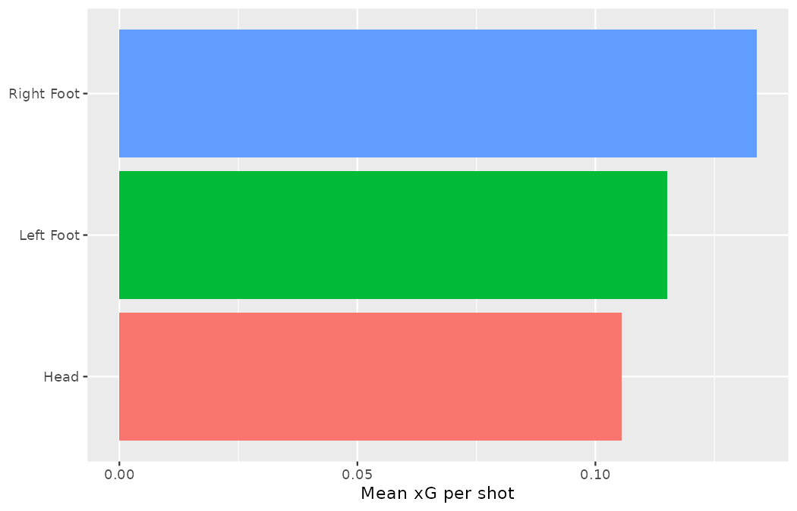{fig-alt="A horizontal bar plot of mean xG per shot for Head, Left Foot, and Right Foot, each bar in a different unrelated default hue that carries no information the axis labels do not already carry." width=85%}

The three bars appear in three unrelated default hues.
This coloring does nothing for the understanding of the data: it can be distracting and makes the reader ask questions the data cannot answer — is there something similar about two bars that happen to receive similar hues?
The color carries no information the y-axis labels don't already carry.

Since the brief is about headers, the figure should *point at the header bar*:

```r
bodypart_xg |>
  mutate(highlight = if_else(body_part == "Head", "yes", "no")) |>
  ggplot(aes(y = body_part, x = mean_xg, fill = highlight)) +
  geom_col(show.legend = FALSE) +
  scale_fill_manual(values = c(no = "grey70", yes = "firebrick")) +
  labs(x = "Mean xG per shot", y = NULL)
```

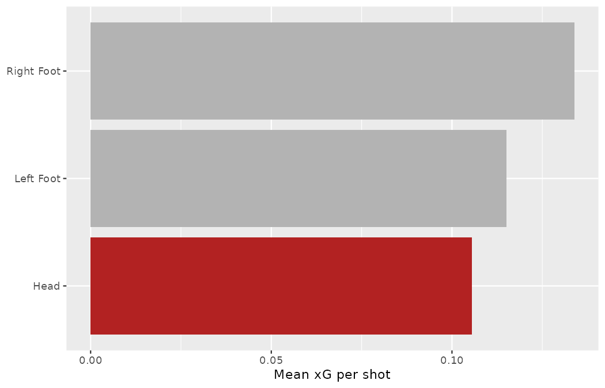{fig-alt="The same bar plot with the Head bar colored red and the two foot bars a quiet grey, drawing the eye to headers, which carry the lowest mean xG of 0.106 per shot." width=85%}

Now the `Head` bar is red and the two foot bars are a quiet grey.
The reader's eye lands exactly where the brief points: headed chances at the 2022 World Cup carried the lowest average chance quality of the three body parts, mean xG 0.106 per shot, against 0.115 for left-footed and 0.134 for right-footed shots.
(Whether that is a property of heading or of the crosses and corners that produce headers is the confounding question raised in @sec-data-design — the plot communicates the pattern; it does not adjudicate its cause.)

One honesty check is owed before this slide ships, per the book's penalty convention (recall @sec-data-applications): the two foot bars contain the tournament's 64 penalties — every one of them footed, every one at the stored chance quality of 0.7835 — while the header bar contains none.
Restrict the same summary to open play and the story changes:

```r
wc2022_shots |>
  filter(shot_type == "Open Play", body_part != "Other") |>
  group_by(body_part) |>
  summarize(shots = n(), mean_xg = mean(statsbomb_xg))
#> # A tibble: 3 × 3
#>   body_part  shots mean_xg
#>   <chr>      <int>   <dbl>
#> 1 Head         252  0.106
#> 2 Left Foot    414  0.0928
#> 3 Right Foot   703  0.0932
```

Within open play the ordering *reverses*: the header bar (0.106 — unchanged, since every header in these data is an open-play shot) now sits *above* both foot bars (0.093 apiece).
The all-shots figure and the open-play figure are both true; they answer different questions, and the slide must say which frame it shows — an aerial-threat brief is almost certainly asking the open-play question.
(The reversal is no fluke of this summary: in @sec-model-mlr, a model fit to the open-play frame puts a positive coefficient on the header indicator.)

Also note that not everyone sees color the same way.
Often it's useful to add color *and one more feature* — a pattern, an outline, a linetype — so that you can refer to the features you're drawing attention to in multiple ways:

```r
bodypart_xg |>
  mutate(highlight = if_else(body_part == "Head", "yes", "no")) |>
  ggplot(aes(
    y = body_part, x = mean_xg,
    fill = highlight, color = highlight, linetype = highlight
  )) +
  geom_col(show.legend = FALSE, linewidth = 0.8) +
  scale_fill_manual(values = c(no = "grey70", yes = "firebrick")) +
  scale_color_manual(values = c(no = "grey70", yes = "black")) +
  labs(x = "Mean xG per shot", y = NULL)
```

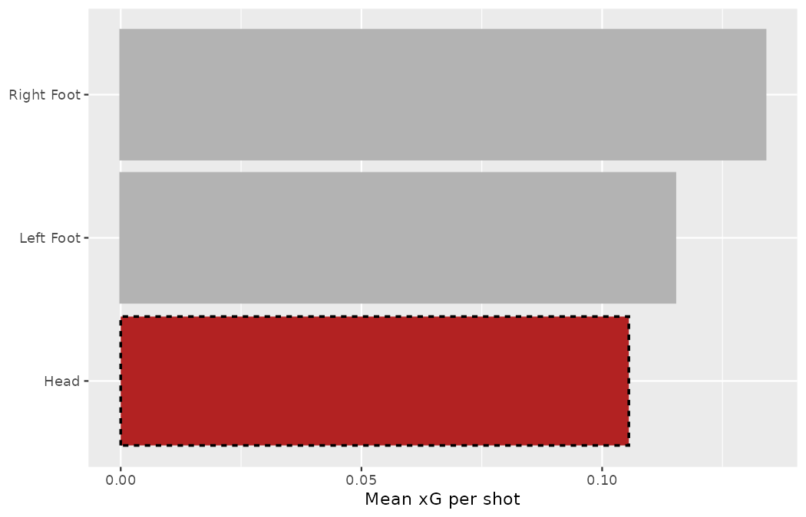{fig-alt="The highlighted bar plot with the Head bar now both red and outlined with a distinct black border, so a reader who cannot distinguish red from grey still sees exactly one bar marked out." width=85%}

The header bar is now both red *and* outlined with a distinct border, so a reader who cannot distinguish red from grey still sees exactly one bar marked out.

::: {.callout-tip title="Check your understanding"}
A colleague defends the rainbow version: "the colors don't hurt — they're just decoration."
Give two concrete ways an uninformative color mapping can actively hurt a scouting figure.

------------------------------------------------------------------------

First, it invites false groupings: readers instinctively treat similarly colored categories as related, an association the data do not contain.
Second, it spends the single most attention-grabbing visual channel on nothing, so when there *is* a feature the club needs to see — the header bar in a brief about aerial threat — no channel is left to mark it out.
Color is a finite budget; decoration is the most expensive way to waste it.
:::

### Tell a story

For many graphs, an important aspect is the inclusion of information which is not provided in the dataset that is being plotted.
The external information serves to contextualize the data and helps communicate the narrative of the research.

Consider the rhythm of a tournament: how many shots does each matchday produce?
We build, for each competition, a per-matchday count — one row per calendar day on which at least one match was played, indexed within its own tournament so the two competitions can share an x-axis:

```r
daily_shots <- bind_rows(wc2022_shots, weuro2025_shots) |>
  group_by(competition, match_date) |>
  summarize(
    n_shots = n(),
    knockout = all(stage != "Group Stage"),
    .groups = "drop"
  ) |>
  arrange(competition, match_date) |>
  group_by(competition) |>
  mutate(matchday = row_number()) |>
  ungroup()

daily_shots
#> # A tibble: 42 × 5
#>    competition match_date n_shots knockout matchday
#>    <chr>       <date>       <int> <lgl>       <int>
#>  1 wc2022      2022-11-20      11 FALSE           1
#>  2 wc2022      2022-11-21      59 FALSE           2
#>  3 wc2022      2022-11-22      86 FALSE           3
#>  4 wc2022      2022-11-23      99 FALSE           4
#>  5 wc2022      2022-11-24      80 FALSE           5
#>  6 wc2022      2022-11-25      88 FALSE           6
#>  7 wc2022      2022-11-26      89 FALSE           7
#>  8 wc2022      2022-11-27      76 FALSE           8
#>  9 wc2022      2022-11-28     101 FALSE           9
#> 10 wc2022      2022-11-29      81 FALSE          10
#> # ℹ 32 more rows
```

A first, un-annotated time series plot simply colors the two tournaments differently:

```r
ggplot(daily_shots, aes(x = matchday, y = n_shots, color = competition)) +
  geom_line(linewidth = 1) +
  labs(
    x = "Matchday (day of the tournament with at least one match)",
    y = "Shots recorded",
    color = NULL
  )
```

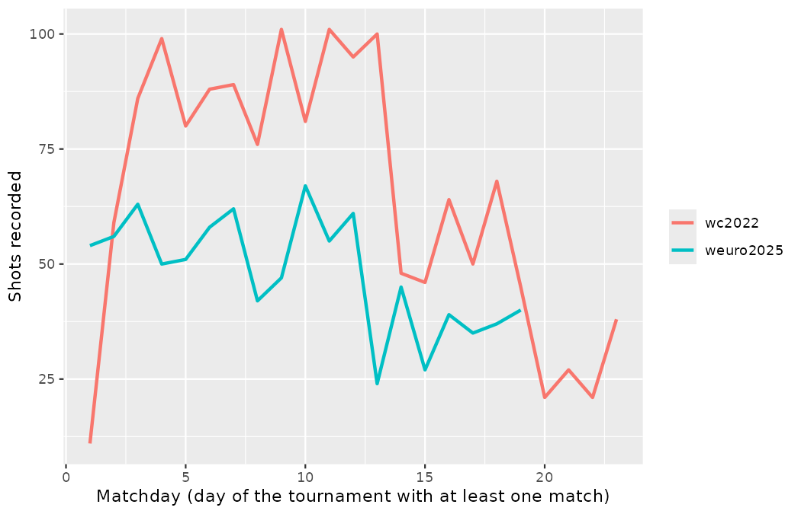{fig-alt="A line plot of shots recorded per matchday for the 2022 World Cup and the 2025 Women's Euro, with both lines appearing to collapse late in each tournament." width=85%}

The World Cup line starts at 11 shots (a single opening match), jumps to 59 on matchday 2 as the schedule fills, and from matchday 3 oscillates between 76 and 101 shots a day through matchday 13; then it collapses: 48, 46, 64, 50, 68, 45, and eventually days of 21–38 shots.
The Women's Euro line hovers between 42 and 67 through matchday 12 and then drops to the 24–45 range.
A reader who does not know tournament football sees two attacking collapses and starts inventing explanations — fatigue? weather? teams "shutting up shop"?

The plot is missing its story.
The break in each line is not about football at all; it is about the *fixture calendar*, information that lives outside the plotted data.
We compute where the knockout rounds begin and annotate the figure with it:

```r
knockout_starts <- daily_shots |>
  filter(knockout) |>
  group_by(competition) |>
  summarize(first_knockout_matchday = min(matchday))

knockout_starts
#> # A tibble: 2 × 2
#>   competition first_knockout_matchday
#>   <chr>                         <int>
#> 1 wc2022                           14
#> 2 weuro2025                        13
```

```r
ggplot(daily_shots, aes(x = matchday, y = n_shots)) +
  geom_line(linewidth = 0.8, color = "steelblue") +
  geom_vline(
    data = knockout_starts,
    aes(xintercept = first_knockout_matchday - 0.5),
    linetype = "dashed"
  ) +
  geom_text(
    data = knockout_starts,
    aes(x = first_knockout_matchday - 0.5, y = 95),
    label = "Knockout rounds begin:\nfewer matches per day",
    hjust = -0.05, size = 3
  ) +
  facet_wrap(~ competition, ncol = 1) +
  labs(
    x = "Matchday (day of the tournament with at least one match)",
    y = "Shots recorded"
  )
```

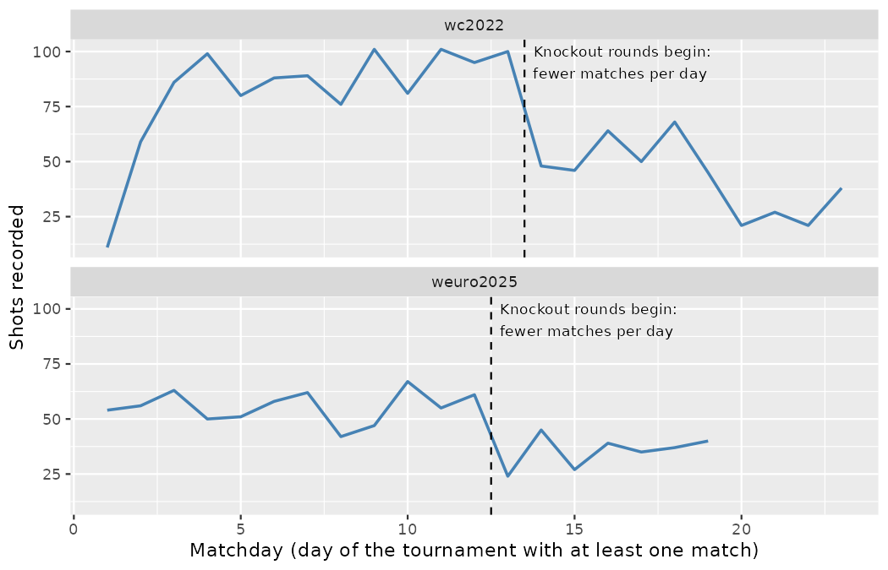{fig-alt="The same daily shot counts faceted by competition, with a dashed vertical line and annotation marking where the knockout rounds begin and the number of matches per day falls." width=85%}

The **annotated** version places a dashed vertical line just before matchday 14 (World Cup) and matchday 13 (Women's Euro), labeled with the external fact: the group stage, with up to four matches per day at the World Cup and two per day at the Euro, gives way to knockout rounds with two, then one match per day.
The "collapse" is a schedule artifact.

And once the annotation forces the right denominator on us, the story inverts.
Dividing each World Cup matchday's shots by the number of matches played that day:

```r
wc2022_shots |>
  count(match_date, name = "n_shots") |>
  left_join(
    wc2022_matches |> count(match_date, name = "n_matches"),
    by = "match_date"
  ) |>
  mutate(knockout = match_date >= as.Date("2022-12-03")) |>
  group_by(knockout) |>
  summarize(
    matchdays = n(),
    shots_per_day = mean(n_shots),
    shots_per_match = mean(n_shots / n_matches)
  )
#> # A tibble: 2 × 4
#>   knockout matchdays shots_per_day shots_per_match
#>   <lgl>        <int>         <dbl>           <dbl>
#> 1 FALSE           13          82              21.5
#> 2 TRUE            10          42.8            26.8
```

Per *day*, shooting nearly halves (82 to 42.8); per *match*, it rises from 21.5 to 26.8 — knockout matches, with extra time and teams chasing deficits, produce *more* shots, not fewer.
A scout reading the raw daily series would have taken away exactly the wrong lesson.
This is what "tell a story" means: the annotation is not decoration, it is the difference between the right conclusion and its opposite.

Sometimes the additional information may be a diagonal line given by $y = x$.
In a scatterplot of goals against total xG for each team-match, for instance, points above the line quickly show the reader which team-matches produced more goals than their chance quality suggested — finishing above expectation — and points below the line show the opposite.

::: {.callout-tip title="Check your understanding"}
Emil Sørensen looks at the first (un-annotated) plot and drafts the note: "attacking output falls sharply once the knockout rounds start — teams become cautious."
Using the computations above, rewrite his note so that it is supported by the data.

------------------------------------------------------------------------

"Total shots per *day* fall after the group stage because the schedule drops from four matches a day to two and then one.
Per *match*, shooting actually rises in the knockout rounds — from about 21.5 to about 26.8 shots per match at the 2022 World Cup — partly because knockout matches can run to extra time and force trailing teams to attack."
Same data, opposite conclusion; the difference is the denominator that the annotation forced us to notice.
:::

### Order matters

Most software programs have built in methods for some of the plot details — some order levels alphabetically, some provide functionality for arranging them in a custom order.
Sorting the Argentina bar plot by frequency was the right call earlier because `play_pattern` is nominal: its levels have no inherent order, so the counts themselves are the most useful ordering.
Ordinal variables are different, and this is where defaults quietly mislead.

Here is a constructed Northbridge scenario — as always, built in seeded code, never presented as real.
In midwinter, Priya polled all 48 regional scouts of Emil's network on a single question about a winger the club has tracked all season, who plays his club football in Iberia:

> Based on the last three months of reports, how would you rate the prospect's readiness for our first team?
>
> -   Excellent
> -   Good
> -   Average
> -   Poor
> -   Don't know

Each scout belongs to one scouting region, and the regions differ in how they have seen the player: the twelve Iberia-based scouts watch him live most weeks, while the South America desk knows him almost entirely from video.
We build the panel with region-specific response profiles so the constructed data contain exactly that structure (which we will exploit in the following sections):

```r
set.seed(601)
rating_levels <- c("Excellent", "Good", "Average", "Poor", "Don't know")

panel_design <- tribble(
  ~region,             ~n_scouts, ~probs,
  "Iberia",              12, c(0.30, 0.40, 0.20, 0.05, 0.05),
  "Britain & Ireland",   11, c(0.08, 0.25, 0.35, 0.20, 0.12),
  "Northern Europe",     10, c(0.08, 0.25, 0.35, 0.20, 0.12),
  "Balkans",              8, c(0.05, 0.20, 0.35, 0.25, 0.15),
  "South America",        7, c(0.05, 0.15, 0.30, 0.20, 0.30)
)

scout_panel <- panel_design |>
  mutate(
    rating = map2(
      n_scouts, probs,
      \(n, p) sample(rating_levels, size = n, replace = TRUE, prob = p)
    )
  ) |>
  select(region, rating) |>
  unnest(rating)

scout_panel |>
  count(rating, sort = TRUE)
#> # A tibble: 5 × 2
#>   rating         n
#>   <chr>      <int>
#> 1 Good          14
#> 2 Poor          14
#> 3 Average       13
#> 4 Excellent      5
#> 5 Don't know     2
```

The panel splits 5 Excellent, 14 Good, 13 Average, 14 Poor, 2 Don't know.
Now consider three ways of arranging the bars of the same plot.

```r
# (a) Alphabetical order -- the software default for character data
ggplot(scout_panel, aes(y = rating)) +
  geom_bar() +
  labs(y = "Rating", x = "Number of scouts")

# (b) Frequency order
ggplot(scout_panel, aes(y = reorder(rating, rating, FUN = length))) +
  geom_bar() +
  labs(y = "Rating", x = "Number of scouts")

# (c) The order of the rating scale itself
scout_panel |>
  mutate(rating = factor(rating, levels = rev(rating_levels))) |>
  ggplot(aes(y = rating)) +
  geom_bar() +
  labs(y = "Rating", x = "Number of scouts")
```

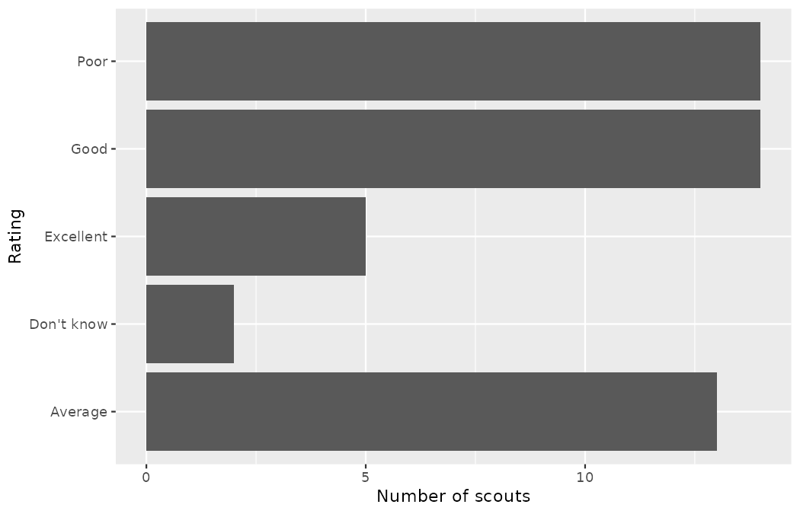{fig-alt="A bar plot of scout ratings with levels in alphabetical order: Average, Don't know, Excellent, Good, Poor, interleaving the extremes of the scale with its middle." width=85%}

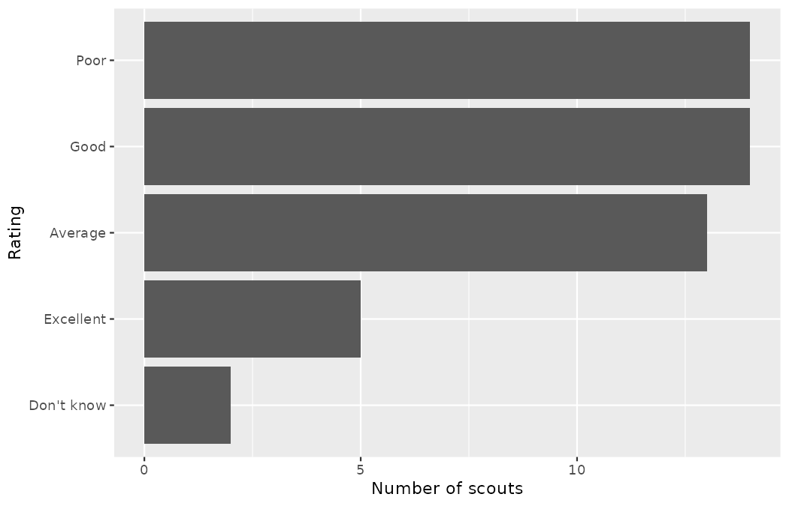{fig-alt="The same bar plot ordered by frequency, placing the tied Good and Poor bars of 14 scouts each adjacent even though they sit at opposite ends of the readiness scale." width=85%}

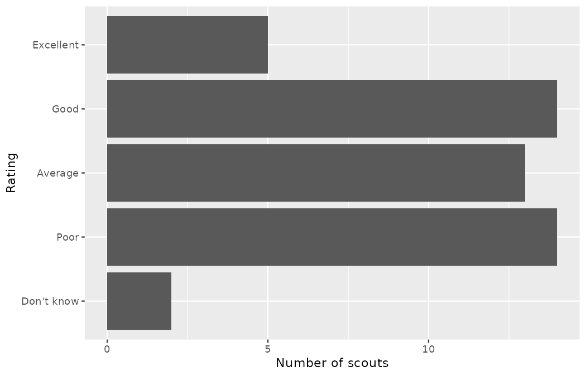{fig-alt="The same bar plot ordered by the rating scale itself, from Excellent at the top down through Poor with Don't know last, showing the panel's center of mass between Good and Poor." width=85%}

In plot (a) the bars run Average, Don't know, Excellent, Good, Poor — the alphabetical ordering isn't particularly meaningful for describing the data, and it interleaves the extremes of the scale with its middle.
Sometimes it makes sense to **order** the bars from tallest to shortest (or vice versa), as in plot (b) — though notice that here `Good` and `Poor` tie at 14 scouts each, so even the "frequency order" is partly arbitrary, and it still shuffles the scale: the two ends of the readiness spectrum end up adjacent.
But in this case, the best ordering is the one in which the response options were presented, as shown in plot (c): Excellent at the top down through Poor, with Don't know last.
The rating scale is ordinal — its order *is* information — and plot (c) is the only one of the three that lets the reader see at a glance that the panel's center of mass sits between Good and Poor, with a nearly symmetric split.

An ordering which does not make sense in the context of the problem (e.g., alphabetically here) can mislead the reader who might take a quick glance at the axes and not read the bar labels carefully — a glance at plot (a) suggests "Average" is the panel's floor rather than its middle.

::: {.callout-tip title="Check your understanding"}
For the Argentina `play_pattern` bar plot of the first section, we recommended frequency order; for the scout ratings we just rejected it.
What property of the variable decides which ordering to use?

------------------------------------------------------------------------

Whether the variable's levels carry an inherent order.
`play_pattern` is nominal — no level comes "before" another — so the data's own frequencies are the most informative arrangement.
The rating scale is ordinal — Excellent through Poor is a progression — so the scale's order carries meaning that frequency sorting destroys (and, with the Good/Poor tie at 14, frequency order here isn't even well defined).
:::

### Make the labels as easy to read as possible

The panel results become more interesting when broken down by scouting region — this is, after all, where the disagreement lives.
The stacked bar plot allows for comparison of the rating mix across the five regions.
Before plotting, we fix both factors' level orders deliberately, per the previous principle:

```r
scout_panel <- scout_panel |>
  mutate(
    rating = factor(rating, levels = rating_levels),
    region = factor(region, levels = panel_design$region)
  )

# (a) Vertical bars
ggplot(scout_panel, aes(x = region, fill = rating)) +
  geom_bar() +
  labs(x = "Scouting region", y = "Number of scouts", fill = "Rating")

# (b) Horizontal bars
ggplot(scout_panel, aes(y = region, fill = rating)) +
  geom_bar() +
  labs(x = "Number of scouts", y = NULL, fill = "Rating") +
  theme(legend.position = "bottom")
```

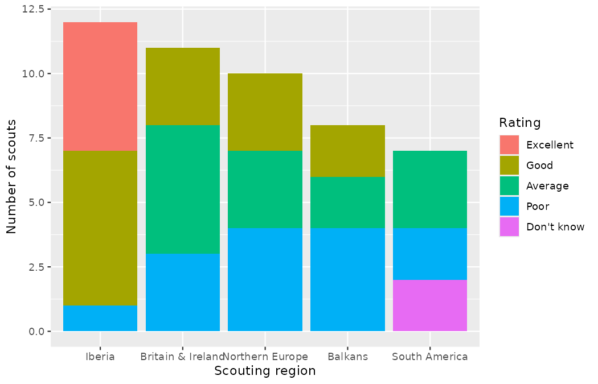{fig-alt="A vertical stacked bar plot of scout counts by region and rating, whose long region names crowd the x-axis." width=85%}

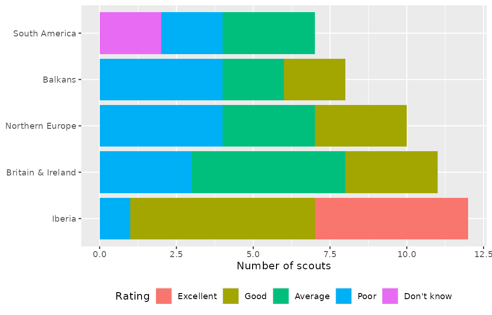{fig-alt="The same stacked bar plot flipped to horizontal bars, giving each region name its own line of readable axis-label space." width=85%}

While the quantitative information in the two graphics is identical, flipping the graph and creating horizontal bars provides more space for the **axis labels**.
With vertical bars, the region names — "Britain & Ireland", "Northern Europe", "South America" — crowd the x-axis and tempt the software into shrinking or rotating them; rotated labels force the reader to tilt their head, and abbreviated ones force them to guess.
With horizontal bars each region name sits on its own line, read the way text is meant to be read.
The easier the categories are to read, the more the reader will learn from the visualization.
Remember, the goal is to convey as much information as possible in a succinct and clear manner.

### Pick a purpose

Every graphical decision should be made with a **purpose**.
As previously mentioned, sticking with default options is not always best for conveying the narrative of your data story.
Stacked bar plots tell one part of a story.
Depending on your research question, they may not tell the part of the story most important to the research.

The code below gives three different representations of the same two variables, `region` and `rating`.

```r
# (a) Proportions: compare the rating mix across regions
ggplot(scout_panel, aes(y = region, fill = rating)) +
  geom_bar(position = "fill") +
  labs(x = "Proportion of scouts", y = NULL, fill = "Rating") +
  theme(legend.position = "top")

# (b) Counts: keep the size of each regional desk visible
ggplot(scout_panel, aes(y = region, fill = rating)) +
  geom_bar() +
  labs(x = "Number of scouts", y = NULL, fill = "Rating") +
  theme(legend.position = "top")

# (c) Faceted: one small bar plot per region
ggplot(scout_panel, aes(y = rating)) +
  geom_bar() +
  facet_grid(. ~ region) +
  labs(
    title = "How would you rate the prospect's readiness for our first team?",
    subtitle = "Northbridge United scouting panel, all 48 regional scouts",
    caption = "Constructed illustration, seed 601 -- not real survey data",
    x = "Number of scouts",
    y = NULL
  )
```

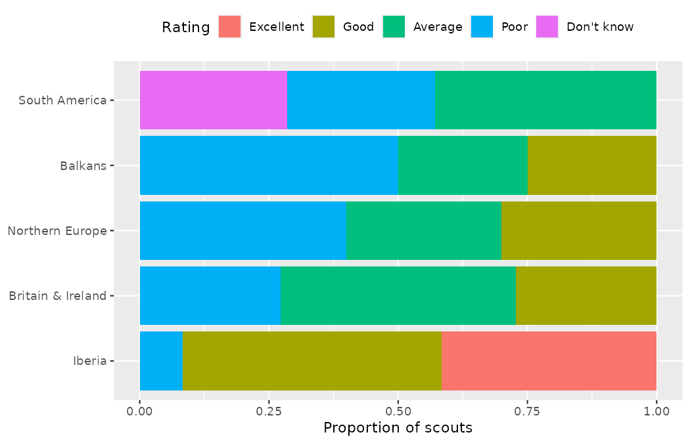{fig-alt="A proportional stacked bar plot in which each region's bar is standardized to length one, showing Iberia's mix dominated by Excellent and Good while every other region centers on Average and Poor." width=85%}

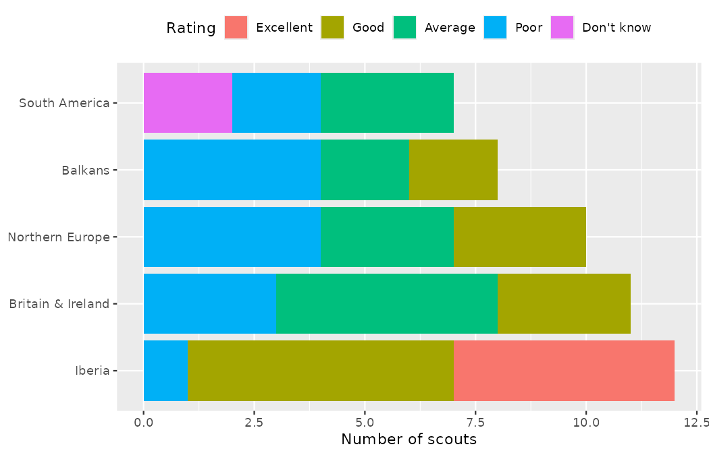{fig-alt="The same stacks shown as raw counts, keeping visible that Iberia has 12 scouts while South America has only 7." width=85%}

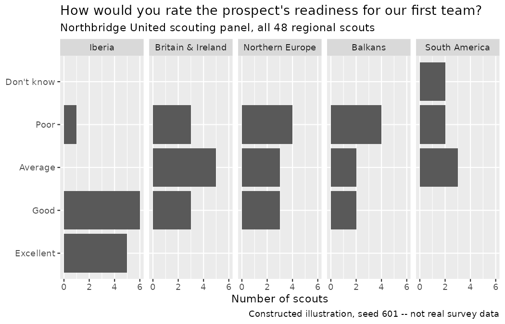{fig-alt="Small faceted bar plots of ratings, one per region, with a full title, a subtitle identifying the 48-scout panel, and a caption giving the simulation seed." width=85%}

If the most important comparison across regions is proportion, you might prefer plot (a): standardizing each bar to length one makes it immediate that Iberia's mix is dominated by Excellent and Good (11 of its 12 scouts) while every other region's mix centers on Average and Poor, and that the only Don't know responses (both of them) sit on the South America desk — the scouts who have seen the least of him live.
If the most important comparison across regions also considers the total number of scouts in each region, you might prefer plot (b): the same stacks, but now the eye also sees that Iberia (12) and Britain & Ireland (11) are the largest desks while South America has only 7 scouts, so its opinions rest on the fewest observers.
If a separate bar plot for each region makes the point you'd like, use plot (c), which has been **faceted** by region.
Plot (c) also provides a full title, a subtitle identifying the population of respondents, and a caption with the source — here, honestly, the seed of the simulation.
Other deliberate decisions to consider include using informative labels and avoiding redundancy.

::: {.callout-tip title="Check your understanding"}
Marta asks: "should I trust the Iberia desk's enthusiasm or the rest of the network's caution?"
Which of the three representations is the *wrong* one to hand her, and why?

------------------------------------------------------------------------

The proportion plot (a), on its own, is the most dangerous: it makes the South America desk's bar exactly as long as Iberia's, hiding the fact that one summarizes 7 scouts (2 of whom answered Don't know) and the other 12.
Her question is precisely about how to weigh conflicting groups, so the group sizes are part of the answer — plot (b) or (c), which keep counts visible, serve her better.
(And recall @sec-data-design: since scouts were not randomly assigned to viewing conditions, the Iberia gap is an association — more live viewing *goes with* higher ratings — not proof that live viewing causes enthusiasm.)
:::

### Select meaningful colors

One last consideration for building graphs is to consider color choices.
Default or rainbow colors are not always the choice which will best distinguish the level of your variables.
Much research has been done to find color combinations which are distinct and which are clear for differently sighted individuals.
The cividis scale, developed from that research, works well with ordinal data: its colors run along a single dark-to-light path, so the visual order of the colors matches the order of the rating scale.

```r
p <- ggplot(scout_panel, aes(y = region, fill = rating)) +
  geom_bar(position = "fill") +
  labs(
    title = "How would you rate the prospect's readiness for our first team?",
    subtitle = "Northbridge United scouting panel, all 48 regional scouts",
    caption = "Constructed illustration, seed 601 -- not real survey data",
    x = "Proportion of scouts",
    y = NULL,
    fill = NULL
  )

# (a) Default color scale
p

# (b) Cividis scale
p + scale_fill_viridis_d(option = "E")
```

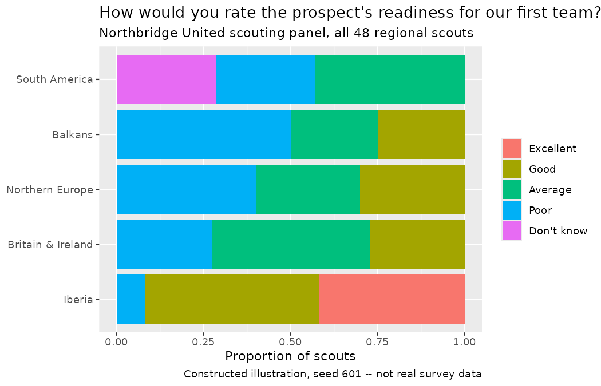{fig-alt="The proportional stacked bar plot with the five ratings in default evenly spaced hues, red through pink, which encode no order." width=85%}

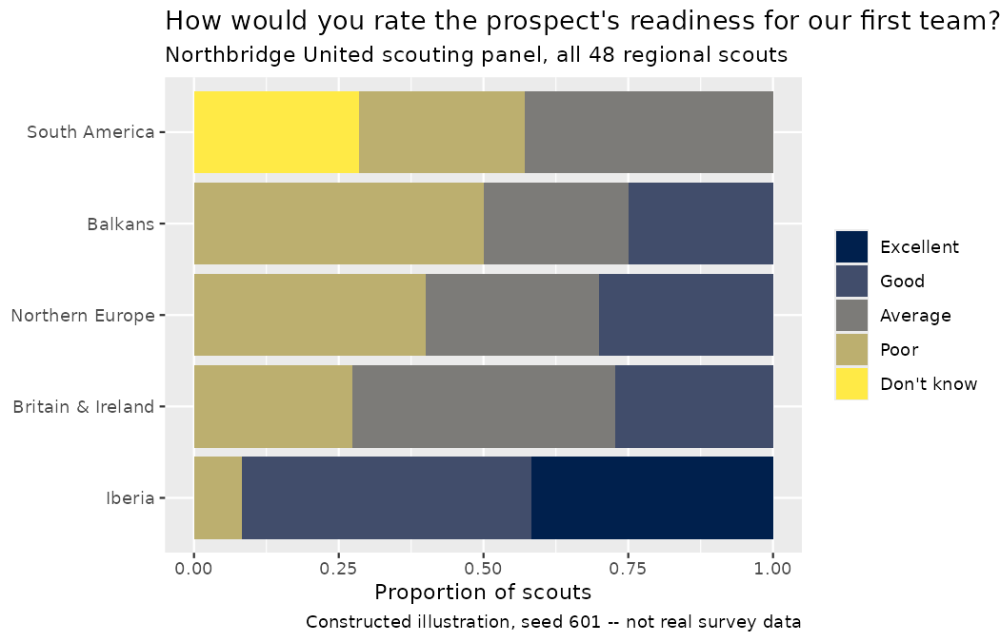{fig-alt="The identical bars recolored with the cividis scale, whose dark-to-light path matches the order of the rating scale and remains distinguishable in greyscale and for readers with color-vision deficiency." width=85%}

The two plots contain identical bars.
In version (a), the five ratings receive the default evenly-spaced hues — red through pink — which encode no order: nothing about the colors says Excellent is "more" than Good.
In version (b), the cividis scale colors Excellent dark blue-grey, shading step by step to Don't know in pale yellow; the lightness gradient reproduces the scale's ordering, so even in a greyscale printout of the dossier — and for readers with the common forms of color-vision deficiency — the segments remain distinguishable and *ordered*.

In this chapter different representations are contrasted to demonstrate best practices in creating graphs.
The fundamental principle is that your graph should provide maximal information succinctly and clearly.
Labels should be clear and oriented horizontally for the reader.
Don't forget titles and, if possible, include the source of the data — and, for constructed scenarios like the scout panel, the seed that regenerates them.

## Interactive R walkthrough {#sec-explore-tutorials}

Navigate the concepts you've learned in this part in R with the following self-paced walkthrough.
All you need is your own R console and the two tournament files — everything below runs from the derived data you have used since @sec-data-hello.
The walkthrough deliberately moves to the *second* tournament, the 2025 Women's Euro: every skill from this part of the book should transfer to a competition you haven't summarized yet, and checking that it does is the point.
Work each lesson yourself before reading the output; the code and results are printed so you can confirm your run.

**Lesson 1: Visualizing categorical data.**
England Women's won the tournament.
Build the sorted bar plot of their shots by play pattern — the same figure Priya built for Argentina in the case study — and decide, before you plot, which ordering `play_pattern` deserves.

```r
weuro2025_shots |>
  filter(team == "England Women's") |>
  count(play_pattern, sort = TRUE)
#> # A tibble: 9 × 2
#>   play_pattern       n
#>   <chr>          <int>
#> 1 Regular Play      36
#> 2 From Throw In     20
#> 3 From Corner       15
#> 4 Other             15
#> 5 From Free Kick    14
#> 6 From Goal Kick     5
#> 7 From Keeper        5
#> 8 From Counter       4
#> 9 From Kick Off      1

weuro2025_shots |>
  filter(team == "England Women's") |>
  count(play_pattern) |>
  ggplot(aes(x = n, y = reorder(play_pattern, n))) +
  geom_col() +
  labs(x = "Number of shots", y = NULL,
       title = "England's shots by play pattern, 2025 Women's Euro")
```

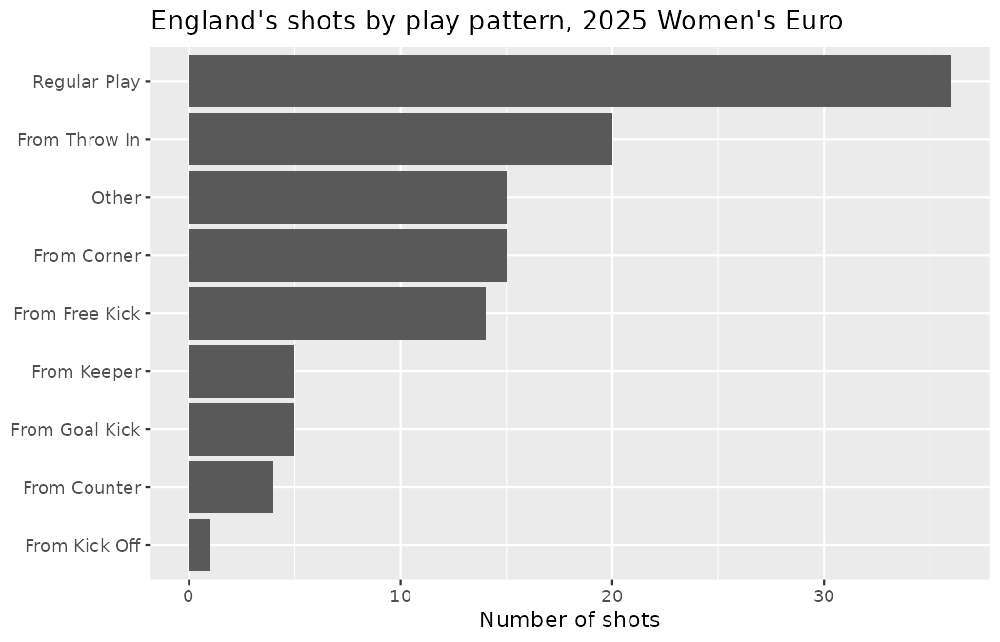{fig-alt="A frequency-sorted horizontal bar plot of England's shots by play pattern at the 2025 Women's Euro, with Regular Play at 36 shots on top and the suspicious Other bucket holding 15, tied with corners." width=85%}

Frequency order is right — `play_pattern` is nominal.
But do not stop at the plot: `Other`, a category that should be a dull miscellaneous bucket, holds 15 of England's 115 shots, tied with corners.
You met this suspicious bucket in @sec-data-applications; interrogate it again here.

```r
weuro2025_shots |>
  filter(team == "England Women's", play_pattern == "Other") |>
  count(shot_type, period)
#> # A tibble: 4 × 3
#>   shot_type period     n
#>   <chr>      <dbl> <int>
#> 1 Open Play      4     1
#> 2 Penalty        1     1
#> 3 Penalty        4     1
#> 4 Penalty        5    12
```

Fourteen of the fifteen are penalties, and twelve of those are period-5 shoot-out kicks: England went to a shoot-out twice on their way to the title, in the quarter-final against Sweden and in the final against Spain.
A bar plot that silently mixes shoot-out kicks with open-play chances tells Marta the wrong story about how England attack — exactly the keep-or-filter decision @sec-data-applications warned you the dataset never makes for you.

**Lesson 2: Visualizing numerical data.**
Draw the distribution of chance quality for every shot of the tournament.

```r
ggplot(weuro2025_shots, aes(x = statsbomb_xg)) +
  geom_histogram(binwidth = 0.05, boundary = 0) +
  labs(x = "Chance quality (xG) per shot", y = "Number of shots",
       title = "Chance quality of all 913 shots, 2025 Women's Euro")
```

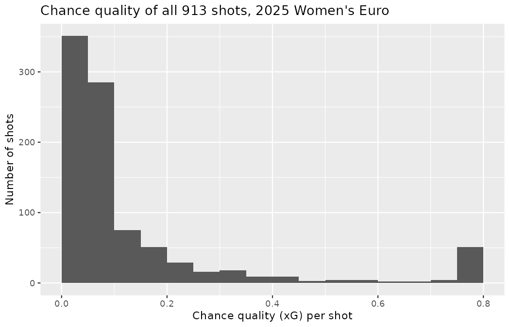{fig-alt="A strongly right-skewed histogram of chance quality for all 913 shots of the 2025 Women's Euro, with the two leftmost bars towering over everything and an isolated spike of 51 penalty kicks at 0.75 to 0.80." width=85%}

The histogram is strongly right-skewed: the two leftmost bars tower over everything (351 shots below 0.05 and another 285 between 0.05 and 0.10 — together about 70% of all 913 shots), the counts fall away steadily through the tail, and then, after a stretch of near-empty bins, an isolated spike of 51 shots stands at 0.75–0.80.
You should recognize that spike before you check: it is the penalties, every one carrying the model's flat penalty value.

```r
weuro2025_shots |>
  filter(shot_type == "Penalty") |>
  summarize(kicks = n(), mean_xg = mean(statsbomb_xg))
#> # A tibble: 1 × 2
#>   kicks mean_xg
#>   <int>   <dbl>
#> 1    51   0.784
```

The printed mean of $0.784$ is the display rounding of the stored penalty value $0.7835,$ identical for every kick (recall @sec-data-applications).
Any figure page you build from this variable must decide — visibly, in a caption or a filter — whether those 51 identical values belong in the story being told.

**Lesson 3: Summarizing with statistics.**
Recall from @sec-explore-numerical which summaries a skewed distribution distorts.

```r
weuro2025_shots |>
  summarize(mean_xg = mean(statsbomb_xg), median_xg = median(statsbomb_xg))
#> # A tibble: 1 × 2
#>   mean_xg median_xg
#>     <dbl>     <dbl>
#> 1   0.135    0.0630
```

The mean (0.135) sits at more than twice the median (0.063), dragged up by the right tail and the penalty spike — the textbook signature of right skew, now in a figure Marta will actually see.
Then redo the case study's highlighted body-part figure on this tournament, aerial-threat brief and all:

```r
weuro_bodypart <- weuro2025_shots |>
  filter(body_part != "Other") |>
  group_by(body_part) |>
  summarize(shots = n(), mean_xg = mean(statsbomb_xg))

weuro_bodypart
#> # A tibble: 3 × 3
#>   body_part  shots mean_xg
#>   <chr>      <int>   <dbl>
#> 1 Head         151   0.108
#> 2 Left Foot    256   0.130
#> 3 Right Foot   502   0.145

weuro_bodypart |>
  mutate(highlight = if_else(body_part == "Head", "yes", "no")) |>
  ggplot(aes(y = body_part, x = mean_xg, fill = highlight)) +
  geom_col(show.legend = FALSE) +
  scale_fill_manual(values = c(no = "grey70", yes = "firebrick")) +
  labs(x = "Mean xG per shot", y = NULL)
```

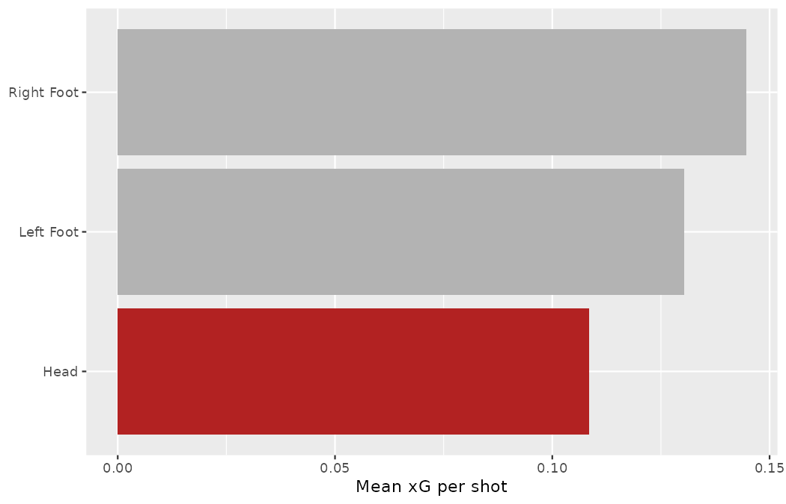{fig-alt="A bar plot of mean xG per shot by body part at the 2025 Women's Euro with the Head bar highlighted in red: 0.108 for headers against 0.130 for left-footed and 0.145 for right-footed shots." width=85%}

And apply the case study's honesty check here too, per the book's penalty convention: this tournament's foot bars carry its 51 penalties — all footed, all at the stored 0.7835 — while the header bar carries none.
On open play alone, the ordering reverses exactly as it did at the World Cup:

```r
weuro2025_shots |>
  filter(shot_type == "Open Play", body_part != "Other") |>
  group_by(body_part) |>
  summarize(shots = n(), mean_xg = mean(statsbomb_xg))
#> # A tibble: 3 × 3
#>   body_part  shots mean_xg
#>   <chr>      <int>   <dbl>
#> 1 Head         151  0.108
#> 2 Left Foot    242  0.0988
#> 3 Right Foot   454  0.0918
```

**Lesson 4: Case study.**
Return to the matchday time series of the case study and rebuild it for the Women's Euro alone: the daily shot counts, the dashed line where the knockout rounds begin (matchday 13, a 24-shot day), and an annotation stating the schedule fact that explains the drop.
Then write the two-sentence caption you would put under it in a dossier — one sentence for what the reader sees, one for the external fact that keeps them from misreading it.
If your caption survives the Emil test of the case study (does it force the right denominator?), you have finished this part of the book.

::: {.callout-tip title="Check your understanding"}
At the 2022 World Cup, headers carried the lowest average chance quality (0.106 xG per shot, against 0.115 for left-footed and 0.134 for right-footed shots).
Lesson 3 shows the Women's Euro numbers: 0.108 against 0.130 and 0.145.
Why is this replication worth a line in a scouting report — and was it inevitable that the pattern would carry over?

------------------------------------------------------------------------

The two tournaments are different competitions, different players, different samples — yet the ordering (head lowest, right foot highest) and even the rough magnitudes repeat, which makes the header pattern credible as a general feature of *all-shots* data — a feature that dissolves once the penalties are set aside, since on open play the ordering reverses in both tournaments (headers 0.106 and 0.108 against feet near 0.093 and 0.092–0.099), the replication you ran above.
What replicates, in other words, is the *artifact as well as the football*: both tournaments load their foot bars with identical-xG penalties, so both produce the same misleading all-shots ordering — and the same reversal when the frame is stated.
And no, carrying over was not inevitable: replication is a finding, not a formality.
Compare, on the same two tournaments, the conversion rate of first-time shots against controlled ones:

```r
bind_rows(wc2022_shots, weuro2025_shots) |>
  group_by(competition, first_time) |>
  summarize(shots = n(), conversion = mean(goal), .groups = "drop")
#> # A tibble: 4 × 4
#>   competition first_time shots conversion
#>   <chr>       <lgl>      <int>      <dbl>
#> 1 wc2022      FALSE       1026      0.121
#> 2 wc2022      TRUE         468      0.152
#> 3 weuro2025   FALSE        605      0.140
#> 4 weuro2025   TRUE         308      0.123
```

At the World Cup, first-time shots converted at a *higher* rate (0.152 vs 0.121); at the Women's Euro the direction *reversed* (0.123 vs 0.140).
A pattern holding in a second competition was never guaranteed — you had to check.
One caution before you bank that reversal, per the penalty lesson you just learned for the body-part bars: both splits above are all-shots figures, and the Euro's non-first-time bucket holds all 51 of its penalties.
Filtered to open play, the Euro runs $0.123$ vs $0.105$ — the *same* direction as the World Cup; whether this reversal is football or frame is a story @sec-foundations-decision-errors finishes.
Whether either gap is more than chance variation is a question for the inference chapters (@sec-foundations-randomization onward).
:::

## R lab: the figure page {#sec-explore-labs}

Further apply the concepts you've learned in this part with a lab assignment that walks you through a data analysis case study of your own.

Marta Vidal's brief: choose any one team from `weuro2025_shots` *other than* England, and produce the three-figure page of a scouting dossier on how that team generates chances.
Your page must contain:

1.  one figure summarizing a categorical variable (e.g., the team's play-pattern or body-part mix),
2.  one figure summarizing a numerical variable (e.g., the team's chance-quality distribution), and
3.  one figure comparing groups (e.g., chance quality across body parts, or the team against the rest of the tournament).

Every figure is checked against the case study's principles before it reaches Marta:

-   Is the figure as simple as the message allows (no pie charts with nine slices, no 3D)?
-   Does color, if present, draw attention to the feature the brief asks about — with a second visual cue for readers who do not see color the same way?
-   Is external context (schedule, penalties, group sizes) annotated where a reader would otherwise misread the data?
-   Are the levels ordered by a deliberate rule — the scale's own order for ordinal variables, frequency for nominal ones?
-   Are the labels horizontal and readable, with a title, informative axis names, and the data source in the caption?
-   Did you decide — and state — whether shoot-out kicks and penalties are in or out?

There is no new statistical machinery in this lab; that is the point.
The analysis is only as good as its communication, and this page is the communication.

## Chapter review {#sec-chp6-review}

### Summary

This chapter contrasted different representations of the same data to demonstrate best practices in creating graphs: keep the figure simple; spend color only to draw attention, and pair it with a second cue; annotate the external fact — a fixture calendar, a knockout cut-off — that the data alone cannot supply; order levels by a deliberate rule, respecting an ordinal scale's own order; orient labels so they can be read; choose the representation (proportions, counts, or facets) that answers the question actually asked; and pick color scales, like cividis, whose visual order matches the data's order and survives both greyscale printing and color-vision deficiency.
The fundamental principle is that your graph should provide maximal information succinctly and clearly — because in a club, the figure page of a dossier often *is* the thirty seconds of analysis a decision gets.

### Terms

The terms introduced in this chapter are presented below, alphabetized.
If you're not sure what some of these terms mean, we recommend you go back in the text and review their definitions.
You should be able to easily spot them as **bolded text**.

|            |         |         |
|:-----------|:--------|:--------|
| annotated  | color   | order   |
| axis labels | faceted | purpose |

: Terms introduced in this chapter. {#tbl-terms-chp-6}

------------------------------------------------------------------------

Adapted from *Introduction to Modern Statistics* by Çetinkaya-Rundel & Hardin (CC BY-SA 4.0); this adaptation is likewise CC BY-SA 4.0. Match data: StatsBomb open data.
