# Linear regression with a single predictor {#sec-model-slr}

::: {.chapterintro}
Linear regression is a very powerful statistical technique.
Many people have some familiarity with regression models just from reading scouting reports and match analytics, where straight lines are overlaid on scatterplots.
Linear models can be used for prediction — how many goals should a team's chances have produced? — or to describe the relationship between two numerical variables, assuming there is a linear relationship between them.
:::

## Fitting a line, residuals, and correlation {#sec-fit-line-res-cor}

When considering linear regression, it's helpful to think deeply about the line fitting process.
In this section, we define the form of a linear model, explore criteria for what makes a good fit, and introduce a new statistic called *correlation*.

### Fitting a line to data

Consider two variables whose relationship can be modeled *perfectly* with a straight line.
Every season the tournament organizer invoices each club for scout accreditation: a flat €400 processing fee per club, plus €150 for every scout accredited.
Twelve member clubs submitted requests last summer, and Emil Sørensen kept the invoices.
The equation for the invoice total is

$$
y = 400 + 150x
$$

where $x$ is the number of scouts accredited and $y$ is the total invoice in euros.
A club accrediting 4 scouts pays $400 + 150 \times 4 = 1000$ euros; a club accrediting 10 pays $400 + 150 \times 10 = 1900$ euros — exactly, every time.
Consider what a perfect linear relationship means: we know the exact value of $y$ just by knowing the value of $x.$
The code below draws the twelve invoices; because the cost is computed using a linear formula, the linear fit is perfect.

```r
library(dplyr)
library(readr)
library(ggplot2)

accreditation <- tibble(
  n_scouts = 1:12,
  invoice = 400 + 150 * n_scouts
)

ggplot(accreditation, aes(x = n_scouts, y = invoice)) +
  geom_smooth(method = "lm") +
  geom_point(size = 3) +
  labs(
    x = "Number of scouts accredited",
    y = "Total invoice (euros)"
  )
```

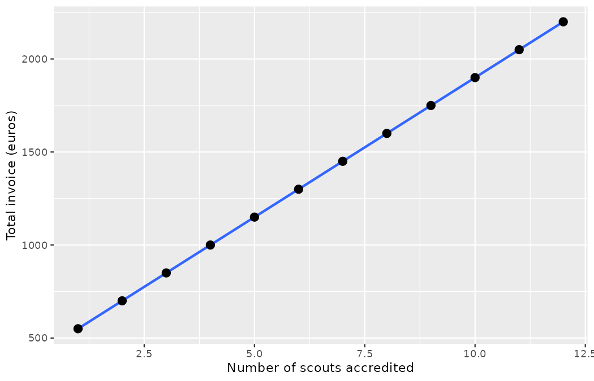{fig-alt="A scatterplot of twelve accreditation invoices against the number of scouts accredited, all points sitting exactly on the fitted line, which climbs from 550 euros at one scout to 2,200 euros at twelve." width=85%}

All twelve points sit exactly on the fitted line, which climbs from €550 at one scout to €2,200 at twelve.
A perfect linear relationship like this one is unrealistic in almost any natural process — it happens here only because the invoice *is computed from* a linear formula.
For example, if we took a team's accumulated chance quality in a match $(x),$ this value would provide some useful information about how many goals the team scored $(y).$
But the prediction would be far from perfect, since finishing, goalkeeping, and luck all play a role in goals beyond the quality of the chances.

Linear regression is the statistical method for fitting a line to data where the relationship between two variables, $x$ and $y,$ can be modeled by a straight line with some error:

$$
y = b_0 + b_1 \ x + e
$$

This is the central equation of the chapter, so let us take it apart symbol by symbol.
The letter $b$ denotes a coefficient computed from data; the subscript $0$ marks the **intercept**, the value of the line when $x = 0$; the subscript $1$ marks the **slope**, the change in the line's height for a one-unit increase in $x.$
So $b_0$ and $b_1$ represent the model's intercept and slope, respectively.
The final letter $e$ represents the *error*: the part of $y$ that the line does not capture.
The values $b_0$ and $b_1$ are calculated based on the data, i.e., they are sample statistics — just as $\bar{x}$ and $s$ were sample statistics in @sec-explore-numerical.
If the observed data is a random sample from a target population that we are interested in making inferences about, these values are considered to be point estimates for the population parameters $\beta_0$ and $\beta_1.$
The Greek letter $\beta$ (pronounced *beta*) is the population counterpart of the Roman letter $b$ — the same convention that pairs $\bar{x}$ with $\mu$ and $s$ with $\sigma,$ which you met in @sec-explore-numerical: Roman letters for statistics computed from a sample, Greek letters for the fixed, unknown truths about the population.
We will discuss how to make inferences about parameters of a linear model based on sample statistics in @sec-inf-model-slr.

When we use $x$ to predict $y,$ we usually call $x$ the **predictor** variable and we call $y$ the **outcome**.
We also often drop the $e$ term when writing down the model since our main focus is often on the prediction of the average outcome.

It is rare for all of the data to fall perfectly on a straight line.
Instead, it's more common for data to appear as a *cloud of points*, such as the three constructed scouting scatters built below.
This is a constructed illustration — Priya Rao assembled these panels for a training session with Emil's scouts, and the seeded code regenerates them exactly.

```r
set.seed(703)
scouting_clouds <- tibble(
  sprint_age    = runif(60, 18, 34),
  sprint_time   = 3.9 + 0.022 * (sprint_age - 18) + rnorm(60, 0, 0.045),
  minutes       = runif(60, 500, 3000),
  chances       = pmax(0, round(2 + 0.012 * minutes + rnorm(60, 0, 9))),
  shirt_number  = sample(1:40, 60, replace = TRUE),
  pass_accuracy = rnorm(60, 81, 5) - 0.04 * shirt_number
)

c(
  cor(scouting_clouds$sprint_age, scouting_clouds$sprint_time),
  cor(scouting_clouds$minutes, scouting_clouds$chances),
  cor(scouting_clouds$shirt_number, scouting_clouds$pass_accuracy)
) |>
  round(2)
#> [1] 0.91 0.69 0.06

p_strong <- ggplot(scouting_clouds, aes(x = sprint_age, y = sprint_time)) +
  geom_point(size = 2, alpha = 0.7) +
  geom_smooth(method = "lm", se = FALSE) +
  labs(x = "Age (years)", y = "30m sprint time (s)")

p_moderate <- ggplot(scouting_clouds, aes(x = minutes, y = chances)) +
  geom_point(size = 2, alpha = 0.7) +
  geom_smooth(method = "lm", se = FALSE) +
  labs(x = "League minutes played", y = "Chances created")

p_weak <- ggplot(scouting_clouds, aes(x = shirt_number, y = pass_accuracy)) +
  geom_point(size = 2, alpha = 0.7) +
  geom_smooth(method = "lm", se = FALSE) +
  labs(x = "Shirt number", y = "Pass accuracy (%)")
```

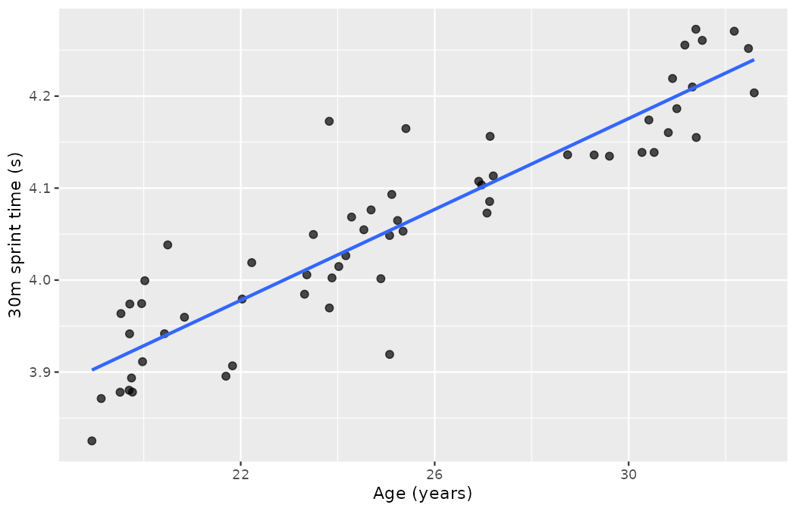{fig-alt="A constructed scouting scatter of 30m sprint time against age showing a strong upward linear trend around the fitted line; the correlation is 0.91." width=85%}

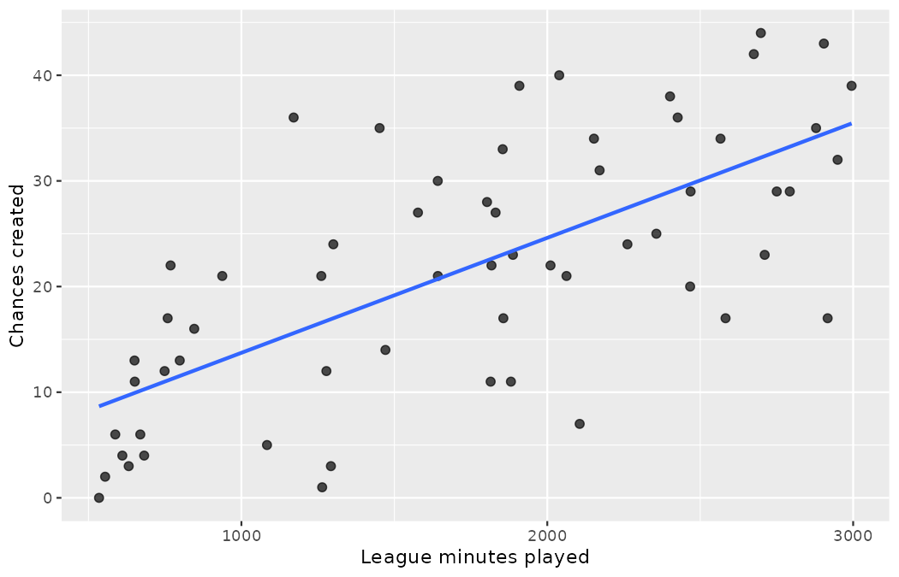{fig-alt="A scatter of chances created against league minutes played showing an evident but weaker upward trend with plenty of scatter; the correlation is 0.69." width=85%}

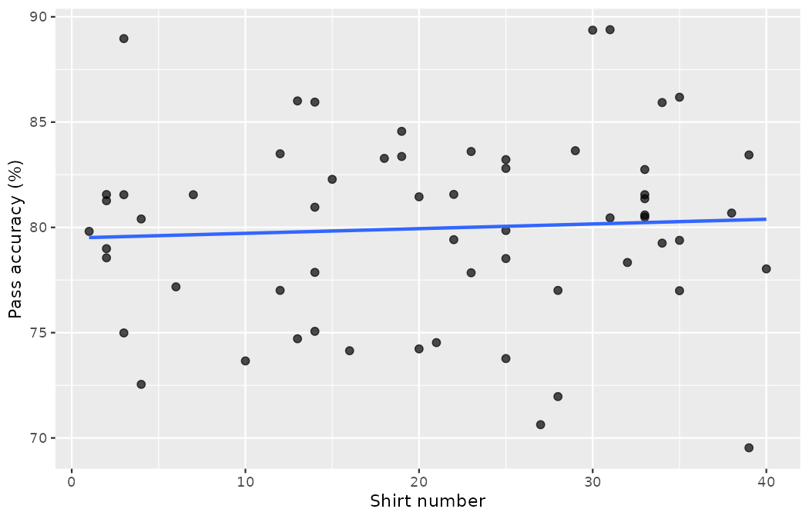{fig-alt="An essentially flat cloud of pass accuracy against shirt number with a nearly horizontal fitted line; the correlation is 0.06." width=85%}

In each case, the data fall around a straight line, even if none of the observations fall exactly on the line.
The first plot shows a strong upward linear trend — older players in this constructed pool run slower 30-metre sprints, and the remaining variability around the line is minor relative to the strength of the relationship (the correlation, a statistic we formalize later in this section, comes out at $0.91$).
The second plot shows an upward trend that, while evident, is not as strong as the first $(0.69)$: players with more minutes create more chances, but with plenty of scatter.
The last plot shows an essentially flat cloud $(0.06)$: shirt numbers, unsurprisingly, tell us almost nothing about pass accuracy — the trend is so slight we can hardly notice it.
In each of these examples, we will have some uncertainty regarding our estimates of the model parameters, $\beta_0$ and $\beta_1.$
For instance, we might wonder, should we move the line up or down a little, or should we tilt it more or less?
As we move forward in this chapter, we will learn about criteria for line-fitting, and we will also learn about the uncertainty associated with estimates of model parameters.

There are also cases where fitting a straight line to the data, even if there is a clear relationship between the variables, is not helpful.
One such case is the age–market-value curve every sporting director carries in their head: value rises through a player's early twenties, peaks, and falls away toward retirement.
The constructed panel below makes the point.

```r
age_curve <- tibble(
  age = runif(80, 18, 35),
  market_value = 24 - 0.22 * (age - 26.5)^2 + rnorm(80, 0, 2.5)
)

coef(lm(market_value ~ age, data = age_curve))
#> (Intercept)         age
#>  15.3951206   0.1357113

ggplot(age_curve, aes(x = age, y = market_value)) +
  geom_point(size = 2.5) +
  geom_smooth(method = "lm", se = FALSE) +
  labs(
    x = "Age (years)",
    y = "Market value (million euros)"
  )
```

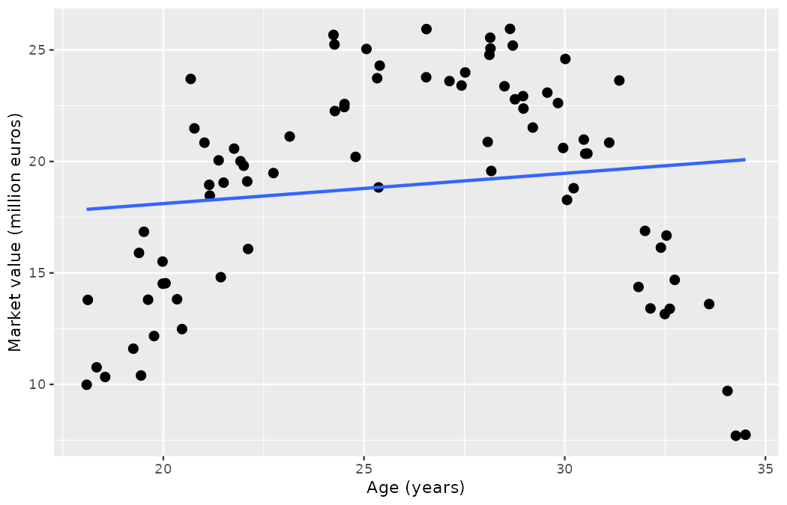{fig-alt="A scatterplot of market value against age rising from about 8 million euros at 18 to a peak near 24 million around age 26 to 27, then falling back by 35; the nearly flat fitted line is not a useful description of the hump-shaped relationship." width=85%}

The cloud rises from around €8M at age 18 to a peak near €24M around age 26–27, then falls back toward €8M by 35 — a very clear relationship.
Yet the best fitting *line* for these data is nearly flat (slope $0.14$ million euros per year), which is not a useful way to describe the hump-shaped relationship: the line under-predicts every peak-age player and over-predicts every teenager and every veteran.
We discuss nonlinear trends in this chapter and the next, but details of fitting nonlinear models are saved for a later course.

### Using linear regression to predict goals from chance quality

Recall the `team_match` dataset from @sec-explore-numerical: one row per team per match at the 2022 Men's World Cup, aggregating that team's shots into counts, total chance quality, and goals.
We rebuild it with exactly the same code (the code that derives a dataset should always be visible):

```r
wc2022_shots <- read_csv("data/derived/wc2022_shots.csv")

team_match <- wc2022_shots |>
  group_by(match_id, team) |>
  summarize(
    n_shots = n(),
    total_xg = sum(statsbomb_xg),
    goals = sum(goal),
    prop_under_pressure = mean(under_pressure),
    prop_set_piece = mean(play_pattern %in%
      c("From Corner", "From Free Kick", "From Throw In")),
    .groups = "drop"
  )

nrow(team_match)
#> [1] 127
```

As noted in @sec-explore-numerical, one team-match (Costa Rica's shotless outing against Spain) is missing, leaving 127 rows.
One honesty note before we model anything: the shot log includes every attempt StatsBomb recorded — open play, in-game penalties, and even the penalty-shootout attempts of drawn knockout ties — so `goals` counts all of them.
That bookkeeping choice inflates both `total_xg` and `goals` for shootout matches, on both sides of the equation; we keep the full log here because it is the canonical `team_match` object of this book, and we will simply read the model as describing *recorded attempts* rather than only the run of play.

We consider two of these measurements: the total chance quality a team accumulated in a match (`total_xg`) and the goals the team scored (`goals`).
The two variables are associated: team-matches with above-average accumulated chance quality also tend to have above-average goal counts.
While the relationship is not perfectly linear, it could be helpful to partially explain the connection between these variables with a straight line.

```r
ggplot(team_match, aes(x = total_xg, y = goals)) +
  geom_point(alpha = 0.7, size = 2) +
  labs(
    x = "Total chance quality (xG) accumulated in the match",
    y = "Goals scored"
  ) +
  geom_point(
    data = team_match |> filter(team == "Spain", goals == 7),
    color = "red", size = 5, shape = "circle open", stroke = 2
  )
```

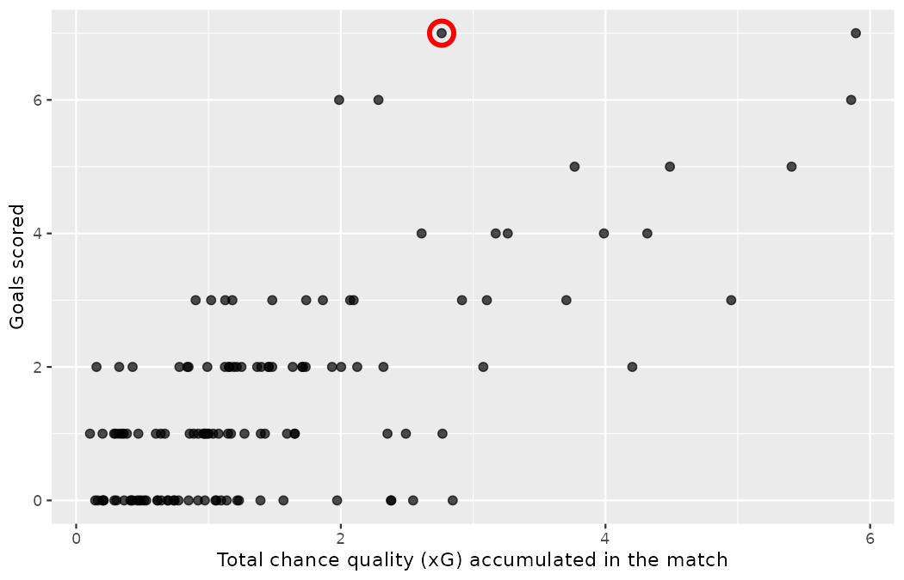{fig-alt="A scatterplot of 127 World Cup team-matches, goals scored against total accumulated chance quality, sweeping up and to the right with visible integer bands of goal counts. Spain's 7-goal match against Costa Rica is highlighted with an open red circle." width=85%}

Each of the 127 points represents a single team-match.
The cloud sweeps up and to the right: accumulated chance quality runs from $0.10$ to $5.89$ on the horizontal axis, goals from 0 to 7 on the vertical, with the goal counts forming visible integer bands.
One point is highlighted with a red circle: Spain's group-stage demolition of Costa Rica, in which 17 shots worth $2.76$ xG produced 7 goals — we will return to it shortly.

We want to describe the relationship between accumulated chance quality and goals with a line.
In this example, we will use `total_xg` as the predictor variable, $x,$ to predict a team's goals in a match, $y.$
We could fit the linear relationship by eye; instead, the code below has R compute it (the criterion R uses is the subject of @sec-least-squares-regression).

```r
fit_goals <- lm(goals ~ total_xg, data = team_match)
coef(fit_goals)
#> (Intercept)    total_xg
#>   0.1901285   0.9086896

ggplot(team_match, aes(x = total_xg, y = goals)) +
  geom_point(alpha = 0.7, size = 2) +
  labs(
    x = "Total chance quality (xG) accumulated in the match",
    y = "Goals scored"
  ) +
  geom_smooth(method = "lm", se = FALSE)
```

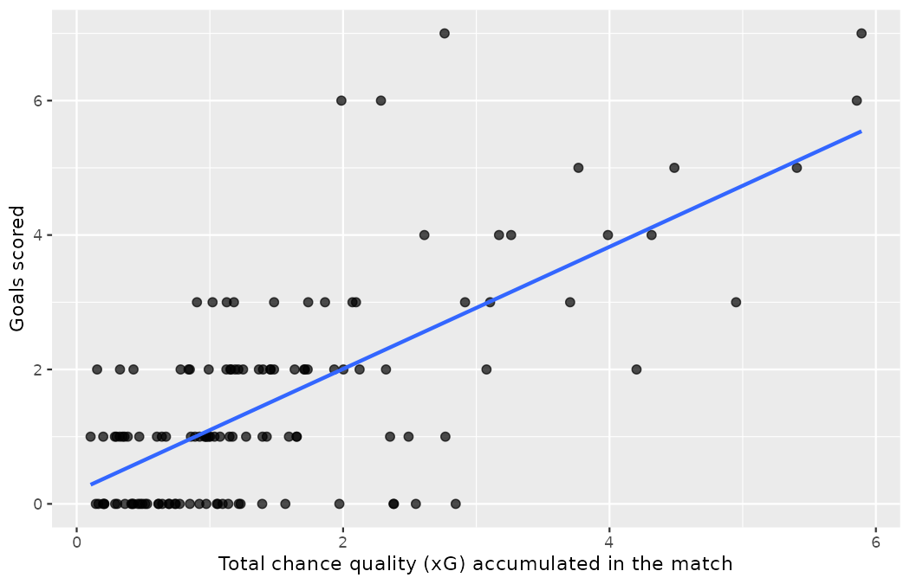{fig-alt="The same scatterplot of goals against total xG with the least squares line added, climbing at about 0.9 goals per unit of accumulated xG." width=85%}

The equation for this line is

$$
\hat{y} = 0.190 + 0.909x
$$

A "hat" on $y$ is used to signify that this is an estimate: read $\hat{y}$ ("y-hat") as *the value of $y$ the model predicts*, as opposed to a value of $y$ we actually observed.
This is the first hat in the book, and the convention is worth fixing now, because hats will follow us everywhere: a hat placed over a symbol always means an estimate, computed from data, of the unadorned quantity beneath it.
We can use this line to discuss properties of team performances.
For instance, the equation predicts a team-match with $2.0$ accumulated xG will produce

$$
\hat{y} = 0.190 + 0.909 \times 2.0 = 2.008
$$

goals — almost exactly two.
The estimate may be viewed as an average: the equation predicts that team-matches with $2.0$ accumulated chance quality will have an average goal count of about $2.0.$
Absent further information about a particular performance, the prediction that uses the average is a reasonable estimate.
Notice, too, what a slope of $0.909$ says to a scout: across this tournament, each additional unit of accumulated xG bought very nearly one additional goal on average — the "expected" in expected goals earning its name.

There may be other variables that could help us predict a team's goals besides its chance quality.
Perhaps the relationship is a little different in knockout football than in the group stage, or perhaps it differs between high-volume and low-volume shooting performances.
The code below redraws the scatterplot twice, taking each into consideration.

```r
team_match_stage <- wc2022_shots |>
  distinct(match_id, team, stage) |>
  right_join(team_match, by = c("match_id", "team")) |>
  mutate(knockout = stage != "Group Stage")

p_stage <- ggplot(team_match_stage,
                  aes(x = total_xg, y = goals,
                      color = knockout, shape = knockout)) +
  geom_point(alpha = 0.8, size = 2) +
  labs(x = "Total xG", y = "Goals", color = "Knockout", shape = "Knockout")

p_volume <- ggplot(team_match_stage,
                   aes(x = total_xg, y = goals, color = n_shots)) +
  geom_point(size = 2) +
  labs(x = "Total xG", y = "Goals", color = "Shots")
```

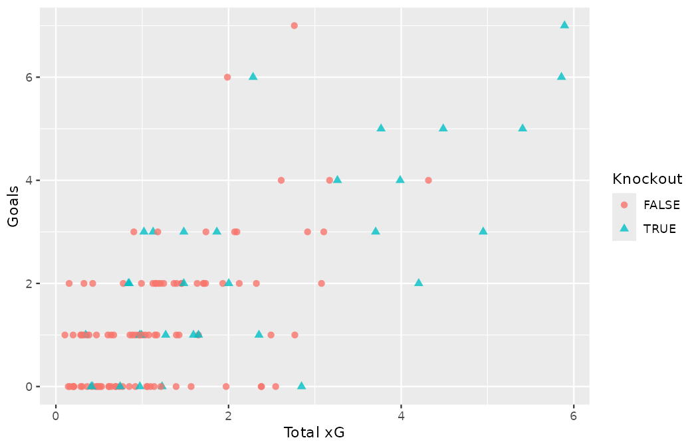{fig-alt="The team-match scatterplot with the 32 knockout team-matches drawn as triangles in a second color; they occupy the upper right of the cloud but scatter around the same upward trend as the group-stage points." width=85%}

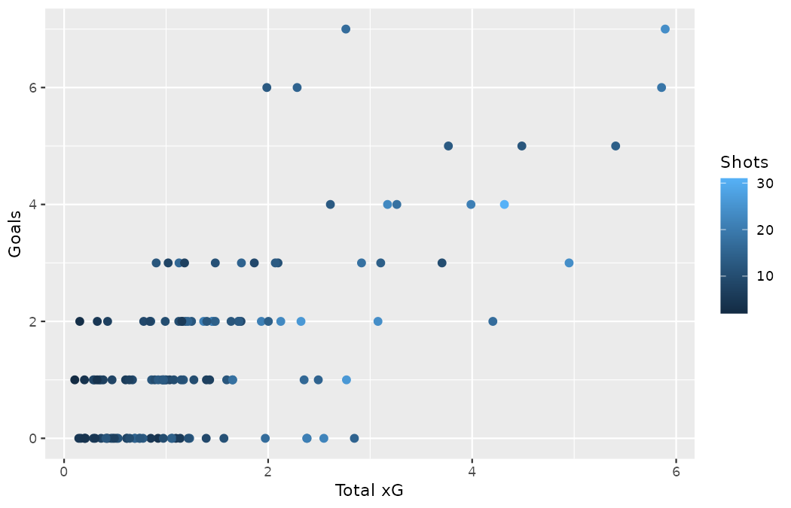{fig-alt="The team-match scatterplot with points colored by shot volume on a continuous scale; the very highest-volume outings sit, if anything, slightly below the trend." width=85%}

In the first panel, the 32 knockout team-matches (triangles) occupy the upper-right of the cloud — extra time and shootout attempts push both their xG (average $2.32$ versus $1.20$ in the group stage) and their goal counts up — but they scatter around the same upward trend as the 95 group-stage points rather than forming a separate band.
The second panel colors points by shot volume; it's harder to tell whether volume changes the relationship between chance quality and goals, though the very highest-volume outings sit, if anything, slightly below the line.
In @sec-model-mlr, we'll learn about how we can include more than one predictor in our model.
Before we get there, we first need to better understand how to best build a linear model with one predictor.

### Residuals {#sec-resids}

**Residuals** are the leftover variation in the data after accounting for the model fit:

$$
\text{Data} = \text{Fit} + \text{Residual}
$$

Each observation will have a residual, and three of the residuals for the linear model we fit to `team_match` are displayed below.
If an observation is above the regression line, then its residual, the vertical distance from the observation to the line, is positive.
Observations below the line have negative residuals.
One goal in picking the right linear model is for residuals to be as small as possible.

For a scout, the residual of this particular model is not statistical debris — it is a concept in its own right.
A team-match above the line scored *more* goals than its chances were worth: finishing over-performance.
A team-match below the line wasted its chances: finishing under-performance.
When Marta Vidal asks "did they score because they created, or because they finished?", she is asking about the fit and the residual respectively — and we will meet this exact decomposition again in @sec-inf-model-slr.

The code below computes the residuals for three team-matches we will keep an eye on: Spain's 7-goal group-stage match, Canada's group-stage match against Belgium, and Morocco's semi-final against France.

```r
team_match |>
  mutate(
    predicted = 0.190 + 0.909 * total_xg,
    residual = goals - predicted
  ) |>
  filter(
    (team == "Spain" & goals == 7) |
      (team == "Canada" & n_shots == 22) |
      (team == "Morocco" & round(total_xg, 2) == 1.23)
  ) |>
  select(team, n_shots, total_xg, goals, predicted, residual)
#> # A tibble: 3 × 6
#>   team    n_shots total_xg goals predicted residual
#>   <chr>     <int>    <dbl> <int>     <dbl>    <dbl>
#> 1 Canada       22     2.55     0      2.50    -2.50
#> 2 Spain        17     2.76     7      2.70     4.30
#> 3 Morocco      13     1.23     0      1.31    -1.31
```

Redrawing the scatterplot with these three points highlighted and a vertical segment from each point to the line makes the geometry plain: Spain's point floats far above the line (a large positive residual of about $+4.3$ goals); Canada's sits far below it (about $-2.5$); Morocco's semi-final sits moderately below (about $-1.3$).
The size of a residual is usually discussed in terms of its absolute value, written $|\cdot|$ — the vertical bars strip away the sign and keep only the magnitude.
For example, the residual for Canada is larger than that of Morocco because $|-2.5|$ is larger than $|-1.3|.$

::: {.callout-important title="Residual: Difference between observed and expected."}
The residual of the $i^{th}$ observation $(x_i, y_i)$ is the difference of the observed outcome $(y_i)$ and the outcome we would predict based on the model fit $(\hat{y}_i):$

$$
e_i = y_i - \hat{y}_i
$$

We typically identify $\hat{y}_i$ by plugging $x_i$ into the model.
:::

Decompose the notation before using it: the letter $e$ stands for *error*, the leftover; the subscript $i$ indexes the observation, exactly as it did for $x_i$ in @sec-explore-numerical; and $\hat{y}_i$ is the model's prediction for that same observation.
So $e_i$ is observation $i$'s personal gap between what happened and what the line expected.

::: {.callout-note title="Worked example"}
The linear fit for the World Cup team-matches is given as $\hat{y} = 0.190 + 0.909x.$
Based on this line, compute the residual of Spain's 7-goal performance against Costa Rica, the observation $(2.76, 7).$

------------------------------------------------------------------------

We first compute the predicted value based on the model:
$\hat{y} = 0.190 + 0.909 \times 2.76 = 2.699.$
Next we compute the difference of the actual goal count and the predicted goal count:
$e = y - \hat{y} = 7 - 2.699 = 4.301.$
The model's error is $e = +4.30$ goals: Spain scored about four and a third goals *more* than their accumulated chance quality predicted.
The positive residual indicates that the linear model underpredicted Spain's goals in this match — extraordinary finishing (and generous defending) on the day.
:::

::: {.callout-tip title="Check your understanding"}
If a model underestimates an observation, will the residual be positive or negative?
What about if it overestimates the observation?

------------------------------------------------------------------------

If a model underestimates an observation, then the model estimate is below the actual.
The residual, which is the actual observation value minus the model estimate, must then be positive.
The opposite is true when the model overestimates the observation: the residual is negative.
In scouting terms: positive residual, the team out-finished its chances; negative residual, it wasted them.
:::

::: {.callout-tip title="Check your understanding"}
Compute the residuals for Canada's group-stage performance $(2.55, 0)$ and Morocco's semi-final $(1.23, 0)$ using the linear relationship $\hat{y} = 0.190 + 0.909x.$

------------------------------------------------------------------------

Canada: $\hat{y} = 0.190 + 0.909 \times 2.55 = 2.508 \rightarrow e = y - \hat{y} = 0 - 2.508 = -2.508.$
Canada created two and a half goals' worth of chances against Belgium and scored none — the great wasted performance of the group stage.
Morocco: $\hat{y} = 0.190 + 0.909 \times 1.23 = 1.308 \rightarrow e = 0 - 1.308 = -1.308.$
Both residuals are negative; Canada's is larger in absolute value.
:::

Residuals are helpful in evaluating how well a linear model fits a dataset.
We often display them in a *residual plot* such as the one drawn below for the goals model.
The residuals are plotted with their predicted outcome variable value as the horizontal coordinate, and the vertical coordinate as the residual.
For instance, Spain's point had a predicted value of $2.70$ goals and a residual of $+4.30,$ so in the residual plot it is placed at $(2.70, 4.30).$
Creating a residual plot is sort of like tipping the scatterplot over so the regression line is horizontal, as indicated by the dashed line.

```r
team_match |>
  mutate(
    predicted = fitted(fit_goals),
    residual = resid(fit_goals)
  ) |>
  ggplot(aes(x = predicted, y = residual)) +
  geom_point(alpha = 0.7, size = 2) +
  geom_hline(yintercept = 0, linetype = "dashed") +
  labs(
    x = "Predicted goals",
    y = "Residuals"
  )
```

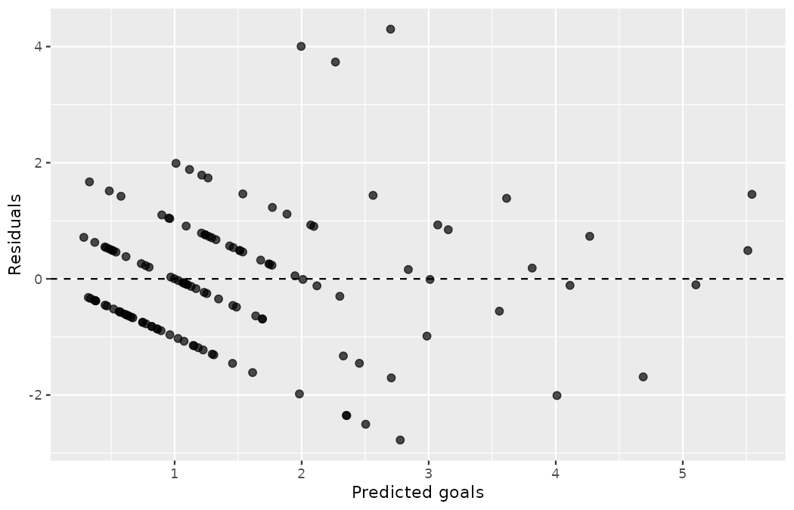{fig-alt="A residual plot for the goals model: residuals against predicted goals scatter around a dashed zero line mostly between -2 and +2, falling in slanted integer bands, with Spain's +4.3 at the top and the scatter fanning out at higher predicted values." width=85%}

The residuals scatter around the dashed zero line, mostly between $-2$ and $+2,$ with Spain's $+4.3$ at the top, just above England's $+4.0;$ because goals are whole numbers, the points fall along slanted integer bands rather than a formless cloud, and the scatter fans out somewhat at higher predicted values — low-xG outings can only miss by a little, high-xG outings by a lot.

::: {.callout-note title="Worked example"}
One purpose of residual plots is to identify characteristics or patterns still apparent in the data after fitting a model.
The code below builds three constructed datasets — another of Priya's training exhibits, seeded for reproducibility — fits a line to each, and draws the scatterplot with its residual plot underneath.
Can you identify any patterns in the residuals?

```r
set.seed(704)
resid_panels <- tibble(
  x1 = runif(60, 0, 10), y1 = 28 - 1.8 * x1 + rnorm(60, 0, 2.5),
  x2 = runif(60, 0, 10), y2 = 3 + 2.2 * x2 - 0.24 * x2^2 + rnorm(60, 0, 1.1),
  x3 = runif(60, 0, 10), y3 = 12 + 0.06 * x3 + rnorm(60, 0, 2.2)
)

fit_1 <- lm(y1 ~ x1, data = resid_panels)
fit_2 <- lm(y2 ~ x2, data = resid_panels)
fit_3 <- lm(y3 ~ x3, data = resid_panels)

# For each dataset: scatterplot with the least squares line on top,
# residual plot (fitted vs residual) underneath, e.g., for dataset 1:
ggplot(resid_panels, aes(x = x1, y = y1)) +
  geom_point() +
  geom_smooth(method = "lm", se = FALSE)

tibble(fitted = fitted(fit_1), residual = resid(fit_1)) |>
  ggplot(aes(x = fitted, y = residual)) +
  geom_point() +
  geom_hline(yintercept = 0, linetype = "dashed")
```

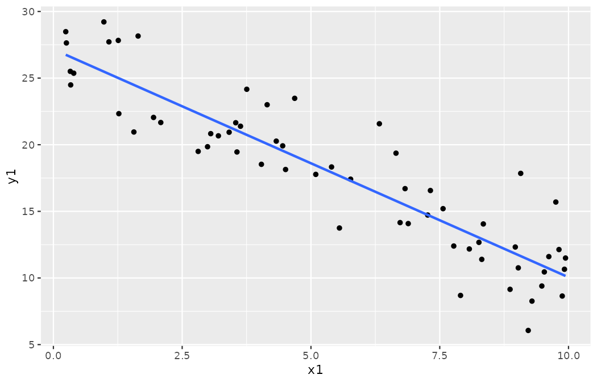{fig-alt="A scatterplot of the first constructed dataset showing a strong downward linear trend with its least squares line." width=85%}

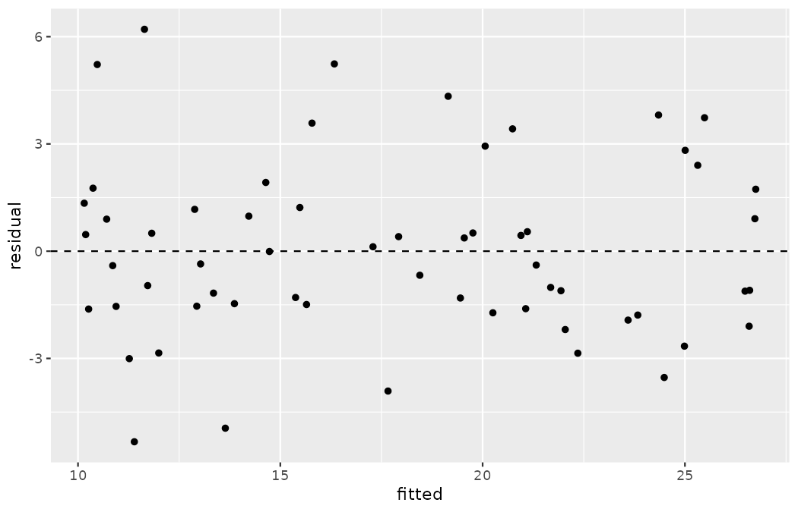{fig-alt="The residual plot for the first dataset: residuals scattered randomly around the dashed zero line with no obvious pattern." width=85%}

------------------------------------------------------------------------

Dataset 1: a strong downward linear trend; the residuals show no obvious patterns.
They are scattered randomly around 0, represented by the dashed line.

Dataset 2: the scatterplot rises and then bends over — the second dataset shows a pattern in the residuals.
There is some curvature in the scatterplot, which is far more obvious in the residual plot: the residuals sit below zero at both ends of the fitted range and above zero in the middle, a telltale arch.
We should not use a straight line to model these data.
Instead, a more advanced technique should be used to model the curved relationship, such as the variable transformations discussed in @sec-explore-numerical.

Dataset 3: the last plot shows very little upwards trend, and the residuals also show no obvious patterns.
It is reasonable to try to fit a linear model to the data.
However, it is unclear whether there is evidence that the slope parameter is different from zero.
The point estimate of the slope parameter is not zero (the fit gives about $0.19$), but we might wonder if this could just be due to chance.
We will address this scenario in @sec-inf-model-slr.
:::

### Describing linear relationships with correlation

We've seen plots with strong linear relationships and others with very weak linear relationships.
It would be useful if we could quantify the strength of these linear relationships with a statistic.

::: {.callout-important title="Correlation: strength of a linear relationship."}
**Correlation**, which always takes values between -1 and 1, describes the strength and direction of the linear relationship between two variables.
We denote the correlation by $r.$

The correlation value has no units and will not be affected by a linear change in the units (e.g., going from minutes to seconds).
:::

The symbol $r$ is a single Roman letter, which by our convention marks it as a sample statistic: it is computed from the observed pairs, and it estimates a population correlation we will not need to name until much later in the book.
We can compute the correlation using a formula, just as we did with the sample mean and standard deviation.
For observations $(x_1, y_1),$ $(x_2, y_2),$ ..., $(x_n, y_n),$ the formula is

$$
r = \frac{1}{n-1} \sum_{i=1}^{n} \frac{x_i-\bar{x}}{s_x}\frac{y_i-\bar{y}}{s_y}
$$

where $\bar{x},$ $\bar{y},$ $s_x,$ and $s_y$ are the sample means and standard deviations for each variable — all notation you own from @sec-explore-numerical, including the summation sign $\Sigma.$
Read the two fractions as *standardized* coordinates: each observation is scored by how many standard deviations it sits from the mean on each axis, and $r$ is (essentially) the average product of those two scores — positive when the two coordinates tend to share a sign, negative when they tend to oppose.
Like other statistics, $r$ is generally computed by software, but keep the formula in view: it will do real work later in this chapter, when we derive the least squares slope from it.

For the World Cup team-matches, the correlation between accumulated chance quality and goals is

```r
cor(team_match$total_xg, team_match$goals)
#> [1] 0.6913686
```

a moderately strong positive linear relationship, consistent with the upward cloud we plotted.

Only when the relationship is perfectly linear is the correlation either -1 or +1.
If the relationship is strong and positive, the correlation will be near +1.
If it is strong and negative, it will be near -1.
If there is no apparent linear relationship between the variables, then the correlation will be near zero.
The gallery below constructs eight panels spanning that range; the printed correlations belong to the panels in order.

```r
set.seed(705)
make_panel <- function(slope, noise, n = 50) {
  x <- runif(n, 0, 10)
  tibble(x = x, y = slope * x + rnorm(n, 0, noise))
}
gallery <- bind_rows(
  make_panel( 0.7, 0.0), make_panel( 0.7, 1.0),
  make_panel( 0.7, 2.6), make_panel( 0.7, 9.0),
  make_panel(-0.7, 0.0), make_panel(-0.7, 0.7),
  make_panel(-0.7, 3.2), make_panel(-0.7, 14.0),
  .id = "panel"
)

gallery |>
  group_by(panel) |>
  summarize(r = round(cor(x, y), 2))
#> # A tibble: 8 × 2
#>   panel     r
#>   <chr> <dbl>
#> 1 1      1
#> 2 2      0.89
#> 3 3      0.7
#> 4 4      0.4
#> 5 5     -1
#> 6 6     -0.96
#> 7 7     -0.66
#> 8 8     -0.15

ggplot(gallery, aes(x = x, y = y)) +
  geom_point(size = 2, alpha = 0.8) +
  facet_wrap(~panel, nrow = 2, scales = "free")
```

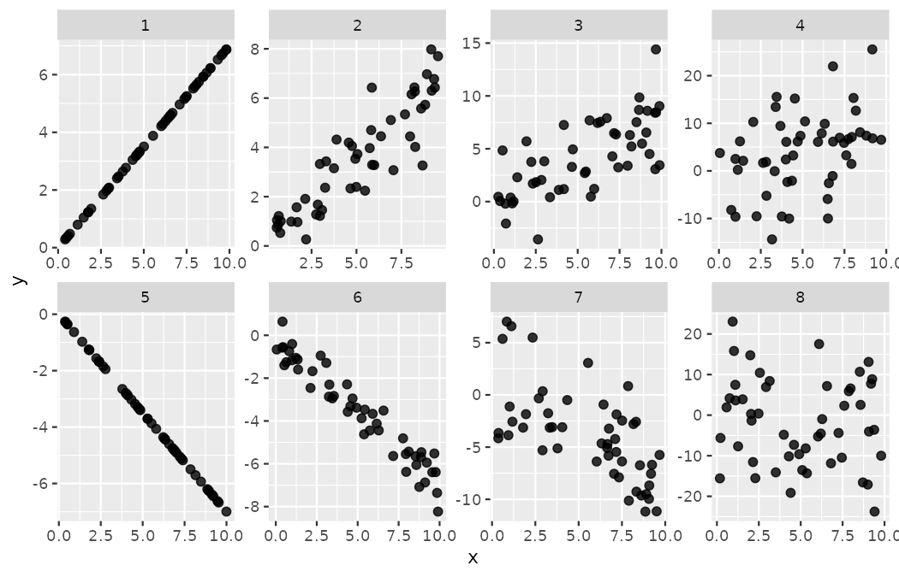{fig-alt="An eight-panel gallery of constructed scatterplots: the first row runs from a perfect upward line at r = 1 through progressively noisier upward clouds, and the second row mirrors it downward from r = -1 to a nearly formless cloud at -0.15." width=85%}

The first row runs from a perfect upward line $(r = 1)$ through progressively noisier upward clouds $(0.89,$ $0.70,$ $0.40);$ the second row mirrors it downward, from a perfect negative line $(r = -1)$ through $-0.96$ and $-0.66$ to a nearly formless cloud at $-0.15.$

The correlation is intended to quantify the strength of a *linear* trend.
Nonlinear trends, even when strong, sometimes produce correlations that do not reflect the strength of the relationship; see three such examples below.

```r
curved <- tibble(
  x1 = runif(60, -4, 4), y1 = x1^2 + rnorm(60, 0, 1.2),
  x2 = runif(60, 0, 12), y2 = 3 * sin(x2) + rnorm(60, 0, 0.6),
  x3 = runif(60, 0, 10), y3 = 6 - 1.1 * abs(x3 - 5) + rnorm(60, 0, 0.7)
)

c(cor(curved$x1, curved$y1),
  cor(curved$x2, curved$y2),
  cor(curved$x3, curved$y3)) |>
  round(2)
#> [1]  0.08 -0.28 -0.11
```

The first panel is an unmistakable U-shape, the second a clean sine wave, the third a sharp tent rising to a peak and falling away — three strong, obvious patterns — yet their correlations are a feeble $0.08,$ $-0.28,$ and $-0.11.$
In each case, there is a strong relationship between the variables; because the relationship is not linear, the correlation is weak.

::: {.callout-tip title="Check your understanding"}
No straight line is a good fit for any of the three curved datasets above.
Try drawing nonlinear curves on each plot.
Once you create a curve for each, describe what is important in your fit.

------------------------------------------------------------------------

We'll leave it to you to draw the curves.
In general, the curves you draw should be close to most points and reflect overall trends in the data — the parabola for the first panel, the wave for the second, the tent for the third.
:::

::: {.callout-note title="Worked example"}
The plots below display relationships between the shot-mix shares of the 32 teams at the 2022 Men's World Cup — the `team_profile` dataset you met in @sec-data-hello.
In the plots, each point represents a different national team, and the two axes are two shares of that team's total shots: the share that were headers, the share struck first time, the share taken under defensive pressure, the share arising from corner sequences, and the share arising in regular open play.
We rebuild `team_profile` with exactly the same code as in @sec-data-hello and draw six pairings.

Order the six scatterplots from strongest negative to strongest positive linear relationship.

```r
library(patchwork)

team_profile <- wc2022_shots |>
  group_by(team) |>
  summarize(
    n_shots         = n(),
    goals           = sum(goal),
    total_xg        = sum(statsbomb_xg),
    conversion      = mean(goal),
    mean_xg         = mean(statsbomb_xg),
    prop_headers    = mean(body_part == "Head"),
    prop_first_time = mean(first_time),
    prop_pressure   = mean(under_pressure),
    prop_corner     = mean(play_pattern == "From Corner"),
    prop_open_play  = mean(play_pattern == "Regular Play")
  )

p_a <- ggplot(team_profile, aes(x = prop_first_time, y = prop_headers)) +
  geom_point(alpha = 0.7) +
  labs(x = "% first time", y = "% headers", title = "A")

p_b <- ggplot(team_profile, aes(x = prop_corner, y = prop_pressure)) +
  geom_point(alpha = 0.7) +
  labs(x = "% from corners", y = "% under pressure", title = "B")

p_c <- ggplot(team_profile, aes(x = prop_corner, y = prop_headers)) +
  geom_point(alpha = 0.7) +
  labs(x = "% from corners", y = "% headers", title = "C")

p_d <- ggplot(team_profile, aes(x = prop_open_play, y = prop_corner)) +
  geom_point(alpha = 0.7) +
  labs(x = "% open play", y = "% from corners", title = "D")

p_e <- ggplot(team_profile, aes(x = prop_open_play, y = prop_pressure)) +
  geom_point(alpha = 0.7) +
  labs(x = "% open play", y = "% under pressure", title = "E")

p_f <- ggplot(team_profile, aes(x = prop_pressure, y = prop_headers)) +
  geom_point(alpha = 0.7) +
  labs(x = "% under pressure", y = "% headers", title = "F")

(p_a + p_b) / (p_c + p_d) / (p_e + p_f)
```

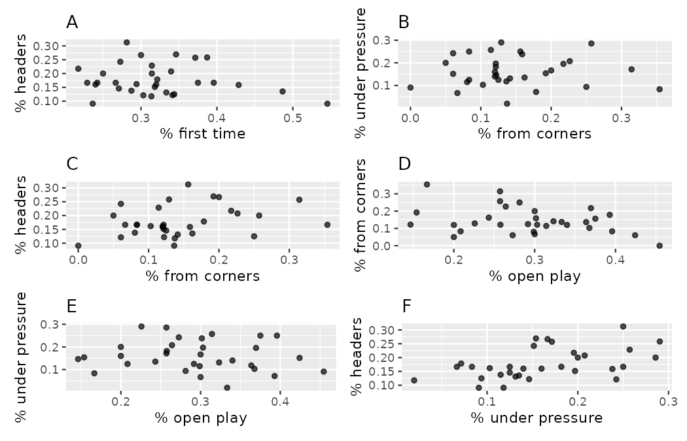{fig-alt="Six scatterplots labeled A through F pairing shot-mix shares of the 32 World Cup teams, from corners against first-time share to headers against share under pressure, with 32 points per panel." width=85%}

------------------------------------------------------------------------

Computing all six correlations settles the ordering — never trust your eye alone with 32 points per panel:

```r
c(
  A = cor(team_profile$prop_first_time, team_profile$prop_headers),
  B = cor(team_profile$prop_corner,     team_profile$prop_pressure),
  C = cor(team_profile$prop_corner,     team_profile$prop_headers),
  D = cor(team_profile$prop_open_play,  team_profile$prop_corner),
  E = cor(team_profile$prop_open_play,  team_profile$prop_pressure),
  F = cor(team_profile$prop_pressure,   team_profile$prop_headers)
) |>
  round(2)
#>     A     B     C     D     E     F
#> -0.17  0.03  0.31 -0.33 -0.11  0.50
```

The order from most negative correlation to most positive correlation is:

$$
D \rightarrow A \rightarrow E \rightarrow B \rightarrow C \rightarrow F
$$

-   Plot D — % from corners vs. % open play: $-0.33$. Shares must add up, so a team that generates more of its shots in open play tends to generate fewer from corners.
-   Plot A — % headers vs. % first time: $-0.17$.
-   Plot E — % under pressure vs. % open play: $-0.11$.
-   Plot B — % under pressure vs. % from corners: $0.03$, an essentially flat cloud.
-   Plot C — % headers vs. % from corners: $0.31$.
-   Plot F — % headers vs. % under pressure: $0.50$. Teams that head the ball a lot also shoot under pressure a lot — both are symptoms of living on crosses into a crowded box.
:::

One important aspect of the correlation is that it's *unitless*.
That is, unlike a measurement of the slope of a line (see the next section) which provides an increase in the y-coordinate for a one unit increase in the x-coordinate (in units of the x and y variable), there are no units associated with the correlation of x and y.
The shot log records when in the match each shot was taken, split into a `minute` and a `second` column.
We can express the shot clock in minutes or in seconds — a change of units, since the reading in seconds is exactly 60 times the reading in minutes.
The code below computes the correlation between chance quality and the shot clock, once per unit choice.

```r
wc2022_shots |>
  mutate(
    time_min = minute + second / 60,
    time_sec = 60 * minute + second
  ) |>
  summarize(
    r_minutes = cor(statsbomb_xg, time_min),
    r_seconds = cor(statsbomb_xg, time_sec)
  )
#> # A tibble: 1 × 2
#>   r_minutes r_seconds
#>       <dbl>     <dbl>
#> 1     0.238     0.238
```

The two correlations are identical: $r = 0.238$ whether the clock is read in minutes or in seconds.
If we drew the two scatterplots side by side, the shape of the relationship would not change; the only visual change would be the axis *labeling* of the points.
(Before a scout gets excited about that $0.238$ — "chances get better as the match wears on!" — recall the honesty note from earlier in this chapter: the shot log includes shootout penalties, which sit at the very end of the clock with penalty-sized chance quality.
Restrict to open-play shots and the fatigue story nearly vanishes:

```r
wc2022_shots |>
  filter(shot_type == "Open Play") |>
  summarize(r_open_play = cor(statsbomb_xg, minute + second / 60))
#> # A tibble: 1 × 1
#>   r_open_play
#>         <dbl>
#> 1      0.0299
```

We will return to this nearly-zero correlation when we study inference for regression in @sec-inf-model-slr.)

## Least squares regression {#sec-least-squares-regression}

Fitting linear models by eye is open to criticism since it is based on an individual's preference.
In this section, we use *least squares regression* as a more rigorous approach to fitting a line to a scatterplot.

### Asking prices in the veteran market

Marta Vidal has asked Priya Rao a transfer-window question: how quickly do asking prices fall with age at the veteran end of the striker market?
To study the question in a controlled setting, Priya constructs a market survey: 50 listed strikers aged 28 and older, each with an asking price in millions of euros quoted by the player's agent.
This is a constructed scouting scenario — the seeded code below builds it, and the code *is* the data's documentation.
(The `pmax()` guard reflects one market reality Priya builds in: no agent lists a client below €0.5M.)

```r
set.seed(701)
veteran_market <- tibble(
  age = sample(28:35, 50, replace = TRUE),
  asking_price = round(pmax(0.5, 17 - 2.0 * (age - 28) + rnorm(50, 0, 5.3)), 1)
)

ggplot(veteran_market, aes(x = age, y = asking_price)) +
  geom_point(size = 2, alpha = 0.8) +
  geom_smooth(method = "lm", se = FALSE) +
  labs(
    x = "Age (years)",
    y = "Asking price (million euros)"
  )
```

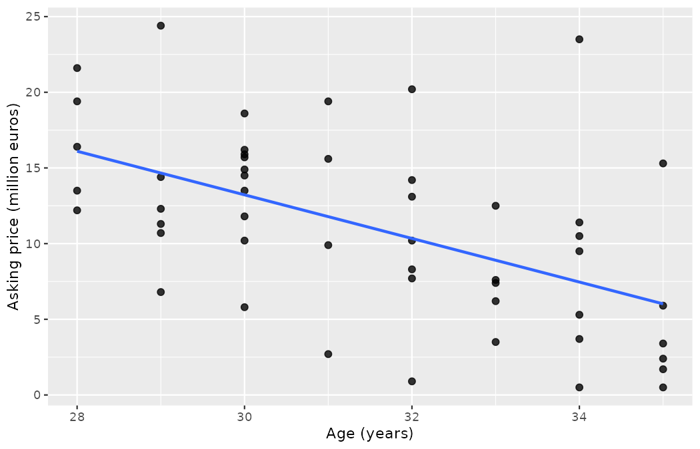{fig-alt="A scatterplot of asking price against age for 50 listed veteran strikers, scattered from 0.5 to 24.4 million euros around a downward least squares line: older strikers tend to carry lower asking prices." width=85%}

The 50 points scatter from €0.5M to €24.4M, and the fitted line follows a negative trend in the data: older strikers tend to carry lower asking prices.

::: {.callout-tip title="Check your understanding"}
Is the correlation between age and asking price in the plot above positive or negative?

------------------------------------------------------------------------

Higher ages are associated with lower asking prices, so the correlation will be negative.
Using a computer, the correlation can be computed:

```r
cor(veteran_market$age, veteran_market$asking_price)
#> [1] -0.533798
```
:::

### An objective measure for finding the best line

We begin by thinking about what we mean by the "best" line.
Mathematically, we want a line that has small residuals.
But beyond the mathematical reasons, hopefully it also makes sense intuitively that whatever line we fit, the residuals should be small (i.e., the points should be close to the line).
The first option that may come to mind is to minimize the sum of the residual magnitudes:

$$
|e_1| + |e_2| + \dots + |e_n|
$$

which we could accomplish with a computer program.
The `optim()` call below does exactly that: it searches for the intercept and slope minimizing the sum of absolute residuals.

```r
l1_loss <- function(b) {
  sum(abs(veteran_market$asking_price - b[1] - b[2] * veteran_market$age))
}
optim(par = c(30, -1), fn = l1_loss)$par |>
  round(2)
#> [1] 66.8 -1.8
```

Drawn as a dashed line over the scatterplot ($y = 66.8 - 1.8x$), this fit hugs the cloud closely — it can be quite reasonable.
However, a more common practice is to choose the line that minimizes the sum of the squared residuals:

$$
e_{1}^2 + e_{2}^2 + \dots + e_{n}^2
$$

The line that minimizes this least squares criterion is the solid line the `geom_smooth(method = "lm")` call drew earlier and is commonly called the **least squares line**.
The following are four possible reasons to choose the least squares option instead of trying to minimize the sum of residual magnitudes without any squaring:

1.  It is the most commonly used method.
2.  Computing the least squares line is widely supported in statistical software.
3.  In many applications, a residual twice as large as another residual is more than twice as bad. For example, being off by 4 is usually more than twice as bad as being off by 2. Squaring the residuals accounts for this discrepancy. A valuation that misses by €4M embarrasses the club more than twice as much as one that misses by €2M.
4.  The analyses which link the model to inference about a population are most straightforward when the line is fit through least squares.

The first two reasons are largely for tradition and convenience; the third and fourth reasons explain why the least squares criterion is typically most helpful when working with real data.[^07-model-slr-2]

[^07-model-slr-2]: There are applications where the sum of residual magnitudes may be more useful, and there are plenty of other criteria we might consider.
    However, this book only applies the least squares criterion.

::: {.callout-tip title="Check your understanding"}
The solid line in the veteran-market plot is the least squares fit; the dashed line minimized the sum of absolute residuals.
State precisely which quantity the least squares line minimizes, and explain why the two criteria can produce different lines from the same 50 strikers.

------------------------------------------------------------------------

The least squares line minimizes $e_1^2 + e_2^2 + \dots + e_n^2,$ the sum of *squared vertical* distances from each observation to the line — not perpendicular distances, and not the absolute values $|e_i|.$
Squaring punishes a large residual disproportionately: one valuation that misses by €4M costs the criterion as much as four that miss by €2M.
Because the two criteria weigh the points differently, they need not settle on the same line — here the absolute-residual criterion returned $66.8 - 1.8x,$ while the least squares fit, computed in the next section, has a shallower slope.
:::

### Finding and interpreting the least squares line

For the veteran market data, we could write the equation of the least squares regression line as

$$
\widehat{\texttt{asking\_price}} = b_0 + b_{1}\times \texttt{age}
$$

Here the equation is set up to predict an asking price based on a striker's age, which would be useful to Marta when an agent's first quote has not yet landed.
The hat pairs with the Roman letters on purpose: a fitted line is computed from a sample, so both the prediction $\widehat{\texttt{asking\_price}}$ and the coefficients $b_0$ and $b_1$ are sample statistics — recall from earlier in this chapter that the Greek $\beta_0$ and $\beta_1$ are reserved for the population-level parameters those statistics estimate, and it is *those* two values we are ultimately after.

The parameters are estimated using the observed data.
In practice, this estimation is done using a computer in the same way that other estimates, like a sample mean, can be estimated using a computer or calculator.
The first five rows of the `veteran_market` data look like this:

```r
veteran_market |>
  slice_head(n = 5)
#> # A tibble: 5 × 2
#>     age asking_price
#>   <int>        <dbl>
#> 1    31          2.7
#> 2    32         14.2
#> 3    30          5.8
#> 4    35          0.5
#> 5    34         11.4
```

Statistical software is usually used to compute the least squares line, and the typical output generated by fitting a regression model looks like the `tidy()` summary below — the `broom` package's tidier for model objects.
For now we will focus on the `estimate` column, which lists $b_0$ and $b_1.$
In @sec-inf-model-slr we will dive deeper into the remaining columns, which tell us how accurately and precisely these values — calculated from a survey of 50 listed strikers — estimate the intercept and slope for the *whole* veteran market.

```r
library(broom)

fit_veteran <- lm(asking_price ~ age, data = veteran_market)
tidy(fit_veteran)
#> # A tibble: 2 × 5
#>   term        estimate std.error statistic    p.value
#>   <chr>          <dbl>     <dbl>     <dbl>      <dbl>
#> 1 (Intercept)    56.4     10.4        5.43 0.00000186
#> 2 age            -1.44     0.329     -4.37 0.0000655
```

The model output tells us that the intercept is approximately 56.4 and the slope on `age` is approximately $-1.44.$

But what do these values mean?
Interpreting parameters in a regression model is often one of the most important steps in the analysis.

::: {.callout-note title="Worked example"}
The intercept and slope estimates for the veteran market data are $b_0 = 56.4$ and $b_1 = -1.44.$
What do these numbers really mean?

------------------------------------------------------------------------

Interpreting the slope parameter is helpful in almost any application.
For each additional year of age, we would expect a listed striker's asking price to be lower by €1.44M on average.
Note that an older age corresponds to a lower price because the coefficient of age is negative in the model.
We must be cautious in this interpretation: the line describes how *listed prices* vary across players of different ages in this market survey; it does not say that holding a specific player for one more season will knock exactly €1.44M off his price — his form, contract, and injury record will all move too.

The estimated intercept $b_0 = 56.4$ is the predicted asking price for a striker of age zero.
Unlike the invoice example that opened this chapter — where a club could genuinely accredit zero scouts — no player in any market is zero years old, and none in this one is younger than 28.
The intercept here has no practical meaning of its own; it serves only to anchor the height of the line where the data actually live.
:::

::: {.callout-important title="Interpreting parameters estimated by least squares"}
The slope describes the estimated difference in the predicted average outcome of $y$ if the predictor variable $x$ happened to be one unit larger.
The intercept describes the average outcome of $y$ if $x = 0$ *and* the linear model is valid all the way to $x = 0$ (values of $x = 0$ are not observed or relevant in many applications).
:::

::: {.callout-tip title="Check your understanding"}
Using the fitted model $\widehat{\texttt{asking\_price}} = 56.4 - 1.44 \times \texttt{age},$ how much lower an asking price would we predict for a 33-year-old striker than for a 30-year-old, on average?

------------------------------------------------------------------------

The slope is measured in millions of euros per year of age, so three additional years of age predict an asking price lower by $3 \times 1.44 = 4.32,$ about €4.3M, on average.
Keep the interpretation honest: this describes how listed prices differ across players of different ages in the survey; it is not a forecast that any particular striker's price will fall by €4.32M over his next three birthdays.
:::

An alternative way of calculating the values of intercept and slope of a least squares line is manual calculation using formulas.
While manual calculations are not commonly used by practicing statisticians and data scientists, it is useful to work through them the first time you're learning about the least squares line and modeling in general.
Calculating the values by hand leverages two properties of the least squares line:

1.  The slope of the least squares line can be estimated by

$$
b_1 = \frac{s_y}{s_x} r
$$

Decompose the formula before using it: $s_y$ and $s_x$ are the sample standard deviations of the outcome and the predictor — the same $s$ you met in @sec-explore-numerical, subscripted here to say *which* variable's spread is meant — and $r$ is the correlation between the two variables.
The ratio $s_y / s_x$ converts the unitless correlation into the units of the problem: standard deviations of $y$ per standard deviation of $x,$ rescaled into raw units.

2.  If $\bar{x}$ is the sample mean of the predictor variable and $\bar{y}$ is the sample mean of the outcome variable, then the point $(\bar{x}, \bar{y})$ falls on the least squares line.

::: {.callout-note title="Deeper (optional): where $b_1 = (s_y/s_x)\,r$ comes from — uses calculus; safe to skip"}
Both properties fall out of the least squares criterion itself.
Write the criterion as a function of the two unknowns, $SSE(b_0, b_1) = \sum_{i=1}^n (y_i - b_0 - b_1 x_i)^2,$ and set both of its derivatives to zero — the *normal equations*:

$$
\frac{\partial\, SSE}{\partial b_0} = 0 \;\Rightarrow\; \sum_{i=1}^n (y_i - b_0 - b_1 x_i) = 0
\qquad\quad
\frac{\partial\, SSE}{\partial b_1} = 0 \;\Rightarrow\; \sum_{i=1}^n x_i\, (y_i - b_0 - b_1 x_i) = 0
$$

The first equation says the residuals sum to zero; divide it by $n$ and it reads $\bar{y} = b_0 + b_1 \bar{x},$ which is exactly property 2: the line passes through $(\bar{x}, \bar{y}).$
Substitute $b_0 = \bar{y} - b_1 \bar{x}$ into the second equation and rearrange:

$$
b_1 = \frac{\sum_{i=1}^n (x_i - \bar{x})(y_i - \bar{y})}{\sum_{i=1}^n (x_i - \bar{x})^2}
    = \frac{(n-1)\, s_x\, s_y\, r}{(n-1)\, s_x^2}
    = \frac{s_y}{s_x}\, r
$$

The middle step recognizes the numerator as $(n-1)\, s_x s_y r$ — rearrange the correlation formula displayed earlier in this chapter — and the denominator as $(n-1)\, s_x^2,$ the definition of the sample variance from @sec-explore-numerical.
:::

The summary statistics for the veteran market survey are computed below.

```r
veteran_market |>
  summarize(
    age_mean   = mean(age),
    age_sd     = sd(age),
    price_mean = mean(asking_price),
    price_sd   = sd(asking_price),
    r          = cor(age, asking_price)
  )
#> # A tibble: 1 × 5
#>   age_mean age_sd price_mean price_sd      r
#>      <dbl>  <dbl>      <dbl>    <dbl>  <dbl>
#> 1     31.5   2.27       11.1     6.13 -0.534
```

We could plot the point $(31.5, 11.1)$ on the scatterplot of the veteran market to verify it falls on the least squares line.
Next, we find the point estimates $b_0$ and $b_1$ of the parameters $\beta_0$ and $\beta_1.$

::: {.callout-note title="Worked example"}
Using the summary statistics above, compute the slope for the regression line of asking price against age.

------------------------------------------------------------------------

Compute the slope using the summary statistics:

$$
b_1 = \frac{s_y}{s_x} r = \frac{6.13}{2.27}(-0.534) = -1.44
$$

matching the slope the software reported.
:::

You might recall the form of a line from math class, which we can use to find the model fit, including the estimate of $b_0.$
Given the slope of a line and a point on the line, $(x_0, y_0),$ the equation for the line can be written as

$$
y - y_0 = slope\times (x - x_0)
$$

::: {.callout-important title="Identifying the least squares line from summary statistics"}
To identify the least squares line from summary statistics:

-   Estimate the slope parameter, $b_1 = (s_y / s_x) r.$
-   Note that the point $(\bar{x}, \bar{y})$ is on the least squares line, use $x_0 = \bar{x}$ and $y_0 = \bar{y}$ with the point-slope equation: $y - \bar{y} = b_1 (x - \bar{x}).$
-   Simplify the equation, we get $y = \bar{y} - b_1 \bar{x} + b_1 x,$ which reveals that $b_0 = \bar{y} - b_1 \bar{x}.$
:::

::: {.callout-note title="Worked example"}
Using the point $(31.5, 11.1)$ from the sample means and the slope estimate $b_1 = -1.44,$ find the least-squares line for predicting asking price based on age.

------------------------------------------------------------------------

Apply the point-slope equation using $(31.5, 11.1)$ and the slope $b_1 = -1.44$:

$$
\begin{aligned}
y - y_0  &= b_1 (x - x_0) \\
y - 11.1 &= -1.44 (x - 31.5)
\end{aligned}
$$

Expanding the right side and then adding 11.1 to each side, the equation simplifies:

$$
\widehat{\texttt{asking\_price}} = 56.5 - 1.44 \times \texttt{age}
$$

which matches the software's intercept of 56.4 up to rounding of the intermediate values.
Here we have replaced $y$ with $\widehat{\texttt{asking\_price}}$ and $x$ with $\texttt{age}$ to put the equation in context.
The final least squares equation should always include a "hat" on the variable being predicted, whether it is a generic $``y"$ or a named variable like $``asking\_price."$
:::

::: {.callout-note title="Worked example"}
An agent emails Emil Sørensen about a 30-year-old striker not in Priya's survey.
Can Emil simply use the linear equation that we have estimated to predict the asking price?

------------------------------------------------------------------------

He may use it as an estimate — the equation gives $56.4 - 1.44 \times 30 = 13.2,$ about €13.2M — though some qualifiers on this approach are important.
First, the survey is a constructed snapshot of one window, and the way agents price veterans may change from window to window.
Second, the equation will provide an imperfect estimate.
While the linear equation is good at modeling the trend in the data, no individual striker's asking price will be perfectly predicted (as can be seen from the individual data points around the line).
:::

### Extrapolation is treacherous

Linear models can be used to approximate the relationship between two variables.
However, like any model, they have real limitations.
Linear regression is simply a modeling framework.
The truth is almost always much more complex than a simple line.
For example, we do not know how the data outside of our limited window will behave.

::: {.callout-note title="Worked example"}
Use the model $\widehat{\texttt{asking\_price}} = 56.4 - 1.44 \times \texttt{age}$ to estimate the asking price of a 40-year-old striker.

------------------------------------------------------------------------

We want to calculate the predicted price at age 40:

$$
56.4 - 1.44 \times 40 = -1.2
$$

The model predicts an asking price of $-$€1.2M — a negative price.
Taken literally, the agent would have to pay Northbridge €1.2M to take his client.
Whatever one thinks of 40-year-old strikers, no agent in any market quotes a *negative* asking price — the oldest player in the survey is 35, and the line knows nothing about the market beyond that age.
:::

Applying a model estimate to values outside of the realm of the original data is called **extrapolation**.
Generally, a linear model is only an approximation of the real relationship between two variables.
If we extrapolate, we are making an unreliable bet that the approximate linear relationship will be valid in places where it has not been analyzed.
Recall the age–market-value hump from the start of this chapter: even *within* the observed range, age relationships in football bend; beyond it, a straight line is pure speculation.

### Describing the strength of a fit {#sec-r-squared}

We evaluated the strength of the linear relationship between two variables earlier using the correlation, $r.$
However, it is more common to explain the strength of a linear fit using $R^2,$ called **R-squared**.
Read the symbol piece by piece: it is the capital letter $R$ — by convention written uppercase in this role — raised to the power 2, and for a model with one predictor it is (literally) the square of the correlation $r$ between the two variables.
If provided with a linear model, we might like to describe how closely the data cluster around the linear fit.

The $R^2$ of a linear model describes the amount of variation in the outcome variable that is explained by the least squares line.
For example, consider the veteran market data.
The variance of the outcome variable — computed with `var()`, the square of the standard deviation you met in @sec-explore-numerical — is $s_{price}^2 \approx 37.5$:

```r
var(veteran_market$asking_price)
#> [1] 37.53138
```

However, if we apply our least squares line, then this model reduces our uncertainty in predicting a price using a striker's age.
The variability in the residuals describes how much variation remains after using the model:

```r
var(resid(fit_veteran))
#> [1] 26.83718
```

In short, there was a reduction of

$$
\frac{s_{price}^2 - s_{RES}^2}{s_{price}^2}
  = \frac{37.5 - 26.8}{37.5}
  = \frac{10.7}{37.5}
  \approx 0.285
$$

or about 28.5%, of the outcome variable's variation by using information about age for predicting the asking price using a linear model.
It turns out that $R^2$ corresponds exactly to the squared value of the correlation:

$$
r = -0.534 \rightarrow R^2 = 0.285
$$

::: {.callout-note title="Deeper (optional): why $R^2 = r^2$ with a single predictor"}
The identity takes three lines once the fitted line is written through the point of means: $\hat{y}_i = \bar{y} + b_1 (x_i - \bar{x}).$
The variation the model captures — formalized as $SSR$ at the end of this section — is then

$$
\sum_{i=1}^n (\hat{y}_i - \bar{y})^2
  = b_1^2 \sum_{i=1}^n (x_i - \bar{x})^2
  = \left(\frac{s_y}{s_x}\, r\right)^{\!2} (n-1)\, s_x^2
  = r^2\, (n-1)\, s_y^2,
$$

using $b_1 = (s_y/s_x)\, r$ from the previous section, and $(n-1)\, s_y^2$ is precisely the total variation in the $y$ values.
The ratio of the two — the share of the outcome's variation the line explains — is therefore $r^2$: for the veteran market, $(-0.534)^2 = 0.285,$ the same 28.5% we obtained from the variances above.
:::

::: {.callout-tip title="Check your understanding"}
If a linear model has a very strong negative relationship with a correlation of $-0.97,$ how much of the variation in the outcome is explained by the predictor?

------------------------------------------------------------------------

About $R^2 = (-0.97)^2 = 0.94$ or 94% of the variation in the outcome variable is explained by the linear model.
:::

::: {.callout-tip title="Check your understanding"}
For the World Cup team-matches, the correlation between accumulated chance quality and goals was $r = 0.691.$
What proportion of the variation in goal counts does the linear model on `total_xg` explain?

------------------------------------------------------------------------

$R^2 = (0.691)^2 = 0.478.$
Chance quality explains a little under half of the variation in goals scored across team-matches — the other half is finishing, goalkeeping, and luck, which is exactly why Marta reads the residuals as carefully as the fit.
:::

$R^2$ is also called the **coefficient of determination**.

::: {.callout-important title="Coefficient of determination: proportion of variability in the outcome variable explained by the model"}
Since $r$ is always between -1 and 1, $R^2$ will always be between 0 and 1.
This statistic is called the **coefficient of determination**, and it measures the proportion of variation in the outcome variable, $y,$ that can be explained by the linear model with predictor $x.$
:::

More generally, $R^2$ can be calculated as a ratio of a measure of variability around the line divided by a measure of total variability.

::: {.callout-important title="Sums of squares to measure variability in y"}
We can measure the variability in the $y$ values by how far they tend to fall from their mean, $\bar{y}.$
We define this value as the **total sum of squares**, calculated using the formula below, where $y_1, y_2, \dots, y_n$ represent the $y$ values in the sample, and $\bar{y}$ represents their mean.
The three capital letters name it: **S**um of **S**quares, **T**otal.

$$
SST = (y_1 - \bar{y})^2 + (y_2 - \bar{y})^2 + \cdots + (y_n - \bar{y})^2
$$

Left-over variability in the $y$ values if we know $x$ can be measured by the **sum of squared errors**, or sum of squared residuals — **S**um of **S**quared **E**rrors — calculated using the formula below, where $\hat{y}_i$ represents the predicted value of $y_i$ based on the least squares regression.[^07-model-slr-3]

$$
\begin{aligned}
SSE &= (y_1 - \hat{y}_1)^2 + (y_2 - \hat{y}_2)^2 + \cdots + (y_n - \hat{y}_n)^2\\
&= e_{1}^2 + e_{2}^2 + \dots + e_{n}^2
\end{aligned}
$$

The coefficient of determination can then be calculated as

$$
R^2 = \frac{SST - SSE}{SST} = 1 - \frac{SSE}{SST}
$$
:::

[^07-model-slr-3]: The difference $SST - SSE$ is called the **regression sum of squares**, $SSR$ (**S**um of **S**quares, **R**egression), and can also be calculated as $SSR = (\hat{y}_1 - \bar{y})^2 + (\hat{y}_2 - \bar{y})^2 + \cdots + (\hat{y}_n - \bar{y})^2.$ $SSR$ represents the variation in $y$ that was accounted for in our model.

::: {.callout-note title="Worked example"}
Among the 50 strikers in the `veteran_market` survey, the total variability in asking price is $SST = 1839,$ and the sum of squared residuals is $SSE = 1315.$[^07-model-slr-4]

```r
SST <- sum((veteran_market$asking_price - mean(veteran_market$asking_price))^2)
SSE <- sum(resid(fit_veteran)^2)
round(c(SST = SST, SSE = SSE))
#>  SST  SSE
#> 1839 1315
```

Find $R^2.$

------------------------------------------------------------------------

Since we know $SSE$ and $SST,$ we can calculate $R^2$ as

$$
R^2 = 1 - \frac{SSE}{SST} = 1 - \frac{1315}{1839} = 0.285,
$$

the same value we found when we squared the correlation: $R^2 = (-0.534)^2 = 0.285.$
:::

[^07-model-slr-4]: $SST$ can be calculated by finding the sample variance of the outcome variable, $s^2,$ and multiplying by $n-1.$

### Categorical predictors with two levels {#sec-categorical-predictor-two-levels}

Categorical variables are also useful in predicting outcomes.
Here we consider a categorical predictor with two levels (recall that a *level* is the same as a *category*).
Back on the real World Cup shot log, consider the `one_on_one` variable: was the shooter clean through, one-on-one with the goalkeeper, or not?
Here we want to predict a shot's chance quality (`statsbomb_xg`) based on the shot situation, which takes values `FALSE` (an ordinary shot) and `TRUE` (a one-on-one).

```r
wc2022_shots |>
  count(one_on_one)
#> # A tibble: 2 × 2
#>   one_on_one     n
#>   <lgl>      <int>
#> 1 FALSE       1409
#> 2 TRUE          85
```

To incorporate the shot situation into a regression equation, we must convert the categories into a numerical form.
We will do so using an **indicator variable**, which takes value 1 when the shot is a one-on-one and 0 when it is not.
(R does this conversion automatically when a logical variable enters `lm()`: `FALSE` becomes 0, `TRUE` becomes 1.)
Using this indicator variable, the linear model may be written as

$$
\widehat{\texttt{xg}} = b_0 + b_1 \times \texttt{one\_on\_one}
$$

A plot of the shot data with the shots jittered around $x = 0$ and $x = 1$ shows two vertical bands of points — including, high in the left band, the narrow stripe of penalties with their identical chance quality — with the least squares line passing through both:

```r
ggplot(wc2022_shots, aes(x = as.numeric(one_on_one), y = statsbomb_xg)) +
  geom_jitter(alpha = 0.3, width = 0.05, height = 0) +
  geom_smooth(method = "lm", se = FALSE, fullrange = TRUE) +
  scale_x_continuous(
    breaks = c(0, 1),
    limits = c(-0.2, 1.2),
    labels = c("0\n(ordinary shot)", "1\n(one-on-one)")
  ) +
  labs(
    x = "Shot situation",
    y = "Chance quality (xG)"
  )
```

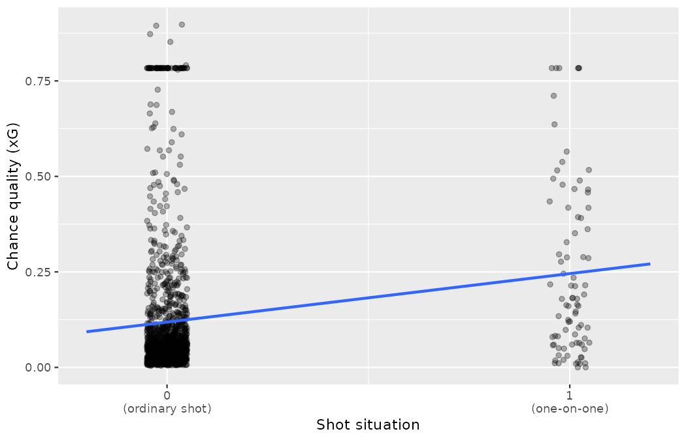{fig-alt="A jittered scatterplot of chance quality with ordinary shots at x = 0 and one-on-ones at x = 1, the narrow stripe of penalties sitting high in the left band, and the least squares line passing through both groups." width=85%}

The parameter estimates are computed the same way as before:

```r
fit_1v1 <- lm(statsbomb_xg ~ one_on_one, data = wc2022_shots)
tidy(fit_1v1)
#> # A tibble: 2 × 5
#>   term           estimate std.error statistic   p.value
#>   <chr>             <dbl>     <dbl>     <dbl>     <dbl>
#> 1 (Intercept)       0.119   0.00485     24.5  1.62e-111
#> 2 one_on_oneTRUE    0.127   0.0203       6.25 5.49e- 10
```

The model equation can be summarized as

$$
\widehat{\texttt{xg}} = 0.119 + 0.127 \times \texttt{one\_on\_one}
$$

::: {.callout-note title="Worked example"}
Interpret the two parameters estimated in the model for the chance quality of World Cup shots.

------------------------------------------------------------------------

The intercept is the estimated chance quality when `one_on_one` has a value 0, i.e., when the shot is an ordinary one.
That is, the average xG of a shot that is not a one-on-one is 0.119.
The slope indicates that, on average, one-on-ones carry about 0.127 *more* chance quality than ordinary shots — a one-on-one is roughly a one-in-four chance $(0.119 + 0.127 = 0.246)$ against a one-in-eight baseline.
We can verify the two group means directly:

```r
wc2022_shots |>
  group_by(one_on_one) |>
  summarize(mean_xg = mean(statsbomb_xg))
#> # A tibble: 2 × 2
#>   one_on_one mean_xg
#>   <lgl>        <dbl>
#> 1 FALSE        0.119
#> 2 TRUE         0.246
```
:::

::: {.callout-important title="Interpreting model estimates for categorical predictors"}
The estimated intercept is the value of the outcome variable for the first category (i.e., the category corresponding to an indicator value of 0).
The estimated slope is the average change in the outcome variable between the two categories.
:::

Note that, fundamentally, the intercept and slope interpretations do not change when modeling categorical variables with two levels.
However, when the predictor variable is binary, the coefficient estimates ($b_0$ and $b_1$) are directly interpretable with respect to the dataset at hand.
And a caution that should now be reflex: these are observational data, so the 0.127 is a *1v1 premium in recorded chance quality*, not a causal effect of the situation — one-on-ones arise from particular patterns of play, a confounding we will untangle when this exact model returns in the multiple regression and inference chapters.

We'll elaborate further on modeling categorical predictors in @sec-model-mlr, where we examine the influence of many predictor variables simultaneously using multiple regression.

## Outliers in linear regression {#sec-outliers-in-regression}

In this section, we discuss when outliers are important and influential.
Outliers in a regression model with one predictor and one outcome are observations that fall far from the cloud of points.
These points are especially important because they can have a strong influence on the least squares line.
Note that there are times when observations are outlying in the $x$ direction, the $y$ direction, or both.
However, being outlying in a univariate sense (either $x$ or $y$ or both) is not outlying from the bivariate model.
If the points are in-line with the bivariate model, they will not influence the least squares regression line (even if the observations are outlying in the $x$ or $y$ or both directions!).

Priya keeps a gallery of six constructed scatterplots for training new scouts to read outliers — every recruitment dataset she has ever touched contains at least one of these shapes.
The seeded code below regenerates the gallery exactly; for each panel, imagine also the residual plot beneath it, tipped flat the way we did in @sec-resids.

```r
set.seed(702)
trend_a <- tibble(x = runif(24, 2, 12), y = 4 + 1.1 * x + rnorm(24, 0, 1.4)) |>
  add_row(x = 7, y = -4)
trend_b <- tibble(x = runif(24, 2, 12), y = 4 + 1.1 * x + rnorm(24, 0, 1.4)) |>
  add_row(x = 22, y = 4 + 1.1 * 22)
trend_c <- tibble(x = runif(24, 2, 8), y = 4 + 1.1 * x + rnorm(24, 0, 1.4)) |>
  add_row(x = 20, y = 36)
cloud_d <- tibble(x = runif(22, 2, 10), y = 3 + 0.9 * x + rnorm(22, 0, 1.3)) |>
  bind_rows(tibble(x = runif(4, 16, 18), y = runif(4, 4, 6)))
super_e <- tibble(x = sample(1:10, 24, replace = TRUE), y = rnorm(24, 3, 1.1)) |>
  add_row(x = 25, y = 9)
inline_f <- tibble(x = runif(24, 2, 10), y = 2 + 1.3 * x + rnorm(24, 0, 1.5)) |>
  add_row(x = 20, y = 2 + 1.3 * 20)

plot_panel <- function(d, title) {
  ggplot(d, aes(x = x, y = y)) +
    geom_point(size = 2, alpha = 0.8) +
    geom_smooth(method = "lm", se = FALSE) +
    labs(x = NULL, y = NULL, title = title)
}

(plot_panel(trend_a, "A") + plot_panel(trend_b, "B") + plot_panel(trend_c, "C")) /
  (plot_panel(cloud_d, "D") + plot_panel(super_e, "E") + plot_panel(inline_f, "F"))
```

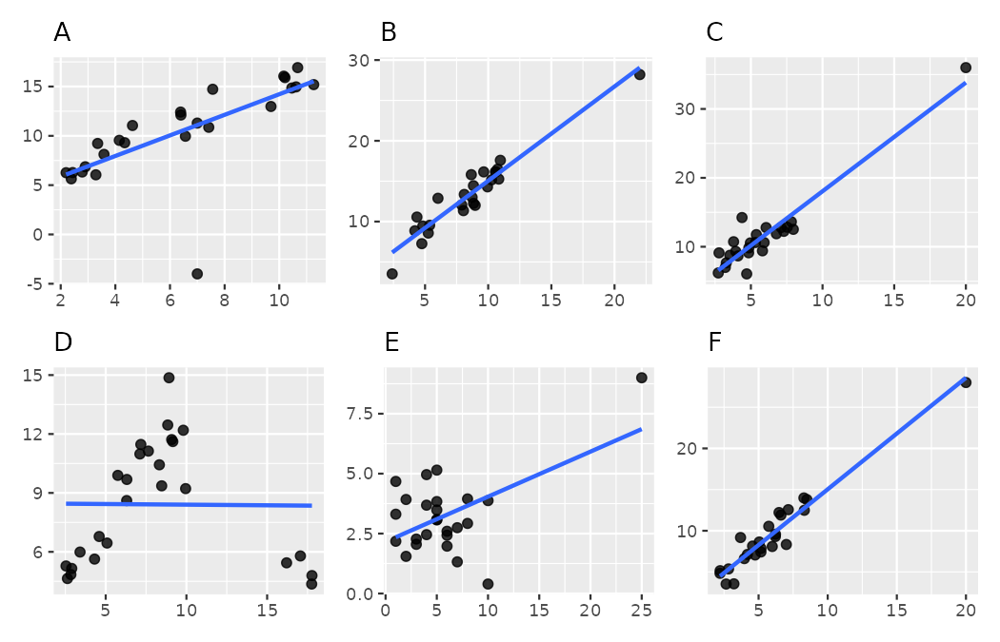{fig-alt="A six-panel outlier gallery labeled A through F: single outliers of varying leverage and influence, a secondary cloud that flattens the main trend, and one far-right point that manufactures a trend where the main cloud shows none." width=85%}

::: {.callout-note title="Worked example"}
For each of panels A, B, and C (and the residual plot you imagine under each), identify the outliers and note how they influence the least squares line.
Recall that an outlier is any point that does not appear to belong with the vast majority of the other points.

------------------------------------------------------------------------

A: There is one outlier far from the other points (in the $y$ direction, and it is an outlier of the bivariate model), though it only appears to slightly influence the line: the slope with the point included barely differs from the slope without it.

B: There is one outlier on the right (in the $x$ and $y$ direction, although it is not an outlier of the bivariate model), though it is quite close to the least squares line, which suggests it wasn't very influential.

C: There is one point far away from the cloud (in the $x$ and $y$ direction and an outlier of the bivariate model), and this outlier appears to pull the least squares line up on the right; examine how the line around the primary cloud does not appear to fit very well.
:::

::: {.callout-note title="Worked example"}
As you did in the previous example, for each of panels D, E, and F, identify the outliers and note how they influence the least squares line.
A point can be outlying in the $x$ direction, in the $y$ direction, or in relation to the bivariate model.

------------------------------------------------------------------------

D: There is a primary cloud and then a small secondary cloud of four outliers (with respect to both $x$ and the bivariate model).
The secondary cloud appears to be influencing the line somewhat strongly, making the least squares line fit poorly almost everywhere — the clear upward trend in the main cloud is flattened almost to zero.
There might be an interesting explanation for the dual clouds, which is something that could be investigated: in scouting data, a secondary cloud is often a different league, position, or data vendor.

E: There is no obvious trend in the main cloud of points, and the outlier on the right (with respect to both $x$ and $y$) appears to largely (and problematically) control the slope of the least squares line.
The point creates a bivariate model when seemingly there is none.
Read this panel as a squad chart: $x$ as substitute appearances and $y$ as goal contributions.
The main cloud of squad players shows no relationship at all — and then one veteran super-sub, far to the right, single-handedly manufactures the "story" that more bench appearances produce more goals.

F: There is one outlier far from the cloud (with respect to both $x$ and $y$).
However, it falls quite close to the least squares line and does not appear to be very influential (it is not outlying with respect to the bivariate model).
:::

Examine the imagined residual plots for the six panels.
In panels C, D, and E, you will probably find that there are a few observations which are both away from the remaining points along the x-axis and not in the trajectory of the trend in the rest of the data.
In these cases, the outliers influenced the slope of the least squares lines.
In panel E, the bulk of the data show no clear trend, but if we fit a line to these data, we impose a trend where there isn't really one.

A good practice for dealing with outlying observations is to produce two analyses: one with and one without the outlying observations.
Presenting both analyses to Marta — "here is the market with the super-sub, here it is without him" — and discussing the role of the outlying observations should lead you to a more holistic understanding of the appropriate model for the data.

::: {.callout-important title="Leverage"}
Points that fall horizontally away from the center of the cloud tend to pull harder on the line, so we call them points with **high leverage** or **leverage points**.
:::

Points that fall far from the cloud's center in the $x$-direction — far from $\bar{x}$ — are points of high leverage, *regardless of how close to the line they sit*; these points can strongly influence the slope of the least squares line.
If one of these high leverage points does appear to actually invoke its influence on the slope of the line — as in panels C, D, and E — then we call it an **influential point**.
Usually we can say a point is influential if, had we fitted the line without it, the influential point would have been unusually far from the least squares line.

::: {.callout-important title="Types of outliers"}
A point (or a group of points) that stands out from the rest of the data is called an **outlier**.
Outliers that fall horizontally away from the center of the cloud of points are called leverage points.
Outliers that influence the slope of the line are called influential points.
:::

::: {.callout-tip title="Check your understanding"}
Priya's veteran-market survey spans ages 28 to 35.
An agent now submits a 39-year-old — far to the right of every other age in the data — listed at a price far *above* where the survey's downward trend would land at that age.
Does the point have high leverage?
Would you expect it to be influential?
And how would your answers change if the same 39-year-old had instead been listed close to the downward trend's extension?

------------------------------------------------------------------------

Sitting horizontally far from the center of the cloud, the point has high leverage in either version.
In the first version it also falls far from the trajectory of the trend, so it would pull the slope up toward itself — a high-leverage point that exercises its leverage, which is what we call an influential point.
In the second version the point remains high leverage but lands roughly where the line would have gone anyway, so it would barely move the fit: leverage without influence, like panels B and F of the gallery.
:::

One final shape belongs in the gallery, because scouts meet it constantly: points that *look* like outliers but are really the model's failure.
The code below — continuing in the same seeded session — rebuilds the age–market-value cloud from the start of the chapter and fits a straight line to it.

```r
age_cloud <- tibble(
  age = runif(70, 17, 36),
  value = 20 - 0.19 * (age - 26.5)^2 + rnorm(70, 0, 2.2)
)

ggplot(age_cloud, aes(x = age, y = value)) +
  geom_point(size = 2, alpha = 0.8) +
  geom_smooth(method = "lm", se = FALSE) +
  labs(x = "Age (years)", y = "Market value (million euros)")
```

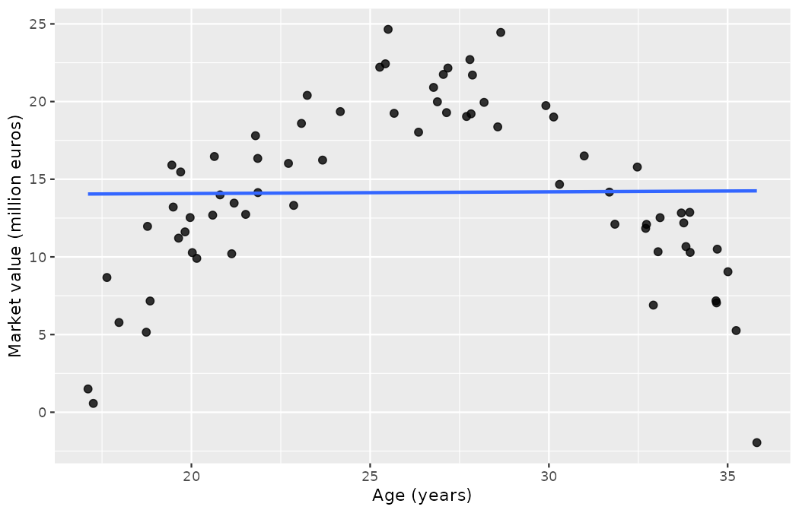{fig-alt="The rebuilt age against market value cloud with a nearly flat fitted line; the under-20s and 33-plus players sit mostly below it and peak-age players above, because the relationship is curved and the straight line is the wrong model." width=85%}

The fitted line comes out nearly flat, and the under-20s and the 33-plus players sit mostly below it — on average about five million euros below — while the peak-age players sit above.
It is tempting to flag the extreme-age players as "outliers" and refit without them.
Resist: no individual point here is the problem.
The relationship is curved, the straight line is the wrong model, and deleting the ends of the age range would simply hide the evidence.
A residual plot exposes the arch immediately, exactly as in the second panel of the residual-plot worked example in @sec-resids.

More generally, it is tempting to remove outliers.
Don't do this without a very good reason.
Models that ignore exceptional (and interesting) cases often perform poorly.
A recruitment department that deleted its super-subs, its freak seasons, and its late-blooming veterans — the "outliers" — would systematically misvalue exactly the players who decide the biggest matches.

## Chapter review {#sec-chp7-review}

### Summary

Throughout this chapter, the nuances of the linear model have been described.
You have learned how to create a linear model with explanatory variables that are numerical (e.g., a team's accumulated chance quality in a match) and those that are categorical (e.g., whether a shot was a one-on-one).
The residuals in a linear model are an important metric used to understand how well a model fits — and in this book's running example they carry a scouting meaning of their own, separating finishing from chance creation; high leverage points, influential points, and other types of outliers can impact the fit of a model.
Correlation is a measure of the strength and direction of the linear relationship of two variables, without specifying which variable is the explanatory and which is the outcome.
The least squares criterion chooses the line minimizing the sum of squared residuals, its slope can be recovered by hand from $b_1 = (s_y/s_x)r,$ and $R^2$ reports the share of the outcome's variability the line explains.
Everything here described *this sample* of data: future chapters will focus on generalizing the linear model from the sample of data to claims about the population of interest — for the veteran market, from 50 listed strikers to the whole market; for the World Cup, from one tournament to the game at large.

### Terms

The terms introduced in this chapter are presented below, alphabetized.
If you're not sure what some of these terms mean, we recommend you go back in the text and review their definitions.
You should be able to easily spot them as **bolded text**.

|  |  |  |
|:-----------------------|:-----------------------|:----------------------|
| coefficient of determination | least squares line | regression sum of squares |
| correlation | leverage point | residuals |
| extrapolation | outcome | R-squared |
| high leverage | outlier | sum of squared errors |
| indicator variable | predictor | total sum of squares |
| influential point |  |  |

: Terms introduced in this chapter. {#tbl-terms-chp-07}

## Exercises {#sec-chp7-exercises}

Answers to odd-numbered exercises can be found in [Appendix -@sec-exercise-solutions-07]. Final answers to the even-numbered exercises are in [Appendix -@sec-appendix-even-answers].

::: {.exercises}

:::

------------------------------------------------------------------------

Adapted from *Introduction to Modern Statistics* by Çetinkaya-Rundel & Hardin (CC BY-SA 4.0); this adaptation is likewise CC BY-SA 4.0. Match data: StatsBomb open data.
