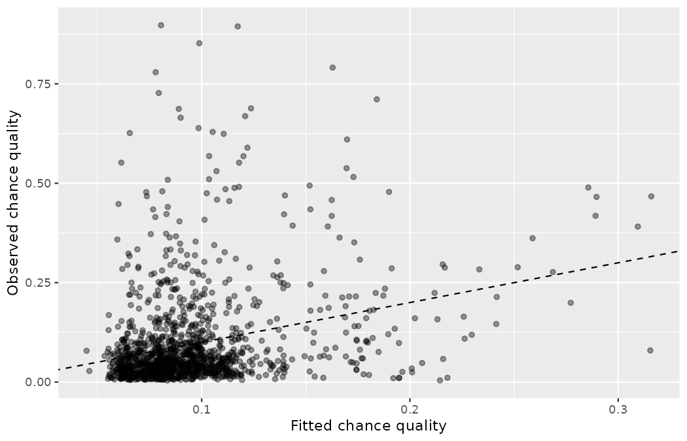

# Linear regression with multiple predictors {#sec-model-mlr}

::: {.chapterintro}
Building on the ideas of one predictor variable in a linear regression model (from [Chapter -@sec-model-slr]), a multiple linear regression model is now fit to two or more predictor variables.
By considering how different explanatory variables interact, we can uncover complicated relationships between the predictor variables and the response variable — exactly the kind of tangle a scouting department faces when it asks *what makes a chance a good chance*.
One challenge to working with multiple variables is that it is sometimes difficult to know which variables are most important to include in the model.
Model building is an extensive topic, and we scratch the surface here by defining and utilizing the adjusted $R^2$ value.
:::

Multiple regression extends single predictor variable regression to the case that still has one response but many predictors (denoted $x_1$, $x_2$, $x_3$, ...).
Two pieces of notation are new here, so take them apart before we use them.
In @sec-model-slr the single predictor was simply $x$; now the letter $x$ still names a predictor variable, and the *subscript* indexes *which* predictor we mean — $x_1$ is the first predictor, $x_2$ the second, and so on.
The letter $k$ will denote the total number of predictors in the model, so the full list runs $x_1, x_2, \dots, x_k$.
Do not confuse this subscript with the observation subscript $i$ from @sec-explore-numerical: $x_i$ indexed *which shot*, while $x_1, \dots, x_k$ index *which variable*.
The method is motivated by scenarios where many variables may be simultaneously connected to an output.

We will consider the shot data from the 2022 Men's World Cup, which you first encountered in [Chapter -@sec-data-hello].
The outcome variable we would like to better understand is the chance quality of a shot — the `statsbomb_xg` value.
Priya Rao, Northbridge United's lead data analyst, wants the scouting department to stop arguing about chance quality one anecdote at a time and instead ask model-shaped questions.
For instance, all other characteristics of a shot held constant, does it matter whether the striker was one-on-one with the goalkeeper?
Does it matter that the shot was a header rather than struck with the right foot?
Multiple regression will help us answer these and other questions.

Before fitting anything, we build a modeling frame from the raw shot data.

::: {.callout-note title="Data"}
The raw file `wc2022_shots.csv` in `data/derived/` holds all 1,494 shots of the tournament.
For this chapter we restrict attention to *open-play* shots: penalties (whose chance quality is fixed by the laws of the game at roughly 0.78, the spike you saw in the right tail of every xG histogram in @sec-explore-numerical) and direct free kicks are set pieces whose quality is determined by rule and routine, not by the shot characteristics we want to study.
That filter keeps 1,382 shots.
We additionally drop the 13 shots whose body part is logged only as `Other` (chest, thigh, and similar rarities) and the 4 open-play shots whose possession pattern is logged only as `Other`, leaving **1,365 shots**.
Based on the data in this dataset we have created two recoded variables: `under_pressure` and `one_on_one`, each turned from a logical into an indicator variable (1 for yes, 0 for no).
We will refer to this modified dataset as `shots_wc`.
:::

Notice that `one_on_one` is an **indicator variable**: it takes the value 1 if the striker faced the goalkeeper one-on-one and 0 if not.
Using an indicator variable in place of a category name allows for these variables to be directly used in regression.
Three of the other variables are categorical (`body_part`, `technique`, and `play_pattern`), each of which can take one of a few different non-numerical values; we'll discuss how these are handled in the model in @sec-ind-and-cat-predictors.

```r
library(dplyr)
library(readr)
library(broom)

wc2022_shots <- read_csv("data/derived/wc2022_shots.csv")

shots_wc <- wc2022_shots |>
  filter(
    shot_type == "Open Play",
    body_part != "Other",
    play_pattern != "Other"
  ) |>
  mutate(
    body_part = factor(body_part, levels = c("Right Foot", "Left Foot", "Head")),
    technique = relevel(factor(technique), ref = "Normal"),
    play_pattern = relevel(factor(play_pattern), ref = "Regular Play"),
    under_pressure = if_else(under_pressure, 1, 0),
    one_on_one = if_else(one_on_one, 1, 0)
  ) |>
  select(
    statsbomb_xg, body_part, technique, under_pressure,
    one_on_one, play_pattern, minute
  )

glimpse(shots_wc)
#> Rows: 1,365
#> Columns: 7
#> $ statsbomb_xg   <dbl> 0.038882375, 0.024477394, 0.061585550, 0.279144610, 0.0~
#> $ body_part      <fct> Left Foot, Left Foot, Left Foot, Right Foot, Left Foot,~
#> $ technique      <fct> Normal, Lob, Half Volley, Half Volley, Normal, Half Vol~
#> $ under_pressure <dbl> 1, 0, 0, 0, 0, 0, 0, 0, 0, 1, 1, 0, 0, 0, 1, 1, 0, 0, 0~
#> $ one_on_one     <dbl> 0, 0, 0, 0, 0, 1, 0, 0, 0, 0, 0, 0, 0, 0, 0, 0, 0, 0, 0~
#> $ play_pattern   <fct> Regular Play, From Throw In, From Corner, From Counter,~
#> $ minute         <dbl> 2, 3, 9, 14, 15, 22, 32, 47, 57, 70, 70, 7, 26, 29, 31,~
```

Descriptions for each variable are shown in @tbl-shots-model-variables.
Pay attention to the `factor()` and `relevel()` calls in the code above — they decide which level of each categorical variable will serve as the baseline, a choice whose consequences occupy the next section.

| Variable | Description |
|:---|:------------------------------|
| `statsbomb_xg` | Chance quality of the shot: the probability, estimated by StatsBomb's xG model, that a shot with these characteristics is scored. The outcome variable. |
| `body_part` | Categorical variable for the body part used, with levels `Right Foot`, `Left Foot`, and `Head`. |
| `technique` | Categorical variable for the striking technique, with levels `Normal`, `Backheel`, `Diving Header`, `Half Volley`, `Lob`, `Overhead Kick`, and `Volley`. |
| `under_pressure` | An indicator variable for whether the shot was taken under defensive pressure. This variable takes a value of `1` if the answer is *yes* and `0` if the answer is *no*. |
| `one_on_one` | An indicator variable for whether the striker was one-on-one with the goalkeeper: `1` for *yes*, `0` for *no*. |
| `play_pattern` | Categorical variable for the possession pattern the shot arose from, with levels `Regular Play`, `From Corner`, `From Counter`, `From Free Kick`, `From Goal Kick`, `From Keeper`, `From Kick Off`, and `From Throw In`. |
| `minute` | The match minute in which the shot was taken. |

: Variables and their descriptions for the `shots_wc` dataset. {#tbl-shots-model-variables}

## Indicator and categorical predictors {#sec-ind-and-cat-predictors}

Let's start by fitting a linear regression model for chance quality with a single predictor indicating whether the striker was one-on-one with the goalkeeper:

$$
\widehat{\texttt{statsbomb\_xg}} = 0.0896 + 0.1039 \times \texttt{one\_on\_one}
$$

Results of this model are shown below; degrees of freedom for this model is 1363 (a term we will define precisely later in this chapter).

```r
m_1v1 <- lm(statsbomb_xg ~ one_on_one, data = shots_wc)
tidy(m_1v1)
#> # A tibble: 2 x 5
#>   term        estimate std.error statistic   p.value
#>   <chr>          <dbl>     <dbl>     <dbl>     <dbl>
#> 1 (Intercept)   0.0896   0.00327     27.4  5.03e-132
#> 2 one_on_one    0.104    0.0141       7.35 3.36e- 13
```

You met this indicator model in @sec-model-slr, where we fit it to all 1,494 shots of the tournament and obtained an intercept of 0.119 and a slope of 0.127:

```r
lm(statsbomb_xg ~ one_on_one, data = wc2022_shots) |>
  tidy()
#> # A tibble: 2 x 5
#>   term           estimate std.error statistic   p.value
#>   <chr>             <dbl>     <dbl>     <dbl>     <dbl>
#> 1 (Intercept)       0.119   0.00485     24.5  1.62e-111
#> 2 one_on_oneTRUE    0.127   0.0203       6.25 5.49e- 10
```

Both coefficients shift once the set pieces (and the handful of `Other`-coded shots) are excluded, and it is worth seeing exactly why.
A count of shot types against the indicator shows that penalties sit on *both* sides of it:

```r
wc2022_shots |>
  count(shot_type, one_on_one)
#> # A tibble: 6 x 3
#>   shot_type one_on_one     n
#>   <chr>     <lgl>      <int>
#> 1 Corner    TRUE           2
#> 2 Free Kick FALSE         46
#> 3 Open Play FALSE       1305
#> 4 Open Play TRUE          77
#> 5 Penalty   FALSE         58
#> 6 Penalty   TRUE           6
```

Six of the 64 penalties also carry the one-on-one tag, and every penalty sits at a chance quality of about 0.78 — several times the mean of either group.
(The two direct corners tagged as one-on-ones carry a chance quality of 0.0002 apiece and play no role in what follows.)
Now compare shares: those 6 penalties make up $6/85 \approx 7\%$ of the small one-on-one group, while the other 58 make up only $58/1409 \approx 4\%$ of the large ordinary-shot group.
The penalty spike therefore inflated the one-on-one group's mean *more* than the baseline's — removing the set pieces drops the ordinary-shot mean from 0.1186 to 0.0896 (the intercept) and the one-on-one mean from 0.2455 to 0.1935, so the gap between the group means, which is what the slope measures, falls from 0.1269 to 0.1039.
A first, quiet lesson in this chapter's theme: what a coefficient measures depends on which shots are in the frame and what else the model does (or does not) account for.

::: {.callout-note title="Worked example"}
Interpret the coefficient for the one-on-one variable in the model fit to `shots_wc`.

------------------------------------------------------------------------

The variable takes one of two values: 1 when the striker was one-on-one with the goalkeeper and 0 otherwise.
A slope of 0.1039 means that the model predicts a chance quality 0.1039 higher for one-on-one shots — roughly ten percentage points more probability of a goal, on average, than for ordinary open-play shots.
(See @sec-categorical-predictor-two-levels for a review of the interpretation for two-level categorical predictor variables.)
:::

Suppose we had fit a model using a 3-level categorical variable, such as `body_part`.
The output from software is shown below (degrees of freedom: 1362).
This regression output provides multiple rows for the variable.
Each row represents the relative difference for each level of `body_part`.
However, we are missing one of the levels: `Right Foot`.
The missing level is called the **reference level**, and it represents the default level that other levels are measured against.
Right foot is the natural default here — it is the most common body part in the data by some distance — and the `factor(body_part, levels = c("Right Foot", ...))` call in our data preparation is precisely what installed it as the reference.

```r
m_body <- lm(statsbomb_xg ~ body_part, data = shots_wc)
tidy(m_body)
#> # A tibble: 3 x 5
#>   term               estimate std.error statistic  p.value
#>   <chr>                 <dbl>     <dbl>     <dbl>    <dbl>
#> 1 (Intercept)        0.0926     0.00453   20.5    2.18e-81
#> 2 body_partLeft Foot 0.000343   0.00743    0.0462 9.63e- 1
#> 3 body_partHead      0.0129     0.00880    1.47   1.42e- 1
```

::: {.callout-note title="Worked example"}
How would we write an equation for this regression model?

------------------------------------------------------------------------

The equation for the regression model may be written as a model with two predictors:

$$
\begin{aligned}
\widehat{\texttt{statsbomb\_xg}} &= 0.0926 \\
&+ 0.0003 \times \texttt{body\_part}_{\texttt{Left Foot}} \\
&+ 0.0129 \times \texttt{body\_part}_{\texttt{Head}}
\end{aligned}
$$

We use the notation $\texttt{variable}_{\texttt{level}}$ to represent *indicator variables* for when the categorical variable takes a particular value.
This subscript is new notation, so decompose it: the base name (here $\texttt{body\_part}$) tells you which categorical variable is being encoded, and the subscript (here $\texttt{Left Foot}$ or $\texttt{Head}$) names the *level* whose presence the indicator flags.
For example, $\texttt{body\_part}_{\texttt{Left Foot}}$ would take a value of 1 if the shot was struck with the left foot, and it would take a value of 0 otherwise.
Likewise, $\texttt{body\_part}_{\texttt{Head}}$ would take a value of 1 if the shot was a header, and 0 if it took any other value.
:::

The notation $\texttt{variable}_{\texttt{level}}$ may feel a bit confusing.
Let's figure out how to use the equation for each level of the `body_part` variable.

::: {.callout-note title="Worked example"}
Using the model for predicting chance quality from body part, compute the average chance quality for shots struck with the *right foot*.

------------------------------------------------------------------------

When `body_part` takes a value of `Right Foot`, then both indicator functions in the equation for the linear model are set to 0:

$$
\widehat{\texttt{statsbomb\_xg}} = 0.0926 + 0.0003 \times 0 + 0.0129 \times 0 = 0.0926
$$

The average chance quality for right-footed open-play shots is 0.0926 — about a one-in-eleven chance of a goal.
Because the level does not have its own coefficient and it is the reference value, the indicators for the other levels for this variable all drop out.
:::

::: {.callout-note title="Worked example"}
Using the model for predicting chance quality from body part, compute the average chance quality for shots struck with the *left foot*.

------------------------------------------------------------------------

When `body_part` takes a value of `Left Foot`, then the corresponding variable takes a value of 1 while the other is 0:

$$
\widehat{\texttt{statsbomb\_xg}} = 0.0926 + 0.0003 \times 1 + 0.0129 \times 0 = 0.0929
$$

The average chance quality for left-footed shots is 0.0929 — essentially indistinguishable from right-footed shots, which should not surprise anyone who has watched a two-footed forward.
:::

::: {.callout-tip title="Check your understanding"}
Compute the average chance quality for *headers*.

------------------------------------------------------------------------

When `body_part` takes a value of `Head`, then the corresponding variable takes a value of 1 while the other is 0: $0.0926 + 0.0003 \times 0 + 0.0129 \times 1 = 0.1055.$
The average chance quality for open-play headers is 0.1055.
:::

::: {.callout-important title="Predictors with several categories"}
When fitting a regression model with a categorical variable that has $k$ levels where $k > 2$, software will provide a coefficient for $k - 1$ of those levels.
For the last level that does not receive a coefficient, this is the reference level, and the coefficients listed for the other levels are all considered relative to this reference level.
:::

::: {.callout-tip title="Check your understanding"}
Interpret the coefficients from the body-part model above.

------------------------------------------------------------------------

Each of the coefficients gives the incremental chance quality for the corresponding level relative to the `Right Foot` level, which is the reference level.
For example, for a header, the model predicts a chance quality 0.0129 higher than for a right-footed shot.
:::

::: {.callout-tip title="Check your understanding"}
Priya releveled `play_pattern` so that `Regular Play` is the reference level.
Had she left R's alphabetical default (which would make `From Corner` the reference), would the model's *predictions* change?
Would the *coefficients* change?

------------------------------------------------------------------------

The predictions would be identical: releveling does not change the model's fit, only its parameterization.
The coefficients would all change, because each level's coefficient would now measure the difference from `From Corner` rather than from `Regular Play` — and the intercept would become the predicted chance quality for corner-derived shots.
Choose the reference level for interpretability; the fit does not care.
:::

The *higher* chance quality for headers is surprising.
Intuitively, Emil Sørensen's scouts — and most coaches — regard headed chances as inferior, and the conversion data agree with them:

```r
wc2022_shots |>
  mutate(header = body_part == "Head") |>
  group_by(header) |>
  summarize(shots = n(), conversion = mean(goal))
#> # A tibble: 2 x 3
#>   header shots conversion
#>   <lgl>  <int>      <dbl>
#> 1 FALSE   1242      0.134
#> 2 TRUE     252      0.111
```

Across the whole tournament, headers were scored 11.1% of the time against 13.4% for everything else, yet our open-play model just assigned headers the *highest* average chance quality.
However, note that the situation may be more complex, and there may be confounding variables that we didn't account for.
A header cannot be attempted from 30 metres; it happens where the cross lands, close to goal, most often from corners and free-kick deliveries:

```r
shots_wc |>
  filter(body_part == "Head") |>
  count(play_pattern, sort = TRUE) |>
  slice_head(n = 3)
#> # A tibble: 3 x 2
#>   play_pattern       n
#>   <fct>          <int>
#> 1 From Corner       99
#> 2 From Free Kick    54
#> 3 Regular Play      46
```

Foot shots, by contrast, include every hopeful 25-metre effort in the dataset.
Comparing headers to foot shots *without* accounting for where and how the chance arose mixes up the effect of the body part with the effect of the situations that produce each body part — the same header confounding you met in @sec-data-design, now visible inside a regression model.
(What other confounding variables might explain this counter-intuitive relationship suggested by the model?)

::: {.callout-tip title="Check your understanding"}
How much larger a chance quality would we expect for a header vs a left-footed shot, according to the body-part model?

------------------------------------------------------------------------

Relative to the `Right Foot` reference, headers carry a chance quality 0.0129 higher, while left-footed shots are only 0.0003 higher.
Thus, headers are predicted to carry a chance quality about $0.0129 - 0.0003 = 0.0126$ higher than left-footed shots.
:::

## Many predictors in a model

The world is complex — a football match especially so — and it can be helpful to consider many factors at once in statistical modeling.
For example, we might like to use the full context of a shot to predict its chance quality rather than using a single variable.
This is the strategy used in **multiple regression**.
While we remain cautious about making any causal interpretations using multiple regression on observational data — and every shot in `shots_wc` is observational; nobody at the World Cup randomized who got pressured, recall the warnings of @sec-data-design — such models are a common first step in gaining insights or providing some evidence of a causal connection.

We want to construct a model that accounts not only for whether the striker was one-on-one or which body part struck the ball, but simultaneously accounts for all the variables in the `shots_wc` dataset: `body_part`, `technique`, `under_pressure`, `one_on_one`, `play_pattern`, and `minute`.

$$
\begin{aligned}
\widehat{\texttt{statsbomb\_xg}} &= b_0 \\
&+ b_1 \times \texttt{body\_part}_{\texttt{Left Foot}} + b_2 \times \texttt{body\_part}_{\texttt{Head}} \\
&+ b_3 \times \texttt{technique}_{\texttt{Backheel}} + \cdots + b_8 \times \texttt{technique}_{\texttt{Volley}} \\
&+ b_9 \times \texttt{under\_pressure} + b_{10} \times \texttt{one\_on\_one} \\
&+ b_{11} \times \texttt{play\_pattern}_{\texttt{From Corner}} + \cdots + b_{17} \times \texttt{play\_pattern}_{\texttt{From Throw In}} \\
&+ b_{18} \times \texttt{minute}
\end{aligned}
$$

This equation represents a holistic approach for modeling all of the variables simultaneously.
Notice that there are two coefficients for `body_part`, six for `technique`, and seven for `play_pattern`, since these are 3-level, 7-level, and 8-level categorical variables — each contributes one indicator per non-reference level, exactly as in @sec-ind-and-cat-predictors.

We calculate $b_0$, $b_1$, $b_2$, $\cdots$, $b_{18}$ the same way as we did in the case of a model with a single predictor — we select values that minimize the sum of the squared residuals:

$$
SSE = e_1^2 + e_2^2 + \dots + e_{1365}^2 = \sum_{i=1}^{1365} e_i^2 = \sum_{i=1}^{1365} \left(y_i - \hat{y}_i\right)^2
$$

where $y_i$ and $\hat{y}_i$ represent the observed chance quality values and their estimated values according to the model, respectively — the same $e_i$, $\hat{y}$, and SSE you met in @sec-model-slr, only the count of coefficients has grown.
1,365 residuals are calculated, one for each shot.
Note that these values are sample statistics and in the case where the observed data is a random sample from a target population that we are interested in making inferences about — say, open-play shots in elite tournament football generally — they are estimates of the population parameters $\beta_0$, $\beta_1$, $\beta_2$, $\cdots$, $\beta_{18}$.
We will discuss inference based on linear models in [Chapter -@sec-inf-model-mlr], for now we will focus on calculating sample statistics $b_i$.

We typically use a computer to minimize the sum of squares and compute point estimates, as shown below.
Using this output, we identify $b_i,$ just as we did in the one-predictor case.
Degrees of freedom for this model is 1346.

```r
m_full <- lm(
  statsbomb_xg ~ body_part + technique + under_pressure + one_on_one +
    play_pattern + minute,
  data = shots_wc
)

tidy(m_full) |> print(n = 19)
#> # A tibble: 19 x 5
#>    term                        estimate std.error statistic  p.value
#>    <chr>                          <dbl>     <dbl>     <dbl>    <dbl>
#>  1 (Intercept)                 0.0741    0.00890      8.32  2.08e-16
#>  2 body_partLeft Foot          0.00349   0.00722      0.483 6.29e- 1
#>  3 body_partHead               0.0197    0.0105       1.88  6.06e- 2
#>  4 techniqueBackheel          -0.0246    0.0521      -0.473 6.36e- 1
#>  5 techniqueDiving Header      0.0790    0.0322       2.45  1.44e- 2
#>  6 techniqueHalf Volley        0.0285    0.00909      3.13  1.78e- 3
#>  7 techniqueLob                0.136     0.0329       4.15  3.61e- 5
#>  8 techniqueOverhead Kick     -0.0193    0.0441      -0.438 6.61e- 1
#>  9 techniqueVolley             0.0385    0.0130       2.97  3.05e- 3
#> 10 under_pressure             -0.00516   0.00924     -0.558 5.77e- 1
#> 11 one_on_one                  0.0872    0.0144       6.07  1.67e- 9
#> 12 play_patternFrom Corner     0.00131   0.0103       0.127 8.99e- 1
#> 13 play_patternFrom Counter    0.0544    0.0166       3.27  1.09e- 3
#> 14 play_patternFrom Free Kick -0.0195    0.00945     -2.07  3.89e- 2
#> 15 play_patternFrom Goal Kick  0.0152    0.0142       1.07  2.86e- 1
#> 16 play_patternFrom Keeper     0.0133    0.0259       0.513 6.08e- 1
#> 17 play_patternFrom Kick Off  -0.00898   0.0289      -0.311 7.56e- 1
#> 18 play_patternFrom Throw In  -0.0133    0.00872     -1.53  1.27e- 1
#> 19 minute                      0.000123  0.000110     1.12  2.65e- 1
```

Before reading any single coefficient, look at the model whole.
The plot below sets each shot's observed chance quality against the value the model fits for it, with a dashed line marking perfect prediction $(y = x)$:

```r
ggplot(
  tibble(observed = shots_wc$statsbomb_xg, fitted = fitted(m_full)),
  aes(x = fitted, y = observed)
) +
  geom_point(alpha = 0.4) +
  geom_abline(slope = 1, intercept = 0, linetype = "dashed") +
  labs(x = "Fitted chance quality", y = "Observed chance quality")
```

{fig-alt="A scatterplot of observed chance quality against fitted chance quality for 1,365 open-play shots, with a dashed diagonal line marking perfect prediction. The fitted values are compressed between roughly 0.05 and 0.32 while observed values reach 0.9, so the densest mass hugs the bottom of the plot and the best chances tower far above the dashed line." width=85%}

The picture is sobering in exactly the right way.
Running the code confirms that the fitted values occupy only the band from $0.045$ to $0.316,$ while the observed chance quality spans $0.004$ to $0.897$: the tags do order shots sensibly — the cloud drifts upward as the fitted value grows — but the very best chances sit far above anything the model dares to predict.
Eighteen coefficients describing how a shot *arose* still cannot see *where* it was struck from, and this gap is the visual preview of the modest $R^2$ we will compute later in the chapter.

::: {.callout-important title="Multiple regression model"}
A multiple regression model is a linear model with many predictors.
In general, we write the model as

$$
\hat{y} = b_0 + b_1 x_1 + b_2 x_2 + \cdots + b_k x_k
$$

when there are $k$ predictors.
We always calculate $b_i$ using statistical software.
:::

::: {.callout-note title="Worked example"}
Write out the regression model using the regression output above.
How many predictors are there in this model?

------------------------------------------------------------------------

The fitted model for the chance quality of a shot is given by:

$$
\begin{aligned}
\widehat{\texttt{statsbomb\_xg}} &= 0.0741 \\
&+ 0.0035 \times \texttt{body\_part}_{\texttt{Left Foot}} + 0.0197 \times \texttt{body\_part}_{\texttt{Head}} \\
&- 0.0246 \times \texttt{technique}_{\texttt{Backheel}} + 0.0790 \times \texttt{technique}_{\texttt{Diving Header}} \\
&+ 0.0285 \times \texttt{technique}_{\texttt{Half Volley}} + 0.1364 \times \texttt{technique}_{\texttt{Lob}} \\
&- 0.0193 \times \texttt{technique}_{\texttt{Overhead Kick}} + 0.0385 \times \texttt{technique}_{\texttt{Volley}} \\
&- 0.0052 \times \texttt{under\_pressure} + 0.0872 \times \texttt{one\_on\_one} \\
&+ 0.0013 \times \texttt{play\_pattern}_{\texttt{From Corner}} + 0.0544 \times \texttt{play\_pattern}_{\texttt{From Counter}} \\
&- 0.0195 \times \texttt{play\_pattern}_{\texttt{From Free Kick}} + 0.0152 \times \texttt{play\_pattern}_{\texttt{From Goal Kick}} \\
&+ 0.0133 \times \texttt{play\_pattern}_{\texttt{From Keeper}} - 0.0090 \times \texttt{play\_pattern}_{\texttt{From Kick Off}} \\
&- 0.0133 \times \texttt{play\_pattern}_{\texttt{From Throw In}} + 0.0001 \times \texttt{minute}
\end{aligned}
$$

If we count up the number of predictor coefficients, we get the *effective* number of predictors in the model; there are eighteen of those.
Notice that each categorical predictor counts as one fewer than its number of levels: two for `body_part`, six for `technique`, seven for `play_pattern`.
In general, a categorical predictor with $p$ different levels will be represented by $p - 1$ terms in a multiple regression model.
A total of six variables were used as predictors to fit this model: `body_part`, `technique`, `under_pressure`, `one_on_one`, `play_pattern`, `minute`.
:::

::: {.callout-tip title="Check your understanding"}
Interpret the coefficient of the variable `minute`.

------------------------------------------------------------------------

All else held constant, for each additional minute of match time, we would expect the chance quality of a shot to be higher, on average, by 0.0001.
Over a full 90 minutes that amounts to about 0.011 — a coefficient Priya would read out to Marta Vidal as "the clock tells us essentially nothing about chance quality once we know how the shot arose."
Hold on to that thought; it will decide this chapter's model-selection story.
:::

::: {.callout-tip title="Check your understanding"}
Compute the residual of the first shot in `shots_wc` using the full model.

```r
shots_wc |> slice_head(n = 1)
#> # A tibble: 1 x 7
#>   statsbomb_xg body_part technique under_pressure one_on_one play_pattern minute
#>          <dbl> <fct>     <fct>              <dbl>      <dbl> <fct>         <dbl>
#> 1       0.0389 Left Foot Normal                 1          0 Regular Play      2
```

------------------------------------------------------------------------

To compute the residual, we first need the predicted value, which we compute by plugging values into the equation from earlier.
This shot was struck with the left foot $(\texttt{body\_part}_{\texttt{Left Foot}} = 1)$, with normal technique (every `technique` indicator is 0), under pressure $(\texttt{under\_pressure} = 1)$, not one-on-one, in regular play (every `play_pattern` indicator is 0), in minute 2.
This leads to a prediction of $0.0741 + 0.0035 - 0.0052 + 0.0001 \times 2 \approx 0.0727$.
The observed chance quality was 0.0389, which leads to a residual of $e_1 = 0.0389 - 0.0727 = -0.0338$.
R confirms the hand computation:

```r
predict(m_full)[1]
#>          1
#> 0.07266436
residuals(m_full)[1]
#>           1
#> -0.03378198
```
:::

::: {.callout-note title="Worked example"}
We calculated a slope coefficient of 0.1039 for `one_on_one` in @sec-ind-and-cat-predictors while the coefficient is 0.0872 here.
Why is there a difference between the coefficient values between the models with single and multiple predictors?

------------------------------------------------------------------------

If we examined the data carefully, we would see that some predictors are correlated.
For instance, when we modeled the relationship of the outcome `statsbomb_xg` and predictor `one_on_one` using linear regression, we were unable to control for other variables like the possession pattern that produced the shot or the technique used to strike it.
That original model was constructed in a vacuum and did not consider the full context of the shot.
And one-on-ones do not arise uniformly across contexts:

```r
shots_wc |>
  group_by(one_on_one) |>
  summarize(
    shots = n(),
    prop_counter = mean(play_pattern == "From Counter"),
    prop_goal_kick = mean(play_pattern == "From Goal Kick"),
    prop_lob = mean(technique == "Lob")
  )
#> # A tibble: 2 x 5
#>   one_on_one shots prop_counter prop_goal_kick prop_lob
#>        <dbl> <int>        <dbl>          <dbl>    <dbl>
#> 1          0  1292       0.0372         0.0534  0.00619
#> 2          1    73       0.0959         0.137   0.0685
```

One-on-ones come disproportionately from counter-attacks and long balls over the top of a pressing defence (`From Goal Kick`), and they are finished disproportionately with lobs — and counters $(+0.0544)$ and lobs $(+0.1364)$ carry their own positive coefficients in the full model.
The single-predictor model credited all of that situational value to the one-on-one itself.
When we include all of the variables, underlying and unintentional bias that was missed by not including these other variables is reduced or eliminated.
Of course, bias can still exist from other confounding variables — shot location, most obviously, which our dataset does not contain.
:::

The previous example describes a common issue in multiple regression: correlation among predictor variables.
We say the two predictor variables are **collinear** (pronounced as *co-linear*) when they are correlated, and this **multicollinearity** complicates model estimation.
While it is impossible to prevent multicollinearity from arising in observational data, experiments are usually designed to prevent predictors from being multicollinear — when Priya randomizes which scout receives which report template at Northbridge, the randomization guarantees the treatment is uncorrelated with every other characteristic of the scouts.

::: {.callout-tip title="Check your understanding"}
The estimated value of the intercept is 0.0741, and one might be tempted to make some interpretation of this coefficient, such as, it is the model's predicted chance quality when each of the variables take value zero: a right-footed shot, normal technique, no pressure, no one-on-one, arising in regular play, in minute zero.
Is this reasonable?
Is there any value gained by making this interpretation?

------------------------------------------------------------------------

Unlike some settings, every variable here *can* take the value zero for a real shot: right-footed, normal-technique, unpressured, non-one-on-one, regular-play shots exist in abundance, and a shot in minute 0 is possible (if rare).
So the interpretation is not absurd — the intercept describes a plausible "baseline" shot, worth about a 1-in-13 chance of a goal.
But be careful about how much value it adds: the intercept bundles together the reference level of *every* categorical variable at once, so it describes one particular profile of shot, not "an average shot."
Its main job is to anchor the equation so the other coefficients can be read as differences from that baseline profile.
:::

## Adjusted R-squared

We first used $R^2$ in @sec-r-squared to determine the amount of variability in the response that was explained by the model:

$$
R^2 = 1 - \frac{\text{variability in residuals}}{\text{variability in the outcome}}
    = 1 - \frac{Var(e_i)}{Var(y_i)}
$$

where $e_i$ represents the residuals of the model and $y_i$ the outcomes.
This equation remains valid in the multiple regression framework, but a small enhancement can make it even more informative when comparing models.
The two variances for our full model are:

```r
c(var_e = var(residuals(m_full)), var_y = var(shots_wc$statsbomb_xg))
#>      var_e      var_y
#> 0.01318893 0.01434056
```

::: {.callout-tip title="Check your understanding"}
The variance of the residuals for the full chance-quality model is 0.013189, and the variance of the chance quality of all 1,365 shots is 0.014341.
Calculate $R^2$ for this model.

------------------------------------------------------------------------

$R^2 = 1 - \frac{0.013189}{0.014341} = 0.0803$.
The full context of a shot — body part, technique, pressure, one-on-one, possession pattern, minute — explains about 8% of the variability in chance quality.
Priya will not be handing in her resignation over that number: the biggest driver of chance quality is *where* the shot is taken from, and location is not among our predictors.
:::

This strategy for estimating $R^2$ works when there is a single predictor.
However, it becomes less helpful when there are many variables.
The regular $R^2$ is a biased estimate of the amount of variability explained by the model when applied to a model with more than one predictor.
Here is what "biased" means in plain terms: the in-sample $R^2$ always looks better than the model will perform on new data, because least squares tuned the coefficients to *this* sample's noise along with its signal — adding a predictor, however worthless, can only nudge $R^2$ upward.
The adjusted $R^2$ charges a per-predictor fee as a rough correction; the truly honest test is new data, which is exactly the external validation you will meet in @sec-inf-model-mlr.
To get a better estimate, we use the adjusted $R^2$.

::: {.callout-important title="Adjusted R-squared as a tool for model assessment"}
The **adjusted R-squared** is computed as

$$
\begin{aligned}
  R_{adj}^{2}
    &= 1 - \frac{s_{\text{residuals}}^2 / (n-k-1)}
        {s_{\text{outcome}}^2 / (n-1)} = 1 - \frac{s_{\text{residuals}}^2}{s_{\text{outcome}}^2}
        \times \frac{n-1}{n-k-1}
\end{aligned}
$$

where $n$ is the number of observations used to fit the model and $k$ is the number of predictor variables in the model.
Remember that a categorical predictor with $p$ levels will contribute $p - 1$ to the number of variables in the model.
:::

Two pieces of this formula deserve a careful reading.
The symbol $R^2_{adj}$ is our familiar $R^2$ from @sec-r-squared wearing a subscript: the base symbol still measures the share of outcome variability captured by the model, and the subscript $adj$ marks that it has been *adjusted* for how many predictors were spent to capture it.
And the quantity $n - k - 1$ counts, piece by piece: start with the $n$ observations, subtract one for each of the $k$ slope coefficients the model had to estimate, and subtract $1$ more for the intercept $b_0$.
Because $k$ is never negative, the adjusted $R^2$ will be smaller — often times just a little smaller — than the unadjusted $R^2$.
The reasoning behind the adjusted $R^2$ lies in the **degrees of freedom** associated with each variance — the term promised back when we fit our first model of this chapter — which is equal to $n - k - 1$ in the multiple regression context: the number of observations left over, so to speak, after the model has used up one piece of information per estimated coefficient.
If we were to make predictions for *new data* using our current model — next season's shots, or another tournament entirely — we would find that the unadjusted $R^2$ would tend to be slightly overly optimistic, while the adjusted $R^2$ formula helps correct this bias.

::: {.callout-tip title="Check your understanding"}
There were $n = 1{,}365$ shots in the dataset and $k = 18$ predictor variables in the model.
Use $n$, $k$, and the variances from the earlier Check your understanding to calculate adjusted $R^2$ for the chance-quality model.

------------------------------------------------------------------------

$R_{adj}^2 = 1 - \frac{0.013189}{0.014341} \times \frac{1365-1}{1365-18-1} = 0.0680$.
While the difference from $R^2 = 0.0803$ is small, it will be important when we fine tune the model in the next section.
R agrees:

```r
glance(m_full) |> select(r.squared, adj.r.squared, df.residual)
#> # A tibble: 1 x 3
#>   r.squared adj.r.squared df.residual
#>       <dbl>         <dbl>       <int>
#> 1    0.0803        0.0680        1346
```
:::

::: {.callout-tip title="Check your understanding"}
Suppose you added another predictor to the model — say, an indicator for whether the shot came in first-half stoppage time — but the variance of the errors $Var(e_i)$ didn't go down.
What would happen to the $R^2$?
What would happen to the adjusted $R^2$?

------------------------------------------------------------------------

The unadjusted $R^2$ would stay the same and the adjusted $R^2$ would go down: the numerator of the correction factor gains nothing while $n - k - 1$ shrinks.
:::

::: {.callout-note title="Deeper (optional): watching junk predictors inflate $R^2$"}
The bias is easy to manufacture on demand.
Below, three "predictors" of pure noise — random numbers with no connection to any shot — join the single-predictor `one_on_one` model.
This is a constructed demonstration, so the code is seeded:

```r
set.seed(801)
shots_junk <- shots_wc |>
  mutate(junk1 = rnorm(n()), junk2 = rnorm(n()), junk3 = rnorm(n()))

m_lean <- lm(statsbomb_xg ~ one_on_one, data = shots_junk)
m_junk <- lm(statsbomb_xg ~ one_on_one + junk1 + junk2 + junk3,
             data = shots_junk)

bind_rows(glance(m_lean), glance(m_junk)) |>
  select(r.squared, adj.r.squared)
#> # A tibble: 2 x 2
#>   r.squared adj.r.squared
#>       <dbl>         <dbl>
#> 1    0.0381        0.0374
#> 2    0.0394        0.0366
```

Three columns of noise "explain" extra variability — $R^2$ rises from $0.0381$ to $0.0394,$ as it must, because least squares will always find *some* accidental alignment between noise and outcome to exploit.
The adjusted $R^2,$ charging its per-predictor fee, moves the other way: $0.0374$ down to $0.0366.$
The fee is no proof of worthlessness — only new data can deliver that verdict — but here it points in exactly the right direction.
:::

Adjusted $R^2$ could also have been used in [Chapter -@sec-model-slr] where we introduced regression models with a single predictor.
However, when there is only $k = 1$ predictors, adjusted $R^2$ is very close to regular $R^2$, so this nuance isn't typically important when the model has only one predictor.

## Model selection {#sec-model-selection}

The best model is not always the most complicated.
Sometimes including predictors that are not evidently important can actually reduce the accuracy of predictions.
In this section, we discuss model selection strategies, which will help us eliminate predictors from the model that are found to be less important.
Models that have undergone such predictor pruning are commonly described as **parsimonious** — the discipline's term of approval for a model that explains as much as possible with as little as possible.

In practice, the model that includes all available predictors is often referred to as the **full model**.
The full model may not be the best model, and if it isn't, we want to identify a smaller model that is preferable.

The setting for this section is a request from Marta Vidal: she wants a chance-quality model that *travels* — one the recruitment team can quote whether the prospect plays in a men's or a women's competition.
So Priya pools the open-play shots from both tournaments the club tracks, the 2022 Men's World Cup and the 2025 Women's Euro, applying the same filters as before.
Pooling brings two new candidate predictors along: `competition` (which tournament the shot belongs to, 2 levels) and `period` (first half, second half, or one of the two extra-time periods, 4 levels — knockout matches in both tournaments went to extra time).

```r
weuro2025_shots <- read_csv("data/derived/weuro2025_shots.csv")

prep_shots <- function(shots) {
  shots |>
    filter(
      shot_type == "Open Play",
      body_part != "Other",
      play_pattern != "Other"
    ) |>
    mutate(
      body_part = factor(body_part, levels = c("Right Foot", "Left Foot", "Head")),
      technique = relevel(factor(technique), ref = "Normal"),
      play_pattern = relevel(factor(play_pattern), ref = "Regular Play"),
      under_pressure = if_else(under_pressure, 1, 0),
      one_on_one = if_else(one_on_one, 1, 0)
    ) |>
    select(competition, statsbomb_xg, body_part, technique, under_pressure,
           one_on_one, play_pattern, minute, period)
}

shots_all <- bind_rows(prep_shots(wc2022_shots), prep_shots(weuro2025_shots)) |>
  mutate(
    competition = factor(competition, levels = c("wc2022", "weuro2025")),
    period = factor(period)
  )

shots_all |> count(competition, period)
#> # A tibble: 8 x 3
#>   competition period     n
#>   <fct>       <fct>  <int>
#> 1 wc2022      1        572
#> 2 wc2022      2        749
#> 3 wc2022      3         20
#> 4 wc2022      4         24
#> 5 weuro2025   1        363
#> 6 weuro2025   2        447
#> 7 weuro2025   3         17
#> 8 weuro2025   4         17
```

The pooled dataset holds $1{,}365 + 844 = 2{,}209$ shots, and the full model now has eight candidate variables: `competition`, `body_part`, `technique`, `under_pressure`, `one_on_one`, `play_pattern`, `minute`, and `period` — 22 effective predictors once each categorical variable is expanded into indicators.
Note, before we fit anything, that `minute` and `period` are blatantly collinear: a shot in period 2 is necessarily a shot after minute 45.
Keep that in mind as the selection algorithms do their work.

```r
m_all_full <- lm(
  statsbomb_xg ~ competition + body_part + technique + under_pressure +
    one_on_one + play_pattern + minute + period,
  data = shots_all
)

glance(m_all_full) |> select(adj.r.squared, df.residual)
#> # A tibble: 1 x 2
#>   adj.r.squared df.residual
#>           <dbl>       <int>
#> 1        0.0521        2186
```

For comparison, here is the model that uses the same predictors except the two clock variables, `minute` and `period`:

```r
m_no_clock <- lm(
  statsbomb_xg ~ competition + body_part + technique + under_pressure +
    one_on_one + play_pattern,
  data = shots_all
)

glance(m_no_clock) |> select(adj.r.squared, df.residual)
#> # A tibble: 1 x 2
#>   adj.r.squared df.residual
#>           <dbl>       <int>
#> 1        0.0527        2190
```

::: {.callout-note title="Worked example"}
Which of the two models is better?

------------------------------------------------------------------------

We compare the adjusted $R^2$ of each model to determine which to choose.
Since the second model has a higher adjusted $R^2$ $(0.0527$ versus $0.0521)$ compared to the first model, we prefer the second model to the first: dropping both clock variables *raised* the adjusted $R^2$.
We cannot know for sure, but based on the adjusted $R^2$, this is our best assessment.
:::

### Stepwise selection

Two common strategies for adding or removing predictors in a multiple regression model are called backward elimination and forward selection.
These techniques are often referred to as **stepwise selection** strategies, because they add or delete one variable at a time as they "step" through the candidate predictors.

**Backward elimination** starts with the full model — the model that includes all potential predictor variables.
Predictors are eliminated one-at-a-time from the model until we cannot improve the model any further.

**Forward selection** is the reverse of the backward elimination technique.
Instead, of eliminating predictors one-at-a-time, we add predictors one-at-a-time until we cannot find any predictors that improve the model any further.

An important consideration in implementing either of these stepwise selection strategies is the criterion used to decide whether to eliminate or add a predictor.
One commonly used decision criterion is adjusted $R^2$.
When using adjusted $R^2$ as the decision criterion, we seek to eliminate or add predictors depending on whether they lead to the largest improvement in adjusted $R^2$ and we stop when adding or elimination of another predictor does not lead to further improvement in adjusted $R^2$.

Adjusted $R^2$ describes the strength of a model fit, and it is a useful tool for evaluating which predictors are adding value to the model, where *adding value* means they are (likely) improving the accuracy in predicting future outcomes — precisely what Marta needs if the model is to be quoted on prospects the club has not watched yet.

To keep the bookkeeping honest, we define two small helper functions: `adj_r2()` fits a model with a given set of predictor variables and returns its adjusted $R^2$; `drop_one()` and `add_one()` report, for every candidate, the adjusted $R^2$ of the model with that variable removed or added.

```r
library(purrr)

preds <- c("competition", "body_part", "technique", "under_pressure",
           "one_on_one", "play_pattern", "minute", "period")

adj_r2 <- function(vars) {
  glance(lm(reformulate(vars, response = "statsbomb_xg"), data = shots_all))$adj.r.squared
}

drop_one <- function(current) {
  map_dbl(current, \(v) adj_r2(setdiff(current, v))) |>
    set_names(current) |> sort(decreasing = TRUE) |> round(5)
}

add_one <- function(current, candidates) {
  map_dbl(candidates, \(v) adj_r2(c(current, v))) |>
    set_names(candidates) |> sort(decreasing = TRUE) |> round(5)
}
```

::: {.callout-note title="Worked example"}
Results corresponding to the full model for the pooled `shots_all` data are shown above.
How should we proceed under the backward elimination strategy?

------------------------------------------------------------------------

Our baseline adjusted $R^2$ from the full model is $0.05210,$ and we need to determine whether dropping a predictor will improve the adjusted $R^2$.
To check, we fit models that each drop a different predictor, and we record the adjusted $R^2$ (each value below is labeled by the variable *removed*):

```r
drop_one(preds)
#>         minute         period    competition under_pressure      body_part
#>        0.05248        0.05237        0.05198        0.05179        0.04710
#>   play_pattern      technique     one_on_one
#>        0.04502        0.03552        0.02763
```

The model without `minute` has the highest adjusted $R^2$ of $0.05248,$ higher than the adjusted $R^2$ for the full model; therefore, we drop `minute` from the model.

Since we eliminated a predictor from the model in the first step, we see whether we should eliminate any additional predictors.
Our baseline adjusted $R^2$ is now $R^2_{adj} = 0.05248$.
We now fit new models, which consider eliminating each of the remaining predictors in addition to `minute`:

```r
drop_one(setdiff(preds, "minute"))
#>         period    competition under_pressure      body_part   play_pattern
#>        0.05271        0.05235        0.05218        0.04751        0.04538
#>      technique     one_on_one
#>        0.03591        0.02799
```

Dropping `period` as well improves the adjusted $R^2$ to $0.05271,$ so `period` is eliminated too.
Once `minute` was gone, `period` had no independent contribution left to make — no surprise, given how collinear the two clock variables are.
We check a third time:

```r
drop_one(setdiff(preds, c("minute", "period")))
#>    competition under_pressure      body_part   play_pattern      technique
#>        0.05261        0.05239        0.04779        0.04533        0.03644
#>     one_on_one
#>        0.02817
```

None of these models lead to an improvement in adjusted $R^2$ over $0.05271,$ so we do not eliminate any of the remaining predictors.
That is, after backward elimination, we are left with the model that keeps all predictors except the two clock variables — exactly the model `m_no_clock` we fit earlier, whose coefficients are:

```r
tidy(m_no_clock) |> print(n = 19)
#> # A tibble: 19 x 5
#>    term                       estimate std.error statistic  p.value
#>    <chr>                         <dbl>     <dbl>     <dbl>    <dbl>
#>  1 (Intercept)                 0.0796    0.00542    14.7   1.10e-46
#>  2 competitionweuro2025        0.00574   0.00517     1.11  2.67e- 1
#>  3 body_partLeft Foot          0.00507   0.00556     0.912 3.62e- 1
#>  4 body_partHead               0.0279    0.00764     3.66  2.62e- 4
#>  5 techniqueBackheel           0.0382    0.0295      1.29  1.96e- 1
#>  6 techniqueDiving Header      0.0707    0.0311      2.28  2.29e- 2
#>  7 techniqueHalf Volley        0.0312    0.00713     4.38  1.26e- 5
#>  8 techniqueLob                0.0479    0.0227      2.11  3.49e- 2
#>  9 techniqueOverhead Kick      0.00928   0.0361      0.257 7.97e- 1
#> 10 techniqueVolley             0.0459    0.00996     4.61  4.30e- 6
#> 11 under_pressure             -0.00790   0.00600    -1.32  1.88e- 1
#> 12 one_on_one                  0.0936    0.0123      7.60  4.39e-14
#> 13 play_patternFrom Corner    -0.0124    0.00767    -1.62  1.06e- 1
#> 14 play_patternFrom Counter    0.0306    0.0123      2.48  1.33e- 2
#> 15 play_patternFrom Free Kick -0.0190    0.00762    -2.49  1.28e- 2
#> 16 play_patternFrom Goal Kick  0.0258    0.0115      2.26  2.42e- 2
#> 17 play_patternFrom Keeper    -0.00922   0.0178     -0.518 6.05e- 1
#> 18 play_patternFrom Kick Off  -0.0107    0.0223     -0.480 6.31e- 1
#> 19 play_patternFrom Throw In  -0.00593   0.00667    -0.888 3.74e- 1
```

In equation form, the model chosen by backward elimination is:

$$
\begin{aligned}
\widehat{\texttt{statsbomb\_xg}} &= 0.0796 \\
&+ 0.0057 \times \texttt{competition}_{\texttt{weuro2025}} \\
&+ 0.0051 \times \texttt{body\_part}_{\texttt{Left Foot}} + 0.0279 \times \texttt{body\_part}_{\texttt{Head}} \\
&+ 0.0382 \times \texttt{technique}_{\texttt{Backheel}} + 0.0707 \times \texttt{technique}_{\texttt{Diving Header}} \\
&+ 0.0312 \times \texttt{technique}_{\texttt{Half Volley}} + 0.0479 \times \texttt{technique}_{\texttt{Lob}} \\
&+ 0.0093 \times \texttt{technique}_{\texttt{Overhead Kick}} + 0.0459 \times \texttt{technique}_{\texttt{Volley}} \\
&- 0.0079 \times \texttt{under\_pressure} + 0.0936 \times \texttt{one\_on\_one} \\
&- 0.0124 \times \texttt{play\_pattern}_{\texttt{From Corner}} + 0.0306 \times \texttt{play\_pattern}_{\texttt{From Counter}} \\
&- 0.0190 \times \texttt{play\_pattern}_{\texttt{From Free Kick}} + 0.0258 \times \texttt{play\_pattern}_{\texttt{From Goal Kick}} \\
&- 0.0092 \times \texttt{play\_pattern}_{\texttt{From Keeper}} - 0.0107 \times \texttt{play\_pattern}_{\texttt{From Kick Off}} \\
&- 0.0059 \times \texttt{play\_pattern}_{\texttt{From Throw In}}
\end{aligned}
$$
:::

::: {.callout-tip title="Check your understanding"}
In the first backward-elimination step, the model without `period` reached an adjusted $R^2$ of $0.05237$ — which also beats the full model's $0.05210.$
Why did we drop `minute` rather than `period` at that step, and did `period` lose its chance to leave the model?

------------------------------------------------------------------------

At each step, backward elimination removes the single predictor whose removal *most improves* the adjusted $R^2.$
Dropping `minute` gave $0.05248,$ ahead of `period`'s $0.05237,$ so `minute` went first.
And `period` lost nothing by waiting: on the very next pass, with `minute` already gone, dropping `period` raised the adjusted $R^2$ to $0.05271,$ and it was eliminated too.
:::

::: {.callout-note title="Worked example"}
Construct a model for predicting `statsbomb_xg` from the `shots_all` data using forward selection.

------------------------------------------------------------------------

We start with the model that includes no predictors.
Then we fit each of the possible models with just one predictor.
Then we examine the adjusted $R^2$ for each of these models (each value below is labeled by the variable *added*):

```r
add_one(character(0), preds)
#>     one_on_one      technique   play_pattern      body_part under_pressure
#>        0.03100        0.01474        0.00549        0.00114        0.00001
#>         period    competition         minute
#>       -0.00027       -0.00043       -0.00045
```

In this first step, we compare the adjusted $R^2$ against a baseline model that has no predictors, which always has $R_{adj}^2 = 0$.
The model with one predictor that has the largest adjusted $R^2$ is the model with the `one_on_one` predictor $(0.03100),$ so we will add this variable to our model.
(Notice that three of the single-predictor models — `period`, `competition`, and `minute` — have *negative* adjusted $R^2$: they explain so little that the penalty for spending a coefficient outweighs the variability captured.)

We repeat the process again, this time considering 2-predictor models where one of the predictors is `one_on_one` and with a new baseline of $R^2_{adj} = 0.03100:$

```r
add_one("one_on_one", setdiff(preds, "one_on_one"))
#>      technique   play_pattern      body_part    competition under_pressure
#>        0.04317        0.03515        0.03115        0.03088        0.03078
#>         period         minute
#>        0.03065        0.03058
```

The model including `technique` has the largest increase in adjusted $R^2$ $(0.04317)$ from the baseline $(0.03100).$
Thus, we will also add `technique` to the model as a predictor.

Now we have a new baseline adjusted $R^2$ of $0.04317$.
We can continue on and see whether it would be beneficial to add a third predictor:

```r
add_one(c("one_on_one", "technique"), setdiff(preds, c("one_on_one", "technique")))
#>   play_pattern      body_part    competition         period         minute
#>        0.04832        0.04513        0.04313        0.04311        0.04278
#> under_pressure
#>        0.04276
```

The model including `play_pattern` has the largest increase in adjusted $R^2$ $(0.04832)$ from the baseline $(0.04317),$ so we add `play_pattern` to the model as a predictor as well.
Rather than grind through the remaining steps by hand, we let a loop finish the job, printing each addition it makes:

```r
current <- c("one_on_one", "technique", "play_pattern")
repeat {
  step <- add_one(current, setdiff(preds, current))
  if (step[1] <= round(adj_r2(current), 5)) break
  current <- c(current, names(step)[1])
  cat("added", names(step)[1], "-> adjusted R-sq =", step[1], "\n")
}
#> added body_part -> adjusted R-sq = 0.05253
#> added under_pressure -> adjusted R-sq = 0.05261
#> added competition -> adjusted R-sq = 0.05271

current
#> [1] "one_on_one"     "technique"      "play_pattern"   "body_part"
#> [5] "under_pressure" "competition"
```

At this point, we come to the two clock variables: adding either of them to the six-predictor model leads to a *lower* adjusted $R^2$ than the baseline of $0.05271:$

```r
add_one(current, c("minute", "period"))
#>  period  minute
#> 0.05248 0.05237
```

This means we do not add `minute` or `period` to the model as predictors.
In this example, we have arrived at the same model that we identified with backward elimination.
:::

::: {.callout-important title="Stepwise selection strategies"}
Backward elimination begins with the model having the largest number of predictors and eliminates predictors one-by-one until we are satisfied that all remaining predictors are important to the model.
Forward selection starts with no predictors included in the model, then it adds in predictors according to their importance until no other important predictors are found.
Notice that, for both methods, we have always chosen to retain the model with the largest adjusted $R^2$ value, even if the difference is tiny (e.g., $0.05248$ versus $0.05271$).
One could argue that the difference between these models is negligible, as they all explain nearly the same amount of variability in `statsbomb_xg`.
These negligible differences are an important aspect to model selection.
It is highly advised that *before* you begin the model selection process, you decide what a "meaningful" difference in adjusted $R^2$ is for the context of your data.
Maybe this difference is 1% or maybe it is 5%.
This "threshold" is what you will then use to decide if one model is "better" than another model.
Using meaningful thresholds in model selection requires more critical thinking about what the adjusted $R^2$ values mean.
Priya, for one, would tell Marta that a model with the clock variables and a model without them are, for recruitment purposes, the same model — and would then choose the smaller one, because every variable kept is a variable someone must collect, clean, and explain in a meeting.

Additionally, backward elimination and forward selection can arrive at different final models, because the decision for whether to include a given predictor or not depends on the other predictors that are already in the model.
With forward selection, you start with a model that includes no predictors, and add predictors one at a time.
In backward elimination, you start with a model that includes all of the potential predictors, and remove predictors one at a time.
How much a given predictor changes the percentage of the variability in the outcome that is explained by the model depends on the other predictors in the model, particularly if the predictor variables are correlated with each other.
Our clock variables made this vivid: with `minute` in the model, `period` looked useless, and vice versa — a collinear pair can take turns appearing redundant.
:::

There is no "one size fits all" model selection strategy, which is why there are so many different model selection methods.
We hope you walk away from this exploration understanding how stepwise selection is carried out and the considerations that should be made when using stepwise selection with regression models.

### Other model selection strategies

Stepwise selection using adjusted $R^2$ as the decision criteria is one of many commonly used model selection strategies.
Stepwise selection can also be carried out with decision criteria other than adjusted $R^2$, such as p-values, which you'll learn about in @sec-inf-model-slr onward, or AIC (Akaike information criterion), which we will put to work in @sec-model-logistic, or BIC (Bayesian information criterion), which you might learn about in more advanced courses.

Alternatively, one could choose to include or exclude predictors from a model based on expert opinion or due to research focus.
In fact, many statisticians discourage the use of stepwise regression *alone* for model selection and advocate, instead, for a more thoughtful approach that carefully considers the research focus and features of the data.
A scouting department is well placed to take that advice: if Emil Sørensen's scouts have watched a thousand one-on-ones, their conviction that the situation matters is domain knowledge, and domain knowledge is allowed to overrule half a percent of adjusted $R^2$.

## Chapter review {#sec-chp8-review}

### Summary

With real data, there is often a need to describe how multiple variables can be modeled together — a shot's chance quality is not one story but many told at once: the body part, the technique, the pressure, the situation.
In this chapter, we have presented one approach using multiple linear regression.
Each coefficient represents how the model predicts the outcome might change with one unit increase of that predictor *given* the rest of the predictor variables in the model — the "all else held constant" reading that separated the one-on-one premium of 0.1039 (alone) from 0.0872 (in context).
Working with and interpreting multivariable models can be tricky, especially when the predictor variables show multicollinearity, as our clock variables `minute` and `period` did.
There is often no perfect or "right" final model, however, using the adjusted $R^2$ value is one way to identify important predictor variables for a final regression model — backward elimination and forward selection both led Priya to the same six-variable model for chance quality across two tournaments.
In later chapters we will generalize multiple linear regression models to a larger population of interest from which the dataset was sampled.

### Terms

The terms introduced in this chapter are presented below, alphabetized.
If you're not sure what some of these terms mean, we recommend you go back in the text and review their definitions.
You should be able to easily spot them as **bolded text**.

|  |  |  |
|:-----------------------|:-----------------------|:----------------------|
| adjusted R-squared | forward selection | parsimonious |
| backward elimination | full model | reference level |
| collinear | multicollinearity | stepwise selection |
| degrees of freedom | multiple regression |  |

: Terms introduced in this chapter. {#tbl-terms-chp-08}

## Exercises {#sec-chp8-exercises}

Answers to odd-numbered exercises can be found in [Appendix -@sec-exercise-solutions-08]. Final answers to the even-numbered exercises are in [Appendix -@sec-appendix-even-answers].

::: {.exercises}

:::

------------------------------------------------------------------------

Adapted from *Introduction to Modern Statistics* by Çetinkaya-Rundel & Hardin (CC BY-SA 4.0); this adaptation is likewise CC BY-SA 4.0. Match data: StatsBomb open data.
