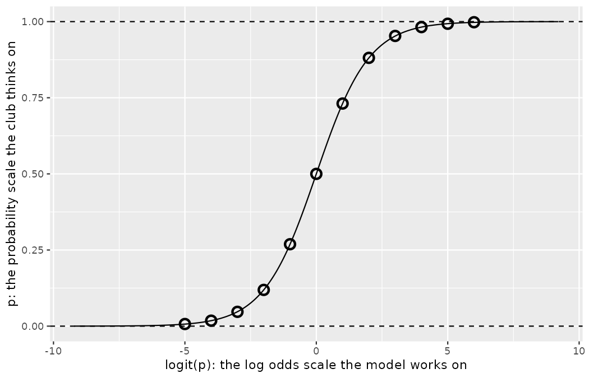

# Logistic regression {#sec-model-logistic}

::: {.chapterintro}
In this chapter we introduce **logistic regression** as a tool for building models when there is a categorical response variable with two levels, e.g., shortlisted and not shortlisted, or goal and no goal.
Logistic regression is a type of **generalized linear model (GLM)** for response variables where regular multiple regression does not work very well.
GLMs can be thought of as a two-stage modeling approach.
We first model the response variable using a probability distribution, such as the binomial or Poisson distribution.
Second, we model the parameter of the distribution using a collection of predictors and a special form of multiple regression.
Ultimately, the application of a GLM will feel very similar to multiple regression — which you have just practiced in @sec-model-mlr — even if some of the details are different.
:::

The scouting outcomes a club actually acts on are almost never numerical.
Marta Vidal does not ask Priya Rao for a player's *amount* of shortlisting; she asks whether the dossier was shortlisted or not.
A shot is a goal or it is not.
A trialist is offered terms or sent home.
The linear and multiple regression machinery of @sec-model-slr and @sec-model-mlr was built for numerical responses, so before we can model the decisions that matter most to a recruitment department, we need one more tool.

## Discrimination in shortlisting

We will consider data from an audit Priya Rao designed to answer an uncomfortable question Marta Vidal put to the recruitment department: do the club's own shortlisting decisions treat identically documented players differently depending on cues that should be irrelevant — most pointedly, the nationality printed on the dossier?

Northbridge United's recruitment department runs a *triage desk*: every prospect dossier that reaches the club through the league-wide scouting-exchange platform — the clearing house that relays submissions from clubs' scouting networks and from agents, Emil Sørensen's 48 regional scouts among its contributors — is read and either shortlisted for a follow-up assessment or filed away.
Triage is the platform's *pre-video* stage: a dossier is a text-only profile, and any highlight footage is merely listed as available on request — requests come later, at the follow-up assessment, never at triage.
The platform's volume is what made a credible audit possible: dozens of dossiers arrive through it every working day, so test profiles could disappear into the ordinary flow without anyone at the desk noticing the stream had been salted.
To evaluate which dossier characteristics were driving the desk's decisions, Priya constructed a large set of fake prospect profiles and released them into the platform's submission stream across two seasons, recording which ones elicited a shortlist — the text-only format is precisely what made fabricated players viable, since none would ever face a video review at this stage.[^09-model-logistic-1]
She enumerated the important characteristics a dossier can carry — the tier of league the player appears in, seasons of senior football, listed awards, and so on — and used these characteristics to randomly generate the fake profiles.
Finally, each profile was randomly assigned a listed nationality (conveyed by the passport line and the styling of the player's name) and a submission route (the club's own network, or an agent).

[^09-model-logistic-1]: We omit one design detail from the story: a careful audit would release the test dossiers in batches balanced across the triage staff — a form of *blocking*, which you will recognize from @sec-data-design.
    Accounting for the blocking would tighten the estimates — shrinking their sample-to-sample variability, a quantity we will name properly in @sec-foundations-mathematical — without notably changing the point estimates for the `nationality` and `agent_flag` variables versus the analysis presented in this section.
    That is, the most interesting conclusions of the audit are unaffected even under a more sophisticated analysis.

This is a constructed Northbridge scenario — no real triage desk was audited — and, as always in this book, we build the dataset ourselves in seeded R code so that every number in this chapter can be reproduced.
Read the construction code carefully: the `log_odds` line *is* the hidden decision process of the scenario, the "truth" about how this triage desk behaves.
The question the rest of the chapter answers is whether logistic regression, given only the dossiers and the decisions, can recover that truth.

```r
library(dplyr)
library(readr)
library(ggplot2)
library(broom)

set.seed(901)
n_dossiers <- 4800

audit_study <- tibble(
  league_tier    = sample(c("first", "second"), n_dossiers, replace = TRUE),
  youth_caps     = rbinom(n_dossiers, 1, 0.35),
  years_senior   = sample(2:12, n_dossiers, replace = TRUE),
  award          = rbinom(n_dossiers, 1, 0.06),
  injury_note    = rbinom(n_dossiers, 1, 0.10),
  video_attached = rbinom(n_dossiers, 1, 0.50),
  nationality    = sample(c("foreign", "domestic"), n_dossiers, replace = TRUE),
  agent_flag     = sample(c("network", "agent"), n_dossiers, replace = TRUE)
) |>
  mutate(
    nationality = factor(nationality, levels = c("foreign", "domestic")),
    agent_flag  = factor(agent_flag, levels = c("network", "agent")),
    league_tier = factor(league_tier, levels = c("first", "second")),
    log_odds    = -2.55 + 0.85 * video_attached +
      0.45 * (nationality == "domestic") -
      0.25 * (agent_flag == "agent") -
      0.45 * (league_tier == "second") +
      0.02 * years_senior +
      0.75 * award -
      0.30 * injury_note,
    shortlisted = rbinom(n_dossiers, 1, exp(log_odds) / (1 + exp(log_odds)))
  ) |>
  select(-log_odds)

glimpse(audit_study)
#> Rows: 4,800
#> Columns: 9
#> $ league_tier    <fct> second, second, first, first, first, second, first, fir…
#> $ youth_caps     <int> 1, 1, 1, 1, 0, 0, 0, 0, 0, 0, 0, 0, 0, 0, 1, 0, 1, 1, 1…
#> $ years_senior   <int> 9, 8, 12, 2, 8, 11, 10, 5, 6, 11, 2, 2, 9, 7, 10, 9, 6,…
#> $ award          <int> 0, 0, 0, 0, 0, 0, 0, 0, 0, 1, 0, 0, 0, 0, 0, 0, 0, 0, 0…
#> $ injury_note    <int> 0, 0, 0, 1, 0, 0, 0, 0, 0, 1, 0, 0, 0, 0, 0, 0, 0, 1, 0…
#> $ video_attached <int> 0, 1, 0, 0, 1, 1, 0, 1, 0, 0, 1, 0, 0, 0, 1, 0, 1, 0, 0…
#> $ nationality    <fct> domestic, foreign, foreign, domestic, foreign, domestic…
#> $ agent_flag     <fct> network, agent, network, agent, network, network, agent…
#> $ shortlisted    <int> 0, 0, 0, 0, 1, 0, 1, 0, 1, 0, 0, 0, 1, 0, 0, 1, 0, 0, 0…
```

The response variable of interest is whether the triage desk shortlisted the dossier, and there are 8 attributes that were randomly assigned that we'll consider, with special interest in the `nationality` and `agent_flag` variables.
Club policy is explicit that neither should matter for an identically documented player: the football is to be judged, not the passport or the paperwork route.
The full set of attributes considered is provided in @tbl-audit-variables.

| variable | description |
|:---|:------------------------------------------|
| `shortlisted` | Specifies whether the triage desk shortlisted the dossier for a follow-up assessment. |
| `league_tier` | Tier of the league the profile places the player in: first or second. |
| `youth_caps` | An indicator for whether the profile lists youth international caps. |
| `years_senior` | Number of seasons of senior football listed on the profile. |
| `award` | Indicator for the profile listing an individual award, e.g., league young player of the month. |
| `injury_note` | Indicator for the profile mentioning a past long-term injury. |
| `video_attached` | Indicator for the dossier listing a three-minute highlight clip as available on request (footage is never pulled at the triage stage). |
| `nationality` | Nationality of the player, implied by the passport line and name listed on the dossier: foreign or domestic. |
| `agent_flag` | Route the dossier arrived by: the club's own scouting network, or submitted by an agent. |

: Descriptions of nine variables from the `audit_study` dataset. Many of the variables are indicator variables, meaning they take the value 1 if the specified characteristic is present and 0 otherwise. {#tbl-audit-variables}

All of the attributes listed on each dossier were randomly assigned, which means that no attributes that might be favorable or detrimental to shortlisting would systematically favor one nationality label or submission route over another on these dossiers.
Importantly, due to the experimental nature of the audit, we can infer causation between these variables and the shortlist rate, if substantial differences are found — recall from @sec-data-hello that random assignment is precisely what buys us causal language.
Our analysis will allow us to compare the practical importance of each of the variables relative to each other.

Before any modeling, two simple summaries set the scene.
Overall, the triage desk shortlisted 637 of the 4,800 test dossiers:

```r
audit_study |>
  summarize(
    n = n(),
    n_shortlisted = sum(shortlisted),
    p_shortlisted = mean(shortlisted)
  )
#> # A tibble: 1 × 3
#>       n n_shortlisted p_shortlisted
#>   <int>         <int>         <dbl>
#> 1  4800           637         0.133
```

And splitting by the one line on the dossier that should not matter:

```r
audit_study |>
  group_by(nationality) |>
  summarize(n = n(), p_shortlisted = mean(shortlisted))
#> # A tibble: 2 × 3
#>   nationality     n p_shortlisted
#>   <fct>       <int>         <dbl>
#> 1 foreign      2433         0.104
#> 2 domestic     2367         0.162
```

Dossiers labeled domestic were shortlisted 16.2% of the time; identical dossiers labeled foreign, 10.4% of the time.
A two-group comparison like this is where @sec-foundations-randomization will begin its formal treatment of hypothesis testing.
In this chapter our ambition is different: we want a *model* that accounts for all eight randomized attributes at once, the way @sec-model-mlr accounted for several predictors of chance quality at once.

## Modelling the probability of an event {#sec-modelingTheProbabilityOfAnEvent}

Logistic regression is a generalized linear model where the outcome is a two-level categorical variable.
The outcome, $Y_i$, takes the value 1 (in our application, the outcome represents a shortlisted dossier) with probability $p_i$ and the value 0 with probability $1 - p_i$.
Take the new notation apart before using it.
The capital letter $Y$ denotes the outcome variable itself; the subscript $i$ indexes the observation, exactly as it has since $x_i$ in @sec-explore-numerical, so $Y_i$ is the outcome recorded for observation $i$ — for dossier $i$, either a 1 or a 0.
The lowercase $p_i$ is not data at all: it is the *probability* that dossier $i$ is shortlisted, a number between 0 and 1 that belongs to the model's description of the world, not to the spreadsheet.
Because each observation has a slightly different context — a different league tier, a different number of seasons of senior football — the probability $p_i$ will differ for each observation.
Ultimately, it is the **probability** of the outcome taking the value 1 (i.e., being a "success") that we model in relation to the predictor variables: we will examine which dossier characteristics correspond to higher or lower shortlist rates.

::: {.callout-important title="Notation for a logistic regression model"}
The outcome variable for a GLM is denoted by $Y_i$, where the index $i$ is used to represent observation $i$.
In the dossier audit application, $Y_i$ will be used to represent whether dossier $i$ was shortlisted $(Y_i=1)$ or not $(Y_i=0)$.
:::

The predictor variables are represented as in @sec-model-mlr: $x_{1,i}$ is the value of variable 1 for observation $i$, $x_{2,i}$ is the value of variable 2 for observation $i$, and so on.

$$
transformation(p_i) = \beta_0 + \beta_1 x_{1,i} + \beta_2 x_{2,i} + \cdots + \beta_k x_{k,i}
$$

The right-hand side you already know: the population coefficients $\beta_0, \beta_1, \ldots, \beta_k$ carry exactly the meaning they had in @sec-model-slr and @sec-model-mlr.
What is new is the left-hand side.
We want to choose a **transformation** in the equation that makes practical and mathematical sense.
For example, we want a transformation that makes the range of possibilities on the left hand side of the equation equal to the range of possibilities for the right hand side; if there was no transformation in the equation, the left hand side could only take values between 0 and 1, but the right hand side could take values well outside of the range from 0 to 1.

::: {.callout-tip title="Check your understanding"}
Why not skip the transformation entirely and fit an ordinary multiple regression of the 0/1 variable `shortlisted` on the eight predictors?

------------------------------------------------------------------------

Because the fitted values would not respect what they are supposed to be.
A linear combination $b_0 + b_1 x_{1,i} + \cdots + b_k x_{k,i}$ can produce any number — $-0.3$, or $1.7$ — while a probability of being shortlisted must live between 0 and 1.
A dossier stacked with negative attributes could be assigned a *negative* probability of shortlisting, which is nonsense.
The transformation stretches the interval $(0, 1)$ over the whole real line so the two sides of the equation can meet.
:::

A common transformation for $p_i$ is the **logit transformation**, which may be written as

$$
logit(p_i) = \log_{e}\left( \frac{p_i}{1-p_i} \right)
$$

Two pieces of this expression deserve a careful first reading.
The ratio $\frac{p_i}{1-p_i}$ compares the probability of the event to the probability of its absence — a bookmaker would call it the *odds* of dossier $i$ being shortlisted, and odds run from 0 (impossible) to arbitrarily large (near-certain).
The symbol $\log_e$ is the logarithm with base $e \approx 2.718$, the *natural* logarithm — a cousin of the $\log_{10}$ you used to tame right-skewed shot counts in @sec-explore-numerical, differing only in its base.
Taking $\log_e$ of the odds stretches the result over the entire number line: probabilities below one half map to negative values, one half maps to zero, and probabilities above one half map to positive values.

The logit transformation is drawn by the code below — study the plot it produces before reading on.
First, we rewrite the equation relating $Y_i$ to its predictors using the logit transformation of $p_i$:

$$
\log_{e}\left( \frac{p_i}{1-p_i} \right) = \beta_0 + \beta_1 x_{1,i} + \beta_2 x_{2,i} + \cdots + \beta_k x_{k,i}
$$

```r
logit_curve <- tibble(
  p = seq(0.0001, 0.9999, 0.0001),
  logit_p = log(p / (1 - p))
)

logit_points <- tibble(
  logit_p = -5:6,
  p = round(exp(logit_p) / (1 + exp(logit_p)), 3)
)

logit_points
#> # A tibble: 12 × 2
#>    logit_p     p
#>      <int> <dbl>
#>  1      -5 0.007
#>  2      -4 0.018
#>  3      -3 0.047
#>  4      -2 0.119
#>  5      -1 0.269
#>  6       0 0.5
#>  7       1 0.731
#>  8       2 0.881
#>  9       3 0.953
#> 10       4 0.982
#> 11       5 0.993
#> 12       6 0.998

ggplot(logit_curve, aes(x = logit_p, y = p)) +
  geom_hline(yintercept = c(0, 1), linetype = "dashed") +
  geom_line() +
  geom_point(data = logit_points, shape = 1, size = 3, stroke = 1.5) +
  labs(
    x = "logit(p): the log odds scale the model works on",
    y = "p: the probability scale the club thinks on"
  )
```

{fig-alt="The S-shaped logit curve mapping log odds to probability, rising steeply through the point (0, 0.5) and flattening as it approaches dashed horizontal lines at p = 0 and p = 1, with circled reference points at integer logits from -5 to 6." width=85%}

The resulting plot — call it *the logit curve*, since we will keep pointing back to it — is an S-shaped curve: it rises steeply through the point $(0, 0.5)$ — a log odds of zero is a fifty-fifty proposition — and flattens as it approaches, but never touches, the dashed horizontal lines at $p = 0$ and $p = 1$.
The circled reference points, listed in `logit_points`, are worth committing to memory: a logit of $-2$ corresponds to a probability of about $0.119$, a logit of $-3$ to about $0.047$, and by $-5$ the probability has collapsed to $0.007$; the positive side mirrors this, with a logit of $+2$ giving $0.881$.
Notice that essentially all of the probability action happens for logits between about $-4$ and $+4$; outside that window, the curve is nearly flat.

In our audit example, there are 8 predictor variables, so $k = 8$.
While the precise choice of a logit function isn't intuitive, it is based on theory that underpins generalized linear models, which is beyond the scope of this book.
Fortunately, once we fit a model using software, it will start to feel like we are back in the multiple regression context of @sec-model-mlr, even if the interpretation of the coefficients is more complex.

To convert from values on the logistic regression scale to the probability scale, we need to back transform and then solve for $p_i$:

$$
\begin{aligned}
\log_{e}\left( \frac{p_i}{1-p_i} \right) &= \beta_0 + \beta_1 x_{1,i} + \cdots + \beta_k x_{k,i} \\
\frac{p_i}{1-p_i} &= e^{\beta_0 + \beta_1 x_{1,i} + \cdots + \beta_k x_{k,i}} \\
p_i &= \left( 1 - p_i \right) e^{\beta_0 + \beta_1 x_{1,i} + \cdots + \beta_k x_{k,i}} \\
p_i &= e^{\beta_0 + \beta_1 x_{1,i}  + \cdots + \beta_k x_{k,i}} - p_i \times e^{\beta_0 + \beta_1 x_{1,i} + \cdots + \beta_k x_{k,i}} \\
p_i + p_i \text{ } e^{\beta_0 + \beta_1 x_{1,i} + \cdots + \beta_k x_{k,i}} &= e^{\beta_0 + \beta_1 x_{1,i} + \cdots + \beta_k x_{k,i}} \\
p_i(1 + e^{\beta_0 + \beta_1 x_{1,i} + \cdots + \beta_k x_{k,i}}) &= e^{\beta_0 + \beta_1 x_{1,i} + \cdots + \beta_k x_{k,i}} \\
p_i &= \frac{e^{\beta_0 + \beta_1 x_{1,i}  + \cdots + \beta_k x_{k,i}}}{1 + e^{\beta_0 + \beta_1 x_{1,i} + \cdots + \beta_k x_{k,i}}}
\end{aligned}
$$

Follow the algebra line by line — it is nothing more exotic than exponentiating both sides ($e^{\log_e(z)} = z$) and then collecting the $p_i$ terms — but do memorize the destination: the expression $e^{\beta_0 + \cdots + \beta_k x_{k,i}} \big/ \left(1 + e^{\beta_0 + \cdots + \beta_k x_{k,i}}\right)$ is the *back-transform* that carries any value on the model's log odds scale home to the probability scale the sporting director thinks on.
It is the logit curve written as a formula.

As with most applied data problems, we substitute in the point estimates (the observed $b_i$ — playing the same statistics-estimating-parameters role as in @sec-model-slr, though the computer finds them by a different criterion than least squares, as a box below explains) to calculate relevant probabilities.
And one more notational convention, which you first met attached to $\hat{y}$ in @sec-model-slr, is now worth stating as a general rule: a "hat" placed over any symbol always means *an estimate computed from data* of the unadorned quantity beneath it.
So $\hat{p}_i$ — read "p-hat-sub-i" — is the model's data-based estimate of the true probability $p_i$ that dossier $i$ is shortlisted.

::: {.callout-tip title="Check your understanding"}
A dossier's fitted log odds work out to $-1.5.$
What probability of a shortlist does that correspond to?
And if the log odds were $+1.5$?

------------------------------------------------------------------------

Apply the back-transform: $\hat{p} = \frac{e^{-1.5}}{1 + e^{-1.5}} = \frac{0.2231}{1.2231} = 0.182.$
For log odds of $+1.5$: $\hat{p} = \frac{e^{1.5}}{1 + e^{1.5}} = \frac{4.4817}{5.4817} = 0.818.$
Check both against the logit curve: $-1.5$ sits between the reference points at $-2$ $(0.119)$ and $-1$ $(0.269),$ as it should.
Notice, too, that the two answers sum to 1 — log odds of equal size and opposite sign always produce probabilities that mirror around one half.
:::

::: {.callout-note title="Worked example"}
We start by fitting a model with a single predictor: `video_attached`.
This variable indicates whether the dossier listed a three-minute highlight clip as available on request — a promise the triage desk could see but, at this pre-video stage, never called in.
We fit the logistic regression model in R with `glm()` — the function's name is literally "generalized linear model" — telling it via `family = binomial` that the response is a two-level outcome:

```r
video_fit <- glm(shortlisted ~ video_attached,
                 data = audit_study, family = binomial)
tidy(video_fit)
#> # A tibble: 2 × 5
#>   term           estimate std.error statistic   p.value
#>   <chr>             <dbl>     <dbl>     <dbl>     <dbl>
#> 1 (Intercept)      -2.38     0.0737    -32.3  6.22e-229
#> 2 video_attached    0.864    0.0907      9.53 1.64e- 21

round(coef(video_fit), 4)
#>    (Intercept) video_attached
#>        -2.3815         0.8642
```

The fitted model is therefore

$$\log_e \left( \frac{\widehat{p}_i}{1-\widehat{p}_i} \right) = -2.3815 + 0.8642 \times {\texttt{video\_attached}}$$

a.  If a dossier is randomly selected from the audit and it has no highlight clip attached, what is the probability it was shortlisted?

b.  What would the probability be if the dossier did have a clip attached?

------------------------------------------------------------------------

a.  If a randomly chosen dossier from those seeded into the queue is considered, and it has no clip attached, then `video_attached` takes the value 0 and the right side of the model equation equals $-2.3815$. Solving for $p_i$: $\frac{e^{-2.3815}}{1 + e^{-2.3815}} = 0.0846$. Just as we labeled a fitted value of $y_i$ with a "hat" in single-variable and multiple regression, we do the same for this probability: $\hat{p}_i = 0.0846$.

b.  If the dossier had a clip attached, then the right side of the model equation is $-2.3815 + 0.8642 \times 1 = -1.5173$, which corresponds to a probability $\hat{p}_i = 0.180$. Notice that we could examine $-2.3815$ and $-1.5173$ on the logit curve to estimate the probabilities before formally calculating the values — both sit between the reference points at $-2$ $(0.119)$ and $-1$ $(0.269)$, the first much closer to $-2.4$'s neighborhood below $0.1$.
:::

::: {.callout-tip title="Check your understanding"}
Compare the two fitted probabilities from the worked example with the raw shortlist rates in the two groups:

```r
audit_study |>
  group_by(video_attached) |>
  summarize(n = n(), p_shortlisted = mean(shortlisted))
#> # A tibble: 2 × 3
#>   video_attached     n p_shortlisted
#>            <int> <int>         <dbl>
#> 1              0  2376        0.0846
#> 2              1  2424        0.180
```

They match exactly. Is that a coincidence?

------------------------------------------------------------------------

No.
With a single binary predictor, the model has two parameters $(b_0$ and $b_1)$ to describe exactly two groups, so it can — and does — reproduce each group's observed shortlist rate perfectly.
The model earns its keep only in the next section, when eight predictors must share the work of describing $2 \times 2 \times 11 \times 2 \times 2 \times 2 \times 2 \times 2$ possible dossier profiles, and the fitted probabilities become genuine estimates rather than relabeled group means.
:::

::: {.callout-note title="Deeper (optional): what `glm()` maximizes — uses the likelihood idea; safe to skip"}
In @sec-model-slr the computer chose the coefficients by *least squares*: minimize the sum of squared residuals.
That criterion belongs to numerical responses, and `glm()` does not use it.
Instead, the computer chooses the coefficients under which the outcomes actually *observed* — every shortlist the desk issued and every rejection, all 4,800 at once — would have been as probable as possible.
The probability of the observed data, read as a function of the candidate coefficients, is called the *likelihood*, and the fitted $b_i$ are the values that maximize it; that is why no residual-squaring appears anywhere in this chapter's machinery.
The AIC box later in this chapter is built from this same quantity, and @sec-appendix-further points to where the full theory lives.
:::

While knowing whether a dossier carried a highlight clip provides some signal when predicting whether the triage desk shortlists it, we would like to account for many different variables at once to understand how each of the different dossier characteristics affected the chance of a shortlist.

## Logistic model with many variables

We fit the logistic regression model with all 8 predictors described in @tbl-audit-variables.
Like multiple regression, the result may be presented in a summary table — here, the tidy output of the fitted model.

```r
audit_full <- glm(
  shortlisted ~ league_tier + youth_caps + years_senior + award +
    injury_note + video_attached + nationality + agent_flag,
  data = audit_study, family = binomial
)
tidy(audit_full)
#> # A tibble: 9 × 5
#>   term                estimate std.error statistic  p.value
#>   <chr>                  <dbl>     <dbl>     <dbl>    <dbl>
#> 1 (Intercept)          -2.49      0.147    -16.9   2.31e-64
#> 2 league_tiersecond    -0.464     0.0885    -5.24  1.60e- 7
#> 3 youth_caps           -0.0922    0.0924    -0.998 3.18e- 1
#> 4 years_senior          0.0269    0.0139     1.94  5.25e- 2
#> 5 award                 0.651     0.159      4.09  4.24e- 5
#> 6 injury_note          -0.333     0.155     -2.16  3.09e- 2
#> 7 video_attached        0.887     0.0917     9.67  3.88e-22
#> 8 nationalitydomestic   0.530     0.0883     6.01  1.88e- 9
#> 9 agent_flagagent      -0.321     0.0877    -3.66  2.49e- 4
```

Read the coefficient names the way you learned in @sec-model-mlr: `nationalitydomestic` is the level indicator $\texttt{nationality}_{\texttt{domestic}}$, taking the value 1 when the dossier's listed nationality is domestic and 0 when it is foreign (the reference level); `agent_flagagent` and `league_tiersecond` work the same way against the reference levels `network` and `first`.
Each coefficient is interpreted *holding the other variables constant*, exactly as in multiple regression — with the one twist that the scale being moved is the log odds of a shortlist, not the response itself.
And here is the moment of truth for the audit: compare the estimates with the `log_odds` line of the construction code.
The hidden decision process penalized second-tier leagues by $0.45$, rewarded an attached clip by $0.85$, boosted domestic labels by $0.45$, docked agent submissions by $0.25$ — and the fitted values $-0.464$, $0.887$, $0.530$, and $-0.321$ recover each of them to within sampling noise, from nothing but the 4,800 recorded decisions.
That is the entire promise of logistic regression, demonstrated on a scenario where we happen to know the answer key.

Just like multiple regression, we could trim some variables from the model.
Here we'll use a statistic called **Akaike information criterion (AIC)**, which is analogous to how we used adjusted $R^2$ in multiple regression.
AIC is a popular model selection method used in many disciplines, and is praised for its emphasis on model uncertainty and parsimony.
AIC selects a "best" model by ranking models from best to worst according to their AIC values.
In the calculation of a model's AIC, a penalty is given for including additional variables.
The penalty for added model complexity attempts to strike a balance between underfitting (too few variables in the model) and overfitting (too many variables in the model).
When using AIC for model selection, models with a lower AIC value are considered to be "better."
Remember that when using adjusted $R^2$ in @sec-model-mlr we select models with *higher* values instead.
It is important to note that AIC provides information about the quality of a model relative to other models, but does not provide information about the overall quality of a model.

::: {.callout-note title="Deeper (optional): what AIC computes — uses the likelihood idea; safe to skip"}
For a fitted model,

$$
AIC = -2 \log \mathcal{L} + 2k
$$

Name the pieces before using them: $\log \mathcal{L}$ is the model's *log-likelihood* — the logarithm of how probable the observed outcomes are under the fitted model, so a value closer to zero means a better fit — and $k$ is the number of coefficients the model estimated, intercept included.
The first term rewards fit; the $2k$ term is the complexity penalty described above.
The penalty exists because the first term alone can never get worse when a variable is added — even a useless variable lets the model fit the data at hand a little better — so without $+2k$ the "best" model would always be the biggest one, and AIC would offer no protection against overfitting.
For the full audit model, R reports $\log \mathcal{L} = -1780.88$ with $k = 9,$ and $-2 \times (-1780.88) + 2 \times 9 = 3579.77$ — the value computed below.
:::

The AIC of the full model, fit to all 4,800 dossiers with eight variables (nine coefficients, including the intercept), is:

```r
AIC(audit_full)
#> [1] 3579.769

nobs(audit_full)
#> [1] 4800
```

We will look for models with a lower AIC using a backward elimination strategy.
The weakest link in the summary table above is `youth_caps` — its estimate is small and its test statistic is below 1 in absolute value — so we refit the model without it.
Notice that the same number of observations is used, but one fewer variable.

```r
audit_fit <- glm(
  shortlisted ~ league_tier + years_senior + award +
    injury_note + video_attached + nationality + agent_flag,
  data = audit_study, family = binomial
)
AIC(audit_fit)
#> [1] 3578.771

nobs(audit_fit)
#> [1] 4800
```

After using the AIC criteria, the variable `youth_caps` is eliminated (the AIC value without `youth_caps`, $3578.77$, is smaller than the AIC value on the full model, $3579.77$), giving the model summarized below with fewer variables, which is what we'll rely on for the remainder of the section.
Pleasingly, the eliminated variable is precisely the one the construction code assigned no role at all: youth caps never entered the hidden `log_odds` line, and AIC noticed.

```r
tidy(audit_fit)
#> # A tibble: 8 × 5
#>   term                estimate std.error statistic  p.value
#>   <chr>                  <dbl>     <dbl>     <dbl>    <dbl>
#> 1 (Intercept)          -2.52      0.144     -17.5  1.14e-68
#> 2 league_tiersecond    -0.466     0.0884     -5.27 1.39e- 7
#> 3 years_senior          0.0270    0.0139      1.94 5.18e- 2
#> 4 award                 0.655     0.159       4.12 3.83e- 5
#> 5 injury_note          -0.334     0.154      -2.16 3.05e- 2
#> 6 video_attached        0.886     0.0917      9.66 4.40e-22
#> 7 nationalitydomestic   0.533     0.0883      6.03 1.60e- 9
#> 8 agent_flagagent      -0.323     0.0876     -3.69 2.25e- 4
```

::: {.callout-tip title="Check your understanding"}
Your colleague reports two facts: "the reduced model's AIC is 3578.77, which is lower than the full model's 3579.77, so the reduced model is better," and "an AIC of 3578.77 shows this is a good model."
Which statement is justified?

------------------------------------------------------------------------

Only the first.
AIC is a *relative* yardstick: lower AIC among candidate models fit to the same data identifies the preferable model — note the direction is the opposite of adjusted $R^2$, where higher is better.
But the number 3578.77 says nothing on its own about whether the model describes triage decisions well in an absolute sense; a hopeless model and a superb one could both carry that value on different datasets.
:::

::: {.callout-note title="Worked example"}
The `nationality` variable takes only two levels: `foreign` and `domestic`.
Based on the model results, what does the coefficient of the `nationality` variable say about shortlist decisions?

------------------------------------------------------------------------

The coefficient shown corresponds to the level of `domestic`, and it is positive $(0.533)$.
The positive coefficient reflects a positive gain in shortlist rate for dossiers where the listed nationality is domestic.
The model results say that Northbridge's triage desk favors dossiers whose passport line reads domestic — a bias the club's own policy forbids, detected in the club's own decisions.
:::

The coefficient of $\texttt{nationality}_{\texttt{domestic}}$ in the full model $(0.530)$ is nearly identical to the one in the reduced model $(0.533)$.
The predictors in the audit were thoughtfully laid out — every attribute randomly assigned, independently of every other — so that the coefficient estimates would typically not be much influenced by which other predictors were in the model, which aligned with the motivation of the audit to tease out which cues were important to getting shortlisted.
In most observational data, it's common for point estimates to change a little, and sometimes a lot, depending on which other variables are included in the model — you saw exactly that instability in @sec-model-mlr, and we will meet it again shortly with the real tournament shots.

For the probability calculations that follow, we will want the reduced model's coefficients at higher precision than the tidy table displays:

```r
round(coef(audit_fit), 4)
#>         (Intercept)   league_tiersecond        years_senior               award
#>             -2.5240             -0.4658              0.0270              0.6547
#>         injury_note      video_attached nationalitydomestic     agent_flagagent
#>             -0.3343              0.8861              0.5326             -0.3232
```

::: {.callout-note title="Worked example"}
Use the reduced model to estimate the probability of a shortlist for a dossier describing a second-tier player with 8 seasons of senior football, no listed award, no injury note, a highlight clip attached, submitted by an agent, and a passport line that reads domestic.

------------------------------------------------------------------------

We can start by writing out the equation using the coefficients from the model:

$$
\begin{aligned}
\log_e \left(\frac{\widehat{p}}{1 - \widehat{p}}\right) = -2.5240 &- 0.4658 \times \texttt{league\_tier}_{\texttt{second}} + 0.0270 \times \texttt{years\_senior} \\
&+ 0.6547 \times \texttt{award} - 0.3343 \times \texttt{injury\_note} + 0.8861 \times \texttt{video} \\
&+ 0.5326 \times \texttt{nationality}_{\texttt{domestic}} - 0.3232 \times \texttt{agent\_flag}_{\texttt{agent}}
\end{aligned}
$$

Now we can add in the corresponding values of each variable for the dossier of interest:

$$
\begin{aligned}
\log_e \left(\frac{\widehat{p}}{1 - \widehat{p}}\right) = -2.5240 &- 0.4658 \times 1 + 0.0270 \times 8 \\
&+ 0.6547 \times 0 - 0.3343 \times 0 + 0.8861 \times 1 \\
&+ 0.5326 \times 1 - 0.3232 \times 1 = -1.6783
\end{aligned}
$$

We can now back-solve for $\widehat{p}$: the chance such a dossier is shortlisted is about $\frac{e^{-1.6783}}{1 + e^{-1.6783}} = 0.1573$.
R will do the same arithmetic (without the rounding of the coefficients) via `predict()` with `type = "response"`, and it agrees:

```r
new_dossier <- tibble(
  league_tier = factor("second", levels = c("first", "second")),
  years_senior = 8, award = 0, injury_note = 0, video_attached = 1,
  nationality = factor(c("domestic", "foreign"),
                       levels = c("foreign", "domestic")),
  agent_flag = factor("agent", levels = c("network", "agent"))
)
round(predict(audit_fit, new_dossier, type = "response"), 4)
#>      1      2
#> 0.1573 0.0988
```

(The second value belongs to the next worked example.)
:::

::: {.callout-note title="Worked example"}
Compute the probability of a shortlist for a dossier whose passport line reads foreign but which otherwise has the same characteristics as the one described in the previous example.

------------------------------------------------------------------------

We can complete the same steps for a dossier with the same characteristics whose listed nationality is foreign, where the only difference in the calculation is that the indicator variable $\texttt{nationality}_{\texttt{domestic}}$ will take a value of 0.
The log odds become $-1.6783 - 0.5326 = -2.2109$, yielding a probability of $0.0988$ — the second value in the `predict()` output above.
Let's compare the results with those of the previous example.

In practical terms, an identically documented player labeled domestic would need to appear in about $\frac{1}{0.1573} \approx 6.4$ intake queues on average to be shortlisted once, while the same player labeled foreign would need to appear in about $\frac{1}{0.0988} \approx 10.1$.
That is, a prospect whose dossier reads foreign needs roughly 60% more chances at the triage desk to earn one follow-up assessment than an identically documented prospect whose dossier reads domestic.
:::

::: {.callout-note title="Exponentiated coefficients are odds ratios"}
The quantity $e^{b}$ has a name worth knowing, because software output and published work report it constantly: it is an *odds ratio*.
The *odds* of an event are $p/(1-p)$ — the very ratio already sitting inside the logit — so adding a coefficient $b$ to the log odds *multiplies* the odds by $e^{b}.$
For the chapter's model:

```r
exp(coef(audit_fit)["nationalitydomestic"])
#> nationalitydomestic
#>            1.703346
```

A domestic passport line multiplies the shortlisting odds by about 1.7, holding the rest of the dossier fixed — and unlike the probabilities in the last two worked examples, this single number does not depend on which baseline dossier you start from.
One warning: an odds ratio is *not* a ratio of probabilities unless the probabilities are small — the two fitted probabilities above give $0.1573/0.0988 = 1.59,$ not $1.70,$ and the gap between the two ratios widens as the event becomes more common.
:::

One objection deserves to be met head on before the word *bias* is used at all: real clubs can have entirely rule-based reasons — homegrown quotas, registration limits, work-permit regimes — to weight a domestic passport in recruitment.
The audit's charge is narrower and sharper than "the desk prefers domestic players": the club's own stated policy is that this stage, the triage of identically documented dossiers, is to be passport-blind, and the desk's recorded decisions break the club's own rule.
A real analyst must separate quota-rational weighting from bias before using the word; a fuller study could carry that distinction in the design itself — for instance, a quota-status variable recording whether each profile would actually consume a foreign-registration slot.

What we have quantified in the current section should trouble the club.
However, one aspect that makes such bias so difficult to address is that the audit, as well-designed as it is, cannot send us much signal about *which* triage decisions were discriminatory.
It is only possible to say that discrimination is happening in the aggregate, even if we cannot say which particular shortlists — or rejections — represent discrimination.
Finding strong evidence of bias in an individual decision is a persistent challenge for any club that takes its own recruitment policy seriously; this is exactly why Priya's follow-up, a small randomized audit of the live scouting network itself, is the opening case study of @sec-foundations-randomization.

### Predicting goals in real match data {#sec-chp9-observational}

Everything above rested on a randomized design: because Priya assigned every dossier attribute by coin flip, the coefficients earned causal readings.
Logistic regression itself, however, does not care where the data came from — and most of the binary outcomes a scouting department models are *observational*.
The most important one is the shot: `goal` in the 2022 Men's World Cup data is exactly a two-level outcome, and the shot's circumstances are candidate predictors.

One data-preparation step is needed first.
The `technique` variable has seven levels, four of which — backheels, lobs, diving headers, and overhead kicks — account for only 39 of the 1,494 shots between them, and some of those tiny categories contain no goals at all, which makes their coefficients unestimable in practice.
We collapse them into a single `Other` level, and we set the reference levels to the most common shot: right-footed, normal technique.

```r
wc2022_shots <- read_csv("data/derived/wc2022_shots.csv")

wc_shots_model <- wc2022_shots |>
  mutate(
    technique_grp = if_else(
      technique %in% c("Normal", "Half Volley", "Volley"),
      technique,
      "Other"
    ),
    technique_grp = relevel(factor(technique_grp), ref = "Normal"),
    body_part = relevel(factor(body_part), ref = "Right Foot")
  )

wc_shots_model |> count(technique_grp)
#> # A tibble: 4 × 2
#>   technique_grp     n
#>   <fct>         <int>
#> 1 Normal         1151
#> 2 Half Volley     212
#> 3 Other            39
#> 4 Volley           92

goal_fit <- glm(
  goal ~ body_part + technique_grp + under_pressure + one_on_one +
    first_time,
  data = wc_shots_model, family = binomial
)
tidy(goal_fit)
#> # A tibble: 10 × 5
#>    term                     estimate std.error statistic  p.value
#>    <chr>                       <dbl>     <dbl>     <dbl>    <dbl>
#>  1 (Intercept)               -2.01       0.138  -14.6    3.44e-48
#>  2 body_partHead             -0.0177     0.260   -0.0679 9.46e- 1
#>  3 body_partLeft Foot         0.115      0.175    0.661  5.09e- 1
#>  4 body_partOther             0.557      0.682    0.817  4.14e- 1
#>  5 technique_grpHalf Volley  -0.486      0.256   -1.90   5.71e- 2
#>  6 technique_grpOther        -0.0115     0.463   -0.0248 9.80e- 1
#>  7 technique_grpVolley       -0.0959     0.324   -0.296  7.67e- 1
#>  8 under_pressureTRUE        -0.271      0.252   -1.07   2.83e- 1
#>  9 one_on_oneTRUE             0.680      0.298    2.28   2.24e- 2
#> 10 first_timeTRUE             0.410      0.189    2.17   2.97e- 2
```

The signs of the estimates line up with what your exploratory work in earlier chapters would predict: shots under pressure carry a negative coefficient $(-0.271)$, one-on-ones a large positive one $(+0.680)$, and first-time strikes a positive one $(+0.410)$ — in this tournament.
The back-transform turns these into probabilities.
For the reference shot — right-footed, normal technique, not under pressure, not a one-on-one, not first time — the log odds are the intercept, $-2.0110$, giving

$$\hat{p} = \frac{e^{-2.0110}}{1 + e^{-2.0110}} = 0.1181$$

while flipping only the one-on-one indicator moves the log odds to $-2.0110 + 0.6803 = -1.3307$ and the probability to $0.209$.
(For comparison, the raw conversion rates are $0.126$ for the 1,409 non-one-on-one shots and $0.200$ for the 85 one-on-ones — close to, but not identical to, the model's values, because the model's figures hold the other predictors at their reference levels rather than at whatever mix the raw groups happen to contain.)

Before this model goes anywhere near a scouting memo, take stock of what its frame contains, because we fit it to *all* 1,494 shots — penalties included:

```r
wc_shots_model |>
  filter(shot_type == "Penalty") |>
  summarize(
    kicks = n(),
    goals = sum(goal),
    conversion = mean(goal),
    pressured = sum(under_pressure),
    first_time = sum(first_time),
    one_on_one = sum(one_on_one)
  )
#> # A tibble: 1 × 6
#>   kicks goals conversion pressured first_time one_on_one
#>   <int> <int>      <dbl>     <int>      <int>      <int>
#> 1    64    43      0.672         0          0          6
```

Sixty-four kicks converting at $0.672$ — five times the tournament's ordinary rate — and not one of them pressured or struck first time (six carry the one-on-one tag, a quirk you met in @sec-model-mlr).
Nearly all of them therefore sit inside the *reference* cell of every indicator in the model, quietly inflating the baseline against which each coefficient is measured.
@sec-model-mlr faced exactly this issue and responded by restricting its frame to open play; rebuilding that chapter's frame with its exact filter and refitting the same goal model shows how much was riding on the choice:

```r
shots_open <- wc2022_shots |>
  filter(
    shot_type == "Open Play",
    body_part != "Other",
    play_pattern != "Other"
  ) |>
  mutate(
    technique_grp = if_else(
      technique %in% c("Normal", "Half Volley", "Volley"),
      technique,
      "Other"
    ),
    technique_grp = relevel(factor(technique_grp), ref = "Normal"),
    body_part = relevel(factor(body_part), ref = "Right Foot")
  )

goal_fit_open <- glm(
  goal ~ body_part + technique_grp + under_pressure + one_on_one +
    first_time,
  data = shots_open, family = binomial
)
tidy(goal_fit_open)
#> # A tibble: 9 × 5
#>   term                     estimate std.error statistic  p.value
#>   <chr>                       <dbl>     <dbl>     <dbl>    <dbl>
#> 1 (Intercept)               -2.77       0.189   -14.6   1.70e-48
#> 2 body_partHead              0.522      0.287     1.82  6.87e- 2
#> 3 body_partLeft Foot         0.336      0.201     1.68  9.39e- 2
#> 4 technique_grpHalf Volley  -0.315      0.265    -1.19  2.35e- 1
#> 5 technique_grpOther         0.0522     0.472     0.111 9.12e- 1
#> 6 technique_grpVolley        0.0419     0.330     0.127 8.99e- 1
#> 7 under_pressureTRUE        -0.0406     0.261    -0.155 8.76e- 1
#> 8 one_on_oneTRUE             1.30       0.321     4.05  5.13e- 5
#> 9 first_timeTRUE             0.996      0.220     4.52  6.32e- 6
```

On the 1,365 open-play shots, the intercept falls from $-2.0110$ to $-2.7669$: the reference shot's probability drops from the $0.1181$ computed above to $e^{-2.7669}/(1 + e^{-2.7669}) = 0.0591,$ because the all-shots baseline was borrowing the penalties' near-automatic conversions.
The coefficients move with it, some dramatically: the pressure estimate all but vanishes $(-0.271$ to $-0.041),$ the first-time estimate more than doubles $(+0.410$ to $+0.996),$ the one-on-one premium nearly does too $(+0.680$ to $+1.300),$ and the header coefficient flips from $-0.018$ to $+0.522.$
This is why @sec-model-mlr filtered to open play and why the full-workflow chapter @sec-model-application does the same: for modeling what makes a contested shot a goal, the open-play frame is the honest default.
The all-shots fit above stands in this chapter deliberately, as its pens-in companion under the book's penalty convention — a worked reminder that in shot models the choice of frame can move a coefficient more than the football does.

Two warnings, both of which must temper any scouting memo built on this model.
First, *nothing here is causal*.
Nobody randomly assigned defenders to shots: whether a shot is pressured, first time, or a one-on-one is entangled with where and how the chance arose, so lurking variables of the kind you met in @sec-data-design stand behind every coefficient.
The audit earned causal language through randomization; this model describes association in one tournament, no more.
Second, we have quietly ignored the `p.value` column.
Deciding which of these coefficients is statistically discernible from zero requires the inference machinery we begin building in @sec-foundations-randomization, and the full treatment of inference for logistic regression waits until @sec-inf-model-logistic — where this very goal model returns as the centerpiece.

::: {.callout-tip title="Check your understanding"}
The audit model and the goal model are both logistic regressions with several predictors.
Why were we entitled to say the foreign label *causes* a lower shortlist probability, but not entitled to say pressure *causes* a lower scoring probability?

------------------------------------------------------------------------

The difference is the study design, not the model.
In the audit, the nationality label was randomly assigned to otherwise identical dossiers, so no lurking variable can explain the gap — randomization severs every such link.
In the tournament data, pressure was applied by opposing defenders who choose whom to close down; pressured shots differ systematically from unpressured ones in ways beyond the model's predictors (chance quality above all), so the coefficient measures association only.
:::

## Groups of different sizes

Any form of discrimination is concerning, which is why we decided it was so important to discuss the topic using data.
The dossier audit also only examined bias in a single aspect: whether the triage desk would shortlist a submitted prospect.
There was a roughly 60% higher barrier for dossiers simply when the passport line read foreign.
It's unlikely that bias would stop at the triage desk.

::: {.callout-note title="Worked example"}
Let's consider a role-imbalanced academy staff, of which 20% are goalkeeping specialists and 80% are outfield specialists, and we'll suppose the academy network is very large — Jonas Beck oversees staff across Northbridge and its partner academies.
Suppose that when a player is put forward for a scholarship decision, 5 members of staff are randomly chosen to provide an evaluation of the player.

Now let's imagine that 10% of the staff on each side undervalue the other role: 10% of outfield specialists systematically undervalue goalkeepers, and similarly, 10% of goalkeeping specialists systematically undervalue outfield players.
Who is undervalued more often at scholarship decisions, goalkeepers or outfield players?

------------------------------------------------------------------------

Let's suppose we took 100 outfield players who have gone up for a scholarship decision in the past few years.
For these outfield players, $5 \times 100 = 500$ random staff evaluations will be gathered, of which about 20% will come from goalkeeping specialists (100 evaluations).
Of these 100 goalkeeping specialists, 10 are expected to be biased against the outfield player they are reviewing.
Then, of the 500 evaluations of outfield players, about 2% are biased against them.

Let's do a similar calculation for 100 goalkeepers who have gone up for a scholarship decision in the last few years.
They will also have 500 random staff evaluations, of which about 400 (80%) will come from outfield specialists.
Of these 400 outfield specialists, about 40 (10%) hold a bias against goalkeepers.
Of the 500 evaluations of these goalkeepers, 8% are biased against them.
:::

The example highlights something profound: even in a hypothetical setting where each group has the same degree of prejudice against the other group, the smaller group experiences the negative effects more frequently.
Additionally, if we would complete a handful of examples like the one above with different numbers, we would learn that the greater the imbalance in the group sizes, the more the smaller group is disproportionately impacted.[^09-model-logistic-2]

[^09-model-logistic-2]: If a proportion $p$ of the staff are goalkeeping specialists and the rest are outfield specialists, then under the hypothetical situation the ratio of rates of biased evaluations received by goalkeepers versus outfield players would be given by $(1 - p)/p,$ a ratio that is always greater than 1 when $p < 0.5$.

Of course, there are considerable real-world omissions from the hypothetical example.
For example, evaluators sometimes undervalue members of their own specialism, and biases rarely come in tidy symmetric percentages; a goalkeeper's contribution is also genuinely harder to reduce to counting statistics, which invites subtler forms of undervaluation than the coin-flip prejudice modeled here.
Ultimately, biased evaluation is complex, and there are many factors at play beyond the mathematical property we observed in the previous example.

We close the chapter on the serious topic of biased decision-making, and we hope it inspires you to think about the power of reasoning with data.
Whether it is with a formal statistical model or by using critical thinking to structure a problem — the way the goalkeeper example needed nothing more than careful arithmetic — we hope the ideas you have learned will help you do more and do better, in scouting and beyond.

## Chapter review {#sec-chp9-review}

### Summary

Logistic and linear regression models have many similarities.
The strongest of which is the linear combination of the explanatory variables which is used to form predictions related to the response variable.
However, with logistic regression, the response variable is binary — shortlisted or not, goal or not — and therefore a prediction is given on the probability of a successful event.
To move between the model's log odds scale and the probability scale, apply the logit transformation in one direction and the back-transform $e^{\beta_0 + \cdots + \beta_k x_{k,i}} \big/ (1 + e^{\beta_0 + \cdots + \beta_k x_{k,i}})$ in the other.
Logistic model fit and variable selection can be carried out in similar ways as multiple linear regression — with AIC playing the role that adjusted $R^2$ played in @sec-model-mlr, remembering that lower AIC values (not higher) identify the preferable model.
Whether a fitted coefficient supports a causal claim is a property of the study design, not of the model: the randomized dossier audit did, the observational goal model did not.

### Terms

The terms introduced in this chapter are presented below, alphabetized.
If you're not sure what some of these terms mean, we recommend you go back in the text and review their definitions.
You should be able to easily spot them as **bolded text**.

|  |  |  |
|:-----------------------|:-----------------------|:----------------------|
| AIC | logistic regression | probability of an event |
| Akaike information criterion | logit transformation | transformation |
| generalized linear model |  |  |

: Terms introduced in this chapter. {#tbl-terms-chp-09}

## Exercises {#sec-chp09-exercises}

Answers to odd-numbered exercises can be found in [Appendix -@sec-exercise-solutions-09]. Final answers to the even-numbered exercises are in [Appendix -@sec-appendix-even-answers].

::: {.exercises}

:::

------------------------------------------------------------------------

Adapted from *Introduction to Modern Statistics* by Çetinkaya-Rundel & Hardin (CC BY-SA 4.0); this adaptation is likewise CC BY-SA 4.0. Match data: StatsBomb open data.
