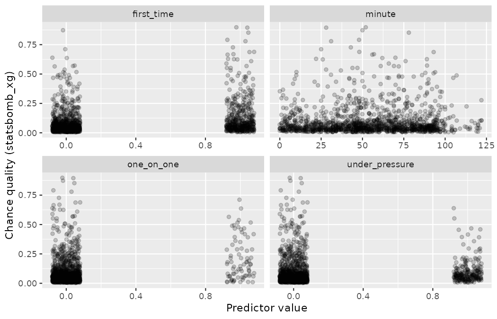
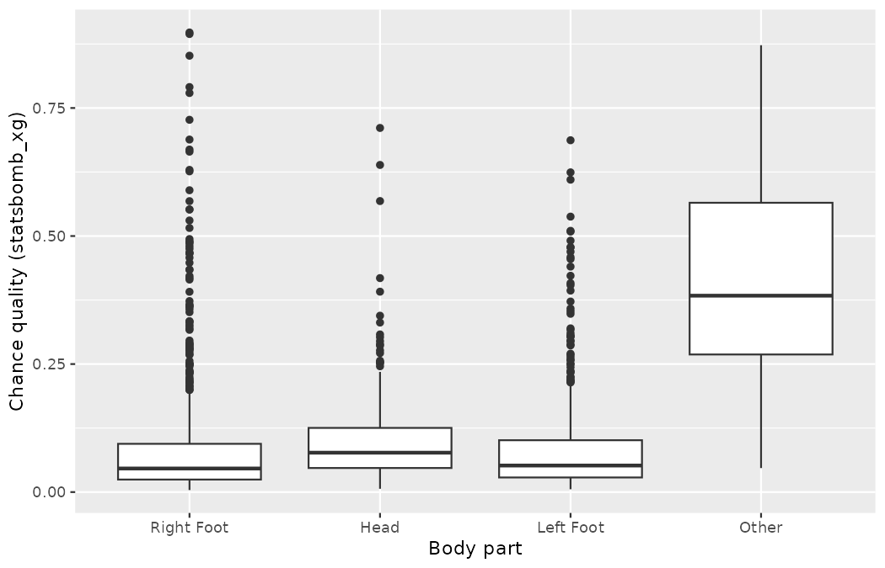
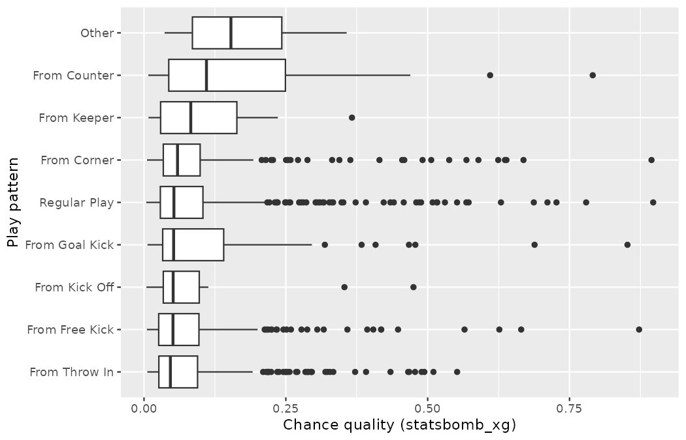
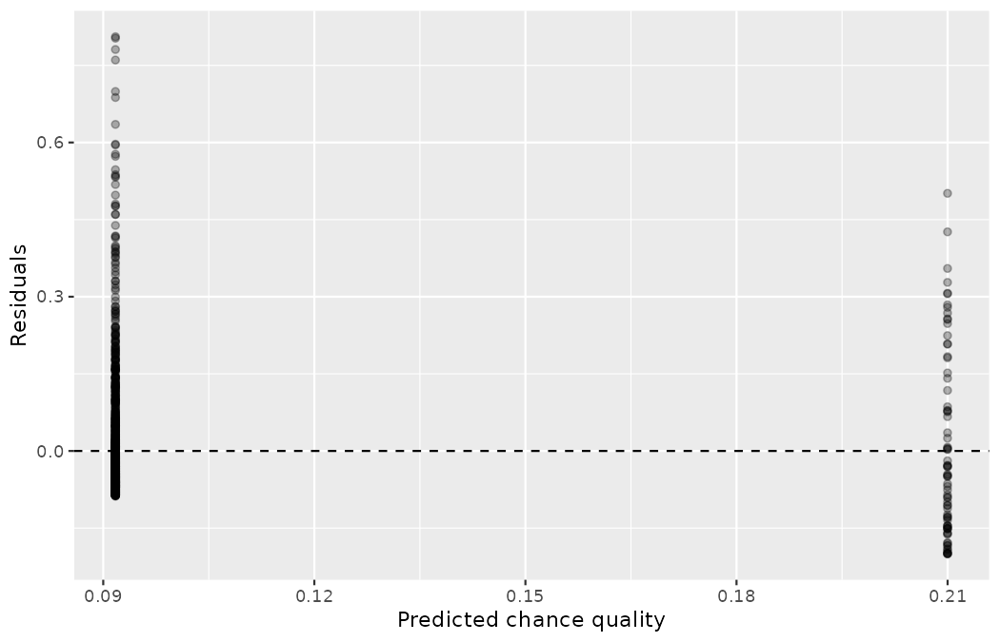
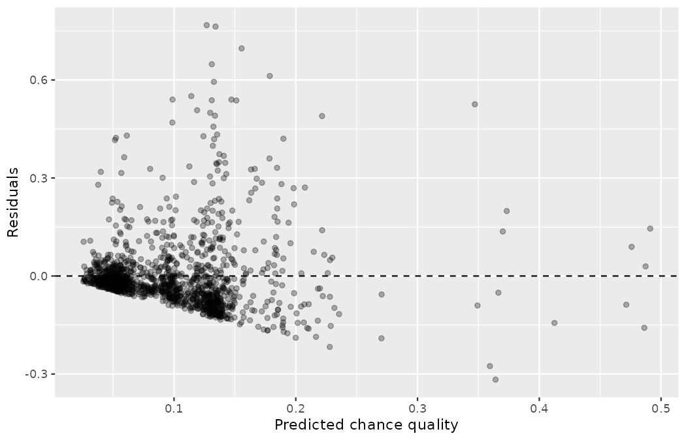

# Applications: Model {#sec-model-application}

In the last three chapters you built the modeling toolkit piece by piece: a line through a cloud of points in @sec-model-slr, many predictors at once in @sec-model-mlr, and a binary response in @sec-model-logistic.
This chapter puts the pieces together on a single, complete scouting problem — no new machinery, only the discipline of using what you have in the right order: explore, fit, simplify, diagnose, and know the limits of your model.

## Case study: What is a chance worth? {#sec-model-case-study}

Sit in on any Northbridge United video session and you will hear chances being priced.
"That's a gilt-edged opportunity," says one scout; "half a chance at best," says another.
The valuations are somewhat arbitrary — each scout weighs the angle, the defender, the touch, and their own memories of similar moments, and no two scouts weigh them identically.

In this case study we formalize the process of pricing a chance using data on real shots.
StatsBomb attaches to every shot an estimated probability that it is scored — the `statsbomb_xg` value we have called *chance quality* since @sec-data-hello — using a detailed model with access to pitch coordinates, freeze-frames of defenders, and more.
Marta Vidal's question to you, the club's analyst, is more modest: much of the footage Northbridge's regional scouts tag by hand carries no coordinates at all, only quick qualitative flags — was it a one-on-one, was it struck first time, was the shooter pressured, which body part, what phase of play, what minute.
*How much of chance quality can the club recover from tags alone?*
Answering it means building a model for `statsbomb_xg` based on a shot's tagged characteristics — reverse-engineering the pricing from the labels a scout can log in real time.

We will use the 2022 Men's World Cup shots, and we begin by scoping the data.
Dead-ball strikes are priced by the routine rather than by the situation: penalties in particular all carry nearly the same, very high value.

```r
library(dplyr)
library(readr)
library(tidyr)
library(ggplot2)
library(purrr)
library(broom)

wc2022_shots <- read_csv("data/derived/wc2022_shots.csv")

wc2022_shots |>
  count(shot_type)
#> # A tibble: 4 × 2
#>   shot_type     n
#>   <chr>     <int>
#> 1 Corner        2
#> 2 Free Kick    46
#> 3 Open Play  1382
#> 4 Penalty      64

wc2022_shots |>
  filter(shot_type == "Penalty") |>
  summarize(n = n(), mean_xg = mean(statsbomb_xg))
#> # A tibble: 1 × 2
#>       n mean_xg
#>   <int>   <dbl>
#> 1    64   0.784
```

The 64 penalties sit at a mean chance quality of 0.784 — a spike far to the right of everything else, and one that no tagging model needs to predict, since every penalty looks the same on a tag sheet.
We therefore restrict the case study to *open-play* shots, and we say so up front: the model we build describes open-play chances at the 2022 Men's World Cup, nothing more.
While we set up the data, we also fix the reference levels for the two categorical variables — recall from @sec-model-mlr that a categorical predictor enters a linear model as a set of indicator variables measured against a reference level.
We choose `Right Foot` (the most common body part, and the reference we used in @sec-model-mlr) and `Regular Play` (the ordinary run of open play).

```r
shots_op <- wc2022_shots |>
  filter(shot_type == "Open Play") |>
  mutate(
    body_part    = factor(body_part) |> relevel(ref = "Right Foot"),
    play_pattern = factor(play_pattern) |> relevel(ref = "Regular Play")
  )

nrow(shots_op)
#> [1] 1382
```

The first four shots are printed by the code below, and descriptions of each variable are shown in @tbl-shots-op-variables.

```r
shots_op |>
  select(statsbomb_xg, one_on_one, first_time, under_pressure,
         minute, body_part, play_pattern) |>
  slice_head(n = 4)
#> # A tibble: 4 × 7
#>   statsbomb_xg one_on_one first_time under_pressure minute body_part
#>          <dbl> <lgl>      <lgl>      <lgl>           <dbl> <fct>
#> 1       0.0389 FALSE      TRUE       TRUE                2 Left Foot
#> 2       0.0245 FALSE      TRUE       FALSE               3 Left Foot
#> 3       0.0616 FALSE      FALSE      FALSE               9 Left Foot
#> 4       0.279  FALSE      TRUE       FALSE              14 Right Foot
#> # ℹ 1 more variable: play_pattern <fct>
```

| variable | description |
|:---------|:------------|
| `statsbomb_xg` | Chance quality: StatsBomb's estimated probability that the shot is scored (the response) |
| `one_on_one` | Whether the shooter faced only the goalkeeper (`TRUE`/`FALSE`) |
| `first_time` | Whether the shot was struck first time, without a controlling touch |
| `under_pressure` | Whether the shooter was under defensive pressure |
| `minute` | Match minute in which the shot was taken |
| `body_part` | `Right Foot` (reference), `Left Foot`, `Head`, or `Other` |
| `play_pattern` | Phase of possession the shot arose from: `Regular Play` (reference), `From Corner`, `From Counter`, `From Free Kick`, `From Goal Kick`, `From Keeper`, `From Kick Off`, `From Throw In`, `Other` |

: Variables and their descriptions for the `shots_op` dataset (open-play shots, 2022 Men's World Cup). {#tbl-shots-op-variables}

Two housekeeping notes before we model.
First, the response is itself the output of a model: `statsbomb_xg` is StatsBomb's estimate, not a physical measurement.
That is precisely the point of the exercise — we are asking how closely a scout's tag sheet can reproduce the price that a far richer model assigns — but you should keep it in mind when interpreting residuals: a residual here is a disagreement between two models, not between a model and an observed goal.
Second, `body_part` has a small `Other` level (13 shots — chests and improvised finishes); we keep it, and we will see it demand attention later.

### Correlating with `statsbomb_xg`

As mentioned, the goal of the analysis is to build a model for chance quality.
While using multiple predictor variables is likely preferable to using only one, we start by learning about the variables themselves and their relationship to `statsbomb_xg`.
Recall from @sec-model-slr that the correlation coefficient $r$ describes the strength and direction of the *linear* relationship between two numerical variables.
A logical tag such as `one_on_one` can be coerced to a 0/1 numerical variable, so a correlation can be computed for it — this is the same indicator-variable idea from @sec-model-slr and @sec-model-mlr.

```r
shots_op |>
  summarize(
    r_one_on_one     = cor(statsbomb_xg, as.numeric(one_on_one)),
    r_first_time     = cor(statsbomb_xg, as.numeric(first_time)),
    r_under_pressure = cor(statsbomb_xg, as.numeric(under_pressure)),
    r_minute         = cor(statsbomb_xg, minute)
  )
#> # A tibble: 1 × 4
#>   r_one_on_one r_first_time r_under_pressure r_minute
#>          <dbl>        <dbl>            <dbl>    <dbl>
#> 1        0.217        0.208         -0.00801   0.0299
```

The code below draws the four relationships; each panel plots chance quality against one predictor, with the 0/1 tags jittered horizontally so the points do not overprint.

```r
shots_op |>
  mutate(across(c(one_on_one, first_time, under_pressure), as.numeric)) |>
  pivot_longer(
    cols = c(one_on_one, first_time, under_pressure, minute),
    names_to = "predictor", values_to = "value"
  ) |>
  ggplot(aes(x = value, y = statsbomb_xg)) +
  geom_jitter(width = 0.08, height = 0, alpha = 0.2) +
  facet_wrap(~ predictor, scales = "free_x") +
  labs(x = "Predictor value", y = "Chance quality (statsbomb_xg)")
```

{fig-alt="Four faceted panels of chance quality against each tag, with the 0/1 tags jittered horizontally. The TRUE band of one_on_one sits visibly higher, the first_time lift is smaller, the two under_pressure bands are essentially indistinguishable, and the minute panel is a flat cloud, all dominated by the response's right skew." width=85%}

The resulting figure is honest about how little any single tag explains.
Every panel is dominated by the same feature: chance quality is strongly right-skewed, with the great mass of shots below 0.2 and a thin scatter reaching up toward 0.9 — the same skew you learned to expect from xG in @sec-explore-numerical.
In the `one_on_one` panel the band of `TRUE` shots sits visibly higher than the `FALSE` band; in the `first_time` panel the lift is there but smaller; the two `under_pressure` bands are essentially indistinguishable; and the `minute` panel is a flat cloud with no visible trend.
The correlations agree: $r = 0.217$ for `one_on_one` and $r = 0.208$ for `first_time` are modest positive associations, while `under_pressure` $(r = -0.008)$ and `minute` $(r = 0.030)$ carry almost no linear signal at all.

::: {.callout-tip title="Check your understanding"}
No correlation value was computed for the predictor variables `body_part` and `play_pattern`.
Why not?
Can these variables still be used in the linear model?

------------------------------------------------------------------------

The correlation coefficient can only be calculated to describe the relationship between two numerical variables.
`body_part` and `play_pattern` are categorical with more than two levels, not numerical.
They *can*, however, be used in the linear model: as you saw in @sec-model-mlr, each is converted into a set of indicator variables, one for every level other than the reference level.
:::

For the two categorical predictors, group summaries and side-by-side boxplots take the place of correlations.

```r
shots_op |>
  group_by(one_on_one) |>
  summarize(shots = n(), mean_xg = mean(statsbomb_xg))
#> # A tibble: 2 × 3
#>   one_on_one shots mean_xg
#>   <lgl>      <int>   <dbl>
#> 1 FALSE       1305  0.0917
#> 2 TRUE          77  0.210

shots_op |>
  group_by(body_part) |>
  summarize(shots = n(), mean_xg = mean(statsbomb_xg))
#> # A tibble: 4 × 3
#>   body_part  shots mean_xg
#>   <fct>      <int>   <dbl>
#> 1 Right Foot   703  0.0932
#> 2 Head         252  0.106
#> 3 Left Foot    414  0.0928
#> 4 Other         13  0.412

shots_op |>
  group_by(play_pattern) |>
  summarize(shots = n(), mean_xg = mean(statsbomb_xg)) |>
  arrange(desc(mean_xg))
#> # A tibble: 9 × 3
#>   play_pattern   shots mean_xg
#>   <fct>          <int>   <dbl>
#> 1 Other              4  0.175
#> 2 From Counter      56  0.159
#> 3 From Goal Kick    80  0.120
#> 4 From Keeper       21  0.106
#> 5 From Corner      221  0.103
#> 6 Regular Play     446  0.0976
#> 7 From Kick Off     17  0.0946
#> 8 From Free Kick   239  0.0885
#> 9 From Throw In    298  0.0852
```

```r
ggplot(shots_op, aes(x = body_part, y = statsbomb_xg)) +
  geom_boxplot() +
  labs(x = "Body part", y = "Chance quality (statsbomb_xg)")

ggplot(shots_op,
       aes(x = reorder(play_pattern, statsbomb_xg, median),
           y = statsbomb_xg)) +
  geom_boxplot() +
  coord_flip() +
  labs(x = "Play pattern", y = "Chance quality (statsbomb_xg)")
```

{fig-alt="Side-by-side boxplots of chance quality by body part: the Right Foot, Left Foot, and Head boxes are low and similar with long right tails of outliers, while the tiny 13-shot Other group floats far above the rest with a median of 0.384." width=85%}

{fig-alt="Horizontal boxplots of chance quality by play pattern ordered by median, with the From Counter box sitting clearly above Regular Play and shots from throw-in and free-kick possessions carrying the lowest typical quality." width=85%}

The boxplots repay a careful look.
For `body_part`, the `Right Foot`, `Left Foot`, and `Head` boxes are low and similar (medians 0.046, 0.052, and 0.077 respectively), each trailing a long right tail of outliers — but the tiny `Other` group floats far above the rest, with a median of 0.384.
Those 13 shots are chest-and-body finishes, which by their nature happen at point-blank range; a small group with an extreme mean $(0.412)$ will earn a large coefficient, and we should remember it rests on only 13 shots.
For `play_pattern`, counter-attacks stand out — the `From Counter` box (56 shots, mean 0.159) sits clearly above `Regular Play` — which fits football sense: a counter finds defenses unset.
Shots from throw-in and free-kick possessions have the lowest typical quality, and the four-shot `Other` level is too small to read anything from.

::: {.callout-note title="Worked example"}
Among the predictors examined, which variable seems to be most informative for predicting chance quality?
Provide two reasons for your answer.

------------------------------------------------------------------------

`one_on_one` is the most informative single tag.
First, it has the largest correlation with `statsbomb_xg` $(r = 0.217,$ just ahead of `first_time` at $0.208).$
Second, it produces the largest separation in group means: one-on-one chances average 0.210 while all other shots average 0.092 — a one-on-one is priced at more than double an ordinary open-play shot.
Note that the correlation coefficient and a plot will often point to the same conclusion, but $r$ — like the means and standard deviations it is built from — is not robust: a single extreme shot can move it, and this response is heavily skewed — so it is always wise to look at the plot even when a variable is clearly the most correlated.
:::

### Modeling chance quality with `one_on_one`

A linear model was fit to predict `statsbomb_xg` from `one_on_one` alone — the simple linear regression of @sec-model-slr, with an indicator variable as the predictor.

```r
m_small <- lm(statsbomb_xg ~ one_on_one, data = shots_op)

tidy(m_small)
#> # A tibble: 2 × 5
#>   term           estimate std.error statistic   p.value
#>   <chr>             <dbl>     <dbl>     <dbl>     <dbl>
#> 1 (Intercept)      0.0917   0.00338     27.2  1.85e-130
#> 2 one_on_oneTRUE   0.118    0.0143       8.26 3.30e- 16

glance(m_small) |>
  select(adj.r.squared, df.residual) |>
  as.data.frame()
#>   adj.r.squared df.residual
#> 1    0.04645055        1380
```

::: {.callout-tip title="Check your understanding"}
Interpret the value of $b_1 = 0.118$ in the context of the problem.

------------------------------------------------------------------------

Shots tagged as one-on-ones are predicted to carry, on average, 0.118 more chance quality than shots that are not one-on-ones — a premium of nearly twelve goals per hundred shots.
:::

::: {.callout-tip title="Check your understanding"}
Using the model output above, write out the model for predicting chance quality from `one_on_one`.

------------------------------------------------------------------------

$$\widehat{\texttt{statsbomb\_xg}} = 0.0917 + 0.1183 \times \texttt{one\_on\_one}_{\texttt{TRUE}}$$

The model predicts 0.0917 for an ordinary open-play shot and $0.0917 + 0.1183 = 0.2100$ for a one-on-one.
:::

If the premium of 0.118 looks familiar but not quite identical to numbers you have met before, the difference is the frame, not an error: @sec-model-slr fit this same indicator model to all 1,494 tournament shots (85 one-on-ones, penalties included) and found 0.127, @sec-model-mlr fit it to a 1,365-shot frame that also drops the `Other`-coded shots (73 one-on-ones) and found 0.1039, and the 1,382 open-play shots here (77 one-on-ones) give 0.118.
Same phenomenon, three denominators — a one-on-one premium is always a statement about which shots it is measured against.

The residuals from the linear model can be used to assess whether a linear model is appropriate.
Recall from @sec-model-slr that the residual $e_i = y_i - \hat{y}_i$ is the vertical gap between an observed response and its fitted value.
The code below plots the residuals on the $y$-axis against the fitted (or predicted) values on the $x$-axis.

```r
augment(m_small) |>
  ggplot(aes(x = .fitted, y = .resid)) +
  geom_point(alpha = 0.3) +
  geom_hline(yintercept = 0, linetype = "dashed") +
  labs(x = "Predicted chance quality", y = "Residuals")
```

{fig-alt="A residual plot for the one_on_one model: two vertical strips of residuals at predicted values 0.092 and 0.210, cut off sharply below and straggling upward to +0.806." width=85%}

Because the only predictor is a two-level tag, the model can produce exactly two predicted values, so the plot is two vertical strips: one at 0.092 (the 1,305 ordinary shots) and one at 0.210 (the 77 one-on-ones).
Within each strip the residuals are strikingly asymmetric: they are cut off sharply below — a residual cannot fall below $-0.092$ (or $-0.210$) because chance quality cannot fall below zero — while above they straggle all the way up to $+0.806,$ the point-blank chances the tag sheet cannot see.

::: {.callout-tip title="Check your understanding"}
What aspect(s) of the residual plot indicate that a linear model is appropriate?
What aspect(s) of the residual plot seem concerning when fitting a linear model?

------------------------------------------------------------------------

There is no curvature for the model to have missed — with a single binary predictor, the model simply estimates two group means, and both strips of residuals are centered on zero.
The concerning aspects are the shape of the scatter: the residuals are strongly right-skewed, hard-bounded below (a consequence of the response being a probability, which can never be negative), and their spread is enormous relative to the two-group separation.
Large residuals indicate that most of what determines a chance's price — above all, *where on the pitch the shot is taken* — is not in this model.
These violations matter more once we do formal inference on regression models; the conditions are treated carefully in @sec-inf-model-slr.
:::

### Modeling chance quality with multiple variables

It seems as though the predictions of chance quality might be more accurate if more than one predictor variable were used.
The code below fits a linear model of `statsbomb_xg` regressed on all six tags: `one_on_one`, `first_time`, `under_pressure`, `minute`, `body_part`, and `play_pattern`.

```r
m_full <- lm(statsbomb_xg ~ one_on_one + first_time + under_pressure +
               minute + body_part + play_pattern, data = shots_op)

tidy(m_full) |> print(n = 16)
#> # A tibble: 16 × 5
#>    term                        estimate std.error statistic  p.value
#>    <chr>                          <dbl>     <dbl>     <dbl>    <dbl>
#>  1 (Intercept)                 0.0457    0.00902      5.07  4.59e- 7
#>  2 one_on_oneTRUE              0.125     0.0137       9.14  2.14e-19
#>  3 first_timeTRUE              0.0810    0.00699     11.6   1.19e-29
#>  4 under_pressureTRUE         -0.00323   0.00898     -0.360 7.19e- 1
#>  5 minute                      0.000145  0.000107     1.36  1.74e- 1
#>  6 body_partHead               0.0483    0.0101       4.80  1.72e- 6
#>  7 body_partLeft Foot          0.00718   0.00704      1.02  3.08e- 1
#>  8 body_partOther              0.315     0.0320       9.84  4.00e-22
#>  9 play_patternFrom Corner    -0.00365   0.00982     -0.372 7.10e- 1
#> 10 play_patternFrom Counter    0.0453    0.0161       2.82  4.93e- 3
#> 11 play_patternFrom Free Kick -0.0205    0.00916     -2.24  2.50e- 2
#> 12 play_patternFrom Goal Kick  0.0180    0.0138       1.31  1.92e- 1
#> 13 play_patternFrom Keeper    0.0123    0.0253       0.488 6.25e- 1
#> 14 play_patternFrom Kick Off  -0.00355   0.0280      -0.127 8.99e- 1
#> 15 play_patternFrom Throw In  -0.00917   0.00848     -1.08  2.80e- 1
#> 16 play_patternOther           0.0608    0.0569       1.07  2.85e- 1

glance(m_full) |>
  select(adj.r.squared, df.residual) |>
  as.data.frame()
#>   adj.r.squared df.residual
#> 1     0.1821507        1366
```

::: {.callout-note title="Worked example"}
Using the output above, write out the linear model of chance quality on the six predictor variables.

------------------------------------------------------------------------

$$
\begin{aligned}
\widehat{\texttt{statsbomb\_xg}} = 0.0457 &+ 0.1253 \times \texttt{one\_on\_one}_{\texttt{TRUE}} \\
&+ 0.0810 \times \texttt{first\_time}_{\texttt{TRUE}} \\
&- 0.0032 \times \texttt{under\_pressure}_{\texttt{TRUE}} \\
&+ 0.000145 \times \texttt{minute} \\
&+ 0.0483 \times \texttt{body\_part}_{\texttt{Head}} \\
&+ 0.0072 \times \texttt{body\_part}_{\texttt{Left Foot}} \\
&+ 0.3149 \times \texttt{body\_part}_{\texttt{Other}} \\
&- 0.0037 \times \texttt{play\_pattern}_{\texttt{From Corner}} \\
&+ 0.0453 \times \texttt{play\_pattern}_{\texttt{From Counter}} \\
&- 0.0205 \times \texttt{play\_pattern}_{\texttt{From Free Kick}} \\
&+ 0.0180 \times \texttt{play\_pattern}_{\texttt{From Goal Kick}} \\
&+ 0.0123 \times \texttt{play\_pattern}_{\texttt{From Keeper}} \\
&- 0.0036 \times \texttt{play\_pattern}_{\texttt{From Kick Off}} \\
&- 0.0092 \times \texttt{play\_pattern}_{\texttt{From Throw In}} \\
&+ 0.0608 \times \texttt{play\_pattern}_{\texttt{Other}}
\end{aligned}
$$

Each indicator takes the value 1 when the shot has that tag or level and 0 otherwise; a right-footed, untagged shot from regular play is priced by the intercept plus the minute term alone.
:::

::: {.callout-tip title="Check your understanding"}
The value of the estimated coefficient on $\texttt{body\_part}_{\texttt{Head}}$ is $b_5 = 0.0483.$
Interpret the value of $b_5$ in the context of the problem.

------------------------------------------------------------------------

The coefficient indicates that if all the other variables are kept constant, headers are priced 0.0483 higher in chance quality, on average, than right-footed shots (the reference level).
This may surprise you — recall from @sec-data-design that headers are *converted* at a lower rate than footed shots.
Both are true: headers arise almost exclusively from crosses and set-piece deliveries close to goal, so *given the same play pattern and tags*, a header tends to come from a higher-value position, even though heading is the harder finishing skill.
Holding other variables constant can reverse the sign of a raw comparison; that is exactly why the phrase "holding all else constant" must accompany every multiple regression coefficient.
:::

Emil Sørensen suggests that maybe you do not need all six tags to have a good model for chance quality.
His interest is not statistical elegance: every tag is a few seconds of a regional scout's matchday attention, multiplied across thousands of shots a season, and a tag that adds nothing to the model is a cost with no return.
You consider taking a variable out, but you aren't sure which one to remove.

::: {.callout-note title="Worked example"}
Results corresponding to the full model for the chance-quality data are shown in the regression output above.
How should we proceed under the backward elimination strategy?

------------------------------------------------------------------------

Recall from @sec-model-mlr that backward elimination judges each candidate model by its adjusted $R^2$ — the version of $R^2$ that charges a penalty for every predictor, so that a variable must earn its place.
Our baseline adjusted $R^2$ from the full model is $0.1822,$ and we need to determine whether dropping a predictor will improve the adjusted $R^2.$
To check, we fit six models that each drop a different predictor, and we record the adjusted $R^2$ of each:

```r
drop_one_adj_r_sq <- function(model, term) {
  update(model, paste(". ~ . -", term), data = shots_op) |>
    glance() |>
    pull(adj.r.squared) |>
    round(4)
}

tibble(dropped = c("one_on_one", "first_time", "under_pressure",
                   "minute", "body_part", "play_pattern")) |>
  mutate(adj_r_sq = map_dbl(dropped, \(term) drop_one_adj_r_sq(m_full, term))) |>
  as.data.frame()
#>          dropped adj_r_sq
#> 1     one_on_one   0.1327
#> 2     first_time   0.1025
#> 3 under_pressure   0.1827
#> 4         minute   0.1816
#> 5      body_part   0.1169
#> 6   play_pattern   0.1743
```

The model without `under_pressure` has the highest adjusted $R^2$ of $0.1827,$ higher than the adjusted $R^2$ for the full model.
Because eliminating `under_pressure` leads to a model with a higher adjusted $R^2$ than the full model, we drop `under_pressure` from the model.

It might seem counter-intuitive to exclude the pressure tag from a model of chance quality.
After all, pressure is the tag Emil's scouts argue about most, and you saw in @sec-explore-categorical that shots taken under pressure are converted at a visibly lower rate than unpressured shots.
However, note that the response here is *chance quality*, not conversion — and within open play, the pressure tag barely moves StatsBomb's price at all:

```r
shots_op |>
  group_by(under_pressure) |>
  summarize(shots = n(), mean_xg = mean(statsbomb_xg))
#> # A tibble: 2 × 3
#>   under_pressure shots mean_xg
#>   <lgl>          <int>   <dbl>
#> 1 FALSE           1144  0.0988
#> 2 TRUE             238  0.0961
```

A gap of $0.0988 - 0.0961 = 0.0027$ is next to nothing — which is exactly what the near-zero correlation $(r = -0.008)$ told us at the start of the case study, and what the tiny, wrong-signed, imprecisely estimated coefficient $(-0.0032)$ repeated inside the full model.
The much larger tournament-wide pressure gap in mean chance quality is largely an artifact of the shots we excluded: penalties, which are never taken under pressure and carry a chance quality of $0.784,$ sit entirely in the unpressured group and drag its average up.
Restrict attention to open play, hold the other tags fixed, and the pressure tag has nothing left to say about StatsBomb's price.
Whether pressure affects what happens *to* the chance — whether it is scored — is a different question, about a different response variable, and it must wait for the inference tools of @sec-foundations-randomization.

Since we eliminated a predictor from the model in the first step, we see whether we should eliminate any additional predictors.
Our baseline adjusted $R^2$ is now $0.1827.$
We fit another set of models, which consider eliminating each of the remaining predictors in addition to `under_pressure`:

```r
m_no_pressure <- lm(statsbomb_xg ~ one_on_one + first_time + minute +
                      body_part + play_pattern, data = shots_op)

tibble(dropped = c("one_on_one", "first_time", "minute",
                   "body_part", "play_pattern")) |>
  mutate(adj_r_sq = map_dbl(dropped, \(term) drop_one_adj_r_sq(m_no_pressure, term))) |>
  as.data.frame()
#>        dropped adj_r_sq
#> 1   one_on_one   0.1330
#> 2   first_time   0.1028
#> 3       minute   0.1822
#> 4    body_part   0.1167
#> 5 play_pattern   0.1749
```

None of these models leads to an improvement in adjusted $R^2,$ so we do not eliminate any of the remaining predictors.
Notice the near-miss, though: dropping `minute` gives $0.1822,$ a mere $0.0005$ below the baseline.
The adjusted $R^2$ penalty almost — but not quite — pays for removing it, so backward elimination keeps a predictor whose coefficient $(0.000145$ per minute$)$ is tiny.
A different selection criterion could reasonably have dropped it; model selection is a strategy, not an oracle.
:::

That is, after backward elimination, we are left with the model that keeps all predictors except `under_pressure`, which we can summarize using its coefficients:

```r
tidy(m_no_pressure) |> print(n = 15)
#> # A tibble: 15 × 5
#>    term                        estimate std.error statistic  p.value
#>    <chr>                          <dbl>     <dbl>     <dbl>    <dbl>
#>  1 (Intercept)                 0.0454    0.00898      5.06  4.85e- 7
#>  2 one_on_oneTRUE              0.126     0.0137       9.17  1.68e-19
#>  3 first_timeTRUE              0.0811    0.00699     11.6   8.82e-30
#>  4 minute                      0.000145  0.000107     1.36  1.75e- 1
#>  5 body_partHead               0.0470    0.00934      5.03  5.51e- 7
#>  6 body_partLeft Foot          0.00711   0.00704      1.01  3.12e- 1
#>  7 body_partOther              0.315     0.0320       9.85  3.83e-22
#>  8 play_patternFrom Corner    -0.00378   0.00981     -0.385 7.00e- 1
#>  9 play_patternFrom Counter    0.0452    0.0161       2.81  5.07e- 3
#> 10 play_patternFrom Free Kick -0.0205    0.00915     -2.24  2.53e- 2
#> 11 play_patternFrom Goal Kick  0.0177    0.0138       1.28  2.00e- 1
#> 12 play_patternFrom Keeper     0.0121    0.0253       0.478 6.33e- 1
#> 13 play_patternFrom Kick Off  -0.00360   0.0280      -0.129 8.98e- 1
#> 14 play_patternFrom Throw In  -0.00918   0.00848     -1.08  2.79e- 1
#> 15 play_patternOther           0.0610    0.0568       1.07  2.83e- 1

glance(m_no_pressure) |>
  select(adj.r.squared, df.residual) |>
  as.data.frame()
#>   adj.r.squared df.residual
#> 1     0.1826715        1367
```

Then, the linear model for predicting chance quality based on this model is as follows:

$$
\begin{aligned}
\widehat{\texttt{statsbomb\_xg}} = 0.0454 &+ 0.1256 \times \texttt{one\_on\_one}_{\texttt{TRUE}} \\
&+ 0.0811 \times \texttt{first\_time}_{\texttt{TRUE}} \\
&+ 0.000145 \times \texttt{minute} \\
&+ 0.0470 \times \texttt{body\_part}_{\texttt{Head}} \\
&+ 0.0071 \times \texttt{body\_part}_{\texttt{Left Foot}} \\
&+ 0.3149 \times \texttt{body\_part}_{\texttt{Other}} \\
&- 0.0038 \times \texttt{play\_pattern}_{\texttt{From Corner}} \\
&+ 0.0452 \times \texttt{play\_pattern}_{\texttt{From Counter}} \\
&- 0.0205 \times \texttt{play\_pattern}_{\texttt{From Free Kick}} \\
&+ 0.0177 \times \texttt{play\_pattern}_{\texttt{From Goal Kick}} \\
&+ 0.0121 \times \texttt{play\_pattern}_{\texttt{From Keeper}} \\
&- 0.0036 \times \texttt{play\_pattern}_{\texttt{From Kick Off}} \\
&- 0.0092 \times \texttt{play\_pattern}_{\texttt{From Throw In}} \\
&+ 0.0610 \times \texttt{play\_pattern}_{\texttt{Other}}
\end{aligned}
$$

An adjusted $R^2$ of $0.1827$ deserves a sober sentence in any report to Marta Vidal: the six-second tag sheet recovers under a fifth of the variability in StatsBomb's prices.
The tags are real information — a scout logging them is doing useful work — but most of what prices a chance is *where it is taken from*, and no arrangement of these labels can substitute for coordinates.

::: {.callout-note title="Worked example"}
The residual plot for the model with all of the predictor variables except `under_pressure` is drawn by the code below.
How do these residuals compare to the residuals from the model with `one_on_one` alone?

```r
augment(m_no_pressure) |>
  ggplot(aes(x = .fitted, y = .resid)) +
  geom_point(alpha = 0.3) +
  geom_hline(yintercept = 0, linetype = "dashed") +
  labs(x = "Predicted chance quality", y = "Residuals")

augment(m_no_pressure) |>
  summarize(
    min_resid = min(.resid),
    max_resid = max(.resid),
    n_beyond_0.3 = sum(abs(.resid) > 0.3)
  )
#> # A tibble: 1 × 3
#>   min_resid max_resid n_beyond_0.3
#>       <dbl>     <dbl>        <int>
#> 1    -0.317     0.768           46
```

{fig-alt="The residual plot for the model without under_pressure: fitted values spread from about 0.03 to 0.49 in a proper cloud around the dashed zero line, bounded below by a diagonal floor and straggling far higher on the positive side, to a maximum residual of +0.768." width=85%}

------------------------------------------------------------------------

The two vertical strips are gone: with fourteen estimated coefficients and `minute` varying continuously, the fitted values now spread across a range from about $0.03$ to $0.49,$ and the plot looks like a proper residual cloud.
The residuals are, for the most part, scattered around 0.
However, the same pathologies as before persist in milder form.
The cloud is bounded below by a diagonal floor — since chance quality cannot be negative, no residual can fall below $-\hat{y}_i,$ so the lower edge of the plot slopes down exactly along that line — while the upper side straggles far higher, to a maximum residual of $+0.768.$
That most extreme point is Jean-Charles Castelletto's 28th-minute goal for Cameroon against Serbia: a first-time, right-footed finish from a corner that StatsBomb prices at $0.894$ but the tag sheet, blind to the fact that he met the ball a few metres from an open net, prices at $0.127.$
Forty-six shots have residuals beyond $\pm 0.3,$ and forty-five of those forty-six are on the positive side: the model's worst errors are almost all *underpricing* of point-blank chances.
The skew and the floor are structural — a probability response squeezed near zero will violate the usual linear-model conditions — and they foreshadow both the formal residual conditions of @sec-inf-model-slr and the logistic machinery of @sec-model-logistic, which was built for exactly this kind of response.
:::

::: {.callout-tip title="Check your understanding"}
Consider a shot tagged by a Northbridge scout as follows: 70th minute, a first-time header from a corner, not a one-on-one.
What is the predicted chance quality of the shot?

------------------------------------------------------------------------

$$
\widehat{\texttt{statsbomb\_xg}} = 0.0454 + 0.0811 + 0.000145 \times 70 + 0.0470 - 0.0038 = 0.1799
$$

Only the indicators the shot activates appear: `first_time` $(+0.0811),$ the minute term $(0.000145 \times 70 = 0.0102),$ `Head` $(+0.0470),$ and `From Corner` $(-0.0038).$
A chance quality of about $0.18$ — a shade under one goal in five such chances.
:::

### The scope of a model

A partner analyst emails Priya Rao a tag sheet for a single shot, with no footage attached: 62nd minute, right-footed, struck first time, not a one-on-one, from regular play.

::: {.callout-tip title="Check your understanding"}
What is the predicted chance quality of this shot?

------------------------------------------------------------------------

Only `first_time` and the minute term activate:

$$
\widehat{\texttt{statsbomb\_xg}} = 0.0454 + 0.0811 + 0.000145 \times 62 = 0.1355
$$

An ordinary, slightly-better-than-baseline chance — nothing a sporting director would leave her office for.
:::

::: {.callout-tip title="Check your understanding"}
If you later learned that StatsBomb prices this shot at $0.725,$ would you think the model was terrible?
What if you then learned that the shot was Grace Geyoro's goal for France against Wales — at the 2025 Women's Euro?

------------------------------------------------------------------------

A residual of $0.725 - 0.1355 = 0.590$ is really big.
Note that the large residuals (except one shot) in the residual plot above are closer to $0.3$ — about half as big.
But after we learn that the shot is from the 2025 Women's Euro, we realize that the model shouldn't have been applied to the new shot at all!
The original data are from open-play shots at the 2022 Men's World Cup, and models based on those data should be used only to explore patterns in chance quality for open-play shots at that tournament.
A different competition — different players, different tournament, a different season of StatsBomb's own pricing model — is outside the model's scope, and the model itself contains no warning light for this: `predict()` will cheerfully return $0.1355$ for any tag sheet you feed it.
Whether a model fit on one competition happens to transfer to another is an empirical question, one we take up properly when external validation appears in @sec-inf-model-mlr.
:::

The shot in question is real, and you can locate it — and quantify the miss — directly:

```r
weuro2025_shots <- read_csv("data/derived/weuro2025_shots.csv")

mystery_shot <- weuro2025_shots |>
  filter(shot_type == "Open Play") |>
  slice_max(statsbomb_xg, n = 1)

mystery_shot |>
  select(competition, player, team, opponent, statsbomb_xg, outcome)
#> # A tibble: 1 × 6
#>   competition player             team           opponent statsbomb_xg outcome
#>   <chr>       <chr>              <chr>          <chr>           <dbl> <chr>
#> 1 weuro2025   Onema Grace Geyoro France Women's Wales W         0.725 Goal

mystery_shot |>
  mutate(
    predicted = predict(m_no_pressure, newdata = mystery_shot),
    residual  = statsbomb_xg - predicted
  ) |>
  select(statsbomb_xg, predicted, residual)
#> # A tibble: 1 × 3
#>   statsbomb_xg predicted residual
#>          <dbl>     <dbl>    <dbl>
#> 1        0.725     0.136    0.590
```

It is the highest-priced open-play chance of the entire Women's Euro, and on the tag sheet it is indistinguishable from a hopeful hit from distance.
Hold on to both lessons at once: even *within* scope, this model's tags cannot see the pitch, and its honest residual spread says so; *outside* scope, we do not even have the residual plot's testimony about how wrong we might be.
The case study's deliverable to Marta is therefore not just a model but a label on the tin: *open-play chances, 2022 Men's World Cup, tags only — expect large underpricing of point-blank chances, and do not apply elsewhere without validation.*

### Coda: from pricing the chance to predicting the goal

One tool from the three-chapter toolkit has not yet touched the case study: the logistic regression of @sec-model-logistic.
Marta's question was about pricing the chance, and chance quality is numerical — linear regression territory.
But the outcome the club ultimately banks is binary: did the shot go in?
One fit closes the loop, using the three logical tags on the same open-play frame:

```r
goal_op <- glm(goal ~ one_on_one + under_pressure + first_time,
               data = shots_op, family = binomial)
tidy(goal_op)
#> # A tibble: 4 × 5
#>   term               estimate std.error statistic  p.value
#>   <chr>                 <dbl>     <dbl>     <dbl>    <dbl>
#> 1 (Intercept)         -2.55       0.144   -17.7   6.70e-70
#> 2 one_on_oneTRUE       1.27       0.305     4.16  3.16e- 5
#> 3 under_pressureTRUE   0.0957     0.243     0.395 6.93e- 1
#> 4 first_timeTRUE       0.819      0.188     4.35  1.36e- 5

round(coef(goal_op), 4)
#>        (Intercept)     one_on_oneTRUE under_pressureTRUE     first_timeTRUE
#>            -2.5479             1.2703             0.0957             0.8189
```

Back-transform the coefficient a scout would ask about first.
An open-play shot with none of the tags has log odds equal to the intercept, so $\hat{p} = e^{-2.5479}/(1 + e^{-2.5479}) = 0.0726$; flipping only the one-on-one tag moves the log odds to $-2.5479 + 1.2703 = -1.2776$ and the probability to $0.218$ — close to the raw open-play conversion rates of $0.102$ for ordinary shots and $0.221$ for one-on-ones.
And carry over @sec-model-logistic's warning intact: the dossier audit earned causal language because Priya randomized every cue, while nobody randomized which shooters were left one-on-one or closed down, so these coefficients describe association in one tournament's open play and nothing more.
Note, in the same spirit, that the pressure tag's estimate is small, positive, and dwarfed by its standard error — pressure said nothing about the *price* of an open-play chance earlier in this chapter, and it adds no signal about the outcome here; the machinery for judging such coefficients formally begins in @sec-foundations-randomization.

## Interactive R tutorials {#sec-model-tutorials}

Navigate the concepts you've learned in this part in R using the following self-paced tutorials.
All you need is your browser to get started!
The tutorials were built by the authors of *Introduction to Modern Statistics* around their own datasets, so you will find houses and possums where this book has shots and scouts — treat that as translation practice: for every screen, ask yourself which variable plays the role of `statsbomb_xg` and which plays the role of the tags.

- [Tutorial 3: Regression modeling](https://openintrostat.github.io/ims-tutorials/03-model/)
- [Tutorial 3 - Lesson 1: Visualizing two variables](https://openintro.shinyapps.io/ims-03-model-01/)
- [Tutorial 3 - Lesson 2: Correlation](https://openintro.shinyapps.io/ims-03-model-02/)
- [Tutorial 3 - Lesson 3: Simple linear regression](https://openintro.shinyapps.io/ims-03-model-03/)
- [Tutorial 3 - Lesson 4: Interpreting regression models](https://openintro.shinyapps.io/ims-03-model-04/)
- [Tutorial 3 - Lesson 5: Model fit](https://openintro.shinyapps.io/ims-03-model-05/)
- [Tutorial 3 - Lesson 6: Parallel slopes](https://openintro.shinyapps.io/ims-03-model-06/)
- [Tutorial 3 - Lesson 7: Evaluating and extending parallel slopes model](https://openintro.shinyapps.io/ims-03-model-07/)
- [Tutorial 3 - Lesson 8: Multiple regression](https://openintro.shinyapps.io/ims-03-model-08/)
- [Tutorial 3 - Lesson 9: Logistic regression](https://openintro.shinyapps.io/ims-03-model-09/)
- [Tutorial 3 - Lesson 10: Case study: Italian restaurants in NYC](https://openintro.shinyapps.io/ims-03-model-10/)

You can also access the full list of tutorials supporting both the original book and this adaptation at <https://openintrostat.github.io/ims-tutorials>.

## R labs {#sec-model-labs}

Further apply the concepts you've learned in this part in R with computational labs that walk you through a data analysis case study.

- [Introduction to linear regression - Human Freedom Index](https://www.openintro.org/go?id=ims-r-lab-model)

You can also access the full list of labs at <https://www.openintro.org/go?id=ims-r-labs>.
A worthwhile club-flavored variant: repeat this chapter's entire workflow — per-predictor EDA, simple model, full model, backward elimination, residual plot, scoped prediction — on `weuro2025_shots`, and compare which predictors survive elimination in the two competitions before you peek at each other's results.
*What you should find:* on the 851 open-play shots of the Women's Euro, backward elimination again removes exactly one predictor, but a different one — `minute` drops (adjusted $R^2$ rises from $0.1038$ to $0.1047$), while `under_pressure`, the tag eliminated at the men's World Cup, survives.

## Chapter review {#sec-chp10-review}

### Summary

This chapter introduced no new machinery; it rehearsed the discipline of using the modeling toolkit end to end on one scouting question.
The order of operations is the content:

-   **Scope the data before touching a model.** We removed penalties and dead-ball strikes *and said so*, fixing the population the model describes: open-play shots at the 2022 Men's World Cup. We also fixed the reference levels (`Right Foot`, `Regular Play`) so every later coefficient had a stated baseline.
-   **Explore each predictor's relationship with the response.** Correlations for numerical (and 0/1) predictors, group means and boxplots for categorical ones. This stage produced the case study's early warnings: the near-zero pressure correlation, and the 13-shot `Other` body-part group with an extreme mean.
-   **Fit simple, then fit full.** The single best tag (`one_on_one`) explained under 5% of the variability (adjusted $R^2 = 0.0465$); all six tags together reached $0.1822.$
-   **Simplify with a stated criterion.** Backward elimination by adjusted $R^2$ removed exactly one predictor — `under_pressure` — and the elimination was not a verdict on pressure in football, but on what the tag adds *for this response, given the other tags*. A criterion, honestly applied, can also have near-misses (`minute` survived by $0.0005$).
-   **Read the residuals.** The residual plot showed a floor (a probability response cannot produce residuals below $-\hat{y}_i$), a heavy right tail of underpriced point-blank chances, and one extreme outlier — the shape that motivates the model conditions of @sec-inf-model-slr and the logistic models of @sec-model-logistic.
-   **State the model's scope with its predictions.** The Geyoro shot showed how silently a model misprices data from outside the population it was fit on. A prediction should travel with the model's residual behavior and its scope, or it should not travel at all.

### Terms

No new terms were introduced in this chapter.
The terms below did the case study's work; all were introduced and defined in @sec-model-slr through @sec-model-logistic, and you should be able to recognize each one in the workflow above.
If any feel unfamiliar, go back and review their definitions in those chapters.

|  |  |  |
|:-----------------------|:-----------------------|:----------------------|
| adjusted $R^2$ | indicator variable | reference level |
| backward elimination | multiple regression | residual |
| correlation coefficient | prediction | simple linear regression |

: Terms revisited in this chapter. {#tbl-terms-chp-10}

------------------------------------------------------------------------

Adapted from *Introduction to Modern Statistics* by Çetinkaya-Rundel & Hardin (CC BY-SA 4.0); this adaptation is likewise CC BY-SA 4.0. Match data: StatsBomb open data.
