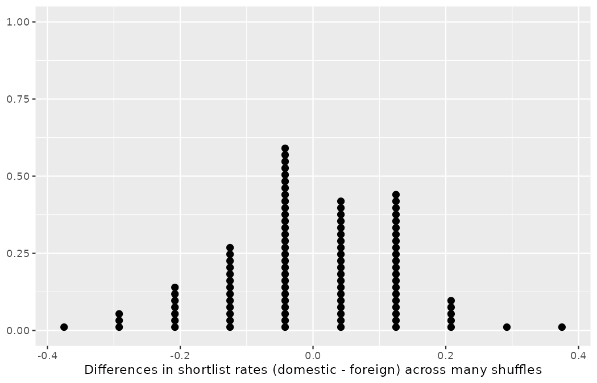
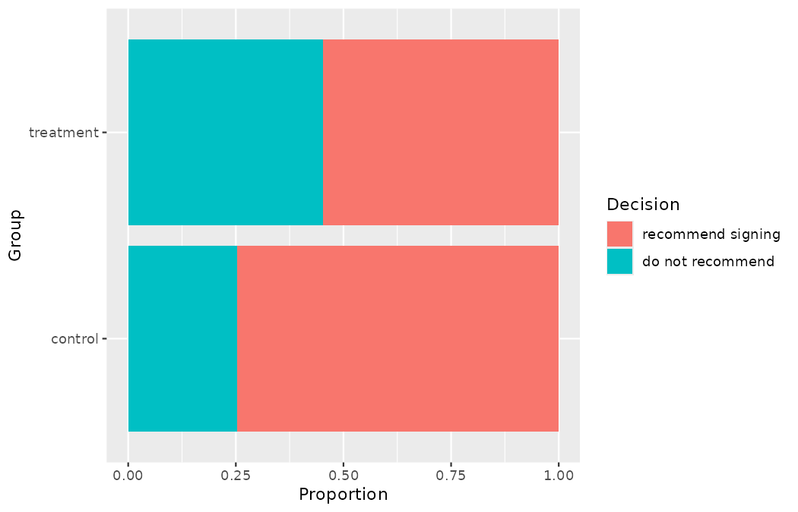
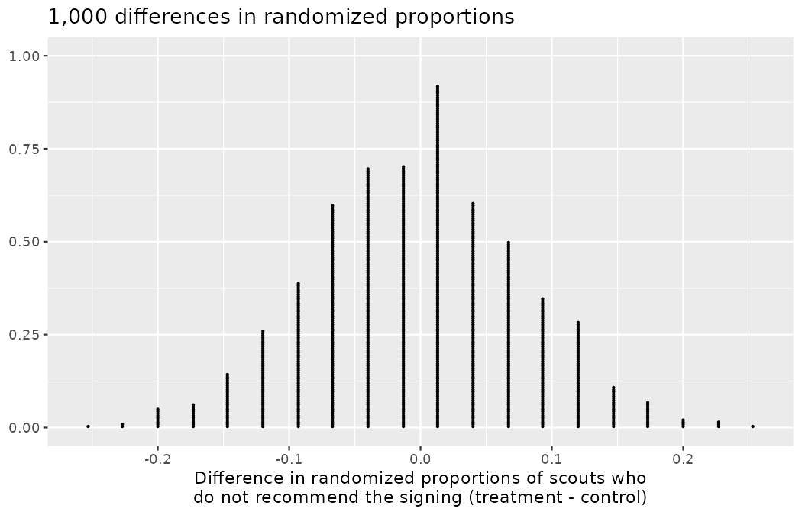
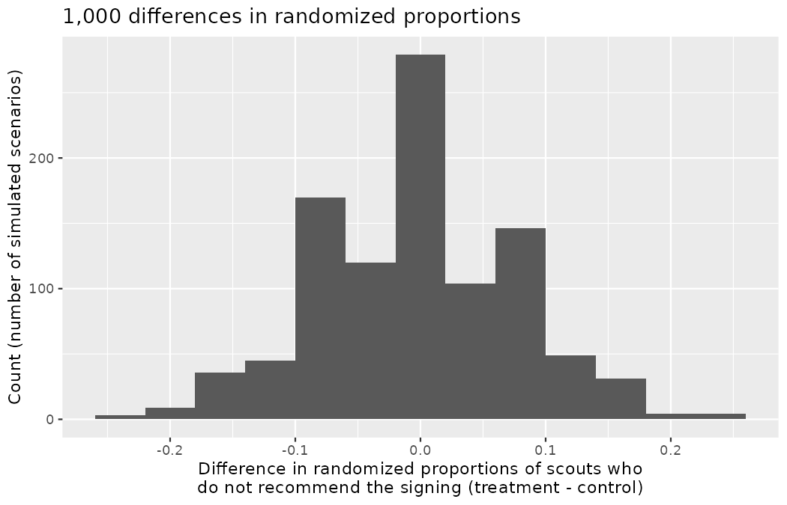

# Hypothesis testing with randomization {#sec-foundations-randomization}

::: {.chapterintro}
Statistical inference is primarily concerned with understanding and quantifying the uncertainty of parameter estimates.
While the equations and details change depending on the setting, the foundations for inference are the same throughout all of statistics.

We start with two case studies designed to motivate the process of making decisions about research claims — both of them decisions Northbridge United had to make about its own scouting operation.
We formalize the process through the introduction of the **hypothesis testing framework**, which allows us to formally evaluate claims about the population.
:::

Throughout the book so far, you have worked with match data in a variety of contexts.
You have learned how to summarize and visualize shot data as well as how to model several variables at the same time.
Sometimes the dataset at hand represents the entire research question: if Marta Vidal asks how Northbridge's own academy intake performed last season, the intake *is* the population, and arithmetic answers her.
But more often than not, the data have been collected to answer a research question about a larger group of which the data are a (hopefully) representative subset: the matches a scout actually saw stand in for a player's whole season; one tournament stands in for how the sport behaves.

You may agree that there is almost always variability in data — one dataset will not be identical to a second dataset even if they are both collected from the same population using the same methods.
Send two scouts to watch the same league for a month and their shot logs will differ.
However, quantifying the variability in the data is neither obvious nor easy to do; answering the question "*how* different is one dataset from another?" is not trivial.

First, a note on notation, because we will now need to be careful about the distinction between a population quantity and its estimate from a sample.
We generally use $p$ to denote a population proportion and $\hat{p}$ to denote a sample proportion.
Recall from @sec-explore-numerical that we use $\mu$ to denote a population mean and $\bar{x}$ to denote a sample mean, and recall from @sec-model-logistic that a "hat" placed over a symbol always means *an estimate computed from data* of the unadorned quantity beneath it.
So read $\hat{p}$ ("p-hat") as: the letter $p$ names a proportion, and the hat says this particular proportion was computed from a sample rather than known for the whole population.
One further piece of notation is new in this chapter: we will attach *group labels* as subscripts.
When you see $\hat{p}_{prs}$, decompose it as: $p$ — a proportion; the hat — estimated from a sample; the subscript $prs$ — computed within the group of shots taken under pressure.
The subscript names *which* group's sample proportion we mean, nothing more.

::: {.callout-note title="Worked example"}
Suppose we split the 913 shots of the 2025 Women's Euro into two groups by something plainly irrelevant: shots taken in an odd-numbered minute and shots taken in an even-numbered minute.
Let $\hat{p}_{odd}$ be the proportion of odd-minute shots struck first time, and $\hat{p}_{even}$ the proportion of even-minute shots struck first time.
Would you be surprised if $\hat{p}_{odd}$ did not *exactly* equal $\hat{p}_{even}$?

------------------------------------------------------------------------

While the proportions $\hat{p}_{odd}$ and $\hat{p}_{even}$ would probably be close to each other, it would be unusual for them to be exactly the same.
We would probably observe a small difference due to *chance*.
The data bear this out:

```r
library(dplyr)
library(tidyr)
library(readr)
library(ggplot2)
library(infer)

weuro2025_shots <- read_csv("data/derived/weuro2025_shots.csv")

weuro2025_shots |>
  mutate(minute_parity = if_else(minute %% 2 == 1, "odd", "even")) |>
  group_by(minute_parity) |>
  summarize(
    shots = n(),
    first_time_shots = sum(first_time),
    p_first_time = mean(first_time)
  )
#> # A tibble: 2 × 4
#>   minute_parity shots first_time_shots p_first_time
#>   <chr>         <int>            <int>        <dbl>
#> 1 even            467              150        0.321
#> 2 odd             446              158        0.354
```

Here $\hat{p}_{odd} = 158/446 = 0.354$ and $\hat{p}_{even} = 150/467 = 0.321$.
The minute parity cannot possibly *cause* a first-time finish, yet the two sample proportions differ by about three percentage points.
That gap is pure chance variation, and it is exactly the kind of gap we must learn to calibrate against.
:::

::: {.callout-tip title="Check your understanding"}
If we do not think the parity of the minute is related to whether a shot is struck first time, what assumption are we making about the relationship between these two variables?

------------------------------------------------------------------------

We are assuming that these two variables are **independent**: knowing the value of one gives no information about the value of the other.
:::

Studying randomness of this form is a key focus of statistics.
Throughout this chapter, and those that follow, we provide three different approaches for quantifying the variability inherent in data: randomization, bootstrapping, and mathematical models.
Using the methods provided in this chapter, we will be able to draw conclusions beyond the dataset at hand — to the tournament a sample of shots came from, or to the decisions a scouting network would make in general.

The first type of variability we will explore comes from experiments where the explanatory variable (or treatment) is randomly assigned to the observational units.
As you learned in @sec-data-hello, a randomized experiment can be used to assess whether one variable (the explanatory variable) causes changes in a second variable (the response variable).
Every dataset has some variability in it, so to decide whether the variability in the data is due to (1) the causal mechanism (the randomized explanatory variable in the experiment) or instead (2) natural variability inherent to the data, we set up a *sham* randomized experiment as a comparison.
That is, we assume that each observational unit would have gotten the exact same response value regardless of the treatment level.
By reassigning the treatments many, many times, we can compare the actual experiment to the sham experiments.
If the actual experiment has more extreme results than nearly all of the sham experiments, we are led to believe that it is the explanatory variable which is causing the result and not just variability inherent to the data.
Using a few different case studies, let's look more carefully at this idea of a **randomization test**.

## Nationality bias case study {#sec-caseStudySexDiscrimination}

We consider a study Priya Rao, Northbridge United's lead data analyst, designed to answer an uncomfortable question Marta Vidal put to the scouting department: "Are prospects listed as foreign discriminated against in our own shortlist recommendations?"
The commission traces directly back to the platform-triage audit of @sec-model-logistic: that study caught the club's triage desk treating identically documented dossiers differently by nationality label, and it left open whether the live network of scouts — the people whose judgement feeds the desk — carries the same bias.
Emil Sørensen, the head of scouting, runs a network of 48 regional scouts, and once a year he brings the entire network into one room for a one-day calibration workshop, in which every scout privately assesses the same anonymized dossier pack so the department can see how consistently 48 professionals read identical evidence.
Priya folded her audit into this year's workshop.

This is a constructed scenario — no real scouting network was audited — and we will build the dataset ourselves in seeded R code so that every number in this section can be reproduced.

### Observed data

The participants were the 48 regional scouts of Northbridge's network, all present for the calibration workshop.
Inside each scout's pack was *the same* prospect dossier — identical match footage, identical statistical profile, identical injury history — with a single verdict to return: shortlist the player, meaning "I would recommend a follow-up assessment," or pass.
The verdicts were sealed and collected the same day, with no conferral permitted, so the 48 decisions are 48 independent reads of the same evidence.
One calibration note before the data arrive: the dossier described a deliberately strong profile, so a high shortlist rate was expected — this is a recommend-for-follow-up call among peers, not the far stricter bar of the triage desk of @sec-model-logistic, which shortlists only a small fraction of the dossiers it receives.
The dossiers were identical except for one line: half of them listed the player's nationality as domestic and the other half listed it as foreign.
Which scout received which version was determined by random assignment.

::: {.callout-tip title="Check your understanding"}
Is this an observational study or an experiment?
How does the type of study impact what can be inferred from the results?

------------------------------------------------------------------------

The study is an experiment: each scout was randomly assigned a "domestic" dossier or a "foreign" dossier (remember, all the dossiers were identical in content).
Since this is an experiment, the results can be used to evaluate a *causal* relationship between the listed nationality and the shortlist decision.
Contrast this with the tournament shot data we have used since @sec-data-hello, where nothing was randomly assigned and only association can be claimed.
:::

The code below constructs the `dossier48` data: one row per scout, recording the nationality shown on their dossier and their decision.

```r
dossier48 <- tibble(
  nationality = factor(rep(c("domestic", "foreign"), each = 24),
                       levels = c("domestic", "foreign")),
  decision    = factor(c(rep("shortlist", 21), rep("pass", 3),
                         rep("shortlist", 14), rep("pass", 10)),
                       levels = c("shortlist", "pass"))
)

dossier48 |>
  count(nationality, decision) |>
  pivot_wider(names_from = decision, values_from = n)
#> # A tibble: 2 × 3
#>   nationality shortlist  pass
#>   <fct>           <int> <int>
#> 1 domestic           21     3
#> 2 foreign            14    10
```

For each scout, both the nationality shown on the assigned dossier and the shortlist decision were recorded.
The results are summarized in @tbl-dossier48-obs.

|             | shortlist | pass | Total |
|:------------|----------:|-----:|------:|
| domestic    |        21 |    3 |    24 |
| foreign     |        14 |   10 |    24 |
| Total       |        35 |   13 |    48 |

: Summary results for the dossier nationality study. {#tbl-dossier48-obs}

Using these results, we would like to evaluate whether prospects listed as foreign are unfairly discriminated against in shortlist decisions.
In this study, a smaller proportion of "foreign" dossiers were shortlisted than "domestic" ones, but it is unclear whether the difference provides *convincing evidence* that the network treats foreign prospects unfairly.

```r
dossier48 |>
  group_by(nationality) |>
  summarize(n = n(), p_shortlist = mean(decision == "shortlist"))
#> # A tibble: 2 × 3
#>   nationality     n p_shortlist
#>   <fct>       <int>       <dbl>
#> 1 domestic       24       0.875
#> 2 foreign        24       0.583
```

It helps to picture the data physically.
Imagine the 48 dossiers as 48 cards laid out on Priya's desk: a red card for every scout who shortlisted the player, a white card for every scout who passed.
The cards sit in two groups of 24 — the "domestic" group holds 21 red and 3 white cards; the "foreign" group holds 14 red and 10 white.

::: {.callout-note title="Worked example"}
Statisticians are sometimes called upon to evaluate the strength of evidence.
When looking at the rates of shortlisting in this study, why might we be tempted to immediately conclude that scouts discriminate against foreign prospects?

------------------------------------------------------------------------

The large difference in shortlist rates (58.3% for "foreign" dossiers versus 87.5% for "domestic" dossiers) suggests there might be a nationality bias in the network's recommendations.
However, we cannot yet be sure if the observed difference represents genuine bias or is just due to random chance when no bias exists.
Since we wouldn't expect the two sample proportions to be *exactly* equal even if decisions were made completely blind to nationality — the odd/even-minute example proved that much — we can't rule out random chance as a possible explanation when simply comparing the sample proportions.
:::

The previous example is a reminder that there will always be variability in data (making the groups differ), even if there are no underlying causes for that difference (e.g., even if there is no bias).
@tbl-dossier48-obs shows there were 7 fewer shortlist recommendations for "foreign" dossiers than for "domestic" ones, a difference in shortlist rates of 29.2%:

$$\hat{p}_{dom} - \hat{p}_{for} = \frac{21}{24} - \frac{14}{24} = 0.875 - 0.583 = 0.292$$

Read the notation carefully: $\hat{p}_{dom}$ is the sample proportion of shortlist decisions among the 24 dossiers labeled domestic; $\hat{p}_{for}$ is the same proportion among the 24 labeled foreign.
This observed difference is what we call a **point estimate** of the true difference — a single number, computed from the sample, standing in for the unknown quantity we care about.
The point estimate of the difference in shortlist rates is large, but the sample size for the study is small, making it unclear if this observed difference represents bias or is simply due to chance.
Chance is the claim of natural variability; bias is the claim the audit set out to investigate.
We label these two competing claims $H_0$ and $H_A$.
Decompose the symbols before using them, since they will follow us for the rest of the book: the letter $H$ stands for *hypothesis*; the subscript $0$ (read "nought") marks the *null* hypothesis, the skeptical baseline claim; the subscript $A$ marks the *alternative* hypothesis, the claim the researchers set out to demonstrate.

-   $H_0:$ **Null hypothesis.** The variables `nationality` and `decision` are independent.
    The difference in shortlist rates of 29.2% was due to the natural variability inherent in the network's decisions.
-   $H_A:$ **Alternative hypothesis.** The variables `nationality` and `decision` are *not* independent.
    The difference in shortlist rates of 29.2% was not due to natural variability, and an identically documented prospect listed as foreign is less likely to be shortlisted than one listed as domestic.

::: {.callout-important title="Hypothesis testing"}
These hypotheses are part of what is called a **hypothesis test**.
A hypothesis test is a statistical technique used to evaluate competing claims using data.
Often times, the null hypothesis takes a stance of *no difference* or *no effect*.
This hypothesis assumes that any differences observed are due to the variability inherent in the population and could have occurred by random chance.

If the null hypothesis and the data notably disagree, then we reject the null hypothesis in favor of the alternative hypothesis.

There are many nuances to hypothesis testing, so do not worry if you don't feel like a master of hypothesis testing at the end of this section.
We'll discuss these ideas and details many times in this chapter as well as in the chapters that follow.
:::

What would it mean if the null hypothesis, which says the variables `nationality` and `decision` are unrelated, was true?
It would mean each scout would decide whether to shortlist the prospect without regard to the nationality printed on the dossier.
That is, the difference in shortlist percentages would be due to the natural variability in how the dossier versions were randomly allocated to different scouts, and this randomization just happened to give rise to a relatively large difference of 29.2%.

Consider the alternative hypothesis: scouts were influenced by which nationality was listed on the dossier.
If this was true, and especially if this influence was substantial, we would expect to see some difference in the shortlist rates between the two dossier versions.
If this bias ran against foreign prospects, we would expect a smaller fraction of shortlist recommendations for the "foreign" dossiers relative to the "domestic" ones.

We will choose between the two competing claims by assessing whether the data conflict so much with $H_0$ that the null hypothesis cannot be deemed reasonable.
If the data and the null claim seem to be at odds with one another, and the data seem to support $H_A,$ then we will reject the notion of independence and conclude that the data provide evidence of nationality bias in the network.

### Variability of the statistic

@tbl-dossier48-obs shows that 35 scouts recommended shortlisting and 13 did not.
Now, suppose the scouts' decisions were independent of the listed nationality.
Then, if Priya conducted the experiment again with a different random assignment of dossier versions, differences in shortlist rates would be based only on random fluctuation in the decisions.
We can perform this **randomization**, which simulates what would have happened if the scouts' decisions had been independent of `nationality` but we had distributed the dossier versions differently.[^ch11-1]

[^ch11-1]: The test procedure we employ in this section is sometimes referred to as a **randomization test**.
    If the explanatory variable had not been randomly assigned, as in an observational study, the procedure would be referred to as a **permutation test**.
    Permutation tests are used for observational studies, where the explanatory variable was not randomly assigned.
    We will run exactly such a permutation test on real World Cup shots in @sec-chp11-observational.

In the **simulation**, we take Priya's 48 cards — 35 marked `shortlist` and 13 marked `pass` — shuffle them thoroughly, and deal them into two new stacks.
Note that by keeping 35 shortlists and 13 passes, we are assuming that 35 of the scouts would have shortlisted the prospect whose file they were given *regardless* of the nationality indicated on the dossier — this is precisely what "the decision is independent of the label" means.
We deal 24 cards into the first stack, which will represent the 24 "domestic" dossiers.
The second stack will also have 24 cards, and it will represent the 24 "foreign" dossiers.
Since the shuffling assigns cards to stacks with no regard to the decision written on them, any difference between the two stacks' shortlist rates is due to chance.

One such shuffle, seeded so you can reproduce it, is shown below and summarized in @tbl-dossier48-rand-1.

```r
set.seed(1101)
dossier48_shuffle_1 <- dossier48 |>
  mutate(decision = sample(decision))

dossier48_shuffle_1 |>
  count(nationality, decision) |>
  pivot_wider(names_from = decision, values_from = n)
#> # A tibble: 2 × 3
#>   nationality shortlist  pass
#>   <fct>           <int> <int>
#> 1 domestic           19     5
#> 2 foreign            16     8
```

|             | shortlist | pass | Total |
|:------------|----------:|-----:|------:|
| domestic    |        19 |    5 |    24 |
| foreign     |        16 |    8 |    24 |
| Total       |        35 |   13 |    48 |

: Simulation results, where the difference in shortlist rates between the "domestic" and "foreign" stacks is purely due to random chance. {#tbl-dossier48-rand-1}

::: {.callout-tip title="Check your understanding"}
What is the difference in shortlist rates between the two simulated groups in @tbl-dossier48-rand-1?
How does this compare to the observed difference of 29.2% from the actual study?

------------------------------------------------------------------------

$19/24 - 16/24 = 0.792 - 0.667 = 0.125,$ or about 12.5 percentage points in favor of the "domestic" stack.
This difference, produced by chance alone, is much smaller than the difference observed in the actual groups $(0.292 > 0.125).$
:::

The quantity of interest throughout this case study has been the difference in shortlist rates.
We call this summary value the **statistic** of interest (or often the **test statistic**).
When we encounter different data structures, the statistic is likely to change (e.g., we might calculate an average xG instead of a proportion), but we will always want to understand how the statistic varies from sample to sample.

### Observed statistic vs. null statistics

We computed one possible difference under the null hypothesis in the Check your understanding above, which represents one difference due to chance when the null hypothesis is assumed to be true.
While in a first pass Priya could physically deal out cards, it is much more efficient to perform the simulation on a computer.
Repeating the shuffle on a computer, we get another difference due to chance under the same assumption: $-0.042.$
And another: $0.125.$
And another: $0.208.$
And so on, until we repeat the simulation enough times that we have a good idea of the shape of the *distribution of differences* under the null hypothesis.
The **infer** package automates the shuffling; here are 100 randomizations:

```r
set.seed(1101)
dossier48_null <- dossier48 |>
  specify(decision ~ nationality, success = "shortlist") |>
  hypothesize(null = "independence") |>
  generate(reps = 100, type = "permute") |>
  calculate(stat = "diff in props", order = c("domestic", "foreign")) |>
  mutate(stat = round(stat, 3))

dossier48_null$stat[1:4]
#> [1]  0.125 -0.042  0.125  0.208
```

Read the pipeline as a sentence: *specify* the response and explanatory variable and what counts as a success; *hypothesize* independence (the null); *generate* 100 shuffled datasets by permutation; *calculate* the difference in shortlist proportions (domestic minus foreign) for each one.
A stacked dot plot of these 100 simulated differences is drawn by the code below.

```r
ggplot(dossier48_null, aes(x = stat)) +
  geom_dotplot(binwidth = 0.01) +
  labs(
    x = "Differences in shortlist rates (domestic - foreign) across many shuffles",
    y = NULL
  )
```

{fig-alt="A stacked dot plot of 100 simulated differences in shortlist rates (domestic minus foreign). The dots stack between -0.375 and 0.375 with the tallest stacks near zero, and only two simulations reach a difference at least as large as the observed 0.292." width=85%}

The 100 dots stack up between $-0.375$ and $0.375,$ in steps of $1/12 \approx 0.083$ (with 24 dossiers per stack, the difference can only move in such steps), with the tallest stacks near zero.
Exactly two of the 100 simulations produced a difference at least as large as the observed $0.292$ — one shuffle at $0.292$ and one at $0.375:$

```r
dossier48_null |>
  summarize(
    n_extreme = sum(stat >= 0.292),
    prop_extreme = mean(stat >= 0.292)
  )
#> # A tibble: 1 × 2
#>   n_extreme prop_extreme
#>       <int>        <dbl>
#> 1         2         0.02
```

Note that the distribution of these simulated differences in proportions is centered around 0.
Under the null hypothesis, our simulations made no distinction between "domestic" and "foreign" dossiers.
Thus, a center of 0 makes sense: we should expect differences from chance alone to fall around zero with some random fluctuation for each simulation.

::: {.callout-note title="Worked example"}
How often would you observe a difference of at least 29.2% $(0.292)$ according to the null distribution we just simulated?
Often, sometimes, rarely, or never?

------------------------------------------------------------------------

A difference of at least 29.2% under the null hypothesis happened in only 2 of our 100 simulations — about 2% of the time.
Such a low probability indicates that observing such a large difference from chance alone is rare.
:::

The difference of 29.2% is a rare event if the listed nationality really has no impact on the scouts' decisions, which provides us with two possible interpretations of the study results:

-   If $H_0,$ the **null hypothesis**, is true: nationality has no effect on shortlist decisions, and we observed a difference that is so large that it would only happen rarely.

-   If $H_A,$ the **alternative hypothesis**, is true: nationality has an effect on shortlist decisions, and what we observed was actually due to an identically documented prospect being penalized for the "foreign" label, which explains the large difference of 29.2%.

When we conduct formal studies, we reject a null position (the idea that the data are a result of chance only) if the data strongly conflict with that null position.[^ch11-2]
In our analysis, we determined that there was only a $\approx$ 2% probability of obtaining a sample where $\geq$ 29.2% more "domestic" than "foreign" dossiers get shortlisted under the null hypothesis, so we conclude that the data provide strong evidence of nationality bias against foreign prospects within the scouting network.
In this case, we reject the null hypothesis in favor of the alternative.
Because the dossier version was randomly assigned, the conclusion is causal: it was the label itself that moved the decisions.

[^ch11-2]: This reasoning does not generally extend to anecdotal observations.
    Each of us observes incredibly rare events every day, events we could not possibly hope to predict.
    In the non-rigorous setting of anecdotal evidence, almost anything may appear to be a rare event, so looking for rare events in day-to-day scouting is treacherous.
    Consider a single match with 25 shots: any *particular* sequence of 25 shot outcomes has vanishingly small probability, yet some sequence had to occur, and whichever one did would look "incredible" if you went hunting for meaning in it afterwards.
    A scout who watches enough football will personally witness once-a-decade goals, bizarre deflections, and five-goal comebacks; each is astonishing in itself, but *something* astonishing happening somewhere is routine.
    This is the highlight-reel fallacy from @sec-data-hello in probabilistic clothing, and it is why we only count an event as evidence when it is rare *under a hypothesis fixed in advance*.

**Statistical inference** is the practice of making decisions and conclusions from data in the context of uncertainty.
Errors do occur, just like rare events, and the dataset at hand might lead us to the wrong conclusion.
While a given dataset may not always lead us to a correct conclusion, statistical inference gives us tools to control and evaluate how often these errors occur.
Before getting into the nuances of hypothesis testing, let's work through another case study.

## Opportunity cost case study {#sec-caseStudyOpportunityCost}

How rational and consistent are the recommendations of a scouting network?
In this section, we'll explore whether scouts filing a sign/pass recommendation always consider the following: a transfer budget not spent now can be spent later.

In particular, we are interested in whether reminding scouts of this well-known fact about money causes them to be a little more conservative with the club's budget.
A skeptic might think that professional scouts already price in the alternative uses of €15M, so such a reminder would have no impact.
We can summarize the two different perspectives using the null and alternative hypothesis framework.

-   $H_0:$ **Null hypothesis.** Reminding scouts that the transfer fee could be kept for the winter window will have no impact on their sign/pass recommendations.
-   $H_A:$ **Alternative hypothesis.** Reminding scouts that the transfer fee could be kept for the winter window will reduce the chance they recommend completing the signing.

This, too, is a constructed Northbridge scenario, built in seeded code below.

### Observed data

One hundred and fifty scouts and analysts across Northbridge's extended network took part in the exercise — the 48 regional scouts, joined by partner-academy staff, loan-network contacts, and the video-analysis team, which is how the club musters a pool this size.
Each received the same one-page brief on a fictional 24-year-old winger available for €15M, a fee squarely within the club's summer budget, and was asked to tick one of two boxes.
Half of the 150 participants were randomized into a control group and were given the following two options:

> (A) Recommend signing the player for €15M.

> (B) Do not recommend signing the player.

The remaining 75 participants were placed in the treatment group, and they saw a slightly modified option (B):

> (A) Recommend signing the player for €15M.

> (B) Do not recommend signing the player. Keep the €15M for the winter window.

Would the extra phrase, which reminds participants of an obvious fact about the budget, impact the recommendation?
The code below constructs the data, and @tbl-budget150-obs summarizes the results.

```r
budget150 <- tibble(
  group    = factor(rep(c("control", "treatment"), each = 75),
                    levels = c("control", "treatment")),
  decision = factor(c(rep("recommend signing", 56), rep("do not recommend", 19),
                      rep("recommend signing", 41), rep("do not recommend", 34)),
                    levels = c("recommend signing", "do not recommend"))
)

budget150 |>
  count(group, decision) |>
  pivot_wider(names_from = decision, values_from = n)
#> # A tibble: 2 × 3
#>   group     `recommend signing` `do not recommend`
#>   <fct>                   <int>              <int>
#> 1 control                    56                 19
#> 2 treatment                  41                 34
```

|           | recommend signing | do not recommend | Total |
|:----------|------------------:|-----------------:|------:|
| control   |                56 |               19 |    75 |
| treatment |                41 |               34 |    75 |
| Total     |                97 |               53 |   150 |

: Summary results of the opportunity cost study. {#tbl-budget150-obs}

It might be a little easier to review the results using a visualization: a stacked bar plot shows that a higher proportion of the treatment group declined to recommend the signing compared to the control group.

```r
ggplot(budget150, aes(y = group, fill = decision)) +
  geom_bar(position = "fill") +
  labs(x = "Proportion", y = "Group", fill = "Decision")
```

{fig-alt="A stacked bar plot of decision proportions by group, showing that a higher proportion of the treatment group declined to recommend the signing compared to the control group." width=85%}

Another useful way to review the results from @tbl-budget150-obs is using row proportions, specifically considering the proportion of participants in each group who recommended or declined the signing.
These summaries are given in @tbl-budget150-row-prop.

```r
budget150 |>
  count(group, decision) |>
  group_by(group) |>
  mutate(p = n / sum(n))
#> # A tibble: 4 × 4
#> # Groups:   group [2]
#>   group     decision              n     p
#>   <fct>     <fct>             <int> <dbl>
#> 1 control   recommend signing    56 0.747
#> 2 control   do not recommend     19 0.253
#> 3 treatment recommend signing    41 0.547
#> 4 treatment do not recommend     34 0.453
```

|           | recommend signing | do not recommend | Total |
|:----------|------------------:|-----------------:|------:|
| control   |             0.747 |            0.253 |  1.00 |
| treatment |             0.547 |            0.453 |  1.00 |

: The opportunity cost data are summarized using row proportions. Row proportions are particularly useful here since we can view the proportion of *recommend* and *do not recommend* decisions in each group. {#tbl-budget150-row-prop}

We will define a **success** in this study as a participant who chooses *not* to recommend the signing.[^ch11-3]
Then, the value of interest is the change in the do-not-recommend rate that results from reminding scouts that money not spent on this player can be spent in the winter window.

[^ch11-3]: "Success" is defined in a study as the outcome of interest, and a "success" may or may not actually be a positive outcome for the club.
    For example, in an injury-screening study, Northbridge's medical staff might define a "success" in the statistical sense as a player who fails the screen — the outcome being counted, not the outcome being hoped for.
    A more complete discussion of the term **success** will be given in @sec-inference-one-prop.

We can construct a point estimate for this difference ($T$ for treatment, $C$ for control — the subscripts again simply name the groups):

$$\hat{p}_{T} - \hat{p}_{C} = \frac{34}{75} - \frac{19}{75} = 0.453 - 0.253 = 0.200$$

The proportion of participants who declined to recommend the signing was 20 percentage points higher in the treatment group than in the control group.
Is this 20% difference between the two groups so prominent that it is unlikely to have occurred from chance alone, if there is no difference between how the two forms are answered?

### Variability of the statistic

The primary goal in this data analysis is to understand what sort of differences we might see if the null hypothesis were true, i.e., if the extra phrase had no effect on the scouts.
Because this is an experiment, we'll use the same procedure we applied in @sec-caseStudySexDiscrimination: randomization.

Let's think about the data in the context of the hypotheses.
If the null hypothesis $(H_0)$ was true and the extra phrase had no impact on recommendations, then the observed difference of 20 percentage points could be attributed entirely to random chance — to which scouts happened to land in which group.
If, on the other hand, the alternative hypothesis $(H_A)$ is true, then the difference indicates that spelling out the opportunity cost of a transfer actually changes recommendation behavior.

### Observed statistic vs. null statistics

Just like with the dossier study, we can perform a statistical analysis.
Using the same randomization technique from the last section, let's see what happens when we simulate the experiment under the scenario where there is no effect of the reminder.

While we would in reality do this simulation on a computer, it is useful to think about how we would carry it out by hand.
We start with 150 index cards and label each card to indicate the distribution of our response variable, `decision`: 53 cards will be labeled `do not recommend`, to represent the 53 participants who declined the signing, and 97 will be labeled `recommend signing` for the other 97 participants.
Then we shuffle these cards thoroughly and divide them into two stacks of size 75, representing the simulated treatment and control groups.
Because the shuffle pays no attention to what is written on the cards, any observed difference between the two stacks' proportions of `do not recommend` cards (what we earlier defined as *success*) can be attributed entirely to chance.

::: {.callout-note title="Worked example"}
If we are randomly assigning the cards into the simulated treatment and control groups, how many `do not recommend` cards would we expect to end up in each simulated group?
What would be the expected difference between the proportions of `do not recommend` cards in each group?

------------------------------------------------------------------------

Since the simulated groups are of equal size, we would expect $53/2 = 26.5,$ i.e., 26 or 27, `do not recommend` cards in each simulated group, yielding a simulated point estimate of the difference in proportions of approximately 0%.
However, due to random chance, we might also expect to sometimes observe a number a little above or below 26 and 27.
:::

The results of a single, seeded randomization are shown below and in @tbl-budget150-rand-1.

```r
set.seed(1102)
budget150_shuffle_1 <- budget150 |>
  mutate(decision = sample(decision))

budget150_shuffle_1 |>
  count(group, decision) |>
  pivot_wider(names_from = decision, values_from = n)
#> # A tibble: 2 × 3
#>   group     `recommend signing` `do not recommend`
#>   <fct>                   <int>              <int>
#> 1 control                    45                 30
#> 2 treatment                  52                 23
```

|           | recommend signing | do not recommend | Total |
|:----------|------------------:|-----------------:|------:|
| control   |                45 |               30 |    75 |
| treatment |                52 |               23 |    75 |
| Total     |                97 |               53 |   150 |

: Summary of the scouts' simulated decisions against their simulated groups. The group assignment had no connection to the decisions, so any difference between the two groups is due to chance. {#tbl-budget150-rand-1}

From this table, we can compute the difference that occurred from the first shuffle of the data (i.e., from chance alone), attaching the shuffle number to the subscript so we never confuse a simulated statistic with the observed one:

$$\hat{p}_{T, shfl1} - \hat{p}_{C, shfl1} = \frac{23}{75} - \frac{30}{75} = 0.307 - 0.400 = -0.093$$

Just one simulation will not be enough to get a sense of what sorts of differences would happen from chance alone.
We'll simulate another set of groups and compute the new difference: $-0.067.$
And again: $-0.040.$
We'll do this 1,000 times.

```r
set.seed(1102)
budget150_null <- budget150 |>
  specify(decision ~ group, success = "do not recommend") |>
  hypothesize(null = "independence") |>
  generate(reps = 1000, type = "permute") |>
  calculate(stat = "diff in props", order = c("treatment", "control")) |>
  mutate(stat = round(stat, 3))

budget150_null$stat[1:3]
#> [1] -0.093 -0.067 -0.040
```

The results can be visualized as a stacked dot plot, where each point represents the difference from one randomization:

```r
ggplot(budget150_null, aes(x = stat)) +
  geom_dotplot(binwidth = 0.01, dotsize = 0.165) +
  labs(
    title = "1,000 differences in randomized proportions",
    x = "Difference in randomized proportions of scouts who\ndo not recommend the signing (treatment - control)",
    y = NULL
  )
```

{fig-alt="A stacked dot plot of 1,000 differences in randomized proportions of scouts who do not recommend the signing (treatment minus control). The points are centered at zero and so dense that individual dots are difficult to discern." width=85%}

Since there are so many points and it is difficult to discern one from another, it is more convenient to summarize the results in a histogram, where the height of each bar represents the number of simulations resulting in an outcome of that magnitude:

```r
ggplot(budget150_null, aes(x = stat)) +
  geom_histogram(binwidth = 0.04) +
  labs(
    title = "1,000 differences in randomized proportions",
    x = "Difference in randomized proportions of scouts who\ndo not recommend the signing (treatment - control)",
    y = "Count (number of simulated scenarios)"
  )
```

{fig-alt="A histogram of the same 1,000 randomized differences, centered at zero and roughly bell-shaped; only a handful of simulations reach or exceed the observed difference of 0.200." width=85%}

The distribution is again centered at zero — the shuffle knows nothing about treatment and control — and we care about how much of it lies at or beyond the observed difference of $0.200:$

```r
budget150_null |>
  summarize(
    n_extreme = sum(stat >= 0.200),
    prop_extreme = mean(stat >= 0.200)
  )
#> # A tibble: 1 × 2
#>   n_extreme prop_extreme
#>       <int>        <dbl>
#> 1         8        0.008
```

Under the null hypothesis (no effect of the reminder), we would observe a difference of at least $+20\%$ about $0.8\%$ of the time — 8 shuffles in 1,000.
That is really rare!
Instead, we will conclude the data provide strong evidence that there is an effect: spelling out, at the moment of recommendation, that the fee could instead be kept for the winter window lowers the chance that a scout recommends completing the signing.
Notice that we are able to make a *causal* statement for this study since the study is an experiment — the wording of the form was randomly assigned — although we do not know *why* the reminder induces more conservative recommendations.

::: {.callout-tip title="Check your understanding"}
In the opportunity cost study, would it have been legitimate to instead count the shuffles where the difference was at least as large as $0.200$ *in either direction*?
What claim would that assess?

------------------------------------------------------------------------

Yes — that is a perfectly coherent (and more skeptical) analysis; it assesses the two-sided alternative that the reminder changes recommendations *in some direction*, rather than specifically making scouts more conservative.
We used the one-direction count because $H_A$ was directional.
The distinction between one-sided and two-sided alternatives is treated carefully in @sec-foundations-decision-errors.
:::

## Hypothesis testing {#sec-HypothesisTesting}

In the last two sections, we utilized a **hypothesis test**, which is a formal technique for evaluating two competing possibilities.
In each scenario, we described a **null hypothesis**, which represented either a skeptical perspective or a perspective of no difference.
We also laid out an **alternative hypothesis**, which represented a new perspective, such as the possibility of a relationship between two variables or an effect of an experimental treatment.
The alternative hypothesis is usually the reason the analysts set out to do the research in the first place.

::: {.callout-important title="Null and alternative hypotheses"}
The **null hypothesis** $(H_0)$ often represents either a skeptical perspective or a claim of "no difference" to be tested.

The **alternative hypothesis** $(H_A)$ represents an alternative claim under consideration and is often represented by a range of possible values for the value of interest.
:::

If a person makes a somewhat unbelievable claim — an agent tells Marta Vidal his client "finishes like nobody else in the league" — we are initially skeptical.
However, if there is sufficient evidence that supports the claim, we set aside our skepticism.
The hallmarks of hypothesis testing are also found on the touchline, in the VAR review.

### The VAR review

When a video assistant referee reviews a decision, the protocol is explicit: the on-field call stands unless the video evidence shows a *clear and obvious* error.
The referee's original decision is not presumed correct because referees are infallible; it is the default that must be actively overturned.

::: {.callout-note title="Worked example"}
A VAR review considers two possible claims about the on-field call: it stands, or it must be overturned.

If we set these claims up in a hypothesis framework, which would be the null hypothesis and which the alternative?

------------------------------------------------------------------------

The reviewer considers whether the video evidence is so convincing (clear and obvious) that the original call cannot stand.
That is, the skeptical default (null hypothesis) is that the on-field call stands, until evidence is presented that convinces the reviewer that the call was wrong (alternative hypothesis).
:::

Notice that when a review ends with "check complete" and the on-field call stands, this does not mean the review has *proven* the original call correct.
The reviewer is simply not convinced of the alternative — the evidence did not clear the bar.
This is also the case with hypothesis testing: *even if we fail to reject the null hypothesis, we do not accept the null hypothesis as truth*.

Failing to find evidence in favor of the alternative hypothesis is not equivalent to finding evidence that the null hypothesis is true.
A marginal offside image that is too blurry to overturn the call is not a demonstration that the attacker was onside.
We will see this idea in greater detail in @sec-foundations-decision-errors.

### p-value and statistical discernibility

In @sec-caseStudySexDiscrimination we designed an audit that explored whether there was strong evidence that prospects listed as foreign were less likely to be shortlisted than identical prospects listed as domestic.
The research question — does the network discriminate by listed nationality? — was framed in the context of hypotheses:

-   $H_0:$ The listed nationality has no effect on shortlist decisions.

-   $H_A:$ Prospects listed as foreign are discriminated against in shortlist decisions.

The null hypothesis $(H_0)$ was a perspective of no difference in treatment.
The data provided a point estimate of a 29.2% difference in shortlist rates between the two dossier versions.
We determined that such a difference from chance alone, assuming the null hypothesis was true, would be rare: it would only happen about 2 in 100 times.
When results like these are inconsistent with $H_0,$ we reject $H_0$ in favor of $H_A.$
Here, we concluded there was nationality bias in the network.

The 2-in-100 chance is what we call a **p-value**, which is a probability quantifying the strength of the evidence against the null hypothesis, given the observed data.

::: {.callout-important title="p-value"}
The **p-value** is the probability of observing data at least as favorable to the alternative hypothesis as our current dataset, if the null hypothesis were true.
We typically use a summary statistic of the data, such as a difference in proportions, to help compute the p-value and evaluate the hypotheses.
This summary value that is used to compute the p-value is often called the **test statistic**.
:::

Take the definition apart, because every clause is load-bearing.
*"If the null hypothesis were true"*: the p-value is computed entirely inside the null world — in our simulations, the world of shuffled cards.
*"At least as favorable to the alternative"*: we count not just our exact result but everything more extreme in the direction of $H_A.$
*"Probability of observing data"*: it is a statement about data behavior under $H_0,$ **not** the probability that $H_0$ is true — the single most common misreading of the p-value, and one worth arresting now.

::: {.callout-note title="Worked example"}
In the dossier study, the difference in shortlist rates was our test statistic.
What was the test statistic in the opportunity cost study covered in @sec-caseStudyOpportunityCost?

------------------------------------------------------------------------

The test statistic in the opportunity cost study was the difference in the proportions of do-not-recommend decisions in the treatment and control groups.
In each of these examples, the **point estimate** of the difference in proportions was used as the test statistic.
:::

When the p-value is small, i.e., less than a previously set threshold, we say the results are **statistically discernible**.[^ch11-4]
This means the data provide such strong evidence against $H_0$ that we reject the null hypothesis in favor of the alternative hypothesis.
The threshold is called the **discernibility level**[^ch11-5] and is often represented by $\alpha$ — the lowercase Greek letter *alpha*, reserved from here on for exactly this role: the rareness bar an event must clear, fixed *before* looking at the data, for the null hypothesis to be rejected.
Historically, many fields have set $\alpha = 0.05.$
The value of $\alpha$ can vary depending on the field or the application.

[^ch11-4]: Many texts use the phrase **statistically significant** instead of "statistically discernible".
    We have chosen to use "discernible" to indicate that a precise statistical event has happened, as opposed to a notable effect which may or may not fit the statistical definition of discernible or significant.

[^ch11-5]: Here, too, we have chosen "discernibility level" instead of **significance level**, which you will see in some texts.

Note that you may have heard the phrase "statistically significant" as a way to describe "statistically discernible."
Although in everyday language "significant" would indicate that a difference is large or meaningful — the way a sporting director hears "a significant upgrade on our current left back" — that is not necessarily the case in the statistical sense.
The term "statistically discernible" indicates that the p-value from a study fell below the chosen discernibility level.
For example, in the dossier study, the p-value was found to be approximately 0.02.
Using a discernibility level of $\alpha = 0.05,$ we would say that the data provided statistically discernible evidence against the null hypothesis.
However, this conclusion gives us no information regarding the size of the bias in shortlist rates!

::: {.callout-important title="Statistical discernibility"}
We say that the data provide **statistically discernible** evidence against the null hypothesis if the p-value is less than some predetermined threshold (e.g., 0.01, 0.05, 0.1).
:::

::: {.callout-note title="Worked example"}
In the opportunity cost study in @sec-caseStudyOpportunityCost, we analyzed an experiment where participants were 20 percentage points less likely to recommend a €15M signing if the form reminded them the fee could be kept for the winter window.
We determined that such a large difference would only occur 8 in 1,000 times if the reminder actually had no influence on the recommendations.
What is the p-value in this study?
Would you classify the result as "statistically discernible"?

------------------------------------------------------------------------

The p-value was $0.008.$
Since the p-value is less than $\alpha = 0.05,$ the data provide statistically discernible evidence that the scouts were actually influenced by the reminder.
:::

::: {.callout-important title="What's so special about 0.05?"}
We often use a threshold of $0.05$ to determine whether a result is statistically discernible.
But why $0.05$?
Maybe the club should demand a smaller number before committing €15M, or tolerate a bigger one when screening cheap academy trialists.
If you find yourself a little puzzled here, that puzzlement is warranted: it is the mark of the critical eye this book means to train.
The authors of *Introduction to Modern Statistics* have made a video to help clarify *why 0.05*: <https://www.openintro.org/book/stat/why05/>.
The honest answer is that $0.05$ is a convention with a long history, not a law of nature, and sometimes it is a good idea to deviate from the standard.
We'll discuss how to choose a threshold different from $0.05$ — and what the club risks in each direction — in @sec-foundations-decision-errors.
:::

::: {.callout-tip title="Check your understanding"}
A colleague reports "p-value $= 0.02$" for the dossier study and summarizes it as "there is a 2% chance the network is unbiased."
What is wrong with this summary?

------------------------------------------------------------------------

The p-value is computed *assuming* the null hypothesis is true; it is the probability of data this extreme *given* an unbiased network, not the probability of an unbiased network given the data.
The correct reading: *if* the network were unbiased, a shortlist gap of at least 29.2 percentage points would arise from the random dossier assignment only about 2% of the time.
:::

### Randomization on observational data: shooting under pressure {#sec-chp11-observational}

Both case studies so far were experiments: Priya randomized the dossiers, and the survey randomized the wording of option (B).
But most of what a scouting department touches is *observational* — the tournament data we have carried since @sec-data-hello was generated by football, not by our design.
The shuffling machinery still works on observational data; what changes is the name — a **permutation test**, as flagged in the footnote of @sec-caseStudySexDiscrimination — and, crucially, the strength of the conclusion we are entitled to draw.

Here is a question Emil's scouts argue about constantly: do shots taken under defensive pressure convert at a lower rate?
The 2022 Men's World Cup data can speak to it.

```r
wc2022_shots <- read_csv("data/derived/wc2022_shots.csv")

wc2022_shots |>
  group_by(under_pressure) |>
  summarize(shots = n(), goals = sum(goal), conversion = mean(goal))
#> # A tibble: 2 × 4
#>   under_pressure shots goals conversion
#>   <lgl>          <int> <int>      <dbl>
#> 1 FALSE           1256   171      0.136
#> 2 TRUE             238    24      0.101
```

Among the 1,494 shots of the tournament, the 238 taken under pressure converted at $\hat{p}_{prs} = 24/238 = 0.101,$ while the 1,256 others converted at $\hat{p}_{nop} = 171/1256 = 0.136.$
The observed test statistic is the difference in conversion rates:

$$\hat{p}_{prs} - \hat{p}_{nop} = \frac{24}{238} - \frac{171}{1256} = 0.101 - 0.136 = -0.035$$

```r
24/238 - 171/1256
#> [1] -0.03530616
```

The hypotheses have the same shape as before:

-   $H_0:$ The variables `under_pressure` and `goal` are independent; the observed difference of $-0.035$ is due to natural variability across 1,494 shots.
-   $H_A:$ Shots taken under pressure are converted at a lower rate; the variables are associated.

Note what $H_A$ does *not* say: it does not say pressure *causes* the lower conversion.
Nobody randomly assigned defenders to shots.

To assess $H_0,$ we shuffle exactly as before: keep the 195 goal cards and 1,299 no-goal cards fixed, and deal 238 of them at random into a sham "pressured" pile, 1,000 times.

```r
set.seed(1103)
pressure_null <- wc2022_shots |>
  mutate(
    pressure = if_else(under_pressure, "pressured", "not pressured"),
    result   = if_else(goal, "goal", "no goal")
  ) |>
  specify(result ~ pressure, success = "goal") |>
  hypothesize(null = "independence") |>
  generate(reps = 1000, type = "permute") |>
  calculate(stat = "diff in props",
            order = c("pressured", "not pressured")) |>
  mutate(stat = round(stat, 4))

pressure_null |>
  summarize(
    n_extreme = sum(stat <= -0.0353),
    p_value   = mean(stat <= -0.0353)
  )
#> # A tibble: 1 × 2
#>   n_extreme p_value
#>       <int>   <dbl>
#> 1        84   0.084
```

In 84 of 1,000 shuffles, chance alone produced a conversion gap at least as unfavorable to pressured shots as the one we observed: the p-value is $0.084.$
At $\alpha = 0.05,$ this is *not* statistically discernible.
Two lessons, both of which should sting a little:

1.  **A gap that looks scouting-relevant can still be within chance.** Three and a half percentage points of conversion across a whole tournament sounds like tactical signal, yet with only 238 pressured shots, shuffled decks produce gaps that size more than 8% of the time. Like the blurry offside frame, the evidence does not clear the bar: check complete, the null stands — which is *not* the same as demonstrating that pressure is irrelevant. (In @sec-foundations-decision-errors we will treat the possibility that we have just failed to detect a real effect.)
2.  **Even had we rejected $H_0,$ the conclusion would be association, not causation.** Whether a shot is pressured is not randomly assigned: defenders choose whom to close down, and they close down the most dangerous chances less often than you might hope — the chance quality of the shot is a lurking variable, exactly the kind of confounding you met in @sec-data-design. Only a randomization like Priya's dossier experiment converts a rejected null into a causal claim.

### The same test, penalties out {#sec-chp11-pens-out}

Before we leave this test, one more discipline must be exercised on it — the one @sec-data-applications drilled into us when every xG histogram grew an isolated spike at the stored penalty value of 0.7835: ask *which shots are in the frame*.
The 1,494 shots we just permuted include the tournament's 64 penalty kicks, 41 of them from the shoot-outs that settled drawn knockout ties.
A penalty is the one shot in football that defenders are forbidden to contest, and the data record exactly that:

```r
wc2022_shots |>
  filter(shot_type == "Penalty") |>
  summarize(
    kicks = n(),
    goals = sum(goal),
    conversion = mean(goal),
    pressured = sum(under_pressure)
  )
#> # A tibble: 1 × 4
#>   kicks goals conversion pressured
#>   <int> <int>      <dbl>     <int>
#> 1    64    43      0.672         0
```

All 64 penalties sit in the *not pressured* pile, converting at $0.672$ — roughly five times the rate of an ordinary shot.
Our test statistic compared $\hat{p}_{prs}$ with $\hat{p}_{nop},$ and the second of those proportions was quietly propped up by 64 shots nobody was allowed to contest.
If the scouts' argument is about shooting under defensive pressure, penalties do not belong in either pile: pressure is not merely absent there, it is *impossible*, by law.
So we state a filter — `shot_type == "Open Play"`, keeping 1,382 shots — say *why* we imposed it, and rerun the identical permutation test on the frame the question actually concerns.

```r
wc2022_shots |>
  filter(shot_type == "Open Play") |>
  group_by(under_pressure) |>
  summarize(shots = n(), goals = sum(goal), conversion = mean(goal))
#> # A tibble: 2 × 4
#>   under_pressure shots goals conversion
#>   <lgl>          <int> <int>      <dbl>
#> 1 FALSE           1144   126      0.110
#> 2 TRUE             238    24      0.101
```

The pressured pile is untouched: the same 238 shots, the same 24 goals, $\hat{p}_{prs} = 0.1008.$
Every change lands on the other side: stripped of the penalties (and the 48 direct free kicks and corners, dead-ball strikes that the data likewise log as unpressured), the unpressured conversion falls from $0.1361$ to $126/1144 = 0.1101,$ and the observed statistic shrinks with it:

$$\hat{p}_{prs} - \hat{p}_{nop} = \frac{24}{238} - \frac{126}{1144} = 0.1008 - 0.1101 = -0.0093$$

```r
24/238 - 126/1144
#> [1] -0.009299524
```

Two and a half of the three and a half percentage points we tested a moment ago were, in other words, penalties.
The permutation machinery is unchanged — only the frame differs:

```r
set.seed(1107)
pressure_null_open <- wc2022_shots |>
  filter(shot_type == "Open Play") |>
  mutate(
    pressure = if_else(under_pressure, "pressured", "not pressured"),
    result   = if_else(goal, "goal", "no goal")
  ) |>
  specify(result ~ pressure, success = "goal") |>
  hypothesize(null = "independence") |>
  generate(reps = 1000, type = "permute") |>
  calculate(stat = "diff in props",
            order = c("pressured", "not pressured")) |>
  mutate(stat = round(stat, 4))

pressure_null_open |>
  summarize(
    n_extreme = sum(stat <= -0.0093),
    p_value   = mean(stat <= -0.0093)
  )
#> # A tibble: 1 × 2
#>   n_extreme p_value
#>       <int>   <dbl>
#> 1       385   0.385
```

In 385 of 1,000 shuffles — a p-value of $0.385$ — chance alone produced a gap at least as unfavorable to pressured shots as the one observed.
Now set the two runs side by side, because the *pair*, not either single verdict, is what this section wants you to keep:

-   **All 1,494 shots, penalties in:** gap $-0.0353,$ p-value $0.084.$ Not statistically discernible at $\alpha = 0.05,$ but close enough to the bar that at the more lenient level of $\alpha = 0.10$ — a level a club might defensibly use for cheap screening decisions — the pressure effect would have been declared discernible and shipped into scouting reports.
-   **1,382 open-play shots, penalties out:** gap $-0.0093,$ p-value $0.385.$ Comfortably the kind of difference shuffled decks produce all the time; nowhere near any bar anyone uses.

Nothing was wrong with the first test's arithmetic: real data, honest shuffles, a correctly counted tail — and it still nearly fooled us, because most of its "pressure effect" was 64 uncontested kicks from twelve yards sitting in one pile.
Deciding which shots belong in the frame is the most important data-cleaning decision in shot analysis: it moved this p-value from $0.084$ to $0.385$ while the hypotheses, the statistic, and the machinery stood perfectly still.
Note that this is the same logic as lesson 2 above — something about the *composition* of the comparison groups, not the variable under test, drove the statistic — except that here the lurking variable wears a label, `shot_type`, taught to you by @sec-data-applications, and can simply be filtered out, provided the filter is stated and defended.
Per this book's penalty convention, whenever penalties can tilt a headline comparison we will show the comparison both ways, penalties in and penalties out, and treat the gap between the two answers as part of the finding.

::: {.callout-tip title="Check your understanding"}
On all 913 shots of the 2025 Women's Euro, conversion was $0.102$ under pressure $(n = 325)$ versus $0.153$ otherwise $(n = 588).$
Without running anything, would you expect the all-shots permutation p-value for the same one-sided test to be larger or smaller than the World Cup's $0.084$?
And knowing that the Euro data contain 51 penalties of their own, what question must you ask before trusting either number?
(You will run both frames in the exercises.)

```r
weuro2025_shots |>
  group_by(under_pressure) |>
  summarize(shots = n(), goals = sum(goal), conversion = mean(goal))
#> # A tibble: 2 × 4
#>   under_pressure shots goals conversion
#>   <lgl>          <int> <int>      <dbl>
#> 1 FALSE            588    90      0.153
#> 2 TRUE             325    33      0.102
```

------------------------------------------------------------------------

Smaller.
The observed gap is larger $(0.102 - 0.153 = -0.051$ versus $-0.035),$ and the groups are more balanced $(325$ vs $588,$ against $238$ vs $1{,}256),$ so a gap this size is harder for the shuffle to reproduce.
A larger observed statistic relative to the null distribution's spread means fewer shuffles at least as extreme, hence a smaller p-value.
But @sec-chp11-pens-out has taught you the question that must precede the verdict: which shots are in the frame?
Like every penalty in these data, the Euro's 51 penalty kicks are all in the unpressured pile, propping up that $0.153$ — so part of the larger gap is the same artifact we just removed from the World Cup test, and the honest analysis runs the test penalties in *and* penalties out.
:::

## Chapter review {#sec-chp11-review}

### Summary

Picture the full procedure one more time with Priya's cards: lay out the original two groups; shuffle every response card together; deal them back into sham groups of the original sizes; record the difference in proportions; repeat hundreds or thousands of times; then ask where the observed difference falls among the shuffled ones.

We can summarize the randomization test procedure as follows:

-   **Frame the research question in terms of hypotheses.** Hypothesis tests are appropriate for research questions that can be summarized in two competing hypotheses. The null hypothesis $(H_0)$ usually represents a skeptical perspective or a perspective of no relationship between the variables — the on-field call. The alternative hypothesis $(H_A)$ usually represents a new view or the existence of a relationship between the variables — the overturn.
-   **Collect data with an observational study or experiment.** If a research question can be formed into two hypotheses, we can collect data to run a hypothesis test. If the research question focuses on associations between variables but does not concern causation, we would use an observational study — real tournament data serve. If the research question seeks a causal connection between two or more variables, then an experiment should be used — a Northbridge-style randomized intervention.
-   **Model the randomness that would occur if the null hypothesis was true.** In the examples above, the variability was modeled as if the treatment (the nationality label, the form wording, or — hypothetically — the pressure label) was allocated independently of the outcome. The computer-generated null distribution is the result of many different randomizations and quantifies the variability that would be expected if the null hypothesis was true.
-   **Analyze the data.** Choose an analysis technique appropriate for the data and identify the p-value. So far, we have only seen one analysis technique: randomization. Throughout the rest of this book, we'll encounter several new methods suitable for many other contexts.
-   **Form a conclusion.** Using the p-value from the analysis, determine whether the data provide statistically discernible evidence against the null hypothesis. Also, be sure to write the conclusion in plain language, so that Marta Vidal can act on it without decoding notation — and state whether it is causal (experiment) or associational (observational study).

To this procedure the real tournament data added a lesson no amount of shuffling can supply: the p-value answers exactly the question the data frame poses.
Run penalties in, the under-pressure test came within sight of the discernibility bar $(p = 0.084)$; run penalties out, it drifted to $p = 0.385$ — and the pair of verdicts, not either one alone, is the finding.
Deciding which shots belong in the frame is part of the analysis, not housekeeping that precedes it: state the frame, defend the filter, and show any penalty-tilted comparison both ways.

| Question | Answer |
|:---------------------------------------|:------------------------------|
| What does the procedure do? | Shuffles the response values across the groups to simulate a world in which $H_0$ (independence) is true. |
| What is the statistic? | A summary of the sample, e.g., $\hat{p}_{dom} - \hat{p}_{for}$; its value from the real data is the observed test statistic. |
| What does the null distribution describe? | The chance variability of the statistic across many shuffles, when the null hypothesis is true. |
| What is the p-value? | The proportion of shuffled statistics at least as favorable to $H_A$ as the observed one. |
| When can the conclusion be causal? | Only when the explanatory variable was actually randomly assigned (a randomization test); otherwise the test assesses association only (a permutation test). |

: Summary of randomization as an inferential statistical method. {#tbl-chp11-summary}

### Terms

The terms introduced in this chapter are presented below, alphabetized.
If you're not sure what some of these terms mean, we recommend you go back in the text and review their definitions.
You should be able to easily spot them as **bolded text**.

|  |  |  |
|:-----------------------|:-----------------------|:----------------------|
| alternative hypothesis | point estimate | statistical inference |
| discernibility level | p-value | statistically discernible |
| hypothesis test | randomization test | statistically significant |
| independent | significance level | success |
| null hypothesis | simulation | test statistic |
| permutation test | statistic |  |

: Terms introduced in this chapter. {#tbl-terms-chp-11}

## Exercises {#sec-chp11-exercises}

Answers to odd-numbered exercises can be found in [Appendix -@sec-exercise-solutions-11]. Final answers to the even-numbered exercises are in [Appendix -@sec-appendix-even-answers].

::: {.exercises}

:::

------------------------------------------------------------------------

Adapted from *Introduction to Modern Statistics* by Çetinkaya-Rundel & Hardin (CC BY-SA 4.0); this adaptation is likewise CC BY-SA 4.0. Match data: StatsBomb open data.
