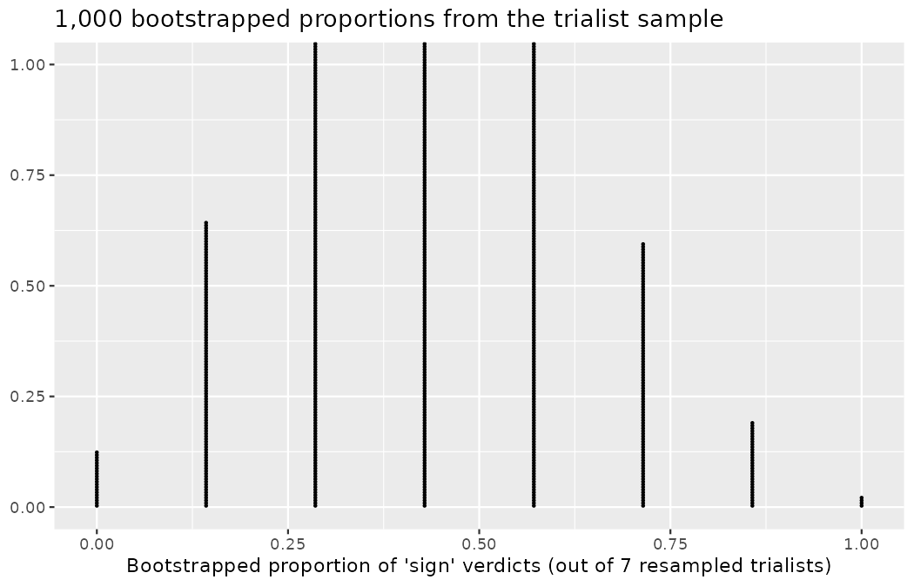
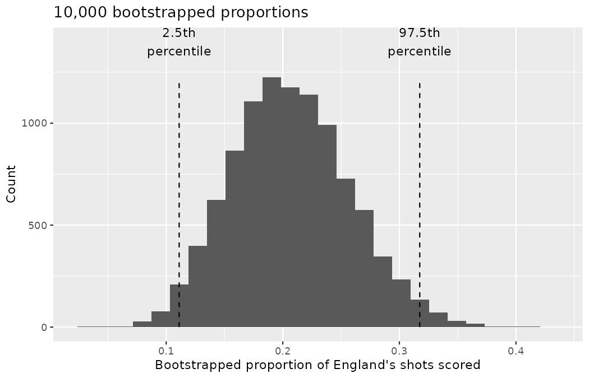
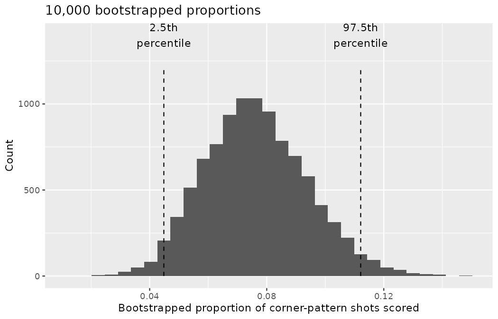

# Confidence intervals with bootstrapping {#sec-foundations-bootstrapping}

::: {.chapterintro}
In this chapter, we expand on the familiar idea of using a sample proportion to estimate a population proportion.
That is, we create what is called a **confidence interval**, which is a range of plausible values where we may find the true population value.
The process for creating a confidence interval is based on understanding how a statistic (here the sample proportion) *varies* around the parameter (here the population proportion) when many different statistics are calculated from many different samples.

If we could, we would measure the variability of the statistics by repeatedly taking sample data from the population and compute the sample proportion.
Then we could do it again.
And again.
And so on until we have a good sense of the variability of our original estimate.
For a scouting department, that would mean re-running an entire tournament, or sending the network out to log an entirely fresh set of shots — again and again.

When the variability across the samples is large, we would assume that the original statistic is possibly far from the true population parameter of interest (and the interval estimate will be wide).
When the variability across the samples is small, we expect the sample statistic to be close to the true parameter of interest (and the interval estimate will be narrow).

The ideal world where sampling data is free or extremely cheap is almost never the case, and taking repeated samples from a population is usually impossible. So, instead of using a "resample from the population" approach, bootstrapping uses a "resample from the sample" approach.
In this chapter we discuss in detail the bootstrapping process.
:::

As seen in [Chapter -@sec-foundations-randomization], randomization is a statistical technique suitable for evaluating whether a difference in sample proportions is due to chance.

Randomization tests are best suited for modeling experiments where the treatment (explanatory variable) has been randomly assigned to the observational units and there is an attempt to answer a simple yes/no research question.
That is exactly what Priya Rao's dossier audit and the opportunity cost exercise were.

For example, consider the following research questions, all of which we met in [Chapter -@sec-foundations-randomization], that can be well assessed with a randomization test:

-   Does listing an identically documented prospect as foreign make it less likely that a scout shortlists him?
-   Does reminding scouts that the €15M fee could be kept for the winter window affect their recommendations?
-   Do shots taken under defensive pressure convert at a lower rate? (a *permutation* test, in the language of @sec-foundations-randomization, since pressure was not assigned — the shuffling machinery is the same, the causal license is not)

In this chapter, however, we are instead interested in a different approach to understanding population parameters.
Instead of testing a claim, the goal now is to estimate the unknown value of a population parameter.

For example,

-   *How much less likely* is an identically documented prospect to be shortlisted if listed as foreign?
-   *By how many percentage points* does the winter-window reminder reduce sign recommendations?
-   *What is a team's true conversion rate* — what proportion of its shots become goals?

Marta Vidal rarely asks Priya "is there an effect, yes or no?"; she asks "how big is it?", because fees and contracts are denominated in sizes, not verdicts.
Here, we explore the situation where the focus is on a single proportion, and we introduce a new simulation method: **bootstrapping**.

Bootstrapping is best suited for modeling studies where the data have been generated through random sampling from a population.
As with randomization tests, our goal with bootstrapping is to understand variability of a statistic.
Unlike randomization tests (which modeled how the statistic would change if the treatment had been allocated differently), the bootstrap will model how a statistic varies from one sample to another taken from the population.
This will provide information about how different the statistic is from the parameter of interest.

Quantifying the variability of a statistic from sample to sample is a hard problem.
Fortunately, sometimes the mathematical theory for how a statistic varies (across different samples) is well-known; this is the case for the sample proportion as seen in @sec-foundations-mathematical.

However, some statistics do not have simple theory for how they vary, and bootstrapping provides a computational approach for providing interval estimates for almost any population parameter.
In this chapter we will focus on bootstrapping to estimate a single proportion, and we will revisit bootstrapping in [Chapter -@sec-inference-one-mean] through [Chapter -@sec-inference-paired-means], so you'll get plenty of practice as well as exposure to bootstrapping in many different data settings.

Our goal with bootstrapping will be to produce an interval estimate (a range of plausible values) for the population parameter.

## Set-piece consultant case study {#sec-case-study-med-consult}

Clubs preparing for a major tournament sometimes hire freelance specialists — set-piece coaches, finishing specialists — whose value is notoriously hard to audit.
A consultant is typically hired in part based on the historical record of the teams he has worked with, which is precisely the kind of record a scouting analyst should treat with suspicion.

### Observed data

A set-piece consultant has approached Marta Vidal with a pitch.
He notes that the average conversion rate across the 2022 Men's World Cup — the proportion of all shots that were scored — was about 13%, but England, the attacking unit he claims to have advised through the tournament, converted 13 of their 63 shots.
He claims this is strong evidence that his methods meaningfully improve finishing — his set-piece routines, he argues, do not merely win corners but lift a team's whole conversion rate — and that Northbridge should therefore hire him.

To be clear about what is real and what is constructed here: the shots are real — every number below is computed from the 2022 World Cup data we have used since @sec-data-hello — but the consultant and his claimed involvement with England are our invention, built to give the estimation problem a scouting-decision stake.

```r
library(dplyr)
library(tidyr)
library(readr)
library(ggplot2)
library(infer)

wc2022_shots <- read_csv("data/derived/wc2022_shots.csv")

wc2022_shots |>
  summarize(shots = n(), goals = sum(goal), conversion = mean(goal))
#> # A tibble: 1 × 3
#>   shots goals conversion
#>   <int> <int>      <dbl>
#> 1  1494   195      0.131

england_shots <- wc2022_shots |> filter(team == "England")

england_shots |>
  summarize(shots = n(), goals = sum(goal), conversion = mean(goal))
#> # A tibble: 1 × 3
#>   shots goals conversion
#>   <int> <int>      <dbl>
#> 1    63    13      0.206
```

The tournament as a whole converted $195/1494 = 0.131$ of its shots; England converted $13/63 = 0.206.$
Two flags travel with that baseline: it includes the tournament's 64 penalty kicks, and the open-play pair for this comparison returns with the consultant thread in [Chapter -@sec-inference-one-prop]; and the *pattern-level* check of his corners claim — whether shots from different possession patterns convert differently at all — is the machinery of [Chapter -@sec-inference-tables], not this chapter's.

::: {.callout-note title="Worked example"}
We will let $p$ represent the true conversion rate for a team playing under this consultant's methods — recall from @sec-foundations-randomization that $p$ denotes a population proportion.
(The "true" conversion rate will be referred to as the **parameter**.) We estimate $p$ using the data, and label the estimate $\hat{p}.$

------------------------------------------------------------------------

The sample proportion for the conversion rate is 13 goals divided by the 63 shots England took: $\hat{p} = 13/63 = 0.206.$
:::

::: {.callout-note title="Worked example"}
Is it possible to assess the consultant's claim (that the improvement in finishing is due to his work) using the data?

------------------------------------------------------------------------

No.
The claim is that there is a causal connection, but the data are observational — nobody randomly assigned the consultant to teams — so we must be on the lookout for confounding variables, exactly as in @sec-data-design.
For example, a team that can afford a specialist set-piece consultant can probably also afford better forwards, and better forwards convert more chances regardless of who is advising them.
Perhaps England simply generated higher-quality chances, or faced weaker defensive opposition in the group stage.
While it is not possible to assess the causal claim, it is still possible to understand the true conversion rate associated with the consultant's teams.
:::

::: {.callout-important title="Parameter"}
A **parameter** is the "true" value of interest.

We typically estimate the parameter using a **point estimate** from a sample of data.
The point estimate is also known as the **statistic**.

For example, we estimate the probability $p$ that a shot taken by a team under the consultant's methods is scored by examining the shots his team actually took:

$$\hat{p} = 13 / 63 = 0.206~\text{is used to estimate}~p$$
:::

You met both of these ideas informally in @sec-foundations-randomization — there, the difference in shortlist rates was the statistic, and the unknown true difference was the parameter.
This chapter makes the estimation of a parameter, rather than a test of a claim about it, the entire goal.

::: {.callout-tip title="Check your understanding"}
The 63 shots England took *are* every shot England took at the 2022 World Cup.
In what sense, then, is $\hat{p} = 13/63$ an estimate of anything, rather than the answer itself?

------------------------------------------------------------------------

It depends on the question.
If Marta only cares about what happened at that one tournament, $13/63$ is the answer and no inference is needed — recall from @sec-foundations-randomization that when the dataset is the whole population, arithmetic suffices.
But the consultant's pitch is about the *process*: how a team finishes under his methods, at the next tournament, for Northbridge.
For that question, the 63 shots are a sample from the process that generates his team's chances, and the process's long-run conversion rate $p$ is unknown.
:::

### Variability of the statistic

In the set-piece consultant case study, the parameter is $p,$ the true probability that a shot taken by a team playing under the consultant's methods is scored.
There is no reason to believe that $p$ is exactly $\hat{p} = 13/63,$ but there is also no reason to believe that $p$ is particularly far from $\hat{p} = 13/63.$
By sampling with replacement from the dataset (a process called **bootstrapping**), the variability of the possible $\hat{p}$ values can be approximated.

Most of the inferential procedures covered in this text are grounded in quantifying how one dataset would differ from another when they are both taken from the same population.
It does not make sense to take repeated samples from the same population: if you have the means to log more shots, a larger sample size will benefit you more than separately evaluating two samples of the exact same size.
Instead, we measure how the samples behave under an estimate of the population.

To see the mechanics on a scale where you can count everything on your fingers, step away from England's 63 shots for a moment and consider a deliberately tiny Northbridge scenario, built in seeded code as always.
Jonas Beck ran a trial week for seven academy trialists, and the coaching panel returned a verdict on each: three received a "sign" recommendation and four a "pass".

```r
trialists <- tibble(
  trialist = paste0("T", 1:7),
  verdict  = c("sign", "sign", "sign", "pass", "pass", "pass", "pass")
)

trialists |> count(verdict)
#> # A tibble: 2 × 2
#>   verdict     n
#>   <chr>   <int>
#> 1 pass        4
#> 2 sign        3
```

Suppose these seven verdicts are a sample from a much larger population — the verdicts the panel *would* give across all trialists of this kind — in which the true proportion of "sign" verdicts is unknown.
How can seven observations tell us about the variability of $\hat{p} = 3/7$?

Imagine using the sample to *estimate* the population: build a hypothetical, infinitely large population that is $3/7$ "sign" and $4/7$ "pass" — infinitely many copies of trialists T1 through T7, in the same proportions as observed.
Picture a wall of identical trial-week reports, three out of every seven stamped "sign" — or, if you prefer, a bag of three red and four white marbles replicated without end.
Because the observed sample is our best available information about the population, this estimated population is our best available stand-in for it.

By taking repeated samples of size 7 from the estimated population, the variability from sample to sample can be observed.
The resamples will differ both from each other and from the original sample — and since every one of them came from the *same* estimated population, those differences are due entirely to natural variability in the sampling procedure.

It turns out that in practice, it is very difficult for computers to work with an infinite population (with the same proportional breakdown as in the sample).
However, there is a physical and computational method which produces an equivalent bootstrap distribution of the sample proportion in a computationally efficient manner.

Consider the observed data to be a bag of seven marbles, 3 of which are successes ("sign") and 4 of which are failures ("pass").
By drawing the marbles out of the bag *with replacement* — put each marble back before drawing the next, so the bag never changes — we depict the exact same sampling **process** as was done with the infinitely large estimated population.
`slice_sample()` with `replace = TRUE` does the drawing for us:

```r
set.seed(1201)
resample_1 <- trialists |> slice_sample(n = 7, replace = TRUE)
resample_2 <- trialists |> slice_sample(n = 7, replace = TRUE)
resample_3 <- trialists |> slice_sample(n = 7, replace = TRUE)

resample_1 |> arrange(trialist)
#> # A tibble: 7 × 2
#>   trialist verdict
#>   <chr>    <chr>
#> 1 T1       sign
#> 2 T1       sign
#> 3 T4       pass
#> 4 T5       pass
#> 5 T5       pass
#> 6 T5       pass
#> 7 T7       pass
```

Look closely at the first resample: trialist T5 was drawn three times, T1 twice, and trialists T2, T3, and T6 were never drawn at all.
That is what sampling with replacement looks like — some observations repeat, others vanish — and it is precisely why the resample can differ from the original sample.
Summarizing each resample by its proportion of "sign" verdicts:

```r
c(mean(resample_1$verdict == "sign"),
  mean(resample_2$verdict == "sign"),
  mean(resample_3$verdict == "sign"))
#> [1] 0.2857143 0.7142857 0.2857143
```

The three resamples produced proportions of $2/7,$ $5/7,$ and $2/7$ — obviously different from each other, and two of the three different from the observed $3/7.$
By summarizing each of many bootstrap samples this way, we see, directly, the variability of the sample proportion from sample to sample.
This new statistic gets its own symbol, and since the notation is new in this chapter, decompose it before using it: in $\hat{p}_{boot},$ the letter $p$ names a proportion; the hat says it was computed from data rather than known (recall @sec-foundations-randomization); and the subscript $boot$ says the data it was computed from are a *bootstrap resample* — a sample drawn with replacement from the original sample — rather than the original sample itself.
Repeating the resampling 1,000 times and stacking the resulting $\hat{p}_{boot}$ values gives the bootstrap distribution:

```r
trialists_boot <- tibble(
  p_boot = replicate(1000, {
    mean(slice_sample(trialists, n = 7, replace = TRUE)$verdict == "sign")
  })
)

trialists_boot |> count(p_boot)
#> # A tibble: 8 × 2
#>   p_boot     n
#>    <dbl> <int>
#> 1  0        21
#> 2  0.143   107
#> 3  0.286   213
#> 4  0.429   286
#> 5  0.571   238
#> 6  0.714    99
#> 7  0.857    32
#> 8  1         4

ggplot(trialists_boot, aes(x = p_boot)) +
  geom_dotplot(binwidth = 0.01, dotsize = 0.35) +
  labs(
    x = "Bootstrapped proportion of 'sign' verdicts (out of 7 resampled trialists)",
    y = NULL,
    title = "1,000 bootstrapped proportions from the trialist sample"
  )
```

{fig-alt="A stacked dot plot of 1,000 bootstrapped proportions of sign verdicts from resamples of the seven trialists. Dots stack at the only eight values a proportion out of 7 can take, with the tallest stack at the observed 3/7 and counts falling away toward the extremes." width=85%}

The dot plot shows 1,000 dots stacked at the only eight values a proportion out of 7 can take, from $0/7$ to $7/7.$
The tallest stack sits at the observed value $3/7 \approx 0.429$ (286 of the 1,000 resamples), with the neighboring stacks at $2/7$ and $4/7$ nearly as tall (213 and 238), and the counts falling away toward the extremes: only 21 resamples contained no "sign" verdicts at all, and just 4 consisted of "sign" verdicts entirely.
The shape is roughly a bell centered on $\hat{p},$ with the bulk of bootstrapped proportions falling between $1/7$ and $6/7.$

Whether you imagine sampling from the infinite estimated population or drawing from the bag with replacement, the dot plot of bootstrapped proportions comes out the same, because the process by which the statistics were estimated is equivalent.
The bag version is simply the one a computer (or an analyst with marbles) can actually carry out.

If we apply the bootstrap sampling process to the consultant example, we consider each of England's shots to be one of the marbles in the bag.
There will be 50 white marbles (no goal) and 13 red marbles (goal).
If we choose 63 marbles out of the bag (one at a time with replacement) and compute the proportion of simulated shots that were goals, $\hat{p}_{boot},$ then this "bootstrap" proportion represents a single simulated proportion from the "resample from the sample" approach.

::: {.callout-tip title="Check your understanding"}
In a simulation of 63 shots, about how many would we expect to be goals?

------------------------------------------------------------------------

About 20.6% of the shots (13 on average) in the simulation will be goals, as this is what was seen in the sample.
We will, however, see a little variation from one simulation to the next.
:::

One simulation isn't enough to get a sense of the variability from one bootstrap proportion to another bootstrap proportion, so we repeat the simulation 10,000 times using a computer.
The **infer** pipeline from @sec-foundations-randomization does the work, with one change that carries the entire conceptual difference between the two chapters: `generate(type = "bootstrap")` resamples the 63 rows with replacement, where `type = "permute"` had shuffled labels between groups.

```r
set.seed(1202)
england_boot <- england_shots |>
  mutate(result = if_else(goal, "goal", "no goal")) |>
  specify(response = result, success = "goal") |>
  generate(reps = 10000, type = "bootstrap") |>
  calculate(stat = "prop")

england_ci <- england_boot |>
  summarize(
    lower = quantile(stat, 0.025),
    upper = quantile(stat, 0.975)
  )
england_ci
#> # A tibble: 1 × 2
#>   lower upper
#>   <dbl> <dbl>
#> 1 0.111 0.317
```

The histogram below shows the distribution from the 10,000 bootstrap simulations.

```r
ggplot(england_boot, aes(x = stat)) +
  geom_histogram(binwidth = 1 / 63) +
  annotate("segment",
    x = england_ci$lower, y = 0,
    xend = england_ci$lower, yend = 1200,
    linetype = "dashed"
  ) +
  annotate("segment",
    x = england_ci$upper, y = 0,
    xend = england_ci$upper, yend = 1200,
    linetype = "dashed"
  ) +
  annotate("text", x = england_ci$lower, y = 1400, label = "2.5th\npercentile") +
  annotate("text", x = england_ci$upper, y = 1400, label = "97.5th\npercentile") +
  labs(
    x = "Bootstrapped proportion of England's shots scored",
    y = "Count",
    title = "10,000 bootstrapped proportions"
  )
```

{fig-alt="A histogram of 10,000 bootstrapped proportions of England's shots scored, roughly bell-shaped and centered near the observed 0.206, with dashed lines marking the 2.5th percentile at 0.111 and the 97.5th percentile at 0.317." width=85%}

The histogram is roughly bell-shaped and centered near the observed $\hat{p} = 0.206$ (the mean of the 10,000 bootstrapped proportions is 0.207), with the bars stepping in increments of $1/63$ and the full set of bootstrapped proportions ranging from about $0.032$ to $0.429.$
The dashed lines mark the 2.5th percentile at $7/63 = 0.111$ and the 97.5th percentile at $20/63 = 0.317.$
The variability in the bootstrapped proportions leads us to believe that the true conversion rate under the consultant's methods (the parameter, $p$) is likely to fall somewhere between 11.1% and 31.7%, as these numbers capture 95% of the bootstrap resampled values.

The range of values for the true proportion is called a **bootstrap percentile confidence interval**, and we will see it again throughout the next few sections and chapters.

::: {.callout-note title="Worked example"}
The original claim was that the consultant's methods lift a team's true conversion rate above the tournament rate of about 13%.
Does the interval estimate of 11.1% to 31.7% for the true conversion rate indicate that the consultant's teams finish better than the tournament average?
Explain.

------------------------------------------------------------------------

No.
Because the interval overlaps 13.1%, it might be that the consultant's work is associated with a higher conversion rate, or it might be that it is associated with a *lower* one (i.e., below 13.1%)!
Additionally, as previously mentioned, because this is an observational study, even if an association can be measured, there is no evidence that the consultant's work is the cause of the conversion rate (being higher or lower).
Marta can decline the pitch without needing to accuse anyone of anything: the data are simply consistent with an ordinary team.
:::

## Corner-kick expectations case study {#sec-tapperscasestudy}

Here's an exercise you can try in any coaches' meeting: ask everyone to write down, before checking any data, what proportion of shots arising from corner-kick situations at a World Cup end up as goals.
Corners feel dangerous — the crowd rises, the keeper's box fills, the broadcast cuts to the bench — and intuition prices them accordingly.

### Observed data

Priya Rao ran exactly this exercise at Northbridge's pre-season analysis workshop.
(The workshop poll is a constructed scenario; the shot data below are real.)
She collected written guesses from the coaching staff and the scouting network, and the typical answer was that about 25% of shots from corner situations are scored — one goal in four.
Priya wondered, is 25% a reasonable expectation?

The 2022 World Cup data can answer for one tournament.
The `play_pattern` variable, which you first tabulated in @sec-explore-categorical, identifies shots arising from corner possessions:

```r
wc2022_shots |>
  filter(play_pattern == "From Corner") |>
  summarize(shots = n(), goals = sum(goal), conversion = mean(goal))
#> # A tibble: 1 × 3
#>   shots goals conversion
#>   <int> <int>      <dbl>
#> 1   223    17     0.0762
```

Of the 223 corner-pattern shots at the tournament, only 17 were scored: $\hat{p} = 17/223 = 0.076.$
That seems like quite a low number — a third of what the room guessed — which leads the analyst to ask: what is the true proportion of corner-pattern shots that are scored?

### Variability of the statistic

To answer the question, we will again use a simulation.
To simulate 223 corner-pattern shots, this time we use a bag of 223 marbles, 17 of which are red (for the shots that were scored) and 206 of which are white (for the shots that were not).
Sampling from the bag 223 times (remembering to replace the marble back into the bag each time to keep constant the population proportion of red) produces one bootstrap sample.

For example, we can start by simulating just 5 corner-pattern shots by drawing 5 marbles from the bag of 17 red and 206 white marbles.
Because each draw is a success with probability $17/223$ independently of the others, `rbinom()` performs the draws directly — drawing marbles with replacement and flipping a coin that lands "goal" with probability $17/223$ are the same process:

```r
set.seed(1203)
rbinom(5, size = 1, prob = 17 / 223)
#> [1] 0 0 0 0 0
```

|  W   |  W   |  W   |  W   |  W   |
|:----:|:----:|:----:|:----:|:----:|
| miss | miss | miss | miss | miss |

All five simulated shots missed — unremarkable when the chance of each one scoring is only about 7.6%.
Continuing the same seeded stream to full resamples of 223 shots, we counted the reds and computed $\hat{p}_{boot}$ for ten entire simulations:

```r
round(rbinom(10, size = 223, prob = 17 / 223) / 223, 4)
#>  [1] 0.0673 0.0673 0.0717 0.1031 0.0717 0.0583 0.0628 0.0673 0.0987 0.0628
```

$$0.0673 \quad 0.0673 \quad 0.0717 \quad 0.1031 \quad 0.0717 \quad 0.0583 \quad 0.0628 \quad 0.0673 \quad 0.0987 \quad 0.0628$$

As we did with the randomization technique, seeing what would happen with one simulation isn't enough — and even ten only hint at the spread.
In order to understand how far the observed proportion of 0.076 might be from the true parameter, we should generate more simulations, so we'll run a total of 10,000 using a computer.

```r
set.seed(1204)
bsprop_corner <- tibble(
  p_boot = rbinom(10000, size = 223, prob = 17 / 223) / 223
)

corner_ci <- bsprop_corner |>
  summarize(
    lower = quantile(p_boot, 0.025),
    upper = quantile(p_boot, 0.975)
  )
corner_ci
#> # A tibble: 1 × 2
#>    lower upper
#>    <dbl> <dbl>
#> 1 0.0448 0.112

ggplot(bsprop_corner, aes(x = p_boot)) +
  geom_histogram(binwidth = 1 / 223) +
  annotate("segment",
    x = corner_ci$lower, y = 0,
    xend = corner_ci$lower, yend = 1200,
    linetype = "dashed"
  ) +
  annotate("segment",
    x = corner_ci$upper, y = 0,
    xend = corner_ci$upper, yend = 1200,
    linetype = "dashed"
  ) +
  annotate("text", x = corner_ci$lower, y = 1400, label = "2.5th\npercentile") +
  annotate("text", x = corner_ci$upper, y = 1400, label = "97.5th\npercentile") +
  labs(
    x = "Bootstrapped proportion of corner-pattern shots scored",
    y = "Count",
    title = "10,000 bootstrapped proportions"
  )
```

{fig-alt="A histogram of 10,000 bootstrapped proportions of corner-pattern shots scored, centered near the observed 0.076 with a mild right skew; dashed lines mark the 2.5th percentile at 0.0448 and the 97.5th percentile at 0.112." width=85%}

The histogram of the 10,000 bootstrapped proportions is centered near the observed $0.076,$ stepping in increments of $1/223,$ with a mild right skew — the sort of asymmetry a proportion this close to zero must have, since it cannot fall below 0.
The bootstrapped proportions range from about $0.013$ to $0.148,$ and the dashed lines mark the range of 95% of the resampled values of $\hat{p}_{boot}$: $0.0448$ to $0.112.$
That is, we expect that between about 4.5% and 11.2% of corner-pattern shots are truly scored.

::: {.callout-tip title="Check your understanding"}
Do the data provide convincing evidence against the workshop's claim that 25% of corner-pattern shots are scored?

------------------------------------------------------------------------

Because 25% is not in the interval estimate for the true parameter, we can say that there is convincing evidence against the claim that a quarter of corner-pattern shots are scored.
Moreover, 25% is a substantial distance from the largest resample statistic (about 0.148 in 10,000 resamples), suggesting that there is **very** convincing evidence against this claim.
The coaching intuition overrates corners by roughly a factor of three — a gap worth remembering the next time a set-piece specialist quotes his own value.
:::

## Confidence intervals {#sec-ConfidenceIntervals}

A point estimate provides a single plausible value for a parameter.
However, a point estimate is rarely perfect; usually there is some error in the estimate.
In addition to supplying a point estimate of a parameter, a next logical step would be to provide a plausible *range of values* for the parameter.

### Plausible range of values for the population parameter

A plausible range of values for the population parameter is called a **confidence interval**.
Using only a single point estimate is like a goalkeeper facing a penalty and diving to one exact spot: commit to a single point and you will probably miss the ball.
Covering a zone of the goalmouth — staying big, guarding a range — gives a good chance that the ball ends up somewhere you can reach.

If we report a point estimate, we probably will not hit the exact population parameter.
On the other hand, if we report a range of plausible values — a confidence interval — we have a good shot at capturing the parameter.

::: {.callout-tip title="Check your understanding"}
If we want to be very certain we capture the population parameter, should we use a wider interval (e.g., 99%) or a smaller interval (e.g., 80%)?

------------------------------------------------------------------------

If the keeper wants to be more certain of reaching the ball, he covers more of the goal.
Likewise, we use a wider confidence interval if we want to be more certain that we capture the parameter.
:::

### Bootstrap confidence interval

As we saw above, a **bootstrap sample** is a sample of the original sample.
In the case of England's shot data, we proceed as follows:

-   Randomly sample one observation from the 63 shots (replace the marble back into the bag so as to keep the population constant).
-   Randomly sample a second observation from the 63 shots. Because we sample with replacement (i.e., we do not actually remove the marbles from the bag), there is a 1-in-63 chance that the second observation will be the same one sampled in the first step!
-   Keep going one sampled observation at a time ...
-   Randomly sample the 63rd observation from the 63 shots.

Bootstrap sampling is often called **sampling with replacement**, and you watched it happen in the trialist example: T5 appeared three times in the first resample precisely because he went back in the bag after each draw.

A bootstrap sample behaves similarly to how an actual sample from a population would behave, and we compute the point estimate of interest (here, compute $\hat{p}_{boot}$).

Based on theory that is beyond this text, we know that the bootstrap proportions $\hat{p}_{boot}$ vary around $\hat{p}$ similarly to how different sample proportions (i.e., values of $\hat{p}$) vary around the true parameter $p.$
Therefore, an interval estimate for $p$ can be produced using the $\hat{p}_{boot}$ values themselves.

::: {.callout-note title="Deeper (optional): watching the principle hold"}
The theory is beyond this text, but the claim it makes is checkable, because for once we hold an entire population: the 1,494 shots of the 2022 World Cup.
Below, we draw 1,000 *different* samples of 63 shots from the tournament and record the standard deviation of their sample proportions — the true sample-to-sample variability that in real life we never get to see.
Then we take just *one* sample of 63 shots and bootstrap it 1,000 times.

```r
set.seed(1210)
sampling_p <- replicate(1000, {
  mean(slice_sample(wc2022_shots, n = 63)$goal)
})

one_sample <- slice_sample(wc2022_shots, n = 63)
boot_p <- replicate(1000, {
  mean(slice_sample(one_sample, n = 63, replace = TRUE)$goal)
})

round(c(sd_sampling = sd(sampling_p), sd_bootstrap = sd(boot_p)), 4)
#>  sd_sampling sd_bootstrap
#>       0.0421       0.0446
```

The two standard deviations are close: the spread of the $\hat{p}_{boot}$ values around $\hat{p}$ — computed from a single sample, which happened to contain 9 goals $(\hat{p} = 9/63 = 0.143)$ — approximates the spread of the $\hat{p}$ values around $p,$ which required 1,000 samples we would never have in practice.
That closeness is the bootstrap principle at work, and it is exactly what licenses reading a confidence interval off the $\hat{p}_{boot}$ values.
:::

::: {.callout-important title="95% bootstrap percentile confidence interval for a parameter $p$"}
The 95% bootstrap confidence interval for the parameter $p$ can be obtained directly using the ordered $\hat{p}_{boot}$ values.

Consider the sorted $\hat{p}_{boot}$ values.
Call the 2.5% bootstrapped proportion value "lower", and call the 97.5% bootstrapped proportion value "upper".

The 95% confidence interval is given by: (lower, upper)
:::

That is exactly what `quantile(stat, 0.025)` and `quantile(stat, 0.975)` computed in both case studies: for England, (0.111, 0.317); for the corner-pattern shots, (0.0448, 0.112).

::: {.callout-tip title="Check your understanding"}
Both the permutation distributions of @sec-foundations-randomization and the bootstrap distributions of this chapter were built by simulation.
Where is each one centered, and why does the difference matter?

------------------------------------------------------------------------

A permutation (or randomization) distribution is built assuming the null hypothesis, so it is centered at the null value — zero, for a difference in proportions — and we ask how far out the observed statistic falls.
A bootstrap distribution is built from the observed sample with no hypothesis at all, so it is centered near the observed statistic $\hat{p},$ and its *spread* tells us how far the statistic tends to sit from the parameter.
One machine tests claims; the other measures precision.
:::

In the next chapter, the finishing-program case study of @sec-casestent closes with a section, *Interpreting confidence intervals*, that provides a longer discussion of what "95% confidence" actually means — and does not mean.

Later, the section *Changing the confidence level* of @sec-one-prop-norm will discuss different percentages for the confidence interval (e.g., 90% confidence interval or 99% confidence interval).

## Chapter review {#sec-chp12-review}

### Summary

Picture the full procedure one more time with the trialist bag: the seven verdicts stand in for the population; draw seven with replacement; record the proportion of "sign" verdicts; repeat thousands of times; then read off the middle 95% of the bootstrapped proportions.
Sampling with replacement is a computational tool which is equivalent to using the sample as a way of estimating an infinitely large population from which to sample.

We can summarize the bootstrap process as follows:

-   **Frame the research question in terms of a parameter to estimate.** Confidence intervals are appropriate for research questions that aim to estimate a number from the population (called a parameter) — a true conversion rate, a true shortlist rate — rather than to test a yes/no claim.
-   **Collect data with an observational study or experiment.** If a research question can be formed as a query about the parameter, we can collect data to calculate a statistic which is the best guess we have for the value of the parameter. However, we know that the statistic won't be exactly equal to the parameter due to natural variability: England's 63 shots gave one $\hat{p};$ a different tournament would have given another.
-   **Model the randomness by using the data values as a proxy for the population.** In order to assess how far the statistic might be from the parameter, we take repeated resamples from the dataset to measure the variability in bootstrapped statistics. The variability of the bootstrapped statistics around the observed statistic (a quantity which can be measured through computational technique) should be approximately the same as the variability of many observed sample statistics around the parameter (a quantity which is very difficult to measure because in real life we only get exactly one sample).
-   **Create the interval.** After choosing a particular confidence level, use the variability of the bootstrapped statistics to create an interval estimate which will hope to capture the true parameter. While the interval estimate associated with the particular sample at hand may or may not capture the parameter, the researcher knows that over their lifetime, the confidence level will determine the percentage of their research confidence intervals that do capture the true parameter.
-   **Form a conclusion.** Using the confidence interval from the analysis, report on the interval estimate for the parameter of interest. Also, be sure to write the conclusion in plain language so casual readers can understand the results — Marta Vidal should be able to read "plausibly between 11% and 32%" and act on it, without decoding notation.

| Question | Answer |
|:---------------------------------------|:------------------------------|
| What does the procedure do? | Resamples the observed data with replacement, using the sample as a proxy for the population, to simulate drawing many new samples. |
| What is the statistic? | A summary of the sample, e.g., $\hat{p} = 13/63$; recomputed on each resample it becomes $\hat{p}_{boot}.$ |
| What does the bootstrap distribution describe? | The sample-to-sample variability of the statistic — how far $\hat{p}$ tends to sit from $p.$ |
| What is the interval? | The range between the 2.5th and 97.5th percentiles of the ordered $\hat{p}_{boot}$ values (for 95% confidence). |
| What does it conclude? | A range of plausible values for the parameter — an estimate of size, not a yes/no verdict, and causal only if the data came from a randomized experiment. |

: Summary of bootstrapping as an inferential statistical method. {#tbl-chp12-summary}

### Terms

The terms introduced in this chapter are presented below, alphabetized.
If you're not sure what some of these terms mean, we recommend you go back in the text and review their definitions.
You should be able to easily spot them as **bolded text**.

|  |  |  |
|:-----------------------|:-----------------------|:----------------------|
| bootstrap percentile confidence interval | confidence interval | sampling with replacement |
| bootstrap sample | parameter | statistic |
| bootstrapping | point estimate |  |

: Terms introduced in this chapter. {#tbl-terms-chp-12}

## Exercises {#sec-chp12-exercises}

Answers to odd-numbered exercises can be found in [Appendix -@sec-exercise-solutions-12]. Final answers to the even-numbered exercises are in [Appendix -@sec-appendix-even-answers].

::: {.exercises}

:::

------------------------------------------------------------------------

Adapted from *Introduction to Modern Statistics* by Çetinkaya-Rundel & Hardin (CC BY-SA 4.0); this adaptation is likewise CC BY-SA 4.0. Match data: StatsBomb open data.
