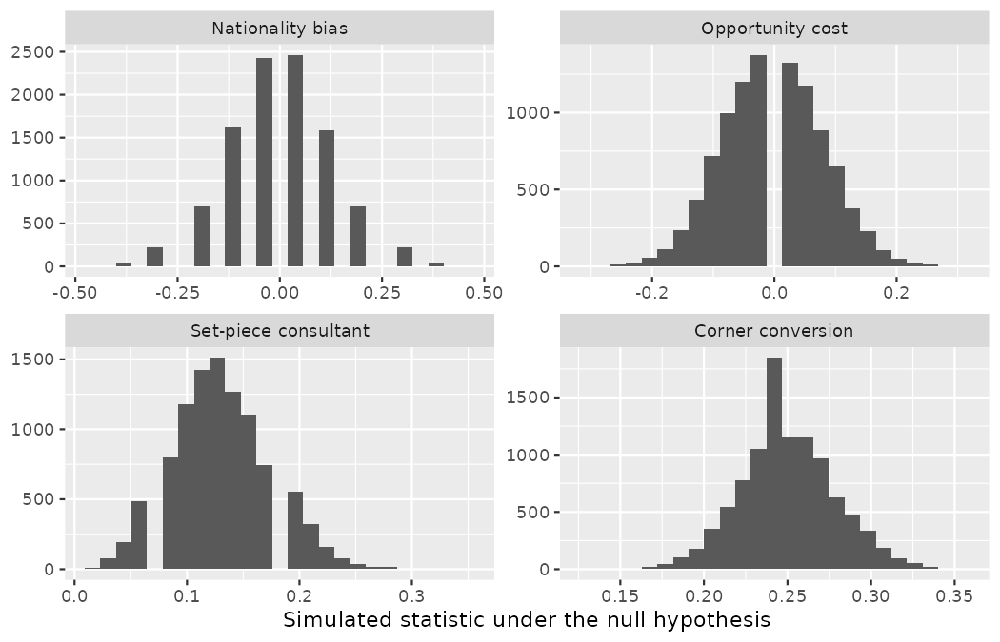
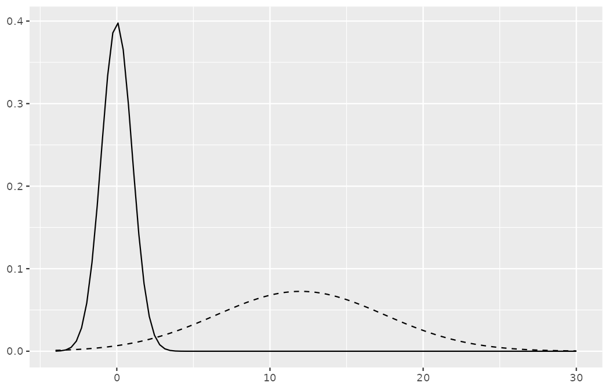
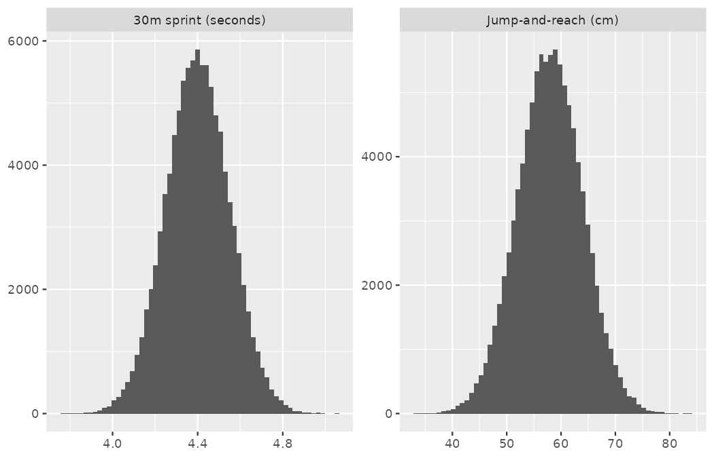
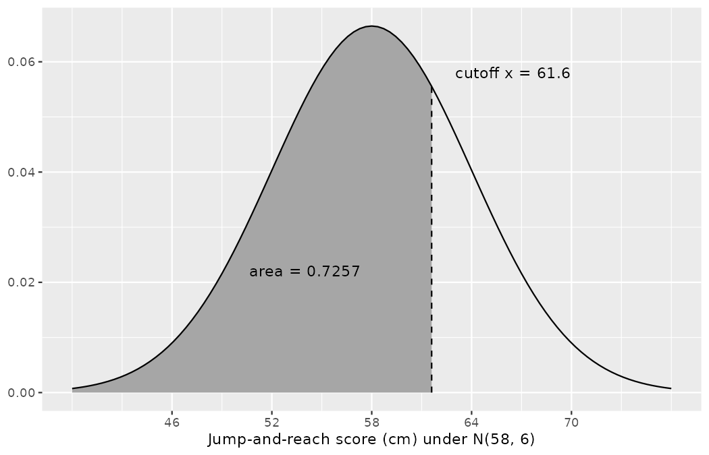
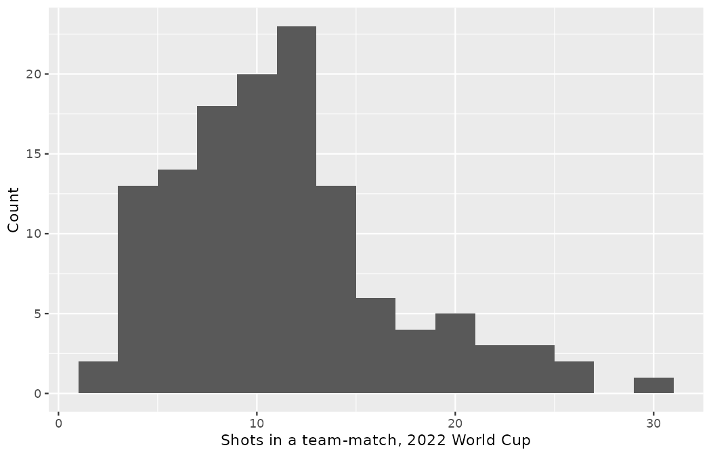
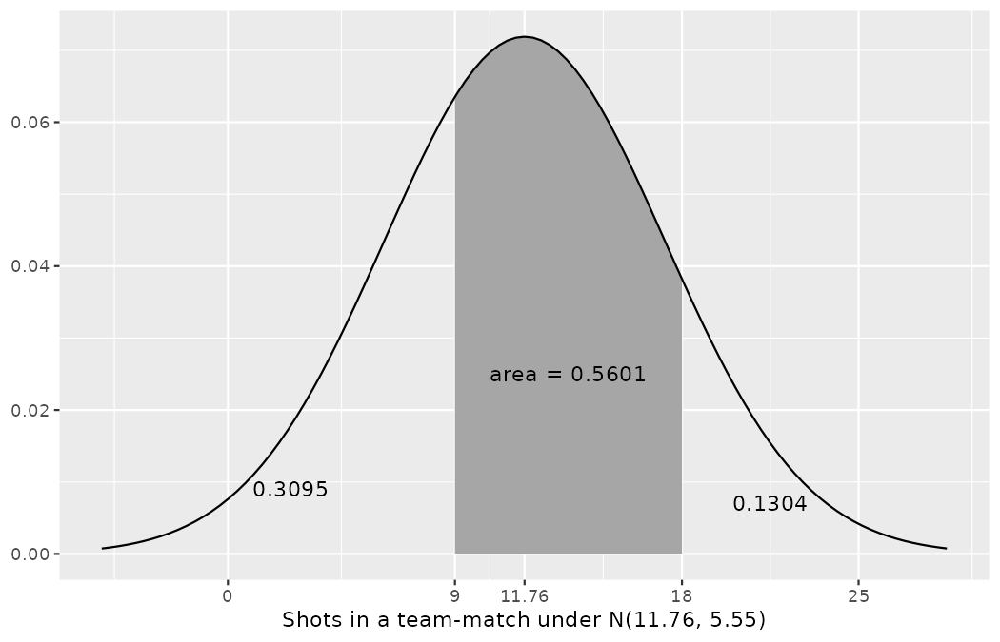
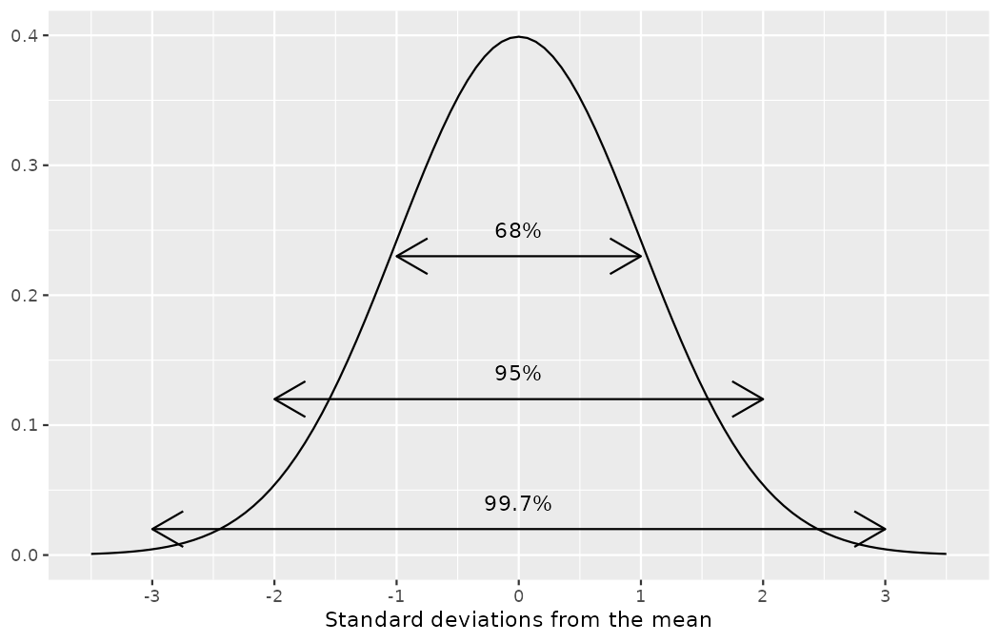
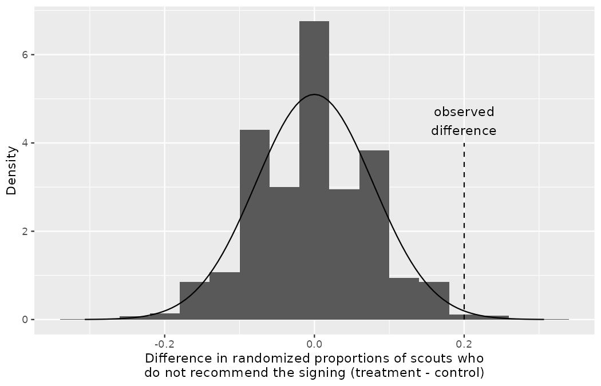
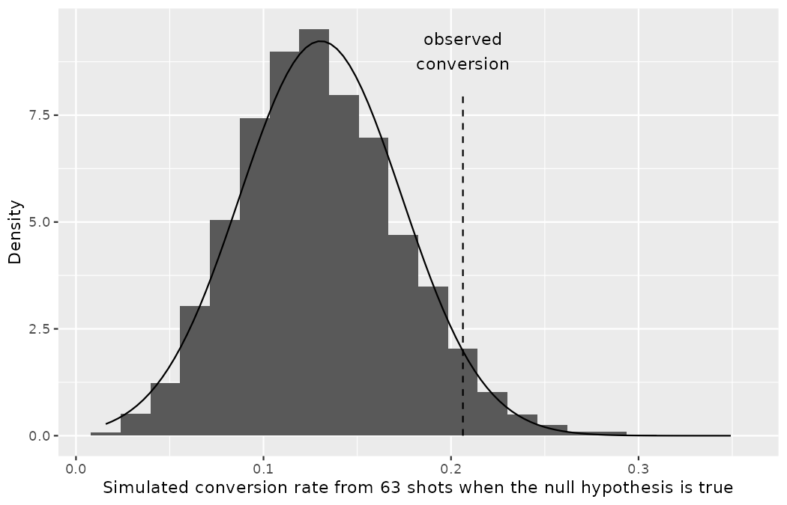
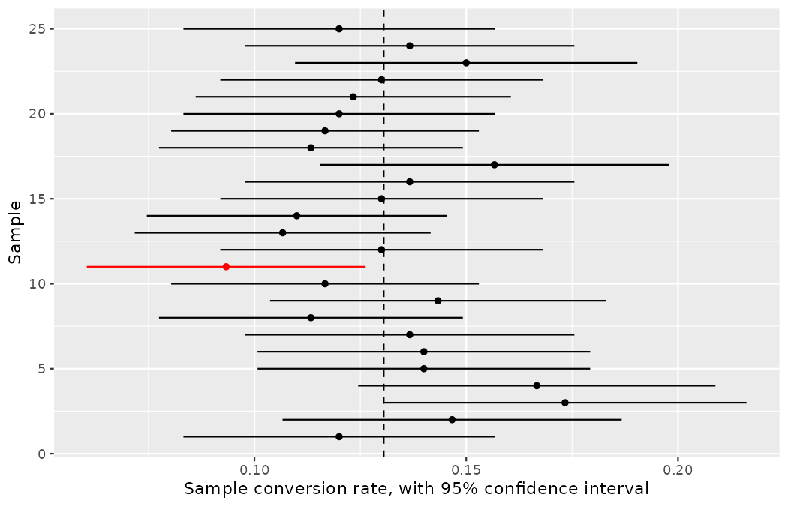

# Inference with mathematical models {#sec-foundations-mathematical}

::: {.chapterintro}
In [Chapter -@sec-foundations-randomization] and [Chapter -@sec-foundations-bootstrapping] questions about population parameters were addressed using computational techniques.
With randomization tests, the data were permuted assuming the null hypothesis.
With bootstrapping, the data were resampled in order to measure the variability.
In many cases (indeed, with sample proportions), the variability of the statistic can be described by the computational method (as in previous chapters) or by a mathematical formula (as in this chapter).

The normal distribution is presented here to describe the variability associated with sample proportions which are taken from either repeated samples or repeated experiments.
The normal distribution is quite powerful in that it describes the variability of many different statistics, and we will encounter the normal distribution throughout the remainder of the book.

For now, however, focus is on the parallels between how data can provide insight about a research question either through computational methods or through mathematical models.
:::

## Central Limit Theorem {#sec-CLTsection}

In recent chapters, we have encountered four case studies.
Two were Northbridge United's own randomized experiments: the dossier nationality audit of @sec-caseStudySexDiscrimination and the opportunity cost study of @sec-caseStudyOpportunityCost.
Two came from real tournament data in [Chapter -@sec-foundations-bootstrapping]: the set-piece consultant who pointed to England's 2022 World Cup conversion as proof of his methods, and the corner-craze case, where Northbridge's coaches insisted that one in four shots generated from a corner ends in a goal.
While they differ in the settings, in their outcomes, and in the technique we have used to analyze the data, they all have something in common: the general shape of the distribution of the statistics (called the **sampling distribution**). You may have noticed that the distributions were symmetric and bell-shaped.

::: {.callout-important title="Sampling distribution"}
A sampling distribution is the distribution of all possible values of a *sample statistic* from samples of a given sample size from a given population.
We can think about the sampling distribution as describing how sample statistics (e.g., the sample proportion $\hat{p}$ or the sample mean $\bar{x}$) vary from one study to another.
A sampling distribution is contrasted with a data distribution which shows the variability of the *observed* data values.
The data distribution can be visualized from the observations themselves.
However, because a sampling distribution describes sample statistics computed from many studies, it cannot be visualized directly from a single dataset.
Instead, we use either computational or mathematical structures to estimate the sampling distribution and hence to describe the expected variability of the sample statistic in repeated studies.
:::

Let us put all four case studies side by side, each with 10,000 simulations.
First, rebuild the two Northbridge experiments with exactly the code that constructed them in [Chapter -@sec-foundations-randomization] — remember, these are constructed scenarios, and the code *is* the data.

```r
library(dplyr)
library(tidyr)
library(readr)
library(ggplot2)
library(purrr)
library(infer)

dossier48 <- tibble(
  nationality = factor(rep(c("domestic", "foreign"), each = 24),
                       levels = c("domestic", "foreign")),
  decision    = factor(c(rep("shortlist", 21), rep("pass", 3),
                         rep("shortlist", 14), rep("pass", 10)),
                       levels = c("shortlist", "pass"))
)

budget150 <- tibble(
  group    = factor(rep(c("control", "treatment"), each = 75),
                    levels = c("control", "treatment")),
  decision = factor(c(rep("recommend signing", 56), rep("do not recommend", 19),
                      rep("recommend signing", 41), rep("do not recommend", 34)),
                    levels = c("recommend signing", "do not recommend"))
)
```

The two real-data cases live in the 2022 World Cup shots.
The tournament-wide conversion rate is the baseline both claims are measured against:

```r
wc2022_shots <- read_csv("data/derived/wc2022_shots.csv")

wc2022_shots |>
  summarize(shots = n(), goals = sum(goal), conversion = mean(goal))
#> # A tibble: 1 × 3
#>   shots goals conversion
#>   <int> <int>      <dbl>
#> 1  1494   195      0.131
```

The set-piece consultant's showcase team, England, took 63 shots and scored 13:

```r
wc2022_shots |>
  filter(team == "England") |>
  summarize(shots = n(), goals = sum(goal), conversion = mean(goal))
#> # A tibble: 1 × 3
#>   shots goals conversion
#>   <int> <int>      <dbl>
#> 1    63    13      0.206
```

And the shots arising from corner possessions, the ones the coaching staff put at "one in four":

```r
wc2022_shots |>
  filter(play_pattern == "From Corner") |>
  summarize(shots = n(), goals = sum(goal), conversion = mean(goal))
#> # A tibble: 1 × 3
#>   shots goals conversion
#>   <int> <int>      <dbl>
#> 1   223    17     0.0762
```

### The binomial, named at last {#sec-binomial-named}

Before we simulate the four nulls, an introduction is overdue.
Every time this book has simulated shot outcomes — starting with the striker's 100-shot seasons back in @sec-data-hello — the code has leaned on one R function, `rbinom()`, and we have never paused to name the model it draws from.
That model is the **binomial distribution**: the count of successes in $n$ independent tries, when every try succeeds with the same probability $p.$
This is *all* `rbinom(k, n, p)` has ever done: play out $n$ tries at success probability $p,$ record the count of successes, and repeat the whole exercise $k$ times.
The striker's seasons were binomial counts with $n = 100$ tries at $p = 0.10$; the consultant and corner nulls built below are binomial counts with $n = 63$ and $n = 223.$

Two facts about the binomial deserve plain words.
First, the expected count of successes is $n \cdot p$: over many 100-shot seasons at a true rate of $0.10,$ the goal tallies average out to $100 \times 0.10 = 10,$ even though @sec-data-hello showed that any single season rarely lands exactly there.
Second, dividing a count by $n$ gives a proportion, and the expected proportion is $p$ itself: simulated conversion rates center on the true rate.
Rerunning the striker simulation confirms both:

```r
set.seed(104)
seasons <- rbinom(10000, size = 100, prob = 0.10)
mean(seasons)
#> [1] 10.0027
sd(seasons / 100)
#> [1] 0.02990449
```

The average of 10,000 simulated goal tallies sits within three thousandths of a goal of $n \cdot p = 10.$
Hold on to the second number, $0.0299,$ because the optional box below computes it from scratch.

::: {.callout-note title="Deeper (optional — uses expected-value algebra)"}
So far, every measure of a statistic's variability in this book has been *simulated*.
For the binomial, once, we can earn one with algebra.

Consider a single try — one shot — recorded as 1 for a goal and 0 for a miss, with true conversion rate $p.$
Across many tries the average outcome is $p,$ so measure each outcome's squared distance from $p$ and weight it by how often that outcome happens — the same recipe that built the variance $s^2$ in @sec-explore-numerical:

-   with probability $p$ the outcome is 1, at squared distance $(1 - p)^2$;
-   with probability $1 - p$ the outcome is 0, at squared distance $(0 - p)^2 = p^2.$

The weighted average of the two squared distances collapses neatly:

$$p(1-p)^2 + (1-p)\,p^2 = p(1-p)\big[(1-p) + p\big] = p(1-p).$$

So a single try's variability — its variance — is $p(1-p).$
The sample proportion $\hat{p}$ is the *average* of $n$ such tries, and averaging $n$ independent tries divides the variability by $n$: each independent observation cancels a share of the noise, which is the algebra behind every "larger samples vary less" pattern you have watched since @sec-data-hello.
The variance of $\hat{p}$ is therefore $p(1-p)/n,$ and taking the square root returns to the scale of proportions, just as $s$ undoes $s^2.$
The result is the standard deviation of $\hat{p}$ across repeated samples — the kind of quantity this chapter will shortly name a *standard error* (@sec-se):

$$SE(\hat{p}) = \sqrt{\frac{p(1-p)}{n}}$$

For the striker, $\sqrt{0.10 \times 0.90 / 100} = 0.03,$ and the 10,000 simulated seasons above landed at $0.0299.$
The simulation was never magic; it was converging on this formula all along.
This is the formula @sec-inference-one-prop will hand you ready-made — you have now earned it once.
:::

With the model named, it can go straight back to work.

Each case study comes with a null hypothesis (recall $H_0$ from @sec-foundations-randomization):
the dossier audit and the opportunity cost study each assert a difference in proportions of 0; the consultant case asserts England converts at the tournament baseline of $195/1494 = 0.1305$; the corner case asserts the coaches' claimed rate of $0.25$.
The code below simulates each null 10,000 times.
For the two experiments we permute, exactly as in [Chapter -@sec-foundations-randomization]; for the two one-proportion cases we simulate shot outcomes directly from the hypothesized rate — a method treated fully in @sec-one-prop-null-boot.

```r
p_0 <- 195 / 1494

set.seed(1303)
dossier48_null <- dossier48 |>
  specify(decision ~ nationality, success = "shortlist") |>
  hypothesize(null = "independence") |>
  generate(reps = 10000, type = "permute") |>
  calculate(stat = "diff in props", order = c("domestic", "foreign"))

set.seed(1304)
budget150_null <- budget150 |>
  specify(decision ~ group, success = "do not recommend") |>
  hypothesize(null = "independence") |>
  generate(reps = 10000, type = "permute") |>
  calculate(stat = "diff in props", order = c("treatment", "control"))

set.seed(1305)
consultant_null <- tibble(stat = rbinom(10000, 63, p_0) / 63)

set.seed(1306)
corner_null <- tibble(stat = rbinom(10000, 223, 0.25) / 223)
```

The four null distributions are drawn by the code below.
Note that the **null distribution** is the sampling distribution of the statistic created under the setting where the null hypothesis is true.
Therefore, the null distribution will always be centered at the value of the parameter given by the null hypothesis.
In the case of the opportunity cost study, which originally had just 1,000 simulations in @sec-caseStudyOpportunityCost, we now run the full 10,000.

```r
case_levels <- c("Nationality bias", "Opportunity cost",
                 "Set-piece consultant", "Corner conversion")

four_nulls <- bind_rows(
  dossier48_null  |> mutate(case = case_levels[1]),
  budget150_null  |> mutate(case = case_levels[2]),
  consultant_null |> mutate(case = case_levels[3]),
  corner_null     |> mutate(case = case_levels[4])
) |>
  mutate(case = factor(case, levels = case_levels))

ggplot(four_nulls, aes(x = stat)) +
  geom_histogram(bins = 25) +
  facet_wrap(~ case, scales = "free") +
  labs(x = "Simulated statistic under the null hypothesis", y = NULL)
```

{fig-alt="Four histograms of simulated null distributions, one per case study. The nationality bias and opportunity cost panels are centered at 0, the set-piece consultant panel at 0.13, and the corner conversion panel at 0.25, each center matching the value asserted by that study's null hypothesis." width=85%}

The resulting figure (described here since you should always read a plot before trusting it) shows four histograms, one per case study.
The nationality bias and opportunity cost panels are centered at 0 — under their null hypotheses the difference in proportions has no reason to lean either way — the consultant panel is centered at $0.13,$ and the corner panel at $0.25:$ each center is exactly the value asserted by that study's null hypothesis.
The centers and spreads can be confirmed numerically:

```r
four_nulls |>
  group_by(case) |>
  summarize(center = mean(stat), spread = sd(stat))
#> # A tibble: 4 × 3
#>   case                    center spread
#>   <fct>                    <dbl>  <dbl>
#> 1 Nationality bias     -0.000633 0.130
#> 2 Opportunity cost     -0.0024   0.0782
#> 3 Set-piece consultant  0.130    0.0432
#> 4 Corner conversion     0.250    0.0287
```

::: {.callout-tip title="Check your understanding"}
Describe the shape of the distributions and note anything that you find interesting.

------------------------------------------------------------------------

In general, the distributions are reasonably symmetric.
The case study for the set-piece consultant is the only distribution with any evident skew: with just 63 shots, its histogram is visibly granular (the simulated proportion can only move in steps of $1/63$) and leans right.
:::

The case study for the set-piece consultant is the only distribution with any evident skew.
As we observed in [Chapter -@sec-data-hello], it's common for distributions to be skewed or contain outliers.
However, the null distributions we have so far encountered have all looked somewhat similar and, for the most part, symmetric.
They all resemble a bell-shaped curve.
The bell-shaped curve similarity is not a coincidence, but rather, is guaranteed by mathematical theory.

::: {.callout-important title="Central Limit Theorem for proportions"}
If we look at a proportion (or difference in proportions) and the scenario satisfies certain conditions, then the sample proportion (or difference in proportions) will appear to follow a bell-shaped curve called the *normal distribution*.
:::

An example of a perfect normal distribution is drawn in @sec-normalDist.
Imagine laying a normal curve over each of the four null distributions plotted above.
While the mean (center) and standard deviation (width or spread) may change for each plot, the general shape remains roughly intact.

Mathematical theory guarantees that if repeated samples are taken a sample proportion or a difference in sample proportions will follow something that resembles a normal distribution when certain conditions are met.
(Note: we typically only take **one** sample — Emil Sørensen's network files one set of reports, a tournament happens once — but the mathematical model lets us know what to expect if we *had* taken repeated samples.) These conditions fall into two general categories describing the independence between observations and the need to take a sufficiently large sample size.

1.  Observations in the sample are **independent**.
    Independence is guaranteed when we take a random sample from a population.
    Independence can also be guaranteed if we randomly divide individuals into treatment and control groups — as Priya Rao did with the 48 dossiers.

2.  The sample is **large enough**.
    The sample size cannot be too small.
    What qualifies as "small" differs from one context to the next, and we'll provide suitable guidelines for proportions in [Chapter -@sec-inference-one-prop].

So far we have had no need for the normal distribution.
We've been able to answer our questions somewhat easily using simulation techniques.
However, soon this will change.
Simulating data can be non-trivial.
For example, some of the scenarios encountered in [Chapter -@sec-model-mlr], where we modeled chance quality with multiple predictors at once, would require complex simulations in order to make inferential conclusions.
Instead, the normal distribution and other distributions like it offer a general framework for statistical inference that applies to a very large number of settings.

::: {.callout-important title="Technical conditions"}
In order for the normal approximation to describe the sampling distribution of the sample proportion as it varies from sample to sample, two conditions must hold.
If these conditions do not hold, it is unwise to use the normal distribution (and related concepts like Z scores, probabilities from the normal curve, etc.) for inferential analyses.

1.  **Independent observations**
2.  **Large enough sample:** For proportions, at least 10 expected successes and 10 expected failures in the sample.
:::

::: {.callout-tip title="Check your understanding"}
Put the "large enough" condition to work on one of our own four cases.
The set-piece consultant's case rests on England's 63 shots, and its null hypothesis asserts the tournament baseline rate $p_0 = 195/1494 = 0.1305.$
Compute the expected number of successes, $n \cdot p_0,$ and the expected number of failures, $n \cdot (1 - p_0),$ and say whether the condition holds.

------------------------------------------------------------------------

The expected number of goals is $n \cdot p_0 = 63 \times 0.1305 = 8.2,$ and the expected number of non-goals is $n \cdot (1 - p_0) = 63 \times 0.8695 = 54.8.$
The failures clear 10 comfortably, but the expected successes do not $(8.2 < 10),$ so the condition fails: the normal model should not be trusted for this case.
File that away — the consultant's case returns in @sec-casemed, where ignoring this check turns out to change the verdict.
:::

## Normal Distribution {#sec-normalDist}

Among all the distributions we see in statistics, one is overwhelmingly the most common.
The symmetric, unimodal, bell curve is ubiquitous throughout statistics.
It is so common that people know it as a variety of names including the **normal curve**, **normal model**, or **normal distribution**.[^ch13-1]
Under certain conditions, sample proportions, sample means, and sample differences can be modeled using the normal distribution.
Additionally, some variables — the physical-testing metrics logged on Jonas Beck's academy testing days, or the number of shots a team attempts in a match — closely follow the normal distribution.

[^ch13-1]: It is also introduced as the Gaussian distribution after Carl Friedrich Gauss, the first person to formalize its mathematical expression.

::: {.callout-important title="Normal distribution facts"}
Distributions of many variables are nearly normal, but none are exactly normal.
Thus, the normal distribution, while not perfect for any single problem, is very useful for a variety of problems.
:::

In this section, we will discuss the normal distribution in the context of data to become familiar with normal distribution techniques.
In the following sections and beyond, we'll move our discussion to focus on applying the normal distribution and other related distributions to model point estimates for hypothesis tests and for constructing confidence intervals.

### Normal distribution model

The normal distribution always describes a symmetric, unimodal, bell-shaped curve.
However, normal curves can look different depending on the details of the model.
Specifically, the normal model can be adjusted using two parameters: mean and standard deviation.
As you can probably guess, changing the mean shifts the bell curve to the left or right, while changing the standard deviation stretches or constricts the curve.
The code below plots two normal curves on the same axis: the normal distribution with mean $0$ and standard deviation $1$ (which is commonly referred to as the **standard normal distribution**), and a normal distribution with mean $12$ and standard deviation $5.5$ — a model we will soon meet as a description of team shot counts.

```r
ggplot() +
  geom_function(fun = dnorm, args = list(mean = 0, sd = 1)) +
  geom_function(fun = dnorm, args = list(mean = 12, sd = 5.5),
                linetype = "dashed") +
  xlim(-4, 30) +
  labs(x = NULL, y = NULL)
```

{fig-alt="Two normal curves on one axis: a solid tall narrow bell centered at 0, essentially finished by plus or minus 3, and a dashed flatter wider bell centered at 12 stretching from roughly -4 to 28." width=85%}

In the resulting plot the solid curve is a tall, narrow bell centered at 0, essentially finished by $\pm 3;$ the dashed curve is a much flatter, wider bell centered at 12, stretching from roughly $-4$ to $28.$
Both are perfectly symmetric about their centers.

If a normal distribution has mean $\mu$ and standard deviation $\sigma,$ we may write the distribution as $N(\mu, \sigma).$
This is new notation, so take it apart piece by piece: the capital letter $N$ names the *normal model*; inside the parentheses come its two ingredients, first the mean $\mu$ marking the center, then the standard deviation $\sigma$ marking the spread — both symbols you have carried since @sec-explore-numerical, where they denoted the population mean and population standard deviation.
The two distributions plotted above can be written as

$$ N(\mu = 0, \sigma = 1)\quad\text{and}\quad N(\mu = 12, \sigma = 5.5) $$

Because the mean and standard deviation describe a normal distribution exactly, they are called the distribution's **parameters**.

::: {.callout-note title="Worked example"}
Write down the short-hand for a normal distribution with the following parameters.

a.  mean 5 and standard deviation 3
b.  mean -100 and standard deviation 10
c.  mean 2 and standard deviation 9

------------------------------------------------------------------------

a.  $N(\mu = 5,\sigma = 3)$
b.  $N(\mu = -100, \sigma = 10)$
c.  $N(\mu = 2, \sigma = 9)$
:::

### Standardizing with Z scores

::: {.callout-note title="Worked example"}
Jonas Beck's academy keeps an archive of trial-battery benchmarks — the physical tests every trialist completes on a testing day (a constructed set of standards the club has used for years).
In that archive, 30-meter sprint times follow a nearly normal distribution with a mean of 4.40 seconds and a standard deviation of 0.15 seconds.
Running jump-and-reach scores — the height gained above standing reach from a short run-up — also follow a nearly normal distribution, with mean 58 cm and standard deviation 6 cm.
Suppose trialist Ade runs the 30 meters in 4.25 seconds and trialist Bruno posts a jump-and-reach of 61.6 cm.
Who performed better relative to their peers?

------------------------------------------------------------------------

We use the standard deviation as a guide.
Ade is 1 standard deviation *faster* than average: $4.40 - 0.15 = 4.25.$
Bruno is 0.6 standard deviations above the mean jump: $58 + 0.6 \times 6 = 61.6.$
Mind the direction: for sprint times, *lower* is better, so being a full standard deviation below the mean is the standout performance.
Ade did better compared to other trialists than Bruno did.
:::

The code below draws the two benchmark distributions, simulating a large number of observations from each model (the seed only fixes the drawing of the illustration).

```r
set.seed(1301)
combine <- tibble(
  value = c(rnorm(100000, mean = 4.40, sd = 0.15),
            rnorm(100000, mean = 58, sd = 6)),
  test  = rep(c("30m sprint (seconds)", "Jump-and-reach (cm)"), each = 100000)
)

ggplot(combine, aes(x = value)) +
  geom_histogram(bins = 60) +
  facet_wrap(~ test, scales = "free") +
  labs(x = NULL, y = NULL)
```

{fig-alt="Two bell-shaped histograms of simulated trial-battery benchmarks: the 30-meter sprint panel centered at 4.40 seconds with nearly all mass between 3.95 and 4.85, and the jump-and-reach panel centered at 58 cm with nearly all mass between 40 and 76." width=85%}

The plot shows two bell-shaped histograms: the sprint panel centered at 4.40 with nearly all mass between 3.95 and 4.85, and the jump panel centered at 58 with nearly all mass between 40 and 76.
Ade's 4.25 sits well into the left (fast) side of the first bell; Bruno's 61.6 sits moderately into the right side of the second.

The solution to the previous example relies on a standardization technique called a Z score, a method most commonly employed for nearly normal observations (but that may be used with any distribution).
The **Z score** of an observation is defined as the number of standard deviations it falls above or below the mean — that is the whole meaning of the capital letter $Z,$ a symbol that will do heavy lifting for the rest of this book.
If the observation is one standard deviation above the mean, its Z score is 1.
If it is 1.5 standard deviations *below* the mean, then its Z score is -1.5.
If $x$ is an observation from a distribution $N(\mu, \sigma),$ we define the Z score mathematically as

$$ Z = \frac{x-\mu}{\sigma} $$

Read the fraction as a recipe: the numerator $x - \mu$ measures how far the observation sits from the center, in the original units (seconds, centimeters, shots); dividing by $\sigma$ re-expresses that distance in standard-deviation units.
Using $\mu_{jump}=58,$ $\sigma_{jump}=6,$ and $x_{Bruno}=61.6,$ we find Bruno's Z score:

$$ Z_{Bruno} = \frac{x_{Bruno} - \mu_{jump}}{\sigma_{jump}} = \frac{61.6-58}{6} = 0.6 $$

::: {.callout-important title="The Z score"}
The Z score of an observation is the number of standard deviations it falls above or below the mean.
We compute the Z score for an observation $x$ that follows a distribution with mean $\mu$ and standard deviation $\sigma$ using

$$Z = \frac{x-\mu}{\sigma}$$

If the observation $x$ comes from a *normal* distribution centered at $\mu$ with standard deviation of $\sigma$, then the Z score will be distributed according to a *normal* distribution with a center of 0 and a standard deviation of 1.
That is, the normality remains when transforming from $x$ to $Z$ with a shift in both the center as well as the spread.
:::

::: {.callout-tip title="Check your understanding"}
Use Ade's sprint time, 4.25 seconds, along with the sprint mean and standard deviation to compute their Z score.

------------------------------------------------------------------------

$Z_{Ade} = \frac{x_{Ade} - \mu_{sprint}}{\sigma_{sprint}} = \frac{4.25 - 4.40}{0.15} = -1$
:::

Observations above the mean always have positive Z scores while those below the mean have negative Z scores.
If an observation is equal to the mean — a trialist who jumps exactly 58 cm — then the Z score is $0.$

::: {.callout-note title="Worked example"}
Let $X$ represent the expected goals Northbridge United accumulates in a home match, which the analysis department models as $N(\mu=1.8, \sigma=0.6),$ and suppose we observe $x=2.457$ in Saturday's match.
Find the Z score of $x.$ Then, use the Z score to determine how many standard deviations above or below the mean $x$ falls.

------------------------------------------------------------------------

Its Z score is given by $Z = \frac{x-\mu}{\sigma} = \frac{2.457 - 1.8}{0.6} = 0.657/0.6 = 1.095.$ The observation $x$ is 1.095 standard deviations *above* the mean.
We know it must be above the mean since $Z$ is positive.
:::

::: {.callout-tip title="Check your understanding"}
In Northbridge's recruitment database, the heights of outfield prospects follow a nearly normal distribution with mean 181 cm and standard deviation 6.4 cm.
Compute the Z scores for prospects with heights of 186 cm and 168.9 cm.

------------------------------------------------------------------------

For $x_1=186$ cm: $Z_1 = \frac{x_1 - \mu}{\sigma} = \frac{186 - 181}{6.4} = 0.78.$ For $x_2=168.9$ cm: $Z_2 = \frac{168.9 - 181}{6.4} = -1.89.$
:::

We can use Z scores to roughly identify which observations are more unusual than others.
One observation $x_1$ is said to be more unusual than another observation $x_2$ if the absolute value of its Z score is larger than the absolute value of the other observation's Z score: $|Z_1| > |Z_2|.$ This technique is especially insightful when a distribution is symmetric.

::: {.callout-tip title="Check your understanding"}
Which of the two outfield prospects in the previous guided practice has the more *unusual* height?

------------------------------------------------------------------------

Because the *absolute value* of the Z score for the second prospect is larger than that of the first, the second prospect (168.9 cm) has a more unusual height.
:::

Z scores also let us compare across datasets measured on entirely different scales — including real tournament data.
Which shot-volume feat was more extreme: Lionel Messi's at the 2022 World Cup, or Klara Bühl's at the 2025 Women's Euro?

```r
weuro2025_shots <- read_csv("data/derived/weuro2025_shots.csv")

wc_players <- wc2022_shots |> count(player, name = "shots")
weuro_players <- weuro2025_shots |> count(player, name = "shots")

wc_players |> summarize(players = n(), mean = mean(shots), sd = sd(shots))
#> # A tibble: 1 × 3
#>   players  mean    sd
#>     <int> <dbl> <dbl>
#> 1     432  3.46  3.51

weuro_players |> summarize(players = n(), mean = mean(shots), sd = sd(shots))
#> # A tibble: 1 × 3
#>   players  mean    sd
#>     <int> <dbl> <dbl>
#> 1     215  4.25  4.21

wc_players |> slice_max(shots, n = 1)
#> # A tibble: 1 × 2
#>   player                         shots
#>   <chr>                          <int>
#> 1 Lionel Andrés Messi Cuccittini    34

weuro_players |> slice_max(shots, n = 1)
#> # A tibble: 1 × 2
#>   player     shots
#>   <chr>      <int>
#> 1 Klara Bühl    25
```

Messi's 34 shots sit at $Z = (34 - 3.46)/3.51 = 8.70$ within the World Cup's per-player shot counts; Bühl's 25 sit at $Z = (25 - 4.25)/4.21 = 4.93$ within the Euro's.
By the $|Z|$ comparison, Messi's shot volume is the more extreme relative to his tournament.
One caution before you file that away: per-player shot counts are heavily right-skewed (recall the log transform they needed in @sec-explore-numerical), so while $|Z|$ remains a fair yardstick for "how far from typical", you must *not* convert these Z scores to percentiles with the normal curve — the technique of the next section is reserved for variables that are at least nearly normal.

### Normal probability calculations

One idea must be firmly in place before the first calculation: why an *area* should answer a *share-of-players* question at all.
Start from the histogram of the whole archive of jump scores and remember what a bar is — the share of trialists landing in that bin; make the bins finer and finer and the staircase of bar tops settles toward the smooth bell-shaped outline of the previous section.
One piece of bookkeeping makes the correspondence exact: draw the histogram on the density scale, where each bar's *height* is chosen so that its *area* equals the share of trialists it holds, and the bars' areas then total exactly 1 — as does the area under the smooth curve they approach.
From that point on, the area under the curve over any stretch of scores *is* the model's answer to "what share of players land there?"

::: {.callout-note title="Worked example"}
Bruno, the trialist from the testing day, jumped 61.6 cm with a corresponding $Z=0.6.$ Jonas Beck would like to know what percentile Bruno falls in among all trialists in the archive.

------------------------------------------------------------------------

Bruno's **percentile** is the percentage of trialists who jumped lower than Bruno.
The total area under the normal curve is always equal to 1, and the proportion of trialists who jumped below Bruno equals the *area* under the $N(58, 6)$ curve to the left of 61.6:

```r
pnorm(0.6, mean = 0, sd = 1)
#> [1] 0.7257469
```

Bruno is in the $73^{rd}$ percentile of trialists at the testing day.
:::

The `pnorm()` call above is the first of many: from here on, the worked examples and exercises assume you have a working R session open — no normal probability tables ship with this book — and @sec-appendix-setup will get you one running in a few minutes.

Before any further arithmetic, see Bruno's calculation as the picture it describes — the labeled $N(58, 6)$ curve with the region to the left of his 61.6 cm shaded.
This is the drawing you will be ordered, shortly and repeatedly, to make first every single time:

```r
ggplot(data.frame(x = c(40, 76)), aes(x = x)) +
  geom_area(stat = "function", fun = dnorm, args = list(mean = 58, sd = 6),
            fill = "grey65", xlim = c(40, 61.6)) +
  geom_function(fun = dnorm, args = list(mean = 58, sd = 6)) +
  annotate("segment", x = 61.6, xend = 61.6, y = 0, yend = dnorm(61.6, 58, 6),
           linetype = "dashed") +
  annotate("text", x = 54, y = 0.022, label = "area = 0.7257") +
  annotate("text", x = 66.5, y = 0.058, label = "cutoff x = 61.6") +
  scale_x_continuous(breaks = c(46, 52, 58, 64, 70)) +
  labs(x = "Jump-and-reach score (cm) under N(58, 6)", y = NULL)
```

{fig-alt="A normal curve centered at 58 with standard deviation 6. The region under the curve to the left of a dashed vertical cutoff at 61.6 is shaded and labeled area = 0.7257; the cutoff is labeled x = 61.6." width=85%}

The shaded region runs from the far left tail up to the dashed cutoff at Bruno's 61.6 cm, and its area, $0.7257,$ is his percentile read straight off the picture — the share of trialists to his left.

We can use the normal model to find percentiles or probabilities.
A **normal probability table**, which lists Z scores and corresponding percentiles, can be used to identify a percentile based on the Z score (and vice versa).
Statistical software can also be used.

Normal probabilities are most commonly found using statistical software which we will show here using R.
We use the software to identify the percentile corresponding to any particular Z score.
For instance, the percentile of $Z=0.43$ is 0.6664, or the $66.64^{th}$ percentile.
The `pnorm()` function is available in default R and will provide the percentile associated with any cutoff on a normal curve.

```r
pnorm(0.43, mean = 0, sd = 1)
#> [1] 0.6664022
```

We can also find the Z score associated with a percentile.
For example, to identify Z for the $80^{th}$ percentile, we use `qnorm()` which identifies the **quantile** for a given percentage.
The quantile represents the cutoff value.
(To remember the function `qnorm()` as providing a cutoff, notice that both `qnorm()` and "cutoff" start with the sound "kuh".
To remember the `pnorm()` function as providing a probability from a given cutoff, notice that both `pnorm()` and probability start with the sound "puh.") We determine the Z score for the $80^{th}$ percentile using `qnorm()`: 0.84.

```r
qnorm(0.80, mean = 0, sd = 1)
#> [1] 0.8416212
```

::: {.callout-tip title="Check your understanding"}
Determine the proportion of trialists who out-jumped Bruno at the testing day.

------------------------------------------------------------------------

If 73% jumped lower than Bruno, the proportion who jumped higher must be 27%.
(Generally ties are ignored when the normal model, or any other continuous distribution, is used.)
:::

### Normal probability examples

Jump-and-reach scores in the academy's trial battery are approximated well by a normal model, $N(\mu=58, \sigma=6).$

::: {.callout-note title="Worked example"}
Shauna is the next randomly called trialist, and nothing is known about Shauna's spring.
What is the probability that Shauna jumps at least 60.6 cm?

------------------------------------------------------------------------

First, always draw and label a picture of the normal distribution.
(Drawings need not be exact to be useful.) We are interested in the chance of a jump above 60.6, so we shade the upper tail.

The $x$-axis identifies the mean and the values at 2 standard deviations above and below the mean.
The simplest way to find the shaded area under the curve makes use of the Z score of the cutoff value.
With $\mu=58,$ $\sigma=6,$ and the cutoff value $x=60.6,$ the Z score is computed as

$$ Z = \frac{x - \mu}{\sigma} = \frac{60.6 - 58}{6} = \frac{2.6}{6} = 0.43 $$

We use software to find the percentile of $Z=0.43,$ which yields 0.6664.
However, the percentile describes those who had a Z score *lower* than 0.43.
To find the area *above* $Z=0.43,$ we compute one minus the area of the lower tail:

```r
1 - pnorm(0.43, mean = 0, sd = 1)
#> [1] 0.3335978
```

The probability Shauna jumps at least 60.6 cm is 0.3336.
:::

::: {.callout-important title="Always draw a picture first, and find the Z score second"}
For any normal probability situation, *always always always* draw and label the normal curve and shade the area of interest first.
The picture will provide an estimate of the probability.

After drawing a figure to represent the situation, identify the Z score for the observation of interest.
:::

::: {.callout-tip title="Check your understanding"}
If the probability of Shauna jumping at least 60.6 cm is 0.3336, then what is the probability of a jump below 60.6 cm?
Draw the normal curve representing this exercise, shading the lower region instead of the upper one.

------------------------------------------------------------------------

The probability is $1 - 0.3336 = 0.6664.$
The picture is the same bell with the *lower* region shaded.
:::

::: {.callout-note title="Worked example"}
Edu jumped 56 cm at the testing day.
What is their percentile?

------------------------------------------------------------------------

First, a picture is needed: the bell centered at 58 with the area left of 56 shaded.
Edu's percentile is the proportion of trialists who do not jump as high as 56 cm.
The mean $\mu=58,$ the standard deviation $\sigma=6,$ and the cutoff for the tail area $x=56$ are used to compute the Z score:

$$ Z = \frac{x - \mu}{\sigma} = \frac{56 - 58}{6} = -0.33$$

Statistical software can be used to find the proportion of the $N(0,1)$ curve to the left of $-0.33$ which is 0.3707.
Edu is at the $37^{th}$ percentile.
:::

::: {.callout-note title="Worked example"}
Use the results of the previous example to compute the proportion of trialists who jumped higher than Edu.
Also draw a new picture.

------------------------------------------------------------------------

If Edu out-jumped 37% of trialists, then about 63% must have jumped higher — the same bell with the *upper* region beyond 56 cm shaded.
:::

::: {.callout-important title="Areas to the right"}
Most statistical software, as well as normal probability tables in most books, give the area to the left.
If you would like the area to the right, first find the area to the left and then subtract the amount from one.
:::

::: {.callout-tip title="Check your understanding"}
Tessa jumped 70 cm at the testing day.
Draw a picture for each part.
(a) What is their percentile?
(b) What percent of trialists jumped higher than Tessa?

------------------------------------------------------------------------

Tessa's Z score is $(70 - 58)/6 = 2.$
Numerical answers: (a) 0.9772.
(b) 0.0228.
:::

Let us now move from the constructed testing day to real tournament data.
In @sec-explore-numerical we built the `team_match` data — one row per team per match at the 2022 World Cup — and we rebuild it here with the same code:

```r
team_match <- wc2022_shots |>
  group_by(match_id, team) |>
  summarize(
    n_shots = n(),
    total_xg = sum(statsbomb_xg),
    goals = sum(goal),
    prop_under_pressure = mean(under_pressure),
    prop_set_piece = mean(play_pattern %in%
      c("From Corner", "From Free Kick", "From Throw In")),
    .groups = "drop"
  )

team_match |>
  summarize(mean = mean(n_shots), sd = sd(n_shots),
            min = min(n_shots), max = max(n_shots))
#> # A tibble: 1 × 4
#>    mean    sd   min   max
#>   <dbl> <dbl> <int> <int>
#> 1  11.8  5.55     2    31
```

(Recall the 127 rows: Costa Rica's shotless team-match against Spain has no row.)
Before applying any normal model, check the shape:

```r
ggplot(team_match, aes(x = n_shots)) +
  geom_histogram(binwidth = 2) +
  labs(x = "Shots in a team-match, 2022 World Cup", y = "Count")
```

{fig-alt="A histogram of shots per team-match at the 2022 World Cup, unimodal with its peak around 8 to 12 shots and a mild right skew running out to 31 shots." width=85%}

The histogram is unimodal with its peak around 8–12 shots, falls away on both sides, and carries a mild right skew — a modest tail of high-volume performances runs out to Germany's 31 shots against Costa Rica.
It is not perfectly normal (few things are, per the *Normal distribution facts* box), but it is close enough for the normal model $N(\mu = 11.76, \sigma = 5.55)$ to serve as a useful approximation.

::: {.callout-note title="Worked example"}
Marta Vidal reads a match report: an upcoming opponent attempted 20 shots in a group-stage match.
Using the normal approximation, what percentile of World Cup team-match shot volumes is that?
And where would a timid 8-shot team-match fall?

------------------------------------------------------------------------

Draw the bell centered at 11.76 first; 20 sits well to the right, 8 moderately to the left.
With software we can supply the mean and standard deviation directly:

```r
pnorm(20, mean = 11.76, sd = 5.55)
#> [1] 0.9311863

pnorm(8, mean = 11.76, sd = 5.55)
#> [1] 0.2490515
```

A 20-shot performance sits at about the $93^{rd}$ percentile of team-matches; an 8-shot outing at about the $25^{th}.$
:::

The last several problems have focused on finding the probability or percentile for a particular observation.
What if you would like to know the observation corresponding to a particular percentile?

::: {.callout-note title="Worked example"}
A team-match sits at the $40^{th}$ percentile of shot volume.
How many shots is that?

------------------------------------------------------------------------

As always, first draw the picture: the lower tail probability (0.40) is known and shaded.
We can find the observation in two different ways.
If you have access to software that allows you to specify the mean and standard deviation of the normal curve, you can calculate the observed value directly:

```r
qnorm(0.40, mean = 11.76, sd = 5.55)
#> [1] 10.35392
```

The $40^{th}$-percentile team-match attempts about 10.4 shots — call it 10, since shots come in whole numbers.

Without access to flexible software, you will need the information given by the standard normal curve.
First, determine the Z score associated with the $40^{th}$ percentile.
Because the percentile is below 50%, we know $Z$ will be negative:

```r
qnorm(0.40, mean = 0, sd = 1)
#> [1] -0.2533471
```

Knowing $Z=-0.253$ and the parameters $\mu=11.76$ and $\sigma=5.55,$ the Z score formula can be set up to determine the unknown shot count $x$:

$$ -0.253 = Z = \frac{x - \mu}{\sigma} = \frac{x - 11.76}{5.55} $$

Solving for $x$ yields $11.76 - 0.253 \times 5.55 = 10.4$ shots, matching the direct calculation.
:::

::: {.callout-note title="Worked example"}
What is the team-match shot volume at the $82^{nd}$ percentile?

------------------------------------------------------------------------

In order to practice using Z scores, we will use the standard normal curve to solve the problem.
Again, we draw the figure first: 82% shaded below the cutoff, 18% above.
And calculate the Z value associated with the $82^{nd}$ percentile:

```r
qnorm(0.82, mean = 0, sd = 1)
#> [1] 0.9153651
```

The $82^{nd}$ percentile corresponds to $Z=0.92,$ a positive value (because the percentile is bigger than 50%).
Finally, the shot count $x$ is found using the Z score formula with the known mean $\mu,$ standard deviation $\sigma,$ and Z score $Z=0.92$:

$$ 0.92 = Z = \frac{x-\mu}{\sigma} = \frac{x - 11.76}{5.55} $$

This yields $11.76 + 0.92 \times 5.55 = 16.9,$ or about 17 shots as the volume at the $82^{nd}$ percentile — confirmed by `qnorm(0.82, mean = 11.76, sd = 5.55)`, which returns 16.84.
:::

::: {.callout-tip title="Check your understanding"}
Using Z scores, answer the following questions.

(a) What is the $95^{th}$ percentile for jump-and-reach scores in the trial battery?\
(b) What is the $97.5^{th}$ percentile of team-match shot volumes? As always with normal probability problems, first draw a picture.

------------------------------------------------------------------------

Remember: draw a picture first, then find the Z score.
(a) The $95^{th}$ percentile corresponds to $Z_{95} = 1.65$ (`qnorm(0.95)` returns 1.645). Knowing $Z_{95}=1.65,$ $\mu = 58,$ and $\sigma = 6,$ we set up the Z score formula: $1.65 = \frac{x_{95} - 58}{6}.$ We solve for $x_{95}$: $x_{95} = 67.9$ cm.
(b) Similarly, we find $Z_{97.5} = 1.96,$ again set up the Z score formula for the shot counts, and calculate $x_{97.5} = 11.76 + 1.96 \times 5.55 = 22.6$ — about 23 shots. (`qnorm(0.975, mean = 11.76, sd = 5.55)` returns 22.64.)
:::

::: {.callout-tip title="Check your understanding"}
Using Z scores, answer the following questions about team-match shot volumes.

(a) What is the probability that a randomly selected team-match features at least 18 shots?\
(b) What is the probability that a team-match features fewer than 9 shots?

------------------------------------------------------------------------

Numerical answers, from `1 - pnorm(18, mean = 11.76, sd = 5.55)` and `pnorm(9, mean = 11.76, sd = 5.55)`: (a) 0.1304.
(b) 0.3095.
:::

::: {.callout-note title="Worked example"}
What is the probability that a randomly selected team-match features between 9 and 18 shots?

------------------------------------------------------------------------

First, draw the figure.
The area of interest is no longer an upper or lower tail: it is the middle of the bell.
The total area under the curve is 1.
If we find the area of the two tails that are not shaded (from the previous Check your understanding, these areas are $0.3095$ and $0.1304$), then we can find the middle area:

$$1.0000 - 0.3095 - 0.1304 = 0.5601$$

That is, the probability of a team-match with between 9 and 18 shots is 0.5601.
Drawn and labeled in full — the shaded middle with its two unshaded tails — the picture is:

```r
ggplot(data.frame(x = c(-5, 28.5)), aes(x = x)) +
  geom_area(stat = "function", fun = dnorm, args = list(mean = 11.76, sd = 5.55),
            fill = "grey65", xlim = c(9, 18)) +
  geom_function(fun = dnorm, args = list(mean = 11.76, sd = 5.55)) +
  annotate("text", x = 13.5, y = 0.025, label = "area = 0.5601") +
  annotate("text", x = 2.5, y = 0.009, label = "0.3095") +
  annotate("text", x = 21.5, y = 0.007, label = "0.1304") +
  scale_x_continuous(breaks = c(0, 9, 11.76, 18, 25),
                     labels = c("0", "9", "11.76", "18", "25")) +
  labs(x = "Shots in a team-match under N(11.76, 5.55)", y = NULL)
```

{fig-alt="A normal curve centered at 11.76 with standard deviation 5.55. The middle region between cutoffs at 9 and 18 is shaded and labeled area = 0.5601; the unshaded left and right tails are labeled 0.3095 and 0.1304." width=85%}

And because here we have the entire population of 127 real team-matches, we can audit the model:

```r
team_match |>
  summarize(prop_9_to_18 = mean(n_shots >= 9 & n_shots < 18))
#> # A tibble: 1 × 1
#>   prop_9_to_18
#>          <dbl>
#> 1        0.559
```

The observed proportion, 0.559, agrees with the normal model's 0.560 to two decimal places — the approximation is earning its keep.
:::

::: {.callout-tip title="Check your understanding"}
What percent of testing-day trialists jump between 58 and 66 cm?

------------------------------------------------------------------------

This is an abbreviated solution.
(Be sure to draw a figure!) First find the percent below 58 and the percent above 66: $Z_{58} = 0.00 \to 0.5000$ (area below), $Z_{66} = 1.33 \to 0.0918$ (area above).
Final answer: $1.0000 - 0.5000 - 0.0918 = 0.4082,$ i.e., 40.82%.
:::

::: {.callout-tip title="Check your understanding"}
What percent of World Cup team-matches feature between 6 and 8 shots?

------------------------------------------------------------------------

Another abbreviated solution — but draw the figure, and notice that this time both cutoffs sit on the *same* side of the mean.
$Z_{6} = (6 - 11.76)/5.55 = -1.04 \to 0.1492$ (area below 6), and $Z_{8} = (8 - 11.76)/5.55 = -0.68 \to 0.7517$ (area *above* 8).
Final answer: $1.0000 - 0.1492 - 0.7517 = 0.0991,$ i.e., about 9.9% of team-matches.
:::

## Quantifying the variability of a statistic

As seen in later chapters, it turns out that many of the statistics used to summarize data — the sample proportion, the sample mean, differences in two sample proportions, differences in two sample means, even the sample slope of a linear model like the goals-on-chance-quality line from @sec-model-slr — vary according to the normal distribution seen above.
The mathematical models are derived from the normal theory, but even the computational methods (and the intuitive thinking behind both approaches) use the general bell-shaped variability seen in most of the distributions constructed so far.

### 68-95-99.7 rule

Here, we present a useful general rule for the probability of falling within 1, 2, and 3 standard deviations of the mean in the normal distribution.
The rule will be useful in a wide range of practical settings, especially when trying to make a quick estimate without a calculator or Z table — say, when a colleague quotes a team's shot count in the middle of a meeting and you want to know how unusual it is before the discussion moves on.
The code below draws the rule.

```r
ggplot(data.frame(x = c(-3.5, 3.5)), aes(x = x)) +
  geom_function(fun = dnorm) +
  annotate("segment", x = -1, xend = 1, y = 0.23, yend = 0.23,
           arrow = arrow(ends = "both")) +
  annotate("text", x = 0, y = 0.25, label = "68%") +
  annotate("segment", x = -2, xend = 2, y = 0.12, yend = 0.12,
           arrow = arrow(ends = "both")) +
  annotate("text", x = 0, y = 0.14, label = "95%") +
  annotate("segment", x = -3, xend = 3, y = 0.02, yend = 0.02,
           arrow = arrow(ends = "both")) +
  annotate("text", x = 0, y = 0.04, label = "99.7%") +
  scale_x_continuous(breaks = -3:3) +
  labs(x = "Standard deviations from the mean", y = NULL)
```

{fig-alt="A standard normal curve with three nested double-headed arrows: the innermost, from -1 to 1, is labeled 68%; the middle, from -2 to 2, is labeled 95%; the outermost, from -3 to 3, is labeled 99.7%." width=85%}

The resulting figure is a standard normal curve with three nested double-headed arrows: the innermost, from $-1$ to $1,$ is labeled 68%; the middle, from $-2$ to $2,$ is labeled 95%; the outermost, from $-3$ to $3,$ is labeled 99.7%.
Those three percentages are worth memorizing — they are the quick mental model for every bell curve you will meet.

::: {.callout-tip title="Check your understanding"}
Use `pnorm()` to confirm that about 68%, 95%, and 99.7% of observations fall within 1, 2, and 3 standard deviations of the mean in the normal distribution, respectively.
For instance, first find the area that falls between $Z=-1$ and $Z=1,$ which should have an area of about 0.68.
Similarly there should be an area of about 0.95 between $Z=-2$ and $Z=2.$

------------------------------------------------------------------------

First draw the pictures, then take differences of lower-tail areas: `pnorm(1) - pnorm(-1)` returns 0.6827, `pnorm(2) - pnorm(-2)` returns 0.9545, and `pnorm(3) - pnorm(-3)` returns 0.9973.
:::

It is possible for a normal random variable to fall 4, 5, or even more standard deviations from the mean.
However, these occurrences are very rare if the data are nearly normal.
The probability of being further than 4 standard deviations from the mean is about 1-in-30,000.
For 5 and 6 standard deviations, it is about 1-in-3.5 million and 1-in-1 billion, respectively.
(This is why Messi's $Z = 8.70$ for shot volume earlier in the chapter should have set off an alarm: no genuinely normal variable produces such a value, and indeed per-player shot counts are nowhere near normal.)

::: {.callout-tip title="Check your understanding"}
Jump-and-reach scores in the academy's trial battery closely follow the normal model with mean $\mu = 58$ cm and standard deviation $\sigma = 6$ cm.
About what percent of trialists jump between 46 and 70 cm?
What percent jump between 58 and 70 cm?

------------------------------------------------------------------------

46 cm and 70 cm represent two standard deviations below and above the mean, which means about 95% of trialists jump between 46 and 70 cm.
Since the normal model is symmetric, half of that central 95% $(\frac{95\%}{2} = 47.5\%$ of all trialists$)$ jump between 46 and 58 cm while 47.5% jump between 58 and 70 cm.
:::

### Standard error {#sec-se}

Point estimates vary from sample to sample, and we quantify this variability with what is called the **standard error (SE)**.
The name deserves a moment before the abbreviation takes over: *error* refers to the deviation of a statistic from the parameter it estimates — not a mistake — and *standard* is used exactly as in *standard deviation*.
The standard error is equal to the standard deviation associated with the statistic.
So, for example, to quantify the variability of a point estimate from one sample to the next, the variability is called the standard error of the point estimate.
Almost always, the standard error is itself an estimate, calculated from the sample of data.

You have, in fact, already met four standard errors in this chapter: the spreads of the four null distributions computed in @sec-CLTsection — 0.130 for the dossier audit, 0.078 for the opportunity cost study, 0.043 for the set-piece consultant, and 0.029 for the corner claim — are each the standard deviation of a statistic, hence each a standard error.

The way we determine the standard error varies from one situation to the next.
However, typically it is determined using a formula based on the Central Limit Theorem.

### Margin of error {#sec-moe}

Very related to the standard error is the **margin of error**.
The margin of error describes how far the *statistic* typically strays from the *parameter* it estimates — a statement about point estimates, not about individual observations and their mean.
For a 95% confidence level, the margin of error is approximately $2 \times SE$ (more precisely, $1.96 \times SE$).
That is, with 95% confidence, the point estimate lies within *one* margin of error of the parameter.

::: {.callout-important title="Margin of error for sample proportions"}
The distance given by $z^\star \times SE$ is called the **margin of error**.

$z^\star$ is the cutoff value found on the normal distribution.
The most common value of $z^\star$ is 1.96 (often approximated to be 2) indicating that the margin of error describes the variability associated with 95% of the sampled statistics.
:::

The symbol $z^\star$ is new, so take it apart: the lowercase $z$ says it lives on the standard normal scale, like any Z score; the star marks it as a *chosen cutoff* — fixed in advance to match a stated confidence level — rather than a value computed from data.
For 95%, the cutoff is $z^\star = 1.96,$ because the area under the $N(0, 1)$ curve between $-1.96$ and $1.96$ is 0.95 (you will confirm this shortly).

A quick eyeball rule recovers the SE from any simulation histogram.
It comes in two versions, one per span:

-   the *bulk* of a bell-shaped histogram (its middle $\approx$ 95%) spans about 4 standard errors, so divide that span by 4 to approximate the SE;
-   the *full range* of all simulated values spans about 6 standard errors, so divide the whole range by 6.

Whichever version you use, say which span you read: seeing the bulk of the sample proportions run from 0.1 to 0.4 gives $SE \approx 0.3/4 = 0.075.$

## Case Study (test): Opportunity cost {#sec-caseopp}

The approach for using the normal model in the context of inference is very similar to the practice of applying the model to individual observations that are nearly normal.
We will replace null distributions we previously obtained using the randomization or simulation techniques and verify the results once again using the normal model.
When the sample size is sufficiently large, the normal approximation generally provides us with the same conclusions as the simulation model.

### Observed data

In @sec-caseStudyOpportunityCost we were introduced to the opportunity cost study, in which scouts became more conservative with the club's budget when the recommendation form reminded them that a fee not spent now could be spent in the winter window.
The observed difference was $\hat{p}_{T} - \hat{p}_{C} = 0.453 - 0.253 = 0.200,$ and the 1,000-shuffle randomization test returned a p-value of $0.008.$
Let's re-analyze the data in the context of the normal distribution and compare the results.
The data, and the 10,000-shuffle null distribution `budget150_null`, were rebuilt with seeded code at the start of this chapter — this is a constructed Northbridge scenario, and the code *is* the data.

### Variability of the statistic

The best fitting normal distribution for the null distribution has a mean of 0.
We can calculate the standard error of this distribution by borrowing a formula that we will become familiar with in [Chapter -@sec-inference-two-props], but for now let's simply read the value off the simulation itself:

```r
budget150_se <- sd(budget150_null$stat)
budget150_se
#> [1] 0.0782282
```

We take $SE = 0.078.$
The code below overlays the normal curve $N(0, 0.078)$ on the 10,000 permuted differences.

```r
ggplot(budget150_null, aes(x = stat)) +
  geom_histogram(aes(y = after_stat(density)), binwidth = 0.04) +
  geom_function(fun = dnorm, args = list(mean = 0, sd = budget150_se)) +
  annotate("segment", x = 0.20, xend = 0.20, y = 0, yend = 4,
           linetype = "dashed") +
  annotate("text", x = 0.20, y = 4.5, label = "observed\ndifference") +
  labs(
    x = "Difference in randomized proportions of scouts who\ndo not recommend the signing (treatment - control)",
    y = "Density"
  )
```

{fig-alt="A histogram of the 10,000 permuted differences with the normal curve N(0, 0.078) overlaid, tracing the tops of the bars closely; a dashed line marks the observed difference of 0.20 far out in the right tail." width=85%}

The theoretical curve fits the histogram remarkably well: the shuffled differences form a symmetric bell centered at 0, and the smooth normal curve traces the tops of the bars with no visible mismatch.
The observed difference of $0.20,$ marked by the dashed line, sits far out in the right tail of both the histogram and the curve.
Recall that the point estimate of the difference was 0.20.
Next, we'll use the normal distribution approach to compute the p-value.

### Observed statistic vs. null statistics

As we learned in @sec-normalDist, it is helpful to draw and shade a picture of the normal distribution so we know precisely what we want to calculate.
Here we want to find the area of the tail beyond 0.2, representing the p-value: sketch the bell centered at 0 with standard deviation 0.078, and shade everything to the right of 0.2.

Next, we can calculate the Z score using the observed difference, 0.20, and the two model parameters.
The standard error, $SE = 0.078,$ is the equivalent of the model's standard deviation.

$$Z = \frac{\text{observed difference} - 0}{SE} = \frac{0.20 - 0}{0.078} = 2.56$$

We can use statistical software to determine the right tail area, and compare it against the tail of the simulation itself:

```r
1 - pnorm(2.56)
#> [1] 0.005233608

budget150_null |>
  summarize(p_sim = mean(stat >= 0.20))
#> # A tibble: 1 × 1
#>   p_sim
#>   <dbl>
#> 1 0.0038
```

The normal model gives a p-value of $0.0052,$ in close agreement with the $0.0038$ from these 10,000 shuffles and the $0.008$ from the 1,000 shuffles in @sec-caseStudyOpportunityCost.
Using this area as the p-value, we see that the p-value is less than 0.05: the result is statistically discernible, and we conclude — as before — that the winter-window reminder did indeed change the scouts' recommendations.

::: {.callout-important title="Z score in a hypothesis test"}
In the context of a hypothesis test, the Z score for a point estimate is

$$Z = \frac{\text{point estimate} - \text{null value}}{SE}$$

The standard error in this case is the equivalent of the standard deviation of the point estimate, and the null value comes from the claim made in the null hypothesis.
:::

Read the recipe the same way as every Z score in this chapter: the numerator measures how far the point estimate sits from the value the null hypothesis asserts, in the original units; dividing by the SE re-expresses that distance in standard errors.

We have confirmed that the randomization approach we used earlier and the normal distribution approach provide almost identical p-values and conclusions in the opportunity cost case study.
Next, let's turn our attention to the set-piece consultant.

## Case study (test): Set-piece consultant {#sec-casemed}

### Observed data

In @sec-case-study-med-consult we learned about the set-piece consultant who pointed to England's 2022 World Cup finishing — 13 goals from 63 shots, $\hat{p} = 13/63 = 0.2063$ (recomputed from the shot data at the start of this chapter) — as proof that his methods lift a team's conversion above the tournament baseline, $195/1494 = 0.1305.$
In that work we built an interval estimate; we did not model a null scenario.
The simulation method for a one proportion null distribution is discussed fully in @sec-one-prop-null-boot, but we have already run it here: `consultant_null`, built at the start of this chapter, holds 10,000 simulated 63-shot campaigns in which every shot scores with probability 0.1305.

One new piece of notation makes the null value explicit.
We write $p_0$ — read "p-nought" — for the value of the population proportion asserted by the null hypothesis: the letter $p$ names a population proportion as usual, and the subscript $0$ is the same nought that marks $H_0.$
Here the hypotheses are $H_0: p = p_0 = 0.1305$ (England's true conversion under the consultant is just the tournament baseline) against the consultant's directional claim $H_A: p > 0.1305.$

The best-fitting normal curve for this null distribution has mean $0.1305,$ and its standard error can again be read off the simulation:

```r
consultant_se <- sd(consultant_null$stat)
consultant_se
#> [1] 0.04320486
```

### Variability of the statistic

Before we begin, we want to point out a simple detail that is easy to overlook: the null distribution we generated from the simulation is slightly skewed, and the histogram is not particularly smooth.
In fact, the normal distribution only sort-of fits this model.

```r
ggplot(consultant_null, aes(x = stat)) +
  geom_histogram(aes(y = after_stat(density)), binwidth = 1 / 63) +
  geom_function(fun = dnorm,
                args = list(mean = p_0, sd = consultant_se)) +
  annotate("segment", x = 13 / 63, xend = 13 / 63, y = 0, yend = 8,
           linetype = "dashed") +
  annotate("text", x = 13 / 63, y = 9, label = "observed\nconversion") +
  labs(
    x = "Simulated conversion rate from 63 shots when the null hypothesis is true",
    y = "Density"
  )
```

{fig-alt="A histogram of 10,000 simulated conversion rates from 63 shots with a normal curve overlaid. The histogram steps in visible increments of 1/63 and leans right, so the smooth curve fits only approximately; a dashed line marks the observed conversion of 0.206 toward the right tail." width=85%}

Compare this figure with the opportunity cost overlay: the histogram steps in visible increments of $1/63,$ leans right, and the smooth curve rides above some bars and below others.
The observed conversion of $0.2063,$ marked by the dashed line, is toward the right tail of both the histogram and the curve, but it is not an extreme value.

### Observed statistic vs. null statistics

As always, we'll draw a picture before finding the normal probabilities: a normal distribution centered at $0.1305$ with a standard error of $0.043,$ with the area above $0.2063$ shaded.

Next, we calculate the Z score using the observed conversion rate, $\hat{p} = 0.2063,$ along with the null value and the standard error of the normal model:

$$Z = \frac{\hat{p} - p_0}{SE_{\hat{p}}} = \frac{0.2063 - 0.1305}{0.0432} = 1.76$$

```r
z_consultant <- (13 / 63 - p_0) / consultant_se
z_consultant
#> [1] 1.75506

1 - pnorm(z_consultant)
#> [1] 0.03962455
```

The normal model estimates the p-value — the right tail area — as $0.0396.$
There is a problem: the simulation itself disagrees.

```r
consultant_null |>
  summarize(n_extreme = sum(stat >= 13 / 63),
            p_sim = mean(stat >= 13 / 63))
#> # A tibble: 1 × 2
#>   n_extreme  p_sim
#>       <int>  <dbl>
#> 1       638 0.0638
```

The simulation p-value is $0.0638$ — the normal approximation's $0.0396$ is almost 40% smaller.
And here the discrepancy is not cosmetic: at the conventional discernibility level of $\alpha = 0.05,$ the normal shortcut *rejects* $H_0$ while the honest simulation *fails to reject*.
An analyst who reached for the formula without checking its conditions would have handed Marta Vidal statistically discernible evidence for the consultant's claim that the simulation says the data do not support.

The discrepancy is explained by the normal model's poor representation of the null distribution.
As noted earlier, the null distribution from the simulations is not very smooth, and the distribution itself is slightly skewed.
That's the bad news.
The good news is that we can foresee these problems using some simple checks.
We'll learn more about these checks in the following chapters.

In @sec-CLTsection we noted that the two common requirements to apply the Central Limit Theorem are (1) the observations in the sample must be independent, and (2) the sample must be sufficiently large.
The technical conditions box in that section made "sufficiently large" concrete for proportions: at least 10 expected successes and 10 expected failures.
Here the null hypothesis expects $63 \times 0.1305 = 8.2$ goals among England's 63 shots — below 10 — so the check fails, and it would have alerted us in advance that the normal model is a poor approximation.

### Conditions for applying the normal model

The success story in this section was the application of the normal model in the context of the opportunity cost data.
However, the biggest lesson comes from the less successful attempt to use the normal approximation in the set-piece consultant case study.

Statistical techniques are like the tools in a groundskeeper's shed.
When used responsibly, they can produce amazing and precise results.
However, if the tools are applied irresponsibly or under inappropriate conditions, they will produce unreliable results.
For this reason, with every statistical method that we introduce in future chapters, we will carefully outline conditions when the method can reasonably be used.
These conditions should be checked in each application of the technique — before the Z score, before the p-value, before the recommendation lands on Marta's desk.

After covering the introductory topics in this course, advanced study may lead to working with complex models which, for example, bring together many variables with different variability structure.
Working with data that come from normal populations makes higher-order models easier to estimate and interpret.
There are times when simulation, randomization, or bootstrapping are unwieldy in either structure or computational demand.
Normality can often lead to excellent approximations of the data using straightforward modeling techniques.

## Case study (interval): The finishing program {#sec-casestent}

A point estimate is our best guess for the value of the parameter, so it makes sense to build the confidence interval around that value.
The standard error, which is a measure of the uncertainty associated with the point estimate, provides a guide for how large we should make the confidence interval.
The 68-95-99.7 rule tells us that, in general, 95% of observations are within 2 standard errors of the mean.
Here, we use the value 1.96 to be slightly more precise.

::: {.callout-important title="Constructing a 95% confidence interval"}
When the sampling distribution of a point estimate can reasonably be modeled as normal, the point estimate we observe will be within 1.96 standard errors of the true value of interest about 95% of the time.
Thus, a **95% confidence interval** for such a point estimate can be constructed:

$$\text{point estimate} \pm 1.96 \times SE$$

We can be **95% confident** this interval captures the true value.
:::

Read the construction as a recipe with three ingredients you already own: center the interval at the *point estimate* (the best single guess, from @sec-foundations-bootstrapping); measure uncertainty with the *SE* (from @sec-se); and step $1.96$ standard errors down and up — the $z^\star$ cutoff for 95% (from @sec-moe).

::: {.callout-tip title="Check your understanding"}
Compute the area between -1.96 and 1.96 for a normal distribution with mean 0 and standard deviation 1.

------------------------------------------------------------------------

We will leave it to you to draw a picture.
The Z scores are $Z_{left} = -1.96$ and $Z_{right} = 1.96.$ The area between these two Z scores is $0.9750 - 0.0250 = 0.9500.$ This is where "1.96" comes from in the 95% confidence interval formula.
:::

::: {.callout-note title="Worked example"}
The point estimate in the opportunity cost study was that 20% more scouts would decline a €15M signing if the form reminded them the fee could be kept for the winter window.
This point estimate can reasonably be modeled with a normal distribution with a standard error of $SE = 0.078.$ Construct a 95% confidence interval for the point estimate.

------------------------------------------------------------------------

Since we're told the point estimate can be modeled with a normal distribution:

$$\text{point estimate} \pm 1.96 \times SE = 0.20 \pm 1.96 \times 0.078 = (0.047, 0.353)$$

We are 95% confident that the winter-window reminder raises the do-not-recommend rate by between 4.7 and 35.3 percentage points relative to the control form.
Since this confidence interval does not contain 0, it is consistent with our earlier hypothesis test where we rejected the notion of "no difference".

Note that we have used $SE = 0.078$ from the last section.
However, it would more generally be appropriate to recompute the SE slightly differently for this confidence interval, using the sample proportions themselves; doing so gives $SE = 0.076$ (the recipe belongs to [Chapter -@sec-inference-two-props]).
Don't worry about this detail for now since the two resulting standard errors are, in this case, almost identical.
:::

### Observed data

Consider the finishing program trial from @sec-data-hello — Jonas Beck's multi-academy experiment in which 451 players were randomly assigned to a new high-intensity finishing program (224 players) or to standard training (227 players).
We rebuild the data with exactly the code that constructed them in that chapter (a constructed scenario, as always):

```r
drill_trial <- tibble(
  group = c(rep("finishing program", 224), rep("standard training", 227)),
  day30 = c(rep("below benchmark", 33), rep("met benchmark", 191),
            rep("below benchmark", 13), rep("met benchmark", 214)),
  season_end = c(rep("below benchmark", 45), rep("met benchmark", 179),
                 rep("below benchmark", 28), rep("met benchmark", 199))
)

drill_trial |>
  count(group, season_end) |>
  pivot_wider(names_from = season_end, values_from = n)
#> # A tibble: 2 × 3
#>   group             `below benchmark` `met benchmark`
#>   <chr>                         <int>           <int>
#> 1 finishing program                45             179
#> 2 standard training                28             199
```

|                   | below benchmark | met benchmark | Total |
|:------------------|----------------:|--------------:|------:|
| finishing program |              45 |           179 |   224 |
| standard training |              28 |           199 |   227 |
| Total             |              73 |           378 |   451 |

: Season-end results of the finishing program trial. {#tbl-drill-trial-season-ci}

These results were the surprise of [Chapter -@sec-data-hello].
The point estimate suggests that players who received the high-intensity program were *more* likely to finish the season below the benchmark: $\hat{p}_{trmt} - \hat{p}_{ctrl} = 45/224 - 28/227 = 0.201 - 0.123 = 0.078.$
The hypothesis-testing machinery of the last two chapters could ask *whether* that harm is real; a confidence interval asks the question Marta actually needs answered: *how large might it be?*

### Variability of the statistic

::: {.callout-note title="Worked example"}
Consider the finishing program trial and its season-end results.
The conditions necessary to ensure the point estimate $\hat{p}_{trmt} - \hat{p}_{ctrl} = 0.078$ is nearly normal hold here: the program was randomly assigned, giving independence, and all four observed counts (45, 179, 28, 199) are at least 10.
The estimate's standard error comes from a formula we will meet properly in [Chapter -@sec-inference-two-props]; the code below computes it.
Construct a 95% confidence interval for the change in season-end below-benchmark rates from usage of the program.

------------------------------------------------------------------------

```r
p_trmt <- 45 / 224
p_ctrl <- 28 / 227
diff_hat <- p_trmt - p_ctrl
se_diff  <- sqrt(p_trmt * (1 - p_trmt) / 224 + p_ctrl * (1 - p_ctrl) / 227)
round(c(diff_hat, se_diff), 4)
#> [1] 0.0775 0.0345

round(c(diff_hat - 1.96 * se_diff, diff_hat + 1.96 * se_diff), 4)
#> [1] 0.0098 0.1452
```

$$\text{point estimate} \pm 1.96 \times SE = 0.0775 \pm 1.96 \times 0.0345 \approx (0.010, 0.145)$$

We are 95% confident that assigning a player to the high-intensity finishing program increased the season-end risk of falling below the benchmark by 1.0 to 14.5 percentage points.
This confidence interval can also be used in a way analogous to a hypothesis test: since the interval does not contain 0 (it is completely above 0), the data provide convincing evidence that the program changed the season-end risk — and because the interval sits entirely on the harmful side, the program discernibly *hurt*.
Because the program was randomly assigned, the conclusion is causal, and the club can act on it: the intervention backfired.
:::

As with hypothesis tests, confidence intervals are imperfect.
About 1-in-20 properly constructed 95% confidence intervals will fail to capture the parameter of interest, simply due to natural variability in the observed data.
We can watch this happen with real data, because for once we hold an entire population: all 1,494 shots of the 2022 World Cup, with true conversion rate $p = 195/1494 = 0.1305$ — a figure that includes the tournament's 64 penalty kicks, flagged as always, though harmless here, where the number serves only as the fixed target the intervals are aiming at.
The code below draws 25 samples of $n = 300$ shots from the tournament (with replacement, so each shot is an independent draw from the tournament's shot pool) and builds a 95% confidence interval from each sample; the per-sample SE line uses a formula we will meet properly in [Chapter -@sec-inference-one-prop].

```r
set.seed(1302)
p_wc <- 195 / 1494

ci25 <- map_dfr(1:25, \(rep) {
  wc2022_shots |>
    slice_sample(n = 300, replace = TRUE) |>
    summarize(p_hat = mean(goal)) |>
    mutate(
      sample = rep,
      se    = sqrt(p_hat * (1 - p_hat) / 300),
      lower = p_hat - 1.96 * se,
      upper = p_hat + 1.96 * se,
      miss  = lower > p_wc | upper < p_wc
    )
})

ci25 |> summarize(n_miss = sum(miss))
#> # A tibble: 1 × 1
#>   n_miss
#>    <int>
#> 1      1

ci25 |> filter(miss) |> select(sample, p_hat, lower, upper)
#> # A tibble: 1 × 4
#>   sample  p_hat  lower upper
#>    <int>  <dbl>  <dbl> <dbl>
#> 1     11 0.0933 0.0604 0.126
```

```r
ggplot(ci25, aes(y = sample)) +
  geom_segment(aes(x = lower, xend = upper, yend = sample, color = miss)) +
  geom_point(aes(x = p_hat, color = miss)) +
  geom_vline(xintercept = p_wc, linetype = "dashed") +
  scale_color_manual(values = c("black", "red"), guide = "none") +
  labs(x = "Sample conversion rate, with 95% confidence interval",
       y = "Sample")
```

{fig-alt="Twenty-five horizontal 95% confidence interval segments, one per sample, each with a dot at its sample conversion rate, and a dashed vertical line at the true value 0.1305. Twenty-four intervals cross the dashed line; one lies entirely below it and is drawn in red." width=85%}

The figure shows 25 horizontal interval segments, one per sample, each with a dot at its sample conversion rate, and a dashed vertical line at the true value $p = 0.1305.$
Twenty-four of the 25 intervals cross the dashed line; one — sample 11, whose 300 resampled shots happened to include only 28 goals $(\hat{p} = 0.0933,$ interval $0.060$ to $0.126)$ — lies entirely below it, and is drawn in red.
That is one miss in 25 intervals, almost exactly the 1-in-20 rate the confidence level promises.
The interval which does not capture $p = 0.1305$ is not due to bad science.
Instead, it is due to natural variability, and we should *expect* some of our intervals to miss the parameter of interest.
Indeed, over a lifetime of creating 95% intervals, you should expect 5% of your reported intervals to miss the parameter of interest (unfortunately, you will not ever know which of your reported intervals captured the parameter and which missed it).

::: {.callout-tip title="Check your understanding"}
In the figure above, one interval does not contain the true conversion rate, $p = 0.1305.$ Does this imply that there was a problem with that sample of 300 shots?

------------------------------------------------------------------------

No.
Just as some observations occur more than 1.96 standard deviations from the mean, some point estimates will be more than 1.96 standard errors from the parameter — sample 11 simply happened to draw a cold-finishing set of shots.
A confidence interval only provides a plausible range of values for a parameter.
While we might say other values are implausible based on the data, this does not mean they are impossible.
:::

### Interpreting confidence intervals

A careful eye might have observed the somewhat awkward language used to describe confidence intervals.

::: {.callout-important title="Correct confidence interval interpretation"}
We are XX% confident that the population parameter is between *lower* and *upper* (where *lower* and *upper* are both numerical values).

**Incorrect** language might try to describe the confidence interval as capturing the population parameter with a certain probability.

This is one of the most common errors, and the cure is the long-run reading demonstrated by the 25-interval simulation above: the confidence level describes the *procedure*, not this one interval — build intervals this way over and over and about XX% of them will capture their parameter.
Once a particular interval is computed, the parameter is either inside it or it is not; what remains is your confidence in the recipe that produced it.
:::

Another especially important consideration of confidence intervals is that they *only try to capture the population parameter*.
Our intervals say nothing about the confidence of capturing individual observations, a proportion of the observations, or about capturing point estimates.
The finishing program interval $(0.010, 0.145)$ speaks about the true risk difference across the program, not about any individual player's season; the England interval of @sec-foundations-bootstrapping spoke about the underlying conversion process, not about what England will shoot in any particular match.
Confidence intervals provide an interval estimate for, and attempt to capture, **population parameters**.

## Chapter review {#sec-chp13-review}

### Summary

We can summarize the process of using the normal model as follows:

-   **Frame the research question.** The mathematical model can be applied to both the hypothesis testing and the confidence interval framework. Make sure that your research question is being addressed by the most appropriate inference procedure: Marta's "is there an effect?" is a test; her "how big is it?" is an interval.
-   **Collect data with an observational study or experiment.** To address the research question, collect data on the variables of interest. Note that your data may be a random sample from a population — shots from a tournament — or may be part of a randomized experiment, like the club's dossier and drill trials.
-   **Model the randomness of the statistic.** In many cases, the normal distribution will be an excellent model for the randomness associated with the statistic of interest. The Central Limit Theorem tells us that if the sample size is large enough, sample averages (which can be calculated as either a proportion or a sample mean) will be approximately normally distributed when describing how the statistics change from sample to sample.
-   **Calculate the variability of the statistic.** Using formulas, come up with the standard deviation (or more typically, an estimate of the standard deviation called the standard error) of the statistic. The SE of the statistic will give information on how far the observed statistic is from the null hypothesized value (if performing a hypothesis test) or from the unknown population parameter (if creating a confidence interval).
-   **Use the normal distribution to quantify the variability.** The normal distribution will provide a probability which measures how likely it is for your observed and hypothesized (or observed and unknown) parameter to differ by the amount measured. The unusualness (or not) of the discrepancy will form the conclusion to the research question.
-   **Form a conclusion.** Using the p-value or the confidence interval from the analysis, report on the research question of interest. Also, be sure to write the conclusion in plain language so casual readers can understand the results — and, as the consultant case study showed, be sure the technical conditions held before trusting the shortcut at all.

| Question | Answer |
|:---------------------------------------|:------------------------------|
| What does the procedure do? | Models the sampling distribution of the statistic with a normal curve, $N(\text{center}, SE),$ instead of simulating it. |
| What is the statistic? | A point estimate, e.g., $\hat{p}$ or $\hat{p}_T - \hat{p}_C,$ standardized as $Z = (\text{point estimate} - \text{null value})/SE.$ |
| What is the p-value? | A tail area of the normal curve beyond the observed Z score. |
| What is the interval? | $\text{point estimate} \pm 1.96 \times SE$ for 95% confidence. |
| What are the technical conditions? | Independent observations, and a large enough sample — for proportions, at least 10 expected successes and 10 expected failures. |

: Summary of mathematical models as an inferential statistical method. {#tbl-chp13-summary}

### Terms

The terms introduced in this chapter are presented below, alphabetized.
If you're not sure what some of these terms mean, we recommend you go back in the text and review their definitions.
You should be able to easily spot them as **bolded text**.

|  |  |  |
|:-----------------------|:-----------------------|:----------------------|
| 95% confidence interval | normal distribution | percentile |
| 95% confident | normal model | sampling distribution |
| Central Limit Theorem | normal probability table | standard error |
| margin of error | null distribution | standard normal distribution |
| normal curve | parameter | Z score |

: Terms introduced in this chapter. {#tbl-terms-chp-13}

## Exercises {#sec-chp13-exercises}

Answers to odd-numbered exercises can be found in [Appendix -@sec-exercise-solutions-13]. Final answers to the even-numbered exercises are in [Appendix -@sec-appendix-even-answers].

::: {.exercises}

:::

------------------------------------------------------------------------

Adapted from *Introduction to Modern Statistics* by Çetinkaya-Rundel & Hardin (CC BY-SA 4.0); this adaptation is likewise CC BY-SA 4.0. Match data: StatsBomb open data.
