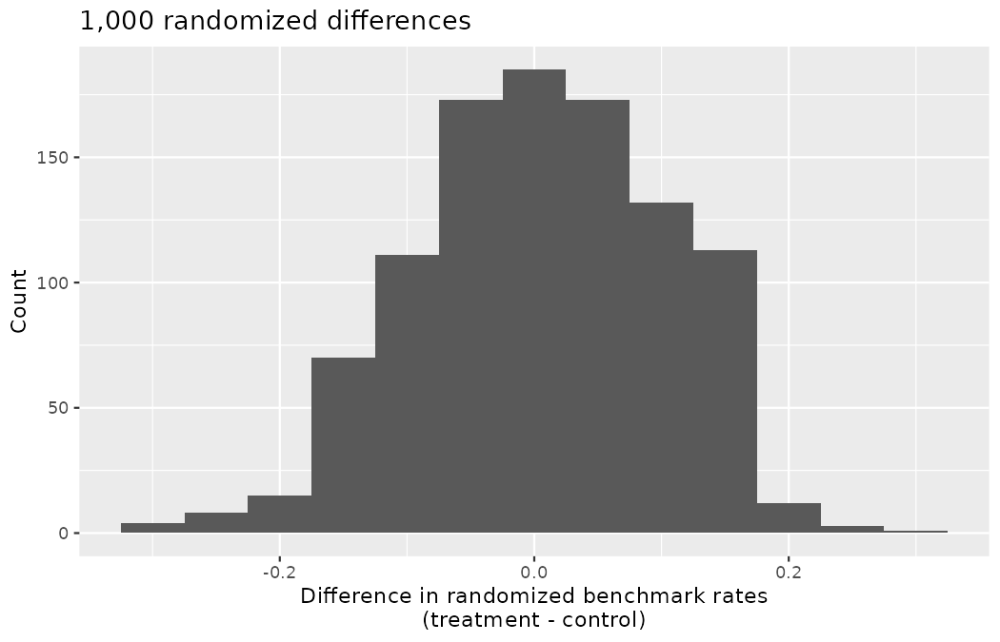
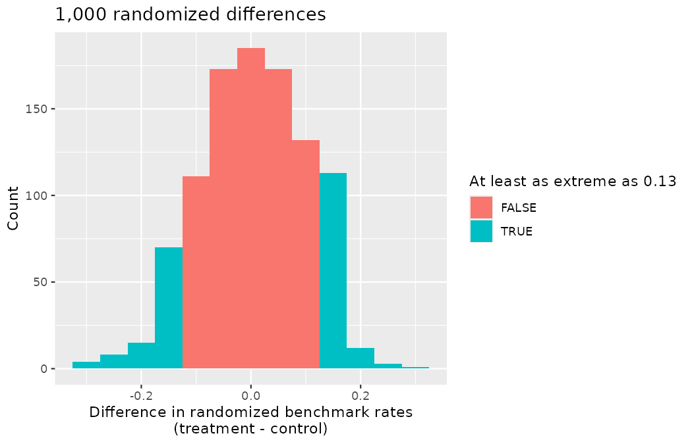

# Decision errors {#sec-foundations-decision-errors}

::: {.chapterintro}
Using data to make inferential decisions about larger populations is not a perfect process.
As seen in @sec-foundations-randomization, a small p-value typically leads the analyst to a decision to reject the null claim or hypothesis.
Sometimes, however, data can produce a small p-value when the null hypothesis is actually true and the data are just inherently variable.
Here we describe the errors which can arise in hypothesis testing, how to define and quantify the different errors, and suggestions for mitigating errors if possible.
For a scouting department, these are not abstract worries: every error type has a transfer fee, or a missed player, attached to it.
:::

Hypothesis tests are not flawless.
Just think of the transfer market: clubs sometimes commit large fees to players who never justify them, and clubs sometimes pass on players who become stars somewhere else.
Similarly, data can point to the wrong conclusion.
However, what distinguishes statistical hypothesis tests from a sporting director's gut feeling is that our framework allows us to quantify and control how often the data lead us to the incorrect conclusion.

In a hypothesis test, there are two competing hypotheses: the null and the alternative.
We make a statement about which one might be true, but we might choose incorrectly.
There are four possible scenarios in a hypothesis test, which are summarized in @tbl-fourHTScenarios.

|                                  | Reject null hypothesis | Fail to reject null hypothesis |
|:---------------------------------|:-----------------------|:-------------------------------|
| Null hypothesis is true          | Type I error           | Good decision                  |
| Alternative hypothesis is true   | Good decision          | Type II error                  |

: Four different scenarios for hypothesis tests. {#tbl-fourHTScenarios}

A **Type I error** is rejecting the null hypothesis when $H_0$ is actually true.
Since we rejected the null hypothesis in the dossier nationality and opportunity cost studies of @sec-foundations-randomization, it is possible that we made a Type I error in one or both of those studies — perhaps Northbridge's network is perfectly unbiased, and the 29.2% shortlist gap was one of those 2-in-100 shuffles that happen by chance.
This is precisely why serious clubs, like serious scientists, repeat their audits: a second run of the dossier experiment with a fresh randomization would either corroborate the finding or expose it as a fluke.
A **Type II error** is failing to reject the null hypothesis when the alternative is actually true.

::: {.callout-note title="Worked example"}
Consider a Northbridge sign/pass decision.
The skeptical default is that the prospect is *not* the upgrade the club needs $(H_0)$; the claim the scouting file sets out to demonstrate is that he is a genuine upgrade $(H_A).$
Rejecting $H_0$ means recommending the signing.
What does a Type I error represent in this context?
What does a Type II error represent?
@tbl-fourHTScenarios may be useful.

------------------------------------------------------------------------

If the club makes a Type I error, this means the prospect is not an upgrade $(H_0$ true) but the club signs him anyway — the club signs a dud, and the fee is wasted.
A Type II error means the club failed to reject $H_0$ (i.e., passed on the player) when he was in fact a genuine upgrade $(H_A$ true) — the club passes on a gem, and watches him excel for a rival.

Recall the VAR review from @sec-foundations-randomization, where $H_0$ was "the on-field call stands": there, a Type I error is overturning a correct call, and a Type II error is letting a wrong call stand.
:::

::: {.callout-tip title="Check your understanding"}
Consider the opportunity cost study from @sec-caseStudyOpportunityCost, where we concluded scouts were less likely to recommend completing a €15M signing if they were reminded that the fee could be kept for the winter window.
What would a Type I error represent in this context?

------------------------------------------------------------------------

Making a Type I error in this context would mean that reminding scouts that money not spent now can be spent later does not affect their recommendations, despite the strong evidence (the data suggesting otherwise) found in the experiment.
Notice that this does *not* necessarily mean something was wrong with the data or that we made a computational mistake.
Sometimes data simply point us to the wrong conclusion, which is why studies like Priya's are often repeated to check initial findings.
:::

::: {.callout-note title="Worked example"}
How could Marta Vidal reduce the rate at which Northbridge signs duds — the Type I error rate of the club's signing decisions?
What influence would this have on the Type II error rate?

------------------------------------------------------------------------

To lower the Type I error rate, the club might raise its standard of evidence for a signing — from "a clear edge in the data and the live reports" to "an overwhelming edge in every metric, every scout, every match watched" — so fewer duds would be signed.
However, this would also make it more difficult to sign the players who are genuinely upgrades, so the club would make more Type II errors, passing on more gems.
:::

::: {.callout-tip title="Check your understanding"}
How could Marta Vidal reduce the Type II error rate — the rate at which Northbridge passes on gems?
What influence would this have on the Type I error rate?

------------------------------------------------------------------------

To lower the Type II error rate, the club wants to sign more of the genuine upgrades.
It could lower its standard of evidence — recommend any player who looks promising after a couple of viewings.
Lowering the bar will also let more duds through, raising the Type I error rate.
:::

The example and guided practice above provide an important lesson: if we reduce how often we make one type of error, we generally make more of the other type.
There is no evidence standard that eliminates both; a club chooses where on the trade-off to sit.

## Discernibility level

The **discernibility level** provides the cutoff for the p-value which will lead to a decision of "reject the null hypothesis."
Recall from @sec-foundations-randomization that it is represented by $\alpha$ and must be fixed *before* looking at the data.
Choosing a discernibility level for a test is important in many contexts, and the traditional level is 0.05.
However, it is sometimes helpful to adjust the discernibility level based on the application.
We may select a level that is smaller or larger than 0.05 depending on the consequences of any conclusions reached from the test.

If making a Type I error is dangerous or especially costly, we should choose a small discernibility level (e.g., 0.01 or 0.001).
If we want to be very cautious about rejecting the null hypothesis, we demand very strong evidence favoring the alternative $H_A$ before we would reject $H_0.$
A marquee signing that consumes half the transfer budget is exactly such a setting: a false positive costs the club tens of millions.

If a Type II error is relatively more dangerous or much more costly than a Type I error, then we should choose a higher discernibility level (e.g., 0.10).
Here we want to be cautious about failing to reject $H_0$ when the null is actually false.
Screening free-agent trialists for the academy is such a setting: waving one more trialist through to a follow-up assessment costs a few days of coaching time, while releasing a future first-team player costs dearly.

::: {.callout-important title="Discernibility levels should reflect consequences of errors"}
The discernibility level selected for a test should reflect the real-world consequences associated with making a Type I or Type II error.
:::

::: {.callout-tip title="Check your understanding"}
Northbridge runs two kinds of decisions through hypothesis tests: (a) whether to commit €40M to a single striker, and (b) whether to invite a trialist back for a second week.
For which decision should the club use the smaller discernibility level, and why?

------------------------------------------------------------------------

Decision (a).
There, a Type I error (signing a dud) is enormously costly, so the club should demand very strong evidence — a small $\alpha$ such as 0.01.
For decision (b), the cost of a Type I error is a few days of coaching time, while a Type II error (releasing a gem) is the expensive one, so a larger $\alpha$ such as 0.10 is defensible.
:::

## Two-sided hypotheses {#sec-two-sided-hypotheses}

In @sec-foundations-randomization we explored whether prospects listed as foreign were discriminated against and whether a simple budget reminder could make scouts a little more conservative.
In these two case studies, we have actually ignored some possibilities:

-   What if prospects listed as *domestic* are actually the ones discriminated against?
-   What if the budget reminder actually makes scouts *more likely* to recommend the signing?

These possibilities weren't considered in our original hypotheses or analyses.
The disregard of the extra alternatives may have seemed natural since the data pointed in the directions in which we framed the problems.
However, there are two dangers if we ignore possibilities that disagree with our data or that conflict with our world view:

1.  Framing an alternative hypothesis simply to match the direction that the data point will generally inflate the Type I error rate.
    After all the work we have done (and will continue to do) to rigorously control the error rates in hypothesis tests, careless construction of the alternative hypotheses can disrupt that hard work.
    We will quantify exactly how much it inflates the error rate later in this chapter.

2.  If we only use alternative hypotheses that agree with our worldview, then we are going to be subjecting ourselves to **confirmation bias**, which means we are looking for data that supports our ideas.
    That is not a scientific posture — a scout who only logs the touches that flatter his favorite prospect is doing the same thing — and the discipline of this section exists precisely to guard against it.

The original hypotheses we have seen are called **one-sided hypothesis tests** because they only explored one direction of possibilities.
Such hypotheses are appropriate when we are exclusively interested in the single direction, but usually we want to consider all possibilities.
To do so, let's learn about **two-sided hypothesis tests** in the context of a new study, a training intervention run inside Jonas Beck's academy at Northbridge United.

High-repetition "reactive finishing" sessions are fashionable in academy circles: extra sessions of chaotic, first-touch finishing drills layered on top of normal training.
The hoped-for effect is sharper finishing.
But the sessions add physical load, and added load eats into recovery; a plausible outcome is that players arrive at the end-of-cycle assessment *more* fatigued and finish *worse*.
The intervention could genuinely help or genuinely hurt — which makes it the perfect setting for a two-sided test.
(This trial is distinct from the multi-academy `drill_trial` program you met in @sec-data-hello, which produced a season-end harm; treat this as a new, smaller experiment at Northbridge alone.)

Jonas ran the experiment on 90 academy forwards, drawn from across Northbridge and its partner academies — no single academy fields that many forwards.
Each player was randomly assigned to either the reactive-finishing program (treatment group, 40 players) or standard training (control group, 50 players).
The outcome variable of interest was whether the player met the club's finishing benchmark at the end-of-cycle assessment.
As always, this is a constructed Northbridge scenario — no real academy was involved — and we build the dataset in visible R code so that every number below can be reproduced (the construction is deterministic; seeds enter with the permutations that follow).

```r
library(dplyr)
library(readr)
library(tidyr)
library(ggplot2)
library(infer)

benchmark90 <- tibble(
  group   = factor(rep(c("treatment", "control"), times = c(40, 50)),
                   levels = c("treatment", "control")),
  outcome = factor(c(rep("met", 14), rep("missed", 26),
                     rep("met", 11), rep("missed", 39)),
                   levels = c("met", "missed"))
)
```

::: {.callout-note title="Worked example"}
Form hypotheses for this study in plain and statistical language.
Let $p_C$ represent the true benchmark rate of players who train normally (corresponding to the control group) and $p_T$ represent the true benchmark rate for players on the reactive-finishing program (corresponding to the treatment group).

------------------------------------------------------------------------

First decompose the new notation.
The letter $p$ without a hat is, as in @sec-foundations-randomization, a *population* proportion — the true, unobserved rate, here the rate at which players of this kind would meet the benchmark under each training regime.
The subscripts $T$ and $C$ simply name the group each parameter belongs to: treatment and control.
You have seen hatted, subscripted sample proportions such as $\hat{p}_{T}$ before; $p_T$ and $p_C$ are the population quantities those sample proportions estimate.

We want to understand whether the program is helpful or harmful.
We'll consider both of these possibilities using a two-sided hypothesis test.

-   $H_0:$ The reactive-finishing program has no overall effect on the assessment, i.e., the benchmark rates are the same in each group.
    $p_T - p_C = 0.$

-   $H_A:$ The reactive-finishing program has an impact on the assessment, either positive or negative, but not zero.
    $p_T - p_C \neq 0.$

One more symbol deserves a careful first reading: $\neq$ is "not equal to."
An alternative written with $\neq$ claims only that the difference is *some* value other than zero — it could be positive (the program helps) or negative (the program hurts) — and commits to no direction in advance.

Note that if we had done a one-sided hypothesis test, the resulting hypotheses would have been:

-   $H_0:$ The program does not have a positive overall effect, i.e., the benchmark rate in the treatment group is the same as or lower than in the control group.
    $p_T - p_C \leq 0.$

-   $H_A:$ The program has a positive impact on the assessment.
    $p_T - p_C > 0.$
:::

There were 50 players in the experiment who trained normally and 40 who followed the program.
The study results are shown in @tbl-benchmark90-summary.

```r
benchmark90 |>
  count(group, outcome) |>
  pivot_wider(names_from = outcome, values_from = n)
#> # A tibble: 2 × 3
#>   group       met missed
#>   <fct>     <int>  <int>
#> 1 treatment    14     26
#> 2 control      11     39
```

|           | met benchmark | missed benchmark | Total |
|:----------|--------------:|-----------------:|------:|
| treatment |            14 |               26 |    40 |
| control   |            11 |               39 |    50 |
| Total     |            25 |               65 |    90 |

: Results for the reactive-finishing trial. Players in the treatment group followed the new program, and players in the control group trained normally. {#tbl-benchmark90-summary}

::: {.callout-tip title="Check your understanding"}
What is the observed benchmark rate in the control group?
And in the treatment group?
Also, provide a point estimate $(\hat{p}_T - \hat{p}_C)$ for the true difference in population benchmark rates across the two groups: $p_T - p_C.$

------------------------------------------------------------------------

Observed control benchmark rate: $\hat{p}_C = \frac{11}{50} = 0.22.$
Treatment benchmark rate: $\hat{p}_T = \frac{14}{40} = 0.35.$
Observed difference: $\hat{p}_T - \hat{p}_C = 0.35 - 0.22 = 0.13.$

```r
benchmark90 |>
  group_by(group) |>
  summarize(n = n(), p_met = mean(outcome == "met"))
#> # A tibble: 2 × 3
#>   group         n p_met
#>   <fct>     <int> <dbl>
#> 1 treatment    40  0.35
#> 2 control      50  0.22
```
:::

According to the point estimate, an additional 13 percentage points of players meet the finishing benchmark when they follow the reactive-finishing program.
However, we wonder if this difference could be easily explainable by chance, if the program has no effect on the assessment.

As we did in past studies, we will simulate what type of differences we might see from chance alone under the null hypothesis.
By randomly assigning each player's assessment record to a "simulated treatment" or "simulated control" allocation, we get a new grouping — the same shuffle Priya Rao performed on the dossier cards in @sec-foundations-randomization.
If we repeat this simulation 1,000 times, we can build a **null distribution** of the differences.
Recall from @sec-foundations-mathematical that the null distribution is the sampling distribution of the statistic under the setting where the null hypothesis is true; since the null here asserts $p_T - p_C = 0,$ the distribution will be centered at zero.

```r
set.seed(1401)
benchmark90_null <- benchmark90 |>
  specify(outcome ~ group, success = "met") |>
  hypothesize(null = "independence") |>
  generate(reps = 1000, type = "permute") |>
  calculate(stat = "diff in props", order = c("treatment", "control")) |>
  mutate(stat = round(stat, 3))

benchmark90_null$stat[1:4]
#> [1]  0.040 -0.050  0.085 -0.050

ggplot(benchmark90_null, aes(x = stat)) +
  geom_histogram(binwidth = 0.05) +
  labs(
    title = "1,000 randomized differences",
    x = "Difference in randomized benchmark rates\n(treatment - control)",
    y = "Count"
  )
```

{fig-alt="A histogram of 1,000 randomized differences in benchmark rates (treatment minus control), centered at zero and roughly bell-shaped, with the simulated differences running from about -0.32 to 0.31." width=85%}

The histogram of the 1,000 shuffled differences is centered at zero and roughly bell-shaped, with the simulated differences running from $-0.32$ to $0.31.$
How unusual is the observed $+0.13$ in this null world?
We start by counting the shuffles that produced a difference at least as large:

```r
benchmark90_null |>
  summarize(
    n_extreme  = sum(stat >= 0.13),
    right_tail = mean(stat >= 0.13)
  )
#> # A tibble: 1 × 2
#>   n_extreme right_tail
#>       <int>      <dbl>
#> 1       129      0.129
```

The right tail area is $0.129.$
(Note: it is only a coincidence that the tail area lands so close to the observed difference $\hat{p}_T - \hat{p}_C = 0.13.$)
However, contrary to how we calculated the p-value in previous studies, the p-value of this test is not actually the tail area we calculated, i.e., it's not $0.129$!

The p-value is defined as the probability we observe a result at least as favorable to the alternative hypothesis as the observed difference.
In this case, any difference less than or equal to $-0.13$ would also provide equally strong evidence favoring the alternative hypothesis as a difference of $+0.13$ did.
A difference of $-0.13$ would correspond to a benchmark rate 13 percentage points *lower* in the treatment group than in the control group — the fatigue scenario, in which the added sessions actively hurt the assessment, and exactly the outcome Jonas most needs to catch.
The code below shades these differences in the left tail of the distribution as well; the two shaded tails provide a visual representation of the p-value for a two-sided test.

```r
ggplot(benchmark90_null, aes(x = stat, fill = abs(stat) >= 0.13)) +
  geom_histogram(binwidth = 0.05) +
  labs(
    title = "1,000 randomized differences",
    x = "Difference in randomized benchmark rates\n(treatment - control)",
    y = "Count",
    fill = "At least as extreme as 0.13"
  )
```

{fig-alt="The same histogram of 1,000 randomized differences, now with bars highlighted in both tails: the shuffles at or above +0.13 on the right and those at or below -0.13 on the left, a visual representation of the two-sided p-value." width=85%}

The highlighted bars now sit in both tails: the 129 shuffles at or above $+0.13$ on the right, and the 97 shuffles at or below $-0.13$ on the left.

For a two-sided test, take the single tail (in this case, $0.129$) and double it to get the p-value: $2 \times 0.129 = 0.258.$
Since this p-value is larger than $0.05,$ we do not reject the null hypothesis: the observed 13-percentage-point difference is not statistically discernible at $\alpha = 0.05.$
That is, we do not find convincing evidence that the reactive-finishing program has any influence, positive or negative, on whether a player meets the finishing benchmark.

Note how differently this ended from the `drill_trial` study of @sec-data-hello, where the multi-academy season-end data produced a harm too large to attribute to chance.
Two training interventions, two competently run experiments, two different verdicts — one rejection, one "check complete, the on-field call stands."
Both verdicts are informative, and neither is a failure of the method.

::: {.callout-tip title="Check your understanding"}
Jonas summarizes the trial for Marta Vidal as: "The experiment showed the program makes no difference, so the debate is settled."
What two corrections should Priya Rao make before this summary leaves the building?

------------------------------------------------------------------------

First, failing to reject $H_0$ is not evidence that $H_0$ is true — recall the VAR review of @sec-foundations-randomization: "check complete" does not prove the original call correct.
Second, with only 90 players, the test may simply have lacked the sensitivity to detect a real but modest effect; if the program truly helps (or hurts), this trial may have produced a Type II error.
How likely a study is to detect a genuine effect is taken up in @sec-pow.
:::

::: {.callout-important title="Default to a two-sided test"}
We want to be rigorous and keep an open mind when we analyze data and evidence.
Use a one-sided hypothesis test only if you truly have interest in only one direction.
:::

::: {.callout-important title="Computing a p-value for a two-sided test"}
First compute the p-value for one tail of the distribution, then double that value to get the two-sided p-value.
The procedure is no more complicated than that.
:::

::: {.callout-note title="Worked example"}
Consider the situation of the set-piece consultant from @sec-case-study-med-consult, whose showcase team, England, converted 13 of their 63 shots at the 2022 World Cup against a tournament baseline of $195/1494 = 0.1305.$
Now that you know about one-sided and two-sided tests, which type of test do you think is more appropriate?

------------------------------------------------------------------------

The setting has been framed in the context of the consultant being helpful — that is what his pitch to Marta Vidal claimed, and it is what pulled us toward the single "he improves finishing" direction originally.
But what if the consultant's teams actually performed *worse* than the tournament baseline?
Would Marta care?
More than ever!
Since it turns out that we care about a finding in either direction, we should run a two-sided test.

In @sec-foundations-mathematical we approximated this case's null distribution by simulating 10,000 tournaments with `rbinom()`.
The tail area can also be computed exactly, because under $H_0$ the number of goals in 63 shots follows the binomial model those simulations were drawing from; `binom.test()` reports the exact probability of scoring 13 or more of 63 shots when the true conversion rate is the baseline:

```r
binom.test(13, 63, p = 195 / 1494, alternative = "greater")$p.value
#> [1] 0.06119346
```

The one-sided p-value, computed in the consultant's claimed "beats the tournament" direction, is $0.0612.$
The p-value for the two-sided test is double that of the one-sided test: $2 \times 0.0612 = 0.1224.$
The doubling is not a technicality.
At the lenient discernibility level of $\alpha = 0.10,$ a one-sided test would have handed the consultant a statistically discernible result $(0.0612 < 0.10);$ the two-sided test that an open mind demands is no longer discernible even at that generous bar $(0.1224 > 0.10).$
The choice of alternative hypothesis was worth an entire verdict — which is precisely why it cannot be left to the person selling the signal.
:::

Generally, to find a two-sided p-value we double the single tail area, which remains a reasonable approach even when the distribution is asymmetric.
However, the approach can result in p-values larger than 1 when the point estimate is very near the mean in the null distribution; in such cases, we write that the p-value is 1.
Also, very large p-values computed in this way (e.g., 0.85) may be slightly inflated.
Doubling is a convention, not a count of both tails: in our own null distribution the left tail held 97 shuffles rather than exactly 129, so doubling gave $0.258$ where adding the two tails would have given $0.226$ — both comfortably above $0.05,$ and leading to the same conclusion.
Typically, we do not worry too much about the precision of very large p-values because they lead to the same analysis conclusion, even if the value is slightly off.

## Controlling the Type I error rate

Now that we understand the difference between one-sided and two-sided tests, we must recognize when to use each type of test.
Because of the result of increased error rates, it is never okay to change two-sided tests to one-sided tests after observing the data.
We explore the consequences of ignoring this advice using a temptation that sits inside the very data we have carried all book.

Should a scout rate first-time finishing as a strength or as a liability?
Suppose an analyst decides to let each tournament answer for itself — looking at the split first, and choosing the "natural" alternative hypothesis second.

```r
wc2022_shots <- read_csv("data/derived/wc2022_shots.csv")
weuro2025_shots <- read_csv("data/derived/weuro2025_shots.csv")

wc2022_shots |>
  group_by(first_time) |>
  summarize(shots = n(), goals = sum(goal), conversion = mean(goal))
#> # A tibble: 2 × 4
#>   first_time shots goals conversion
#>   <lgl>      <int> <int>      <dbl>
#> 1 FALSE       1026   124      0.121
#> 2 TRUE         468    71      0.152

weuro2025_shots |>
  group_by(first_time) |>
  summarize(shots = n(), goals = sum(goal), conversion = mean(goal))
#> # A tibble: 2 × 4
#>   first_time shots goals conversion
#>   <lgl>      <int> <int>      <dbl>
#> 1 FALSE        605    85      0.140
#> 2 TRUE         308    38      0.123
```

At the 2022 Men's World Cup, first-time shots converted *better*: $71/468 = 0.1517$ against $124/1026 = 0.1209$ for all other shots, a gap of $+3.1$ percentage points.
Peeking at that split, our analyst frames $H_A:$ first-time shots convert at a *higher* rate, and tests into the right tail.
At the 2025 Women's Euro, the sign appears to reverse: first-time shots converted at $38/308 = 0.1234$ against $85/605 = 0.1405$ for the rest, a gap of $-1.7$ points.
The same analyst, peeking again, now frames $H_A:$ first-time shots convert at a *lower* rate, and tests into the left tail.
Each report, read alone, looks like a disciplined one-sided test.
Read together, they reveal the procedure: whichever direction the data lean, that is the direction that gets tested — the tail is chosen *after* the coin has landed.

Such an analyst is doubly damned, and each charge deserves its own prosecution.
Take the more embarrassing charge first: the reversal they chased was never football.
Both splits were computed on *all* shots, and you know from @sec-chp11-pens-out what question that should trigger: which shots are in the frame?
A penalty kick is a placed, dead-ball strike — it cannot be logged first time — so every penalty in these data sits in the analyst's "controlled touch" bucket, converting at a rate no open-play shot approaches.
The Euro carried 51 of them, 37 from the shoot-outs alone:

```r
weuro2025_shots |>
  filter(shot_type == "Penalty") |>
  summarize(
    kicks = n(),
    shootout = sum(period == 5),
    first_time_kicks = sum(first_time),
    conversion = mean(goal)
  )
#> # A tibble: 1 × 4
#>   kicks shootout first_time_kicks conversion
#>   <int>    <int>            <int>      <dbl>
#> 1    51       37                0      0.549

weuro2025_shots |>
  filter(shot_type == "Open Play") |>
  group_by(first_time) |>
  summarize(shots = n(), goals = sum(goal), conversion = mean(goal))
#> # A tibble: 2 × 4
#>   first_time shots goals conversion
#>   <lgl>      <int> <int>      <dbl>
#> 1 FALSE        543    57      0.105
#> 2 TRUE         308    38      0.123
```

Penalties out, the Euro's gap runs $38/308 = 0.1234$ against $57/543 = 0.1050$ — first-time shots converting *better*, the same direction as the World Cup.
(The World Cup's gap survives the same filter, and in fact widens: its 64 penalties also sit in the controlled-touch bucket.)
The flip that chose our analyst's left tail was not a property of women's football or of first-time finishing; it was 51 uncontested penalty kicks propping up one bucket — precisely the artifact this book's penalty convention exists to expose.
They peeked, and what they peeked at was garbage.

The second charge is procedural, and it stands even against an analyst whose frames are impeccable: in a world where the null hypothesis is true and there is nothing to find in *any* frame, letting each dataset pick its own tail still doubles the error rate.
Such an analyst is not operating at their declared $\alpha = 0.05.$
As the next example shows, they are operating at double that.

::: {.callout-note title="Worked example"}
Using $\alpha = 0.05,$ we show that freely switching from two-sided tests to one-sided tests will lead us to make twice as many Type I errors as intended.

------------------------------------------------------------------------

Suppose we are interested in finding any difference from 0, and suppose the null hypothesis is *true by construction*: we build a world in which striking a shot first time has no association with scoring, just as the odd- and even-minute split of @sec-foundations-randomization was irrelevant by construction.
In this world, every simulated "season" delivers 468 first-time shots and 1,026 other shots — the group sizes from the real 2022 World Cup — all converting at the same true rate $p_0 = 195/1494.$
The reference null distribution below plays the role of a smooth curve of chance differences, and its 5th and 95th percentiles mark off the most extreme 5% of chance differences in each direction:

```r
n_ft <- 468
n_ot <- 1026
p_0  <- 195 / 1494

set.seed(1402)
null_ref <- tibble(
  stat = rbinom(100000, n_ft, p_0) / n_ft - rbinom(100000, n_ot, p_0) / n_ot
)

cutoffs <- null_ref |>
  summarize(
    lower = quantile(stat, 0.05),
    upper = quantile(stat, 0.95)
  )
cutoffs
#> # A tibble: 1 × 2
#>     lower  upper
#>     <dbl>  <dbl>
#> 1 -0.0306 0.0312
```

First, suppose a season's sample difference comes out larger than 0.
In a one-sided test, the peeking analyst sets $H_A:$ difference $> 0$ and rejects $H_0$ if the observed difference falls beyond the upper cutoff, since the p-value would just be the single right tail.
Thus, if $H_0$ is true, the analyst incorrectly rejects $H_0$ about 5% of the time when the sample difference is above the null value.

Then, suppose the season's difference comes out smaller than 0.
The peeking analyst now sets $H_A:$ difference $< 0$ and rejects $H_0$ if the observed difference falls below the lower cutoff.
That is, if $H_0$ is true, this situation also occurs about 5% of the time.

By examining these two scenarios, we can determine that we will make a Type I error $5\% + 5\% = 10\%$ of the time if we are allowed to swap to the "best" one-sided test for the data.
The simulation confirms the arithmetic: below, 10,000 fresh seasons are generated in the same null world, and each is tested twice — once by an honest analyst who committed *in advance* to the single direction "first-time shots convert better," and once by the peeking analyst who tests in whichever direction the season leans.

```r
seasons <- tibble(
  stat = rbinom(10000, n_ft, p_0) / n_ft - rbinom(10000, n_ot, p_0) / n_ot
)

seasons |>
  summarize(
    fixed_direction = mean(stat >= cutoffs$upper),
    peeking         = mean(stat >= cutoffs$upper | stat <= cutoffs$lower)
  )
#> # A tibble: 1 × 2
#>   fixed_direction peeking
#>             <dbl>   <dbl>
#> 1          0.0538   0.103
```

Every one of the 10,000 seasons was generated under $H_0,$ so *every* rejection here is a Type I error.
The analyst who fixed the direction in advance rejected in 5.4% of the seasons — the rate $\alpha$ promised.
The peeking analyst rejected in 10.3% of them.
That is twice the error rate we prescribed with our discernibility level — the level some texts call the **significance level**, recall @sec-foundations-randomization — of $\alpha = 0.05$!
:::

::: {.callout-important title="Hypothesis tests should be set up *before* seeing the data"}
After observing data, it is tempting to turn a two-sided test into a one-sided test.
Avoid this temptation.
Hypotheses should be set up *before* observing the data.
:::

::: {.callout-tip title="Check your understanding"}
Once the penalties are set aside, the two tournaments agree: first-time shots converted at a higher rate in both.
Does that agreement entitle an analyst at the *next* tournament to run a one-sided test in the first-time direction?
And what must be fixed before the shot logs are opened?

------------------------------------------------------------------------

No.
Agreement across two observational tournaments is a reason to *suspect* a direction, never a license to test only that direction — the open-play gaps might themselves reflect chance, or patterns particular to these competitions, and because the shot data are observational, even a rejection would speak to association, not causation.
Two things must be fixed in advance: the hypotheses — state $H_0: p_{ft} - p_{other} = 0$ and the two-sided $H_A: p_{ft} - p_{other} \neq 0$ at a pre-registered $\alpha$ — and the *frame*, stated and defended per the book's penalty convention (here: open play, penalties out, because penalties cannot be first-time shots).
Our peeking analyst failed on both counts, and each failure alone would have been enough to poison their reports.
:::

## Power {#sec-pow}

Although we won't go into extensive detail here, power is an important topic for follow-up consideration after understanding the basics of hypothesis testing.
A good power analysis is a vital preliminary step to any study, as it will inform whether the data you collect are sufficient for being able to conclude your research broadly — whether Jonas Beck's 90 players ever stood a realistic chance of settling the reactive-finishing question, or whether that trial was headed for "inconclusive" before the first session was run.

Often times in experiment planning, there are two competing considerations:

-   We want to collect enough data that we can detect important effects — a real difference in benchmark rates, a genuine bias in the network.
-   Collecting data can be expensive — in scout-hours, in travel budget — and, in experiments involving players, there may be some risk: extra sessions add physical load, and disrupted training costs development time.

When planning a study, we want to know how likely we are to detect an effect we care about.
In other words, if there is a real effect, and that effect is large enough that it has practical value, then what is the probability that we detect that effect?
This probability is called the **power**, and we can compute it for different sample sizes or different effect sizes.
For a scouting department, power is the probability that the club *notices* a genuine upgrade: that when a program really does improve finishing, or a prospect really is better than the incumbent, the data collected are sufficient to reject the null hypothesis and say so.

::: {.callout-important title="Power"}
The power of the test is the probability of rejecting the null claim when the alternative claim is true.

How easy it is to detect the effect depends on both how big the effect is (e.g., how much the training program actually improves the benchmark rate) as well as the sample size.
:::

Think of power as the probability that your analysis changes what the club does.
For a recommendation to survive contact with the sporting director, the effect behind it needs to be real!
That is, you will not become Marta Vidal's most trusted analyst by happening upon a single Type I error which rejects the null hypothesis.
Instead, your standing grows when the finding is genuine and important (that is, when the alternative hypothesis is true).
The better the intervention or the clearer the prospect's edge (i.e., the better the training program really is), the larger the *effect size* and the easier it will be for you to convince people of your finding.

Not only does the effect need to be real, but you also need to have evidence (i.e., data) that shows the effect.
A few observations (e.g., $n = 2$ trialists) is unlikely to be convincing because of well known ideas of natural variability.
Indeed, the larger the dataset which provides evidence for your claim, the more likely you are to convince Marta and Emil that the effect is real.

Although a full discussion of relative power is beyond the scope of this text, you might be interested to know that, often, paired t-tests (discussed in @sec-mathpaired) are more powerful than independent t-tests (discussed in @sec-math2samp) because the pairing — for example, measuring the same player under each of two GPS-vest vendors — reduces the inherent variability across observations.
Additionally, for roughly bell-shaped data the sample mean is less variable than the sample median, so tests based on the mean tend to be more powerful in that setting; for heavily skewed or outlier-prone data — chance quality among them — the comparison can reverse, which is one reason robust alternatives exist.
That is to say, reducing variability (done in different ways depending on the experimental design and set-up of the analysis) makes a test more powerful in that the data are more likely to reject the null hypothesis.

::: {.callout-tip title="Check your understanding"}
Jonas wants the next reactive-finishing trial to have a better chance of reaching a verdict.
Name two legitimate ways to raise the power of the test — and one illegitimate way to manufacture more rejections.

------------------------------------------------------------------------

Legitimate: increase the sample size (enroll forwards from partner academies as well, so a real difference in benchmark rates is harder for chance to bury), and increase the effect size or reduce the variability (run the program for a full cycle so its true effect, if any, has time to show; measure the outcome with less noise; use designs such as pairing, coming in @sec-mathpaired).
Illegitimate: raising $\alpha$ after the fact, or switching to the one-sided test the data prefer.
Both produce more rejections — but by inflating the Type I error rate, not by improving the study.
:::

### Power, simulated {#sec-power-simulated}

A warning that a trial "may lack sensitivity" is worth little to Marta Vidal unless the club can put a number on the sensitivity.
This book's method, whenever a probability matters, has been to simulate it — and power *is* a probability: the probability of rejecting $H_0$ when the alternative is true.
So let us compute the power Jonas's trial actually had.

To simulate "the alternative is true," we must first commit to *how* true, because power is always computed against a specific effect size.
Take the rates the trial itself observed: suppose the reactive-finishing program genuinely lifts the benchmark rate from $0.22$ to $0.35.$
An entire trial can then be simulated in two `rbinom()` draws — 40 treatment players who each meet the benchmark with probability $0.35,$ and 50 control players at $0.22.$
To test each simulated trial we use the mathematical shortcut of @sec-foundations-mathematical rather than a full 1,000-shuffle permutation inside every one of 1,000 trials: standardize the simulated difference by the standard error it would have under $H_0,$ computed from the *pooled* benchmark rate — all simulated successes over all 90 players, the best single estimate of a common rate, a computation @sec-inference-two-props will treat formally — and reject when the resulting $Z$ statistic lands beyond $\pm 1.96,$ the two-sided $\alpha = 0.05$ cutoff of @sec-foundations-mathematical.
Repeat 1,000 times, count the rejections, and the power appears:

```r
set.seed(1403)
rejections <- replicate(1000, {
  p_t <- rbinom(1, 40, 0.35) / 40
  p_c <- rbinom(1, 50, 0.22) / 50
  p_pool <- (40 * p_t + 50 * p_c) / 90
  se_0 <- sqrt(p_pool * (1 - p_pool) * (1 / 40 + 1 / 50))
  abs(p_t - p_c) / se_0 >= 1.96
})

mean(rejections)
#> [1] 0.263
```

The power is $0.263.$
Sit with that number: *even if the program truly works, and works this well* — a 13-percentage-point lift in benchmark rates — a trial of 40 against 50 players detects it barely one time in four.
In nearly three of every four such worlds, the trial ends exactly as Jonas's did: "not statistically discernible."
The inconclusive verdict of @sec-two-sided-hypotheses was not bad luck; it was the expected outcome of the design.

Now flip the question, which is the question a power analysis should answer *before* any study begins: how many players would the trial need for a respectable chance of detecting this same effect?
The conventional benchmark is a power of $0.80.$
Wrap the simulation in a function of the per-arm sample size — with equal arms, the pooled rate collapses to the simple average of the two simulated rates — and rerun it along a grid; `sapply()` below calls `power_at()` once per sample size:

```r
power_at <- function(n) {
  mean(replicate(1000, {
    p_t <- rbinom(1, n, 0.35) / n
    p_c <- rbinom(1, n, 0.22) / n
    p_pool <- (p_t + p_c) / 2
    se_0 <- sqrt(p_pool * (1 - p_pool) * (2 / n))
    abs(p_t - p_c) / se_0 >= 1.96
  }))
}

set.seed(1404)
power_by_n <- tibble(
  n_per_arm = c(100, 150, 200),
  power = sapply(n_per_arm, power_at)
)
power_by_n
#> # A tibble: 3 × 2
#>   n_per_arm power
#>       <dbl> <dbl>
#> 1       100 0.553
#> 2       150 0.711
#> 3       200 0.821
```

Reaching a power of $0.80$ for this effect takes roughly 200 players per arm — 400 forwards in total, more than four times the trial Jonas ran, and more academy forwards than Northbridge and its partner academies together can field.
A trial that could actually settle the reactive-finishing question is a federation-level undertaking, and that is precisely the information Marta needs *before* committing a season to it.
Jonas's trial was never going to settle it — and a few lines of simulation say so in advance, which is what this section's opening warning about power analysis was for.

::: {.callout-tip title="Check your understanding"}
The simulation above fixed the true effect at the rates the trial happened to observe, $0.22$ versus $0.35.$
If the program's true effect were smaller — say a lift from $0.22$ to $0.28$ — would the power at each sample size be higher or lower?
And why should the observed $0.35$ itself be handled with care?

------------------------------------------------------------------------

Lower: a smaller true difference is easier for chance variation to bury, so at every sample size a smaller effect means less power (and a larger required sample for the same power).
The observed $0.35$ came from just 40 players and is itself a noisy estimate — recall the striker's wandering seasons of @sec-data-hello — so $0.263$ is the power *against that particular alternative*, not a property of the trial alone.
A careful power analysis reports the calculation for a range of plausible effect sizes.
:::

## Chapter review {#sec-chp14-review}

### Summary

Although hypothesis testing provides a strong framework for making decisions based on data, as the analyst, you need to understand how and when the process can go wrong.
That is, always keep in mind that the conclusion to a hypothesis test may not be right!
Sometimes when the null hypothesis is true, we will accidentally reject it and commit a Type I error — the club signs a dud; even the dossier audit of @sec-foundations-randomization, whose rejection looked so convincing, could in principle have been one of those 2-in-100 chance shuffles.
Sometimes when the alternative hypothesis is true, we will fail to reject the null hypothesis and commit a Type II error — the club passes on a gem, as Jonas's inconclusive reactive-finishing trial may have done.
The discernibility level should be chosen by weighing which error costs the club more, and the hypotheses — two-sided by default — must be fixed *before* the data are seen: an analyst who lets each dataset pick its own one-sided alternative operates at double the declared Type I error rate.
The power of the test quantifies how likely it is to obtain data which will reject the null hypothesis when indeed the alternative is true; the power of the test is increased when larger sample sizes are taken.

### Terms

The terms introduced in this chapter are presented below, alphabetized.
If you're not sure what some of these terms mean, we recommend you go back in the text and review their definitions.
You should be able to easily spot them as **bolded text**.

|  |  |  |
|:-----------------------|:-----------------------|:----------------------|
| confirmation bias | one-sided hypothesis test | two-sided hypothesis test |
| discernibility level | power | Type I error |
| null distribution | significance level | Type II error |

: Terms introduced in this chapter. {#tbl-terms-chp-14}

## Exercises {#sec-chp14-exercises}

Answers to odd-numbered exercises can be found in [Appendix -@sec-exercise-solutions-14]. Final answers to the even-numbered exercises are in [Appendix -@sec-appendix-even-answers].

::: {.exercises}

:::

------------------------------------------------------------------------

Adapted from *Introduction to Modern Statistics* by Çetinkaya-Rundel & Hardin (CC BY-SA 4.0); this adaptation is likewise CC BY-SA 4.0. Match data: StatsBomb open data.
