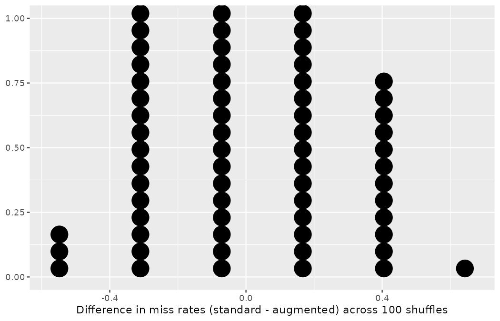

# Applications: Foundations {#sec-foundations-applications}

You have spent four chapters assembling the machinery of statistical inference: the randomization test in @sec-foundations-randomization, the bootstrap confidence interval in @sec-foundations-bootstrapping, the mathematical shortcut through the normal model in @sec-foundations-mathematical, and, in @sec-foundations-decision-errors, the honest accounting of how often each of these can lead the club astray.
As promised back in @sec-data-applications, every part of this book closes with an applications chapter: no new formulas, no new notation — instead a consolidation, a case study worked end to end, and a walkthrough for you to repeat at your own keyboard.
This chapter does exactly that for the foundations of inference.

## Recap: Foundations {#sec-foundations-sec-summary}

In the foundations of inference chapters, we have provided three different methods for statistical inference.
We will continue to build on all three of the methods throughout the book, and by the end, you should have an understanding of the similarities and differences between them.
Meanwhile, it is important to note that the methods are designed to mimic variability with data, and we know that variability can come from different sources (e.g., random sampling vs. random allocation — recall @tbl-randsampValloc, the scope-of-inference table of @sec-data-design).
In @tbl-foundations-summary, we have summarized some of the ways the inferential procedures feature specific sources of variability.
We hope that you refer back to the table often as you dive more deeply into inferential ideas in future chapters.

| Question | Randomization | Bootstrapping | Mathematical models |
|:------------------|:------------------|:------------------|:------------------|
| What does it do? | Shuffles the explanatory variable to mimic the natural variability found in a randomized experiment | Resamples (with replacement) from the observed data to mimic the sampling variability found by collecting data from a population | Uses theory (primarily the Central Limit Theorem) to describe the hypothetical variability resulting from either repeated randomized experiments or random samples |
| What is the random process described? | Randomized experiment — a Northbridge intervention, like the dossier audit of @sec-caseStudySexDiscrimination | Random sampling from a population — the shots a scout's schedule happens to capture | Randomized experiment or random sampling |
| What other random processes can be approximated? | Can also be used to describe random sampling in an observational study — the permutation tests on tournament shots in @sec-chp11-observational | Can also be used to describe random allocation in an experiment | Can also be used to describe random sampling in an observational study or random allocation in an experiment |
| What is it best for? | Hypothesis testing (can also be used for confidence intervals, but not covered in this book) | Confidence intervals (can also be used for bootstrap hypothesis testing for one proportion as well) | Quick analyses through, for example, calculating a $Z$ score |
| What physical object represents the simulation process? | Shuffling Priya Rao's decision cards | Drawing trialist verdicts from a bag with replacement | Not applicable |

: Summary and comparison of randomization, bootstrapping, and mathematical models as inferential statistical methods. {#tbl-foundations-summary}

You might have noticed that the word *distribution* is used throughout this part (and will continue to be used in future chapters).
A distribution always describes variability, but sometimes it is worth reflecting on *what* is varying.
Typically the distribution either describes how the observations vary or how a statistic varies.
But even when describing how a statistic varies, there is a further consideration with respect to the study design, e.g., does the statistic vary from random sample to random sample, or does it vary from random allocation to random allocation?
The methods presented in this book (and used in science generally) are typically used interchangeably across ideas of random samples or random allocations of the treatment.
Often, the two different analysis methods will give equivalent conclusions.
The most important thing to consider is how to contextualize the conclusion in terms of the problem — whether Marta Vidal may read it as a statement about a tournament, about a causal intervention, or about neither.
See @tbl-randsampValloc to confirm that your conclusions are appropriate.

Below, we synthesize the different types of distributions discussed throughout the book.
Reading through the different definitions and solidifying your understanding will help as you come across these distributions in future chapters, and you can always return back here to refresh your understanding of the differences between the various distributions.

::: {.callout-important title="Distributions"}
-   A **data distribution** describes the shape, center, and variability of the **observed data**.

    This can also be referred to as the **sample distribution**, but we'll avoid that phrase as it sounds too much like sampling distribution, which is different.

-   A **population distribution** describes the shape, center, and variability of the entire **population of data**.

    Except in very rare circumstances of very small, very well-defined populations, this is never observed.

-   A **sampling distribution** describes the shape, center, and variability of all possible values of a **sample statistic** from samples of a given sample size from a given population.

    Since the population is never observed, it's never possible to observe the true sampling distribution either.
    However, when certain conditions hold, the Central Limit Theorem (@sec-CLTsection) tells us what the sampling distribution is.

-   A **randomization distribution** describes the shape, center, and variability of all possible values of a **sample statistic** from random allocations of the treatment variable.

    We computationally generate the randomization distribution, though usually, it's not feasible to generate the full distribution of all possible values of the sample statistic, so we instead generate a large number of them.
    Almost always, by randomly allocating the treatment variable, the randomization distribution describes the null hypothesis, i.e., it is centered at the null hypothesized value of the parameter.

-   A **bootstrap distribution** describes the shape, center, and variability of all possible values of a **sample statistic** from resamples of the observed data.

    We computationally generate the bootstrap distribution, though usually, it's not feasible to generate all possible resamples of the observed data, so we instead generate a large number of them.
    Since bootstrap distributions are generated by randomly resampling from the observed data, they are centered at the sample statistic.
    Bootstrap distributions are most often used for estimation, i.e., we base confidence intervals off of them.
:::

### The five distributions, one question

Definitions harden into understanding when you watch all five distributions arise from a single question, so let us pose one the club has carried since @sec-data-hello: what fraction of shots score?
One bookkeeping decision first, and it is the one @sec-chp11-pens-out made unforgettable: *which shots are in the frame?*

```r
library(dplyr)
library(tidyr)
library(readr)
library(ggplot2)
library(infer)

wc2022_shots <- read_csv("data/derived/wc2022_shots.csv")

wc2022_shots |>
  summarize(shots = n(), goals = sum(goal), conversion = mean(goal))
#> # A tibble: 1 × 3
#>   shots goals conversion
#>   <int> <int>      <dbl>
#> 1  1494   195      0.131

wc2022_shots |>
  filter(shot_type == "Open Play") |>
  summarize(shots = n(), goals = sum(goal), conversion = mean(goal))
#> # A tibble: 1 × 3
#>   shots goals conversion
#>   <int> <int>      <dbl>
#> 1  1382   150      0.109

wc2022_shots |>
  filter(shot_type == "Penalty") |>
  summarize(kicks = n(), shootout_kicks = sum(period == 5))
#> # A tibble: 1 × 2
#>   kicks shootout_kicks
#>   <int>          <int>
#> 1    64             41
```

The 2022 Men's World Cup converted $195/1494 = 0.1305$ of all shots — a figure that includes the 64 penalty kicks (41 of them shoot-out kicks) converting at rates no open-play chance approaches — and $150/1382 = 0.1085$ of open-play shots.
Per this book's penalty convention, we state the frame every time we quote either number.
For the first four illustrations below we treat *all 1,494 shots* as our population, penalties in and flagged, because the book's canonical 50-shot sample was drawn from that frame in @sec-data-hello; the fifth illustration works open-play, for the reason @sec-chp11-pens-out taught.

**The population distribution.**
For a binary variable, the population distribution is not a sweeping curve but two spikes: among all 1,494 shots, 195 scored and 1,299 did not.

```r
wc2022_shots |>
  count(goal)
#> # A tibble: 2 × 2
#>   goal      n
#>   <lgl> <int>
#> 1 FALSE  1299
#> 2 TRUE    195
```

Here we enjoy a luxury the definition warns is almost never available: because StatsBomb logged the entire tournament, this population *is* observed, and the parameter $p = 0.1305$ is known exactly.
That luxury is precisely what makes the tournament such a good training ground — we can simulate the scout's predicament while knowing the truth the scout cannot see.

**The data distribution.**
A scout does not see 1,494 shots; a scout sees a sample.
Recall `shots50` from @sec-data-hello — 50 shots drawn at random from the tournament, seeded so every reader holds the identical sample:

```r
set.seed(101)
shots50 <- wc2022_shots |>
  slice_sample(n = 50)

shots50 |>
  summarize(shots = n(), goals = sum(goal), p_hat = mean(goal))
#> # A tibble: 1 × 3
#>   shots goals p_hat
#>   <int> <int> <dbl>
#> 1    50     7  0.14
```

The data distribution is the distribution of these 50 observed outcomes — 7 goals, 43 shots that did not score — and it yields the sample statistic $\hat{p} = 7/50 = 0.14.$
Close to $p = 0.1305,$ but not equal to it, and with no way of knowing *how* close from inside the sample.

**The sampling distribution.**
How far does $\hat{p}$ tend to sit from $p$?
Since we hold the full population, we can do what no scout ever can: draw a thousand different 50-shot samples and watch the statistic vary from random sample to random sample.

```r
set.seed(1502)
sample_props <- wc2022_shots |>
  rep_slice_sample(n = 50, reps = 1000) |>
  summarize(p_hat = mean(goal))

sample_props |>
  print(n = 4)
#> # A tibble: 1,000 × 2
#>   replicate p_hat
#>       <int> <dbl>
#> 1         1  0.1
#> 2         2  0.1
#> 3         3  0.14
#> 4         4  0.24
#> # ℹ 996 more rows

sample_props |>
  summarize(mean_p_hat = mean(p_hat), sd_p_hat = sd(p_hat))
#> # A tibble: 1 × 2
#>   mean_p_hat sd_p_hat
#>        <dbl>    <dbl>
#> 1      0.131   0.0487
```

One sample gave $0.10,$ another $0.24$ — individual scouts can be badly misled — yet the thousand estimates together center at $0.131,$ essentially the true $p,$ with a standard deviation of $0.0487.$
That standard deviation is what @sec-foundations-mathematical named the standard error of $\hat{p},$ and the mound-shaped pile of $\hat{p}$ values is exactly the bell the Central Limit Theorem promised.
Note the sleight of hand we were only able to perform because this population is a rare observable one: in real scouting work, the sampling distribution can never be computed directly.

**The bootstrap distribution.**
The scout holding only `shots50` cannot rerun the tournament, but @sec-foundations-bootstrapping showed the next best thing: resample the 50 shots, with replacement, and let the sample stand proxy for the population.

```r
set.seed(1503)
shots50_boot <- shots50 |>
  mutate(result = if_else(goal, "goal", "no goal")) |>
  specify(response = result, success = "goal") |>
  generate(reps = 1000, type = "bootstrap") |>
  calculate(stat = "prop")

shots50_boot |>
  summarize(mean_p_boot = mean(stat), sd_p_boot = sd(stat))
#> # A tibble: 1 × 2
#>   mean_p_boot sd_p_boot
#>         <dbl>     <dbl>
#> 1       0.141    0.0498
```

Set the two simulations side by side, because the comparison is the whole lesson.
The bootstrap distribution is centered at $0.141$ — the sample statistic $\hat{p} = 0.14,$ *not* the parameter $p = 0.1305$ — so it cannot tell the scout where the truth is.
But its spread, $0.0498,$ is a serviceable stand-in for the true standard error of $0.0487$ that only our omniscient simulation could compute.
The bootstrap borrows the *variability* of the unobservable sampling distribution while inheriting the *center* of the sample — which is precisely why @sec-foundations-bootstrapping used it for confidence intervals rather than for testing.

**The randomization distribution.**
The first four distributions concerned one proportion; the randomization distribution enters when a *comparison* is on trial and we need to know how large a gap chance alone produces.
We rerun the final test of @sec-chp11-pens-out — conversion under pressure versus not, in the open-play frame where the question honestly lives ($\hat{p}_{prs} - \hat{p}_{nop} = 0.1008 - 0.1101 = -0.0093$ on the observed data):

```r
wc2022_shots |>
  filter(shot_type == "Open Play") |>
  group_by(under_pressure) |>
  summarize(shots = n(), goals = sum(goal), conversion = mean(goal))
#> # A tibble: 2 × 4
#>   under_pressure shots goals conversion
#>   <lgl>          <int> <int>      <dbl>
#> 1 FALSE           1144   126      0.110
#> 2 TRUE             238    24      0.101

set.seed(1504)
pressure_null_open <- wc2022_shots |>
  filter(shot_type == "Open Play") |>
  mutate(
    pressure = if_else(under_pressure, "pressured", "not pressured"),
    result   = if_else(goal, "goal", "no goal")
  ) |>
  specify(result ~ pressure, success = "goal") |>
  hypothesize(null = "independence") |>
  generate(reps = 1000, type = "permute") |>
  calculate(stat = "diff in props",
            order = c("pressured", "not pressured")) |>
  mutate(stat = round(stat, 4))

pressure_null_open |>
  summarize(
    center    = round(mean(stat), 4),
    n_extreme = sum(stat <= -0.0093),
    p_value   = mean(stat <= -0.0093)
  )
#> # A tibble: 1 × 3
#>   center n_extreme p_value
#>    <dbl>     <int>   <dbl>
#> 1 -0.001       420    0.42
```

Unlike the bootstrap distribution (centered at the statistic) and the sampling distribution (centered at the parameter), the randomization distribution is centered at the *null value*: $-0.001,$ which is zero up to simulation noise, because the shuffle severs any link between label and outcome by construction.
Notice also that this run's p-value, $0.42,$ differs from the $0.385$ that @sec-chp11-pens-out obtained on the same data with a different seed.
Neither number is wrong: each is a simulation-based *estimate* of the same tail probability, built from 1,000 of the astronomically many possible shuffles rather than all of them — exactly the caveat the definitions above kept repeating.
The two runs disagree by a few hundredths and agree completely about the verdict: nowhere near any discernibility bar anyone uses.

::: {.callout-tip title="Check your understanding"}
Of the five distributions just illustrated, which are centered at the parameter $p,$ which at the sample statistic $\hat{p},$ and which at the null value?
And which of the five could a working scout — no census, no omniscience — actually compute?

------------------------------------------------------------------------

The population distribution is the parameter's home, and the sampling distribution of $\hat{p}$ is centered at $p.$
The data distribution and the bootstrap distribution are centered at (and built from) the sample, $\hat{p}.$
The randomization distribution is centered at the null hypothesized value — zero, for a difference in proportions.
A working scout can compute the data distribution, the bootstrap distribution, and the randomization distribution, all of which need only the observed data.
The population and sampling distributions require the population itself, which is why the bootstrap and the Central Limit Theorem exist: each is a route to the sampling distribution's *shape and spread* without ever observing it.
:::

## Case study: the augmented-report trial {#sec-case-study-malaria-vaccine}

In this case study, we consider a question Marta Vidal has been pressing all season: should Northbridge United roll out the new xG-augmented report template across the entire scouting network, or is the old template just as good?
Priya Rao answered with the club's favorite instrument — a randomized experiment.
During the club's mid-season assessment week, the 20 attending scouts were each handed an identical evidence pack on the same five shortlisted strikers — the same footage, the same match logs — and asked to submit a ranking of the five.
The scouts were randomized into one of two experiment groups: 14 scouts received the pack with the *xG-augmented template*, whose derived pages summarize chance quality, shot-mix, and conversion in the style this book has been building since @sec-data-hello, and 6 scouts received the pack with the club's *standard template*, carrying traditional footage notes and box-score counts only.
(Priya weighted the allocation toward the augmented arm deliberately: if the club adopts it, she wants the larger share of the network already practiced on it.)

Separately, the club's expert panel — Marta, Emil Sørensen, and the senior analysts, working with the full data and unlimited time — produced a reference ranking of the same five strikers.
The outcome recorded for each scout is whether their submitted ranking agreed with the panel's on the top three strikers, in order: a *hit* if it did, a *miss* if it did not.

::: {.callout-note title="Data"}
The `report20` data are constructed for this case study in the seeded code below.
This is a Northbridge scenario — no real scouting network was tested — and, as always in this book, every number in this section can be reproduced from the visible code.
:::

The results are summarized in @tbl-report20-obs: 9 of the 14 augmented-template scouts produced a ranking that hit the panel's, while all 6 of the scouts in the standard-template group missed.

```r
report20 <- tibble(
  template = factor(rep(c("augmented", "standard"), times = c(14, 6)),
                    levels = c("augmented", "standard")),
  ranking  = factor(c(rep("hit", 9), rep("miss", 5),   # 14 augmented-template scouts
                      rep("miss", 6)),                 # 6 standard-template scouts
                    levels = c("hit", "miss"))
)

report20 |>
  count(template, ranking, .drop = FALSE) |>
  pivot_wider(names_from = ranking, values_from = n)
#> # A tibble: 2 × 3
#>   template    hit  miss
#>   <fct>     <int> <int>
#> 1 augmented     9     5
#> 2 standard      0     6
```

|           | hit | miss | Total |
|:----------|----:|-----:|------:|
| augmented |   9 |    5 |    14 |
| standard  |   0 |    6 |     6 |
| Total     |   9 |   11 |    20 |

: Summary results for the augmented-report trial. {#tbl-report20-obs}

::: {.callout-tip title="Check your understanding"}
Is this an observational study or an experiment?
What implications does the study type have on what can be inferred from the results?

------------------------------------------------------------------------

The study is an experiment, as scouts were randomly assigned an experiment group (remember, every scout judged the identical evidence pack).
Since this is an experiment, the results can be used to evaluate a *causal* relationship between the report template and whether a scout's ranking matched the expert panel — contrast this with the tournament shot data, where nothing is assigned and only association can be claimed.
:::

### Variability within data

In this study, a smaller proportion of scouts who worked from the augmented template missed the panel's ranking (35.7% versus 100%).
However, the sample is very small, and it is unclear whether the difference provides *convincing evidence* that the template helps.

```r
report20 |>
  group_by(template) |>
  summarize(n = n(), p_miss = mean(ranking == "miss"))
#> # A tibble: 2 × 3
#>   template      n p_miss
#>   <fct>     <int>  <dbl>
#> 1 augmented    14  0.357
#> 2 standard      6  1
```

::: {.callout-note title="Worked example"}
Statisticians and data scientists are sometimes called upon to evaluate the strength of evidence.
When looking at the rates of missed rankings in the two groups of this trial, what comes to mind as we try to determine whether the data show convincing evidence of a real difference?

------------------------------------------------------------------------

The observed miss rates (35.7% for the augmented-template group versus 100% for the standard-template group) suggest the augmented template may be effective.
However, we cannot be sure if the observed difference represents the template's effect or if there is no effect and the observed difference is just from random chance.
Generally there is a little bit of fluctuation in sample data, and we wouldn't expect the sample proportions to be *exactly* equal, even if the truth was that the miss rate was independent of the template — the odd- and even-minute split of @sec-foundations-randomization proved that much.
Additionally, with such small samples, perhaps it's common to observe such large differences when we randomly split a group due to chance alone!
:::

This example is a reminder that the observed outcomes in a data sample may not perfectly reflect the true relationships between variables, since there is **random noise**.
While the observed difference in miss rates is large, the sample size for the trial is small, making it unclear if this observed difference represents a real effect of the template or whether it is simply due to chance.
We label these two competing claims, $H_0$ and $H_A$ — the hypothesis notation you have carried since @sec-foundations-randomization:

-   $H_0$: **Independence model.** The variables `template` and `ranking` are independent.
    They have no relationship, and the observed difference between the proportion of scouts who missed the panel's ranking in the two groups, 64.3%, was due to chance.

-   $H_A$: **Alternative model.** The variables are *not* independent.
    The difference in miss rates of 64.3% was not due to chance.
    Here (because an experiment was done), if the difference in miss rates is not due to chance, it was the template that affected whether a scout's ranking matched the panel.

Writing the observed difference in the notation of @sec-foundations-randomization, with the subscripts naming the groups:

$$\hat{p}_{std} - \hat{p}_{aug} = \frac{6}{6} - \frac{5}{14} = 1.000 - 0.357 = 0.643$$

What would it mean if the independence model, which says the template had no influence on the rankings, is true?
It would mean 11 scouts were going to miss the panel's ranking *no matter which template they were randomized to*, and 9 scouts were going to hit it *no matter which template they were randomized to*.
That is, if the template did not affect the outcome, the difference in miss rates was due to chance alone in how the scouts were randomized.

Now consider the alternative model: the miss rate was influenced by which template a scout worked from.
If this was true, and especially if this influence was substantial, we would expect to see some difference in the miss rates of scouts in the two groups.

We choose between these two competing claims by assessing if the data conflict so much with $H_0$ that the independence model cannot be deemed reasonable.
If this is the case, and the data support $H_A,$ then we will reject the notion of independence and conclude the augmented template was effective.

### Simulating the study

We're going to implement **simulation** under the setting where we will pretend we know that the augmented template being tested does *not* work.
Ultimately, we want to understand if the large difference we observed in the data is common in these simulations that represent independence.
If it is common, then maybe the difference we observed was purely due to chance.
If it is very uncommon, then the possibility that the template made the difference seems more plausible.

@tbl-report20-obs shows that 11 scouts missed the panel's ranking and 9 hit it.
For our simulation, we will suppose the outcomes were independent of the template and we were able to *rewind* back to the morning Priya randomized the scouts.
If she happened to randomize them differently, we may get a different result in this hypothetical world where the template does not influence the ranking.
Let's complete another **randomization** using a simulation.

In this **simulation**, we take 20 notecards to represent the 20 scouts, where we write down "miss" on 11 cards and "hit" on 9 cards.
In this hypothetical world, we believe each scout who missed the panel's ranking was going to miss it regardless of which group they were in, so let's see what happens if we randomly assign the scouts to the two template groups again.
We thoroughly shuffle the notecards and deal 14 into an "augmented" pile and 6 into a "standard" pile.
Priya performed exactly one such deal by hand; the code below records it, seeded so that you can reproduce her shuffle exactly, and the result is tabulated in @tbl-report20-rand-1.

```r
set.seed(1501)
report20_shuffle_1 <- report20 |>
  mutate(ranking = sample(ranking))

report20_shuffle_1 |>
  count(template, ranking, .drop = FALSE) |>
  pivot_wider(names_from = ranking, values_from = n)
#> # A tibble: 2 × 3
#>   template    hit  miss
#>   <fct>     <int> <int>
#> 1 augmented     8     6
#> 2 standard      1     5
```

|           | hit | miss | Total |
|:----------|----:|-----:|------:|
| augmented |   8 |    6 |    14 |
| standard  |   1 |    5 |     6 |
| Total     |   9 |   11 |    20 |

: Simulation results, where any difference in miss rates is purely due to chance. {#tbl-report20-rand-1}

::: {.callout-tip title="Check your understanding"}
What is the difference in miss rates between the two simulated groups in @tbl-report20-rand-1?
How does this compare to the observed 64.3% difference in the actual data?

------------------------------------------------------------------------

$5/6 - 6/14 = 0.833 - 0.429 = 0.405,$ or about 40.5% in favor of the augmented template.
This difference, produced by chance alone, is smaller than the difference observed in the actual groups $(0.643 > 0.405)$ — though note how large a gap the shuffle produced from nothing: with stacks of only 14 and 6 cards, chance differences run big, which is exactly why this study demands a careful simulation before any conclusion.
:::

### Independence between treatment and outcome

We computed one possible difference under the independence model in the previous Check your understanding, which represents one difference due to chance, assuming there is no template effect.
While in this first simulation Priya physically dealt out notecards to represent the scouts, it is more efficient to perform the simulation using a computer.

Repeating the simulation on a computer, we get another difference due to chance:

$$\frac{3}{6} - \frac{8}{14} = -0.071$$

And another:

$$\frac{4}{6} - \frac{7}{14} = 0.167$$

And so on until we repeat the simulation enough times to create a *distribution of differences that could have occurred if the null hypothesis was true* — a randomization distribution, in the vocabulary of this chapter's recap.
The **infer** pipeline you learned in @sec-foundations-randomization — *specify* the response, explanatory variable, and success; *hypothesize* independence; *generate* shuffles; *calculate* the statistic — automates the notecards.
Here are 100 randomizations, seeded to pick up Priya's hand-dealt shuffle as the first:

```r
set.seed(1501)
report20_null <- report20 |>
  specify(ranking ~ template, success = "miss") |>
  hypothesize(null = "independence") |>
  generate(reps = 100, type = "permute") |>
  calculate(stat = "diff in props", order = c("standard", "augmented")) |>
  mutate(stat = round(stat, 3))

report20_null$stat[1:4]
#> [1]  0.405 -0.071  0.167 -0.310
```

A stacked dot plot of these 100 simulated differences (standard-template miss rate minus augmented-template miss rate) is drawn by the code below.

```r
ggplot(report20_null, aes(x = stat)) +
  geom_dotplot(binwidth = 0.05) +
  labs(
    x = "Difference in miss rates (standard - augmented) across 100 shuffles",
    y = NULL
  )
```

{fig-alt="A stacked dot plot of 100 simulated differences in miss rates (standard minus augmented), piling up on six distinct values from -0.548 to 0.643. The tallest stacks hug zero, and exactly one simulation reaches the observed 0.643." width=85%}

The 100 dots pile up on just six distinct values, from $-0.548$ up to $0.643.$
That coarseness is no accident: with 6 cards in one stack and 14 in the other, moving a single "miss" card between stacks changes the difference by $1/6 + 1/14 \approx 0.238,$ so the statistic can only jump in steps that size.
The tallest stacks sit at $-0.071$ and $0.167,$ hugging zero; exactly one of the 100 simulations reached a difference as large as the observed $0.643:$

```r
report20_null |>
  summarize(
    n_extreme = sum(stat >= 0.643),
    prop_extreme = mean(stat >= 0.643)
  )
#> # A tibble: 1 × 2
#>   n_extreme prop_extreme
#>       <int>        <dbl>
#> 1         1         0.01
```

Note that the distribution of these simulated differences is centered around 0.
We simulated these differences assuming that the independence model was true, and under this condition, we expect the difference to be near zero with some random fluctuation, where *near* is pretty generous in this case since the sample sizes are so small in this study.

::: {.callout-note title="Worked example"}
How often would you observe a difference of at least 64.3% $(0.643)$ according to the simulation we just ran?
Often, sometimes, rarely, or never?

------------------------------------------------------------------------

It appears that a difference of at least 64.3% due to chance alone would only happen about 1% of the time according to our 100 simulations — one shuffle in a hundred reached it.
Such a low probability indicates a rare event.
(If you compare against the arithmetic of @sec-caseStudySexDiscrimination, where a same-sized simulation produced 2 extreme shuffles in 100, remember that a count this small is itself a noisy estimate — a different seed can easily return 1, 2, or 3.
What no seed will return is 40.)
:::

The difference of 64.3% being a rare event suggests two possible interpretations of the results of the trial:

-   $H_0$: **Independence model.** The template has no effect on whether a ranking matches the panel, and we just happened to observe a difference that would only occur on a rare occasion.

-   $H_A$: **Alternative model.** The template has an effect on the outcome, and the difference we observed was actually due to the xG-augmented pages steering the scouts toward the panel's reading of the five strikers, which explains the large difference of 64.3%.

Based on the simulations, we have two options.
(1) We conclude that the trial results do not provide strong evidence against the independence model.
That is, we do not have sufficiently strong evidence to conclude the template had an effect.
(2) We conclude the evidence is sufficiently strong to reject $H_0$ and assert that the augmented template was useful.
When we conduct formal studies, usually we reject the notion that we just happened to observe a rare event.
So in this case, we reject the independence model in favor of the alternative: the data provide strong evidence that the xG-augmented template improved the scouts' agreement with the expert panel — and because the template was randomly assigned, the claim is causal.
One honesty about what was demonstrated, before the conclusion travels: the outcome scored agreement with the club's own expert panel — a panel working from the same derived numbers the augmented template carries — so the trial shows the template moves scouts toward Northbridge's reference process, not that it moves them toward ground truth about the five strikers, which no panel can certify.

You have, of course, met all of this machinery formally by now, so let us close the case study in the vocabulary the last four chapters built.
The 1-in-100 count is a p-value of $0.01$ for the one-sided alternative we tested; at the customary discernibility level of $\alpha = 0.05,$ the result is statistically discernible.
Had we followed the more skeptical two-sided default of @sec-two-sided-hypotheses — Marta should arguably entertain the possibility that drowning scouts in derived numbers makes their rankings *worse* — we would double the tail to $2 \times 0.01 = 0.02,$ and the conclusion would survive.
And per @sec-foundations-decision-errors, a rejection is never a certainty: there remains a small probability that Priya's trial produced a Type I error, the scouting equivalent of signing a dud — a possibility the club controls, but never eliminates, by its choice of $\alpha.$

One field of statistics, statistical inference, is built on evaluating whether such differences are due to chance.
In statistical inference, data scientists evaluate which model is most reasonable given the data.
Errors do occur, just like rare events, and we might choose the wrong model.
While we do not always choose correctly, statistical inference gives us tools to control and evaluate how often decision errors occur — that was the entire business of @sec-foundations-decision-errors.

## Interactive walkthrough: the foundations, on the second tournament {#sec-foundations-tutorials}

Reading a consolidated recap is not the same as running one.
So, as in @sec-data-applications, here is yours: Priya Rao hands you the 2025 Women's Euro file and asks you to exercise every foundation from this part of the book on the second tournament.
Work through the four lessons below at your keyboard; each ends with a question whose answer follows immediately — try to answer before you read on.
One frame declaration up front, made once so the lessons need not repeat it: the Euro logged 913 shots with 123 goals — an all-shots conversion of $123/913 = 0.1347,$ with the tournament's 51 penalty kicks included — against $95/851 = 0.1116$ in the open-play frame; the lessons below work *open-play* throughout.

```r
weuro2025_shots <- read_csv("data/derived/weuro2025_shots.csv")

weuro2025_shots |>
  summarize(shots = n(), goals = sum(goal), conversion = mean(goal))
#> # A tibble: 1 × 3
#>   shots goals conversion
#>   <int> <int>      <dbl>
#> 1   913   123      0.135

weuro2025_shots |>
  filter(shot_type == "Penalty") |>
  summarize(kicks = n(), shootout_kicks = sum(period == 5))
#> # A tibble: 1 × 2
#>   kicks shootout_kicks
#>   <int>          <int>
#> 1    51             37

weuro_open <- weuro2025_shots |>
  filter(shot_type == "Open Play")

weuro_open |>
  summarize(shots = n(), goals = sum(goal), conversion = mean(goal))
#> # A tibble: 1 × 3
#>   shots goals conversion
#>   <int> <int>      <dbl>
#> 1   851    95      0.112
```

### Lesson 1: sampling variability

Send two scouts to the same tournament and their logs will differ — the opening claim of @sec-foundations-randomization, which you can now watch happen.
Give each of two simulated scouts a random 50-shot sample of the Euro's open play:

```r
set.seed(1505)
weuro_open |>
  rep_slice_sample(n = 50, reps = 2) |>
  summarize(shots = n(), goals = sum(goal), p_hat = mean(goal))
#> # A tibble: 2 × 4
#>   replicate shots goals p_hat
#>       <int> <int> <int> <dbl>
#> 1         1    50     6  0.12
#> 2         2    50     5  0.1
```

Scout one reports a conversion of $0.12,$ scout two reports $0.10,$ and the tournament's true open-play figure is $0.1116.$
Neither scout is wrong; each holds one draw from the sampling distribution you built for the World Cup in the recap.

::: {.callout-tip title="Check your understanding"}
Name the distribution that each of the following describes: the 851 open-play outcomes; scout one's 50 outcomes; the collection of $\hat{p}$ values from every 50-shot sample the tournament could yield.

------------------------------------------------------------------------

The population distribution (observable here only because we hold a census of the tournament); a data distribution; the sampling distribution of $\hat{p}$ for $n = 50.$
:::

### Lesson 2: randomization test

@sec-foundations-decision-errors left a test conspicuously un-run.
Its peeking analyst saw first-time shots convert *worse* at the Euro on all shots — the reversal that turned out to be 51 penalty kicks sitting in the controlled-touch bucket — and we exposed the artifact without ever testing the honest frame.
Do it now, properly: open-play frame, and the two-sided alternative that discipline demands when no direction is fixed in advance.

```r
weuro_open |>
  group_by(first_time) |>
  summarize(shots = n(), goals = sum(goal), conversion = mean(goal))
#> # A tibble: 2 × 4
#>   first_time shots goals conversion
#>   <lgl>      <int> <int>      <dbl>
#> 1 FALSE        543    57      0.105
#> 2 TRUE         308    38      0.123
```

-   $H_0:$ Among open-play shots at the 2025 Women's Euro, `first_time` and `goal` are independent; the observed difference of $38/308 - 57/543 = 0.1234 - 0.1050 = 0.0184$ is chance.
-   $H_A:$ The variables are associated (either direction).

```r
set.seed(1506)
first_time_null <- weuro_open |>
  mutate(
    timing = if_else(first_time, "first time", "controlled"),
    result = if_else(goal, "goal", "no goal")
  ) |>
  specify(result ~ timing, success = "goal") |>
  hypothesize(null = "independence") |>
  generate(reps = 1000, type = "permute") |>
  calculate(stat = "diff in props", order = c("first time", "controlled")) |>
  mutate(stat = round(stat, 4))

first_time_null |>
  summarize(
    n_extreme  = sum(stat >= 0.0184),
    right_tail = mean(stat >= 0.0184)
  )
#> # A tibble: 1 × 2
#>   n_extreme right_tail
#>       <int>      <dbl>
#> 1       233      0.233
```

Following the convention of @sec-two-sided-hypotheses, double the single tail: the two-sided p-value is $2 \times 0.233 = 0.466.$
At $\alpha = 0.05$ — at any $\alpha$ a club would defend — this is not statistically discernible: shuffled decks produce a timing gap of 1.8 points nearly half the time.
The complete story of the Euro's first-time "effect", told in one breath: the all-shots reversal was a penalty artifact, and the honest-frame gap is comfortably within chance.
There is, on this evidence, nothing here — and saying so crisply is as much a deliverable as any discovery.
Remember, too, what kind of test this was: `first_time` is not assigned by anyone, so even a rejection would have claimed association, not causation — this is the permutation-test side of the footnote in @sec-caseStudySexDiscrimination.

### Lesson 3: errors in hypothesis testing

Lesson 2 ended in a failure to reject, and @sec-foundations-decision-errors taught you to hold two thoughts about such a verdict at once.

::: {.callout-tip title="Check your understanding"}
(a) If first-time timing genuinely does move conversion at the margin, what kind of error did Lesson 2's test just commit, and what is the scouting cost?
(b) Suppose an analyst had instead peeked at the open-play split, seen first-time shots ahead, and run the one-sided test in that direction, reporting $p = 0.233.$ What is wrong with the report?

------------------------------------------------------------------------

(a) A Type II error — the passing-on-a-gem direction of the decision table.
With a real but modest effect, a test on 851 shots may simply lack the power (@sec-pow) to detect it; "not discernible" is a verdict about the evidence, never a demonstration that $H_0$ is true.
Check complete, the on-field call stands — which is not the same as the call being proven correct.
(b) The direction was chosen *after* seeing the data.
An analyst who lets each dataset pick its tail operates at roughly double their declared Type I rate — the $5\% + 5\% = 10\%$ arithmetic of @sec-foundations-decision-errors — so the honest report either fixes the direction before looking or doubles the tail, as we did.
:::

### Lesson 4: parameters and confidence intervals

Testing asks *whether*; estimating asks *how much* — and the estimating side of the foundations was @sec-foundations-bootstrapping's.
Here the census luxury pays off one last time: the parameter a scout would normally never see, the Euro's open-play conversion, is known to be $p = 0.1116,$ so we can watch a confidence interval try to capture a truth we can verify.
Give a scout a 100-shot random sample and let the bootstrap do its work:

```r
set.seed(1507)
scout_sample <- weuro_open |>
  slice_sample(n = 100)

scout_sample |>
  summarize(shots = n(), goals = sum(goal), p_hat = mean(goal))
#> # A tibble: 1 × 3
#>   shots goals p_hat
#>   <int> <int> <dbl>
#> 1   100    10   0.1

set.seed(1508)
scout_boot <- scout_sample |>
  mutate(result = if_else(goal, "goal", "no goal")) |>
  specify(response = result, success = "goal") |>
  generate(reps = 1000, type = "bootstrap") |>
  calculate(stat = "prop")

scout_boot |>
  summarize(
    lower = quantile(stat, 0.025),
    upper = quantile(stat, 0.975)
  )
#> # A tibble: 1 × 2
#>   lower upper
#>   <dbl> <dbl>
#> 1  0.04  0.16
```

The scout's point estimate is $\hat{p} = 10/100 = 0.10;$ the 95% bootstrap percentile interval, read off the middle 95% of the 1,000 resampled proportions as in @sec-ConfidenceIntervals, runs from $0.04$ to $0.16.$
This particular interval does capture the true $p = 0.1116$ — and the width is the honest price of 100 shots: the plausible range spans a factor of four, from set-piece-drought bad to elite.

::: {.callout-tip title="Check your understanding"}
A colleague summarizes the result as "there is a 95% chance the Euro's open-play conversion is between 0.04 and 0.16."
This tournament's truth happens to be known — but restate the correct interpretation for the usual case where it is not.

------------------------------------------------------------------------

The confidence is in the *procedure*, not the single interval: across a career of intervals built this way, about 95% will capture the parameter they aim at.
Any one interval either captures it or does not — this one did — and the parameter is not a random quantity with a probability of being anywhere.
Recall the interpretation discipline of @sec-foundations-mathematical.
:::

## Lab: the corner-kick question, end to end {#sec-foundations-labs}

To further apply the concepts from this part of the book, run one complete inference — unguided this time — on a claim the club has circled twice already.
In @sec-tapperscasestudy, the coaching staff's faith in corners collided with a bootstrap interval; what that chapter never did is *test* the gap.
Your materials:

```r
wc2022_shots |>
  mutate(possession = if_else(play_pattern == "From Corner",
                              "corner possession", "other possession")) |>
  group_by(possession) |>
  summarize(shots = n(), goals = sum(goal), conversion = mean(goal))
#> # A tibble: 2 × 4
#>   possession        shots goals conversion
#>   <chr>             <int> <int>      <dbl>
#> 1 corner possession   223    17     0.0762
#> 2 other possession   1271   178     0.140
```

Work through the full procedure and write up what you find as if reporting to Marta Vidal:

1.  State the parameter of interest and the hypotheses, in symbols and in words. Per @sec-two-sided-hypotheses, default to the two-sided alternative — and if you argue for one-sided, commit to the direction *before* step 3.
2.  Decide which shots belong in the frame, and defend the decision. Two traps from earlier chapters apply: recall from @sec-data-applications that `play_pattern` records how the *possession* started, not how the chance was created; and recall where this dataset files its penalty kicks — which side of this comparison are they propping up? Rerun the summary under `shot_type == "Open Play"` before choosing.
3.  Run the permutation test with 1,000 shuffles (seed of your choice, stated) in *both* frames, penalties in and penalties out, per the book's penalty convention. Report both two-sided p-values. Do the two frames deliver the same verdict at $\alpha = 0.05$? If not, which number goes in the report, and what do you say about the other?
4.  Estimate as well as test: bootstrap a 95% percentile interval for the corner-possession conversion in your chosen frame, and compare it with the interval and the coaching-staff intuition of @sec-tapperscasestudy.
5.  Close the report the way @sec-foundations-decision-errors taught: state whether your conclusion is causal or associational and why; name the error type you most risk given your verdict; and say what it would cost Northbridge — a dud signed, or a gem passed over.

## Chapter review {#sec-chp15-review}

### Summary

This chapter introduced no new methods, no new notation, and no new vocabulary.
Its work was consolidation — the three inferential engines of @tbl-foundations-summary, the five distributions and their centers, and one randomized trial carried from notecards to a causal verdict.
If any step felt unfamiliar, the place to look is not ahead but back: @sec-foundations-randomization for the shuffling logic, @sec-foundations-bootstrapping for the resampling logic, @sec-foundations-mathematical for the normal shortcut, and @sec-foundations-decision-errors for what can go wrong.
From the next chapter onward, we put these foundations to work on the full catalog of scouting questions — one proportion, two proportions, means, tables, and models — and the machinery will already be in your hands.

### Terms

No new terms were introduced in this chapter.
The terms below did the consolidation's work; all were introduced and defined in @sec-foundations-randomization through @sec-foundations-decision-errors, and you should be able to recognize each one in the case study and walkthrough above.
If any feel unfamiliar, go back and review their definitions in those chapters.

|  |  |  |
|:-----------------------|:-----------------------|:----------------------|
| bootstrap distribution | permutation test | sampling distribution |
| confidence interval | population distribution | standard error |
| data distribution | randomization distribution | Type I error |
| p-value | randomization test | Type II error |

: Terms revisited in this chapter. {#tbl-terms-chp-15}

------------------------------------------------------------------------

Adapted from *Introduction to Modern Statistics* by Çetinkaya-Rundel & Hardin (CC BY-SA 4.0); this adaptation is likewise CC BY-SA 4.0. Match data: StatsBomb open data.
