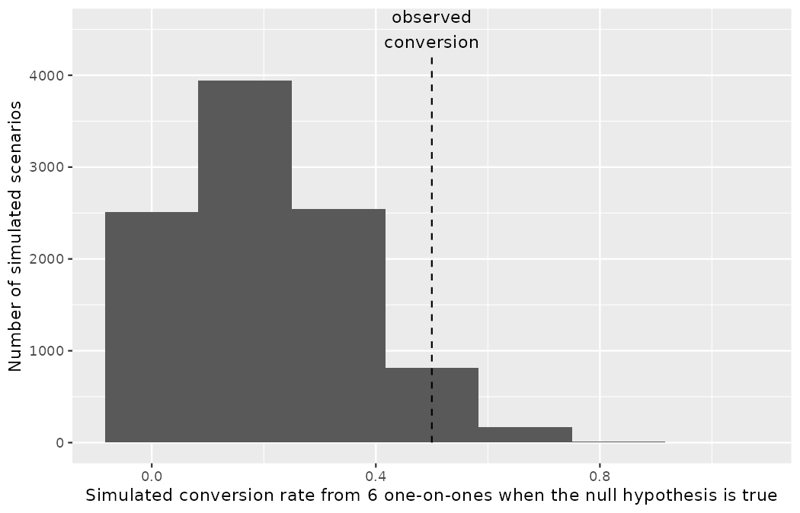
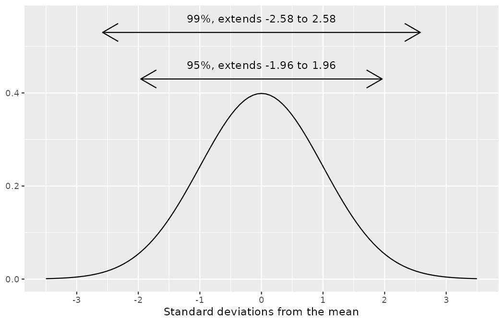
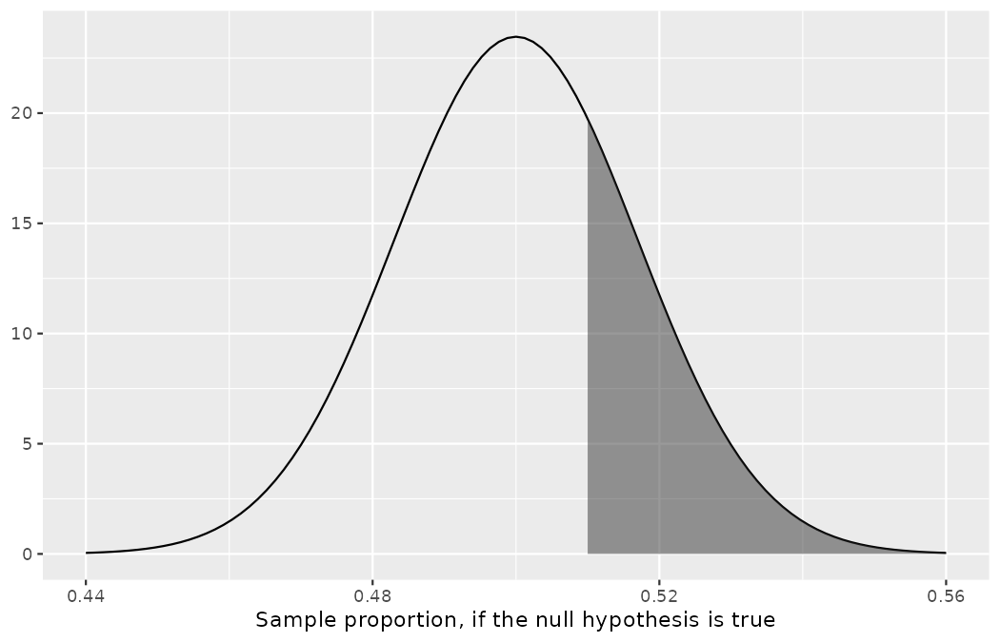

# Inference for a single proportion {#sec-inference-one-prop}

::: {.chapterintro}
Focusing now on statistical inference for categorical data, we will revisit many of the foundational aspects of hypothesis testing from [Chapter -@sec-foundations-randomization].

The three data structures we detail are one binary variable, summarized using a single proportion; two binary variables, summarized using a difference of two proportions; and two categorical variables, summarized using a two-way table.
When appropriate, each of the data structures will be analyzed using the three methods from [Chapter -@sec-foundations-randomization], [Chapter -@sec-foundations-bootstrapping], and [Chapter -@sec-foundations-mathematical]: randomization test, bootstrapping, and mathematical models, respectively.

As we build on the inferential ideas, we will visit new foundational concepts in statistical inference.
For example, we will cover the conditions for when a normal model is appropriate and how to choose the confidence level for a confidence interval, and we will lean on the two error rates of [Chapter -@sec-foundations-decision-errors] whenever a verdict is on the line.
:::

We encountered inference methods for a single proportion in [Chapter -@sec-foundations-bootstrapping], exploring point estimates and confidence intervals.
In this chapter, we'll do a review of these topics and get a sense of how large a sample must be before the mathematical shortcuts of [Chapter -@sec-foundations-mathematical] can be trusted in single proportion contexts.

Note that there is only one variable being measured in a study which focuses on one proportion.
For each observational unit, the single variable is measured as either a success or failure (e.g., "goal" vs. "no goal", "report filed on time" vs. "late").
Recall the promise made in a footnote of @sec-caseStudyOpportunityCost: a **success** is simply the outcome the analysis counts, not necessarily the outcome the club hopes for — Northbridge's medical staff may well define "failing the injury screen" as the success in a screening study.
Because the nature of the research question at hand focuses on only a single variable, there is not a way to randomize the variable across a different (explanatory) variable.
For this reason, we will not use randomization as an analysis tool when focusing on a single proportion.
Instead, we will apply bootstrapping techniques to test a given hypothesis, and we will also revisit the associated mathematical models.

## Bootstrap test for a proportion {#sec-one-prop-null-boot}

The bootstrap simulation concept when $H_0$ is true is similar to the ideas used in the case studies presented in [Chapter -@sec-foundations-bootstrapping], where we bootstrapped without an assumption about $H_0.$ Because we will be testing a hypothesized value of $p$ (referred to as $p_0,$ the null value first met informally in @sec-casemed), the bootstrap simulation for hypothesis testing has a fantastic advantage: it can be used for *any* sample size (a huge benefit for small samples, a nice alternative for large samples).

The set-piece consultant of @sec-case-study-med-consult has already been through the full arc — interval estimate in [Chapter -@sec-foundations-bootstrapping], a failed normal approximation in @sec-casemed, a doubled p-value in @sec-two-sided-hypotheses.
In this chapter, a new pitch of the same species lands on Marta Vidal's desk, and this time the sample is so small that only the simulation approach survives.

### Observed data

Player agents assemble sales pitches the way set-piece consultants do: find a striking number, attach your client to it, and let the club fill in the causality.
An agent has approached Marta Vidal marketing her client, Youssef En-Nesyri, Morocco's centre forward at the 2022 World Cup.
Her claim: "Put my striker through on goal and he does not miss — and he has made Morocco the best one-on-one side in world football. They scored half their one-on-ones at a World Cup that scores one in five."
To be clear about what is real and what is constructed here: the shots are real — every number below is computed from the 2022 World Cup data — but the agent and her pitch are our invention, built to give the testing problem a scouting-decision stake, exactly as the consultant of @sec-case-study-med-consult was.

Start with the number her whole pitch leans on: the tournament's one-on-one conversion rate.[^ch16-1]

[^ch16-1]: The `one_on_one` flag marks shots where the shooter faced only the goalkeeper.
    As the `shot_type` breakdown shows, the tag is applied literally: the 2022 data include 6 penalty kicks and 2 direct corners among the 85 one-on-ones — which is precisely why the frame of any "one-on-one" headline number must be inspected before it is quoted.

```r
library(dplyr)
library(tidyr)
library(readr)
library(ggplot2)

wc2022_shots <- read_csv("data/derived/wc2022_shots.csv")

wc2022_shots |>
  filter(one_on_one) |>
  summarize(shots = n(), goals = sum(goal), conversion = mean(goal))
#> # A tibble: 1 × 3
#>   shots goals conversion
#>   <int> <int>      <dbl>
#> 1    85    17        0.2
```

Seventeen of the tournament's 85 one-on-ones were scored: $17/85 = 0.20,$ the agent's "one in five."
But this book's penalty convention, drilled in since @sec-chp11-pens-out, demands one question before that baseline is accepted: *which shots are in the frame?*

```r
wc2022_shots |>
  filter(one_on_one) |>
  group_by(shot_type) |>
  summarize(shots = n(), goals = sum(goal), conversion = mean(goal))
#> # A tibble: 3 × 4
#>   shot_type shots goals conversion
#>   <chr>     <int> <int>      <dbl>
#> 1 Corner        2     0      0
#> 2 Open Play    77    17      0.221
#> 3 Penalty       6     0      0
```

Six of the 85 one-on-ones are penalty kicks, and — for once — the penalty artifact points *downward*: all six were missed, as were the two direct corners the data also tag as one-on-ones, so stripping the dead balls out *raises* the baseline, from $17/85 = 0.200$ to an open-play rate of $17/77 = 0.221.$
In @sec-chp11-pens-out, penalties propped a conversion rate up; here they drag one down.
The convention is not "penalties inflate" — it is *show the comparison both ways and state the frame you are using*.
We will test against the agent's own quoted baseline, $p_0 = 0.20,$ penalties in: it is the tournament's headline one-on-one rate, and — because it is the *lower* of the two baselines — it is also the easier bar for her claim to clear, so a claim that fails against $0.20$ fails against $0.221$ *a fortiori*.
We flag the open-play rerun at the end of the section.

Now the other half of her pitch.
Morocco's one-on-one record is real:

```r
wc2022_shots |>
  filter(one_on_one, team == "Morocco") |>
  summarize(shots = n(), goals = sum(goal), conversion = mean(goal))
#> # A tibble: 1 × 3
#>   shots goals conversion
#>   <int> <int>      <dbl>
#> 1     6     3        0.5
```

Morocco took 6 one-on-ones (all of them open play — no penalties to argue about on this side of the comparison) and scored 3: $\hat{p} = 3/6 = 0.50,$ against a tournament that scored at $0.20.$
So far the pitch checks out arithmetically.
But look at who took them:

```r
wc2022_shots |>
  filter(one_on_one, team == "Morocco") |>
  count(player)
#> # A tibble: 5 × 2
#>   player                n
#>   <chr>             <int>
#> 1 Achraf Dari           1
#> 2 Noussair Mazraoui     1
#> 3 Romain Saïss          1
#> 4 Youssef En-Nesyri     2
#> 5 Zakaria Aboukhlal     1
```

The six one-on-ones belong to five different players.
The agent's client took exactly two of them (scoring one) — his personal tournament record is 2 goals from 11 shots in total, far too few shots of any kind to test anything about him individually.
The number her pitch actually rests on is a *team* statistic.

::: {.callout-note title="Worked example"}
Using the data, is it possible to assess the agent's claim that her striker lifts a team's one-on-one finishing above tournament level?

------------------------------------------------------------------------

No.
The claim is that there is a causal connection, but the data are observational — nobody randomly assigned strikers to teams.
And in this case the attribution problem is visible in the data before we even reach for the confounding argument of @sec-data-design: her client took only two of the six one-on-ones that make up "Morocco's" record, so the statistic she quotes measures an attacking unit of five players (and the chances the tournament happened to serve them), not her striker.

While it is not possible to assess the causal claim, it is still possible to test for an association using these data.
For this question we ask, could the high conversion rate of $\hat{p} = 0.50$ have simply occurred by chance, if Morocco's true one-on-one conversion rate does not differ from the tournament baseline?
:::

::: {.callout-tip title="Check your understanding"}
Write out hypotheses in both plain and statistical language to test for the association between Morocco's one-on-one finishing and the true one-on-one conversion rate, $p,$ for the process generating Morocco's one-on-ones.

------------------------------------------------------------------------

$H_0:$ There is nothing special about Morocco's one-on-one finishing; the team converts one-on-ones at the tournament baseline.
In statistical language, $p = 0.20.$
$H_A:$ Morocco's one-on-ones are converted at a rate higher than the tournament's 20%, i.e., $p > 0.20.$
:::

Because, as it turns out, the conditions for working with the normal distribution are not met (see @sec-one-prop-norm), the uncertainty associated with the sample proportion should not be modeled using the normal distribution, as doing so would misrepresent the uncertainty associated with the sample statistic.
However, we would still like to assess the hypotheses from the previous Check your understanding in absence of the normal framework.
To do so, we need to evaluate the possibility of a sample value $(\hat{p})$ as far *above* the null value, $p_0 = 0.20,$ as what was observed.
The deviation of the sample value from the hypothesized parameter is usually quantified with a p-value.

The p-value is computed based on the null distribution, which is the distribution of the test statistic if the null hypothesis is true.
Supposing the null hypothesis is true, we can compute the p-value by identifying the probability of observing a test statistic that favors the alternative hypothesis at least as strongly as the observed test statistic.
Here we will use a bootstrap simulation to calculate the p-value.

### Variability of the statistic

We want to identify the sampling distribution of the test statistic $(\hat{p})$ if the null hypothesis was true.
In other words, we want to see the variability we can expect from sample proportions if the null hypothesis was true.
Then we plan to use this information to decide whether there is enough evidence to reject the null hypothesis.

Under the null hypothesis, 20% of one-on-ones are scored.
Suppose this rate was really no different for Morocco — for the whole process generating Morocco's one-on-one chances, not just the 6 the tournament happened to produce.
If this was the case, we could *simulate* 6 one-on-ones to get a sample proportion for the conversion rate from the null distribution.
Simulating observations using a hypothesized null parameter value is often called a **parametric bootstrap simulation**, but we will refer to it descriptively as "simulating under the null hypothesis claim."

::: {.callout-tip title="Check your understanding"}
In [Chapter -@sec-foundations-bootstrapping], the bootstrap resampled the observed shots themselves; here the simulated shots will instead be drawn using the null value $p_0 = 0.20.$ Why can't we resample Morocco's six observed one-on-ones to build the distribution a hypothesis test needs?
And what does the center of each kind of distribution tell you?

------------------------------------------------------------------------

A hypothesis test asks how surprising the observed $\hat{p}$ would be *in the null hypothesis's world*, so the simulated data must be generated with the null's success probability: the resulting null distribution is centered at $p_0 = 0.20.$
Resampling the observed data can only ever reproduce the world of the data — a bootstrap distribution centered near $\hat{p} = 0.50$ — which is exactly what *estimation* wants (it shows how far sample proportions wander from the one observed, giving an interval for $p$), but it can never say how rare $\hat{p} = 0.50$ would be if $p$ were really $0.20.$
The two centers name the two jobs: bootstrap distributions center at the estimate and serve confidence intervals; null distributions center at $p_0$ and serve tests.
:::

Similar to the process described in [Chapter -@sec-foundations-bootstrapping], each one-on-one can be simulated using a bag of marbles with 20% red marbles and 80% white marbles.
Sampling a marble from the bag (with 20% red marbles) is one way of simulating whether a chance is scored *if the true conversion rate is 20%* — and, as the corner-kick case study of @sec-tapperscasestudy showed, `rbinom()` performs exactly these draws for us.
If we draw 6 marbles and then compute the proportion of simulated one-on-ones that were scored, the resulting sample proportion is a sample from the null distribution.

This simulated statistic gets its own symbol, and since the notation is new, take it apart before using it: in $\hat{p}_{sim},$ the letter $p$ names a proportion; the hat says it was computed from data rather than known (recall @sec-foundations-randomization); and the subscript $sim$ says the data it was computed from are a *simulated* sample, drawn under the null hypothesis claim, rather than a sample anyone observed.
Where several simulations need telling apart, we number them: $\hat{p}_{sim1}$ is the proportion from the first simulated sample.

```r
set.seed(1602)
rbinom(1, 6, 0.20)
#> [1] 0
```

The first simulated set of six one-on-ones produced no goals at all: $\hat{p}_{sim1} = 0/6 = 0.$
One redraw of the same six chances swung the conversion rate from the $0.50$ Morocco posted to $0.00$ — a first hint of how violently proportions computed from six observations can swing.

::: {.callout-note title="Worked example"}
Is this one simulation enough to determine whether we should reject the null hypothesis?

------------------------------------------------------------------------

No.
To assess the hypotheses, we need to see a distribution of many values of $\hat{p}_{sim},$ not just a *single* draw from this sampling distribution.
:::

### Observed statistic vs. null statistics

One simulation isn't enough to get a sense of the null distribution; many simulation studies are needed.
Roughly 10,000 seems sufficient.
However, paying someone to draw 60,000 marbles by hand is a waste of Marta's budget.
Instead, simulations are typically programmed into a computer, which is much more efficient.
The code below re-runs the same seeded stream, this time asking for all 10,000 simulated six-shot sets at once (so the first simulation is the same 0-goal set you just watched), and tabulates the results.

```r
set.seed(1602)
one_on_one_sim <- tibble(p_sim = rbinom(10000, 6, 0.20) / 6)

one_on_one_sim |>
  count(p_sim)
#> # A tibble: 7 × 2
#>   p_sim     n
#>   <dbl> <int>
#> 1 0      2513
#> 2 0.167  3939
#> 3 0.333  2545
#> 4 0.5     817
#> 5 0.667   171
#> 6 0.833    13
#> 7 1         2
```

With only 6 shots per simulation, $\hat{p}_{sim}$ can take just seven values, $0/6$ through $6/6.$
The histogram below shows the results of the 10,000 simulated records; the proportions that are equal to or greater than $\hat{p} = 0.50$ represent sample proportions under the null distribution that provide at least as much evidence as $\hat{p}$ favoring the alternative hypothesis.

```r
ggplot(one_on_one_sim, aes(x = p_sim)) +
  geom_histogram(binwidth = 1 / 6, center = 0) +
  annotate("segment", x = 0.5, xend = 0.5, y = 0, yend = 4200,
           linetype = "dashed") +
  annotate("text", x = 0.5, y = 4500, label = "observed\nconversion") +
  labs(
    x = "Simulated conversion rate from 6 one-on-ones when the null hypothesis is true",
    y = "Number of simulated scenarios"
  )
```

{fig-alt="Histogram of 10,000 simulated conversion rates from six one-on-ones when the null hypothesis is true, with seven bars that peak at 1/6 and collapse quickly toward 1. A dashed line marks the observed conversion of 0.50; everything at or to the right of it favors the alternative hypothesis." width=85%}

The figure shows seven bars, one per attainable value of $\hat{p}_{sim}$: heights 2,513 at $0,$ 3,939 at $1/6,$ 2,545 at $2/6,$ then a fast collapse — 817 at $3/6,$ 171 at $4/6,$ 13 at $5/6,$ and just 2 simulated records in 10,000 in which all six were scored.
The dashed line marks the observed $\hat{p} = 0.50,$ and everything at or to the right of it is the region favoring the alternative hypothesis.

```r
one_on_one_sim |>
  summarize(
    n_extreme = sum(p_sim >= 0.5),
    p_value   = mean(p_sim >= 0.5)
  )
#> # A tibble: 1 × 2
#>   n_extreme p_value
#>       <int>   <dbl>
#> 1      1003   0.100
```

There were 1,003 simulated sample proportions with $\hat{p}_{sim} \geq 0.50.$ We use these to construct the null distribution's right-tail area and find the p-value:

$$\text{right tail area} = \frac{\text{Number of observed simulations with }\hat{p}_{sim} \geq 0.50}{10000}$$

One new piece of notation makes tail statements like this compact, and it will follow us for the rest of the book, so take it apart on first use.
We write $P(\hat{p}_{sim} \geq 0.50)$ for the quantity just described: the capital letter $P$ names a *probability*; the parentheses hold an *event* — a statement that can come true or not, here "a simulated sample proportion lands at 0.50 or above"; and the whole expression reads "the probability that $\hat{p}_{sim}$ is at least $0.50.$"
Our 10,000 simulations estimate this probability as

$$P(\hat{p}_{sim} \geq 0.50) \approx \frac{1003}{10000} = 0.1003$$

Since the hypothesis test is one-sided, the estimated p-value is equal to this tail area: $0.100.$

::: {.callout-tip title="Check your understanding"}
Because the estimated p-value is $0.100,$ which is larger than the discernibility level $0.05,$ we cannot reject the null hypothesis.
Explain what this means in plain language in the context of the problem.

------------------------------------------------------------------------

There is not enough evidence to reject the null hypothesis in favor of the alternative hypothesis.
We cannot conclude that there is evidence that Morocco's true one-on-one conversion rate is higher than the tournament's 20% baseline.
That said, we also cannot conclude that there is evidence that it is *lower* than 20%.
When the p-value is larger than the discernibility level, we are unable to make conclusions about the research statement — a 3-of-6 record simply cannot separate "best one-on-one side in world football" from "ordinary side that got six chances and a coin's worth of luck."
:::

::: {.callout-tip title="Check your understanding"}
Does the conclusion in the previous Check your understanding imply that the agent's striker is *not* an elite one-on-one finisher?
Explain.

------------------------------------------------------------------------

Not at all.
There is no evidence to make a claim in either direction, so we cannot make any claims about the striker — and recall that Morocco's team record was never a clean measurement of him in the first place: he took two of the six chances.
What the analysis does license Marta to say is that the agent's headline number carries no statistical weight, which is a different (and, for a negotiation, very useful) statement.
:::

::: {.callout-important title="Null distribution of $\hat{p}$ with bootstrap simulation"}
Regardless of the statistical method chosen, the p-value is always derived by analyzing the null distribution of the test statistic.
The normal model poorly approximates the null distribution for $\hat{p}$ (the sample proportion) when the success-failure condition is not satisfied.
As a substitute, we can generate the null distribution using simulated sample proportions and use this distribution to compute the tail area, i.e., the p-value.
:::

In the previous Check your understanding, the p-value is *estimated*.
It is not exact, because the simulated null distribution itself is only a close approximation of the sampling distribution of the sample statistic.
An exact p-value can be generated using the binomial distribution — the computation `binom.test()` performed in its cameo in @sec-two-sided-hypotheses — and here the exact and simulated answers agree closely.
The same one-line computation also discharges the penalty-convention flag raised at the top of this section: rerunning the test against the open-play baseline of $17/77 = 0.221,$ the like-for-like frame for Morocco's six open-play chances, moves the verdict *further* from the bar, exactly as promised.

```r
1 - pbinom(2, 6, 17 / 85)
#> [1] 0.09888

1 - pbinom(2, 6, 17 / 77)
#> [1] 0.1260401
```

Against $p_0 = 0.20$ the exact p-value is $0.099$ (our simulation said $0.100$); against the open-play baseline it is $0.126.$
Penalties in or penalties out, the agent's number does not clear any bar in use — and the report to Marta should say so in both frames.

## Mathematical model for a proportion {#sec-one-prop-norm}

### Conditions

In @sec-normalDist, we introduced the normal distribution and showed how it can be used as a mathematical model to describe the variability of a statistic.
There are conditions under which a sample proportion $\hat{p}$ is well modeled with a normal distribution.
When the observations are independent and the sample size is sufficiently large, the normal model will describe the sampling distribution of the sample proportion quite well; when the observations violate the conditions, the normal model can be inaccurate — as the set-piece consultant case study of @sec-casemed demonstrated at some cost to the analyst's pride.
Particularly, it can underestimate the variability of the sample proportion.

::: {.callout-important title="Sampling distribution of $\hat{p}$"}
The sampling distribution for $\hat{p}$ (the sample proportion) based on a sample of size $n$ from a population with a true proportion $p$ is nearly normal when:

1.  The sample's observations are independent, e.g., are from a simple random sample.
2.  We expected to see at least 10 successes and 10 failures in the sample, i.e., $np \geq 10$ and $n(1-p) \geq 10.$ This is called the **success-failure condition**.

When these conditions are met, then the sampling distribution of $\hat{p}$ is nearly normal with mean $p$ and standard error of $\hat{p}$ as $SE = \sqrt{\frac{\ \hat{p}(1-\hat{p})\ }{n}}.$
:::

The formula for the standard error deserves a symbol-by-symbol reading before we put it to work, because it will be substituted into constantly for the rest of the book.
In

$$SE(\hat{p}) = \sqrt{\frac{p(1-p)}{n}}$$

the notation $SE(\cdot)$ reads "the standard error of whatever sits inside the parentheses" — here, of the sample proportion $\hat{p}$ (recall from @sec-se that a standard error is the standard deviation of a statistic).
Inside the square root, the numerator $p(1-p)$ multiplies the success probability by the failure probability: this product is largest when $p = 0.5$ and shrinks toward zero as $p$ approaches either $0$ or $1,$ encoding the fact that proportions near the boundaries barely have room to vary.
The denominator $n$ is the sample size: more observations, less sample-to-sample variability.
And the square root returns the whole quantity to the scale of a proportion, just as taking $\sigma$ rather than $\sigma^2$ did in @sec-explore-numerical.

Recall from @sec-moe that the margin of error is defined by the standard error.
The margin of error for $\hat{p}$ can be directly obtained from $SE(\hat{p}).$

::: {.callout-important title="Margin of error for $\hat{p}$"}
The margin of error is $z^\star \times \sqrt{\frac{\ \hat{p}(1-\hat{p})\ }{n}}$ where $z^\star$ is calculated from a specified percentile on the normal distribution.
:::

Typically we do not know the true proportion $p,$ so we substitute some value to check conditions and estimate the standard error.
For confidence intervals, the sample proportion $\hat{p}$ is used to check the success-failure condition and compute the standard error.
For hypothesis tests, typically the null value — that is, the proportion claimed in the null hypothesis — is used in place of $p.$
This null value now gets its formal introduction, having worked informally since @sec-casemed: we write $p_0,$ read "p-nought," where the letter $p$ names a population proportion and the subscript $0$ is the same nought that marks the null hypothesis $H_0.$
Formally, $p_0$ is the value that $H_0$ asserts for $p$ — the number the null world is built from — and in that world it is the best available guess of $p,$ which is why it, and not $\hat{p},$ is what a hypothesis test substitutes into the standard error formula and the success-failure check.

The independence condition is a more nuanced requirement.
When it isn't met, it is important to understand how and why it is violated.
For example, there exist no statistical methods available to truly correct the inherent biases of a scout's log built from agent-submitted highlight clips — a convenience sample, in the language of @sec-data-design.
On the other hand, if Emil's scouts could only attend a cluster sample of matches (see @sec-samp-methods), the shots they logged wouldn't be independent, but suitable statistical methods are available for analyzing such data (though they are beyond the scope of even most second or third courses in statistics).

::: {.callout-note title="Worked example"}
In the examples based on large sample theory, we modeled $\hat{p}$ using the normal distribution.
Why is this not appropriate for the case study on Morocco's one-on-ones?

------------------------------------------------------------------------

The independence assumption may be tolerable: the six one-on-ones arose in different passages of play across five different matches.
However, the success-failure condition is not satisfied.
Under the null hypothesis, we would anticipate seeing $6 \times 0.20 = 1.2$ goals — spectacularly short of the 10 required for the normal approximation.
Where England's 63 shots in @sec-casemed missed the bar narrowly $(8.2 < 10)$ and the normal shortcut quietly flipped the verdict, six shots do not even reach the discussion.
:::

While this book is scoped to well-constrained statistical problems, do remember that this is just the first book in what is a large library of statistical methods that are suitable for a very wide range of data and contexts.

### Confidence interval for a proportion

A confidence interval provides a range of plausible values for the parameter $p,$ and when $\hat{p}$ can be modeled using a normal distribution, the confidence interval for $p$ takes the form

$$\hat{p} \pm z^{\star} \times SE.$$

We have seen $\hat{p}$ to be the sample proportion.
The value $z^{\star}$ determines the confidence level (previously fixed at $1.96$ in @sec-moe) and will be discussed in detail in the examples following.
The value of the standard error, $SE,$ depends heavily on the sample size.

::: {.callout-important title="Standard error of one proportion, $\hat{p}$"}
When the conditions are met so that the distribution of $\hat{p}$ (the sample proportion) is nearly normal, the **variability** of a single proportion, $\hat{p},$ is well described by its **standard error**:

$$SE(\hat{p}) = \sqrt{\frac{p(1-p)}{n}}$$

Note that we almost never know the true value of $p$ (the population probability or proportion).
A more helpful formula to use is:

$$
SE(\hat{p}) \approx \sqrt{\frac{(\mbox{best guess of }p)(1 - \mbox{best guess of }p)}{n}}
$$

For hypothesis testing, we use $p_0$ (the proportion specified in the null hypothesis) as the best guess of $p.$
For confidence intervals, we use $\hat{p}$ (the sample proportion) as the best guess of $p.$
:::

::: {.callout-tip title="Check your understanding"}
Northbridge's opposition-analysis desk plans to sample 300 shots from the coming season's video feed (i.e., a random sample) and record whether each was taken under defensive pressure.
From the World Cup work in earlier chapters, it is suspected that about 0.16 of shots are pressured.
To understand how the sample proportion $(\hat{p})$ would vary across such samples, calculate the standard error of $\hat{p}.$

------------------------------------------------------------------------

Because $p$ is unknown but expected to be around $0.16,$ we will use $0.16$ in place of $p$ in the formula for the standard error.

```r
sqrt(0.16 * 0.84 / 300)
#> [1] 0.02116601
```

$SE = \sqrt{\frac{p(1-p)}{n}} \approx \sqrt{\frac{0.16 \times 0.84}{300}} = 0.021.$
:::

### Variability of the sample proportion

Emil Sørensen sits on the standards panel of the national scouting association, which is weighing new requirements for the reports its accredited scouts file.
Before any vote, the panel commissioned a survey of a simple random sample of 826 accredited scouts drawn from the association's register, asking about two proposals: making a chance-quality (xG) appendix mandatory in every filed report — the requirement Northbridge itself adopted internally back in 2023 — and, separately, requiring at least two live viewings of a player before a report may recommend signing him.
This is a constructed scenario, built by the seeded code below; 578 of the 826 scouts supported the mandatory xG appendix, and 421 supported the live-viewings rule.

```r
set.seed(1601)
network_survey <- tibble(
  scout_id     = 1:826,
  xg_field     = sample(c(rep("support", 578), rep("oppose", 248))),
  two_viewings = sample(c(rep("support", 421), rep("oppose", 405)))
)

network_survey |>
  count(xg_field)
#> # A tibble: 2 × 2
#>   xg_field     n
#>   <chr>    <int>
#> 1 oppose     248
#> 2 support    578
```

::: {.callout-note title="Worked example"}
70% of the 826 responses $(578/826 = 0.6998)$ supported making the xG appendix mandatory.

1.  Is it reasonable to model the distribution of $\hat{p}$ using a normal distribution?

2.  Estimate the standard error of $\hat{p}.$

3.  Construct a 95% confidence interval for $p,$ the proportion of all accredited scouts who support a mandatory xG appendix.

------------------------------------------------------------------------

1.  The data are a random sample from the association's register, so it is reasonable to assume that the observations are independent and representative of the population of interest. We also must check the success-failure condition, using $\hat{p}$ in place of $p$ when computing a confidence interval. Since both values are at least 10, we can use the normal distribution to model $\hat{p}.$

$$
\begin{aligned}
  \text{Support: }
      n p &
          \approx 826 \times 0.70
      = 578\\
  \text{Oppose: }
      n (1 - p) &
        \approx 826 \times (1 - 0.70)
      = 248
\end{aligned}
$$

2.  Because $p$ is unknown and the standard error is for a confidence interval, use $\hat{p}$ in place of $p$ in the formula.

```r
sqrt(0.70 * 0.30 / 826)
#> [1] 0.01594482
```

$$SE = \sqrt{\frac{p(1-p)}{n}} \approx \sqrt{\frac{0.70 (1 - 0.70)}{826}} = 0.016.$$

3.  Using $\hat{p} = 0.70,$ $z^{\star} = 1.96$ for a 95% confidence interval, and the standard error $SE = 0.016$ from the previous step, the confidence interval is

$$
\begin{aligned}
\text{point estimate} \ &\pm \ z^{\star} \times \ SE \\
0.70 \ &\pm \ 1.96 \ \times \ 0.016 \\
(0.669 \ &, \ 0.731)
\end{aligned}
$$

We are 95% confident that the true proportion of accredited scouts who supported a mandatory xG appendix at the time of the survey was between 0.669 and 0.731.
:::

::: {.callout-important title="Constructing a confidence interval for a single proportion"}
There are three steps to constructing a confidence interval for $p$ (the true population proportion or probability).

1.  Check if it seems reasonable to assume the observations are independent, and check the success-failure condition using $\hat{p}$ (the sample proportion). If the conditions are met, the sampling distribution of $\hat{p}$ may be well-approximated by the normal model.
2.  Calculate the standard error using $\hat{p}$ instead of $p.$
3.  Apply the general confidence interval formula.
:::

The same recipe runs unchanged on real tournament data, where the sample sizes dwarf the survey's.

::: {.callout-tip title="Check your understanding"}
At the 2022 World Cup, 238 of the 1,494 shots were taken under defensive pressure.
Treating the tournament's shots as a sample from the process that generates World Cup shots (the same framing the consultant case required in @sec-case-study-med-consult), construct a 95% confidence interval for the true proportion of shots taken under pressure.

------------------------------------------------------------------------

Independence of shots is imperfect (shots cluster within matches) but workable, and the success-failure check passes with room to spare: 238 pressured and 1,256 unpressured shots, both far beyond 10.

```r
p_hat <- 238 / 1494
se_p  <- sqrt(p_hat * (1 - p_hat) / 1494)
round(c(p_hat, se_p), 4)
#> [1] 0.1593 0.0095

round(c(p_hat - 1.96 * se_p, p_hat + 1.96 * se_p), 4)
#> [1] 0.1407 0.1779
```

We are 95% confident that the true rate of shooting under pressure is between $0.141$ and $0.178.$
Note how the large $n$ has squeezed the standard error to under one percentage point.
One frame flag, per the penalty convention: the denominator of $\hat{p}$ includes the tournament's 64 penalties and other dead-ball shots, which *cannot* be pressured, so this is the all-shots rate; the open-play version of the question returns in the worked example of the hypothesis testing section below.
:::

For additional one-proportion confidence interval examples, see @sec-ConfidenceIntervals.

### Changing the confidence level

Suppose we want to consider confidence intervals where the confidence level is somewhat higher than 95%: perhaps we would like a confidence level of 99%.
Think back to the goalkeeper analogy of @sec-ConfidenceIntervals: a keeper who wants to be more sure of reaching the penalty must cover more of the goalmouth.
To create a 99% confidence level, we must also widen our 95% interval.
On the other hand, if we want an interval with lower confidence, such as 90%, we could make our original 95% interval slightly slimmer.

The 95% confidence interval structure provides guidance in how to make intervals with new confidence levels.
Below is a general 95% confidence interval for a point estimate that comes from a nearly normal distribution:

$$
\text{point estimate} \ \pm \ 1.96 \ \times \ SE
$$

There are three components to this interval: the point estimate, "1.96", and the standard error.
The choice of $1.96 \times SE$ was based on capturing 95% of the data, since the estimate is within 1.96 standard errors of the true value about 95% of the time.
1.96 corresponds to the 95% confidence level.

::: {.callout-tip title="Check your understanding"}
If $X$ is a normally distributed random variable, what is $P(-2.58 < Z < 2.58)$ — that is, how often will $X$ be within 2.58 standard deviations of its mean?

------------------------------------------------------------------------

This is equivalent to asking how often the Z score will be larger than $-2.58$ but less than $2.58.$
To determine this probability, compute the area between those two cutoffs on the standard normal curve, exactly as in @sec-normalDist:

```r
pnorm(2.58) - pnorm(-2.58)
#> [1] 0.99012
```

There is a $0.9951 - 0.0049 \approx 0.99$ probability that the unobserved random variable $X$ will be within 2.58 standard deviations of the mean.
:::

The code below draws the picture worth carrying in your head: the two cutoffs, side by side on one curve.

```r
ggplot(data.frame(x = c(-3.5, 3.5)), aes(x = x)) +
  geom_function(fun = dnorm) +
  annotate("segment", x = -1.96, xend = 1.96, y = 0.43, yend = 0.43,
           arrow = arrow(ends = "both")) +
  annotate("text", x = 0, y = 0.46, label = "95%, extends -1.96 to 1.96") +
  annotate("segment", x = -2.58, xend = 2.58, y = 0.53, yend = 0.53,
           arrow = arrow(ends = "both")) +
  annotate("text", x = 0, y = 0.56, label = "99%, extends -2.58 to 2.58") +
  scale_x_continuous(breaks = -3:3) +
  labs(x = "Standard deviations from the mean", y = NULL)
```

{fig-alt="A standard normal curve with two nested double-headed arrows above it: the inner arrow spans -1.96 to 1.96 and is labeled 95%, and the outer arrow spans -2.58 to 2.58 and is labeled 99%." width=85%}

The resulting figure shows a standard normal curve with two nested double-headed arrows above it: the inner one spanning $-1.96$ to $1.96$ and labeled 95%, the outer one spanning $-2.58$ to $2.58$ and labeled 99%.
The area between $-z^{\star}$ and $z^{\star}$ increases as $|z^{\star}|$ becomes larger: if the confidence level is 99%, we choose $z^{\star}$ such that 99% of the normal curve is between $-z^{\star}$ and $z^{\star},$ which corresponds to 0.5% in the lower tail and 0.5% in the upper tail — $z^{\star} = 2.58.$

To create a 99% confidence interval, change 1.96 in the 95% confidence interval formula to be $2.58.$
The previous Check your understanding highlights that 99% of the time a normal random variable will be within 2.58 standard deviations of its mean.
This approach — using the Z scores in the normal model to compute confidence levels — is appropriate when the point estimate is associated with a normal distribution and we can properly compute the standard error.
Thus, the formula for a 99% confidence interval is:

$$
\text{point estimate} \ \pm \ 2.58 \ \times \ SE
$$

Here, then, is where the symbol $z^\star$ — introduced in @sec-moe with its value frozen at $1.96$ — earns its generality: the star marks a cutoff *chosen* to match a stated confidence level, and different levels simply swap in different cutoffs, $1.65$ for 90%, $1.96$ for 95%, $2.58$ for 99%.

The normal approximation is crucial to the precision of the $z^\star$ confidence intervals (in contrast to the bootstrap percentile confidence intervals of @sec-foundations-bootstrapping).
When the normal model is not a good fit, we will use alternative distributions that better characterize the sampling distribution, or we will use bootstrapping procedures.

To practice the new levels on a result with real consequences for the club, return to the finishing program trial of @sec-case-study-stents-strokes — the multi-academy experiment whose new high-intensity program turned out to *hurt* season-end conversion.
We rebuild the data with exactly the code that constructed them in that chapter (a constructed scenario, as always), and recompute the point estimate and standard error exactly as in @sec-casestent:

```r
drill_trial <- tibble(
  group = c(rep("finishing program", 224), rep("standard training", 227)),
  day30 = c(rep("below benchmark", 33), rep("met benchmark", 191),
            rep("below benchmark", 13), rep("met benchmark", 214)),
  season_end = c(rep("below benchmark", 45), rep("met benchmark", 179),
                 rep("below benchmark", 28), rep("met benchmark", 199))
)

p_trmt <- 45 / 224
p_ctrl <- 28 / 227
diff_hat <- p_trmt - p_ctrl
se_diff  <- sqrt(p_trmt * (1 - p_trmt) / 224 + p_ctrl * (1 - p_ctrl) / 227)
round(c(diff_hat, se_diff), 4)
#> [1] 0.0775 0.0345
```

::: {.callout-tip title="Check your understanding"}
Create a 99% confidence interval for the impact of the finishing program on the risk of a player finishing the season below benchmark.
The point estimate is $0.0775,$ and the standard error is $SE = 0.0345.$
It has been verified for you (in @sec-casestent) that the point estimate can reasonably be modeled by a normal distribution.

------------------------------------------------------------------------

Since the necessary conditions for applying the normal model have already been checked for us, we can go straight to the construction of the confidence interval: $\text{point estimate} \pm 2.58 \times SE.$

```r
round(c(0.0775 - 2.58 * 0.0345, 0.0775 + 2.58 * 0.0345), 4)
#> [1] -0.0115  0.1665
```

We are 99% confident that assigning a player to the high-intensity finishing program changed the season-end risk of falling below the benchmark by somewhere between $-0.012$ and $+0.166$ (assuming the trialed academies are representative of the club's academies generally).
Notice what the extra confidence bought and what it cost: the 95% interval of @sec-casestent, $(0.010, 0.145),$ sat entirely above zero, but demanding 99% confidence widens the interval until it just crosses zero — at the stricter standard, the data no longer discernibly pin down even the *direction* of the effect.
Wider nets catch more, and say less.
:::

::: {.callout-important title="Mathematical model confidence interval for any confidence level"}
If the point estimate follows the normal model with standard error $SE,$ then a confidence interval for the population parameter is

$$
\text{point estimate} \ \pm \ z^{\star} \ \times \ SE
$$

where $z^{\star}$ corresponds to the confidence level selected.
:::

The figure drawn above provides a picture of how to identify $z^{\star}$ based on a confidence level: we select $z^{\star}$ so that the area between $-z^{\star}$ and $z^{\star}$ in the normal model corresponds to the confidence level.

::: {.callout-tip title="Check your understanding"}
Previously, the club found that the finishing program *increased* the risk of finishing the season below benchmark — the trial estimated a 7.75 percentage point increase, with a standard error of about $SE = 3.45$ percentage points.
Compute a 90% confidence interval for the effect.

------------------------------------------------------------------------

We must find $z^{\star}$ such that 90% of the distribution falls between $-z^{\star}$ and $z^{\star}$ in the standard normal model, $N(\mu = 0, \sigma = 1).$
We can find $z^{\star}$ by looking for a lower tail of 5% (the other 5% is in the upper tail): `qnorm(0.95)` returns $1.645,$ thus $z^{\star} = 1.65.$

```r
round(c(0.0775 - 1.65 * 0.0345, 0.0775 + 1.65 * 0.0345), 4)
#> [1] 0.0206 0.1344
```

The 90% confidence interval is $(0.021, 0.134)$: we are 90% confident that the program increased the season-end risk of falling below benchmark by 2.1 to 13.4 percentage points.
Note the trade-off relative to the 99% interval above: a lower degree of confidence increases the potential for error, but it also produces a narrower, more actionable interval — and Jonas Beck, deciding merely whether to pause a drill program rather than commit €15M, might defensibly settle for it.
:::

### Hypothesis test for a proportion

One possible standard the association's panel could impose is the live-viewings rule: no filed report may recommend signing a player its author has watched only on video.
Before taking it to a vote, the panel would like to know: do the network's scouts support this rule?

::: {.callout-tip title="Check your understanding"}
Set up hypotheses to evaluate whether a majority of accredited scouts support the live-viewings rule.

------------------------------------------------------------------------

$H_0:$ there is not majority support for the rule; $H_0:$ $p \leq 0.50.$
$H_A:$ the majority of scouts support the rule; $H_A:$ $p > 0.50.$
:::

To apply the normal distribution framework in the context of a hypothesis test for a proportion, the independence and success-failure conditions must be satisfied.
In a hypothesis test, the success-failure condition is checked using the null proportion: we verify $np_0$ and $n(1-p_0)$ are at least 10, where $p_0$ is the null value.

::: {.callout-important title="The test statistic for assessing a single proportion is a Z"}
The **Z score** is a ratio of how the sample proportion differs from the hypothesized proportion $(p_0)$ as compared to the expected variability of the $\hat{p}$ (sample proportion) values.

$$
Z = \frac{\hat{p} - p_0}{\sqrt{p_0(1 - p_0)/n}}
$$

When the null hypothesis is true and the conditions are met, $Z$ has a standard normal distribution.

Conditions:

-   independent observations
-   large samples $(n p_0 \geq 10$ and $n (1-p_0) \geq 10)$
:::

::: {.callout-tip title="Check your understanding"}
Do accredited scouts support a rule that would require two live viewings before a report may recommend signing?
In the network survey's random sample of 826 scouts, 51% $(421/826 = 0.5097)$ said they would support such a rule.
Is it reasonable to use a normal distribution to model $\hat{p}$ for a hypothesis test here?

------------------------------------------------------------------------

Independence holds since the survey is based on a random sample from the association's register.
The success-failure condition also holds, which is checked using the null value $(p_0 = 0.5)$ from $H_0$: $np_0 = 826 \times 0.5 = 413,$ $n(1 - p_0) = 826 \times 0.5 = 413.$
Recall that here, the best guess for $p$ is $p_0,$ which comes from the null hypothesis (because we assume the null hypothesis is true when performing the testing procedure steps).
:::

::: {.callout-important title="Mathematical model hypothesis test for a proportion"}
Set up hypotheses and verify the conditions using the null value, $p_0,$ to ensure $\hat{p}$ (the sample proportion) is nearly normal under $H_0.$
If the conditions hold, calculate the standard error, again using $p_0,$ and show the p-value in a drawing.
Lastly, compute the p-value and evaluate the hypotheses.
:::

For additional one-proportion hypothesis test examples, see @sec-HypothesisTesting.

::: {.callout-note title="Worked example"}
Using the hypotheses and data from the previous Check your understandings, evaluate whether the survey provides convincing evidence that a majority of accredited scouts support the live-viewings rule.

------------------------------------------------------------------------

With hypotheses already set up and conditions checked, we can move onto calculations.
The standard error in the context of a one-proportion hypothesis test is computed using the null value, $p_0$:

```r
sqrt(0.5 * 0.5 / 826)
#> [1] 0.01739723
```

$$
SE = \sqrt{\frac{p_0 (1 - p_0)}{n}} = \sqrt{\frac{0.5 (1 - 0.5)}{826}} = 0.017
$$

A picture of the normal model, with the p-value represented by the shaded region, is drawn by the code below: a bell centered at $0.50$ with standard deviation $0.017,$ everything to the right of the observed $0.51$ shaded — a little under a third of the curve.

```r
ggplot(data.frame(x = c(0.44, 0.56)), aes(x = x)) +
  geom_function(fun = dnorm, args = list(mean = 0.50, sd = 0.017)) +
  geom_area(stat = "function", fun = dnorm,
            args = list(mean = 0.50, sd = 0.017),
            xlim = c(0.51, 0.56), alpha = 0.5) +
  labs(x = "Sample proportion, if the null hypothesis is true", y = NULL)
```

{fig-alt="A normal bell curve centered at 0.50 with standard deviation 0.017, showing the sample proportion if the null hypothesis is true. Everything to the right of the observed 0.51 is shaded, a little under a third of the curve, representing the p-value." width=85%}

Based on the normal model, the test statistic can be computed as the Z score of the point estimate, working at two decimal places as the survey report would:

$$
Z = \frac{\text{point estimate} - \text{null value}}{SE} = \frac{0.51 - 0.50}{0.017} = 0.59
$$

```r
(0.51 - 0.50) / 0.017
#> [1] 0.5882353

1 - pnorm(0.59)
#> [1] 0.2775953
```

The single tail area which represents the p-value is $0.278.$
(Carrying the unrounded sample proportion instead changes nothing that matters: $\hat{p} = 421/826 = 0.5097$ gives $Z = 0.56$ and a tail of $0.289$ — this test is nowhere near any bar, at any reasonable rounding.)

```r
(421 / 826 - 0.5) / sqrt(0.25 / 826)
#> [1] 0.5567112

1 - pnorm((421 / 826 - 0.5) / sqrt(0.25 / 826))
#> [1] 0.2888624
```

Because the p-value is larger than $0.05,$ we do not reject $H_0.$
The survey does not provide convincing evidence that a majority of accredited scouts support the live-viewings rule.

Recall from @sec-two-sided-hypotheses that the survey question might have been better structured as a two-sided test: the panel presumably wants to know whether scouts support **or oppose** the rule (to study opinion in either direction away from the 50% benchmark).
In that case, the p-value would have been doubled to $0.556$ (again, we would not reject $H_0$).
In the two-sided setting, the appropriate conclusion would be to claim that the survey does not provide convincing evidence that a majority of scouts support or oppose the live-viewings rule.

In both the one-sided and two-sided settings, the conclusion is somewhat unsatisfactory because there is no conclusion.
That is, there is no resolution one way or the other about network opinion.
We cannot claim that exactly 50% of scouts support the rule, but we cannot claim a majority in either direction — the panel goes to its vote with the question genuinely open.
:::

The same machinery earns its keep on real data, where — unlike the deadlocked survey — it can settle an argument outright.

::: {.callout-note title="Worked example"}
A pundit on the World Cup broadcast claims that "one in five shots at this level is taken under a defender's pressure."
The Check your understanding earlier in this chapter estimated the true rate with a confidence interval; now test the pundit's claim directly against the 2022 data, where 238 of 1,494 shots were pressured $(\hat{p} = 0.1593).$
Per @sec-two-sided-hypotheses, keep an open mind: test $H_0: p = 0.20$ against $H_A: p \neq 0.20.$

------------------------------------------------------------------------

As before, we treat the tournament's shots as a sample from the process generating World Cup shots.
The success-failure condition is checked with the null value: $np_0 = 1494 \times 0.20 = 298.8$ and $n(1 - p_0) = 1195.2,$ both far beyond 10, so the normal model applies — this is the large-sample home turf where the shortcut is entirely safe.

```r
se_0 <- sqrt(0.20 * 0.80 / 1494)
z <- (238 / 1494 - 0.20) / se_0
round(c(se_0, z), 4)
#> [1]  0.0103 -3.9325

2 * pnorm(z)
#> [1] 8.406838e-05
```

$$
Z = \frac{\hat{p} - p_0}{\sqrt{p_0(1-p_0)/n}} = \frac{0.1593 - 0.20}{0.0103} = -3.93
$$

The two-sided p-value is $0.0001.$
The data provide statistically discernible evidence against the pundit's number: the true rate of shooting under pressure is below one in five (the point estimate sits at about one in six).
One frame sentence before this reaches a broadcast rebuttal, per the penalty convention: the 1,494-shot denominator includes 64 penalties and the other dead-ball shots that *cannot* be pressured, and in the open-play frame the rate rises to $238/1382 = 0.172$ — the pundit still loses the test there $(Z = -2.58,$ two-sided p-value $= 0.0098),$ but by a far less emphatic margin, so state which frame you are quoting.

```r
wc2022_shots |>
  filter(shot_type == "Open Play") |>
  summarize(shots = n(), pressured = sum(under_pressure),
            prop = mean(under_pressure))
#> # A tibble: 1 × 3
#>   shots pressured  prop
#>   <int>     <int> <dbl>
#> 1  1382       238 0.172

z_open <- (238 / 1382 - 0.20) / sqrt(0.20 * 0.80 / 1382)
round(z_open, 4)
#> [1] -2.5824

2 * pnorm(z_open)
#> [1] 0.009812645
```
:::

### Violating conditions

We've spent a lot of time discussing conditions for when $\hat{p}$ can be reasonably modeled by a normal distribution.
What happens when the success-failure condition fails?
What about when the independence condition fails?
In either case, the general ideas of confidence intervals and hypothesis tests remain the same, but the strategy or technique used to generate the interval or p-value change.

When the success-failure condition isn't met for a hypothesis test, we can simulate the null distribution of $\hat{p}$ using the null value, $p_0,$ as seen in @sec-one-prop-null-boot — that is exactly how six one-on-ones were handled where 1,494 shots needed no such care.
Unfortunately, methods for dealing with observations which are not independent (e.g., repeated assessments of the same player across a season) are outside the scope of this book.

## Chapter review {#sec-chp16-review}

### Summary

Building on the foundational ideas of the previous few chapters, this chapter focused exclusively on the single population proportion as the parameter of interest.
Note that it is not possible to do a randomization test with only one variable, so to do computational hypothesis testing, we applied a bootstrapping framework: simulate samples from the null claim $p_0$ and ask where the observed $\hat{p}$ falls among them — the machinery that let six Moroccan one-on-ones be tested honestly when the normal model had no business near them.
The bootstrap confidence interval and the mathematical framework for both hypothesis testing and confidence intervals are similar to those applied to other data structures and parameters.
When using the mathematical model, keep in mind the success-failure conditions — substituting $p_0$ for tests and $\hat{p}$ for intervals — and remember what the set-piece consultant taught in @sec-casemed: the check is not a formality, because failing it can flip a verdict.
Additionally, know that bootstrapping is always more accurate with larger samples.
And whenever the proportion under test counts shots, this book's standing convention applies: decide which shots are in the frame, show any penalty-tilted baseline both ways, and state the frame in the report — this chapter's one-on-one baseline moved from $0.200$ to $0.221$ on that one decision.

### Terms

The terms introduced in this chapter are presented below, alphabetized.
If you're not sure what some of these terms mean, we recommend you go back in the text and review their definitions.
You should be able to easily spot them as **bolded text**.

|  |  |  |
|:-----------------------|:-----------------------|:----------------------|
| parametric bootstrap | standard error of a single proportion | success-failure condition |
| Z score |  |  |

: Terms introduced in this chapter. {#tbl-terms-chp-16}

## Exercises {#sec-chp16-exercises}

Answers to odd-numbered exercises can be found in [Appendix -@sec-exercise-solutions-16]. Final answers to the even-numbered exercises are in [Appendix -@sec-appendix-even-answers].

::: {.exercises}

:::

------------------------------------------------------------------------

Adapted from *Introduction to Modern Statistics* by Çetinkaya-Rundel & Hardin (CC BY-SA 4.0); this adaptation is likewise CC BY-SA 4.0. Match data: StatsBomb open data.
