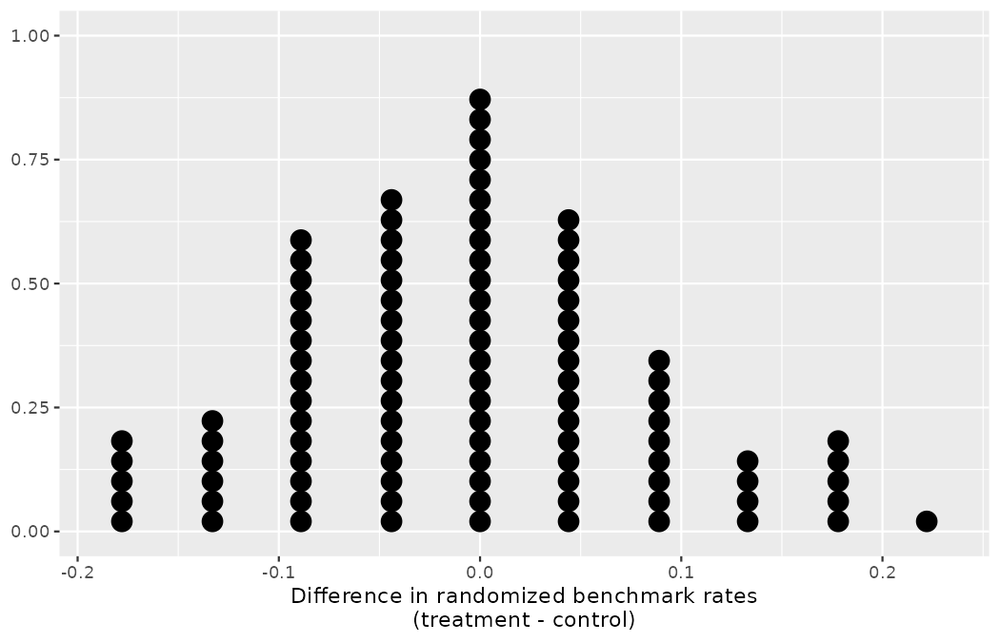
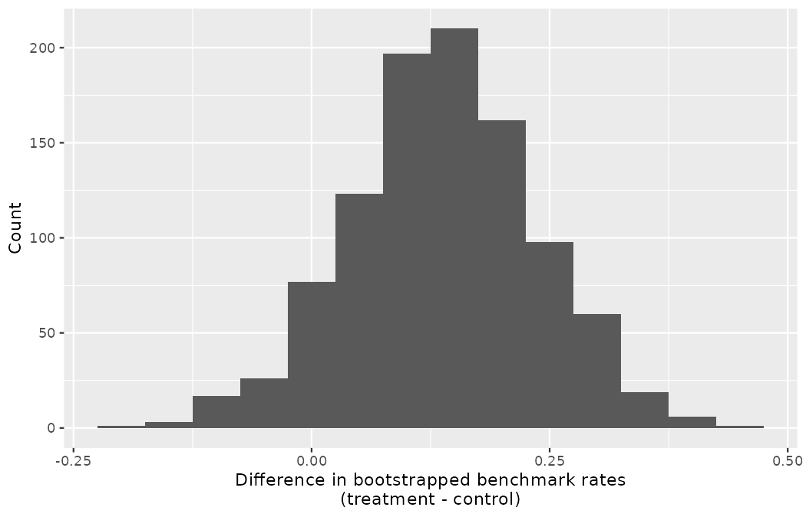
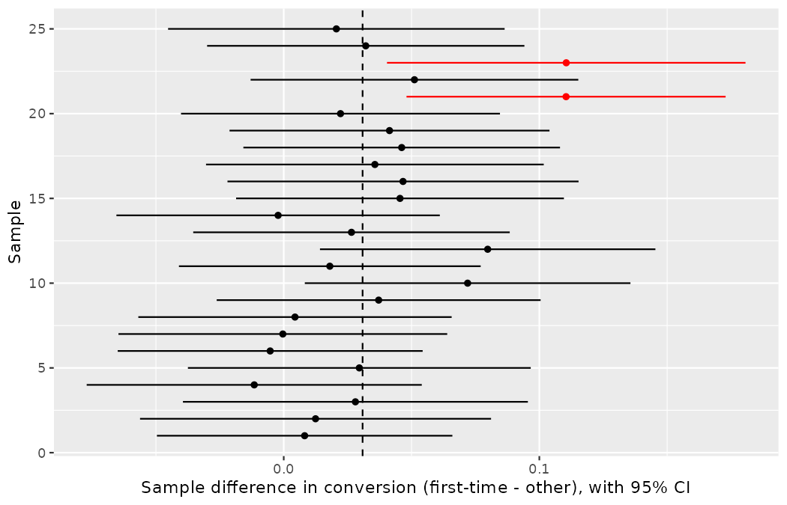

# Inference for comparing two proportions {#sec-inference-two-props}

::: {.chapterintro}
We now extend the methods of [Chapter -@sec-inference-one-prop] to the question a scouting department asks far more often than "what is this one rate?" — namely, "are these two rates *different*, and by how much?"
We apply confidence intervals and hypothesis tests to differences in population proportions that come from two groups, Group 1 and Group 2: $p_1 - p_2.$

The notation is new in this chapter, so take it apart before using it.
The letter $p$ is, as always, a population proportion (recall @sec-foundations-randomization), and a subscript names which group's proportion we mean.
Until now every subscript has named a *specific* group — $\hat{p}_{prs}$ for pressured shots, $p_T$ and $p_C$ for treatment and control.
The subscripts $1$ and $2$ are the generic version of the same device: group 1 and group 2, whichever two groups the problem at hand supplies.
And the parameter of interest is neither proportion alone but their *difference*, $p_1 - p_2$ — a single number, which equals zero exactly when the two population proportions are equal.

In our investigations, we'll identify a reasonable **point estimate** of $p_1 - p_2$ based on the sample, and you may have already guessed its form: $\hat{p}_1 - \hat{p}_2,$ the difference of the two sample proportions — each hat declaring, as ever, a quantity computed from data standing in for the population quantity beneath it.
You have been computing exactly this statistic since the dossier audit of @sec-foundations-randomization; what is new here is the full inferential toolkit built around it.
Then we'll look at the inferential analysis in three different ways: using a randomization test, applying bootstrapping for interval estimates, and, if we verify that the point estimate can be modeled using a normal distribution, we compute the estimate's standard error, and we apply the mathematical framework.
:::

## Randomization test for the difference in proportions {#sec-two-prop-errors}

### Observed data

In @sec-two-sided-hypotheses we analyzed Jonas Beck's reactive-finishing trial, `benchmark90`, and its two-sided verdict: check complete, the on-field call stands.
Jonas did not stop experimenting.
The following cycle he ran a *new* trial — a different intervention on a different cohort of 90 academy forwards, and, to be explicit, a new experiment entirely, not a re-analysis of `benchmark90`.
The intervention this time was an individualized video-feedback finishing program: every finishing session of a treatment-group player was filmed and reviewed one-on-one with a coach each week, while control-group players received the standard collective debrief.
Each player was randomly assigned to one of the two groups, 45 per group, and the outcome variable of interest was whether the player met the club's finishing benchmark at the end-of-cycle assessment.

As always, this is a constructed Northbridge scenario — no real academy was involved — and we build the dataset in visible R code so that every number below can be reproduced (the construction is deterministic; seeds enter with the simulations that follow).

```r
library(dplyr)
library(tidyr)
library(readr)
library(ggplot2)
library(purrr)
library(infer)

feedback90 <- tibble(
  group   = factor(rep(c("treatment", "control"), each = 45),
                   levels = c("treatment", "control")),
  outcome = factor(c(rep("met", 16), rep("missed", 29),
                     rep("met", 10), rep("missed", 35)),
                   levels = c("met", "missed"))
)

feedback90 |>
  count(group, outcome) |>
  pivot_wider(names_from = outcome, values_from = n)
#> # A tibble: 2 × 3
#>   group       met missed
#>   <fct>     <int>  <int>
#> 1 treatment    16     29
#> 2 control      10     35
```

The results are summarized in @tbl-feedback90-summary.
16 of the 45 players in the treatment group and 10 of the 45 players in the control group met the benchmark.

|           | met benchmark | missed benchmark | Total |
|:----------|--------------:|-----------------:|------:|
| treatment |            16 |               29 |    45 |
| control   |            10 |               35 |    45 |
| Total     |            26 |               64 |    90 |

: Results for the video-feedback finishing trial. Players in the treatment group received weekly individualized video review, and players in the control group received the standard collective debrief. {#tbl-feedback90-summary}

::: {.callout-tip title="Check your understanding"}
Is this an observational study or an experiment?
What implications does the study type have on what can be inferred from the results?

------------------------------------------------------------------------

The study is an experiment, as players were randomly assigned to a group.
Since this is an experiment, the results can be used to evaluate a *causal* relationship between the video-feedback program and whether players met the finishing benchmark.
:::

In this study, a larger proportion of players who received the video-feedback program, $\hat{p}_T = \frac{16}{45} = 0.356,$ met the benchmark compared to those who received the standard debrief, $\hat{p}_C = \frac{10}{45} = 0.222.$
However, based on these observed proportions alone, we cannot determine whether the difference $(\hat{p}_T - \hat{p}_C = 0.356 - 0.222 = 0.133)$ provides *convincing evidence* that the program is effective.

```r
feedback90 |>
  group_by(group) |>
  summarize(n = n(), p_met = mean(outcome == "met"))
#> # A tibble: 2 × 3
#>   group         n p_met
#>   <fct>     <int> <dbl>
#> 1 treatment    45 0.356
#> 2 control      45 0.222
```

As we saw in [Chapter -@sec-foundations-randomization], we can re-randomize the responses (`met` or `missed`) to the treatment conditions assuming the null hypothesis is true and compute possible differences in proportions.
Picture Priya Rao's cards once more: 26 cards marked `met`, 64 marked `missed`, shuffled thoroughly and dealt into two stacks of 45 — the procedure that simulates a world in which the program does nothing.

### Variability of the statistic

The code below runs 100 such randomization simulations and stacks the resulting differences into a dot plot, exactly the machinery of @sec-foundations-randomization.

```r
set.seed(1701)
feedback90_null <- feedback90 |>
  specify(outcome ~ group, success = "met") |>
  hypothesize(null = "independence") |>
  generate(reps = 100, type = "permute") |>
  calculate(stat = "diff in props", order = c("treatment", "control")) |>
  mutate(stat = round(stat, 3))

ggplot(feedback90_null, aes(x = stat)) +
  geom_dotplot(binwidth = 0.02, dotsize = 0.5) +
  labs(
    y = NULL,
    x = "Difference in randomized benchmark rates\n(treatment - control)"
  )
```

{fig-alt="Dot plot of 100 differences in randomized benchmark rates (treatment minus control), stacking at ten values from -0.178 to 0.222 in steps of about 0.044. The tallest stacks sit at and around zero." width=85%}

The 100 dots stack at ten values running from $-0.178$ to $0.222.$
With 26 `met` cards dealt into two stacks of 45, the difference can only move in steps of $2/45 \approx 0.044$ — shift one `met` card from one stack to the other and both proportions move by $1/45,$ in opposite directions.
The tallest stacks sit at and around zero.

### Observed statistic vs null statistics

Note that the distribution of these simulated differences is centered around 0.
We simulated the differences assuming that the independence model was true, that weekly video feedback has no effect on the assessment.
Under the null hypothesis, we expect the difference to be near zero with some random fluctuation, where *near* is pretty generous in this case since the sample sizes are so small in this study.

::: {.callout-note title="Worked example"}
How often would you observe a difference of at least 13.3% $(0.133)$ according to the null distribution we just simulated?
Is this a rare event?

------------------------------------------------------------------------

```r
feedback90_null |>
  summarize(
    n_extreme = sum(stat >= 0.133),
    prop_extreme = mean(stat >= 0.133)
  )
#> # A tibble: 1 × 2
#>   n_extreme prop_extreme
#>       <int>        <dbl>
#> 1        10          0.1
```

A difference of at least 13.3% due to chance alone, if the null hypothesis were true, happened in 10 of the 100 simulations — about 10% of the time.
This is not a very rare event.
And recall the discipline of @sec-foundations-decision-errors: the honest default is the two-sided test, since a video-review program could in principle disrupt as well as sharpen.
Doubling the tail gives a p-value of $2 \times 0.10 = 0.20.$
(In this run the left tail happened to hold 11 shuffles at or below $-0.133;$ adding the tails instead of doubling would give $0.21$ — the same verdict either way, as @sec-two-sided-hypotheses promised.)
:::

The difference of 13.3% not being a rare event suggests two possible interpretations of the results of the study:

-   $H_0$ **Independence model.** Weekly video feedback has no effect on the benchmark rate, and we just happened to observe a difference that would only occur on a rare occasion.
-   $H_A$ **Alternative model.** Weekly video feedback changes the benchmark rate, and the difference we observed was actually due to the program being effective, which explains the difference of 13.3%.

Since we determined that the outcome is not rare (a 20% chance of observing a difference at least as extreme as 13.3% under the assumption that the program has no effect), we fail to reject $H_0,$ and conclude that the study results do not provide strong evidence against the independence model.
This does not mean that we have proved the video feedback is ineffective; it just means that this study does not provide convincing evidence that it is effective in this setting — the same "check complete" verdict, on the same 90-player scale, that `benchmark90` returned in @sec-two-sided-hypotheses.
Two 90-player trials, two inconclusive verdicts: Jonas would do well to reread the power discussion of @sec-pow before designing a third.

Statistical inference is built on evaluating how likely such differences are to occur due to chance if in fact the null hypothesis is true.
In statistical inference, data scientists evaluate which model is most reasonable given the data.
Errors do occur, just like rare events, and we might choose the wrong model.
While we do not always choose correctly, statistical inference gives us tools to control and evaluate how often these errors occur — that was the entire business of @sec-foundations-decision-errors.

## Bootstrap confidence interval for the difference in proportions {#sec-two-prop-boot-ci}

In @sec-two-prop-errors, we worked with the randomization distribution to understand the distribution of $\hat{p}_1 - \hat{p}_2$ when the null hypothesis $H_0: p_1 - p_2 = 0$ is true.
Now, through bootstrapping, we study the variability of $\hat{p}_1 - \hat{p}_2$ without assuming the null hypothesis is true — the estimation question, in the spirit of @sec-foundations-bootstrapping: not *whether* the program moves the benchmark rate, but *by how much*, which is the number Marta Vidal would need before funding video analysts for every academy age group.

### Observed data

Reconsider the video-feedback data from @sec-two-prop-errors, summarized in @tbl-feedback90-summary.
Again, we use the difference in sample proportions as the observed statistic of interest.
Here, the value of the statistic is: $\hat{p}_T - \hat{p}_C = 0.356 - 0.222 = 0.133.$

### Variability of the difference in sample proportions

The bootstrap method applied to two samples is an extension of the method described in [Chapter -@sec-foundations-bootstrapping].
Now, we have two samples, so *each* sample estimates the population from which it came.
In the video-feedback setting, the treatment sample estimates the population of all players who would train under the program; the control sample estimates the population of all players under standard training.
Two samples, two estimated populations, two bags of marbles — and we resample from each bag separately, preserving each group's sample size.

To watch the two-bag mechanics on a scale you can count by hand, step away from the trial for a moment, down to a deliberately tiny scouting errand.
Emil Sørensen had a scout track a target striker over the past month, and the scout logged every attempt by how it was struck and whether it tested the keeper: 7 headers, of which 3 were on target, and 9 foot shots, of which 5 were on target.
(A constructed scenario, built in the code below.)
These are two separate samples — one from the population of the striker's headed attempts, one from the population of his footed attempts — and the parameter of interest is the difference in his true on-target rates, $p_1 - p_2,$ with group 1 the headers and group 2 the foot shots.

```r
headers7 <- tibble(
  shot   = paste0("H", 1:7),
  result = c(rep("on target", 3), rep("off target", 4))
)

foot9 <- tibble(
  shot   = paste0("F", 1:9),
  result = c(rep("on target", 5), rep("off target", 4))
)
```

Each sample estimates its own population: an infinitely large pool of headed attempts, $3/7$ on target, and an infinitely large pool of footed attempts, $5/9$ on target — or, in marbles, a bag of 3 red and 4 white, and a second bag of 5 red and 4 white.
As in @sec-foundations-bootstrapping, drawing *with replacement* from each bag, preserving each bag's sample size, is the computational equivalent of sampling from the estimated populations.
One bootstrap resample of the pair means: draw 7 from the header bag, draw 9 from the foot bag, and take the difference of the two resample proportions.

```r
set.seed(1702)
headers_re1 <- headers7 |> slice_sample(n = 7, replace = TRUE)
foot_re1    <- foot9   |> slice_sample(n = 9, replace = TRUE)

headers_re1 |> arrange(shot)
#> # A tibble: 7 × 2
#>   shot  result
#>   <chr> <chr>
#> 1 H1    on target
#> 2 H1    on target
#> 3 H3    on target
#> 4 H4    off target
#> 5 H6    off target
#> 6 H7    off target
#> 7 H7    off target

c(mean(headers_re1$result == "on target"),
  mean(foot_re1$result == "on target"))
#> [1] 0.4285714 0.3333333
```

Header H1 was drawn twice, H7 twice, and H2 and H5 not at all — sampling with replacement, exactly as you watched it with the trialists of @sec-foundations-bootstrapping.
This first pair of resamples gives bootstrap proportions of $3/7$ and $3/9,$ for a difference of $3/7 - 3/9 = 0.095.$
Repeating the process:

```r
headers_re2 <- headers7 |> slice_sample(n = 7, replace = TRUE)
foot_re2    <- foot9   |> slice_sample(n = 9, replace = TRUE)
headers_re3 <- headers7 |> slice_sample(n = 7, replace = TRUE)
foot_re3    <- foot9   |> slice_sample(n = 9, replace = TRUE)

round(c(
  mean(headers_re2$result == "on target") - mean(foot_re2$result == "on target"),
  mean(headers_re3$result == "on target") - mean(foot_re3$result == "on target")
), 3)
#> [1] -0.206 -0.016
```

The second pair of resamples came out $4/7$ and $7/9$ $(-0.206);$ the third, $3/7$ and $4/9$ $(-0.016).$
As always, the variability of the difference in proportions can only be estimated by repeated simulations — so we run 1,000 and stack the differences into a bootstrap sampling distribution:

```r
tiny_boot <- tibble(
  stat = replicate(1000, {
    mean(slice_sample(headers7, n = 7, replace = TRUE)$result == "on target") -
      mean(slice_sample(foot9, n = 9, replace = TRUE)$result == "on target")
  })
)

tiny_boot |>
  summarize(se = sd(stat), lowest = min(stat), highest = max(stat))
#> # A tibble: 1 × 3
#>      se lowest highest
#>   <dbl>  <dbl>   <dbl>
#> 1 0.250 -0.889   0.603
```

The 1,000 bootstrapped differences sprawl from $-0.889$ to $0.603,$ with a standard deviation of $0.250$ — a quarter, on a statistic that lives between $-1$ and $1.$
Seven headers and nine foot shots simply cannot pin down a difference in rates; the scout's month of logging is a mechanism demonstration, not an answer.

Now return to the trial, where the same procedure has 45 observations in each bag.
The **infer** pipeline bootstraps both groups in one call — `generate(type = "bootstrap")` resamples the 90 rows with replacement, and `calculate()` takes the difference in proportions in each resample:

```r
set.seed(1701)
feedback90_boot <- feedback90 |>
  specify(outcome ~ group, success = "met") |>
  generate(reps = 1000, type = "bootstrap") |>
  calculate(stat = "diff in props", order = c("treatment", "control"))

ggplot(feedback90_boot, aes(x = stat)) +
  geom_histogram(binwidth = 0.05) +
  labs(
    x = "Difference in bootstrapped benchmark rates\n(treatment - control)",
    y = "Count"
  )
```

{fig-alt="Histogram of 1,000 bootstrapped differences in benchmark rates (treatment minus control), roughly symmetric and bell-shaped, centered near the observed statistic of 0.133 and running from about -0.18 to 0.45." width=85%}

The histogram of the 1,000 bootstrapped differences is roughly symmetric and bell-shaped, centered near the observed statistic of $0.133$ (the mean of the 1,000 differences is $0.138),$ with the differences running from about $-0.18$ to $0.45.$
Note the contrast with the striker's shot log: the trial has 45 and 45 observations in the two groups where the log had 7 and 9, and the variability of the bootstrapped differences shrinks accordingly — a standard deviation of about $0.10$ against the log's $0.25.$
As you will see in the mathematical models discussed in @sec-math-2prop, large sample sizes lead to smaller standard errors for a difference in proportions.

### Bootstrap percentile vs. SE confidence intervals

The bootstrap distribution above provides an estimate for the variability of the difference in benchmark proportions from sample to sample.
The values in the histogram can be used in two different ways to create a confidence interval for the parameter of interest: $p_1 - p_2.$

As in [Chapter -@sec-foundations-bootstrapping], the bootstrap confidence interval can be calculated directly from the bootstrapped differences.
The interval created from the percentiles of the distribution is called the **percentile interval**.
Note that here we calculate the 90% confidence interval by finding the $5^{th}$ and $95^{th}$ percentile values from the bootstrapped differences.

```r
feedback90_boot |>
  summarize(
    lower = quantile(stat, 0.05),
    upper = quantile(stat, 0.95)
  )
#> # A tibble: 1 × 2
#>     lower upper
#>     <dbl> <dbl>
#> 1 -0.0222   0.3
```

The bootstrap 5 percentile difference is $-0.022$ and the 95 percentile is $0.300.$
The result is: we are 90% confident that, in the population, the true change in benchmark rate under the video-feedback program is between 2.2 percentage points *lower* and 30.0 percentage points *higher* than under standard training.
The interval shows that we do not have much definitive evidence of the effect of the program, one way or another.

Alternatively, we can use the variability in the bootstrapped differences to calculate a standard error of the difference.
The resulting interval is called the **SE interval**.
@sec-math-2prop details the mathematical model for the standard error of the difference in sample proportions, but the bootstrap distribution typically does an excellent job of estimating the variability of the sampling distribution of the sample statistic.

```r
feedback90_boot |>
  summarize(se = sd(stat))
#> # A tibble: 1 × 1
#>       se
#>    <dbl>
#> 1 0.0974
```

$$
SE(\hat{p}_T - \hat{p}_C) \approx SE(\hat{p}_{T, boot} - \hat{p}_{C, boot}) = 0.0974
$$

The subscripts stack but decompose exactly as their pieces did in @sec-foundations-bootstrapping and @sec-foundations-randomization: $\hat{p}_{T, boot}$ is a proportion (the $p$), computed from data (the hat), within the treatment group (the $T$), of a bootstrap resample (the $boot$).
The variability of the difference in proportions was calculated in R using the `sd()` function, but any statistical software will calculate the standard deviation of the differences — here, the exact quantity we hope to approximate.

Note that we do not know the true distribution of $\hat{p}_T - \hat{p}_C,$ so we will use a rough approximation to find a confidence interval for $p_T - p_C.$
As seen in the bootstrap histogram, the shape of the distribution is roughly symmetric and bell-shaped.
So for a rough approximation, we will apply the 68-95-99.7 rule of @sec-normalDist, which tells us that 95% of observed differences should be roughly no farther than 2 SE from the true parameter (difference in proportions).
A 95% confidence interval for $p_T - p_C$ is given by:

$$
\hat{p}_T - \hat{p}_C \pm 2 \cdot SE \rightarrow \ \ \ 16/45 - 10/45 \pm 2 \cdot 0.0974 \ \ \ \rightarrow \ \ \ (-0.061,\ 0.328)
$$

```r
round(16 / 45 - 10 / 45 + c(-2, 2) * 0.0974, 3)
#> [1] -0.061  0.328
```

We are 95% confident that the true value of $p_T - p_C$ is between $-0.061$ and $0.328.$
Again, the wide confidence interval that contains zero indicates that the study provides very little evidence about the effectiveness of the video-feedback program — Marta gets an honest "somewhere between mildly harmful and transformative," which is to say, not yet a budget line.
For other percentages, e.g., a 90% bootstrap SE confidence interval, we use the corresponding cutoff $z^\star$ from the normal distribution, exactly as in [Chapter -@sec-inference-one-prop].

::: {.callout-tip title="Check your understanding"}
The 90% percentile interval ran from $-0.022$ to $0.300.$
Without computing anything new, should a 90% *SE* interval for the same data be wildly different?
Why or why not?

------------------------------------------------------------------------

No — the two intervals should nearly agree.
The bootstrap distribution is roughly symmetric and bell-shaped, and for bell-shaped distributions the middle 90% of values sits within about $1.65$ standard errors of the center (recall the $z^\star$ cutoffs of @sec-inference-one-prop).
Indeed, $0.1333 \pm 1.65 \times 0.0974$ gives $(-0.027, 0.294),$ close to the percentile interval's $(-0.022, 0.300).$
The two constructions differ meaningfully only when the bootstrap distribution is noticeably skewed — recall the corner-pattern proportions of @sec-foundations-bootstrapping.
:::

### What does 95% mean?

Recall that the goal of a confidence interval is to find a plausible range of values for a *parameter* of interest.
The estimated statistic is not the value of interest, but it is typically the best guess for the unknown parameter.
The confidence level (often 95%) is a number that takes a while to get used to.
Surprisingly, the percentage does not describe the dataset at hand; it describes many possible datasets.
One way to understand a confidence interval is to think about all the confidence intervals that you have ever made or that you will ever make as an analyst: the confidence level describes **those** intervals.

In @sec-foundations-mathematical we watched this happen for a single proportion, drawing 25 samples from the one population we hold in full: the 1,494 shots of the 2022 World Cup.
The same demonstration works for a *difference* in proportions, and the tournament again supplies a known truth to aim at.
Consider the first-time finishing split you met in @sec-foundations-decision-errors:

```r
wc2022_shots <- read_csv("data/derived/wc2022_shots.csv")

wc2022_shots |>
  group_by(first_time) |>
  summarize(shots = n(), goals = sum(goal), conversion = mean(goal))
#> # A tibble: 2 × 4
#>   first_time shots goals conversion
#>   <lgl>      <int> <int>      <dbl>
#> 1 FALSE       1026   124      0.121
#> 2 TRUE         468    71      0.152
```

Treating the tournament as the population, the *true* parameter is known exactly:

$$p_{ft} - p_{ot} = \frac{71}{468} - \frac{124}{1026} = 0.1517 - 0.1209 = 0.0309$$

One flag before we use it, per this book's penalty convention: this is the *all-shots* gap, penalties and shoot-out kicks included, and every one of the tournament's 64 penalties sits in the controlled-touch (non-first-time) bucket.
On open play the gap is considerably wider — you saw the mechanism dissected in @sec-foundations-decision-errors, and the code below confirms it for this tournament:

```r
wc2022_shots |>
  filter(shot_type == "Open Play") |>
  group_by(first_time) |>
  summarize(shots = n(), goals = sum(goal), conversion = mean(goal))
#> # A tibble: 2 × 4
#>   first_time shots goals conversion
#>   <lgl>      <int> <int>      <dbl>
#> 1 FALSE        914    79     0.0864
#> 2 TRUE         468    71     0.152
```

For a *scouting* claim about first-time finishing, the open-play frame $(0.152$ vs $0.086)$ is the one to argue from.
Here, however, the tournament is serving as a laboratory: a population whose parameter we get to define and then try to capture, so that the coverage machinery — not first-time finishing — is on trial.
We therefore state the frame (all 1,494 shots, penalties in), define the truth as $0.0309,$ and use that same frame for every sample below.

The code draws 25 different studies from this population — each a sample of 500 shots drawn with replacement, so that every shot is an independent draw from the tournament's shot pool, exactly as in the 25-interval simulation of @sec-foundations-mathematical — splits each study into its first-time and other-shot groups, and builds a 95% confidence interval from each, borrowing the SE formula that @sec-math-2prop will formalize (as @sec-foundations-mathematical once borrowed it for the finishing-program interval):

```r
d_wc <- 71 / 468 - 124 / 1026

set.seed(1703)
ci25 <- map_dfr(1:25, \(rep) {
  wc2022_shots |>
    slice_sample(n = 500, replace = TRUE) |>
    summarize(
      n_ft = sum(first_time),
      n_ot = sum(!first_time),
      p_ft = mean(goal[first_time]),
      p_ot = mean(goal[!first_time])
    ) |>
    mutate(
      sample = rep,
      d_hat  = p_ft - p_ot,
      se     = sqrt(p_ft * (1 - p_ft) / n_ft + p_ot * (1 - p_ot) / n_ot),
      lower  = d_hat - 1.96 * se,
      upper  = d_hat + 1.96 * se,
      miss   = lower > d_wc | upper < d_wc
    )
})

ci25 |> summarize(n_miss = sum(miss))
#> # A tibble: 1 × 1
#>   n_miss
#>    <int>
#> 1      2

ci25 |> filter(miss) |> select(sample, d_hat, lower, upper)
#> # A tibble: 2 × 4
#>   sample d_hat  lower upper
#>    <int> <dbl>  <dbl> <dbl>
#> 1     21 0.110 0.0480 0.173
#> 2     23 0.111 0.0404 0.181
```

```r
ggplot(ci25, aes(y = sample)) +
  geom_segment(aes(x = lower, xend = upper, yend = sample, color = miss)) +
  geom_point(aes(x = d_hat, color = miss)) +
  geom_vline(xintercept = d_wc, linetype = "dashed") +
  scale_color_manual(values = c("black", "red"), guide = "none") +
  labs(
    x = "Sample difference in conversion (first-time - other), with 95% CI",
    y = "Sample"
  )
```

{fig-alt="Twenty-five horizontal 95% confidence interval segments, one per study, each with a dot at its point estimate, and a dashed vertical line at the true parameter value of 0.0309. Twenty-three intervals cross the dashed line; two, drawn in red, lie entirely above the truth." width=85%}

The figure shows 25 horizontal interval segments, one per study, each with a dot at its point estimate $\hat{p}_{ft} - \hat{p}_{ot},$ and a dashed vertical line at the true parameter value $p_{ft} - p_{ot} = 0.0309.$
The study at hand — any study you will ever run — is one of these lines, and it is not possible to know, from inside the study, whether yours sits to the left of the truth, to the right of it, or astride it.
Twenty-three of the 25 intervals cross the dashed line.
Two — samples 21 and 23, whose 500 resampled shots happened to contain hot-finishing first-time chances, with point estimates near $0.11$ — lie entirely *above* the truth, and are drawn in red.
An analyst holding sample 21 would report, with a perfectly constructed interval, that first-time shots convert at least 4.8 percentage points better; the parameter says 3.1.
If we are making 95% intervals, then about 5% of the intervals we create over our lifetime will *not* capture the parameter of interest.
What we know is that, over our lifetimes as analysts, about 95% of the intervals created and reported on will capture the parameter value of interest: thus the language "95% confident."
Two misses in 25 is above the advertised 1-in-20, and that, too, is chance doing what chance does — collect enough intervals over enough studies, and the long-run rate asserts itself.

::: {.callout-tip title="Check your understanding"}
If the 25 analysts had built 90% intervals instead, about how many misses should we expect?
Would the intervals be wider or narrower?

------------------------------------------------------------------------

About $0.10 \times 25 = 2.5$ misses, on average — and the intervals would be *narrower*, using $z^\star = 1.65$ in place of $1.96$ (recall @sec-inference-one-prop).
A lower confidence level trades capture rate for precision; neither choice is free.
:::

The choice of 95% or 90% or even 99% as a confidence level is admittedly somewhat arbitrary; however, it is related to the logic we used when deciding that a p-value should be declared as "discernible" if it is lower than 0.05 (or 0.10 or 0.01, respectively).
Indeed, one can show mathematically that a 95% confidence interval and a two-sided hypothesis test at a cutoff of 0.05 will provide the same conclusion when the same data and mathematical tools are applied for the analysis.
A full derivation of the explicit connection between confidence intervals and hypothesis tests is beyond the scope of this text.

## Mathematical model for the difference in proportions {#sec-math-2prop}

### Variability of the difference between two proportions

Like with $\hat{p},$ the difference of two sample proportions $\hat{p}_1 - \hat{p}_2$ can be modeled using a normal distribution when certain conditions are met.
First, we require a broader independence condition, and secondly, the success-failure condition must be met by both groups.

::: {.callout-important title="Conditions for the sampling distribution of $\hat{p}_1 - \hat{p}_2$ to be normal"}
The difference $\hat{p}_1 - \hat{p}_2$ can be modeled using a normal distribution when

1.  *Independence* (extended). The data are independent within and between the two groups. Generally this is satisfied if the data come from two independent random samples or if the data come from a randomized experiment.
2.  *Success-failure condition.* The success-failure condition holds for both groups, where we check successes and failures in each group separately. That is, we should have at least 10 successes and 10 failures in each of the two groups.

When these conditions are satisfied, the standard error of $\hat{p}_1 - \hat{p}_2$ is

$$SE(\hat{p}_1 - \hat{p}_2) = \sqrt{\frac{p_1(1-p_1)}{n_1} + \frac{p_2(1-p_2)}{n_2}}$$

where $p_1$ and $p_2$ represent the population proportions, and $n_1$ and $n_2$ represent the sample sizes.

Note that in most cases, the standard error is approximated using the observed data:

$$SE(\hat{p}_1 - \hat{p}_2) = \sqrt{\frac{\hat{p}_1(1-\hat{p}_1)}{n_1} + \frac{\hat{p}_2(1-\hat{p}_2)}{n_2}}$$

where $\hat{p}_1$ and $\hat{p}_2$ represent the observed sample proportions, and $n_1$ and $n_2$ represent the sample sizes.
:::

The formula is new in this chapter, but every piece of it is old; read it from the inside out.
Each fraction under the square root, $p(1-p)/n,$ is the squared standard error of a *single* sample proportion — recall $SE(\hat{p}) = \sqrt{p(1-p)/n}$ from [Chapter -@sec-inference-one-prop] — one copy for group 1, one copy for group 2.
Because the two groups are independent, their uncertainties compound, and the squared standard errors *add*.
Note carefully that they add even though the statistic subtracts: an error in $\hat{p}_1$ and an error in $\hat{p}_2$ are both free to push the difference off target, so the difference is *more* variable than either proportion alone, never less.
The square root then returns the result to the scale of a proportion.
This is the formula @sec-foundations-mathematical borrowed on credit for the finishing-program interval in @sec-casestent; the debt is now paid.

Recall from @sec-moe that the margin of error is defined by the standard error.
The margin of error for $\hat{p}_1 - \hat{p}_2$ can be directly obtained from $SE(\hat{p}_1 - \hat{p}_2).$

::: {.callout-important title="Margin of error for $\hat{p}_1 - \hat{p}_2$"}
The margin of error is $z^\star \times \sqrt{\frac{\hat{p}_1(1-\hat{p}_1)}{n_1} + \frac{\hat{p}_2(1-\hat{p}_2)}{n_2}}$ where $z^\star$ is calculated from a specified percentile on the normal distribution, exactly as in [Chapter -@sec-inference-one-prop].
:::

### Confidence interval for the difference between two proportions

We can apply the generic confidence interval formula for a difference of two proportions, where we use $\hat{p}_1 - \hat{p}_2$ as the point estimate and substitute the $SE$ formula:

$$
\begin{aligned}
\text{point estimate} \ &\pm \ z^{\star} \ \times \ SE \\
(\hat{p}_1 - \hat{p}_2) \ &\pm \ z^{\star} \times \sqrt{\frac{\hat{p}_1(1-\hat{p}_1)}{n_1} + \frac{\hat{p}_2(1-\hat{p}_2)}{n_2}}
\end{aligned}
$$

::: {.callout-important title="Standard error of the difference in two proportions, $\hat{p}_1 - \hat{p}_2$"}
When the conditions for the normal model are met, the **variability** of the difference in proportions, $\hat{p}_1 - \hat{p}_2,$ is well described by:

$$SE(\hat{p}_1 - \hat{p}_2) = \sqrt{\frac{\hat{p}_1(1-\hat{p}_1)}{n_1} + \frac{\hat{p}_2(1-\hat{p}_2)}{n_2}}$$
:::

::: {.callout-note title="Worked example"}
We reconsider the video-feedback experiment of @sec-two-prop-errors, in which 90 academy forwards were randomly divided into a treatment group receiving weekly individualized video review and a control group receiving the standard debrief.
The outcome variable of interest was whether the player met the club's finishing benchmark, with the results shown in @tbl-feedback90-summary.
Check whether we can model the difference in sample proportions using the normal distribution.

------------------------------------------------------------------------

We first check for independence: since this is a randomized experiment, it seems reasonable to assume that the observations are independent.
Next, we check the success-failure condition for each group.
We have at least 10 successes and 10 failures in each experiment arm $(16, 29, 10, 35),$ so this condition is also satisfied.
With both conditions satisfied, the difference in sample proportions can be reasonably modeled using a normal distribution for these data.
:::

::: {.callout-note title="Worked example"}
Create and interpret a 90% confidence interval for the difference in benchmark rates in the video-feedback trial.

------------------------------------------------------------------------

We'll use $p_T$ for the true benchmark rate under the program and $p_C$ for the rate under standard training:

$$\hat{p}_{T} - \hat{p}_{C} = \frac{16}{45} - \frac{10}{45} = 0.356 - 0.222 = 0.133$$

We use the standard error formula previously provided.
As with the one-sample proportion case, we use the sample estimates of each proportion in the formula in the confidence interval context:

$$SE \approx \sqrt{\frac{0.356 (1 - 0.356)}{45} + \frac{0.222 (1 - 0.222)}{45}} = 0.095$$

For a 90% confidence interval, we use $z^{\star} = 1.65$ (recall the cutoffs of @sec-inference-one-prop):

$$
\begin{aligned}
\text{point estimate} \ &\pm \ z^{\star} \ \times \ SE \\
0.133 \ &\pm \ 1.65 \ \times \ 0.095 \\
(-0.023 \ &, \ 0.289)
\end{aligned}
$$

```r
se_feedback <- sqrt((16 / 45) * (29 / 45) / 45 + (10 / 45) * (35 / 45) / 45)
round(se_feedback, 4)
#> [1] 0.0945

round(16 / 45 - 10 / 45 + c(-1, 1) * 1.65 * se_feedback, 3)
#> [1] -0.023  0.289
```

We are 90% confident that players on the video-feedback program meet the benchmark at a rate between 2.3 percentage points *lower* and 28.9 percentage points *higher* than players in the control group.
Because 0% is contained in the interval, we do not have enough information to say whether the program helps or hurts the players' finishing assessments.
Note also how closely the formula's $SE = 0.0945$ tracks the bootstrap's $0.0974$ from @sec-two-prop-boot-ci — two roads, one destination, just as with the randomization and normal p-values of @sec-foundations-mathematical.

The problem was set up at 90% to indicate that there was not a need for a high level of confidence (such as 95% or 99%).
A lower degree of confidence increases potential for error, but it also produces a narrower interval.
:::

Confidence intervals for a difference in proportions earn their keep on decisions bigger than one academy drill.
The next study — a constructed scenario in the mold of the multi-club `drill_trial` of @sec-data-hello, built in the code below — is the sort of evidence a head of sports science brings to Marta Vidal when asking the club to buy cryotherapy chambers.
A consortium of clubs' sports-science departments ran a five-season randomized evaluation of post-match recovery protocols: each enrolled player was randomized to a cryotherapy-immersion protocol or to the standard recovery routine, and the outcome recorded was whether the player suffered a *season-ending soft-tissue injury requiring surgery* during their enrolled season — a rare outcome, which is precisely why the consortium needed nearly 26,000 player-seasons to study it.

```r
recovery_trial <- tibble(
  protocol = c(rep("cryotherapy", 12933), rep("standard", 12938)),
  outcome  = c(rep("injury", 145), rep("no injury", 12788),
               rep("injury", 200), rep("no injury", 12738))
)

recovery_trial |>
  count(protocol, outcome) |>
  pivot_wider(names_from = outcome, values_from = n)
#> # A tibble: 2 × 3
#>   protocol    injury `no injury`
#>   <chr>        <int>       <int>
#> 1 cryotherapy    145       12788
#> 2 standard       200       12738
```

|             | season-ending injury | no season-ending injury |  Total |
|:------------|---------------------:|------------------------:|-------:|
| cryotherapy |                  145 |                  12,788 | 12,933 |
| standard    |                  200 |                  12,738 | 12,938 |

: Results of the recovery-protocol consortium study; the outcome is a season-ending soft-tissue injury requiring surgery. {#tbl-recovery-trial}

::: {.callout-tip title="Check your understanding"}
Create a 95% confidence interval for the effect of the cryotherapy protocol on season-ending soft-tissue injury requiring surgery, for players who are well-represented by those in the study.
Also interpret the interval in the context of the study.

------------------------------------------------------------------------

Because the players were randomized, the observations are independent, both within and between the two groups.
The success-failure condition is also met for both groups, as all counts are at least 10 $(145, 12{,}788, 200, 12{,}738).$
This satisfies the conditions necessary to model the difference in proportions using a normal distribution.

```r
p_cryo <- 145 / 12933
p_std  <- 200 / 12938
d_hat  <- p_cryo - p_std
se_rec <- sqrt(p_cryo * (1 - p_cryo) / 12933 + p_std * (1 - p_std) / 12938)
round(c(p_cryo, p_std, d_hat, se_rec), 5)
#> [1]  0.01121  0.01546 -0.00425  0.00143

round(d_hat + c(-1, 1) * 1.96 * se_rec, 4)
#> [1] -0.0070 -0.0015

set.seed(1704)
sd(rbinom(1000, 12933, p_cryo) / 12933 - rbinom(1000, 12938, p_std) / 12938)
#> [1] 0.001441829
```

The sample proportions are $\hat{p}_{cryo} = 0.0112$ and $\hat{p}_{std} = 0.0155,$ the point estimate of the difference is $-0.0042,$ and the standard error is $SE = 0.00143$ (a quick seeded simulation of the two proportions confirms the formula: $0.00144).$
With $z^\star = 1.96,$ the 95% confidence interval is $(-0.0070, -0.0015).$
We are 95% confident that the cryotherapy protocol reduces the rate of season-ending surgical soft-tissue injury by 0.15 to 0.70 percentage points — off a baseline of only about 1.5% — over a season, for players similar to those in the study.
Because the interval is entirely below 0, and the protocol was randomly assigned, the data provide strong evidence that the protocol genuinely reduces such season-ending injuries in these players.
Note how narrowly the upper bound clears zero: with a rare outcome, even ~26,000 player-seasons buy an interval that only just excludes "no effect" — and whether a reduction of at most seven season-ending injuries per thousand player-seasons justifies the chambers' cost is Marta's call, not the interval's.
:::

### Hypothesis test for the difference between two proportions {#sec-test-prop-pool}

The details for calculating a SE and for checking technical conditions are very similar to those of confidence intervals.
However, when the null hypothesis is that $p_1 - p_2 = 0,$ we use a special proportion called the **pooled proportion** to estimate the SE and to check the success-failure condition.

::: {.callout-important title="Use the pooled proportion when $H_0$ is $p_1 - p_2 = 0$"}
When the null hypothesis is that the proportions are equal, use the pooled proportion $(\hat{p}_{\textit{pool}})$ of successes to verify the success-failure condition and estimate the standard error:

$$\hat{p}_{\textit{pool}} = \frac{\text{number of successes}}{\text{number of cases}} = \frac{\hat{p}_1 n_1 + \hat{p}_2 n_2}{n_1 + n_2}$$

Here $\hat{p}_1 n_1$ represents the number of successes in sample 1 because

$$\hat{p}_1 = \frac{\text{number of successes in sample 1}}{n_1}$$

Similarly, $\hat{p}_2 n_2$ represents the number of successes in sample 2.
:::

The notation deserves its usual unpacking: the $p$ and the hat play their standard roles — a proportion, estimated from data — and the subscript $pool$ says the data in question are the two samples *pooled into one*, as if the group labels had been peeled off.
The logic comes straight from the null hypothesis: if $H_0: p_1 = p_2$ is true, then there is only one proportion, and our best estimate of it uses every case we have.
That is also why $\hat{p}_{\textit{pool}}$ belongs only to the *test*: a confidence interval makes no equality assumption, so it has no license to pool.

::: {.callout-important title="The test statistic for assessing two proportions is a Z"}
The Z score is a ratio of how the two sample proportions differ as compared to the expected variability of difference between the proportions.

$$Z = \frac{(\hat{p}_1 - \hat{p}_2) - 0}{\sqrt{\hat{p}_{\textit{pool}}(1-\hat{p}_{\textit{pool}}) \bigg(\frac{1}{n_1} + \frac{1}{n_2} \bigg)}}$$

When the null hypothesis is true and the conditions are met, Z has a standard normal distribution.

Conditions:

-   Independent observations
-   Large samples: $(n_1 p_1 \geq 10$ and $n_1 (1-p_1) \geq 10$ and $n_2 p_2 \geq 10$ and $n_2 (1-p_2) \geq 10)$
-   Check conditions using: $(n_1 \hat{p}_{\textit{pool}} \geq 10$ and $n_1 (1-\hat{p}_{\textit{pool}}) \geq 10$ and $n_2 \hat{p}_{\textit{pool}} \geq 10$ and $n_2 (1-\hat{p}_{\textit{pool}}) \geq 10)$
:::

The denominator is the two-sample SE formula from earlier in this section with $\hat{p}_{\textit{pool}}$ substituted into *both* slots — the algebraic footprint of taking $H_0$ seriously: under the null there is one proportion, so one value fills both places, and factoring it out leaves the $\big(\frac{1}{n_1} + \frac{1}{n_2}\big)$ you see here.

Talent-identification screening is where Northbridge — and every federation it deals with — spends this machinery.
Whether early screening should be run by video-analytics platforms or by human scouts watching from the touchline is part of a genuinely contentious discussion in modern recruitment, and it is the topic of our next example, where we learn about 2-proportion hypothesis tests when $H_0$ is $p_1 - p_2 = 0$ (or equivalently, $p_1 = p_2).$

A decade-long talent-identification study — a constructed scenario, built in the code below — was conducted by a national federation with nearly 90,000 youth prospects entering its regional talent centres.
During a 2-year screening window, each prospect was randomized to one of two groups: in the first group, prospects were screened by a video-analytics platform that processed their match footage; in the second group, prospects received regular live-scouting assessments from the federation's regional scouts.
After the window, both groups fed into the same standard development pathway with no further intervention, and we'll consider whether the prospect signed a professional contract within 5 years of entering the study.

If video-analytics screening is much more effective than live scouting at spotting (and thus fast-tracking) genuine talent, then we would expect to see additional professional contracts among prospects screened by the platform.
On the other hand, if the platform misses what a scout's eye catches, we would expect fewer contracts in the video-screened group.

```r
screening_trial <- tibble(
  method   = c(rep("video", 44925), rep("live", 44910)),
  contract = c(rep("pro contract", 500), rep("no contract", 44425),
               rep("pro contract", 505), rep("no contract", 44405))
)

screening_trial |>
  count(method, contract) |>
  pivot_wider(names_from = contract, values_from = n)
#> # A tibble: 2 × 3
#>   method `no contract` `pro contract`
#>   <chr>          <int>          <int>
#> 1 live           44405            505
#> 2 video          44425            500
```

|                | Yes |     No |
|:---------------|----:|-------:|
| video-analytics | 500 | 44,425 |
| live scouting   | 505 | 44,405 |

: Summary results for the screening study: professional contract within 5 years? {#tbl-screening-trial}

::: {.callout-tip title="Check your understanding"}
Is this study an experiment or an observational study?

------------------------------------------------------------------------

This is an experiment.
Prospects were randomized to be screened by the video-analytics platform or by live scouting.
We will be able to make causal conclusions based on this study.
:::

::: {.callout-tip title="Check your understanding"}
Set up hypotheses to test whether there was a difference in professional-contract rates between the video-screened and live-scouted groups.

------------------------------------------------------------------------

$H_0:$ the contract rate for prospects screened by the video-analytics platform is the same as the contract rate for prospects screened by live scouting, $p_{VID} - p_{LIV} = 0.$
$H_A:$ the contract rate for prospects screened by the video-analytics platform is different than the contract rate for prospects screened by live scouting, $p_{VID} - p_{LIV} \neq 0.$
:::

The research question describing the screening methods is set up to address specific hypotheses (in contrast to a confidence interval for a parameter).
In order to fully take advantage of the hypothesis testing structure, we assess the randomness under the condition that the null hypothesis is true (as we always do for hypothesis testing).
Using the data from @tbl-screening-trial, we will check the conditions for using a normal distribution to analyze the results of the study using a hypothesis test.

$$
\begin{aligned}
\hat{p}_{\textit{pool}}
    &= \frac
        {\text{number of prospects who signed professional contracts in the entire study}}
        {\text{number of prospects in the entire study}} \\
    &= \frac{500 + 505}{500 + \text{44,425} + 505 + \text{44,405}} \\
    &= \frac{1005}{89{,}835} = 0.0112
\end{aligned}
$$

This proportion is an estimate of the professional-contract rate across the entire study, and it's our best estimate of the proportions $p_{VID}$ and $p_{LIV}$ *if the null hypothesis is true that* $p_{VID} = p_{LIV}.$
We will also use this pooled proportion when computing the standard error.

::: {.callout-note title="Worked example"}
Is it reasonable to model the difference in proportions using a normal distribution in this study?

------------------------------------------------------------------------

Because the prospects were randomized, observations can be assumed to be independent, both within each group and between groups.
We also must check the success-failure condition for each group.
Under the null hypothesis, the proportions $p_{VID}$ and $p_{LIV}$ are equal, so we check the success-failure condition with our best estimate of these values under $H_0,$ the pooled proportion from the two samples, $\hat{p}_{\textit{pool}} = 0.0112:$

$$
\begin{aligned}
\hat{p}_{\textit{pool}} \times n_{VID}
      &= 0.0112 \times \text{44,925} = 503 \\
 (1 - \hat{p}_{\textit{pool}}) \times n_{VID}
      &= 0.9888 \times \text{44,925} = \text{44,422} \\
  \hat{p}_{\textit{pool}} \times n_{LIV}
      &= 0.0112 \times \text{44,910} = 503 \\
  (1 - \hat{p}_{\textit{pool}}) \times n_{LIV}
      &= 0.9888 \times \text{44,910} = \text{44,407}
\end{aligned}
$$

The success-failure condition is satisfied since all values are at least 10.
With both conditions satisfied, we can safely model the difference in proportions using a normal distribution.
:::

In the previous example, the pooled proportion was used to check the success-failure condition[^ch17-1].
In the next example, we see an additional place where the pooled proportion comes into play: the standard error calculation.

[^ch17-1]: For an example of a two-proportion hypothesis test that does not require the success-failure condition to be met, see the randomization test of @sec-two-prop-errors.

::: {.callout-note title="Worked example"}
Compute the point estimate of the difference in contract rates in the two groups, and use the pooled proportion $\hat{p}_{\textit{pool}} = 0.0112$ to calculate the standard error.

------------------------------------------------------------------------

The point estimate of the difference in contract rates is

$$
\hat{p}_{VID} - \hat{p}_{LIV} = \frac{500}{500 + 44{,}425} - \frac{505}{505 + 44{,}405} = 0.01113 - 0.01124 = -0.00012
$$

The contract rate in the video-screened group was 0.012 percentage points less than in the live-scouted group.
Next, the standard error is calculated *using the pooled proportion,* $\hat{p}_{\textit{pool}}:$

$$SE = \sqrt{\frac{\hat{p}_{\textit{pool}}(1-\hat{p}_{\textit{pool}})}{n_{VID}} + \frac{\hat{p}_{\textit{pool}}(1-\hat{p}_{\textit{pool}})}{n_{LIV}}} = 0.00070$$
:::

::: {.callout-note title="Worked example"}
Using the point estimate $\hat{p}_{VID} - \hat{p}_{LIV} = -0.00012$ and standard error $SE = 0.00070,$ calculate a p-value for the hypothesis test and write a conclusion.

------------------------------------------------------------------------

We first compute the test statistic, and picture the standard normal curve with both tails beyond $\pm 0.17$ shaded:

$$Z = \frac{\text{point estimate} - \text{null value}}{SE} = \frac{-0.00012 - 0}{0.00070} = -0.17$$

The lower tail area is 0.4325, which we double to get the p-value: 0.8650.
The code below carries full precision through the calculation, and adds a seeded simulation of the null in the style of @sec-foundations-decision-errors as a cross-check on the mathematical model:

```r
p_pool <- (500 + 505) / (44925 + 44910)
p_vid  <- 500 / 44925
p_liv  <- 505 / 44910
se_scr <- sqrt(p_pool * (1 - p_pool) / 44925 + p_pool * (1 - p_pool) / 44910)

z_scr <- (p_vid - p_liv) / se_scr
round(c(se_scr, z_scr, 2 * pnorm(z_scr)), 4)
#> [1]  0.0007 -0.1639  0.8698

set.seed(1705)
scr_null <- tibble(
  stat = rbinom(1000, 44925, p_pool) / 44925 -
         rbinom(1000, 44910, p_pool) / 44910
)
scr_null |>
  summarize(se_sim = sd(stat), p_sim = mean(abs(stat) >= abs(p_vid - p_liv)))
#> # A tibble: 1 × 2
#>     se_sim p_sim
#>      <dbl> <dbl>
#> 1 0.000687  0.86
```

Carrying full precision, $Z = -0.164$ and the p-value is $0.8698$ — the hand calculation's $0.865$ differs only through the rounding of $-0.00012$ and $0.00070,$ and the simulated null agrees on both the SE $(0.00069)$ and the p-value $(0.86).$
Because this p-value is larger than 0.05, we do not reject the null hypothesis.
That is, the difference in contract rates is likely to have occurred just by chance, if the null hypothesis is true.
Thus, we do not observe benefits or harm from video-analytics screening relative to regular live scouting.
:::

Can we conclude that the screening method makes no difference to prospects' futures?
Here are a few considerations to keep in mind when reviewing the screening study, or any study a vendor slides across Marta Vidal's desk:

-   We do not reject the null hypothesis, which means we do not have sufficient evidence to conclude that video-analytics screening increases or decreases the rate at which prospects reach professional contracts.
-   If the platform is helpful or harmful, the data suggest the effect isn't very large.
-   Is the platform more or less expensive than live scouting at this scale? A licence plus footage processing for ~45,000 prospects may cost far less than dispatching regional scouts to thousands of youth fixtures. If one option is much more expensive than the other and does not offer clear benefits, then we should lean towards the less expensive option.
-   The study's authors also reported (within this constructed scenario) that the platform *flagged* substantially more prospects for intensive follow-up than the scouts did — flags that, as the contract data show, did not translate into more professional careers. A false flag is not free: it concentrates coaching resources on players who would not have needed the tag, places early "elite" pressure on teenagers, and can quietly de-prioritize the late developers standing next to them. These costs land on people, not spreadsheets, and they must be weighed alongside the licence fee.

These considerations highlight the complexity around talent-identification policy.
Federations and clubs that evaluate screening programs weigh considerations like those above to provide their best recommendation based on the current evidence — and, as this study shows, "the flashy new method is no better than the old one" is itself a finding worth paying for.

One account remains open before this chapter closes, and it is the book's oldest.
The dossier audit of @sec-caseStudySexDiscrimination — 48 scouts, one identical prospect dossier, only the listed nationality randomized — was tested with shuffled cards because shuffling was the only machinery you owned in that chapter; @sec-foundations-decision-errors then asked the uncomfortable question of whether its rejection could have been a Type I error, and observed that only a re-run with a fresh randomization can settle such doubts.
The mathematical model cannot re-run the experiment, but it can give the same data a second, differently built examination — and it is the natural place to drill the pooled-versus-unpooled discipline this section just taught.

::: {.callout-note title="Worked example"}
In the dossier audit, 21 of 24 "domestic" dossiers were shortlisted against 14 of 24 "foreign" ones: $\hat{p}_{dom} - \hat{p}_{for} = 0.875 - 0.583 = 0.292,$ and the seeded permutation test of @sec-caseStudySexDiscrimination put about 2% of null shuffles at or beyond the observed difference.
Test $H_0: p_{dom} - p_{for} = 0$ against $H_A: p_{dom} - p_{for} \ne 0$ using the Z machinery of this section, and construct the 95% confidence interval for $p_{dom} - p_{for}.$

------------------------------------------------------------------------

Conditions before arithmetic.
Independence holds by randomization.
The success-failure check, run as a test requires with the pooled proportion,

$$\hat{p}_{\textit{pool}} = \frac{21 + 14}{48} = \frac{35}{48} = 0.729,$$

gives $24 \times 0.729 = 17.5$ expected shortlists per group — fine — but only $24 \times 0.271 = 6.5$ expected passes, short of the required 10.
Only 13 scouts passed on the prospect in the entire study, so no arrangement of these data can meet the condition — which is precisely why @sec-caseStudySexDiscrimination led with a randomization test.
We compute the Z test anyway, warranty stamp voided, as a cross-check on the permutation verdict rather than a replacement for it:

```r
p_dom  <- 21 / 24
p_for  <- 14 / 24
p_pool <- (21 + 14) / 48

se_pool <- sqrt(p_pool * (1 - p_pool) * (1 / 24 + 1 / 24))
z_dos   <- (p_dom - p_for) / se_pool
round(c(se = se_pool, z = z_dos, p_value = 2 * (1 - pnorm(z_dos))), 4)
#>      se       z p_value
#>  0.1283  2.2736  0.0230

se_ci <- sqrt(p_dom * (1 - p_dom) / 24 + p_for * (1 - p_for) / 24)
round(p_dom - p_for + c(-1, 1) * 1.96 * se_ci, 4)
#> [1] 0.0542 0.5292
```

The pooled standard error is $0.128,$ the test statistic is $Z = 0.292/0.128 = 2.27,$ and the two-sided p-value is $0.023.$
Chapter 11's hundred shuffles put the one-sided tail at $0.02$ — a noisy estimate from 100 draws, as @sec-foundations-applications warned — and the two routes agree on the verdict: reject $H_0$ at $\alpha = 0.05.$
The confidence interval, per this section's rule, has no license to pool: its standard error uses each group's own proportion, $SE = 0.121,$ and $0.292 \pm 1.96 \times 0.121$ gives $(0.054, 0.529).$
We are 95% confident that the "domestic" label lifts an identical prospect's shortlist probability by between 5.4 and 52.9 percentage points — an embarrassingly wide interval, because 24 scouts per arm buy little precision, but one that excludes 0.

Now to the question @sec-foundations-decision-errors left open.
The finding stands up to the mathematical model too: test and interval, built on different standard errors, land where the shuffles landed.
But agreement among tools applied to the *same* 48 decisions corroborates the arithmetic, not the world — all three analyses share the one randomization that might have been the fluke, so none of them rules out the Type I error that chapter contemplated.
The fresh-randomization re-run it prescribed remains on Priya Rao's calendar; until it reports, the dossier finding is what any single experiment can be at best: a rejected null with honest error bars.
:::

## Chapter review {#sec-chp17-review}

### Summary

When the parameter of interest is the difference in population proportions across two groups, randomization tests, bootstrapping, and mathematical modeling can be applied.
For confidence intervals, bootstrapping from each group separately will provide a sampling distribution for the difference in sample proportions; the mathematical model shows a similar distributional shape as long as the sample size is large enough to fulfill the success-failure conditions and so that the data are representative of the entire population.
Keep in mind that some datasets will produce a confidence interval which does not capture the true parameter — this is the nature of variability!
Over your lifetime, about 95% of the confidence intervals you create will capture the parameter of interest, and about 5% won't; the 25 tournament studies of @sec-two-prop-boot-ci put two of their twenty-five intervals cleanly above the truth without a single computational error being made.
For hypothesis testing, repeated randomization of the explanatory variable creates a null distribution of differences in sample proportions that could have occurred under the null hypothesis.
Randomization and the mathematical model will have similar null distributions, as long as the sample size is large enough to fulfill the success-failure conditions — checked, for a test, with the pooled proportion $\hat{p}_{\textit{pool}},$ the estimate that takes $H_0$'s claim of a single common proportion at its word.

### Terms

The terms introduced in this chapter are presented below, alphabetized.
If you're not sure what some of these terms mean, we recommend you go back in the text and review their definitions.
You should be able to easily spot them as **bolded text**.

|  |  |  |
|:-----------------------|:-----------------------|:----------------------|
| percentile interval | pooled proportion | SE interval |
| point estimate | SE difference in proportions | Z score two proportions |

: Terms introduced in this chapter. {#tbl-terms-chp-17}

## Exercises {#sec-chp17-exercises}

Answers to odd-numbered exercises can be found in [Appendix -@sec-exercise-solutions-17]. Final answers to the even-numbered exercises are in [Appendix -@sec-appendix-even-answers].

::: {.exercises}

:::

------------------------------------------------------------------------

Adapted from *Introduction to Modern Statistics* by Çetinkaya-Rundel & Hardin (CC BY-SA 4.0); this adaptation is likewise CC BY-SA 4.0. Match data: StatsBomb open data.
