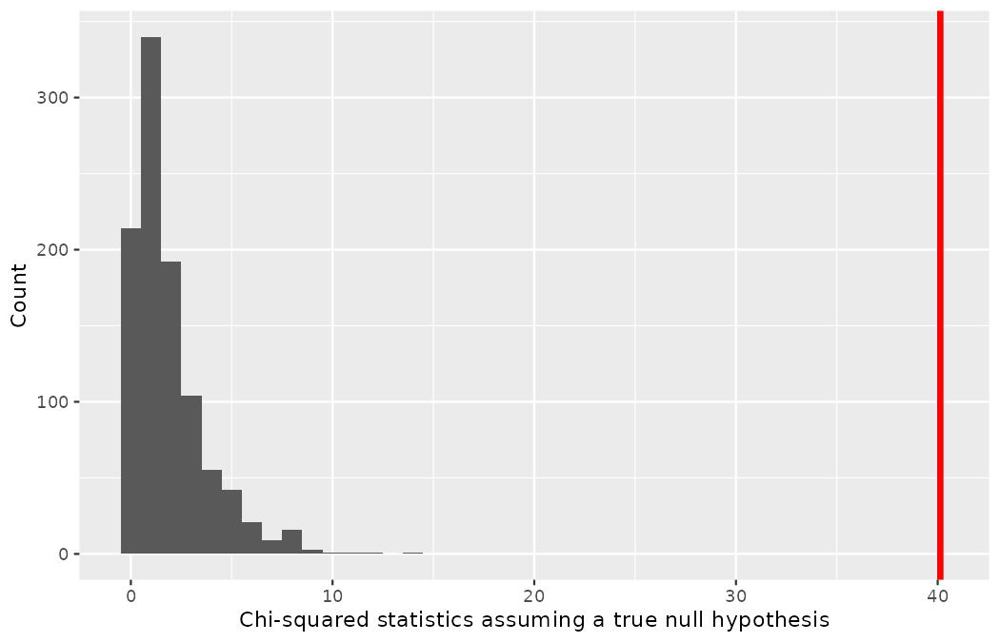
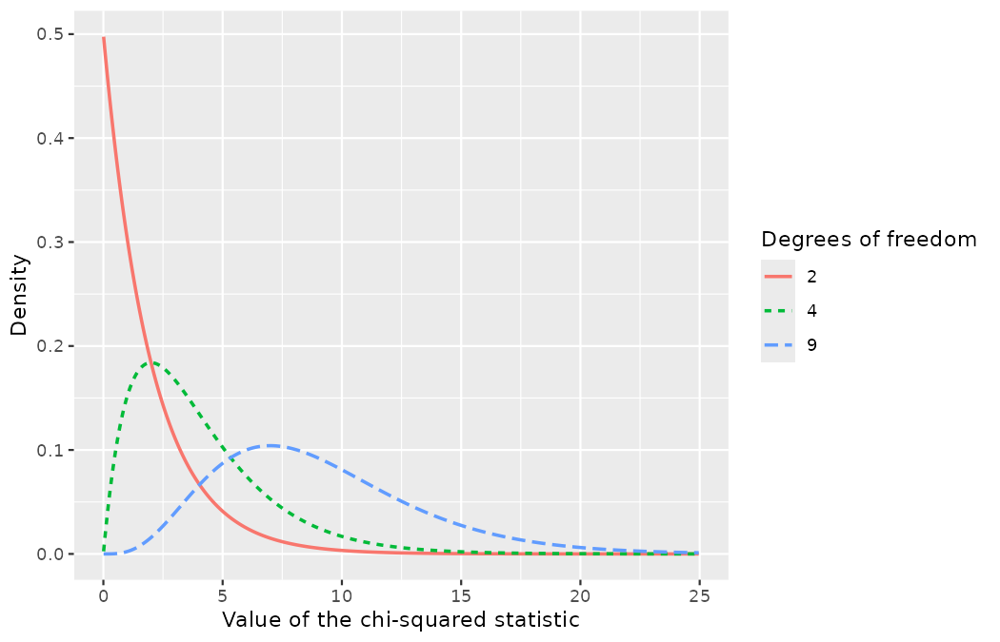
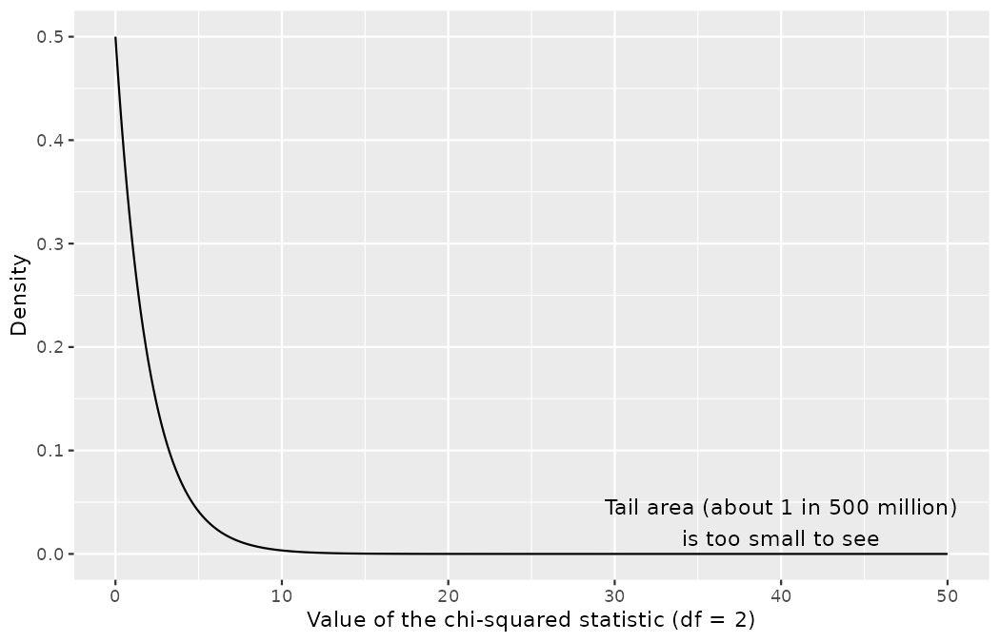

# Inference for two-way tables {#sec-inference-tables}

::: {.chapterintro}
In @sec-inference-two-props our focus was on the difference in proportions, a statistic calculated from finding the success proportions (from the binary response variable) measured across two groups (the binary explanatory variable).
As we will see in the examples below, sometimes the explanatory or response variables have more than two possible options.
In that setting, a difference across two groups is not sufficient, and the proportion of "success" is not well defined if there are 3 or 4 or more possible response levels.
The primary way to summarize categorical data where the explanatory and response variables both have 2 or more levels is through a two-way table — the contingency tables you have been reading since @sec-explore-categorical — as in @tbl-disclose219-obs.

Note that with two-way tables, there is not an obvious single parameter of interest.
Instead, research questions usually focus on how the proportions of the response variable change (or not) across the different levels of the explanatory variable.
Because there is not a population parameter to estimate, bootstrapping to find the standard error of the estimate (the machinery of @sec-foundations-bootstrapping) is not meaningful.
As such, for two-way tables, we will focus on the randomization test and the corresponding mathematical approximation (and not bootstrapping).
:::

## Randomization test of independence

Clubs buy and sell players constantly, and a buying club would like to believe that the selling side will be forthright about any underlying problems with the player being sold.
This is not something a sporting director should take for granted, and Marta Vidal does not: after a transfer target's "minor knock" turned out to be a third recurrence, she asked Priya Rao to study *when sellers tell the truth*.
Priya recruited 219 scouts and analysts at the league's annual scouting convention for a role-play study in which each participant had to sell a fictional prospect who was known to have broken down twice with the same hamstring injury in the past two seasons.[^ch18-1]
Every participant received the identical dossier, including the confidential medical appendix documenting the two breakdowns, and was incentivized to negotiate the best fee they could: on top of a fixed participation fee, each kept a small cut of whatever transfer fee they agreed in the exercise.
The research question was what types of questions from the buying side would elicit the seller to disclose the injury concern.

[^ch18-1]: The prospect, the medical note, and the negotiation were all fictional, and the participants knew they were in a role-play exercise — no real medical information about any player was involved.
    This is a constructed Northbridge scenario in the sense of @sec-foundations-randomization: the dataset is built in visible code below, and every number in this section can be reproduced from it.

Unbeknownst to the participants, who acted as the sellers in the study, the "sporting directors" they negotiated with were collaborating with Priya to evaluate the influence of different questions on the likelihood of getting the sellers to disclose the injury history.
The scripted buyers started with "Okay, I suppose I should go first. So, he has been with your club for two seasons now ..." and ended with one of three prompts:

-   General: Tell me about him.
-   Positive assumption: No weaknesses, right?
-   Negative assumption: What are his weaknesses?

The prompt is the treatment given to the sellers, and the response is whether the prompt led them to disclose the hamstring concern.
Which seller heard which prompt was determined by random assignment: 73 scouts to each of the three prompts.
The code below constructs the `disclose219` data, one row per participant.

```r
library(dplyr)
library(tidyr)
library(readr)
library(ggplot2)
library(infer)

disclose219 <- tibble(
  prompt = factor(
    rep(c("Tell me about him", "No weaknesses, right?", "What are his weaknesses?"),
        each = 73),
    levels = c("Tell me about him", "No weaknesses, right?", "What are his weaknesses?")
  ),
  response = factor(
    c(rep("Disclose concern", 2),  rep("Withhold concern", 71),
      rep("Disclose concern", 23), rep("Withhold concern", 50),
      rep("Disclose concern", 36), rep("Withhold concern", 37)),
    levels = c("Disclose concern", "Withhold concern")
  )
)

disclose219 |>
  count(prompt, response) |>
  pivot_wider(names_from = response, values_from = n)
#> # A tibble: 3 × 3
#>   prompt                   `Disclose concern` `Withhold concern`
#>   <fct>                                 <int>              <int>
#> 1 Tell me about him                         2                 71
#> 2 No weaknesses, right?                    23                 50
#> 3 What are his weaknesses?                 36                 37
```

The results are summarized in @tbl-disclose219-obs, and the data suggest that asking *What are his weaknesses?* was the most effective prompt for getting the seller to disclose the injury history.
However, you should also be asking yourself the question this book has trained you to ask since @sec-foundations-randomization: could we see these results due to chance alone, if there really is no difference between the prompts, or is this in fact evidence that some questions are more effective for getting at the truth?

| Prompt                   | Disclose concern | Withhold concern | Total |
|:-------------------------|-----------------:|-----------------:|------:|
| Tell me about him        |                2 |               71 |    73 |
| No weaknesses, right?    |               23 |               50 |    73 |
| What are his weaknesses? |               36 |               37 |    73 |
| Total                    |               61 |              158 |   219 |

: Summary of the disclosure study, by the prompt posed to the study participant who acted as the seller. {#tbl-disclose219-obs}

```r
disclose219 |>
  group_by(prompt) |>
  summarize(n = n(), p_disclose = mean(response == "Disclose concern"))
#> # A tibble: 3 × 3
#>   prompt                       n p_disclose
#>   <fct>                    <int>      <dbl>
#> 1 Tell me about him           73     0.0274
#> 2 No weaknesses, right?       73     0.315
#> 3 What are his weaknesses?    73     0.493
```

Only $2/73 = 2.7\%$ of the sellers volunteered the hamstring history when merely invited to talk; $23/73 = 31.5\%$ disclosed when the buyer assumed there were no problems; $36/73 = 49.3\%$ disclosed when asked directly for weaknesses.
The hypothesis test for this experiment is really about assessing whether there is convincing evidence that there was a difference in the disclosure rates that each prompt produced.
In other words, the goal is to check whether the buyer's prompt was **independent** of whether the seller disclosed the concern — the same notion of independence you met in @sec-foundations-randomization, now with an explanatory variable that has *three* levels rather than two.
Notice why the tools of @sec-inference-two-props do not directly apply: with three groups there is no single "difference in proportions" to serve as the test statistic.
We need a statistic that measures how far an entire table sits from independence.

### Expected counts in two-way tables

While we would not expect the number of disclosures to be exactly the same across the three prompt groups, the rate of disclosure seems substantially different across the three groups.
In order to investigate whether the differences in rates are due to natural variability in scouts' honesty or due to a treatment effect (i.e., the prompt causing the differences), we need to compute estimated counts for each cell in the two-way table.

::: {.callout-note title="Worked example"}
From the experiment, we can compute the proportion of all sellers who disclosed the concern as $61/219 = 0.2785.$
If there really is no difference among the prompts, and 27.85% of sellers were going to disclose the concern no matter the prompt they were given, how many of the 73 sellers in the *Tell me about him* group would we have expected to disclose the concern?

------------------------------------------------------------------------

We would predict that $0.2785 \times 73 = 20.33$ sellers would disclose the concern.
Obviously we observed fewer than this — two — though it is not yet clear if that is due to chance variation or whether it is because the prompts vary in how effective they are at getting to the truth.
:::

::: {.callout-tip title="Check your understanding"}
If the prompts were actually equally effective, meaning about 27.85% of sellers would disclose the concern regardless of the prompt they heard, about how many sellers would we expect to *withhold* the concern in the *No weaknesses, right?* group?

------------------------------------------------------------------------

We would expect $(1 - 0.2785) \times 73 = 52.67.$
It is okay that this result, like the result from the worked example above, is a fraction — expected counts are long-run averages under the null hypothesis, not predictions of a single whole-number outcome.
:::

We can compute, for every cell of the table, the number of sellers we would expect to disclose or withhold the concern if the prompts had no impact.
The `chisq.test()` function computes them all at once:

```r
chisq.test(table(disclose219$prompt, disclose219$response))$expected
#>
#>                            Disclose concern Withhold concern
#>   Tell me about him                20.33333         52.66667
#>   No weaknesses, right?            20.33333         52.66667
#>   What are his weaknesses?         20.33333         52.66667
```

These expected counts were used to construct @tbl-disclose219-expected, which is the same as @tbl-disclose219-obs, except now the expected counts have been added in parentheses.

| Prompt                   | Disclose concern | Withhold concern | Total |
|:-------------------------|-----------------:|-----------------:|------:|
| Tell me about him        |        2 (20.33) |       71 (52.67) |    73 |
| No weaknesses, right?    |       23 (20.33) |       50 (52.67) |    73 |
| What are his weaknesses? |       36 (20.33) |       37 (52.67) |    73 |
| Total                    |               61 |              158 |   219 |

: The observed counts and the (expected counts) for the disclosure experiment. {#tbl-disclose219-expected}

The example and the check above provided some help in computing expected counts.
In general, expected counts for a two-way table may be computed using the row totals, column totals, and the table total.
For instance, if there was no difference between the groups, then about 27.85% of each row should be in the first column:

$$
\begin{aligned}
0.2785 \times (\text{row 1 total}) &= 20.33 \\
0.2785 \times (\text{row 2 total}) &= 20.33 \\
0.2785 \times (\text{row 3 total}) &= 20.33
\end{aligned}
$$

Looking back to how 0.2785 was computed — as the fraction of sellers who disclosed the concern $(61/219),$ i.e., the column 1 total over the table total — these three expected counts could have been computed as

$$
\begin{aligned}
\left(\frac{\text{column 1 total}}{\text{table total}}\right)
    (\text{row 1 total}) &= 20.33 \\
\left(\frac{\text{column 1 total}}{\text{table total}}\right)
    (\text{row 2 total}) &= 20.33 \\
\left(\frac{\text{column 1 total}}{\text{table total}}\right)
    (\text{row 3 total}) &= 20.33
\end{aligned}
$$

This leads us to a general formula for computing expected counts in a two-way table when we would like to test whether there is strong evidence of an association between the column variable and row variable.

::: {.callout-important title="Computing expected counts in a two-way table"}
To calculate the expected count for the $i^{th}$ row and $j^{th}$ column, compute

$$\text{Expected Count}_{\text{row }i,\text{ col }j} = \frac{(\text{row $i$ total}) \times (\text{column $j$ total})}{\text{table total}}$$

These are the **expected counts**: the cell counts we would anticipate, on average, if the null hypothesis of independence were true and only the margins of the table were kept.
:::

Read the subscript before using the formula.
The indices $i$ and $j$ are generic position labels of the kind you have used since @sec-explore-numerical, where $x_i$ meant "the $i^{th}$ observation" — except a table cell needs *two* coordinates, so it carries two indices: $i$ runs over the rows (here $i = 1, 2, 3,$ the three prompts) and $j$ over the columns (here $j = 1, 2,$ disclose or withhold).
The numerator multiplies the two margins the cell sits at the intersection of, and the denominator rescales by the table total so that the expected counts in any row add back up to that row's total (and likewise for columns).
Check it once by hand: for row 3, column 1, $\text{Expected Count}_{\text{row }3,\text{ col }1} = (73 \times 61)/219 = 20.33,$ matching @tbl-disclose219-expected.

### The observed chi-squared statistic

We need a test statistic that collapses an entire table's worth of disagreement between observed and expected counts into a single number.
The statistic used for this job is written $X^2,$ and since this is the first time the symbol appears in this book, take it apart before using it.
The letter is a capital $X$ — the Latin stand-in for the Greek letter $\chi,$ *chi* (pronounced "kai") — so $X^2$ is read "chi-squared."[^ch18-2]
The superscript 2 is part of the statistic's *name*, not an instruction to square some previously defined quantity $X$: it advertises that the statistic is assembled by summing *squared* discrepancies, one per cell.
That construction has two consequences worth registering immediately.
First, $X^2$ can never be negative.
Second, $X^2$ is blind to direction — a cell with too many counts and a cell with too few both push $X^2$ upward — so evidence against independence accumulates on one side only: large values of $X^2.$

[^ch18-2]: Many texts write the same statistic as $\chi^2,$ using the Greek letter directly; R's output prints it as `X-squared`.
    All three are the same object.

The **chi-squared test statistic** for a two-way table is found by finding the ratio of how far the observed counts are from the expected counts, as compared to the expected counts, for every cell in the table.
Take the per-cell recipe apart the same way: the difference $(\text{observed} - \text{expected})$ measures how far the data sit from the null hypothesis in that cell; squaring it stops positive and negative discrepancies from cancelling when we add the cells up; and dividing by the expected count puts the discrepancy on the right scale — being off by 8 sellers is startling in a cell expecting 20.33, and trivial in a cell expecting 2,000.
For each table count, compute:

$$
\begin{aligned}
&\text{General formula} &&
    \frac{(\text{observed count } - \text{expected count})^2}
        {\text{expected count}} \\
&\text{Row 1, Col 1} &&
    \frac{(2 - 20.33)^2}{20.33} = 16.53 \\
&\text{Row 2, Col 1} &&
    \frac{(23 - 20.33)^2}{20.33} = 0.35 \\
& \hspace{9mm}\vdots &&
    \hspace{13mm}\vdots \\
&\text{Row 3, Col 2} &&
    \frac{(37 - 52.67)^2}{52.67} = 4.66
\end{aligned}
$$

Adding the computed value for each cell gives the chi-squared test statistic $X^2:$

$$X^2 = 16.53 + 0.35 + \dots + 4.66 = 40.13$$

::: {.callout-tip title="Check your understanding"}
Two of the six cells are hidden in the $\vdots$ above.
Compute the contribution of the Row 3, Column 1 cell — the 36 sellers who disclosed when asked *What are his weaknesses?*

------------------------------------------------------------------------

$\dfrac{(36 - 20.33)^2}{20.33} = 12.08.$
Along with the 16.53 from the *Tell me about him* disclosures, this is one of the two largest contributions: the general prompt produced far *fewer* disclosures than independence predicts, and the direct question far *more*.
Both discrepancies push $X^2$ up — squaring has already discarded their directions.
:::

Is 40.13 a big number?
That is, does it indicate that the observed and expected values are really different?
Or is 40.13 a value of the statistic we would expect to see just due to natural variability?
Previously, we applied the randomization test to the setting where the research question investigated a difference in proportions.
The same idea of shuffling the data under the null hypothesis — Priya's deck of response cards from @sec-foundations-randomization — can be used in the setting of the two-way table.

### Variability of the statistic

Assuming that the sellers would disclose or withhold the concern **regardless** of the prompt they heard (i.e., that the null hypothesis is true), we can randomize the data by reassigning the 61 disclosures and 158 withholdings to the three prompt groups at random.
Physically: write each of the 219 responses on a card, shuffle the deck, and deal 73 cards back to each prompt.
The seeded code below performs one such shuffle, summarized in @tbl-disclose219-rand-1 (in contrast to the original observed data in @tbl-disclose219-obs).

```r
set.seed(1801)
disclose219_shuffle_1 <- disclose219 |>
  mutate(response = sample(response))

disclose219_shuffle_1 |>
  count(prompt, response) |>
  pivot_wider(names_from = response, values_from = n)
#> # A tibble: 3 × 3
#>   prompt                   `Disclose concern` `Withhold concern`
#>   <fct>                                 <int>              <int>
#> 1 Tell me about him                        27                 46
#> 2 No weaknesses, right?                    16                 57
#> 3 What are his weaknesses?                 18                 55
```

| Prompt                   | Disclose concern | Withhold concern | Total |
|:-------------------------|-----------------:|-----------------:|------:|
| Tell me about him        |               27 |               46 |    73 |
| No weaknesses, right?    |               16 |               57 |    73 |
| What are his weaknesses? |               18 |               55 |    73 |
| Total                    |               61 |              158 |   219 |

: One randomization of the disclosure study, produced under the condition that the null hypothesis is true. {#tbl-disclose219-rand-1}

Note that the row and column totals are identical to those of @tbl-disclose219-obs — the shuffle moves responses between groups but creates or destroys nothing — so the expected counts are unchanged: 20.33 and 52.67 in every row.
As before, the randomized data are used to find a single value for the test statistic.
The chi-squared statistic for the randomized two-way table is found by comparing the observed and expected counts for each cell in the *randomized* table.
For each cell, compute:

$$
\begin{aligned}
&\text{General formula} &&
    \frac{(\text{observed count } - \text{expected count})^2}
        {\text{expected count}} \\
&\text{Row 1, Col 1} &&
    \frac{(27 - 20.33)^2}{20.33} = 2.19 \\
&\text{Row 2, Col 1} &&
    \frac{(16 - 20.33)^2}{20.33} = 0.92 \\
& \hspace{9mm}\vdots &&
    \hspace{13mm}\vdots \\
&\text{Row 3, Col 2} &&
    \frac{(55 - 52.67)^2}{52.67} = 0.10
\end{aligned}
$$

Adding the computed value for each cell gives the chi-squared statistic for the shuffled table:

$$X^2_{shfl1} = 2.19 + 0.92 + \dots + 0.10 = 4.68$$

(The subscript, as always, is only a label: this is the statistic computed from shuffle number one.)
A table built by pure chance produced $X^2 = 4.68$; the real experiment produced $X^2 = 40.13.$
One shuffle, however, proves nothing on its own — we need the whole distribution.

### Observed statistic vs. null chi-squared statistics

As before, one randomization is not sufficient for understanding the variability of chi-squared statistics when $H_0$ is true.
To investigate whether 40.13 is large enough to indicate that the observed and expected counts are substantially different, we need to know what values of the chi-squared statistic we would expect to see if the null hypothesis were true.
The **infer** pipeline is the one you know from @sec-foundations-randomization, with a single change: `calculate()` now computes a chi-squared statistic instead of a difference in proportions.

```r
disclose219_obs_x2 <- disclose219 |>
  specify(response ~ prompt) |>
  calculate(stat = "Chisq") |>
  pull()

disclose219_obs_x2
#> X-squared
#>  40.12803

set.seed(1801)
disclose219_null <- disclose219 |>
  specify(response ~ prompt) |>
  hypothesize(null = "independence") |>
  generate(reps = 1000, type = "permute") |>
  calculate(stat = "Chisq")

disclose219_null |>
  summarize(
    n_extreme = sum(stat >= disclose219_obs_x2),
    p_value   = mean(stat >= disclose219_obs_x2)
  )
#> # A tibble: 1 × 2
#>   n_extreme p_value
#>       <int>   <dbl>
#> 1         0       0
```

Because the tail of interest for $X^2$ is only the right tail — large values are the ones that testify against independence — the p-value counts the shuffles with a statistic *at least as large* as the observed one.
(With the same seed, the first of the 1,000 permutations is exactly the hand shuffle of @tbl-disclose219-rand-1, with its statistic of 4.68.)
The histogram of the 1,000 null statistics is drawn by the code below.

```r
ggplot(disclose219_null, aes(x = stat)) +
  geom_histogram(binwidth = 1) +
  geom_vline(xintercept = 40.13, color = "red", linewidth = 1.5) +
  expand_limits(x = 40.13) +
  labs(
    x = "Chi-squared statistics assuming a true null hypothesis",
    y = "Count"
  )
```

{fig-alt="Histogram of 1,000 chi-squared statistics simulated assuming a true null hypothesis, piling up between 0 and about 8 and thinning out rapidly, with the largest at only 13.7. A red vertical line marks the observed statistic of 40.13, far beyond all of the simulated values." width=85%}

The 1,000 simulated statistics pile up between 0 and about 8, thin out rapidly, and the largest of all 1,000 is only 13.7:

```r
disclose219_null |>
  summarize(largest_null = max(stat))
#> # A tibble: 1 × 1
#>   largest_null
#>          <dbl>
#> 1         13.7
```

The observed statistic of 40.13 sits so far beyond the null statistics that none of the 1,000 simulations had a chi-squared value of at least 40.13 — the summary above prints `0`, but the honest report is $p < 1/1000,$ not $p = 0$: a simulated p-value is never exactly zero, only smaller than what the number of shuffles can resolve.
In fact, none of them came anywhere close.
The probability of seeing the observed statistic when the null hypothesis is true is virtually zero, and we conclude that a seller's decision to disclose the injury history is changed by the prompt the buyer uses.
We use the causal language of "changed" because the study was an experiment — the prompts were randomly assigned.
Note, however, what the chi-squared test does and does not deliver: we know the two variables `prompt` and `response` are related (i.e., not independent), but the statistic alone does not certify *which* prompt causes which response — for that we go back to the table and read the disclosure rates, remembering that the test has only licensed the claim that the differences among them are not chance.

::: {.callout-tip title="Check your understanding"}
Marta Vidal's takeaway from the study was blunt: "So my directors should always ask the negative-assumption question."
The test statistic was $X^2 = 40.13$ with a p-value of essentially zero.
Does the hypothesis test itself justify her specific instruction?

------------------------------------------------------------------------

Not by itself.
The test rejects independence: some prompts genuinely elicit different disclosure rates.
Her *specific* recommendation comes from descriptive follow-up — the observed rates of 2.7%, 31.5%, and 49.3% — not from the chi-squared statistic, which would have been just as large if the pattern had been reversed.
The test and the table answer different questions, and a competent analyst reports both: the test says the pattern is real, the table says what the pattern is.
:::

## Mathematical model for test of independence {#sec-mathchisq}

### The chi-squared test of independence

In @sec-inference-two-props we applied the Central Limit Theorem to the sampling variability of $\hat{p}_1 - \hat{p}_2.$
The result was that we could use the normal distribution — $z^\star$ values and p-values from $Z$ scores, as in @sec-inference-one-prop — to complete the mathematical inferential procedure.
The chi-squared test statistic does not follow a normal distribution; how could it, when it is never negative and piles up near zero?
It has a different mathematical distribution, called the Chi-squared distribution.
The important specification to make in describing a chi-squared distribution is something called its *degrees of freedom*.
The degrees of freedom change the shape of the chi-squared distribution to fit the problem at hand.
The code below draws chi-squared distributions corresponding to three different degrees of freedom.

```r
chisq_densities <- crossing(x = seq(0.01, 25, 0.05), df = c(2, 4, 9)) |>
  mutate(density = dchisq(x, df), df = factor(df))

ggplot(chisq_densities, aes(x = x, y = density, color = df, linetype = df)) +
  geom_line(linewidth = 0.8) +
  labs(
    x = "Value of the chi-squared statistic",
    y = "Density",
    color = "Degrees of freedom",
    linetype = "Degrees of freedom"
  )
```

{fig-alt="Density curves of chi-squared distributions with 2, 4, and 9 degrees of freedom, all living entirely to the right of zero and skewed right. The smaller the degrees of freedom, the more sharply the density peaks near zero; the larger the degrees of freedom, the further right the bulk shifts and the longer the right tail extends." width=85%}

All three curves live entirely to the right of zero and are skewed right, like every distribution of $X^2$ must be.
The larger the degrees of freedom, the longer the right tail extends and the further right the bulk of the distribution shifts; the smaller the degrees of freedom, the more sharply the density peaks near zero.
Unlike the normal distribution of @sec-foundations-mathematical, which needs two numbers to pin it down $(N(\mu, \sigma)),$ a chi-squared distribution is fully specified by the single degrees-of-freedom parameter.

### Variability of the chi-squared statistic

As it turns out, when the null hypothesis is true, the distribution of the chi-squared test statistic is well approximated by a **Chi-squared distribution**.
For two-way tables, the degrees of freedom is equal to

$$df = \text{(number of rows minus 1)} \times \text{(number of columns minus 1)}$$

In our example, the table has 3 rows (the prompts) and 2 columns (the responses), so the degrees of freedom parameter is $df = (3 - 1) \times (2 - 1) = 2.$

### Observed statistic vs. the chi-squared distribution

::: {.callout-important title="The chi-squared test statistic"}
**The test statistic for assessing the independence between two categorical variables is a** $X^2.$

The $X^2$ statistic is a ratio of how the observed counts vary from the expected counts as compared to the expected counts (which are a measure of how large the sample size is).

$$X^2 = \sum_{i,j} \frac{(\text{observed count} - \text{expected count})^2}{\text{expected count}}$$

When the null hypothesis is true and the conditions are met, the distribution of $X^2$ is well approximated by a Chi-squared distribution with $df = (R - 1) \times (C - 1).$

Conditions:

-   Independent observations
-   Large samples: 5 expected counts in each cell
:::

One new piece of notation appears in the display: the summation sign $\Sigma$ you have used since @sec-explore-numerical here carries the *double* index $i,j.$
Where $\sum_i$ walked through a list one observation at a time, $\sum_{i,j}$ walks through every (row, column) combination — every cell of the table, six of them in the disclosure study.

To bring it back to the example: we can safely assume that the observations are independent, as the prompt groups were randomly assigned, and there are over 5 expected counts in each cell (the smallest is 20.33), so the conditions for using the chi-squared distribution are met.
If the null hypothesis is true (i.e., the prompts had no impact on the sellers), then the test statistic $X^2 = 40.13$ is expected to approximately follow a chi-squared distribution with 2 degrees of freedom.

::: {.callout-important title="Computing degrees of freedom for a two-way table"}
When applying the chi-squared test to a two-way table, we use

$$df = (R - 1) \times (C - 1)$$

where $R$ is the number of rows in the table and $C$ is the number of columns.
:::

This is the book's first encounter with *degrees of freedom*, so take the formula apart rather than memorizing it.
The abbreviation $df$ names the parameter; $R$ counts the table's rows and $C$ its columns.
The "minus ones" are earned, not decorative: the null distribution is generated by shuffles that hold every row total and every column total fixed, and with the margins pinned down, most of the table is not free to move.
In the $3 \times 2$ disclosure table, once you choose the Disclose count for two of the three prompt rows, everything else is forced — the third Disclose count must bring column 1 to its total of 61, and each Withhold count must bring its row to 73.
Exactly $(3 - 1) \times (2 - 1) = 2$ cells can vary before the margins lock the rest, and that count of free cells is the degrees of freedom.

::: {.callout-tip title="Check your understanding"}
A club survey cross-tabulates four age cohorts of respondents against a yes/no answer, giving a $4 \times 2$ table.
What is $df$?
And why does the number of respondents not appear in your calculation?

------------------------------------------------------------------------

$df = (4 - 1) \times (2 - 1) = 3.$
Degrees of freedom count the cells free to vary once the margins are fixed, which depends only on the table's shape.
The sample size enters the test elsewhere — through the expected counts inside $X^2$ itself: with more data, the same *proportional* deviation from independence produces a larger statistic.
:::

Using the mathematical model, we can compute the p-value for the disclosure test: the area under the chi-squared curve with $df = 2$ to the right of the observed statistic.
The code below shades it.

```r
chisq_df2 <- tibble(x = seq(0, 50, 0.05), density = dchisq(x, 2))

ggplot(chisq_df2, aes(x = x, y = density)) +
  geom_line() +
  geom_area(data = filter(chisq_df2, x >= 40.13), fill = "red") +
  annotate("text", x = 40, y = 0.03,
           label = "Tail area (about 1 in 500 million)\nis too small to see") +
  labs(x = "Value of the chi-squared statistic (df = 2)", y = "Density")
```

{fig-alt="Chi-squared density curve with 2 degrees of freedom, which has effectively finished its descent long before the observed statistic of 40.13. The shaded tail area, about 1 in 500 million, is too small to see at any reasonable scale." width=85%}

The curve has effectively finished its descent long before 40.13: the shaded region exists mathematically but cannot be seen at any reasonable scale.
In R, the function `pchisq()` computes chi-squared tail areas.
Just like `pnorm()` from @sec-foundations-mathematical, `pchisq()` always gives the area to the *left* of the cutoff value; because the p-value here is the area to the *right* of 40.13, we subtract the output from 1.

```r
1 - pchisq(40.13, df = 2)
#> [1] 1.93144e-09
```

::: {.callout-note title="Worked example"}
Find the p-value and draw a conclusion about whether the prompt affects the sellers' likelihood of disclosing the injury concern.

------------------------------------------------------------------------

Using a computer, we can compute a very precise value for the tail area above $X^2 = 40.13$ for a chi-squared distribution with 2 degrees of freedom: about 0.000000002, roughly 1 in 500 million.

Using a discernibility level of $\alpha = 0.05,$ the null hypothesis is rejected since the p-value is smaller.
That is, the data provide convincing evidence that the prompt asked did affect a seller's likelihood of telling the truth about the prospect's injury history.
Note also how well the two approaches agree: the permutation test said "0 shuffles in 1,000," and the mathematical model refines that to "about 1 run of the experiment in 500 million."
:::

::: {.callout-note title="Worked example"}
@tbl-benchmark699-obs summarizes the results of an experiment run by Jonas Beck, Northbridge's academy director, across the club's partner academies.
The subjects were 699 under-18 players who had fallen behind their individualized development benchmarks while training on the standard drill program.
Each player was randomly assigned to one of three arms for a full season: continued *standard drills*, standard drills plus *VR decision training*, or a structured *recovery program* built around load management.
Each player had a primary outcome: missing their end-of-season benchmark (a failure) or meeting it (a success).
What are appropriate hypotheses for this test?

------------------------------------------------------------------------

-   $H_0:$ There is no difference in the effectiveness of the three programs.
-   $H_A:$ There is some difference in effectiveness between the three programs, e.g., perhaps the VR decision training performed better than the recovery program.
:::

This, too, is a constructed Northbridge scenario, built by the code below.
(The seeded `slice_sample()` only shuffles the row order of the finished data frame, so that the roster does not list every benchmark-missing player first — the order of rows carries no information.)

```r
benchmark699 <- tribble(
  ~arm,                   ~outcome,           ~n,
  "Standard drills",      "Benchmark missed", 120,
  "Standard drills",      "Benchmark met",    112,
  "VR decision training", "Benchmark missed",  90,
  "VR decision training", "Benchmark met",    143,
  "Recovery program",     "Benchmark missed", 109,
  "Recovery program",     "Benchmark met",    125
) |>
  uncount(weights = n) |>
  mutate(
    arm = factor(arm, levels = c("Standard drills", "VR decision training",
                                 "Recovery program")),
    outcome = factor(outcome, levels = c("Benchmark missed", "Benchmark met"))
  )

set.seed(1802)
benchmark699 <- benchmark699 |>
  slice_sample(prop = 1)

benchmark699 |>
  count(arm, outcome) |>
  pivot_wider(names_from = outcome, values_from = n)
#> # A tibble: 3 × 3
#>   arm                  `Benchmark missed` `Benchmark met`
#>   <fct>                             <int>           <int>
#> 1 Standard drills                     120             112
#> 2 VR decision training                 90             143
#> 3 Recovery program                    109             125
```

| Arm                  | Benchmark missed | Benchmark met | Total |
|:---------------------|-----------------:|--------------:|------:|
| Standard drills      |              120 |           112 |   232 |
| VR decision training |               90 |           143 |   233 |
| Recovery program     |              109 |           125 |   234 |
| Total                |              319 |           380 |   699 |

: Results of Jonas Beck's three-arm academy intervention. {#tbl-benchmark699-obs}

Typically we will use a computer to do the computational work of finding the chi-squared statistic.
However, it is always good to have a sense for what the computer is doing, and in particular, calculating the values which would be expected if the null hypothesis were true can help in understanding the null hypothesis claim.
Additionally, comparing the expected and observed values by eye often gives the researcher some insight into why or why not the null hypothesis for a given test will be rejected.

::: {.callout-tip title="Check your understanding"}
A chi-squared test for a two-way table may be used to test the hypotheses in the worked example above.
To get a sense for the statistic used in the chi-squared test, first compute the expected values for each of the six table cells.

------------------------------------------------------------------------

The expected count for row one / column one is found by multiplying the row one total (232) and the column one total (319), then dividing by the table total (699): $\frac{232 \times 319}{699} = 105.9.$
Similarly for the second column and the first row: $\frac{232 \times 380}{699} = 126.1.$
Row 2: $\frac{233 \times 319}{699} = 106.3$ and $\frac{233 \times 380}{699} = 126.7.$
Row 3: $\frac{234 \times 319}{699} = 106.8$ and $\frac{234 \times 380}{699} = 127.2.$
Comparing by eye: the VR arm missed the benchmark 90 times against an expectation of 106.3 — the largest-magnitude discrepancy in the table (matched, as the two cells of a row must be under fixed row totals, by the $+16.3$ in the VR-met cell), and the reason the VR row will contribute most to the statistic.
:::

We deliberately leave Jonas's experiment at the expected counts — the by-eye comparison is the skill this example exercises; carrying it to a verdict takes exactly the machinery already run on the disclosure study ($X^2$ summed over the six cells, $df = (3 - 1) \times (2 - 1) = 2,$ then a permutation null or `pchisq()`), and @sec-chp18-real-table next runs that full sequence end to end on real tournament data.

Note, when analyzing 2-by-2 contingency tables (that is, when both variables have only two possible options), one guideline is to use the two-proportion methods introduced in @sec-inference-two-props.

## A permutation test on real shots: play pattern and goals {#sec-chp18-real-table}

Both studies above were experiments: Priya randomized the prompts, and Jonas randomized the training arms.
As in @sec-foundations-randomization, the shuffling machinery works identically on observational data — it is then called a permutation test, and its conclusions weaken from causation to association.
Here is a claim Emil Sørensen hears from his scouts every recruitment cycle: *counter-attacks are gold — target teams that generate shots on the counter, because those chances get finished.*
The 2022 Men's World Cup data can put a two-way table under that claim: is the way a shot's possession began associated with whether the shot was scored?

The `play_pattern` variable has nine levels — you met all nine in the pie-chart lesson of @sec-explore-categorical — and several are too thin to stand as their own rows.
We collapse them into three analytic groups, and since collapsing is an analytical decision, we state the mapping and the reasoning rather than hiding either:

-   *set piece*: `From Free Kick` and `From Corner` — possessions that deliver the ball toward goal directly from a dead-ball situation;
-   *counter*: `From Counter` — the pattern under the scouts' claim;
-   *open play*: `Regular Play`, plus possessions restarted from throw-ins, goal kicks, keeper distributions, and kick-offs — by the time a shot arrives in these possessions, play is live and contested.

That accounts for eight of the nine levels.
The ninth, `Other`, demands the discipline this book's penalty convention has drilled since @sec-data-applications: ask which shots are in the frame *before* testing.

```r
wc2022_shots <- read_csv("data/derived/wc2022_shots.csv")

wc2022_shots |>
  filter(play_pattern == "Other") |>
  count(shot_type, goal)
#> # A tibble: 3 × 3
#>   shot_type goal      n
#>   <chr>     <lgl> <int>
#> 1 Open Play FALSE     4
#> 2 Penalty   FALSE    21
#> 3 Penalty   TRUE     43
```

The `Other` bucket holds 68 shots: all 64 of the tournament's penalty kicks — which carry `play_pattern` `"Other"` in these data, converting at $43/64 = 0.672$ — plus 4 open-play-tagged shots, none of which scored.
Penalties have no place in a test about how *possessions* produce goals: they are awarded, not built, and they convert at more than six times the rate of everything else.
So we exclude the entire `Other` bucket with a stated filter, `play_pattern != "Other"`, and quantify what it removes: 68 shots (64 penalties with 43 goals, plus the 4 goalless open-play-tagged shots, which the label `Other` gives no basis for assigning to any of our three groups).
That leaves $1{,}494 - 68 = 1{,}426$ shots.
Per the convention, first look at what would happen if we did *not* filter, and kept `Other` as a fourth row:

```r
wc_pattern4 <- wc2022_shots |>
  mutate(
    pattern4 = case_when(
      play_pattern %in% c("From Free Kick", "From Corner") ~ "set piece",
      play_pattern == "From Counter" ~ "counter",
      play_pattern == "Other" ~ "other",
      .default = "open play"
    )
  )

chisq.test(table(wc_pattern4$pattern4, wc_pattern4$goal))
#>
#> 	Pearson's Chi-squared test
#>
#> data:  table(wc_pattern4$pattern4, wc_pattern4$goal)
#> X-squared = 161.97, df = 3, p-value < 2.2e-16
#>
```

A monstrous $X^2 = 162$ — and it would be almost entirely an artifact: a fourth row converting at $43/68 = 0.632$ because 64 of its 68 shots were uncontested kicks from twelve yards.
The "association between play pattern and goals" that this test screams about is mostly the rule book's penalty spot.
Now the honest frame:

```r
wc_pattern <- wc2022_shots |>
  filter(play_pattern != "Other") |>
  mutate(
    pattern3 = case_when(
      play_pattern %in% c("From Free Kick", "From Corner") ~ "set piece",
      play_pattern == "From Counter" ~ "counter",
      .default = "open play"
    ),
    pattern3 = factor(pattern3, levels = c("open play", "set piece", "counter")),
    result = factor(if_else(goal, "goal", "no goal"), levels = c("goal", "no goal"))
  )

wc_pattern |>
  group_by(pattern3) |>
  summarize(shots = n(), goals = sum(goal), conversion = mean(goal))
#> # A tibble: 3 × 4
#>   pattern3  shots goals conversion
#>   <fct>     <int> <int>      <dbl>
#> 1 open play   862    96     0.111
#> 2 set piece   508    46     0.0906
#> 3 counter      56    10     0.179
```

One guard against a name collision before reading further: the `pattern3` level *open play* here is a **possession** family — 862 shots whose possessions began in live play — and it is narrower than the Open Play *shot-type* frame (`shot_type == "Open Play"`, 1,382 shots) that this book's penalty convention usually filters on, since a shot arriving from a corner or free-kick possession is an Open Play shot in that frame but a set-piece possession in this table.
The two are different objects that happen to share a name; always note which one a number is conditioned on.

| Play pattern | goal | no goal | Total |
|:-------------|-----:|--------:|------:|
| open play    |   96 |     766 |   862 |
| set piece    |   46 |     462 |   508 |
| counter      |   10 |      46 |    56 |
| Total        |  152 |   1,274 | 1,426 |

: Play pattern (collapsed to three groups, penalties excluded) and shot result at the 2022 Men's World Cup. {#tbl-wcpattern-obs}

The scouts' claim looks alive: counters converted at $10/56 = 0.179,$ nearly double the open-play rate of $96/862 = 0.111,$ with set-piece possessions trailing at $46/508 = 0.0906.$
The hypotheses — written, note, in the language of association, because nobody randomly assigned play patterns to shots:

-   $H_0:$ Play pattern and shot result are independent; the variation in conversion across the three groups is due to natural variability across 1,426 shots.
-   $H_A:$ Play pattern and shot result are associated.

The expected counts under $H_0$ put the overall conversion rate of $152/1426 = 0.1066$ in every row:

```r
chisq.test(table(wc_pattern$pattern3, wc_pattern$result))$expected
#>
#>                  goal   no goal
#>   open play 91.882188 770.11781
#>   set piece 54.148668 453.85133
#>   counter    5.969144  50.03086

wc_pattern_obs_x2 <- wc_pattern |>
  specify(result ~ pattern3) |>
  calculate(stat = "Chisq") |>
  pull()

wc_pattern_obs_x2
#> X-squared
#>  4.625855
```

The observed statistic is $X^2 = 0.185 + 1.226 + 2.722 + 0.022 + 0.146 + 0.325 = 4.626,$ with the counter-goal cell contributing the most: $(10 - 5.97)^2 / 5.97 = 2.72.$
Ten goals where independence expects six — is that association, or a Tuesday's worth of chance?
One seeded shuffle first, exactly as we did by hand for the disclosure study:

```r
set.seed(1803)
wc_pattern_shuffle_1 <- wc_pattern |>
  mutate(result = sample(result))

wc_pattern_shuffle_1 |>
  group_by(pattern3) |>
  summarize(shots = n(), goals = sum(result == "goal"),
            conversion = mean(result == "goal"))
#> # A tibble: 3 × 4
#>   pattern3  shots goals conversion
#>   <fct>     <int> <int>      <dbl>
#> 1 open play   862    90     0.104
#> 2 set piece   508    58     0.114
#> 3 counter      56     4     0.0714
```

Study this shuffled table for a moment, because it is quietly instructive.
Chance alone handed the counters a conversion rate of $0.071$ — this time the *worst* of the three groups — and its statistic works out to $X^2_{shfl1} = 1.08,$ with the counter-goal cell again the largest single contributor: $(4 - 5.97)^2/5.97 = 0.65.$
A group of 56 shots swings violently from shuffle to shuffle; that is precisely why its 0.179 in the real data should not yet impress you.
Now the full test, followed by the mathematical model:

```r
set.seed(1804)
wc_pattern_null <- wc_pattern |>
  specify(result ~ pattern3) |>
  hypothesize(null = "independence") |>
  generate(reps = 1000, type = "permute") |>
  calculate(stat = "Chisq")

wc_pattern_null |>
  summarize(
    n_extreme = sum(stat >= wc_pattern_obs_x2),
    p_value   = mean(stat >= wc_pattern_obs_x2)
  )
#> # A tibble: 1 × 2
#>   n_extreme p_value
#>       <int>   <dbl>
#> 1       107   0.107
```

In 107 of 1,000 shuffles, chance alone produced a table at least as far from independence as the real one: the permutation p-value is $0.107.$
Before invoking the chi-squared distribution, check its conditions.
Independence of observations is the shakier one for shot data — shots cluster within matches and within teams — but it is the standard working assumption of shot analysis, made explicitly, as we have done since @sec-foundations-randomization.
The expected-count condition passes the bar with no room to spare: the smallest expected count, counter-goal, is $56 \times 152/1426 = 5.97$ — above 5, but close enough that had we sliced the table any thinner (say, keeping `From Kick Off` as its own row), the mathematical model would have been off the table while the permutation test soldiered on.
With $df = (3 - 1) \times (2 - 1) = 2:$

```r
1 - pchisq(4.6259, df = 2)
#> [1] 0.09896886
```

The two approaches agree closely — $0.107$ by shuffling, $0.099$ by the mathematical model — which is the chi-squared distribution doing its job as an approximation to the permutation null.
At $\alpha = 0.05,$ neither is statistically discernible: check complete, the on-field call stands.
The tournament's data do not provide convincing evidence that play pattern and shot result are associated, once the penalties are out of the frame.

Two closing disciplines, both familiar.
First, failing to reject $H_0$ is not evidence that conversion is identical across patterns — with only 56 counters, the test has little power to detect a modest real difference, the possibility @sec-foundations-decision-errors taught you to hold open.
Second, even if the p-value had cleared the bar, the conclusion would have been *association only*: play patterns are not assigned at random — teams that get to shoot on the counter tend to be teams facing stretched defenses, and the quality of the chance, not the label on the possession, may be doing the work.
The scouts' "counters are gold" survives as a hypothesis; it does not yet survive as a finding.

::: {.callout-tip title="Check your understanding"}
At the 2025 Women's Euro (you will run this table yourself in the exercises), the same three groups converted at $0.123$ (open play), $0.083$ (set piece), and $0.073$ (counter) — counters *last*, not first.
What do the two tournaments, taken together, teach about the scouts' claim?

------------------------------------------------------------------------

The direction of the counter "effect" flips between competitions, exactly as the first-time-shot reversal of @sec-foundations-decision-errors warned can happen: neither tournament's counter cell (56 and 41 shots) is large enough for its conversion rate to be stable, and neither tournament's test rejects independence.
A pattern that reverses across two tournaments and clears no discernibility bar in either is chance variation until much more data say otherwise — and a scouting recommendation built on it would be built on noise.
:::

## Chapter review {#sec-chp18-review}

### Summary

In this chapter we extended the randomization / bootstrap / mathematical model paradigm to research questions involving categorical variables with more than two levels.
We continued working with proportions of a categorical response, but the test of independence allowed for hypothesis testing on two-way tables of any shape: the expected counts describe the table the null hypothesis predicts, and the chi-squared statistic $X^2$ collapses the table's total departure from that prediction into one number.
We note that the normal model was an excellent mathematical approximation to the sampling distribution of sample proportions (or differences in sample proportions), but that questions with categorical variables having more than 2 levels required a new mathematical model, the chi-squared distribution, indexed by its degrees of freedom $df = (R-1) \times (C-1).$
As seen in @sec-foundations-randomization, @sec-foundations-bootstrapping, and @sec-foundations-mathematical, almost all research questions can be approached using computational methods (e.g., randomization tests) or using mathematical models — and when the conditions held, the two approaches agreed, in the disclosure experiment and on the World Cup shots alike.
We continue to emphasize the importance of study design in making conclusions: the disclosure and academy studies were randomized experiments, so rejecting independence there spoke to cause; the play-pattern table was observational, so the identical machinery could only ever have spoken to association — and, per the book's penalty convention, the frame had to be stated before the test was run, because leaving 64 penalty kicks in one row of a table manufactures an "association" that is really the rule book.

### Terms

The terms introduced in this chapter are presented below, alphabetized.
If you're not sure what some of these terms mean, we recommend you go back in the text and review their definitions.
You should be able to easily spot them as **bolded text**.

|  |  |  |
|:-----------------------|:-----------------------|:----------------------|
| Chi-squared distribution | chi-squared test statistic | expected counts |
| independence |  |  |

: Terms introduced in this chapter. {#tbl-terms-chp-18}

## Exercises {#sec-chp18-exercises}

Answers to odd-numbered exercises can be found in [Appendix -@sec-exercise-solutions-18]. Final answers to the even-numbered exercises are in [Appendix -@sec-appendix-even-answers].

::: {.exercises}

:::

------------------------------------------------------------------------

Adapted from *Introduction to Modern Statistics* by Çetinkaya-Rundel & Hardin (CC BY-SA 4.0); this adaptation is likewise CC BY-SA 4.0. Match data: StatsBomb open data.
