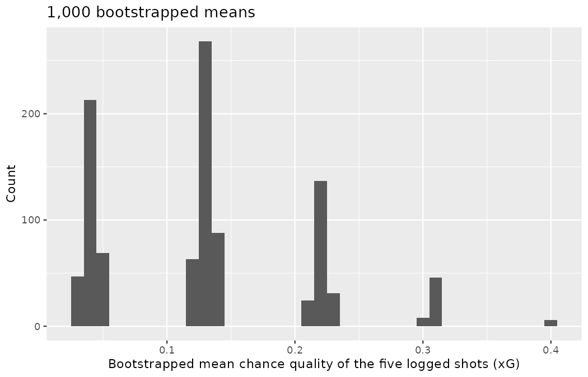
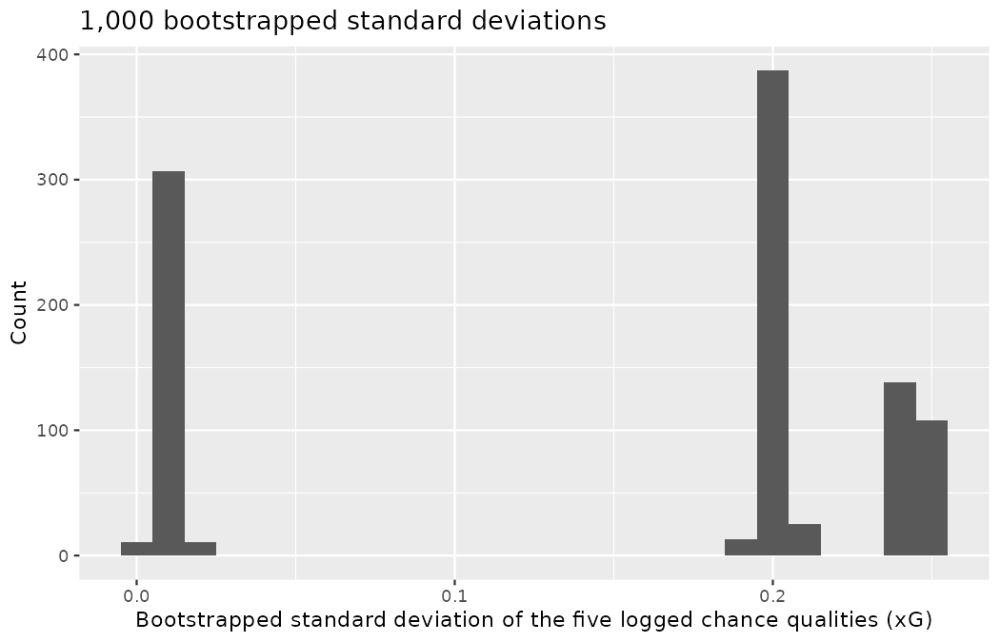
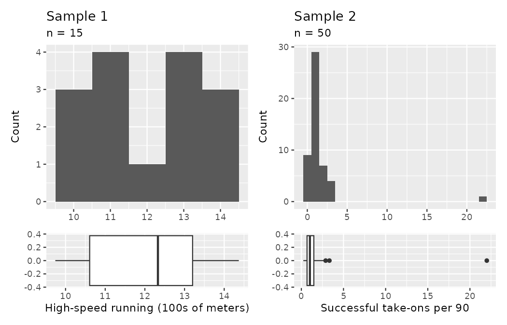
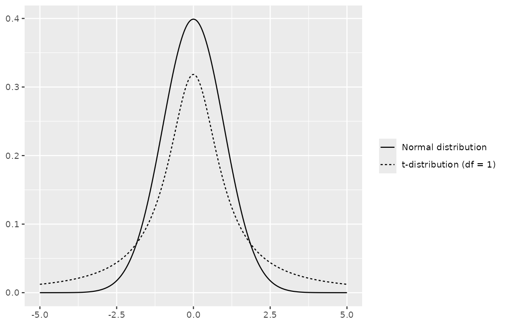
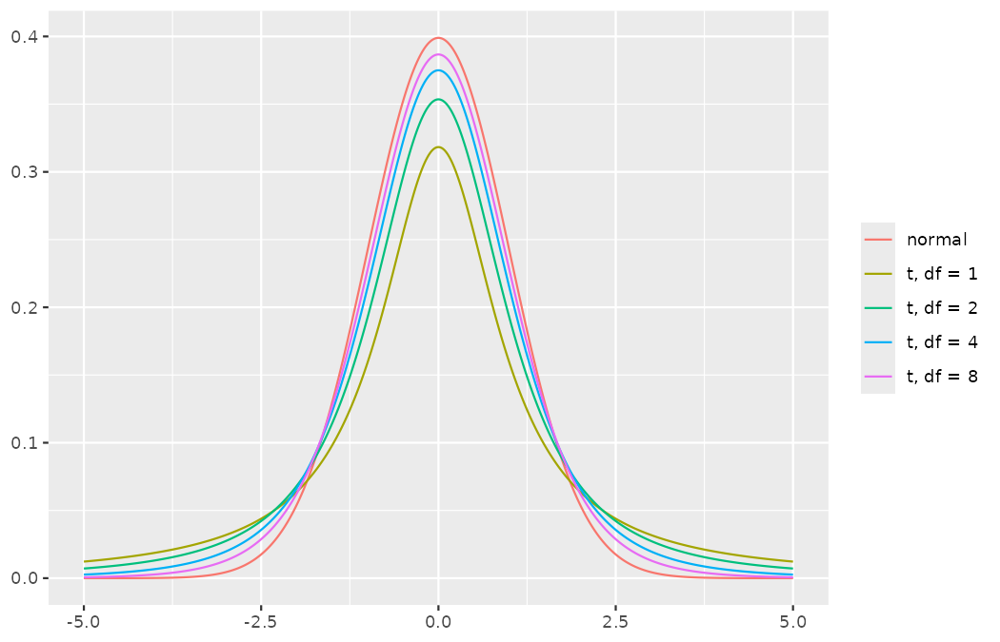
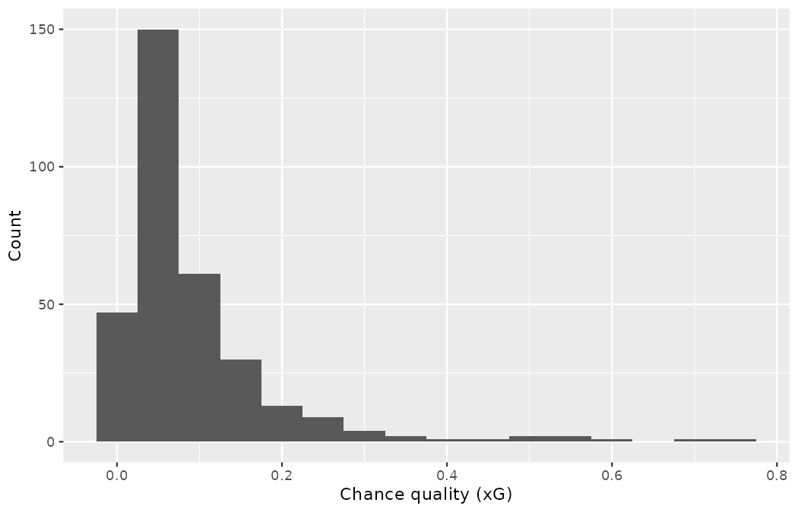

# Inference for a single mean {#sec-inference-one-mean}

::: {.chapterintro}
Focusing now on statistical inference for **numerical data**, we will revisit and expand upon the foundational aspects of hypothesis testing from [Chapter -@sec-foundations-randomization].

The important data structure for this chapter is a numeric response variable (that is, the outcome is quantitative) — chance quality per shot, sprint distance per session, jump height per trialist.
This chapter opens a four-chapter arc built on that structure, and it covers only the first and simplest case: a *single* numeric response variable, one sample, one mean.
The other three data structures each get a chapter of their own — a numeric response which is a difference across a pair of observations ([Chapter -@sec-inference-paired-means]), a numeric response broken down by a binary explanatory variable ([Chapter -@sec-inference-two-means]), and a numeric response broken down by an explanatory variable that has two or more levels ([Chapter -@sec-inference-many-means]).
When appropriate, each data structure will be analyzed using the three methods from [Chapter -@sec-foundations-randomization], [Chapter -@sec-foundations-bootstrapping], and [Chapter -@sec-foundations-mathematical]: randomization test, bootstrapping, and mathematical models, respectively.

As we build on the inferential ideas, we will visit new foundational concepts in statistical inference.
One key new idea rests in estimating how the sample mean (as opposed to the sample proportion) varies from sample to sample; the resulting value is referred to as the standard error of the mean.
We will also introduce a new important mathematical model, the $t$-distribution (as the foundation for the $t$-test).
:::

In this chapter, we focus on the sample mean (instead of, for example, the sample median or the range of the observations) because of the well-studied mathematical model which describes the behavior of the sample mean.
We will not cover mathematical models which describe other statistics, but the bootstrap and randomization techniques described below are immediately extendable to any function of the observed data — a fact a scouting analyst should treasure, since the metrics a club cares about (medians of skewed fee distributions, ninetieth percentiles of sprint loads) are rarely the tidy ones.
The sample mean will be calculated in one group, two paired groups, two independent groups, and many groups settings — the first of those settings in this chapter, the other three across the three chapters that follow.
The techniques described for each setting will vary slightly, but you will be well served to find the structural similarities across the different settings.

Similar to how we can model the behavior of the sample proportion $\hat{p}$ using a normal distribution (recall @sec-foundations-mathematical and @sec-inference-one-prop), the sample mean $\bar{x}$ can also be modeled using a normal distribution when certain conditions are met.
Recall from @sec-explore-numerical the symbols we will lean on throughout: $\bar{x}$ is a sample mean, $s$ a sample standard deviation, $n$ a sample size, and $\mu$ and $\sigma$ their unknown population counterparts.
However, we'll soon learn that a new distribution, called the $t$-distribution, is more useful when working with the sample mean.
We'll first learn about this new distribution, then we'll use it for confidence intervals and hypothesis tests for the mean.

## Bootstrap confidence interval for a mean {#sec-boot1mean}

Consider a situation every head of scouting knows too well.
A regional scout catches a target player in person a handful of times, logs the shots he saw, and files a report; Emil Sørensen must then decide how much those few logged shots say about the player's *typical* chance quality.
To work through the mechanics with numbers anyone can check, Priya Rao rebuilds the situation from the 2022 Men's World Cup data: she takes the tournament's highest-volume shooter and asks what a scout who logged only *five* of his open-play shots would have been entitled to conclude.
(If this were a real assignment, the scout would surely push for a much larger sample — possibly even the player's entire logged record!)

```r
library(dplyr)
library(tidyr)
library(readr)
library(ggplot2)
library(infer)

wc2022_shots <- read_csv("data/derived/wc2022_shots.csv")

wc2022_shots |>
  filter(player == "Lionel Andrés Messi Cuccittini") |>
  count(shot_type)
#> # A tibble: 3 × 2
#>   shot_type     n
#>   <chr>     <int>
#> 1 Free Kick     3
#> 2 Open Play    24
#> 3 Penalty       7
```

The tournament's highest-volume shooter is Lionel Messi, with 34 shots.
Before any sampling, a frame decision, per this book's penalty convention (recall @sec-chp11-pens-out): 7 of those 34 shots were penalty kicks — every one stored at the constant chance quality of $0.7835$ — and 3 were direct free kicks.
The scouting question here is about the chances a player *gets himself into* in the run of play; penalties are manufactured by fouls, and a single 0.7835 landing in a five-shot sample would swamp everything else in it.
So we state the filter — `shot_type == "Open Play"`, keeping 24 shots — say why, and sample from that frame.

### Observed data

The seeded code below draws the five shots our hypothetical scout logged.

```r
messi_open <- wc2022_shots |>
  filter(player == "Lionel Andrés Messi Cuccittini", shot_type == "Open Play")

set.seed(1901)
scout5 <- messi_open |>
  slice_sample(n = 5) |>
  mutate(shot = paste0("S", row_number())) |>
  select(shot, opponent, stage, minute, outcome, statsbomb_xg)

scout5
#> # A tibble: 5 × 6
#>   shot  opponent    stage          minute outcome statsbomb_xg
#>   <chr> <chr>       <chr>           <dbl> <chr>          <dbl>
#> 1 S1    Netherlands Quarter-finals    109 Off T         0.0354
#> 2 S2    France      Final             107 Goal          0.488
#> 3 S3    Poland      Group Stage         6 Saved         0.0509
#> 4 S4    Poland      Group Stage         9 Saved         0.0533
#> 5 S5    France      Final             106 Saved         0.0248
```

Four of the five logged shots are modest chances below 0.06 xG; the fifth, S2, is the extra-time goal in the Final — a 0.488 xG chance.
The sample mean and standard deviation follow from the formulas of @sec-explore-numerical:

```r
round(c(xbar = mean(scout5$statsbomb_xg), s = sd(scout5$statsbomb_xg)), 4)
#>   xbar      s
#> 0.1305 0.2004
```

The sample average chance quality of $\bar{x} = 0.1305$ xG per shot is a first guess at the player's typical open-play chance quality.
However, as a student of statistics, you understand that one sample mean based on a sample of five observations will not necessarily equal the true mean for the whole process that generates this player's shots.
Indeed, you can see that the observed chance qualities vary with a standard deviation of $s = 0.2004$, and surely the average would be different if the scout had happened to attend different matches and logged a different sample of five shots.
Fortunately, as it did in previous chapters for the sample proportion, bootstrapping will approximate the variability of the sample mean from sample to sample.

### Variability of the statistic

As with the inferential ideas covered in [Chapter -@sec-foundations-randomization], [Chapter -@sec-foundations-bootstrapping], and [Chapter -@sec-foundations-mathematical], the inferential analysis methods in this chapter are grounded in quantifying how one dataset differs from another when they are both taken from the same population.
To repeat, the idea is that we want to know how datasets differ from one another, but we aren't ever going to take more than one sample of observations.
It does not make sense to take repeated samples from the same population: if the scout has the budget for more matches, a larger sample size will benefit him more than two separate samples of the same size.
Instead of taking repeated samples from the actual population, we use bootstrapping to measure how the samples behave under an estimate of the population.

The logic is exactly that of @sec-foundations-bootstrapping, with one change of statistic: there we resampled to see how a sample *proportion* varies; here we resample to see how a sample *mean* varies.
The five logged shots stand in for the population of shots the player gets himself into — imagine the five shots duplicated endlessly, in the same relative frequencies, into an infinitely large proxy population.
Sampling five shots with replacement from the original five is identical to sampling five shots from that infinite proxy population.

```r
set.seed(1902)
scout5_boot <- scout5 |>
  rep_slice_sample(n = 5, replace = TRUE, reps = 1000)

scout5_boot |>
  filter(replicate == 1) |>
  select(replicate, shot, outcome, statsbomb_xg)
#> # A tibble: 5 × 4
#> # Groups:   replicate [1]
#>   replicate shot  outcome statsbomb_xg
#>       <int> <chr> <chr>          <dbl>
#> 1         1 S1    Off T         0.0354
#> 2         1 S2    Goal          0.488
#> 3         1 S3    Saved         0.0509
#> 4         1 S5    Saved         0.0248
#> 5         1 S1    Off T         0.0354
```

Look closely at the first bootstrap resample: shot S1 was drawn twice and shot S4 not at all — the signature of sampling with replacement that you first saw with the trialists of @sec-foundations-bootstrapping.
Because each resample is a different set of five shots, each resample has its own mean.
By summarizing each of the bootstrap samples (here, using the sample mean), we see, directly, the variability of the sample mean, $\bar{x},$ from sample to sample.

This resampled statistic gets its own symbol, and since the notation is new in this chapter, take it apart before using it: in $\bar{x}_{bs},$ the $\bar{x}$ is the familiar sample mean of @sec-explore-numerical — a variable $x$ with a bar for "averaged" — and the subscript $bs$ says the five values being averaged came from a *bootstrap resample* rather than from the original sample.
It is the exact analogue, for means, of the $\hat{p}_{boot}$ you met in @sec-foundations-bootstrapping.

```r
scout5_means <- scout5_boot |>
  summarize(stat = mean(statsbomb_xg))

round(scout5_means$stat[1:3], 4)
#> [1] 0.1270 0.1358 0.0409
```

The first resample has $\bar{x}_{bs} = 0.1270$; the second, $0.1358$; the third — a resample that never drew the Final goal — just $0.0409.$
The histogram drawn by the code below summarizes all 1,000 bootstrapped means.

```r
ggplot(scout5_means, aes(x = stat)) +
  geom_histogram(binwidth = 0.01) +
  labs(
    x = "Bootstrapped mean chance quality of the five logged shots (xG)",
    y = "Count",
    title = "1,000 bootstrapped means"
  )
```

{fig-alt="Histogram of 1,000 bootstrapped mean chance qualities from the five logged shots. Instead of a smooth bell, the means stack into separated clumps near 0.041, 0.131, 0.220, 0.309, and 0.400, one clump for each possible number of copies of the big chance in a resample." width=85%}

The histogram is worth a slow look, because with only five distinct values in the bag, the mechanics of resampling are visible to the naked eye.
The 1,000 bootstrapped means do not form a smooth bell; they stack into separated clumps, one for each possible number of copies of the big chance S2 in the resample: 329 resamples drew S2 zero times (means near 0.041), 419 drew it once (near 0.131), 192 twice (near 0.220), 54 three times (near 0.309), and 6 four times (near 0.400).
The bootstrapped average chance qualities range from about 0.027 to 0.401 xG.
The bootstrap percentile confidence interval is found by locating the middle 90% (for a 90% confidence interval) or 95% (for a 95% confidence interval) of the bootstrapped statistics — exactly the procedure of @sec-foundations-bootstrapping, applied to means.

::: {.callout-note title="Worked example"}
Using the bootstrapped means in `scout5_means`, find the 90% and 95% bootstrap percentile confidence intervals for the true mean open-play chance quality of the shots this player gets himself into.

------------------------------------------------------------------------

The percentiles can be read off directly:

```r
round(quantile(scout5_means$stat, c(0.05, 0.95)), 4)
#>     5%    95%
#> 0.0361 0.3051

round(quantile(scout5_means$stat, c(0.025, 0.975)), 4)
#>   2.5%  97.5%
#> 0.0333 0.3103
```

A 90% confidence interval is 0.0361 to 0.3051 xG.
The conclusion is that we are 90% confident that the true mean open-play chance quality for this player lies somewhere between 0.0361 and 0.3051 xG per shot.

A 95% confidence interval is 0.0333 to 0.3103 xG.
The conclusion is that we are 95% confident that the true mean open-play chance quality for this player lies somewhere between 0.0333 and 0.3103 xG per shot.

Read those intervals as a scout: they run from "feeds on scraps" to "averages a near-one-on-one every attempt."
Five shots, honestly analyzed, buy you almost no precision — which is precisely what the interval is for: it refuses to let the point estimate of 0.1305 masquerade as knowledge.
:::

### Bootstrap SE confidence interval

As seen in @sec-two-prop-boot-ci, another method for creating bootstrap confidence intervals directly uses a calculation of the variability of the bootstrap statistics (here, the bootstrap means).
If the bootstrap distribution is relatively symmetric and bell-shaped, then the 95% bootstrap SE confidence interval can be constructed with the formula familiar from the mathematical models in previous chapters:

$$\text{point estimate} \pm 2 \cdot SE_{BS}$$

One new subscript, so decompose it: $SE$ is the standard error you met in @sec-foundations-mathematical — the standard deviation of a statistic from sample to sample — and the subscript $BS$ records *how this particular standard error was estimated*: not from a formula, but as the standard deviation of the bootstrapped statistics themselves.
The number 2 is an approximation connected to the "95%" part of the confidence interval (remember the 68-95-99.7 rule from @sec-explore-numerical and @sec-foundations-mathematical).
As will be seen in @sec-one-mean-math, a new distribution (the $t$-distribution) will be applied to most mathematical inference on numerical variables.
However, because bootstrapping is not grounded in the same theory as the mathematical approach given in this text, we stick with the standard normal quantiles (in R use the function `qnorm()` to find normal percentiles other than 95%) for different confidence percentages.[^ch19-1]

[^ch19-1]: There is a large literature on understanding and improving bootstrap intervals; see Hesterberg (2015), ["What Teachers Should Know About the Bootstrap"](https://www.tandfonline.com/doi/full/10.1080/00031305.2015.1089789), and Hayden (2019), ["Questionable Claims for Simple Versions of the Bootstrap"](https://www.tandfonline.com/doi/full/10.1080/10691898.2019.1669507), for more information.

::: {.callout-note title="Worked example"}
Explain how the standard error (SE) of the bootstrapped means is calculated and what it is measuring.

------------------------------------------------------------------------

The SE of the bootstrapped means measures how variable the means are from resample to resample.
The bootstrap SE is a good approximation to the SE of means as if we had taken repeated samples from the original population (which we agreed isn't something we would do, because of wasted scouting resources).

Logistically, we can find the standard deviation of the bootstrapped means using the same calculations from @sec-explore-numerical.
That is, the bootstrapped means are the individual observations about which we measure the variability.
:::

Although we won't spend a lot of energy on this concept, you may be wondering about the differences between a standard error and a standard deviation.
The **standard error** describes how a statistic (e.g., sample mean or sample proportion) varies from sample to sample.
The **standard deviation** can be thought of as a function applied to any list of numbers which measures how far those numbers vary from their own average.
So, you can have a standard deviation calculated on a column of jump-and-reach heights from the academy combine or a standard deviation calculated on a column of bootstrapped means from the resampled data.
Note that the standard deviation calculated on the bootstrapped means is referred to as the bootstrap standard error of the mean.

::: {.callout-tip title="Check your understanding"}
It turns out that the standard deviation of the 1,000 bootstrapped means is $SE_{BS} = 0.0798$ (a value which is an excellent approximation for the standard error of sample means if we were to take repeated five-shot samples of this player).
(Note: in R the calculation was done using the function `sd()`.)

```r
round(c(xbar_bs = mean(scout5_means$stat), se_bs = sd(scout5_means$stat)), 4)
#> xbar_bs   se_bs
#>  0.1296  0.0798
```

The average of the five observed chance qualities is $\bar{x} = 0.1305$ xG, and we will consider the sample average to be the best guess point estimate for $\mu.$
Find and interpret the confidence interval for $\mu$ (the true mean open-play chance quality for this player) using the bootstrap SE confidence interval formula.

------------------------------------------------------------------------

Using the formula for the bootstrap SE interval, we find the 95% confidence interval for $\mu$: $0.1305 \pm 2 \cdot 0.0798 \rightarrow (-0.0291, 0.2901).$
We are 95% confident that the true mean open-play chance quality for this player is somewhere between $-0.0291$ and $0.2901$ xG.
And there the formula has embarrassed itself: a chance quality below zero is impossible, yet the symmetric interval reaches $-0.0291$ anyway.
The warning attached to this method — *if the bootstrap distribution is relatively symmetric and bell-shaped* — was doing real work, and our clumpy, right-skewed bootstrap distribution violates it.
:::

::: {.callout-note title="Worked example"}
Compare and contrast the two different 95% confidence intervals for $\mu$ created by finding the percentiles of the bootstrapped means and created by finding the SE of the bootstrapped means.
Do you think the intervals *should* be identical?

------------------------------------------------------------------------

-   Percentile interval: (0.0333, 0.3103)
-   SE interval: ($-0.0291$, 0.2901)

The intervals were created using different methods, so it is not surprising that they are not identical.
Here they disagree more than we would like: the bootstrap distribution of $\bar{x}_{bs}$ is clumped and right-skewed (five observations, one of them the Final goal), so the symmetric SE formula overshoots downward — below zero, which xG cannot reach — while the percentile interval, built from the ordered $\bar{x}_{bs}$ values themselves, respects the support of the data.
When the two constructions disagree this visibly, treat the disagreement itself as diagnostic information about the sample.
The technical details surrounding which data structures are best for percentile intervals and which are best for SE intervals are beyond the scope of this text.
However, the larger the samples are, the better (and closer) the interval estimates will be.
:::

### Bootstrap percentile confidence interval for a standard deviation

Suppose that Emil's question shifts from the player's typical chance quality to his *consistency*.
Recall from @sec-explore-numerical that a striker steady around 0.12 xG per shot and a striker who mixes tap-ins with 30-yard speculative efforts can share a mean while being entirely different scouting propositions; the parameter that separates them is the standard deviation of chance quality, $\sigma.$
You may have already realized that the sample standard deviation, $s,$ will work as a good **point estimate** for the parameter of interest: the population standard deviation, $\sigma.$
The point estimate from the five logged shots is $s = 0.2004$ xG.
While $s = 0.2004$ might be a good guess for $\sigma,$ we prefer to have an interval estimate for the parameter of interest.
Although there is a mathematical model which describes how $s$ varies from sample to sample, that model will not be presented in this text.
Instead, bootstrapping can be used — this is precisely the "extendable to any statistic" promise from the start of the chapter being kept.
Using the same resamples as before, we compute a standard deviation instead of a mean on each one.

```r
scout5_sds <- scout5_boot |>
  summarize(stat = sd(statsbomb_xg))

ggplot(scout5_sds, aes(x = stat)) +
  geom_histogram(binwidth = 0.01) +
  labs(
    x = "Bootstrapped standard deviation of the five logged chance qualities (xG)",
    y = "Count",
    title = "1,000 bootstrapped standard deviations"
  )
```

{fig-alt="Histogram of 1,000 bootstrapped standard deviations splitting into two separated clumps: tiny values from resamples that never drew the big chance, and values between about 0.19 and 0.25 from resamples that drew it at least once, with nothing at all between the clumps." width=85%}

::: {.callout-note title="Worked example"}
Describe the bootstrap distribution for the standard deviation drawn by the code above.

------------------------------------------------------------------------

The distribution is not remotely bell-shaped: it splits into two separated clumps.
The 329 resamples that never drew the Final goal contain only the four small, similar chances, so their standard deviations are tiny — between 0.0011 and 0.0156.
The 671 resamples that drew the big chance at least once have standard deviations between about 0.19 and 0.25, near the point estimate $s = 0.2004$ from the original data.
Nothing at all lies between the clumps.
With $n = 5,$ the sample's variability estimate is almost entirely a bet on whether one shot appears.
:::

::: {.callout-tip title="Check your understanding"}
Using the bootstrapped standard deviations, find and interpret a 90% bootstrap percentile confidence interval for the population standard deviation of this player's open-play chance quality.

```r
round(quantile(scout5_sds$stat, c(0.05, 0.95)), 4)
#>    5%   95%
#> 0.009 0.249
```

------------------------------------------------------------------------

The middle 90% of the bootstrapped standard deviations is given by the 5th percentile (0.0090) and the 95th percentile (0.2490).
That is, we are 90% confident that the true standard deviation of this player's open-play chance quality is between 0.0090 and 0.2490 xG.
A 90% confidence level indicates that there was not a need for a high level of confidence, such as 95% or 99%; a lower confidence level has higher potential for error, but it also produces a narrower interval.
Even so, be honest about what this interval says: it stretches from "metronomically identical chances" to "wildly mixed shot diet" — with five shots, the data cannot tell Emil which player he is looking at.
:::

### Bootstrapping is not a solution to small sample sizes!

The example presented above is done for a sample with only five observations.
As with analysis techniques that build on mathematical models, bootstrapping works best when a large random sample has been taken from the population.
Bootstrapping is a method for capturing the variability of a statistic when the mathematical model is unknown (it is not a method for navigating small samples).
The clumpy histograms above are the picture to remember: the bootstrap cannot invent information that five shots do not contain; it can only report, faithfully, how little there is.
As you might guess, the larger the random sample, the more accurately that sample will represent the population of interest.

Our data allow one closing check that a working scout never gets.
The player's full open-play record at the tournament — all 24 shots — has a mean chance quality of 0.0797 xG per shot:

```r
round(c(n = nrow(messi_open), xbar = mean(messi_open$statsbomb_xg)), 4)
#>       n    xbar
#> 24.0000  0.0797
```

The five-shot point estimate of 0.1305 overshot the fuller-record value by more than 60%, dragged up by the one great chance the scout happened to see; the intervals did contain 0.0797, but only by being enormous.
Five logged shots plus honest statistics equals a very wide interval — the dishonest alternative is a confident number that is wrong.

## Mathematical model for a mean {#sec-one-mean-math}

As with the sample proportion, the variability of the sample mean is well described by the mathematical theory given by the Central Limit Theorem.
However, because of missing information about the inherent variability in the population ($\sigma$), a $t$-distribution is used in place of the standard normal when performing hypothesis test or confidence interval analyses.

### Mathematical distribution of the sample mean

The sample mean tends to follow a normal distribution centered at the population mean, $\mu,$ when certain conditions are met.
Additionally, we can compute a standard error for the sample mean using the population standard deviation $\sigma$ and the sample size $n.$

::: {.callout-important title="Central Limit Theorem for the sample mean"}
When we collect a sufficiently large sample of $n$ independent observations from a population with mean $\mu$ and standard deviation $\sigma,$ the sampling distribution of $\bar{x}$ will be nearly normal with

$$\text{Mean} = \mu \qquad \text{Standard Error } (SE) = \frac{\sigma}{\sqrt{n}}$$
:::

Read the standard error formula piece by piece, because it is the engine of the whole chapter.
The numerator $\sigma$ is the population standard deviation from @sec-explore-numerical: the more the individual observations vary, the more the mean of a sample of them varies.
The denominator $\sqrt{n}$ is the new part: averaging $n$ independent observations cancels shot-to-shot noise, and the cancellation strengthens with the *square root* of the sample size.
Quadruple the number of shots a scout logs and the standard error of the mean halves — not quarters.
This is the mean's version of the pattern you saw for proportions in @sec-foundations-mathematical, and it is why patient scouting beats excitable scouting: precision is bought at the price of $\sqrt{n}.$

Before diving into confidence intervals and hypothesis tests using $\bar{x},$ we first need to cover two topics:

-   When we modeled $\hat{p}$ using the normal distribution, certain conditions had to be satisfied.
    The conditions for working with $\bar{x}$ are a little more complex, and below, we will discuss how to check conditions for inference using a mathematical model.
-   The standard error is dependent on the population standard deviation, $\sigma.$
    However, we rarely know $\sigma,$ and instead we must estimate it.
    Because this estimation is itself imperfect, we use a new distribution called the $t$-distribution to fix this problem.

### Evaluating the two conditions required for modeling $\bar{x}$

Two conditions are required to apply the **Central Limit Theorem** for a sample mean $\bar{x}:$

-   **Independence.** The sample observations must be independent.
    The most common way to satisfy this condition is when the sample is a simple random sample from the population — a seeded `slice_sample()` of logged shots qualifies; the shots from a single ten-minute spell of one match do not.
    If the data come from a random process, analogous to rolling a die, this would also satisfy the independence condition.

-   **Normality.** When a sample is small, we also require that the sample observations come from a normally distributed population.
    We can relax this condition more and more for larger and larger sample sizes.
    This condition is vague, making it difficult to evaluate, so next we introduce a couple of rules of thumb for checking it.

::: {.callout-important title="General rule for performing the normality check"}
There is no perfect way to check the normality condition, so instead we use two general rules based on the number and magnitude of extreme observations.
Note, it often takes practice to get a sense for whether a normal approximation is appropriate.

-   Small $n$: If the sample size $n$ is small and there are **no clear outliers** in the data, then we typically assume the data come from a nearly normal distribution to satisfy the condition.
-   Large $n$: If the sample size $n$ is large and there are no **particularly extreme** outliers, then we typically assume the sampling distribution of $\bar{x}$ is nearly normal, even if the underlying distribution of individual observations is not.

Some guidelines for determining whether $n$ is considered small or large are as follows: slight skew is okay for sample sizes of 15, moderate skew for sample sizes of 30, and strong skew for sample sizes of 60.
:::

In this first course in statistics, you aren't expected to develop perfect judgment on the normality condition.
However, you are expected to be able to handle clear cut cases based on the rules of thumb.[^ch19-2]

[^ch19-2]: More nuanced guidelines would consider further relaxing the *particularly extreme outlier* check when the sample size is very large.
    However, we'll leave further discussion here to a future course.

::: {.callout-note title="Worked example"}
Consider the two constructed samples drawn by the seeded code below — another pair of Priya's fabricated training sets, in the tradition of @sec-explore-numerical.
Sample 1 records high-speed-running distance (in hundreds of meters) for $n_1 = 15$ academy midfielders in one training week; sample 2 records successful take-ons per 90 minutes for $n_2 = 50$ wingers in the scouting database.
Both are simple random samples from their respective (constructed) populations.

Are the independence and normality conditions met in each case?

```r
library(patchwork)

set.seed(1903)
sample_1 <- tibble(hsr = rnorm(15, mean = 12, sd = 2))
sample_2 <- tibble(dribbles = c(exp(rnorm(49, mean = 0, sd = 0.7)), 22))

p1 <- ggplot(sample_1, aes(x = hsr)) +
  geom_histogram(binwidth = 1) +
  labs(x = NULL, y = "Count", title = "Sample 1", subtitle = "n = 15")

p2 <- ggplot(sample_2, aes(x = dribbles)) +
  geom_histogram(binwidth = 1) +
  labs(x = NULL, y = "Count", title = "Sample 2", subtitle = "n = 50")

p3 <- ggplot(sample_1, aes(x = hsr)) +
  geom_boxplot() +
  labs(x = "High-speed running (100s of meters)")

p4 <- ggplot(sample_2, aes(x = dribbles)) +
  geom_boxplot() +
  labs(x = "Successful take-ons per 90")

p1 + p2 + p3 + p4 + plot_layout(nrow = 2, heights = c(3, 1))
```

{fig-alt="Histograms and box plots for the two samples. Sample 1's fifteen high-speed-running values run smoothly from about 9.7 to 14.4 with no clear outliers, while sample 2's fifty take-on values sit below 3.4 except for one winger at 22, a particularly extreme outlier flagged far beyond the box plot's whisker." width=85%}

------------------------------------------------------------------------

Each sample is a simple random sample of its respective population, so the independence condition is satisfied.
Let's next check the normality condition for each using the rule of thumb.

The first sample has fewer than 30 observations, so we are watching for any clear outliers.
None are present: the fifteen values run smoothly from about 9.7 to 14.4 hundred meters, and while there is a small gap in the histogram between the lower and upper clusters, over 40% of this small sample sits below the gap, so we can hardly call these clear outliers.
With no clear outliers, the normality condition can be reasonably assumed to be met.

The second sample has a sample size greater than 30 and includes an outlier: one winger is recorded at 22 take-ons per 90, while every other value in the sample sits below 3.4.
That single observation lies roughly nine times further from the center of the distribution than the next furthest observation.
This is an example of a particularly extreme outlier, so the normality condition would not be satisfied.

It's often helpful to also visualize the data using a box plot to assess skewness and existence of outliers.
The box plots drawn underneath each histogram confirm our conclusions: the first sample flags nothing, while the second flags the extreme point far beyond its whisker.
:::

In practice, it's typical to also do a mental check to evaluate whether we have reason to believe the underlying population would have moderate skew (if $n < 30$) or have particularly extreme outliers ($n \geq 30$) beyond what we observe in the data.
For example, consider transfer fees across a season's completed deals, and then imagine this distribution.
The large majority of transfers worldwide are free moves and modest six-figure fees, while a relatively tiny fraction run to €100M and beyond, meaning the distribution is extremely skewed.
When we know the data come from such an extremely skewed distribution, it takes some effort to understand what sample size is large enough for the normality condition to be satisfied.

### Introducing the t-distribution

In practice, we cannot directly calculate the standard error for $\bar{x}$ since we do not know the population standard deviation, $\sigma.$
We encountered a similar issue when computing the standard error for a sample proportion, which relied on the population proportion, $p.$
Our solution in the proportion context (recall @sec-inference-one-prop) was to use the sample value in place of the population value when computing the standard error.
We'll employ a similar strategy for computing the standard error of $\bar{x},$ using the sample standard deviation $s$ in place of $\sigma:$

$$SE = \frac{\sigma}{\sqrt{n}} \approx \frac{s}{\sqrt{n}}$$

This is the standard error formula you will use for the rest of the book's work on means, so read the plug-in carefully: the structure is the Central Limit Theorem's $\sigma/\sqrt{n},$ but the unknowable $\sigma$ has been replaced by its sample estimate $s$ — a number that is itself computed from the same $n$ observations, and is therefore itself uncertain.

This strategy tends to work well when we have a lot of data and can estimate $\sigma$ using $s$ accurately.
However, the estimate is less precise with smaller samples, and this leads to problems when using the normal distribution to model $\bar{x}.$

We'll find it useful to use a new distribution for inference calculations called the **t-distribution**.
A $t$-distribution, drawn as the solid line by the code below, has a bell shape.
However, its tails are *thicker* than the normal distribution's, meaning observations are more likely to fall beyond two standard deviations from the mean than under the normal distribution.

```r
t_compare <- tibble(
  x = rep(seq(-5, 5, 0.01), 2),
  distribution = rep(c("Normal distribution", "t-distribution (df = 1)"), each = 1001)
) |>
  mutate(y = if_else(distribution == "Normal distribution", dnorm(x), dt(x, df = 1)))

ggplot(t_compare, aes(x = x, y = y, linetype = distribution)) +
  geom_line() +
  labs(x = NULL, y = NULL, linetype = NULL)
```

{fig-alt="Two bell-shaped curves distinguished by line type: the normal distribution and a t-distribution with one degree of freedom. The t-distribution's tails are thicker, so observations are more likely to fall beyond two standard deviations from the mean." width=85%}

The heavier tails are not a decorative difference; they are the entire point, so let us tell the story properly.
When $\sigma$ is known, the standardized statistic $(\bar{x} - \mu)/(\sigma/\sqrt{n})$ has one source of randomness: the numerator.
When we must plug in $s,$ the denominator becomes random too.
In an unlucky small sample, $s$ underestimates $\sigma$ — the scout happens to log five similar shots and concludes the player is metronomic — and dividing by that too-small standard error inflates the statistic.
Occasionally, then, the ratio lands much further from zero than a normal model would ever predict, and probability mass must be moved out of the shoulders and into the tails to account for it.
The extra thick tails of the $t$-distribution are exactly the correction needed to resolve this problem, and the smaller the sample, the noisier $s$ is, and the heavier the tails must be.

::: {.callout-tip title="Check your understanding"}
A colleague objects: "We already plugged $\hat{p}$ in for $p$ back in @sec-inference-one-prop and kept using the normal distribution.
Why does plugging $s$ in for $\sigma$ suddenly require a whole new distribution?"
What is the honest answer?

------------------------------------------------------------------------

For proportions, the standard error $\sqrt{p(1-p)/n}$ is determined by the very quantity being estimated, and the normal approximation with $\hat{p}$ plugged in works adequately when the success-failure condition holds.
For means, the numerator ($\bar{x}$) and the spread estimate ($s$) are two genuinely separate quantities estimated from the same small sample, and the extra variability of $s$ in small samples is large enough to visibly fatten the tails of the standardized statistic.
The $t$-distribution quantifies exactly that extra uncertainty; as $n$ grows and $s$ pins down $\sigma,$ the correction fades and the $t$-distribution melts back into the normal.
:::

The $t$-distribution is always centered at zero and has a single parameter: degrees of freedom.
The **degrees of freedom** describes the precise form of the bell-shaped $t$-distribution.
Several $t$-distributions are drawn by the code below in comparison to the normal distribution.
Similar to the chi-squared distribution you met in @sec-inference-tables, the shape of the $t$-distribution depends on its degrees of freedom — but where the chi-squared's $df$ came from the dimensions of a table, here the degrees of freedom come from the sample size.

In general, we'll use a $t$-distribution with $df = n - 1$ to model the sample mean when the sample size is $n.$
Decompose the formula: $n$ observations carry $n$ pieces of information about spread, but one of them is spent estimating $\bar{x}$ itself — the deviations $x_i - \bar{x}$ must sum to zero, so only $n - 1$ of them are free to vary, which is the same $n - 1$ that divides the sample variance in @sec-explore-numerical.
When we have more observations, the degrees of freedom will be larger and the $t$-distribution will look more like the standard normal distribution; when the degrees of freedom are about 30 or more, the $t$-distribution is nearly indistinguishable from the normal distribution.

```r
t_dfs <- bind_rows(
  tibble(x = seq(-5, 5, 0.01), y = dnorm(x), curve = "normal"),
  tibble(x = seq(-5, 5, 0.01), y = dt(x, 8), curve = "t, df = 8"),
  tibble(x = seq(-5, 5, 0.01), y = dt(x, 4), curve = "t, df = 4"),
  tibble(x = seq(-5, 5, 0.01), y = dt(x, 2), curve = "t, df = 2"),
  tibble(x = seq(-5, 5, 0.01), y = dt(x, 1), curve = "t, df = 1")
)

ggplot(t_dfs, aes(x = x, y = y, color = curve)) +
  geom_line() +
  labs(x = NULL, y = NULL, color = NULL)
```

{fig-alt="Density curves of the normal distribution and t-distributions with 8, 4, 2, and 1 degrees of freedom. The larger the degrees of freedom, the more closely the t-distribution resembles the standard normal; the smaller the degrees of freedom, the thicker its tails." width=85%}

::: {.callout-important title="Degrees of freedom: df"}
The degrees of freedom describes the shape of the $t$-distribution.
The larger the degrees of freedom, the more closely the distribution approximates the normal distribution.

When modeling $\bar{x}$ using the $t$-distribution, use $df = n - 1.$
:::

The $t$-distribution allows us greater flexibility than the normal distribution when analyzing numerical data.
In practice, it's common to use statistical software, such as R, Python, or SAS for these analyses.
In R, the function used for calculating probabilities under a $t$-distribution is `pt()` (which should seem similar to the previous R functions `pnorm()` and `pchisq()`).
Don't forget that with the $t$-distribution, the degrees of freedom must always be specified!

For the worked examples and Check your understanding boxes below, you may have to use a table or statistical software to find the answers.
We recommend trying the problems so as to get a sense for how the $t$-distribution can vary in width depending on the degrees of freedom.
No matter the approach you choose, apply your method using the examples below to confirm your working understanding of the $t$-distribution.

::: {.callout-note title="Worked example"}
What proportion of the $t$-distribution with 18 degrees of freedom falls below $-2.10$?

------------------------------------------------------------------------

Draw the picture first: a bell centered at zero, with the area to the left of $-2.10$ shaded.
Using statistical software, we can obtain a precise value: 0.0250.

```r
# use pt() to find probability under the t-distribution
pt(-2.10, df = 18)
#> [1] 0.0250452
```
:::

::: {.callout-note title="Worked example"}
What proportion of the $t$-distribution with 20 degrees of freedom falls above 1.65?

------------------------------------------------------------------------

Note that with 20 degrees of freedom, the $t$-distribution is relatively close to the normal distribution.
With a normal distribution, this would correspond to about 0.05, so we should expect the $t$-distribution to give us a similar value.
Using statistical software, we can obtain a precise value: 0.0573.

```r
# use pt() to find probability under the t-distribution
1 - pt(1.65, df = 20)
#> [1] 0.05728041
```
:::

::: {.callout-note title="Worked example"}
For a $t$-distribution with 2 degrees of freedom, estimate the proportion of the distribution falling more than 3 units from the mean (above or below).

------------------------------------------------------------------------

With so few degrees of freedom, the $t$-distribution will give a more notably different value than the normal distribution.
Under a normal distribution, the area would be about 0.003 using the 68-95-99.7 rule.
For a $t$-distribution with $df = 2,$ the area in both tails beyond 3 units totals 0.0955.
This area is dramatically different than what we obtain from the normal distribution.

```r
# use pt() to find probability under the t-distribution
pt(-3, df = 2) + (1 - pt(3, df = 2))
#> [1] 0.09546597
```
:::

::: {.callout-tip title="Check your understanding"}
What proportion of the $t$-distribution with 19 degrees of freedom falls above $-1.79$ units?
Use your preferred method for finding tail areas.

------------------------------------------------------------------------

We want to find the shaded area *above* $-1.79$ (we leave the picture to you).
The lower tail area is 0.0447, so the upper area is $1 - 0.0447 = 0.9553.$
:::

### One sample t-intervals

Let's get our first taste of applying the $t$-distribution in the context of a squad-level scouting question.
Australia reached the round of 16 at the 2022 Men's World Cup, and Emil Sørensen's network flagged several of their attacking players as potentially undervalued targets.
Marta Vidal's question back was blunt: was that run built on genuine chance creation, or is the chance quality behind it worryingly low?

We will identify a confidence interval for the mean chance quality of the shots produced by Australia's campaign — all 26 of them.
First, the frame check that this book's penalty convention makes routine: none of Australia's 26 shots was a penalty or a direct free kick, so the all-shots frame and the open-play frame coincide, and no stored 0.7835 lurks in the sample.

```r
australia_shots <- wc2022_shots |>
  filter(team == "Australia")

australia_shots |>
  count(shot_type)
#> # A tibble: 1 × 2
#>   shot_type     n
#>   <chr>     <int>
#> 1 Open Play    26
```

The data are summarized below; the minimum and maximum observed values can be used to evaluate whether there are clear outliers.

```r
round(c(xbar = mean(australia_shots$statsbomb_xg),
        s    = sd(australia_shots$statsbomb_xg),
        min  = min(australia_shots$statsbomb_xg),
        max  = max(australia_shots$statsbomb_xg)), 4)
#>   xbar      s    min    max
#> 0.0607 0.0578 0.0053 0.2339
```

| n   | Mean   | SD     | Min    | Max    |
|:---:|:------:|:------:|:------:|:------:|
| 26  | 0.0607 | 0.0578 | 0.0053 | 0.2339 |

: Summary of the chance quality (xG) of Australia's 26 shots at the 2022 Men's World Cup. {#tbl-aus-summary}

::: {.callout-note title="Worked example"}
Are the independence and normality conditions satisfied for this dataset?

------------------------------------------------------------------------

The 26 shots are not a formal random sample — they are every shot of one campaign — so, as with England's 63 shots in @sec-case-study-med-consult, the inference is to the *process* that generates this team's chances, and we treat the campaign as a sample from that process.
Shots arrive in different matches against different opponents, and treating them as independent draws is a reasonable working approximation, though shots from the same passage of play (rebounds, scrambles) push gently against it.

For normality, the sample size is under 30, so we check for clear outliers.
The summary statistics show the usual right skew of chance quality, and the sorted values below show the top of the sample stepping up gradually — 0.114, 0.173, 0.191, 0.234 — with no single observation sitting isolated from the rest.
(The maximum is 3.0 standard deviations above the mean, which earns a raised eyebrow but not the label "clear outlier" — it takes practice, and the rule of thumb tolerates moderate skew near $n = 30.$)
Based on this evidence, the normality condition seems reasonable.

```r
sort(round(australia_shots$statsbomb_xg, 3))
#>  [1] 0.005 0.010 0.011 0.014 0.015 0.018 0.030 0.033 0.035 0.035 0.037 0.039
#> [13] 0.039 0.039 0.041 0.045 0.050 0.064 0.068 0.075 0.077 0.084 0.114 0.173
#> [25] 0.191 0.234
```
:::

In the normal model of @sec-foundations-mathematical, we used $z^{\star}$ and the standard error to determine the width of a confidence interval.
We revise the confidence interval formula slightly when using the $t$-distribution:

$$
\begin{aligned}
\text{point estimate} \ &\pm\  t^{\star}_{df} \times SE \\
\bar{x} \ &\pm\  t^{\star}_{df} \times \frac{s}{\sqrt{n}}
\end{aligned}
$$

::: {.callout-note title="Worked example"}
Using the summary statistics in @tbl-aus-summary, compute the standard error for the mean chance quality of the $n = 26$ shots.

------------------------------------------------------------------------

We plug $s$ and $n$ into the formula: $SE = \frac{s}{\sqrt{n}} = \frac{0.0578}{\sqrt{26}} = 0.0113.$
:::

The value $t^{\star}_{df}$ is a cutoff we obtain based on the confidence level and the $t$-distribution with $df$ degrees of freedom.
The symbol has three parts, each already familiar on its own: the letter $t$ names the reference distribution; the star superscript marks a critical cutoff, exactly the role $z^{\star}$ played in @sec-foundations-mathematical; and the subscript $df$ records *which* $t$-distribution supplied the cutoff — a piece of bookkeeping $z^{\star}$ never needed, because there is only one standard normal but a different $t$-distribution for every degrees of freedom.
That cutoff is found in the same way as with a normal distribution: we find $t^{\star}_{df}$ such that the fraction of the $t$-distribution with $df$ degrees of freedom within a distance $t^{\star}_{df}$ of 0 matches the confidence level of interest.

::: {.callout-note title="Worked example"}
When $n = 26,$ what is the appropriate degrees of freedom?
Find $t^{\star}_{df}$ for this degrees of freedom and the confidence level of 95%.

------------------------------------------------------------------------

The degrees of freedom is easy to calculate: $df = n - 1 = 25.$

Using statistical software, we find the cutoff where the upper tail is equal to 2.5%: $t^{\star}_{25} = 2.06.$
The area below $-2.06$ will also be equal to 2.5%.
That is, 95% of the $t$-distribution with $df = 25$ lies within 2.06 units of 0.

```r
# use qt() to find the t-cutoff (with 95% in the middle)
qt(0.025, df = 25)
#> [1] -2.059539
qt(0.975, df = 25)
#> [1] 2.059539
```
:::

::: {.callout-important title="Degrees of freedom for a single sample"}
If the sample has $n$ observations and we are examining a single mean, then we use the $t$-distribution with $df = n - 1$ degrees of freedom.
:::

::: {.callout-note title="Worked example"}
Compute and interpret the 95% confidence interval for the mean chance quality of the process behind Australia's shooting.
Is Marta's "worryingly low" worry justified?

------------------------------------------------------------------------

We can construct the confidence interval as

$$
\begin{aligned}
\bar{x} \ &\pm\  t^{\star}_{25} \times SE \\
0.0607 \ &\pm\  2.06 \times 0.0113 \\
(0.0374 \  &, \ 0.0840)
\end{aligned}
$$

We are 95% confident that the true mean chance quality of the shots this Australia side generates is between 0.037 and 0.084 xG per shot.
For scale, the tournament's 1,382 open-play shots averaged 0.0983 xG per shot (a benchmark we recompute in code at the end of this chapter) — and note that the open-play benchmark is the frame-consistent one, since Australia's sample contains no penalties.
The *entire interval* sits below that benchmark: even the most generous end of the plausible range is a sub-average shot diet.
So yes — the run to the knockouts was real, but the chance quality underneath it is discernibly thin, and any valuation of Australia's attackers should start from that fact.
Two cautions before this reaches a dossier: the data are observational (a deep defensive block *chooses* low-volume, often low-quality shooting, so this describes the team's output, not any player's ceiling), and 26 shots is a small sample — which is exactly why we report the interval and not just the 0.0607.
:::

::: {.callout-important title="Calculating a t-confidence interval for the mean, $\mu$"}
Based on a sample of $n$ independent and nearly normal observations, a confidence interval for the population mean is

$$
\begin{aligned}
\text{point estimate} \ &\pm\  t^{\star}_{df} \times SE \\
\bar{x} \ &\pm\  t^{\star}_{df} \times \frac{s}{\sqrt{n}}
\end{aligned}
$$

where $\bar{x}$ is the sample mean, $t^{\star}_{df}$ corresponds to the confidence level and degrees of freedom $df,$ and $SE$ is the standard error as estimated by the sample.
:::

For the next sequence, practice working entirely from summary statistics — the situation an analyst is in when a partner club or an agent shares a memo rather than raw data.
The memo in question concerns one-on-one situations at the 2025 Women's Euro: across the tournament, $n = 29$ shots were logged as one-on-ones, with a sample mean chance quality of 0.356 xG, a standard deviation of 0.300, a minimum of 0.029, and a maximum of 0.784.

::: {.callout-tip title="Check your understanding"}
We will assume the 29 one-on-one chance qualities are independent observations from the process that generates such situations at this level.
Based on the summary statistics alone, do you have any objections to the normality condition of the individual observations?

------------------------------------------------------------------------

The sample size is under 30, so we check for obvious outliers using what the memo gives us: since both the minimum $(0.029$ is $1.09$ standard deviations below the mean$)$ and the maximum $(0.784$ is $1.43$ standard deviations above$)$ are well within 2 standard deviations of the mean, there are no such clear outliers.
:::

::: {.callout-note title="Worked example"}
Estimate the standard error of $\bar{x} = 0.356$ using the data summaries.
If we are to use the $t$-distribution to create a 90% confidence interval for the true mean chance quality of a one-on-one, identify the degrees of freedom and $t^{\star}_{df}.$

------------------------------------------------------------------------

The standard error: $SE = \frac{0.300}{\sqrt{29}} = 0.0557.$
Degrees of freedom: $df = n - 1 = 28.$
Since the goal is a 90% confidence interval, we choose $t^{\star}_{28}$ so that the two-tail area is 0.1: $t^{\star}_{28} = 1.70.$

```r
# use qt() to find the t-cutoff (with 90% in the middle)
qt(0.05, df = 28)
#> [1] -1.701131
qt(0.95, df = 28)
#> [1] 1.701131
```
:::

::: {.callout-tip title="Check your understanding"}
Using the information and results of the previous Check your understanding and Worked example, compute a 90% confidence interval for the true mean chance quality of a one-on-one at this level.

------------------------------------------------------------------------

$\bar{x} \ \pm\ t^{\star}_{28} \times SE \ \to\ 0.356 \ \pm\ 1.70 \times 0.0557 \ \to\ (0.261, 0.451).$
We are 90% confident that the true mean chance quality of a one-on-one is between 0.261 and 0.451 xG.
:::

::: {.callout-tip title="Check your understanding"}
The 90% confidence interval just computed is 0.261 to 0.451 xG.
Can we say that 90% of one-on-one situations have a chance quality between 0.261 and 0.451 xG?

------------------------------------------------------------------------

No.
A confidence interval provides a range of plausible values for a population parameter — here, the population *mean*.
It does not describe what we might observe for individual observations; indeed, the memo's own minimum and maximum (0.029 and 0.784) fall outside the interval.
:::

One more discipline before the memo's headline number travels anywhere — the penalty convention again, and this time it catches something the summary statistics *cannot show*.
Pulling the raw rows:

```r
weuro2025_shots <- read_csv("data/derived/weuro2025_shots.csv")

weuro2025_shots |>
  filter(one_on_one) |>
  count(shot_type)
#> # A tibble: 2 × 2
#>   shot_type     n
#>   <chr>     <int>
#> 1 Open Play    21
#> 2 Penalty       8

weuro2025_shots |>
  filter(one_on_one, shot_type == "Open Play") |>
  summarize(n = n(), xbar = round(mean(statsbomb_xg), 4))
#> # A tibble: 1 × 2
#>       n  xbar
#>   <int> <dbl>
#> 1    21 0.193
```

Eight of the 29 "one-on-ones" are penalty kicks, each at the stored 0.7835 — a penalty is, by law, literally one attacker against one goalkeeper, so the tag is honest, but it is a very different kind of one-on-one from a striker running through on goal.
The min/max outlier check we ran from the memo could never have revealed this: the penalties sit *inside* the observed range, an eight-shot spike hiding in plain sight, and they drag the blended mean from 0.193 (the 21 open-play one-on-ones) up to 0.356.
Neither number is wrong; they answer different questions.
The interval we built describes the mean of *all situations logged one-on-one, penalties included*; a scout valuing a forward's composure when clean through should recompute everything above on the open-play frame — and, per the convention, say so.

Recall from @sec-foundations-mathematical that the margin of error is defined by the standard error.
The margin of error for $\bar{x}$ can be directly obtained from $SE(\bar{x}).$

::: {.callout-important title="Margin of error for $\bar{x}$"}
The margin of error is $t^\star_{df} \times s/\sqrt{n}$ where $t^\star_{df}$ is calculated from a specified percentile on the $t$-distribution with $df$ degrees of freedom.
:::

### One sample t-tests

Now that we have used the $t$-distribution for making a confidence interval for a mean, let's speed on through to hypothesis tests for the mean.

::: {.callout-important title="The test statistic for assessing a single mean is a T"}
The T score is a ratio of how the sample mean differs from the hypothesized mean as compared to how the observations vary.

$$T = \frac{\bar{x} - \text{null value}}{s/\sqrt{n}}$$

When the null hypothesis is true and the conditions are met, the distribution of T is well approximated by a $t$-distribution with $df = n - 1.$

Conditions:

-   Independent observations.
-   Large samples and no extreme outliers.
:::

The symbol is new, so name its parts before using it: the capital $T$ is a test statistic — the same job the $Z$ score performed in @sec-foundations-mathematical and @sec-inference-one-prop — counting how many standard errors the observed sample mean sits from the null value; we write $T$ rather than $Z$ purely to remind ourselves that its tail areas must be looked up on a $t$-distribution, with the degrees of freedom stated.

Here is the question we will put to it.
On the wall of Northbridge's analysis room is a benchmark every analyst knows by heart: the mean chance quality across all 1,494 shots of the 2022 Men's World Cup.

```r
round(mean(wc2022_shots$statsbomb_xg), 4)
#> [1] 0.1259
```

Since @sec-explore-categorical, this book has kept returning to shots taken under defensive pressure.
Chapter [-@sec-foundations-randomization] asked whether pressured shots are *finished* worse; the question for this section is different: are pressured shots worse *chances*?
We take the 325 shots logged under pressure at the 2025 Women's Euro — a fresh tournament, per this book's replication habit — and test their mean chance quality against the benchmark of 0.1259.

::: {.callout-note title="Data"}
The 2025 Women's Euro shots are read from `data/derived/weuro2025_shots.csv`; the sample analyzed here comprises the rows with `under_pressure == TRUE` (StatsBomb open data).
:::

::: {.callout-tip title="Check your understanding"}
What are appropriate hypotheses for this context?

------------------------------------------------------------------------

$H_0:$ The mean chance quality of shots taken under pressure matches the benchmark.
$\mu = 0.1259$ xG.
$H_A:$ The mean chance quality of shots taken under pressure is *different* from the benchmark.
$\mu \neq 0.1259$ xG.
Here $\mu$ denotes the true mean chance quality of the process generating under-pressure shots at this level.
:::

When completing a hypothesis test for the one-sample mean, the process is nearly identical to completing a hypothesis test for a single proportion.
First, we find the Z score using the observed value, null value, and standard error; however, we call it a **T score** since we use a $t$-distribution for calculating the tail area.
Then we find the p-value using the same ideas we used previously: find the one-tail area under the sampling distribution, and double it.

But first, we check the conditions.

::: {.callout-tip title="Check your understanding"}
The 325 pressured shots come from 31 matches across a whole tournament, and no analyst selected them — every logged under-pressure shot is included; we treat them as independent draws from the process that generates pressured shots at this level (an observational frame: nobody randomly assigned pressure, a caveat @sec-chp11-observational has already taught you).
A histogram of the 325 chance qualities is drawn by the code below to evaluate whether we can move forward with a **t-test**.
Is the normality condition met?

```r
pressured_shots <- weuro2025_shots |>
  filter(under_pressure)

ggplot(pressured_shots, aes(x = statsbomb_xg)) +
  geom_histogram(binwidth = 0.05) +
  labs(x = "Chance quality (xG)", y = "Count")
```

{fig-alt="Histogram of the chance quality of the 325 pressured shots, showing strong right skew with about three quarters of the shots below 0.10 xG. The largest value near 0.725 is closely attended by the next, so no single observation sits alone in the tail." width=85%}

------------------------------------------------------------------------

With a sample of 325, we should only be concerned if there are particularly extreme outliers.
The histogram shows the strong right skew chance quality always has — about three quarters of the pressured shots sit below 0.10 xG — but strong skew is acceptable at this sample size (recall the guideline: strong skew is okay for $n$ of 60 or more).
The largest value, 0.725, is closely attended by the next at 0.705, so no single observation sits alone in the tail: no outliers of concern.
:::

::: {.callout-note title="Worked example"}
With both the independence and normality conditions satisfied, we can proceed with a hypothesis test using the $t$-distribution.
The sample mean and sample standard deviation of the 325 pressured shots are computed below.

```r
round(c(xbar = mean(pressured_shots$statsbomb_xg),
        s    = sd(pressured_shots$statsbomb_xg)), 4)
#>   xbar      s
#> 0.0914 0.1018
```

Recall that the benchmark is 0.1259 xG.
Find the test statistic and p-value.
What is your conclusion?

------------------------------------------------------------------------

To find the test statistic (T score), we first must determine the standard error:

$$SE = 0.1018 / \sqrt{325} = 0.00565$$

Now we can compute the **T score** using the sample mean (0.0914), null value (0.1259), and $SE:$

$$T = \frac{0.0914 - 0.1259}{0.00565} = -6.11$$

For $df = 325 - 1 = 324,$ we can determine using statistical software that the one-tail area is about 0.0000000014, which we double to get the p-value: about 0.0000000029.

```r
# use pt() to find the left tail and multiply by 2 to get both tails
pt(-6.11, df = 324) * 2
#> [1] 2.856235e-09
```

Because the p-value is (vastly) smaller than 0.05, we reject the null hypothesis: taken at face value, the data provide convincing evidence that pressured shots at the 2025 Women's Euro are discernibly worse chances than the benchmark.
But do not let a six-standard-error headline ship before the book's penalty convention has asked its question: *which shots are in each frame?*
:::

Here the convention earns its keep, because the two frames in that test do not match.
The benchmark of 0.1259 averages over *all* 1,494 World Cup shots — including its 64 penalty kicks, each stored at 0.7835, the one shot in football on which defensive pressure is impossible by law.
The pressured sample, meanwhile, *cannot* contain a penalty — the frame check comes back all open play:

```r
pressured_shots |>
  count(shot_type)
#> # A tibble: 1 × 2
#>   shot_type     n
#>   <chr>     <int>
#> 1 Open Play   325
```

We are comparing a penalty-free sample with a benchmark propped up by uncontested kicks from twelve yards, so we restate the benchmark on the frame the question actually concerns — open play — and rerun the identical arithmetic:

```r
wc2022_shots |>
  filter(shot_type == "Open Play") |>
  summarize(shots = n(), mean_xg = round(mean(statsbomb_xg), 4))
#> # A tibble: 1 × 2
#>   shots mean_xg
#>   <int>   <dbl>
#> 1  1382  0.0983

# same T score arithmetic against the open-play benchmark
# T = (0.0914 - 0.0983) / 0.00565 = -1.22
pt(-1.22, df = 324) * 2
#> [1] 0.2233521
```

Set the two runs side by side, because — as in @sec-chp11-pens-out — the *pair* is the finding:

-   **Benchmark with penalties in** $(\mu_0 = 0.1259)$: $T = -6.11,$ p-value $\approx 0.000000003.$ A thumping rejection.
-   **Open-play benchmark** $(\mu_0 = 0.0983)$: $T = -1.22,$ p-value $= 0.22.$ Nothing — a gap this size arises from sampling variability alone more than a fifth of the time.

Of the $0.0345$ xG "deficit" the first test trumpeted, $0.0276$ — four fifths of it — was the benchmark's penalties, not anything about pressured shooting.
On the frame-consistent comparison, the Euro's under-pressure shots are *not* statistically discernibly different in chance quality from the open-play benchmark, and the honest report says exactly that, stating the frame in its first sentence.
The hypotheses, the T machinery, and the arithmetic never changed; only the frame did, and it moved the p-value by eight orders of magnitude.

::: {.callout-important title="When using a t-distribution, we use a T score (similar to a Z score)"}
To help us remember to use the $t$-distribution, we use a $T$ to represent the test statistic, and we often call this a **T score**.
The Z score and T score are computed in the exact same way and are conceptually identical: each represents how many standard errors the observed value is from the null value.
:::

## Chapter review {#sec-chp19-review}

### Summary

In this chapter we extended the randomization / bootstrap / mathematical model paradigm to questions involving quantitative variables of interest.
When there is only one variable of interest, we are often hypothesizing or finding confidence intervals about the population mean — a player's typical chance quality, a team's chance creation, the value of a one-on-one.
Note, however, that the bootstrap method can be used for other statistics, like the population median or the population IQR; we used it here for a standard deviation, and learned from five logged shots both how the method works and how little a five-shot sample contains.
When comparing a quantitative variable across two groups, the question often focuses on the difference in population means (or sometimes a paired difference in means).
The questions revolving around one, two, and paired samples of means are addressed using the $t$-distribution; they are therefore called "$t$-tests" and "$t$-intervals."
When considering a quantitative variable across three or more groups, a method called ANOVA is applied.
Again, almost all the research questions can be approached using computational methods (e.g., randomization tests or bootstrapping) or using mathematical models.

We continue to emphasize the importance of study design in making conclusions about research claims: every dataset in this chapter was observational, so every conclusion was about association and description, never causation — recall the distinction between random sampling and random allocation from @sec-data-hello and @sec-data-design.
And the chapter added a mean-flavored installment of the book's penalty convention: a one-sample test is only as honest as its null value, and when a benchmark computed penalties-in met a sample that could not contain penalties, the verdict swung from $T = -6.11$ to $T = -1.22$ with the hypotheses standing perfectly still.
State the frame, defend the filter, and show any penalty-tilted comparison both ways.

| Question | Answer |
|:---------------------------------------|:------------------------------|
| What is the statistic? | The sample mean $\bar{x}$ (or, for spread, the sample SD $s$); recomputed on each bootstrap resample it becomes $\bar{x}_{bs}.$ |
| How is its variability estimated? | By bootstrapping ($SE_{BS}$ = the SD of the bootstrapped means) or by the mathematical model $SE = s/\sqrt{n}.$ |
| Which distribution replaces the normal? | The $t$-distribution with $df = n - 1$: same bell, thicker tails, paying for the estimation of $\sigma$ by $s.$ |
| What is the test statistic? | $T = (\bar{x} - \text{null value})/(s/\sqrt{n}),$ read against the $t$-distribution with $df = n - 1.$ |
| What are the conditions? | Independent observations; nearly normal population for small $n,$ relaxing to "no particularly extreme outliers" as $n$ grows. |

: Summary of inference for a single mean. {#tbl-chp19-summary}

### Terms

The terms introduced in this chapter are presented below, alphabetized.
If you're not sure what some of these terms mean, we recommend you go back in the text and review their definitions.
You should be able to easily spot them as **bolded text**.

|  |  |  |
|:-----------------------|:-----------------------|:----------------------|
| Central Limit Theorem | point estimate | T score |
| degrees of freedom | SD of observations | t-distribution |
| numerical data | SE single mean | t-test |

: Terms introduced in this chapter. {#tbl-terms-chp-19}

## Exercises {#sec-chp19-exercises}

Answers to odd-numbered exercises can be found in [Appendix -@sec-exercise-solutions-19]. Final answers to the even-numbered exercises are in [Appendix -@sec-appendix-even-answers].

::: {.exercises}

:::

------------------------------------------------------------------------

Adapted from *Introduction to Modern Statistics* by Çetinkaya-Rundel & Hardin (CC BY-SA 4.0); this adaptation is likewise CC BY-SA 4.0. Match data: StatsBomb open data.
