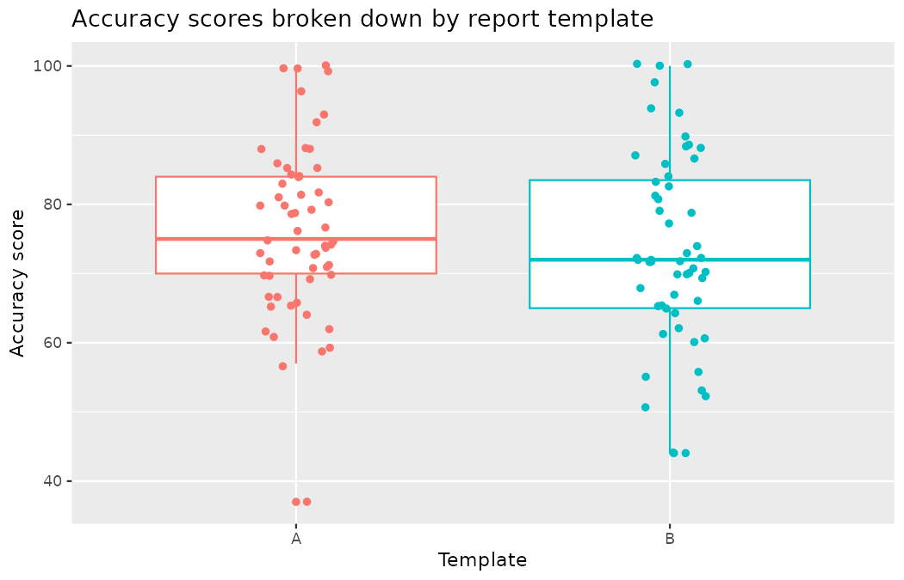
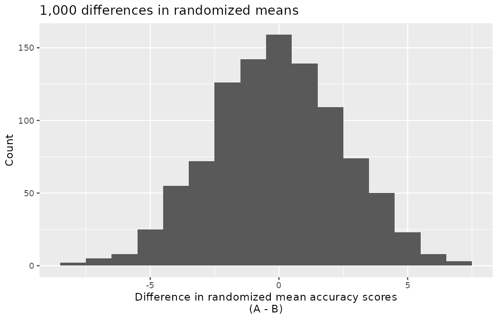
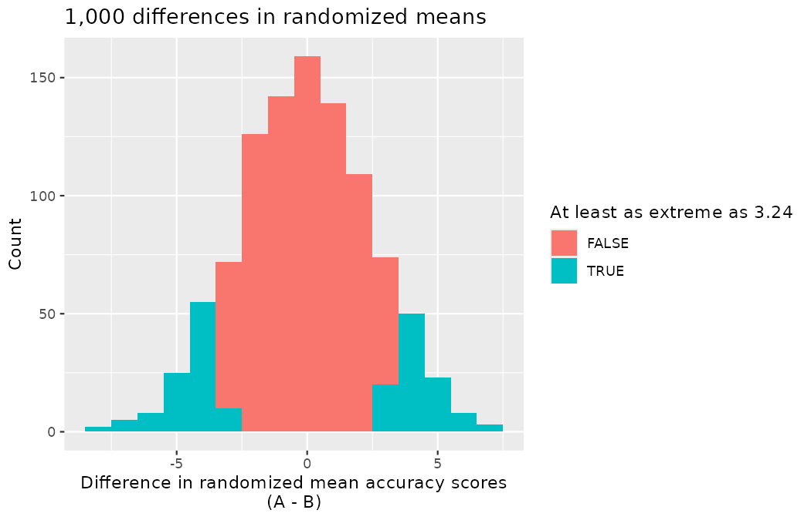
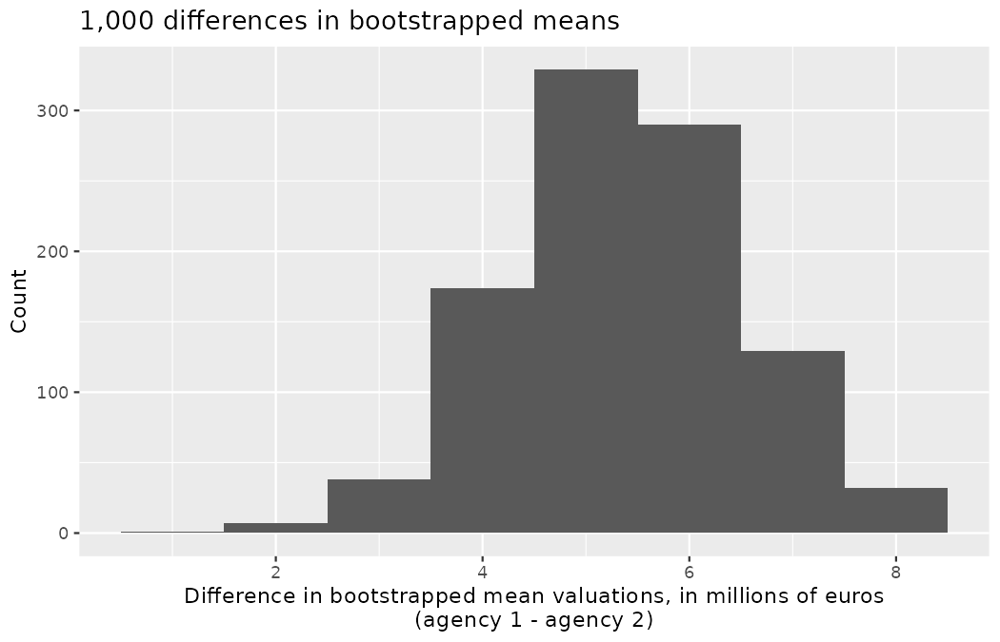
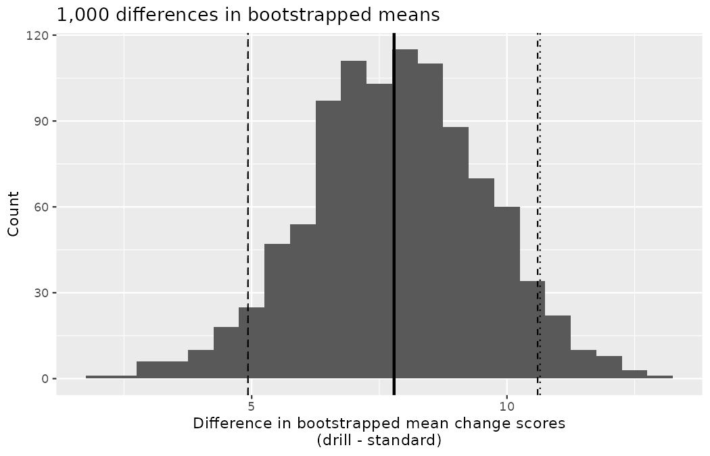
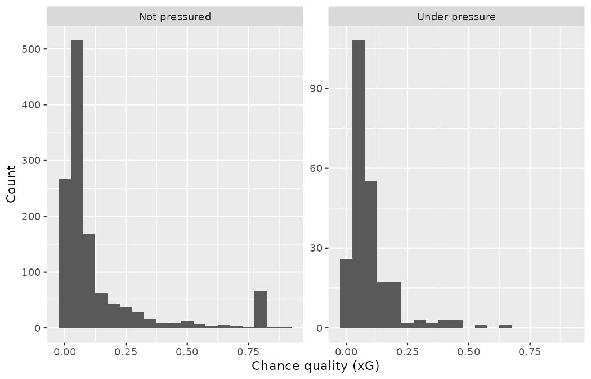
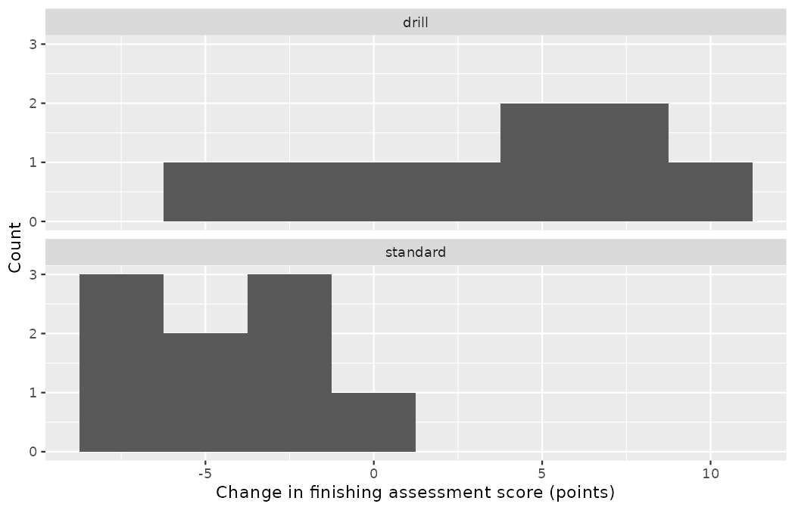

# Inference for comparing two independent means {#sec-inference-two-means}

::: {.chapterintro}
We now extend the methods from [Chapter -@sec-inference-one-mean] to apply confidence intervals and hypothesis tests to differences in population means that come from two groups, Group 1 and Group 2: $\mu_1 - \mu_2.$

The notation is new in this chapter, so take it apart before using it.
The Greek letter $\mu$ is, as it has been since @sec-explore-numerical, a *population* mean — the true, unobserved average of some numerical quantity.
The subscripts $1$ and $2$ are the generic group labels you met for proportions in @sec-inference-two-props: group 1 and group 2, whichever two groups the problem at hand supplies — the two report templates, the two training regimes, the pressured and unpressured shots.
And the parameter of interest is neither mean alone but their *difference*, $\mu_1 - \mu_2$ — a single number, which equals zero exactly when the two population means are equal.

In our investigations, we'll identify a reasonable **point estimate** of $\mu_1 - \mu_2$ based on the sample, and you may have already guessed its form: $\bar{x}_1 - \bar{x}_2,$ the difference of the two sample means.
Each piece is familiar: $\bar{x}$ is the sample mean of @sec-explore-numerical — a variable $x$ with a bar for "averaged" — and the subscript names which group's sample supplied it, so the difference of the two sample statistics estimates the difference of the two population parameters, exactly as $\hat{p}_1 - \hat{p}_2$ estimated $p_1 - p_2$ in @sec-inference-two-props.
Then we'll look at the inferential analysis in three different ways: using a randomization test, applying bootstrapping for interval estimates, and, if we verify that the point estimate can be modeled using a normal distribution, we compute the estimate's standard error and apply the mathematical framework.
:::

In this chapter we consider a difference in two population means, $\mu_1 - \mu_2,$ under the condition that the data are *not* paired.
(Paired data — the same player measured under two GPS-vest vendors, say — earn their own machinery in @sec-inference-paired-means.)
Just as with a single sample, we identify conditions to ensure we can use the $t$-distribution with a point estimate of the difference, $\bar{x}_1 - \bar{x}_2,$ and a new standard error formula.

The details for working through inferential problems in the two independent means setting are strikingly similar to those applied to the two independent proportions setting of @sec-inference-two-props.
We first cover a randomization test where the observations are shuffled under the assumption that the null hypothesis is true.
Then we bootstrap the data (with no imposed null hypothesis) to create a confidence interval for the true difference in population means, $\mu_1 - \mu_2.$ The mathematical model, here the $t$-distribution, is able to describe both the randomization test and the bootstrapping as long as the conditions are met.

The inferential tools are applied to three different data contexts: determining whether one version of a scout-report template produces less accurate assessments than another, whether an individualized finishing-drill program genuinely improves academy players' finishing, and whether shots taken under defensive pressure are worse *chances* — lower chance quality, not just lower conversion — than unpressured shots.
This chapter is motivated by questions like "Is there convincing evidence that pressured shots at the 2022 Men's World Cup carried a different average chance quality than unpressured shots?"

## Randomization test for the difference in means {#sec-rand2mean}

Last winter, Priya Rao's analytics team rolled out a redesigned scout-report template at Northbridge United.
To find out whether the redesign actually changed the quality of the assessments, the department ran the rollout as an experiment: over one month, each of 113 report assignments across the scouting network was randomly allocated to template A (the redesign) or template B (the incumbent), and every finished report was scored for accuracy — 0 to 100 — against an expert-panel benchmark assessment of the same player, with the panel blind to which template had been used.
(The panel's benchmark assessments cover a small pool of reference players, and each report assignment was drawn against one of them — the panel maintained a handful of gold-standard assessments, not 113.)
Scouts filing on template B grumbled all month that its layout buried the physical-profile fields.
Anticipating a formal complaint, Emil Sørensen would like to evaluate whether the difference observed between the groups is so large that it provides convincing evidence that template B produced less accurate reports (on average) than template A.

::: {.callout-note title="Data"}
The `template_ab` data are a constructed Northbridge scenario, built in the seeded R code below; no real scouting network filed these reports.
Every number in this section can be reproduced from the code.
:::

### Observed data

The code below constructs the data: one row per filed report, recording which template the assignment was randomized to and the accuracy score the panel awarded (scores are capped at 100).

```r
library(dplyr)
library(tidyr)
library(readr)
library(ggplot2)
library(infer)

set.seed(2001)
template_ab <- tibble(
  report   = paste0("R", 1:113),
  template = factor(rep(c("A", "B"), times = c(58, 55)), levels = c("A", "B")),
  accuracy = round(c(rnorm(58, mean = 75.5, sd = 13.5),
                     rnorm(55, mean = 72,   sd = 13.5)))
) |>
  mutate(accuracy = pmin(accuracy, 100))
```

Summary statistics for how the reports scored under the two templates are shown in @tbl-template-ab-summary and plotted by the box plot code below.

```r
template_ab |>
  group_by(template) |>
  summarize(
    n    = n(),
    mean = round(mean(accuracy), 2),
    sd   = round(sd(accuracy), 2),
    min  = min(accuracy),
    max  = max(accuracy)
  )
#> # A tibble: 2 × 6
#>   template     n  mean    sd   min   max
#>   <fct>    <int> <dbl> <dbl> <dbl> <dbl>
#> 1 A           58  76.3  12.1    37   100
#> 2 B           55  73.1  14.4    44   100
```

| Group | n   | Mean  | SD    | Min | Max |
|:-----:|:---:|:-----:|:-----:|:---:|:---:|
| A     | 58  | 76.34 | 12.08 | 37  | 100 |
| B     | 55  | 73.11 | 14.42 | 44  | 100 |

: Summary statistics of accuracy scores for each report template. {#tbl-template-ab-summary}

```r
ggplot(template_ab, aes(x = template, y = accuracy, color = template)) +
  geom_boxplot(show.legend = FALSE) +
  geom_jitter(width = 0.1, show.legend = FALSE) +
  labs(
    title = "Accuracy scores broken down by report template",
    x = "Template",
    y = "Accuracy score"
  )
```

{fig-alt="Box plots of accuracy scores for report templates A and B with jittered points overlaid. The two distributions overlap heavily and are roughly symmetric, with template A centered slightly higher and one low A score of 37 sitting well below the rest." width=85%}

::: {.callout-tip title="Check your understanding"}
Construct hypotheses to evaluate whether the observed difference in sample means, $\bar{x}_A - \bar{x}_B = 3.24,$ is likely to have happened due to chance, if the null hypothesis is true.
We will later evaluate these hypotheses using $\alpha = 0.01.$

------------------------------------------------------------------------

$H_0:$ the two templates produce equally accurate reports, on average: $\mu_A - \mu_B = 0.$
$H_A:$ one template produces more accurate reports than the other, on average: $\mu_A - \mu_B \neq 0.$
(Per the discipline of @sec-foundations-decision-errors, the alternative is two-sided — the complaint says B is worse, but an open mind allows that the redesign might have been the harmful one.)
:::

::: {.callout-tip title="Check your understanding"}
Before moving on to evaluate the hypotheses in the previous Check your understanding, let's think carefully about the dataset.
Are the observations across the two groups independent?
Are there any concerns about outliers?

------------------------------------------------------------------------

Since the templates were randomly allocated to assignments, the "treatment" was randomly assigned, so independence within and between groups is satisfied.
The summary statistics suggest the scores are roughly symmetric about their means.
One report — the low score of 37 in the A group — sits some 20 points below the next-lowest A score and earns a raised eyebrow.
It is not a threat to the *randomization test* we are about to run, which makes no distributional assumption (the shuffles simply reallocate the scores we actually observed), but it is exactly the kind of observation we will have to take more seriously when the mathematical model arrives later in the chapter.
:::

### Variability of the statistic

In @sec-foundations-randomization, the variability of the statistic (previously: $\hat{p}_1 - \hat{p}_2$) was visualized after shuffling the observations across the two treatment groups many times.
The shuffling process implements the null hypothesis model (that there is no effect of the treatment).
In the template example, the null hypothesis is that templates A and B produce equally accurate reports, so the average scores across the two groups should be the same.
If the templates were equally good, *due to natural variability*, we would sometimes expect reports to score slightly better on template A $(\bar{x}_A > \bar{x}_B)$ and sometimes expect them to score slightly better on template B $(\bar{x}_B > \bar{x}_A).$ The question at hand is: does $\bar{x}_A - \bar{x}_B = 3.24$ indicate that template A genuinely produces more accurate reports than template B?

To watch a single iteration of the randomization process with your own eyes, take a subset small enough to eyeball — the first four A reports and the first five B reports:

```r
toy9 <- bind_rows(
  template_ab |> filter(template == "A") |> slice_head(n = 4),
  template_ab |> filter(template == "B") |> slice_head(n = 5)
)

toy9 |>
  group_by(template) |>
  summarize(n = n(), mean = mean(accuracy))
#> # A tibble: 2 × 3
#>   template     n  mean
#>   <fct>    <int> <dbl>
#> 1 A            4  73
#> 2 B            5  70.8
```

In this little subset, the four A reports average 73 and the five B reports average 70.8 — a difference of 2.2 points.
If the null hypothesis is true, then the accuracy of each report reflects the scout's read of the player and the quality of the evidence, and it shouldn't matter which template the assignment happened to draw.
By reallocating which report gets which template label, we can see how the difference in average scores moves due only to natural variability:

```r
set.seed(2001)
toy9_shuffled <- toy9 |>
  mutate(template = sample(template))

toy9_shuffled |>
  group_by(template) |>
  summarize(n = n(), mean = mean(accuracy))
#> # A tibble: 2 × 3
#>   template     n  mean
#>   <fct>    <int> <dbl>
#> 1 A            4  74.8
#> 2 B            5  69.4
```

One shuffle — the labels reassigned completely at random — produced simulated group means of 74.75 and 69.4: a difference of 5.35 points, *larger* than the 2.2 the real labels showed on these nine reports.
Chance alone, on a handful of observations, manufactures differences of this size without any help from the templates.

Scaling the same operation up to all 113 reports and repeating it 1,000 times gives the null distribution of the statistic $\bar{x}_{A, sim} - \bar{x}_{B, sim}$ — the by-now familiar **infer** pipeline, with one change from @sec-foundations-randomization: `calculate()` now computes a *difference in means* rather than a difference in proportions.

```r
set.seed(2001)
template_null <- template_ab |>
  specify(accuracy ~ template) |>
  hypothesize(null = "independence") |>
  generate(reps = 1000, type = "permute") |>
  calculate(stat = "diff in means", order = c("A", "B"))

round(template_null$stat[1:3], 2)
#> [1]  3.84  4.12 -3.03

ggplot(template_null, aes(x = stat)) +
  geom_histogram(binwidth = 1) +
  labs(
    title = "1,000 differences in randomized means",
    x = "Difference in randomized mean accuracy scores\n(A - B)",
    y = "Count"
  )
```

{fig-alt="Histogram of 1,000 differences in randomized mean accuracy scores (A minus B), centered at zero and bell-shaped, running from about -8.4 to +6.8." width=85%}

The histogram of the 1,000 simulated differences is centered at zero and bell-shaped, running from about $-8.4$ to $+6.8$: just by chance, the difference in mean accuracy can land anywhere within roughly eight points of zero.

### Observed statistic vs. null statistics

The goal of the randomization test is to assess the observed data, here the statistic of interest: $\bar{x}_A - \bar{x}_B = 3.24.$
The randomization distribution allows us to identify whether a difference of 3.24 points is more than one would expect by natural variability of the scores if the two templates were equally good.
The code below marks the observed difference on the null distribution and counts the shuffles at least as favorable to the alternative.

```r
stat_ab <- template_ab |>
  specify(accuracy ~ template) |>
  calculate(stat = "diff in means", order = c("A", "B"))

round(stat_ab$stat, 2)
#> [1] 3.24

ggplot(template_null, aes(x = stat, fill = abs(stat) >= stat_ab$stat)) +
  geom_histogram(binwidth = 1) +
  labs(
    title = "1,000 differences in randomized means",
    x = "Difference in randomized mean accuracy scores\n(A - B)",
    y = "Count",
    fill = "At least as extreme as 3.24"
  )
```

{fig-alt="The same histogram of 1,000 randomized differences in mean accuracy scores, now with the shuffles at least as extreme as the observed difference of 3.24 highlighted in a separate fill color in both tails." width=85%}

::: {.callout-note title="Worked example"}
Approximate the p-value depicted by the shaded histogram, and provide a conclusion in the context of the case study.

------------------------------------------------------------------------

Using software, we can count the shuffled differences in means that fall below the observed difference of 3.24: there are 896 (out of 1,000 randomizations).
So 10.4% of the simulations are at least as large as the observed difference.
To get the p-value, we double the proportion of randomized differences that are larger than the observed difference: p-value $= 2 \times 0.104 = 0.208,$ or roughly 0.21.

```r
template_null |>
  summarize(
    n_below   = sum(stat < stat_ab$stat),
    n_at_or_above = sum(stat >= stat_ab$stat),
    p_value   = 2 * mean(stat >= stat_ab$stat)
  )
#> # A tibble: 1 × 3
#>   n_below n_at_or_above p_value
#>     <int>         <int>   <dbl>
#> 1     896           104   0.208
```

Previously, we specified that we would use $\alpha = 0.01.$ Since the p-value is larger than $\alpha,$ we do not reject the null hypothesis.
That is, the data do not convincingly show that one template produces more accurate reports than the other, and Emil should not be persuaded that reports filed on template B deserve a compensating adjustment.
:::

The large p-value and the consistency of $\bar{x}_A - \bar{x}_B = 3.24$ with the randomized differences lead us to *not reject the null hypothesis*.
Said differently, there is no discernible evidence that one of the templates is better than the other.
One might be inclined to conclude that the templates are equally good, but that conclusion would be wrong.
The hypothesis testing framework is set up only to reject a null claim; it is not set up to validate a null claim — recall the VAR review of @sec-foundations-randomization: "check complete" does not certify the on-field call.
As we concluded, the data are consistent with templates A and B being equally good, but the data are also consistent with template A producing reports 3.24 points more accurate than template B.
The data are not able to adjudicate between those possibilities.
Indeed, conclusions where the null hypothesis is not rejected often seem unsatisfactory.
Here, however, Priya and the grumbling scouts are probably all relieved: there is no evidence that a month of assessments was distorted by a layout choice.

## Bootstrap confidence interval for the difference in means

Before providing a full example working through a bootstrap analysis on a Northbridge experiment, we pause on a deliberately tiny scouting errand — this chapter's version of the seven trialists of @sec-foundations-bootstrapping — to visualize the *two sample* bootstrap setting.
Marta Vidal asked two partner agencies to submit independent valuations for the wingers each represents on Northbridge's shortlist; agency 1 sent valuations for five comparable wingers on its books, and agency 2 for five on its own.
The research question: how much higher, on average, does agency 1 price a shortlist winger than agency 2 — and how precisely can ten valuations pin that down?
(A constructed scenario, built in the seeded code below.)

```r
set.seed(2002)
agency_1 <- tibble(winger = paste0("W", 1:5),
                   value  = round(rnorm(5, mean = 10.5, sd = 2), 1))
agency_2 <- tibble(winger = paste0("W", 6:10),
                   value  = round(rnorm(5, mean = 8, sd = 1.5), 1))

agency_1$value
#> [1] 10.3 13.7 13.3 11.9 15.0
agency_2$value
#> [1]  7.7 10.5  4.5  7.9  7.0

c(mean(agency_1$value), mean(agency_2$value))
#> [1] 12.84  7.52
```

The process of bootstrapping can be applied to *each* group separately, and the differences of means recalculated each time.
The analysis proceeds as in the one sample case of @sec-boot1mean, but now the (single) statistic of interest is the *difference in sample means*.
That is, a bootstrap resample is done on each of the groups separately — five valuations drawn with replacement from agency 1's bag, five from agency 2's, exactly the two-bag mechanics of @sec-two-prop-boot-ci — but the results are combined to have a single bootstrapped **difference in means**.
Repetition produces $k$ bootstrapped differences in means, and the histogram describes the natural sampling variability associated with the difference.

```r
set.seed(2002)
agency_boot <- tibble(
  stat = replicate(1000, {
    mean(slice_sample(agency_1, n = 5, replace = TRUE)$value) -
      mean(slice_sample(agency_2, n = 5, replace = TRUE)$value)
  })
)

agency_boot |>
  summarize(se = sd(stat), lowest = min(stat), highest = max(stat))
#> # A tibble: 1 × 3
#>      se lowest highest
#>   <dbl>  <dbl>   <dbl>
#> 1  1.14   1.32    8.44

ggplot(agency_boot, aes(x = stat)) +
  geom_histogram(binwidth = 1) +
  labs(
    title = "1,000 differences in bootstrapped means",
    x = "Difference in bootstrapped mean valuations, in millions of euros\n(agency 1 - agency 2)",
    y = "Count"
  )
```

{fig-alt="Histogram of 1,000 bootstrapped differences in mean winger valuations (agency 1 minus agency 2), in millions of euros, ranging from about 1.3 to 8.4 around the observed difference of 5.32." width=85%}

The 1,000 bootstrapped differences in mean valuation range from about €1.3M to €8.4M around the observed difference of $12.84 - 7.52 = 5.32,$ with a standard error of €1.14M — five valuations per bag simply cannot price the gap between two agencies to better than a million or so either way.

In the following sections, we leave the two-agency errand and apply the bootstrap method to a Northbridge experiment on finishing development, and later to the tournament shot data.
Note that the tiny setting allowed us to *visualize* the bootstrap method, which is important for understanding how it works.
However, the bootstrap relies heavily on the sample being an outstanding proxy for the population, and five observations are almost never enough to truly represent the nuances of a full population — the lesson the five logged shots of @sec-boot1mean taught with their clumpy histograms.
To that end, we apply bootstrap methods with larger samples wherever the club can afford them.

### Observed data

Does an individualized finishing-drill program improve academy players' finishing?
Jonas Beck ran the question as a randomized experiment.
Eighteen academy forwards sat the club's finishing assessment at the start of a training block; each was then randomly assigned to the individualized drill program (`drill`) or to standard training (`standard`), nine per arm, and all eighteen re-sat the assessment at the end of the block.
The response variable is each player's *change score* — end-of-block score minus start-of-block score, in assessment points — so a positive value corresponds to improved finishing.
Our goal will be to identify a 95% confidence interval for the effect of the drill program on the change in finishing assessment score relative to the standard-training group.

::: {.callout-note title="Data"}
The `drill18` data are a constructed Northbridge scenario, built in the seeded R code below; no real academy cohort was assessed.
This trial is also distinct from the multi-academy `drill_trial` of @sec-data-hello and the two 90-player benchmark trials of @sec-foundations-decision-errors and @sec-inference-two-props — a new, small experiment with a *numerical* outcome.
:::

```r
set.seed(2003)
change_scores <- c(rnorm(9, mean = 1.7,  sd = 5.2),
                   rnorm(9, mean = -3.5, sd = 2.8))

drill18 <- tibble(
  player = paste0("P", 1:18),
  group  = factor(rep(c("drill", "standard"), each = 9),
                  levels = c("drill", "standard")),
  before = round(rnorm(18, mean = 60, sd = 5), 1)
) |>
  mutate(
    after  = round(before + change_scores, 1),
    change = after - before
  )

drill18 |>
  group_by(group) |>
  summarize(n = n(), mean = round(mean(change), 2), sd = round(sd(change), 2))
#> # A tibble: 2 × 4
#>   group        n  mean    sd
#>   <fct>    <int> <dbl> <dbl>
#> 1 drill        9  3.52  4.95
#> 2 standard     9 -4.27  2.56
```

| Group    | n   | Mean  | SD   |
|:---------|:---:|:-----:|:----:|
| drill    | 9   | 3.52  | 4.95 |
| standard | 9   | -4.27 | 2.56 |

: Summary statistics of the finishing-drill study: change in assessment score (after $-$ before), in points. {#tbl-drill18-summary}

Notice the sign of the standard group's mean in @tbl-drill18-summary: players under standard training *declined* by 4.27 points on average across the block — end-of-block assessments land in the heaviest weeks of the season, and tired legs finish worse.
The drill group improved by 3.52 points against that same headwind.
The point estimate of the difference in the change scores is straightforward to find: it is the difference in the sample means, and each subscript names its group, exactly as the chapter intro promised:

$$\bar{x}_{drill} - \bar{x}_{standard} = 3.52 - (-4.27) = 7.79$$

### Variability of the statistic

As we saw in @sec-two-prop-boot-ci, we will use bootstrapping to estimate the variability associated with the difference in sample means when taking repeated samples.
In a method akin to two proportions, a *separate* sample is taken with replacement from each group (here `drill` and `standard`), the sample means are calculated, and their difference is taken.
The entire process is repeated multiple times to produce a bootstrap distribution of the difference in sample means (*without* the null hypothesis assumption).

```r
stat_drill <- drill18 |>
  specify(change ~ group) |>
  calculate(stat = "diff in means", order = c("drill", "standard"))

set.seed(2003)
drill_boot <- drill18 |>
  specify(change ~ group) |>
  generate(reps = 1000, type = "bootstrap") |>
  calculate(stat = "diff in means", order = c("drill", "standard"))

ci_perc_drill <- drill_boot |>
  get_confidence_interval(level = 0.9, type = "percentile")
ci_perc_drill
#> # A tibble: 1 × 2
#>   lower_ci upper_ci
#>      <dbl>    <dbl>
#> 1     4.93     10.6

ci_se_drill <- drill_boot |>
  get_confidence_interval(level = 0.9, type = "se",
                          point_estimate = stat_drill)
ci_se_drill
#> # A tibble: 1 × 2
#>   lower_ci upper_ci
#>      <dbl>    <dbl>
#> 1     4.93     10.6

ggplot(drill_boot, aes(x = stat)) +
  geom_histogram(binwidth = 0.5) +
  geom_vline(xintercept = stat_drill$stat, linewidth = 1) +
  geom_vline(xintercept = unlist(ci_perc_drill), linetype = "dashed") +
  geom_vline(xintercept = unlist(ci_se_drill), linetype = "dotted") +
  labs(
    title = "1,000 differences in bootstrapped means",
    x = "Difference in bootstrapped mean change scores\n(drill - standard)",
    y = "Count"
  )
```

{fig-alt="Histogram of 1,000 bootstrapped differences in mean change scores (drill minus standard), roughly symmetric and bell-shaped around the observed difference of 7.79 marked by a solid vertical line, with dashed and dotted lines showing the nearly coinciding 90% percentile and SE intervals." width=85%}

The histogram of the 1,000 bootstrapped differences is roughly symmetric and bell-shaped around the observed difference of 7.79 (solid line), running from about 1.9 to 12.8 points.
The 90% bootstrap percentile interval (dashed lines) is $(4.93, 10.60)$; the 90% bootstrap SE interval (dotted lines) is $(4.93, 10.65)$ — the two constructions nearly coincide here, as they should when the bootstrap distribution is this bell-shaped (recall @sec-two-prop-boot-ci).

::: {.callout-tip title="Check your understanding"}
Using the bootstrapped differences in `drill_boot`, estimate the standard error of the difference in sample means, $\bar{x}_{drill} - \bar{x}_{standard}.$

```r
round(sd(drill_boot$stat), 2)
#> [1] 1.74
```

------------------------------------------------------------------------

The standard error of the difference is estimated by the standard deviation of the 1,000 bootstrapped differences: $SE \approx 1.74$ points.
(The point estimate whose variability it describes is $\bar{x}_{drill} - \bar{x}_{standard} = 7.79.$)
:::

::: {.callout-note title="Worked example"}
Choose one of the bootstrap confidence intervals for the true difference in average change score, $\mu_{drill} - \mu_{standard}.$ Does the interval show that there is a difference across the two arms?

------------------------------------------------------------------------

Because neither of the 90% intervals (percentile or SE) overlaps zero — indeed, zero is never one of the 1,000 bootstrapped differences, so 95% and 99% intervals would have given the same conclusion — we conclude that the drill program is substantially better for finishing development than standard training over this block.

Because the study is a randomized experiment, we can conclude that it is the program *causing* the improvement: we are 90% confident the individualized drills add between roughly 4.9 and 10.6 assessment points relative to standard training.
Contrast the strength of this claim with everything we are allowed to say about tournament data — random assignment, not sample size, is what bought it.
:::

## Mathematical model for testing the difference in means {#sec-math2samp}

Since @sec-explore-categorical, this book has kept returning to shots taken under defensive pressure.
Chapter [-@sec-foundations-randomization] asked whether pressured shots are *converted* at a lower rate — a proportions question — and @sec-one-mean-math tested one tournament's pressured shots against a fixed benchmark.
The question for this section is the two-sample means version, on the tournament we hold in full: at the 2022 Men's World Cup, did shots taken under pressure carry a different average *chance quality* — `statsbomb_xg`, per @sec-explore-numerical's house vocabulary — than shots taken unpressured?
Emil's scouts phrase it more bluntly: are pressured attempts worse chances, or just worse-finished chances?

::: {.callout-note title="Data"}
The shot data are read from `data/derived/wc2022_shots.csv` (StatsBomb open data): all 1,494 shots of the 2022 Men's World Cup.
These are observational data — nobody randomly assigned pressure — so, per @sec-chp11-observational, every conclusion in this section speaks to association, not causation.
:::

### Observed data

Four cases from this dataset are shown below.
We are particularly interested in two variables: `statsbomb_xg`, the chance quality of the shot, and `under_pressure`, which records whether an opponent was actively pressuring the shooter.

```r
wc2022_shots <- read_csv("data/derived/wc2022_shots.csv")

wc2022_shots |>
  select(team, player, minute, under_pressure, statsbomb_xg, outcome) |>
  head(4)
#> # A tibble: 4 × 6
#>   team    player            minute under_pressure statsbomb_xg outcome
#>   <chr>   <chr>              <dbl> <lgl>                 <dbl> <chr>
#> 1 Canada  Mark Anthony Kaye      2 TRUE                 0.0389 Blocked
#> 2 Morocco Hakim Ziyech           3 FALSE                0.0245 Goal
#> 3 Morocco Abdelhamid Sabiri      8 FALSE                0.0221 Blocked
#> 4 Morocco Sofiane Boufal         9 FALSE                0.0616 Wayward
```

We would like to know: is there convincing evidence that pressured shots carried a different average chance quality than unpressured shots at this tournament?

::: {.callout-note title="Worked example"}
Set up appropriate hypotheses to evaluate whether there is a relationship between defensive pressure and average chance quality.

------------------------------------------------------------------------

The null hypothesis represents the case of no difference between the groups.

-   $H_0:$ There is no difference in average chance quality between pressured and unpressured shots. In statistical notation: $\mu_{nop} - \mu_{prs} = 0,$ where $\mu_{nop}$ represents the not-pressured shots and $\mu_{prs}$ represents the shots taken under pressure (the subscripts, as always, simply name the groups).
-   $H_A:$ There is some difference in average chance quality between the two kinds of shots: $\mu_{nop} - \mu_{prs} \neq 0.$

And because pressure was not randomly assigned, even a rejection of $H_0$ will assert *association* between pressure and chance quality, nothing more.
:::

@tbl-pressure-summary-stats displays sample statistics from the data.
We can see that the average chance quality of pressured shots is lower than that of unpressured shots.

```r
wc2022_shots |>
  group_by(under_pressure) |>
  summarize(
    n    = n(),
    mean = round(mean(statsbomb_xg), 4),
    sd   = round(sd(statsbomb_xg), 4)
  )
#> # A tibble: 2 × 4
#>   under_pressure     n   mean     sd
#>   <lgl>          <int>  <dbl>  <dbl>
#> 1 FALSE           1256 0.132  0.196
#> 2 TRUE             238 0.0961 0.0949
```

| Group          | n     | Mean   | SD     |
|:---------------|:-----:|:------:|:------:|
| not pressured  | 1,256 | 0.1315 | 0.1961 |
| under pressure | 238   | 0.0961 | 0.0949 |

: Summary statistics of chance quality (xG) by pressure, all 1,494 shots of the 2022 Men's World Cup. {#tbl-pressure-summary-stats}

Note the imbalance in the group sizes — 1,256 against 238 — mirroring the way the football, not any experimental design, dealt these groups: pressure on the shooter is the exception, not the rule.
The machinery below is untroubled by imbalance; each group simply contributes its own information through its own sample size.

### Variability of the statistic

We check the two conditions necessary to model the difference in sample means using the $t$-distribution.

-   The shots come from 64 matches across a whole tournament, and no analyst selected them — every logged shot is included.
    As in @sec-one-mean-math, we treat them as independent draws from the process that generates shots at this level, a reasonable working approximation (rebounds and scrambles push gently against it), while remembering the observational frame.
-   With both groups far beyond 30 observations, we inspect the data for particularly extreme outliers, using the histograms drawn by the code below, and find none: both panels show the strong right skew chance quality always has, which is acceptable at these sample sizes (recall the guideline of @sec-one-mean-math: strong skew is fine for $n$ of 60 or more), and no single observation sits isolated from its group.

```r
wc2022_shots |>
  mutate(pressure = if_else(under_pressure, "Under pressure", "Not pressured")) |>
  ggplot(aes(x = statsbomb_xg)) +
  geom_histogram(binwidth = 0.05) +
  facet_wrap(~pressure, ncol = 2, scales = "free_y") +
  labs(x = "Chance quality (xG)", y = "Count")
```

{fig-alt="Histograms of chance quality (xG) for not-pressured and under-pressure shots in side-by-side panels. Both show strong right skew with no isolated single observations, though the unpressured panel has an isolated spike of shots near 0.78 xG." width=85%}

Since both conditions are satisfied, the difference in sample means may be modeled using a $t$-distribution.
One feature of the unpressured panel, though, should catch a trained eye: an isolated *spike* — not a lone point, a whole bar — near 0.78 xG.
You have met that spike in every xG histogram since @sec-data-applications.
Hold that thought; it is not an "outlier," and it will get the full treatment shortly.

::: {.callout-tip title="Check your understanding"}
The summary statistics in @tbl-pressure-summary-stats may be useful for this Check your understanding.
What is the point estimate of the population difference, $\mu_{nop} - \mu_{prs}$?

------------------------------------------------------------------------

The point estimate is the difference in sample means: $\bar{x}_{nop} - \bar{x}_{prs} = 0.1315 - 0.0961 = 0.0354$ xG per shot.
:::

### Observed statistic vs. null statistics

::: {.callout-important title="The test statistic for comparing two means is a T"}
The **T score** is a ratio of how the groups differ as compared to how the observations within a group vary.

$$T = \frac{(\bar{x}_1 - \bar{x}_2) - 0}{\sqrt{s_1^2/n_1 + s_2^2/n_2}}$$

When the null hypothesis is true and the conditions are met, the distribution of T is well approximated by a $t$-distribution with $df = \min(n_1 - 1, n_2 - 1).$

Conditions:

-   Independent observations within and between groups.
-   Large samples and no extreme outliers.
:::

Both formulas in that box are new in this chapter, so take them apart piece by piece before using them.

Start under the square root.
Each term $s^2/n$ is the *squared* standard error of a single sample mean — recall $SE = s/\sqrt{n}$ from @sec-one-mean-math — one copy for group 1, one copy for group 2, each built from its own group's spread and its own group's size.
Because the two groups are independent, their uncertainties compound, and the squared standard errors *add*:

$$SE(\bar{x}_1 - \bar{x}_2) = \sqrt{\frac{s_1^2}{n_1} + \frac{s_2^2}{n_2}}$$

Note carefully that they add even though the statistic subtracts — an error in $\bar{x}_1$ and an error in $\bar{x}_2$ are both free to push the difference off target, so the difference is *more* variable than either mean alone, never less.
This is the same logic, term for term, as the two-proportion standard error of @sec-math-2prop, with each proportion's $\hat{p}(1-\hat{p})/n$ replaced by a mean's $s^2/n.$
The numerator of $T$ is the point estimate minus the null value — and under $H_0: \mu_1 - \mu_2 = 0,$ the null value is the $0$ written there explicitly.
The whole ratio counts how many standard errors the observed difference sits from zero, precisely the job $T$ performed in @sec-one-mean-math and $Z$ before it.

The degrees of freedom formula also deserves a slow first read.
The function $\min(n_1 - 1, n_2 - 1)$ returns the *smaller* of its two arguments: each group brings the $n - 1$ degrees of freedom you know from @sec-one-mean-math, and we let the *smaller* group set the df for the pair.
The formula software uses for the degrees of freedom — the Welch–Satterthwaite approximation, itself an approximation, since the underlying two-variance problem admits no exact answer — is quite complex; the min rule is the honest hand shortcut — deliberately conservative, since fewer degrees of freedom means thicker tails and wider intervals, so the approximation errs on the side of demanding more evidence.
For our pressure data: $df = \min(1256 - 1,\ 238 - 1) = 237.$

::: {.callout-tip title="Check your understanding"}
Two groups of academy trialists are compared on a sprint metric, with $n_1 = 13$ and $n_2 = 9.$ Under the min rule, how many degrees of freedom does the $t$-distribution get?
And why is taking the *smaller* of the two candidates the conservative choice rather than an arbitrary one?

------------------------------------------------------------------------

$df = \min(13 - 1,\ 9 - 1) = \min(12,\ 8) = 8.$
Fewer degrees of freedom means thicker tails (recall the df figure of @sec-one-mean-math): tail areas beyond any cutoff are larger, so p-values come out bigger, and critical values $t^\star_{df}$ come out bigger, so intervals come out wider.
Taking the smaller candidate therefore always errs toward demanding *more* evidence than the Welch–Satterthwaite value would — the shortcut can make us slightly too cautious, never too eager to reject.
:::

::: {.callout-tip title="Check your understanding"}
Compute the standard error of the point estimate for the difference in average chance quality between unpressured and pressured shots.

------------------------------------------------------------------------

$$SE(\bar{x}_{nop} - \bar{x}_{prs}) = \sqrt{\frac{s_{nop}^2}{n_{nop}} + \frac{s_{prs}^2}{n_{prs}}} = \sqrt{\frac{0.1961^2}{1256} + \frac{0.0949^2}{238}} = 0.0083$$

Notice which group dominates: despite being five times smaller, the pressured group contributes *more* to the standard error $(0.0949^2/238 = 0.000038$ against $0.1961^2/1256 = 0.000031)$ — small $n$ costs more than modest spread saves.
:::

::: {.callout-note title="Worked example"}
Complete the hypothesis test started in the previous Worked example and Check your understanding, using a discernibility level of $\alpha = 0.05.$ For reference, $\bar{x}_{nop} - \bar{x}_{prs} = 0.0354,$ $SE = 0.0083,$ and the sample sizes were $n_{nop} = 1256$ and $n_{prs} = 238.$

------------------------------------------------------------------------

We can find the test statistic for this test using the previous information:

$$T = \frac{\ 0.0354 - 0\ }{0.0083} = 4.27$$

We find the single tail area using software, with the smaller of $n_{nop} - 1 = 1255$ and $n_{prs} - 1 = 237$ as the degrees of freedom: $df = 237.$ The one tail area is roughly 0.000014; doubling this value gives the two-tail area and p-value, roughly 0.000028.

```r
pt(-4.27, df = 237) * 2
#> [1] 2.829918e-05
```

The p-value is (much) smaller than the discernibility level of 0.05, so we reject the null hypothesis.
Taken at face value, the data provide statistically discernible evidence of a difference in average chance quality between pressured and unpressured shots at this tournament.
:::

This result is likely not surprising.
Every coaching manual says pressure ruins chances, and Northbridge's own folklore agrees — the club still circulates a line from the 1968 notebooks of Agnes Whitmore, its founding chief scout:

> *A forward hurried is a forward halved. Judge no man by what he shoots with a defender in his collar.*

Before that goes into another generation of scout training, though, the book's penalty convention (recall @sec-chp11-pens-out) must be allowed to ask its question: *which shots are in each group?*
That spike near 0.78 in the unpressured histogram has been waiting patiently.

```r
wc2022_shots |>
  filter(shot_type == "Penalty") |>
  summarize(
    kicks     = n(),
    mean_xg   = round(mean(statsbomb_xg), 4),
    pressured = sum(under_pressure)
  )
#> # A tibble: 1 × 3
#>   kicks mean_xg pressured
#>   <int>   <dbl>     <int>
#> 1    64   0.784         0

wc2022_shots |>
  filter(under_pressure) |>
  count(shot_type)
#> # A tibble: 1 × 2
#>   shot_type     n
#>   <chr>     <int>
#> 1 Open Play   238
```

All 64 penalty kicks — every one stored at the constant chance quality of 0.7835, the highest-value shot type in the game — sit in the *unpressured* group, because pressure on a penalty is impossible by law.
The pressured group, meanwhile, is pure open play.
So the comparison we just ran pitted open-play shots against a blend of open-play shots, 64 penalties, and 48 unpressured dead-ball strikes, and the penalties alone prop up the unpressured mean substantially.
If the scouts' question is about shooting under defensive pressure, penalties and the other dead balls belong in neither group: we state the filter — `shot_type == "Open Play"`, keeping 1,382 shots — say why, and rerun the identical arithmetic on the frame the question actually concerns.

```r
wc2022_shots |>
  filter(shot_type == "Open Play") |>
  group_by(under_pressure) |>
  summarize(
    n    = n(),
    mean = round(mean(statsbomb_xg), 4),
    sd   = round(sd(statsbomb_xg), 4)
  )
#> # A tibble: 2 × 4
#>   under_pressure     n   mean     sd
#>   <lgl>          <int>  <dbl>  <dbl>
#> 1 FALSE           1144 0.0988 0.130
#> 2 TRUE             238 0.0961 0.0949
```

The pressured group is untouched: the same 238 shots, $\bar{x}_{prs} = 0.0961.$
Every change lands on the other side: stripped of the dead balls, the unpressured mean falls from 0.1315 to 0.0988, and the T machinery — hypotheses, formula, df rule, all standing perfectly still — returns a different verdict:

$$SE = \sqrt{\frac{0.1304^2}{1144} + \frac{0.0949^2}{238}} = 0.0073
\qquad
T = \frac{0.0988 - 0.0961}{0.0073} = 0.37$$

```r
pt(-0.37, df = 237) * 2
#> [1] 0.7117129
```

Set the two runs side by side, because — as in @sec-chp11-pens-out and the benchmark test of @sec-one-mean-math — the *pair* is the finding:

-   **All 1,494 shots, penalties in:** $\bar{x}_{nop} - \bar{x}_{prs} = 0.0354,$ $T = 4.27,$ p-value $\approx 0.00003.$ A thumping rejection.
-   **1,382 open-play shots, penalties out:** difference $0.0027,$ $T = 0.37,$ p-value $= 0.71.$ Nothing — pressured and unpressured open-play shots are, on average, chances of almost identical quality, and a gap this size arises from sampling variability alone seven times out of ten.

Of the 0.0354 xG "deficit" the first test trumpeted, 0.0327 — over nine tenths of it — was penalties and the other dead balls sitting in one group, not anything about pressured shooting.
On the frame-consistent comparison, the discernibility verdict flips outright: reject becomes fail to reject.
Agnes's forwards are not halved after all — at least not in the chances they get themselves into; whether they *finish* those equal chances worse is the conversion question, and @sec-chp11-pens-out already showed the open-play answer there was "no discernible gap" too.
And the causal discipline of @sec-chp11-observational still stands over the whole pair: even the pens-in rejection asserted association only.
Defenders choose whom to close down; nobody randomized pressure.
The honest report states the frame in its first sentence, shows the comparison both ways, and treats the gap between the two answers as part of the finding.

::: {.callout-important title="What this comparison cannot see"}
Before "equal chance quality under pressure" goes into a scouting report, name the two things this frame is structurally blind to.

First, every row in this analysis is a shot that *happened*.
Pressing's chief effect is preventing and displacing shots — the pass forced backward, the touch pushed long, the shooting lane closed before an attempt exists — and none of that can leave a trace in a dataset conditioned on a shot existing.
A defense that erases ten chances and concedes one ordinary shot looks, in this table, like a defense that changed nothing.

Second, the response variable is the vendor's own model: `statsbomb_xg` already prices defender proximity into each shot's value.
Finding that pressured shots carry roughly the value the vendor assigns them is therefore partly an echo of the vendor's own pressure discount, not an independent discovery about football.

So when a scout insists that pressure ruins shots, the claim is about a counterfactual — what this attempt would have been worth had the defender not arrived — and no dataset of realized shots, filtered or not, can test that claim directly.
:::

A small note on the power of the independent **t-test**, recalling the discussion of power in @sec-pow: the independent-groups test given here is often less powerful than the paired $t$-test coming in @sec-mathpaired, because pairing — when the design allows it — removes variability across observational units before the comparison is made.
That said, depending on how the data are collected, we don't always have a mechanism for pairing: no shot in our data is both pressured and unpressured.

## Mathematical model for estimating the difference in means

### Observed data

As with hypothesis testing, for the question of whether we can model the difference using a $t$-distribution, we'll need to check new conditions.
Like the two-proportion case of @sec-math-2prop, we will require a more robust version of independence so we are confident the two groups are also independent of each other.
Secondly, we check for normality in each group *separately*, which in practice is a check for outliers group by group.

::: {.callout-important title="Using the $t$-distribution for a difference in means"}
The $t$-distribution can be used for inference when working with the standardized difference of two means if

-   *Independence* (extended). The data are independent within and between the two groups, e.g., the data come from independent random samples or from a randomized experiment.
-   *Normality*. We check for outliers in each group separately.

The standard error may be computed as

$$SE = \sqrt{\frac{\sigma_1^2}{n_1} + \frac{\sigma_2^2}{n_2}}$$

The Welch–Satterthwaite formula for the degrees of freedom is quite complex and is generally computed using software, so instead you may use the smaller of $n_1 - 1$ and $n_2 - 1$ for the degrees of freedom if software isn't readily available.
:::

In practice the population standard deviations $\sigma_1$ and $\sigma_2$ are unknown, and — exactly as in @sec-one-mean-math — we plug in the sample standard deviations $s_1$ and $s_2$; the $t$-distribution's thicker tails are the price paid for those two estimations.
Recall from @sec-foundations-mathematical that the margin of error is defined by the standard error.
The margin of error for $\bar{x}_1 - \bar{x}_2$ can be directly obtained from $SE(\bar{x}_1 - \bar{x}_2).$

::: {.callout-important title="Margin of error for $\bar{x}_1 - \bar{x}_2$"}
The margin of error is $t^\star_{df} \times \sqrt{\frac{s_1^2}{n_1} + \frac{s_2^2}{n_2}},$ where $t^\star_{df}$ is calculated from a specified percentile on the $t$-distribution with *df* degrees of freedom — the same critical-value role $t^\star_{df}$ played in @sec-one-mean-math, now attached to the two-sample **SE difference in means**.
:::

### Variability of the statistic

::: {.callout-note title="Worked example"}
Can the $t$-distribution be used to make inference using the point estimate from the finishing-drill study, $\bar{x}_{drill} - \bar{x}_{standard} = 7.79$?

------------------------------------------------------------------------

First, we check for independence.
Because the players were randomized into the arms, independence within and between groups is satisfied.

Second, we look for outliers in each group separately, using the histograms drawn by the code below.
The drill group's change scores run from $-5.1$ to $+9.1$ with no gaps of concern, and the standard group's from $-7.6$ to $-1.0.$
(The drill group does look more variable — $s_{drill} = 4.95$ against $s_{standard} = 2.56$ — but greater spread is not the same as having clear outliers.)

With both conditions met, we can use the $t$-distribution to model the difference of sample means.

```r
ggplot(drill18, aes(x = change)) +
  geom_histogram(binwidth = 2.5) +
  facet_wrap(~group, ncol = 1) +
  labs(x = "Change in finishing assessment score (points)", y = "Count")
```

{fig-alt="Histograms of the change in finishing assessment score for the drill and standard groups, stacked in two panels. The drill group's changes run from about -5.1 to +9.1 and the standard group's from -7.6 to -1.0, with no clear outliers in either group." width=85%}
:::

Generally, we use statistical software to find the appropriate degrees of freedom, or if software isn't available, we can use the smaller of $n_1 - 1$ and $n_2 - 1$ for the degrees of freedom, e.g., if using a $t$-table to find tail areas.
For transparency in the Worked examples and Check your understandings, we'll use the latter approach; in the case of the finishing-drill study, this means we'll use $df = \min(9 - 1,\ 9 - 1) = 8.$

::: {.callout-note title="Worked example"}
Calculate a 95% confidence interval for the effect of the individualized drill program on the change in finishing assessment score relative to standard training.

------------------------------------------------------------------------

We will use the sample difference and the standard error computed from the group summaries:

$$
\begin{aligned}
\bar{x}_{drill} - \bar{x}_{standard} &= 7.79 \\
SE &= \sqrt{\frac{4.95^2}{9} + \frac{2.56^2}{9}} = 1.86
\end{aligned}
$$

Using $df = 8,$ we can identify the critical value for a 95% confidence interval: $t^{\star}_{8} = 2.31.$

```r
qt(0.975, df = 8)
#> [1] 2.306004
```

Finally, we can enter the values into the confidence interval formula:

$$
\begin{aligned}
\text{point estimate} \ &\pm\ t^{\star} \times SE \\
7.79 \ &\pm\ 2.31 \times 1.86 \\
(3.49 \ &, \ 12.09)
\end{aligned}
$$

We are 95% confident that the finishing improvement under the individualized drill program is between 3.49 and 12.09 assessment points greater than under standard training.
The interval sits comfortably above zero, agreeing with the bootstrap intervals — the **t-CI** and the bootstrap are two roads to the same destination when the conditions hold — and, because the program was randomly assigned, the effect is causal: Jonas can take this to Marta Vidal as evidence the program works, with the honest caveat that nine players per arm leave the *size* of the effect anywhere from modest to enormous.
:::

## Chapter review {#sec-chp20-review}

### Summary

In this chapter we extended the single mean inferential methods of [Chapter -@sec-inference-one-mean] to questions of differences in means.
You may have seen parallels from the chapters that extended a single proportion ([Chapter -@sec-inference-one-prop]) to differences in proportions ([Chapter -@sec-inference-two-props]) — the structure is deliberately the same, down to the standard error built by adding each group's squared one-sample SE.
When considering differences in sample means, we use the $t$-distribution to describe the sampling distribution of the T score (the standardized difference in sample means), with the conservative $df = \min(n_1 - 1, n_2 - 1)$ standing in for a formula best left to software.
Ideas of confidence level and the types of error that might occur from a hypothesis test conclusion are the same as those seen in other chapters (see [Chapter -@sec-foundations-decision-errors]).

The chapter also delivered a two-sample installment of the book's penalty convention: a randomized drill program earned a causal interval excluding zero, while the tournament's headline pressure "effect" on chance quality — $T = 4.27,$ pens in — collapsed to $T = 0.37$ the moment the 64 uncontested kicks propping up one group were filtered out, flipping the discernibility verdict outright.
State the frame, defend the filter, show any penalty-tilted comparison both ways — and remember which of your two studies was an experiment, because only that one supported a causal claim.

| Question | Answer |
|:---------------------------------------|:------------------------------|
| What is the parameter? | The difference in population means, $\mu_1 - \mu_2$; it is zero exactly when the two means agree. |
| What is the point estimate? | The difference in sample means, $\bar{x}_1 - \bar{x}_2.$ |
| How is its variability estimated? | By bootstrapping each group separately, or by the formula $SE = \sqrt{s_1^2/n_1 + s_2^2/n_2}.$ |
| What is the test statistic? | $T = \big((\bar{x}_1 - \bar{x}_2) - 0\big)\big/\sqrt{s_1^2/n_1 + s_2^2/n_2},$ read against the $t$-distribution with $df = \min(n_1 - 1, n_2 - 1).$ |
| What are the conditions? | Independent observations within and between groups; no extreme outliers, checked in each group separately. |

: Summary of inference for a difference of two means. {#tbl-chp20-summary}

### Terms

The terms introduced in this chapter are presented below, alphabetized.
If you're not sure what some of these terms mean, we recommend you go back in the text and review their definitions.
You should be able to easily spot them as **bolded text**.

|  |  |  |
|:-----------------------|:-----------------------|:----------------------|
| difference in means | SE difference in means | t-CI |
| point estimate | T score | t-test |

: Terms introduced in this chapter. {#tbl-terms-chp-20}

## Exercises {#sec-chp20-exercises}

Answers to odd-numbered exercises can be found in [Appendix -@sec-exercise-solutions-20]. Final answers to the even-numbered exercises are in [Appendix -@sec-appendix-even-answers].

::: {.exercises}

:::

------------------------------------------------------------------------

Adapted from *Introduction to Modern Statistics* by Çetinkaya-Rundel & Hardin (CC BY-SA 4.0); this adaptation is likewise CC BY-SA 4.0. Match data: StatsBomb open data.
