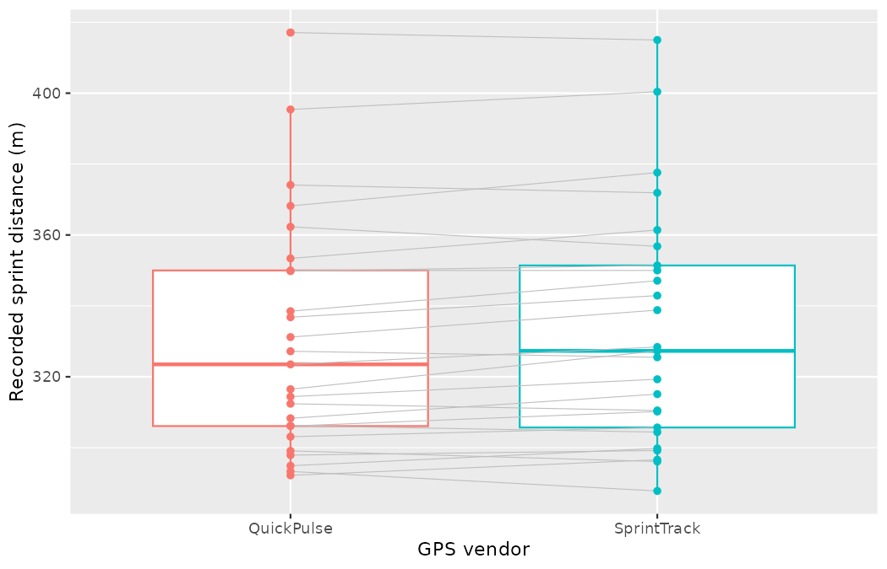
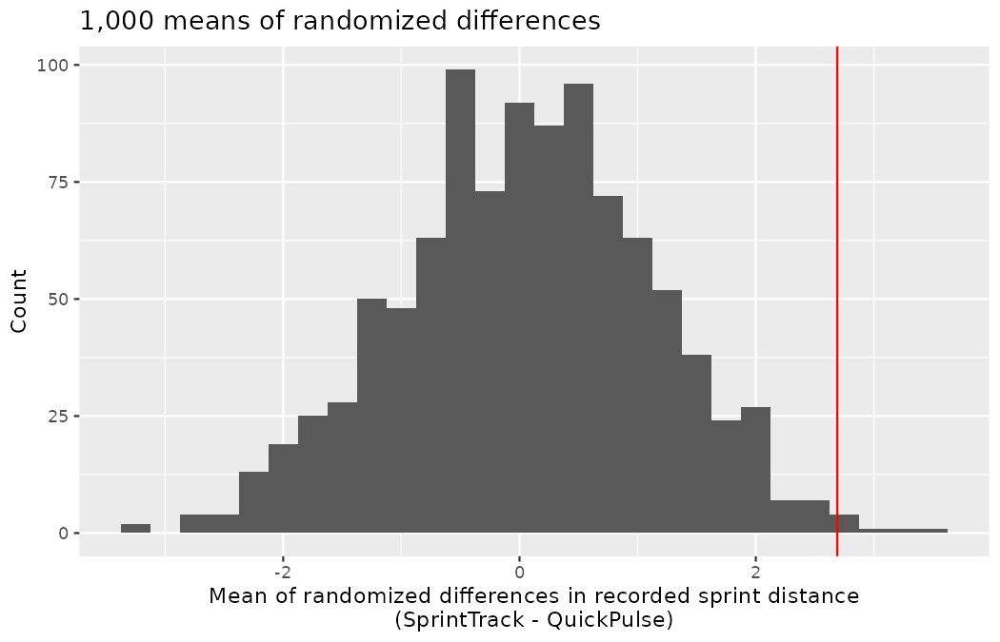
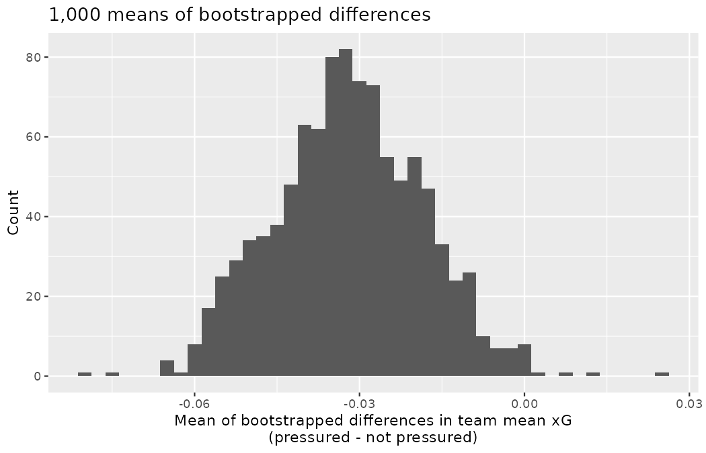
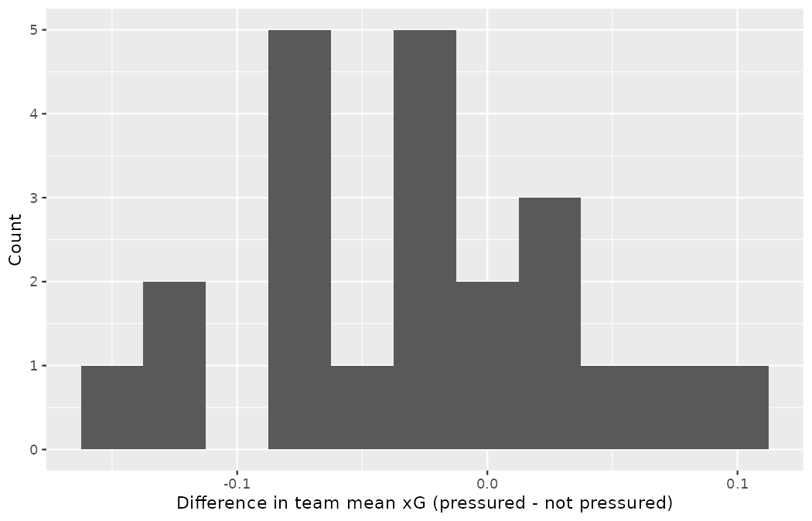

# Inference for comparing paired means {#sec-inference-paired-means}

::: {.chapterintro}
In [Chapter -@sec-inference-two-means] analysis was done to compare the average population value across two different groups.
Recall that one of the important conditions in doing a two-sample analysis is that the two groups are independent.
Here, independence across groups means that knowledge of the observations in one group does not change what we would expect to happen in the other group.
But what happens if the groups are **dependent**?
Sometimes dependency is not something that can be addressed through a statistical method.
However, a particular dependency, **pairing**, can be modeled quite effectively using many of the same tools we have already covered in this text — and, as it happens, pairing is everywhere in a football club: the same player wearing two tracking devices, the same team measured under two match conditions, the same prospect tested before and after a program.
:::

Paired data represent a particular type of experimental structure where the analysis is somewhat akin to a one-sample analysis (see [Chapter -@sec-inference-one-mean]) but has other features that resemble a two-sample analysis (see [Chapter -@sec-inference-two-means]).
As with a two-sample analysis, quantitative measurements are made on each of two different levels of the explanatory variable.
However, because the observational unit is **paired** across the two groups, the two measurements are subtracted such that only the difference is retained.
@tbl-pairedexamples presents some examples of club studies where paired designs arise.

| Observational unit | Comparison groups | Measurement | Value of interest |
|:-------------------|:--------------------------|:---------------------------|:--------------------|
| Academy player | SprintTrack vs QuickPulse vest | recorded sprint distance in one session | difference in distance |
| National team | Under pressure vs not under pressure | mean chance quality (xG) of its shots | difference in mean xG |
| Prospect | Pre-program vs post-program | finishing-test score | difference in score |

: Examples of studies where a paired design is used to measure the difference in the measurement over two conditions. {#tbl-pairedexamples}

::: {.callout-important title="Paired data"}
Two sets of observations are *paired* if each observation in one set has a special correspondence or connection with exactly one observation in the other dataset.
:::

One naming note before we proceed: other fields call this structure a *within-subjects* or *repeated-measures* design — the terms you will meet in the psychology and sports-science literature — and it is the same machinery under any of the names: measurements compared within the very unit that produced them.

It is worth noting that if mathematical modeling is chosen as the analysis tool, paired data inference on the difference in measurements will be identical to the one-sample mathematical techniques described in [Chapter -@sec-inference-one-mean].
However, recall from [Chapter -@sec-inference-one-mean] that with pure one-sample data, the computational tools for hypothesis testing are not easy to implement and were not presented (although the bootstrap was presented as a computational approach for constructing a one-sample confidence interval).
With paired data, the randomization test fits nicely with the structure of the experiment and is presented here.

## Randomization test for the mean paired difference

Jonas Beck's academy is due to renew its GPS-vest contract, and two vendors are bidding: **SprintTrack** and **QuickPulse**.
Both systems report, among many other things, the total sprint distance a player covers in a session — a number that feeds directly into load management and into the athletic profiles Emil Sørensen's scouts attach to academy prospects.
Marta Vidal's question is the practical one: do the two systems even agree?
That is, over the same session, does one vendor systematically record more sprint distance than the other, on average?

Priya Rao designs the comparison so that the devices, not the players, are on trial: 25 academy players each wear *both* systems' sensor pods simultaneously during one training session, in the twin pockets of a standard harness, with which vendor's pod sits in the left or right pocket randomized for each player.
Every pod therefore records the exact same movement by the exact same player on the exact same pitch.
This is a constructed scenario — no vendor shoot-out actually took place — and the seeded code below builds the data so that every number in this section can be reproduced.

### Observed data

The observed data represent 50 sprint-distance readings (in meters): for each of the 25 players, one reading from SprintTrack and one from QuickPulse.
The construction writes the scenario's truth into the code, one row per player: each player's session has its own true workload — and players differ hugely in how much they sprint in a session, so the workloads are drawn with a standard deviation of 50 m around a 310 m center — while each vendor's pod (one column per vendor, alphabetical) reads that same movement with about 3 m of device noise, and SprintTrack's processing pipeline credits a systematic 2 m extra.

```r
library(dplyr)
library(tidyr)
library(readr)
library(ggplot2)
library(infer)

set.seed(2101)
gps_sessions <- tibble(
  player      = paste("player", 1:25),
  workload    = rnorm(25, mean = 310, sd = 50),
  QuickPulse  = round(workload + rnorm(25, mean = 0, sd = 3), 1),
  SprintTrack = round(workload + 2 + rnorm(25, mean = 0, sd = 3), 1)
)

gps_pair25 <- gps_sessions |>
  pivot_longer(c(QuickPulse, SprintTrack),
               names_to = "vendor", values_to = "distance") |>
  select(player, vendor, distance)

round(c(
  xbar_ST = mean(gps_pair25$distance[gps_pair25$vendor == "SprintTrack"]),
  xbar_QP = mean(gps_pair25$distance[gps_pair25$vendor == "QuickPulse"])
), 1)
#> xbar_ST xbar_QP
#>   333.6   330.9
```

The mean sprint distance recorded by SprintTrack was $\bar{x}_{ST} = 333.6$ m and the mean recorded by QuickPulse was $\bar{x}_{QP} = 330.9$ m — the subscripts, as always since @sec-foundations-randomization, simply name the group each sample mean was computed in.
The code below draws box plots of the 50 readings by vendor, with a grey line connecting the two readings that came from the same player.

```r
ggplot(gps_pair25, aes(x = vendor, y = distance, color = vendor)) +
  geom_boxplot(show.legend = FALSE) +
  geom_line(aes(group = player), color = "grey", linewidth = 0.25) +
  geom_point(show.legend = FALSE) +
  labs(x = "GPS vendor", y = "Recorded sprint distance (m)")
```

{fig-alt="Box plots of recorded sprint distance for the QuickPulse and SprintTrack vendors, nearly identical and spanning roughly 288 to 417 m, with near-parallel grey lines connecting the two readings that came from the same player. The spread across players dwarfs any difference between vendors." width=85%}

The two boxes are nearly indistinguishable, and both are enormous relative to the question being asked: the 50 readings run from 287.8 m up to 417.1 m, a 130-metre spread that belongs to the *players* — minutes, drill groups, and positions differ — not to the devices.
The grey pair lines carry the real signal: they are all but parallel, each player's two readings traveling together across the whole range.

The SprintTrack representative looks at the vendor means and says:

> *Over a full session, SprintTrack picks up nearly three metres more of the sprinting than QuickPulse does, on average — our satellite fix is simply better.*

The QuickPulse representative points at the box plots and retorts:

> *The two distributions are practically identical, and player workloads run from under 290 m to over 415 m. Against between-player variation like that, with only 25 players, ordinary GPS noise (a pod losing satellite fix under the main stand, a pocket sitting slightly loose, etc.) could easily be what leads to a 2.7 m difference in average recorded distance.*

We'd like to be able to systematically distinguish between what the SprintTrack representative sees in the means and what the QuickPulse representative sees in the box plots.
Fortunately for us, we have an excellent way to simulate the natural variability that can lead to two readings of the same run coming out different.

### Variability of the statistic

A randomization test will identify whether the gap between the vendor means of the original data could have happened just by chance variability.
As before, we will simulate the variability in the study under the assumption that the null hypothesis is true.
In this study, the null hypothesis is that average recorded sprint distance is the same for SprintTrack and QuickPulse.

-   $H_0: \mu_{diff} = 0,$ the average recorded sprint distance is the same for the two vendors.
-   $H_A: \mu_{diff} \ne 0,$ the average recorded sprint distance is different across the two vendors.

The subscript is new, so take the notation apart before it does any work — the whole family at once, because the four symbols travel together for the rest of this chapter.
Start with the observation itself: for each pair we subtract in a consistent order (here SprintTrack minus QuickPulse) and keep only the difference, so the *difference becomes the variable*.
Then:

-   $\mu_{diff}$ — the letter $\mu$ is the population mean you have used since @sec-explore-numerical; the subscript $diff$ says the quantity being averaged is the within-pair difference. So $\mu_{diff}$ is a *single* population mean — the mean of the differences — not a difference of two separate means $\mu_1 - \mu_2$ like the parameter of @sec-inference-two-means. That distinction is the entire chapter.
-   $\bar{x}_{diff}$ — the familiar sample mean $\bar{x},$ computed on the differences: add up the 25 within-player differences and divide by 25.
-   $s_{diff}$ — the familiar sample standard deviation $s,$ computed on those same differences.
-   $n_{diff}$ — the number of *pairs* (here 25), which is the number of differences. It is not the number of raw measurements, which is $2 \times n_{diff} = 50.$

The observed statistic is the sample mean of the differences:

```r
gps_wide <- gps_pair25 |>
  pivot_wider(id_cols = player, names_from = vendor, values_from = distance) |>
  mutate(diff_distance = SprintTrack - QuickPulse)

round(c(xbar_diff = mean(gps_wide$diff_distance),
        s_diff    = sd(gps_wide$diff_distance)), 2)
#> xbar_diff    s_diff
#>      2.69      4.72
```

On average, SprintTrack credited each player with $\bar{x}_{diff} = 2.69$ m more sprint distance than QuickPulse did for the very same session — though the differences are far from unanimous: 16 of the 25 were positive, 8 negative, and player 3's two pods agreed to the tenth of a metre.
Note also that $\bar{x}_{diff}$ equals the difference of the two vendor means, $333.6 - 330.9,$ up to rounding — averaging the differences and differencing the averages are the same arithmetic.
And set $s_{diff} = 4.72$ m against the box plots above: the *differences* vary seven-fold less than the raw readings (whose standard deviation is about 34 m within each vendor), because subtracting within a player removed the workload spread before the devices' disagreement was measured.
That collapse in variability is the entire case for the paired design, and the rest of the chapter cashes it in.

When observations are paired, the randomization process randomly assigns the vendor label to each of the observed distance values.
Note that in the randomization test for the two-sample mean setting (see @sec-rand2mean) the explanatory variable was *also* randomly assigned to the responses.
The change in the paired setting, however, is that the assignment happens *within* an observational unit (here, a player).
Before enacting the shuffle, say the null hypothesis it enacts out loud, in the style of @sec-foundations-randomization: under $H_0,$ a pair's two readings are *exchangeable* — the vendor labels on any player's two pods could be swapped without changing anything about the world, because both pods recorded the same movement and neither brand added anything of its own.
Swapping a pair's labels is exactly what the randomization performs (equivalently: it flips the sign of that pair's difference, and does nothing else), so the null hypothesis the test actually probes is this stronger exchangeability statement — read practically, *no vendor effect for any player* — of which the on-average claim $\mu_{diff} = 0$ is a consequence.

The seeded code below performs one such shuffle: within each player, the two vendor labels are randomly reassigned — swapped, or left alone — while the two distance readings stay exactly where they are.

```r
set.seed(2102)
gps_shuffle_1 <- gps_pair25 |>
  group_by(player) |>
  mutate(random_vendor = sample(vendor)) |>
  ungroup()
```

The random assignment of group (vendor) happens within a single player: every player still ends up with one reading labeled SprintTrack and one labeled QuickPulse.
@tbl-gps-shuffle-45 shows what happened to players 4 and 5 in this first shuffle: it just so happens that the 4th player's vendor labels were swapped and the 5th player's were not.

| player   | vendor      | distance (m) | random_vendor |
|:---------|:------------|-------------:|:--------------|
| player 4 | SprintTrack |        319.3 | QuickPulse    |
| player 4 | QuickPulse  |        314.4 | SprintTrack   |
| player 5 | SprintTrack |        315.1 | SprintTrack   |
| player 5 | QuickPulse  |        308.3 | QuickPulse    |

: The first within-pair shuffle, seen for two players. The 4th player's labels were randomly swapped; the 5th player's labels randomly stayed as they were. {#tbl-gps-shuffle-45}

Across all 25 players, this particular shuffle swapped 13 pairs and left 12 alone.
The next step in the randomization test is to sort the readings so that each one lines up under its *assigned* label from the randomization, and then to measure the variability *across* the two shuffled groups, just as we did with the original ones:

```r
round(c(
  xbar_STsim1 = mean(gps_shuffle_1$distance[gps_shuffle_1$random_vendor == "SprintTrack"]),
  xbar_QPsim1 = mean(gps_shuffle_1$distance[gps_shuffle_1$random_vendor == "QuickPulse"])
), 1)
#> xbar_STsim1 xbar_QPsim1
#>       332.5       331.9
```

Read the subscripts as built pieces, in the style you have used since @sec-foundations-randomization: the group label $(ST$ or $QP)$ plus $sim1,$ marking a statistic from the first simulated shuffle rather than from the observed data.
Under the shuffled labels, the two "vendors" differ by only $0.6$ m — the pairing is intact, every player still contributes one reading to each group, but most of the systematic gap has vanished, exactly as it should when the labels are assigned by coin flip.

Two more randomizations, each with its own seed, tell the same story:

```r
set.seed(2103)
gps_shuffle_2 <- gps_pair25 |>
  group_by(player) |>
  mutate(random_vendor = sample(vendor)) |>
  ungroup()

round(c(
  xbar_STsim2 = mean(gps_shuffle_2$distance[gps_shuffle_2$random_vendor == "SprintTrack"]),
  xbar_QPsim2 = mean(gps_shuffle_2$distance[gps_shuffle_2$random_vendor == "QuickPulse"])
), 1)
#> xbar_STsim2 xbar_QPsim2
#>       332.1       332.3

set.seed(2104)
gps_shuffle_3 <- gps_pair25 |>
  group_by(player) |>
  mutate(random_vendor = sample(vendor)) |>
  ungroup()

round(c(
  xbar_STsim3 = mean(gps_shuffle_3$distance[gps_shuffle_3$random_vendor == "SprintTrack"]),
  xbar_QPsim3 = mean(gps_shuffle_3$distance[gps_shuffle_3$random_vendor == "QuickPulse"])
), 1)
#> xbar_STsim3 xbar_QPsim3
#>       332.1       332.3
```

The second shuffle swapped 12 pairs, the third 11; each lands the simulated vendor gap at $0.2$ m, this time with QuickPulse nominally on top.
Shuffle after shuffle, the within-pair randomization produces average differences a fraction of the observed $2.69$ m.

::: {.callout-tip title="Check your understanding"}
Why not simply feed the 25 SprintTrack readings and the 25 QuickPulse readings into the two-independent-samples machinery of @sec-inference-two-means?

------------------------------------------------------------------------

Because the two groups are not independent: they contain the same 25 players running the same session, so each SprintTrack reading is tied to exactly one QuickPulse reading.
Ignoring the pairing throws information away — here, nearly all of it.
Players differ enormously in how much they sprint: the 50 readings run from 287.8 m to 417.1 m, and each vendor's 25 readings have a standard deviation of about 34 m, a spread driven by workload, not by the devices.
A two-sample analysis must treat all of that between-player variability as noise: its standard error (recall @sec-math2samp) would be $\sqrt{33.7^2/25 + 33.5^2/25} \approx 9.5$ m, and against that yardstick the observed 2.69 m vendor gap is invisible.
The within-pair difference deletes each player's workload from the comparison entirely, leaving only what the two devices disagree about: $s_{diff} = 4.72$ m, hence a standard error of $4.72/\sqrt{25} \approx 0.94$ m — ten times smaller.
Pairing is not a nicety here; it is the difference between a question these data can answer and one they cannot.
:::

### Observed statistic vs. null statistics

By repeating the randomization process, we can create a distribution of the average of the differences in recorded sprint distance.
The **infer** pipeline below runs 1,000 within-pair shuffles.
The null hypothesis of *paired independence* is exactly the shuffle we performed by hand above: within each pair, the sign of the difference is flipped or kept at random, which is what "the vendor labels don't matter" means once the data are reduced to one difference per player.

::: {.callout-tip title="Check your understanding"}
Player 9's difference is $+4.1$ m (SprintTrack read 310.2, QuickPulse 306.1).
After one within-pair shuffle, what values can this pair's difference take, and with what probabilities?

------------------------------------------------------------------------

Only two: $+4.1$ m if the labels happen to stay put, and $-4.1$ m if they swap — each with probability one-half.
The within-pair shuffle can never change the *magnitude* of a pair's difference, only its sign, and that two-value set is the entire null universe for one pair.
The null distribution below is nothing more exotic than 25 such coin flips at a time, repeated 1,000 times.
:::

```r
set.seed(2105)
gps_null <- gps_pair25 |>
  pivot_wider(id_cols = player, names_from = vendor, values_from = distance) |>
  mutate(diff_distance = SprintTrack - QuickPulse) |>
  specify(response = diff_distance) |>
  hypothesize(null = "paired independence") |>
  generate(1000, type = "permute") |>
  calculate(stat = "mean")

ggplot(gps_null, aes(x = stat)) +
  geom_histogram(binwidth = 0.25) +
  geom_vline(xintercept = 2.69, color = "red") +
  labs(
    x = "Mean of randomized differences in recorded sprint distance\n(SprintTrack - QuickPulse)",
    y = "Count",
    title = "1,000 means of randomized differences"
  )
```

{fig-alt="Histogram of 1,000 means of randomized within-player differences in recorded sprint distance (SprintTrack minus QuickPulse), centered at zero and running from about -3.2 to +3.5 m. A red vertical line marks the observed mean difference of 2.69 m, deep in the right tail with only a handful of simulated values at or beyond it." width=85%}

As expected (because the differences were generated under the null hypothesis), the histogram is centered at zero: the shuffles make no distinction between the vendors, so their average differences fall around zero with random fluctuation.
The 1,000 simulated means run from $-3.21$ to $3.49$ m.
The red line at the observed $\bar{x}_{diff} = 2.69$ m sits deep in the right tail:

```r
gps_null |>
  summarize(
    n_extreme = sum(abs(stat) >= 2.69),
    p_value   = mean(abs(stat) >= 2.69)
  )
#> # A tibble: 1 × 2
#>   n_extreme p_value
#>       <int>   <dbl>
#> 1        12   0.012
```

Only 12 of the 1,000 within-pair shuffles produced an average difference as far from zero as the observed one, in either direction: the p-value is $0.012.$
Note the change of scenery from this book's usual $0/1000$ verdicts: the observed statistic sits *inside* the range of the null draws — coin-flipped labels can, occasionally, manufacture a vendor gap this size from pure device noise — but they manage it barely one shuffle in eighty.
At the customary discernibility level of $\alpha = 0.05,$ we reject $H_0$ and conclude that $\mu_{diff} \ne 0$ — the extra 2.69 m per session that SprintTrack credits is due to more than just measurement noise.

For Marta, the operational reading matters more than the verdict: neither vendor is "wrong" (there is no ground truth on the pitch), but the two systems are *not interchangeable*.
If the academy switches vendors mid-season, every longitudinal sprint profile in the scouting database inherits a systematic 2.7 m-per-session step that has nothing to do with the players — small against a 330 m session, but pointing the same way in every session, for every player.

## Bootstrap confidence interval for the mean paired difference

For both the bootstrap and the mathematical models applied to paired data, the analysis is virtually identical to the one-sample approach given in [Chapter -@sec-inference-one-mean].
The key to working with paired data (for bootstrapping and mathematical approaches) is to consider the measurement of interest to be the difference in measured values across the pair of observations.

### Observed data

Since @sec-explore-categorical, this book has kept returning to shots taken under defensive pressure, and each return has used a different tool.
[Chapter -@sec-foundations-randomization] asked whether pressured shots are *finished* worse; @sec-inference-one-mean tested pressured shots' chance quality against a fixed benchmark; and the machinery of [Chapter -@sec-inference-two-means], applied to the 2022 Men's World Cup, would pool all 238 pressured shots against all 1,256 unpressured ones to compare mean chance quality.
Here is the paired version of that last question, and it is the version a scout comparing *teams* actually needs: for each team, how does the chance quality of its own pressured shots compare with the chance quality of its own unpressured shots?

Each team contributes two measurements — its mean xG under pressure and its mean xG otherwise — and those two measurements form a pair, connected by the team that produced both.
One filter is needed before the pairs are worth computing: a team's "mean pressured xG" built on two or three shots is noise, so we require **at least 5 pressured shots per team**.
The code below states the filter and shows what it costs.

```r
wc2022_shots <- read_csv("data/derived/wc2022_shots.csv")

team_pressure <- wc2022_shots |>
  group_by(team) |>
  summarize(
    n_prs  = sum(under_pressure),
    xg_prs = mean(statsbomb_xg[under_pressure]),
    xg_nop = mean(statsbomb_xg[!under_pressure])
  ) |>
  filter(n_prs >= 5) |>
  mutate(xg_diff = xg_prs - xg_nop)

nrow(team_pressure)
#> [1] 22
```

The filter keeps 22 of the 32 teams (among the ten dropped: Australia, whose 26-shot campaign you dissected in @sec-inference-one-mean, and Spain).
A portion of the dataset is shown in @tbl-teampairsDF.

```r
team_pressure |>
  mutate(across(where(is.double), \(x) round(x, 4))) |>
  head(4)
#> # A tibble: 4 × 5
#>   team      n_prs xg_prs xg_nop xg_diff
#>   <chr>     <int>  <dbl>  <dbl>   <dbl>
#> 1 Argentina    13 0.0622 0.208  -0.146
#> 2 Belgium      10 0.085  0.114  -0.0288
#> 3 Brazil       13 0.103  0.143  -0.0402
#> 4 Canada        9 0.164  0.0944  0.0693
```

| team      | n_prs | xg_prs | xg_nop | xg_diff |
|:----------|------:|-------:|-------:|--------:|
| Argentina |    13 | 0.0622 | 0.2080 | -0.1458 |
| Belgium   |    10 | 0.0850 | 0.1138 | -0.0288 |
| Brazil    |    13 | 0.1028 | 0.1430 | -0.0402 |
| Canada    |     9 | 0.1637 | 0.0944 |  0.0693 |

: Four cases from the `team_pressure` dataset: per-team mean chance quality (xG per shot) under pressure and not, and the within-team difference. {#tbl-teampairsDF}

::: {.callout-note title="Data"}
The `team_pressure` pairs are built from `data/derived/wc2022_shots.csv` (StatsBomb open data) by the code above; rerun it and you will get the identical 22 rows.
:::

Each team has two corresponding chance-quality summaries in the dataset: one for its pressured shots and one for its unpressured shots.
When two sets of observations have this special correspondence, they are said to be **paired**.

Before any resampling, the frame flag that this book's penalty convention demands.
A penalty is the one shot on which defensive pressure is impossible by law, so every penalty in these data sits inside the *unpressured* side of its team's pair — and at a stored chance quality of 0.7835, penalties do not sit quietly:

```r
wc2022_shots |>
  filter(under_pressure) |>
  count(shot_type)
#> # A tibble: 1 × 2
#>   shot_type     n
#>   <chr>     <int>
#> 1 Open Play   238

pens_kept <- wc2022_shots |>
  filter(shot_type == "Penalty", team %in% team_pressure$team)

c(kicks = nrow(pens_kept), teams = n_distinct(pens_kept$team),
  pressured = sum(pens_kept$under_pressure))
#>     kicks     teams pressured
#>        57        15         0

round(mean(pens_kept$statsbomb_xg), 4)
#> [1] 0.7835
```

All 238 pressured shots are open play, while 57 penalty kicks — spread across 15 of our 22 teams — are propping up the unpressured side of those teams' pairs.
Argentina alone took 14 of them, which is much of why its unpressured mean of 0.2080 xG towers over everyone else's.
Per the convention, we will run the full analysis in this all-shots frame first, mirroring the arithmetic exactly, and then recompute every pair on the open-play frame in @sec-mathpaired — and you will want to see both answers before anything reaches a dossier.

### Variability of the statistic

Following the example of bootstrapping the one-sample statistic in @sec-boot1mean, the observed *differences* can be bootstrapped in order to understand the variability of the average difference from sample to sample.
Remember, the differences act as a single value to bootstrap.
That is, the original dataset consists of the 22 values of `xg_diff`, and each resample will also contain 22 differences (some teams repeated, some omitted, through the resampling process) — exactly the procedure applied to the five logged shots in @sec-boot1mean, with a difference per team in place of a chance quality per shot.

```r
obs_diff_mean <- team_pressure |>
  specify(response = xg_diff) |>
  calculate(stat = "mean")

set.seed(2106)
boot_team_diff <- team_pressure |>
  specify(response = xg_diff) |>
  generate(reps = 1000, type = "bootstrap") |>
  calculate(stat = "mean")

ggplot(boot_team_diff, aes(x = stat)) +
  geom_histogram(binwidth = 0.0025) +
  labs(
    x = "Mean of bootstrapped differences in team mean xG\n(pressured - not pressured)",
    y = "Count",
    title = "1,000 means of bootstrapped differences"
  )
```

{fig-alt="Histogram of 1,000 means of bootstrapped within-team differences in mean xG (pressured minus not pressured), roughly symmetric and bell-shaped with the bulk of values between about -0.057 and -0.005." width=85%}

Two 99% confidence intervals for the mean within-team difference in chance quality can be computed from these bootstrapped means.
The bootstrap percentile confidence interval is found from the 0.5 and 99.5 percentiles of the bootstrapped differences:

```r
get_confidence_interval(boot_team_diff, level = 0.99, type = "percentile")
#> # A tibble: 1 × 2
#>   lower_ci upper_ci
#>      <dbl>    <dbl>
#> 1  -0.0648 0.000855
```

::: {.callout-tip title="Check your understanding"}
Using the histogram of bootstrapped differences in means drawn above, estimate the standard error of the mean of the sample differences, $\bar{x}_{diff}.$

------------------------------------------------------------------------

The bulk of the bootstrapped means runs from about $-0.057$ to $-0.005,$ a spread of roughly $0.052.$
Using the empirical rule (with bell-shaped distributions, most observations sit within two standard errors of the center), the standard error of the mean differences is approximately $0.052 / 4 \approx 0.013$ xG.
The standard deviation of the 1,000 bootstrapped means confirms it: $SE_{BS} = 0.0135$ (the bootstrap standard error of @sec-boot1mean, computed with `sd()`).
You might note that the standard error calculation given in @sec-mathpaired is $SE(\bar{x}_{diff}) = s_{diff}/\sqrt{n_{diff}} = 0.0612/\sqrt{22} = 0.0131$ (values from @sec-mathpaired) — very close to the bootstrap approximation.
:::

The bootstrap SE interval is found by computing the SE of the bootstrapped differences $(SE_{\bar{x}_{diff}} = 0.0135)$ and the normal multiplier of $z^{\star} = 2.58$ (the 99% cutoff from @sec-inference-one-prop).
The averaged difference is $\bar{x}_{diff} = -0.0317.$
The 99% confidence interval is $-0.0317 \pm 2.58 \times 0.0135,$ which the code computes without intermediate rounding:

```r
get_confidence_interval(boot_team_diff, level = 0.99, type = "se",
                        point_estimate = obs_diff_mean)
#> # A tibble: 1 × 2
#>   lower_ci upper_ci
#>      <dbl>    <dbl>
#> 1  -0.0664  0.00310
```

The confidence intervals seem to indicate that within a team, pressured shots are, on average, worse chances than unpressured ones, as the large majority of each interval is negative.
However, if the analysis requires a strong degree of certainty — and 99% is a strong degree — the result is not well determined: both the percentile interval and the SE interval poke just past zero (upper bounds of $0.0009$ and $0.0031$ xG), leaving open the possibility that the true mean within-team difference is zero or even slightly positive.
Notice also that the two intervals, built by different constructions from the same resamples, agree closely here — the bootstrap distribution is roughly symmetric and bell-shaped, unlike the clumpy five-shot distributions of @sec-boot1mean, so both constructions are on their home turf.
Whether the evidence clears a less demanding bar is exactly the question for the mathematical model, next.

## Mathematical model for the mean paired difference {#sec-mathpaired}

Thinking about the differences as a single observation on an observational unit changes the paired setting into the one-sample setting.
The mathematical model for the one-sample case is covered in @sec-one-mean-math, and every tool from that section — the $t$-distribution, $df = n - 1,$ the T score — transfers to the differences unchanged.

### Observed data

To analyze paired data, it is often useful to look at the difference in outcomes of each pair of observations.
In the team pressure data, we look at the differences in mean chance quality, represented as the `xg_diff` variable in the dataset.
Here the differences are taken as

$$\text{mean xG under pressure} - \text{mean xG not under pressure}$$

It is important that we always subtract using a consistent order; here the unpressured mean is always subtracted from the pressured mean, so a negative difference means a team's pressured shots are the worse chances.
The first difference shown in @tbl-teampairsDF is computed as $0.0622 - 0.2080 = -0.1458.$
Similarly, the second difference is computed as $0.0850 - 0.1138 = -0.0288,$ and the third is $0.1028 - 0.1430 = -0.0402.$
A histogram of the 22 differences is drawn by the code below.

```r
ggplot(team_pressure, aes(x = xg_diff)) +
  geom_histogram(binwidth = 0.025) +
  labs(
    x = "Difference in team mean xG (pressured - not pressured)",
    y = "Count"
  )
```

{fig-alt="Histogram of the 22 within-team differences in mean xG (pressured minus not pressured), sitting mostly below zero, with Argentina's -0.146 anchoring the left tail and Switzerland's +0.099 the right." width=85%}

The histogram sits mostly below zero — 15 of the 22 teams have negative differences — with Argentina's $-0.1458$ anchoring the left tail and Switzerland's $+0.0992$ the right.

### Variability of the statistic

To analyze a paired dataset, we simply analyze the differences.
@tbl-teampairsSummaryStats provides the data summaries from the team pressure data.
Note that instead of reporting the two chance-quality columns separately, the summary statistics are given as the mean of the differences, the standard deviation of the differences, and the total number of pairs (i.e., differences) — which is to say, as $\bar{x}_{diff},$ $s_{diff},$ and $n_{diff}.$
The parameter of interest is also a single value, $\mu_{diff},$ so we can use the same $t$-distribution techniques we applied in @sec-one-mean-math directly onto the observed differences.

```r
team_pressure |>
  summarize(
    n    = n(),
    mean = round(mean(xg_diff), 4),
    sd   = round(sd(xg_diff), 4)
  )
#> # A tibble: 1 × 3
#>       n    mean     sd
#>   <int>   <dbl>  <dbl>
#> 1    22 -0.0317 0.0612
```

| n   | Mean    | SD     |
|:---:|:-------:|:------:|
| 22  | -0.0317 | 0.0612 |

: Summary statistics for the 22 within-team differences in mean chance quality (xG per shot). {#tbl-teampairsSummaryStats}

::: {.callout-note title="Worked example"}
Set up a hypothesis test to determine whether, on average, there is a difference between a team's chance quality under pressure and its chance quality otherwise.
Also, check the conditions for whether we can move forward with the test using the $t$-distribution.

------------------------------------------------------------------------

We are considering two scenarios:

-   $H_0:$ $\mu_{diff} = 0.$ Within a team, there is no difference between the average chance quality of pressured and unpressured shots.

-   $H_A:$ $\mu_{diff} \neq 0.$ Within a team, there is a difference.

Next, we check the independence and normality conditions.
The 22 pairs are not a random sample — they are every World Cup team that cleared the 5-pressured-shot filter — so, exactly as with Australia's shots in @sec-one-mean-math, the inference is to the *process* that generates team shot profiles at this level, and we treat the 22 teams as independent draws from it; teams do face one another, which pushes gently against independence, but no single match ties all the pairs together.
For normality, $n_{diff} = 22$ is under 30, so we check for clear outliers: the sorted differences run smoothly from $-0.146$ to $0.099,$ and the extremes sit 1.9 and 2.1 standard deviations from the mean — no clear outliers.
With these conditions reasonably satisfied, we can move forward with the $t$-distribution.

And one more check, which no textbook condition list will hand you but this book's penalty convention will: *the two sides of each pair are not measured on the same frame.*
The pressured side of every pair is all open play; the unpressured side of 15 pairs contains penalties at 0.7835 xG.
We will run the mirror analysis on this frame first, then rerun it penalties-out below.
:::

### Observed statistic vs. null statistics

As mentioned previously, the methods applied to a difference will be identical to the one-sample techniques of @sec-one-mean-math.
Therefore, the full hypothesis test framework is presented as worked examples.

::: {.callout-important title="The test statistic for assessing a paired mean is a T"}
The T score is a ratio of how the sample mean difference varies from zero as compared to how the observations vary.

$$T = \frac{\bar{x}_{diff} - 0}{s_{diff}/\sqrt{n_{diff}}}$$

When the null hypothesis is true and the conditions are met, T has a $t$-distribution with $df = n_{diff} - 1.$

Conditions:

-   Independently sampled pairs.
-   Large samples and no extreme outliers.
:::

The capital $T$ is the same test statistic you decomposed in @sec-one-mean-math — how many standard errors the observed value sits from the null value, read against a $t$-distribution — applied to the differences; only the bookkeeping subscript $diff$ is new, and you now own it.

::: {.callout-note title="Worked example"}
Complete the hypothesis test started in the previous Example.

------------------------------------------------------------------------

To compute the test, compute the standard error associated with $\bar{x}_{diff}$ using the standard deviation of the differences $(s_{diff} = 0.0612)$ and the number of differences $(n_{diff} = 22):$

$$SE_{\bar{x}_{diff}} = \frac{s_{diff}}{\sqrt{n_{diff}}} = \frac{0.0612}{\sqrt{22}} \approx 0.0131$$

The test statistic is the T score of $\bar{x}_{diff}$ under the null hypothesis that the true mean difference is 0:

$$T = \frac{\bar{x}_{diff} - 0}{SE_{\bar{x}_{diff}}} = \frac{-0.0317 - 0}{0.0131} \approx -2.43$$

The degrees of freedom are $df = 22 - 1 = 21.$
To visualize the p-value, picture the $t$-distribution with 21 degrees of freedom centered on zero: the p-value is the area in the two tails beyond $\pm 2.43.$
Using statistical software, we find the one-tail area of 0.0121 and double it:

```r
pt(-2.43, df = 21) * 2
#> [1] 0.02415214
```

The p-value is 0.024.
Because the p-value is less than 0.05, we reject the null hypothesis: in the all-shots frame, the data provide statistically discernible evidence that a team's pressured shots differ in average chance quality from its unpressured shots — specifically, that they are worse.
But that italicized frame qualifier is load-bearing, and before this result travels, the convention collects its due.
:::

::: {.callout-tip title="Check your understanding"}
Before running the open-play version, commit to a prediction.
You have watched this reveal twice — the benchmark test of @sec-one-mean-math and the two-sample comparison of @sec-math2samp — and you know that all 57 penalties sit on the *unpressured* side of these pairs.
When they leave the frame, which way should $\bar{x}_{diff}$ move, and roughly how much of the $-0.0317$ should survive?

------------------------------------------------------------------------

Direction: toward zero.
Penalties inflate only `xg_nop`, so removing them can only lower the unpressured means, making every affected difference — and therefore the average — less negative.
Size: expect a collapse, not a trim.
In @sec-one-mean-math the honest benchmark erased roughly four fifths of the pressured-shot "deficit"; in @sec-math2samp the pooled gap of 0.0354 fell to 0.0027 — better than nine tenths gone — and the pairs below share that test's anatomy, penalties stacked on one side only.
If you predicted "an order of magnitude smaller, and the rejection goes with it," the rerun below will read as arithmetic rather than news — which is what a convention is for: it turns surprises into predictions.
:::

Here, as in @sec-chp11-pens-out and @sec-one-mean-math before it, the penalty convention does not merely add a caveat — it changes the verdict.
Strip every dead-ball shot out of the frame (`shot_type == "Open Play"`: no penalties, no direct free kicks, no direct corners) and rebuild the identical pairs with the identical filter:

```r
team_pressure_open <- wc2022_shots |>
  filter(shot_type == "Open Play") |>
  group_by(team) |>
  summarize(
    n_prs  = sum(under_pressure),
    xg_prs = mean(statsbomb_xg[under_pressure]),
    xg_nop = mean(statsbomb_xg[!under_pressure])
  ) |>
  filter(n_prs >= 5) |>
  mutate(xg_diff = xg_prs - xg_nop)

identical(team_pressure$team, team_pressure_open$team)
#> [1] TRUE

team_pressure_open |>
  summarize(
    n    = n(),
    mean = round(mean(xg_diff), 4),
    sd   = round(sd(xg_diff), 4)
  )
#> # A tibble: 1 × 3
#>       n    mean    sd
#>   <int>   <dbl> <dbl>
#> 1    22 -0.0028 0.047
```

The same 22 teams survive the filter, because every pressured shot was open play to begin with: the pressured side of each pair does not move by a single shot.
All the change lands on the unpressured side — Argentina's unpressured mean falls from 0.2080 to 0.1141 once its 14 penalties and 4 direct free kicks and corners leave the frame — and the mean difference collapses from $-0.0317$ to $-0.0028.$
The identical T machinery on the identical hypotheses now gives:

$$T = \frac{-0.0028 - 0}{0.0470/\sqrt{22}} \approx -0.28$$

```r
pt(-0.28, df = 21) * 2
#> [1] 0.7822171
```

Now read the two runs as one exhibit — your prediction from the Check your understanding above, graded — because the *pair*, not either verdict alone, is the finding:

-   **All shots, penalties in:** $\bar{x}_{diff} = -0.0317,$ $T = -2.43,$ p-value $= 0.024.$ Statistically discernible at $\alpha = 0.05;$ a report would have shipped saying teams' pressured chances are worse.
-   **Open play, penalties out:** $\bar{x}_{diff} = -0.0028,$ $T = -0.28,$ p-value $= 0.78.$ Nothing — a within-team gap this size arises from sampling variability alone more than three quarters of the time.

Roughly nine tenths of the "pressure deficit" the first test detected was 57 uncontested kicks from twelve yards, sitting on the unpressured side of 15 pairs.
This is the paired-means installment of a lesson the book has now taught with proportions (@sec-chp11-pens-out) and with a single mean (@sec-one-mean-math): the hypotheses, the machinery, and the arithmetic stood perfectly still while the frame moved the p-value from 0.024 to 0.78.
Name the frame, defend the filter, and never let a penalty-tilted comparison travel with only one of its two answers.

Recall that the margin of error is defined by the standard error.
The margin of error for $\bar{x}_{diff}$ can be directly obtained from $SE(\bar{x}_{diff}).$

::: {.callout-important title="Margin of error for $\bar{x}_{diff}$"}
The margin of error is $t^\star_{df} \times s_{diff}/\sqrt{n_{diff}}$ where $t^\star_{df}$ is calculated from a specified percentile on the $t$-distribution with *df* degrees of freedom.
:::

::: {.callout-note title="Worked example"}
Create a 95% confidence interval for the average within-team difference in chance quality between pressured and unpressured shots, in the all-shots frame.

------------------------------------------------------------------------

Conditions have already been verified and the standard error computed in a previous Example.
To find the confidence interval, identify $t^{\star}_{21}$ using statistical software $(t^{\star}_{21} = 2.08),$ and plug it, the point estimate, and the standard error into the confidence interval formula:

$$
\begin{aligned}
\text{point estimate} \ &\pm \ t^{\star}_{21} \ \times \ SE \\
-0.032 \ &\pm \ 2.08 \ \times \ 0.013 \\
(-0.059 \ &, \ -0.005)
\end{aligned}
$$

```r
xbar_diff <- mean(team_pressure$xg_diff)
se_diff   <- sd(team_pressure$xg_diff) / sqrt(22)

round(c(xbar_diff - qt(0.975, df = 21) * se_diff,
        xbar_diff + qt(0.975, df = 21) * se_diff), 4)
#> [1] -0.0588 -0.0045
```

We are 95% confident that — in the all-shots frame, penalties included on the unpressured side — a team's pressured shots average between 0.0045 and 0.0588 xG *less* per shot than its unpressured shots.
Run the same formula on the open-play pairs and the 95% interval is $(-0.0237, 0.0180),$ straddling zero: the interval version of the verdict flip above.
Consistency check, as in @sec-foundations-mathematical: the all-shots 95% interval excludes 0 and the all-shots p-value $(0.024)$ is below 0.05, while the 99% bootstrap intervals of the previous section crossed 0 and $0.024 > 0.01$ — every tool is telling the same story about the same frame.
:::

::: {.callout-tip title="Check your understanding"}
In the all-shots frame we found discernible evidence that, within a team, pressured shots are worse chances on average.
Should a Northbridge opposition report therefore apply a flat "pressure discount" to every team's shot profile?

------------------------------------------------------------------------

No — for two reasons the interval alone cannot show.
First, the average conceals the pairs: 7 of the 22 teams (Canada among them, at $+0.0693)$ generated *better* chances under pressure than otherwise, so a flat discount would misread nearly a third of the teams; examine the distribution of differences, not just $\bar{x}_{diff}.$
Second, the frame: the open-play rerun shows the discernible all-shots gap was mostly penalties, and an opposition report that quotes the pens-in number without the pens-out number is reporting the tournament's foul count, not its shooting under pressure.
The honest dossier shows both frames and the per-team spread.
:::

A small note on the power of the paired t-test (recall the discussion of power in @sec-pow).
It turns out that the paired t-test given here is often more powerful than the independent t-test discussed in @sec-math2samp.
The reason is visible in these data.
A pooled two-sample comparison of chance quality puts all 238 pressured shots in one pile and all 1,256 unpressured ones in the other:

```r
round(c(
  prs = mean(wc2022_shots$statsbomb_xg[wc2022_shots$under_pressure]),
  nop = mean(wc2022_shots$statsbomb_xg[!wc2022_shots$under_pressure])
), 4)
#>    prs    nop
#> 0.0961 0.1315
```

That comparison must carry all the *between-team* differences inside its noise, and worse, inside its composition: the unpressured pile is disproportionately filled by high-volume attacking sides (97 of Argentina's shots are in it, 14 of them penalties), so team quality and shot-type mix are tangled into the very piles being compared, exactly the lurking-variable pattern of @sec-data-design.
Pairing removes between-team quality differences by construction: each team is compared only with itself, each team counts exactly once rather than in proportion to its shot volume, and whatever makes Argentina's chances generally fatter than Canada's subtracts out of the pair before the analysis begins.
The price is twofold: the paired analysis answers a slightly different question (the average *within-team* gap, teams weighted equally, rather than the tournament-wide shot-level gap), and — as with the GPS vests, where a 130-metre spread in player workloads would have buried the 2.7 m vendor gap without the twin-pocket harness — depending on how the data are collected, we don't always have a mechanism for pairing the data and reducing the inherent variability across observations.

## Chapter review {#sec-chp21-review}

### Summary

Like the two independent sample procedures in [Chapter -@sec-inference-two-means], the paired difference analysis can be done using a $t$-distribution.
The randomization test applied to the paired differences is slightly different, however.
Note that when randomizing under the paired setting, each null statistic is created by randomly assigning the group to a numerical outcome **within** the individual observational unit — the vendor label within the player, never across players.
The procedure for creating a confidence interval for the paired difference is almost identical to the confidence intervals created in [Chapter -@sec-inference-one-mean] for a single mean: reduce each pair to its difference, and the paired problem *is* the one-sample problem.

The chapter also paid the penalty convention its now-standard visit: the within-team pressure gap that was statistically discernible with penalties in the frame $(T = -2.43,$ $p = 0.024)$ dissolved entirely on open play $(T = -0.28,$ $p = 0.78),$ because penalties can only ever sit on the unpressured side of a pair.
The pair of verdicts, not either one alone, is the finding.

| Question | Answer |
|:---------------------------------------|:------------------------------|
| What is the statistic? | The mean of the within-pair differences, $\bar{x}_{diff}$ — a single sample mean, not a difference of two independent means. |
| How does the randomization test differ from @sec-rand2mean? | Labels are shuffled *within* each observational unit (equivalently, the sign of each difference is flipped at random), so every unit keeps one observation in each group. |
| How are bootstrap CIs built? | Resample the $n_{diff}$ differences with replacement and apply the one-sample machinery of @sec-boot1mean to them. |
| What is the test statistic? | $T = (\bar{x}_{diff} - 0)/(s_{diff}/\sqrt{n_{diff}}),$ read against the $t$-distribution with $df = n_{diff} - 1.$ |
| When does pairing beat pooling? | When each unit can be measured under both conditions: differences subtract out between-unit variability (player workload, team quality) that a pooled two-sample analysis must carry as noise. |

: Summary of inference for a paired mean difference. {#tbl-chp21-summary}

### Terms

The terms introduced in this chapter are presented below, alphabetized.
If you're not sure what some of these terms mean, we recommend you go back in the text and review their definitions.
You should be able to easily spot them as **bolded text**.

|  |  |  |
|:-----------------------|:-----------------------|:----------------------|
| bootstrap CI paired difference | paired difference CI | T score paired difference |
| paired data | paired difference t-test |  |

: Terms introduced in this chapter. {#tbl-terms-chp-21}

## Exercises {#sec-chp21-exercises}

Answers to odd-numbered exercises can be found in [Appendix -@sec-exercise-solutions-21]. Final answers to the even-numbered exercises are in [Appendix -@sec-appendix-even-answers].

::: {.exercises}

:::

------------------------------------------------------------------------

Adapted from *Introduction to Modern Statistics* by Çetinkaya-Rundel & Hardin (CC BY-SA 4.0); this adaptation is likewise CC BY-SA 4.0. Match data: StatsBomb open data.
