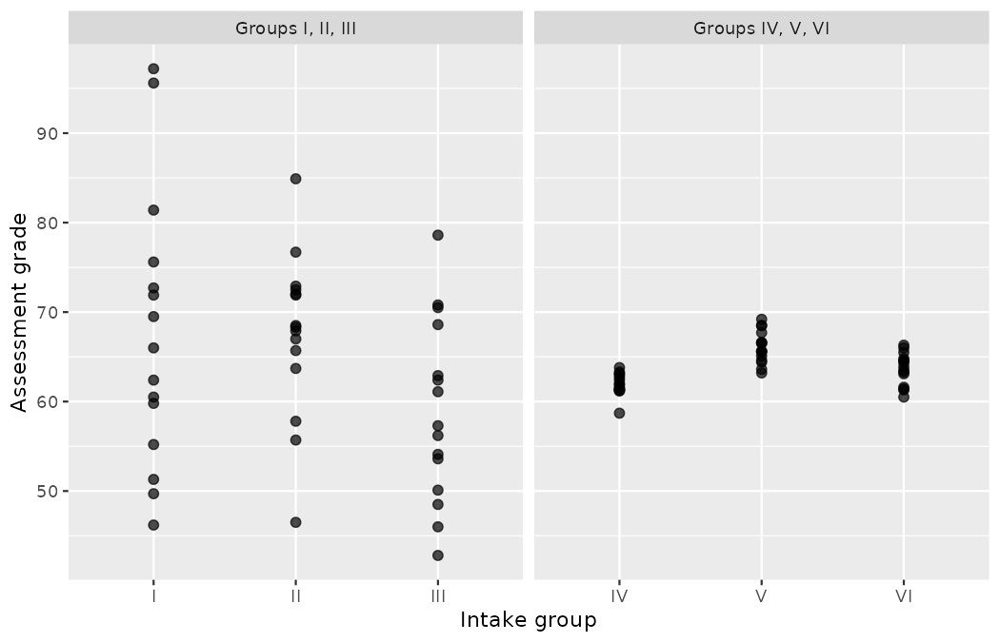
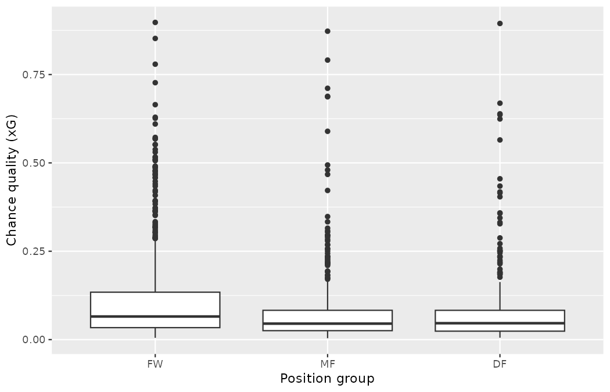
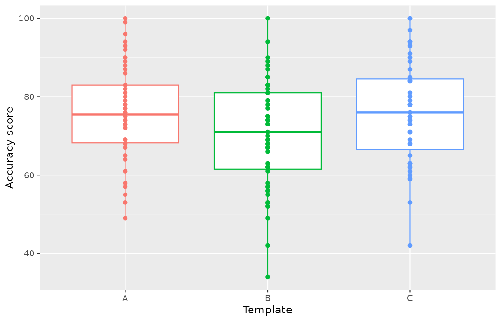
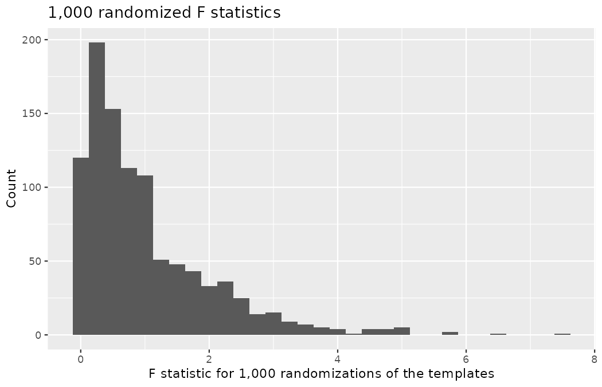
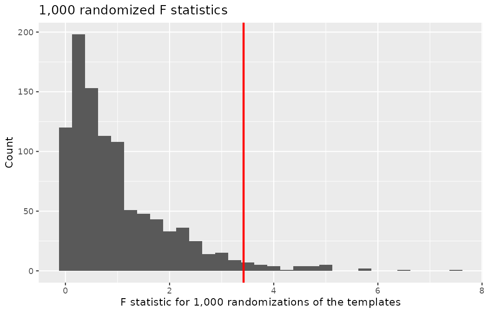
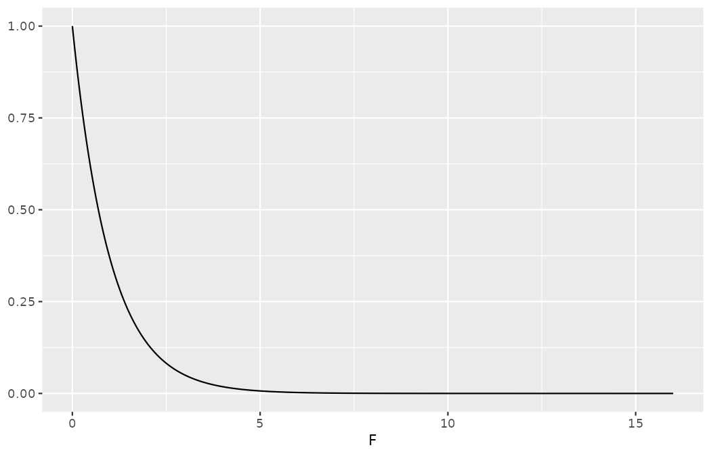
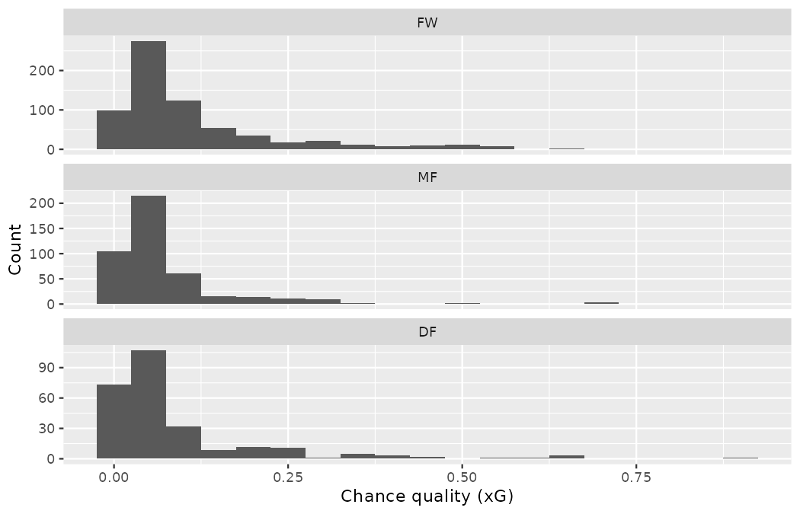

# Inference for comparing many means {#sec-inference-many-means}

::: {.chapterintro}
In [Chapter -@sec-inference-two-means] analysis was done to compare the average population value across two different groups.
An important aspect of the analysis was to look at the difference in sample means as an estimate for the difference in population means.
When comparing more than two groups, the difference (i.e., subtraction) will not fully capture the nuance in variation across the three or more groups.
As with two groups, the research question will focus on whether the group membership is independent of the numerical response variable.
Here, independence across groups means that knowledge of the observations in one group does not change what we would expect to happen in the other groups.
In this chapter we focus on a new statistic which incorporates differences in means across more than two groups.
Although the ideas in this chapter are quite similar to the t-test, they have earned themselves their own name: **AN**alysis **O**f **VA**riance, or ANOVA.
:::

Sometimes we want to compare means across many groups: chance quality across the three position groups, report accuracy across three templates, intake grades across six assessment centres.
We might initially think to do pairwise comparisons.
For example, if there were three groups, we might be tempted to compare the first mean with the second, then with the third, and then finally compare the second and third means for a total of three comparisons.
However, this strategy can be treacherous.
If we have many groups and do many comparisons, it is likely that we will eventually find a difference just by chance, even if there is no difference in the populations.
Instead, we should apply a holistic test to check whether there is evidence that at least one pair of groups are in fact different, which is where **ANOVA** saves the day.

In this chapter, we will learn a new method called **analysis of variance (ANOVA)** and a new test statistic called an $F$-statistic (which we will introduce in our discussion of mathematical models).
ANOVA uses a single hypothesis test to check whether the means across many groups are equal:

-   $H_0:$ The mean outcome is the same across all groups, i.e., $\mu_1 = \mu_2 = \cdots = \mu_k$ where $\mu_j$ represents the mean of the outcome for observations in category $j.$
-   $H_A:$ At least one mean is different.

Take the null hypothesis apart before using it, since two familiar symbols return here wearing new subscripts.
The letter $\mu$ is the population mean you have carried since @sec-explore-numerical; the subscript $j$ is a generic group label, so $\mu_j$ reads "the population mean of group $j$" — the same group-labelling convention we attached to $\hat{p}$ in @sec-foundations-randomization and to $\mu_1 - \mu_2$ in @sec-inference-two-means.
The letter $k$ counts the groups, so $j$ runs over $1, 2, \dots, k.$
(Note the reuse: in @sec-model-mlr, $k$ counted predictors in a regression; here it counts groups.
Both are simply counts, but keep track of which is meant.)
With two groups, $k = 2,$ and the null hypothesis $\mu_1 = \mu_2$ is exactly the null of @sec-inference-two-means; ANOVA is the generalization to any $k.$

Generally we must check three conditions on the data before performing ANOVA:

-   the observations are independent within and between groups,
-   the responses within each group are nearly normal, and
-   the variability across the groups is about equal.

When the three technical conditions are met, we may perform an ANOVA to determine whether the data provide convincing evidence against the null hypothesis that all the $\mu_j$ are equal.

::: {.callout-note title="Worked example"}
Northbridge United's academy runs its regional intake assessment at three centres — North, Central, and South — because of high demand.
Every trialist sits the same technical battery, graded out of 100.
Jonas Beck would like to determine whether there are substantial differences in the intake grades produced by the three centres.
Describe appropriate hypotheses to determine whether there are any differences between the three centres.

------------------------------------------------------------------------

The hypotheses may be written in the following form:

-   $H_0:$ The average grade is identical at all centres, $\mu_N = \mu_C = \mu_S$. Assuming each centre grades equally strictly and draws comparable trialists, the observed differences in average grades are due to chance.
-   $H_A:$ The average grade varies by centre. We would reject the null hypothesis in favor of the alternative hypothesis if there were larger differences among the centre averages than what we might expect from chance alone.
:::

Strong evidence favoring the alternative hypothesis in ANOVA is described by unusually large differences among the group means.
We will soon learn that assessing the variability of the group means relative to the variability among individual observations within each group is key to ANOVA's success.

To train your eye before any formulas arrive, the code below fabricates six groups of intake grades — a constructed illustration, not real data, so the geometry is fully under our control.
Groups I, II, and III are built with modest differences between their centre grades but very noisy assessment environments; groups IV, V, and VI are built with the *same* modest differences but tight, consistent grading.

```r
library(dplyr)
library(readr)
library(ggplot2)
library(infer)

set.seed(2201)
intake_toy <- tibble(
  group = factor(rep(c("I", "II", "III", "IV", "V", "VI"), each = 15),
                 levels = c("I", "II", "III", "IV", "V", "VI")),
  grade = c(rnorm(15, 62, 14), rnorm(15, 66, 14), rnorm(15, 64, 14),
            rnorm(15, 62, 1.8), rnorm(15, 66, 1.8), rnorm(15, 64, 1.8)) |>
    round(1)
)

intake_toy |>
  group_by(group) |>
  summarize(n = n(), mean = mean(grade), sd = sd(grade))
#> # A tibble: 6 × 4
#>   group     n  mean    sd
#>   <fct> <int> <dbl> <dbl>
#> 1 I        15  67.7 15.4
#> 2 II       15  67.5  9.16
#> 3 III      15  58.9 10.2
#> 4 IV       15  61.9  1.23
#> 5 V        15  66.1  1.81
#> 6 VI       15  63.6  1.79

intake_toy |>
  mutate(set = if_else(group %in% c("I", "II", "III"),
                       "Groups I, II, III", "Groups IV, V, VI")) |>
  ggplot(aes(x = group, y = grade)) +
  geom_point(alpha = 0.7, size = 2) +
  facet_wrap(~set, nrow = 1, scales = "free_x") +
  labs(x = "Intake group", y = "Assessment grade")
```

{fig-alt="Side-by-side dot plots of fabricated intake grades. In the first panel the grades within groups I, II, and III sprawl across thirty points or more and the three clouds overlap almost completely; in the second panel groups IV, V, and VI are tight columns a few grade-points tall sitting at visibly different heights." width=85%}

The side-by-side dot plots show two very different pictures.
In the first panel, the grades within each of groups I, II, and III sprawl across thirty points or more, and the three clouds overlap almost completely.
In the second panel, each of groups IV, V, and VI is a tight column of points a few grade-points tall, and the columns sit at visibly different heights.

::: {.callout-note title="Worked example"}
Examine the dot plots drawn above.
Compare groups I, II, and III.
Can you visually determine if the differences in the group centers is unlikely to have occurred if there were no differences in the groups?
Now compare groups IV, V, and VI.
Do these differences appear to be unlikely to have occurred if there were no differences in the groups?

------------------------------------------------------------------------

Any real difference in the means of groups I, II, and III is difficult to discern, because the data within each group are very volatile relative to any differences in the average outcome.
On the other hand, it appears there are differences in the centers of groups IV, V, and VI.
For instance, group V appears to have a higher mean than that of the other two groups.
Investigating groups IV, V, and VI, we see the differences in the groups' centers are noticeable because those differences are large *relative to the variability in the individual observations within each group*.
:::

Hold on to that comparison — "differences between the group centers, *relative to* the variability within the groups" — because it is precisely the ratio the $F$-statistic will formalize later in this chapter, and we will return to these six toy groups to check that the formula agrees with your eye.

## Case study: chance quality by position group

We would like to discern whether there are real differences between the chance quality of the shots taken by players in different position groups: forwards (FW), midfielders (MF), and defenders (DF).
We will use the book's workhorse dataset, the 1,494 shots of the 2022 Men's World Cup, and the measure of chance quality will be `statsbomb_xg` — the outcome variable for this chapter.
The position groups are derived from the detailed `position` string using the mapping defined once in @sec-explore-categorical and reused verbatim ever since.

```r
wc2022_shots <- read_csv("data/derived/wc2022_shots.csv")

wc_pos <- wc2022_shots |>
  mutate(
    pos_group = case_when(
      position == "Goalkeeper" ~ "GK",
      grepl("Back", position) ~ "DF",
      grepl("Midfield", position) ~ "MF",
      .default = "FW"
    )
  )

wc_pos |>
  count(pos_group)
#> # A tibble: 3 × 2
#>   pos_group     n
#>   <chr>     <int>
#> 1 DF          276
#> 2 FW          732
#> 3 MF          486
```

No goalkeeper took a shot at this tournament — the `GK` level of the mapping comes back empty, so there is nothing to drop (recall that at the 2025 Women's Euro the mapping caught two goalkeeper shots, both penalties, which @sec-explore-categorical set aside).
We fix the factor ordering and look at six of the 1,494 cases in @tbl-wc-pos-six; the variables carried forward are described in @tbl-wc-pos-vars.

```r
wc_pos <- wc_pos |>
  mutate(pos_group = factor(pos_group, levels = c("FW", "MF", "DF")))

wc_pos |>
  arrange(player) |>
  select(player, team, pos_group, statsbomb_xg, goal) |>
  slice_head(n = 6)
#> # A tibble: 6 × 5
#>   player            team      pos_group statsbomb_xg goal
#>   <chr>             <chr>     <fct>            <dbl> <lgl>
#> 1 Aaron Mooy        Australia MF             0.0392  FALSE
#> 2 Aaron Ramsey      Wales     MF             0.0254  FALSE
#> 3 Abdelhamid Sabiri Morocco   MF             0.0221  FALSE
#> 4 Abdelhamid Sabiri Morocco   MF             0.0971  FALSE
#> 5 Abdelhamid Sabiri Morocco   MF             0.00420 FALSE
#> 6 Abdelhamid Sabiri Morocco   MF             0.784   TRUE
```

| player            | team      | pos_group | statsbomb_xg | goal  |
|:------------------|:----------|:----------|-------------:|:------|
| Aaron Mooy        | Australia | MF        |       0.0392 | FALSE |
| Aaron Ramsey      | Wales     | MF        |       0.0254 | FALSE |
| Abdelhamid Sabiri | Morocco   | MF        |       0.0221 | FALSE |
| Abdelhamid Sabiri | Morocco   | MF        |       0.0971 | FALSE |
| Abdelhamid Sabiri | Morocco   | MF        |       0.0042 | FALSE |
| Abdelhamid Sabiri | Morocco   | MF        |       0.7835 | TRUE  |

: Six cases and the variables carried forward from the `wc2022_shots` data frame. {#tbl-wc-pos-six}

| Variable       | Description                                                          |
|:---------------|:---------------------------------------------------------------------|
| `player`       | Shooter's name                                                        |
| `team`         | Shooter's national team                                               |
| `pos_group`    | Position group derived from `position` (FW, MF, DF)                   |
| `statsbomb_xg` | Chance quality (xG): the modeled probability the shot becomes a goal  |
| `goal`         | Whether the shot was scored (logical)                                 |

: Variables and their descriptions for the position-group analysis. {#tbl-wc-pos-vars}

The sixth row already raises the question this book has trained you to ask before any headline comparison: *which shots are in the frame?*
That 0.784 is the stored penalty value from @sec-data-applications — Sabiri's converted kick against Spain — and penalties are exactly the kind of shot that can tilt a comparison of position groups:

```r
wc_pos |>
  count(shot_type)
#> # A tibble: 4 × 2
#>   shot_type     n
#>   <chr>     <int>
#> 1 Corner        2
#> 2 Free Kick    46
#> 3 Open Play  1382
#> 4 Penalty      64

wc_pos |>
  filter(shot_type == "Penalty") |>
  group_by(pos_group) |>
  summarize(kicks = n(), mean_xg = mean(statsbomb_xg))
#> # A tibble: 3 × 3
#>   pos_group kicks mean_xg
#>   <fct>     <int>   <dbl>
#> 1 FW           33   0.784
#> 2 MF           22   0.784
#> 3 DF            9   0.784
```

The 64 penalty kicks are concentrated by position — 33 to forwards, 22 to midfielders, only 9 to defenders — and every one of them carries the identical xG of 0.7835, a value five to ten times a typical open-play chance.
Mixing them in would plant a spike of identical extreme values inside each group, in unequal doses.
Per this book's penalty convention, we state a filter and defend it: the question "do position groups differ in the quality of chances they *get themselves into*?" is an open-play question, so the analysis runs on the 1,382 open-play shots, `shot_type == "Open Play"` — the same frame @sec-chp11-observational and @sec-chp11-pens-out settled on for the pressure test — and, as the convention requires, we will run the penalties-in analysis alongside it when we reach the ANOVA table, because the *contrast between the two frames* turns out to teach this chapter's central formula.

```r
wc_open <- wc_pos |>
  filter(shot_type == "Open Play")
```

::: {.callout-tip title="Check your understanding"}
The null hypothesis under consideration is the following: $\mu_{FW} = \mu_{MF} = \mu_{DF}.$
Write the null and corresponding alternative hypotheses in plain language.

------------------------------------------------------------------------

$H_0:$ The average open-play chance quality is equal across the three position groups.
$H_A:$ The average open-play chance quality varies across some (or all) position groups.
:::

::: {.callout-note title="Worked example"}
The shooters have been divided into three groups: forwards (FW), midfielders (MF), and defenders (DF).
What would be an appropriate point estimate of the average open-play chance quality for forwards, $\mu_{FW}$?

------------------------------------------------------------------------

A good estimate of the average chance quality for forwards would be the sample mean of `statsbomb_xg` for just those open-play shots taken by forwards:

```r
wc_open |>
  filter(pos_group == "FW") |>
  summarize(x_bar_FW = mean(statsbomb_xg))
#> # A tibble: 1 × 1
#>   x_bar_FW
#>      <dbl>
#> 1    0.115
```

That is, $\bar{x}_{FW} = 0.115.$
:::

## Randomization test for comparing many means {#sec-randANOVA}

@tbl-wc-pos-summary provides summary statistics for each group, and the code below draws side-by-side box plots of chance quality by position group.
Notice that the variability appears to be approximately constant across groups; nearly constant variance across groups is an important assumption that must be satisfied before we consider the ANOVA approach.

```r
wc_open |>
  group_by(pos_group) |>
  summarize(n = n(), mean = mean(statsbomb_xg), sd = sd(statsbomb_xg))
#> # A tibble: 3 × 4
#>   pos_group     n   mean    sd
#>   <fct>     <int>  <dbl> <dbl>
#> 1 FW          678 0.115  0.133
#> 2 MF          443 0.0781 0.107
#> 3 DF          261 0.0903 0.126

ggplot(wc_open, aes(x = pos_group, y = statsbomb_xg)) +
  geom_boxplot() +
  labs(x = "Position group", y = "Chance quality (xG)")
```

{fig-alt="Side-by-side box plots of open-play chance quality (xG) by position group. All three boxes sit low with long upper whiskers and scattered high-xG outliers, overlapping substantially, though the forwards' box and median sit visibly above the midfielders'." width=85%}

| Position group | n   | Mean   | SD    |
|:---------------|:---:|:------:|:-----:|
| FW             | 678 | 0.115  | 0.133 |
| MF             | 443 | 0.078  | 0.107 |
| DF             | 261 | 0.090  | 0.126 |

: Summary statistics of open-play chance quality (xG), split by position group. {#tbl-wc-pos-summary}

The box plots sit low — the median xG in every group is under 0.07 — with long upper whiskers and a scatter of high-xG outliers in each group, as xG always produces (the right skew you have known since @sec-explore-categorical).
The boxes overlap substantially, but the forwards' box and median sit visibly above the midfielders'.
With hundreds of observations per group, the outliers are not extreme enough to have an impact on the calculations, so they are not a concern for moving forward with the analysis.

::: {.callout-note title="Worked example"}
The largest difference between the sample means is between the forward and the midfielder groups.
Consider again the original hypotheses:

-   $H_0:$ $\mu_{FW} = \mu_{MF} = \mu_{DF}$
-   $H_A:$ The average open-play chance quality $(\mu_j)$ varies across some (or all) position groups.

Why might it be inappropriate to run the test by simply estimating whether the difference of $\mu_{FW}$ and $\mu_{MF}$ is "statistically discernible" at a 0.05 discernibility level?

------------------------------------------------------------------------

The primary issue here is that we are inspecting the data before picking the groups that will be compared.
It is inappropriate to examine all data by eye (informal testing) and only afterwards decide which parts to formally test.
This is called **data snooping** or **data fishing**.
Naturally, we would pick the groups with the large differences for the formal test, and this would lead to an inflation in the Type I error rate — the sign-a-dud error of @sec-foundations-decision-errors.
To understand inflated Type I error rates better, we do not need a thought experiment: our own tournament provides the demonstration.
:::

Suppose Emil Sørensen, scanning the tournament, asks not about three position groups but about all 32 squads: which teams generated the best and worst chances per shot?
Eyeballing a league table of mean open-play xG across 32 squads is exactly the informal testing described above, and with so many groups we are guaranteed to find a few that look rather different from each other.

```r
team_xg <- wc_open |>
  group_by(team) |>
  summarize(shots = n(), mean_xg = mean(statsbomb_xg)) |>
  arrange(desc(mean_xg))

team_xg |>
  slice(c(1:3, 30:32))
#> # A tibble: 6 × 3
#>   team        shots mean_xg
#>   <chr>       <int>   <dbl>
#> 1 Switzerland    36  0.169
#> 2 England        57  0.122
#> 3 Netherlands    42  0.117
#> 4 Qatar          20  0.0704
#> 5 Wales          22  0.0638
#> 6 Australia      26  0.0607
```

The full table has 32 rows; shown here are its two ends.
Switzerland tops the table at 0.169 xG per open-play shot; Australia sits at the bottom with the 0.0607 you already met in @sec-inference-one-mean.
The gap looks enormous, and if we now "test" it with the two-sample machinery of @sec-inference-two-means, the arithmetic obliges:

```r
t.test(statsbomb_xg ~ team,
       data = wc_open |> filter(team %in% c("Australia", "Switzerland")))
#>
#> 	Welch Two Sample t-test
#>
#> data:  statsbomb_xg by team
#> t = -3.0314, df = 42.605, p-value = 0.00413
#> alternative hypothesis: true difference in means between group Australia and group Switzerland is not equal to 0
#> 95 percent confidence interval:
#>  -0.17956480 -0.03607217
#> sample estimates:
#>   mean in group Australia mean in group Switzerland
#>                 0.0606989                 0.1685174
```

One line of that printout deserves a note before we go further: `df = 42.605` is fractional because software uses the Welch–Satterthwaite approximation named in @sec-math2samp; our hand shortcut would take $\min(36, 26) - 1 = 25$ — same test, deliberately more conservative accounting.

A p-value of 0.004: surely decisive?
It is not, and the seeded simulation below shows why.
We build a world in which the null hypothesis is true *by construction* — the 1,382 open-play shots keep their xG values, but the team labels are shuffled, so no squad genuinely differs from any other.
In each of 1,000 such worlds we behave exactly as we just did: scan all 32 group means, pick out the highest and lowest, and run a two-sample t-test on that eyeballed extreme pair.

```r
set.seed(2203)
snoop_pvals <- replicate(1000, {
  shuffled <- wc_open |> mutate(team = sample(team))
  team_means <- shuffled |>
    group_by(team) |>
    summarize(mean_xg = mean(statsbomb_xg))
  extremes <- c(team_means$team[which.max(team_means$mean_xg)],
                team_means$team[which.min(team_means$mean_xg)])
  t.test(statsbomb_xg ~ team,
         data = filter(shuffled, team %in% extremes))$p.value
})

mean(snoop_pvals < 0.05)
#> [1] 0.778
```

In 778 of 1,000 worlds where *no team differs from any other*, the snooping procedure produced a p-value below 0.05.
A procedure advertised as making Type I errors 5% of the time makes them 78% of the time once the data are allowed to choose which pair gets tested.
The textbook version of this cautionary tale imagines an elementary school measuring aptitude across 20 randomly assigned classes; with our 32 squads the trap is even deeper, because the more groups you scan, the further apart the most extreme pair will drift by chance alone.
While we might only formally test the difference for one pair of squads, we informally evaluated the other thirty by eye before choosing the most extreme cases for a comparison — and the p-value of the formal test knows nothing about that informal scan.

::: {.callout-tip title="Check your understanding"}
Suppose Emil had *pre-registered* a single comparison before the tournament — say, Switzerland versus Australia, named in advance for footballing reasons — and then run the same t-test at $\alpha = 0.05.$
In a world where the null hypothesis is true, roughly what fraction of such pre-named tests would reject?

------------------------------------------------------------------------

About 5% — that is exactly what $\alpha$ promises, as you saw in @sec-foundations-randomization.
The 77.8% rejection rate in the simulation is not a defect of the t-test: it is the price of letting the data nominate the comparison.
The entire inflation comes from scanning 32 group means first and testing the winner and loser of that scan.
:::

::: {.callout-important title="One usable correction: Bonferroni"}
The cure this chapter builds is a single holistic test with no peeking privileges.
But sometimes a department legitimately needs several comparisons, and one correction is simple enough to use immediately: if you will test $m$ comparisons — all $m$ pre-registered before the data are seen — and want the *family* of tests, taken together, to commit a Type I error at rate $\alpha,$ then test each individual comparison at level $\alpha / m.$
This is the *Bonferroni correction*, and its arithmetic doubles as a price list.
One pre-named pair of squads is $m = 1$: test at $0.05.$
Testing every pair among the 32 squads — the fishing expedition the simulation above exposed — would be $m = 32 \times 31 / 2 = 496$ comparisons, demanding $\alpha = 0.05 / 496 \approx 0.0001$ per pair.
The eyeballed Switzerland–Australia p-value of $0.004,$ so decisive-looking against $0.05,$ does not survive the bar its own selection procedure implies — which is the honest price of fishing, now in writing.
One caveat: Bonferroni is deliberately conservative, buying its Type I control by giving up power as $m$ grows, and sharper multiple-comparison tools exist in a later course — see @sec-appendix-further for pointers.
:::

The contrast between $\bar{x}_{FW} = 0.115$ and $\bar{x}_{MF} = 0.078$ in @tbl-wc-pos-summary tempts us into the same trap: we noticed that gap *because* it is the biggest of the three.
What we need is a single holistic test that treats all the groups symmetrically, with no peeking privileges.

### Observed data

In the next section we will learn how to use the $F$ statistic to test whether observed differences in sample means could have happened just by chance even if there was no difference in the respective population means.

The method of analysis of variance in this context focuses on answering one question: is the variability in the sample means so large that it seems unlikely to be from chance alone?
This question is different from earlier testing procedures since we will *simultaneously* consider many groups, and evaluate whether their sample means differ more than we would expect from natural variation.
We call this variability the **mean square between groups (MSG)**, and it has an associated **degrees of freedom**, $df_G = k - 1$ when there are $k$ groups.
Unpack the name and the notation before using them.
"Mean square" says the quantity is an *average of squared deviations* — a variance-flavored object, like $s^2$ from @sec-explore-numerical; "between groups" says the deviations being squared are those of the *group means* around the grand mean.
The degrees of freedom carry a subscript now that there are two of them in play: $df_G$ (the $G$ for *groups*) counts $k$ group means minus one, because once the grand mean is fixed, only $k - 1$ of the group-mean deviations are free to vary — the same logic that gave $df = n - 1$ for a single sample in @sec-inference-one-mean.
The $MSG$ can be thought of as a scaled variance formula for means.
If the null hypothesis is true, any variation in the sample means is due to chance and shouldn't be too large.
Details of $MSG$ calculations are provided in the footnote.[^ch22-1]
However, we typically use software for these computations.

[^ch22-1]: Let $\bar{x}$ represent the mean of outcomes across all groups (the grand mean).
    Then the mean square between groups is computed as $$MSG = \frac{1}{df_G}SSG = \frac{1}{k-1}\sum_{j=1}^{k} n_j \left(\bar{x}_j - \bar{x}\right)^2$$ where $SSG$ is called the **sum of squares between groups** $(SSG)$ and $n_j$ is the sample size of group $j.$
    Read the sum piece by piece: for each group $j,$ take how far its mean sits from the grand mean, $\bar{x}_j - \bar{x};$ square it; weight it by the group's size $n_j$ (a gap sustained by 678 shots is stronger evidence than the same gap on 26); then add across the $k$ groups.
    For the position groups, with grand mean $\bar{x} = 0.0983$ (the open-play benchmark of @sec-inference-one-mean) and the group means of @tbl-wc-pos-summary carried to four decimals $(0.1146, 0.0781, 0.0903):$ $SSG = 678(0.1146 - 0.0983)^2 + 443(0.0781 - 0.0983)^2 + 261(0.0903 - 0.0983)^2 = 0.180 + 0.181 + 0.017 = 0.378.$

The mean square between the groups is, on its own, quite useless in a hypothesis test.
We need a benchmark value for how much variability should be expected among the sample means if the null hypothesis is true.
To this end, we compute a pooled variance estimate, often abbreviated as the **mean square error** $(MSE)$, which has an associated degrees of freedom value $df_E = n - k.$
The subscript $E$ stands for *error* — here meaning the residual, within-group variation, not a mistake — and $df_E = n - k$ because estimating $k$ group means from $n$ observations uses up $k$ degrees of freedom, extending the $n - 1$ and $n - 2$ patterns you have met before.
It is helpful to think of $MSE$ as a measure of the variability within the groups.
Details of the computations of the $MSE$ are provided in the footnote.[^ch22-2]

[^ch22-2]: Let $\bar{x}$ represent the mean of outcomes across all groups.
    Then the **sum of squares total** $(SST)$ is computed as $$SST = \sum_{i=1}^{n} \left(x_i - \bar{x}\right)^2$$ where the sum is over all $n$ observations in the dataset.
    Then we compute the **sum of squared errors** $(SSE)$ in one of two equivalent ways: $$SSE = SST - SSG = (n_1 - 1)s_1^2 + (n_2 - 1)s_2^2 + \cdots + (n_k - 1)s_k^2$$ where $s_j^2$ is the sample variance (square of the standard deviation, per @sec-explore-numerical) of the observations in group $j.$
    Then the $MSE$ is the standardized form of $SSE:$ $MSE = \frac{1}{df_E}SSE.$

If $SST$ and $SSE$ look familiar, they should: recall @sec-r-squared, where the total sum of squares $SST$ measured the total variability of the response around its mean and split into a part the regression line explained $(SSR)$ and a part it did not $(SSE).$
ANOVA slices the *same total* differently: instead of a fitted line, the "model" here is simply each group's own mean, so

$$SST = SSG + SSE$$

with $SSG$ playing the role that $SSR$ played for the regression line — the variability the group structure accounts for — and $SSE$ once again the variability left over.
Nothing about the total changed; only the knife did.

::: {.callout-tip title="Check your understanding"}
For the 1,382 open-play World Cup shots, the total sum of squares of chance quality is $SST = 21.568,$ and we computed $SSG = 0.378$ in the footnote above.
What is $SSE?$
What fraction of the total variability in chance quality do the position groups account for, and what does that fraction remind you of?

------------------------------------------------------------------------

$SSE = SST - SSG = 21.568 - 0.378 = 21.190.$
The groups account for $0.378 / 21.568 = 0.0175$ — under 2% of the total variability, the ANOVA analogue of the $R^2$ from @sec-r-squared.
Keep that number in mind: this chapter's test will shortly declare the group differences statistically discernible *anyway*.
Discernible does not mean large; it means too consistent to be chance — with $n = 1382,$ even a 2% slice of the variability can be unmistakably real.
:::

When the null hypothesis is true, any differences among the sample means are only due to chance, and the $MSG$ and $MSE$ should be about equal.
As a test statistic for ANOVA, we examine the fraction of $MSG$ and $MSE:$

$$F = \frac{MSG}{MSE}$$

The $MSG$ represents a measure of the between-group variability, and $MSE$ measures the variability within each of the groups.
The statistic's one-letter name honors R.A. Fisher, who developed the method; you will meet its distribution in @sec-mathANOVA.

::: {.callout-important title="The test statistic for three or more means is an F"}
The F statistic is a ratio of how the groups differ (MSG) as compared to how the observations within a group vary (MSE).

$$F = \frac{MSG}{MSE}$$

When the null hypothesis is true and the conditions are met, F has an F-distribution with $df_1 = k - 1$ and $df_2 = n - k.$

Conditions:

-   independent observations, both within and across groups
-   large samples and no extreme outliers
:::

Before moving on, return to the six toy intake groups from the start of the chapter and let the new statistic formalize what your eye reported:

```r
intake_toy |>
  filter(group %in% c("I", "II", "III")) |>
  droplevels() |>
  specify(grade ~ group) |>
  calculate(stat = "F") |>
  pull()
#> [1] 2.656429

intake_toy |>
  filter(group %in% c("IV", "V", "VI")) |>
  droplevels() |>
  specify(grade ~ group) |>
  calculate(stat = "F") |>
  pull()
#> [1] 24.5345
```

The two sets of groups were built with the *same* gaps between their designed centre grades; only the within-group noise differs.
The noisy set returns $F = 2.66$ — the group means differ, but barely more than the volatile grading would produce on its own — while the tight set returns $F = 24.53,$ the same centre gaps now towering over tiny within-group variability.
The $F$ statistic is your eyeball comparison, made honest.

### Variability of the statistic

We recall the report-template trial from @sec-rand2mean, which demonstrated a two-sample randomization test for a comparison of means: Priya Rao randomized two versions of Northbridge's standard report template across the network, and the test could not tell the two versions apart.
Suppose now that the trial had been run at such scale — the full extended network of regional scouts, partner-academy staff, and loan-network contacts filing assessments during the autumn window — that three different templates were trialled: A, B, and C.
Each of 164 assessors was randomly assigned one template, filed a standard prospect assessment with it, and had the report scored for accuracy (out of 100) against an expert panel's reference assessment of the same prospect.
(As in @sec-rand2mean, the panel's benchmark assessments cover a small pool of reference players, and each assignment was drawn against one of them — a handful of gold standards serving 164 reports.)
This is a constructed Northbridge scenario, built by the seeded code below.

```r
set.seed(2202)
template_abc <- tibble(
  template = factor(rep(c("A", "B", "C"), times = c(58, 55, 51))),
  accuracy = c(rnorm(58, 75, 13), rnorm(55, 72, 13), rnorm(51, 77, 13))
) |>
  mutate(accuracy = pmin(round(accuracy), 100))

template_abc |>
  group_by(template) |>
  summarize(n = n(), mean = mean(accuracy), sd = sd(accuracy),
            min = min(accuracy), max = max(accuracy))
#> # A tibble: 3 × 6
#>   template     n  mean    sd   min   max
#>   <fct>    <int> <dbl> <dbl> <dbl> <dbl>
#> 1 A           58  75.6  12.2    49   100
#> 2 B           55  70.3  13.6    34   100
#> 3 C           51  76.1  13.0    42   100

ggplot(template_abc, aes(x = template, y = accuracy, color = template)) +
  geom_boxplot(show.legend = FALSE) +
  geom_point(show.legend = FALSE) +
  labs(x = "Template", y = "Accuracy score")
```

{fig-alt="Box plots of accuracy scores for templates A, B, and C with individual points overlaid. The three distributions overlap widely, with template B centered a few points below templates A and C." width=85%}

@tbl-template-abc-summary and the box plots provide a summary of the data including template C.
Again, we would like to investigate whether the accuracy a scout achieves depends on the template, so the test is

-   $H_0: \mu_A = \mu_B = \mu_C.$ The inherent average accuracy is the same across the three templates.
-   $H_A:$ not $H_0.$ At least one of the templates inherently produces more (or less) accurate reports than the others.

| Template | n   | Mean | SD   | Min | Max |
|:---------|:---:|:----:|:----:|:---:|:---:|
| A        | 58  | 75.6 | 12.2 | 49  | 100 |
| B        | 55  | 70.3 | 13.6 | 34  | 100 |
| C        | 51  | 76.1 | 13.0 | 42  | 100 |

: Summary statistics of accuracy scores for each template version. {#tbl-template-abc-summary}

If the null hypothesis is true, then the accuracy of each report reflects the assessor's underlying diligence and the prospect's legibility — it shouldn't matter whether the assessor was handed template A, B, or C.
By reallocating which assessor got which template, we are able to understand how the differences in average accuracy scores change due only to natural variability.
The observed $F$ statistic, and one seeded reallocation, are computed below.

```r
template_F_obs <- template_abc |>
  specify(accuracy ~ template) |>
  calculate(stat = "F") |>
  pull()

template_F_obs
#> [1] 3.420801

set.seed(2204)
template_shuffle <- template_abc |>
  mutate(template = sample(template))

template_shuffle |>
  group_by(template) |>
  summarize(n = n(), mean = mean(accuracy))
#> # A tibble: 3 × 3
#>   template     n  mean
#>   <fct>    <int> <dbl>
#> 1 A           58  74.3
#> 2 B           55  76.7
#> 3 C           51  70.7

template_shuffle |>
  specify(accuracy ~ template) |>
  calculate(stat = "F") |>
  pull()
#> [1] 2.888948
```

There is only one iteration of the randomization process here: the shuffle dealt the 164 accuracy scores back out to the templates — 58 to A, 55 to B, 51 to C — with no regard to which template actually produced them, and the reshuffled group means came out 74.3, 76.7, and 70.7, an ordering entirely different from the observed 75.6, 70.3, 76.1.
The shuffled $F$ statistic is 2.89, computed under the null assumption that the templates are interchangeable.

In the two-sample case of @sec-rand2mean, the null hypothesis was investigated using the difference in the sample means.
However, as noted above, with three groups (three different templates), the comparison of the three sample means gets slightly more complicated.
We have already derived the F-statistic, which is exactly the way to compare the averages across three or more groups!
Recall, the F statistic is a ratio of how the groups differ (MSG) as compared to how the observations within a group vary (MSE).

Building on the single shuffle above, the code below carries out 1,000 random permutations and collects the simulated $F$ statistics.

```r
set.seed(2205)
template_null <- template_abc |>
  specify(accuracy ~ template) |>
  hypothesize(null = "independence") |>
  generate(reps = 1000, type = "permute") |>
  calculate(stat = "F")

ggplot(template_null, aes(x = stat)) +
  geom_histogram(binwidth = 0.25) +
  labs(
    title = "1,000 randomized F statistics",
    x = "F statistic for 1,000 randomizations of the templates",
    y = "Count"
  )
```

{fig-alt="Histogram of 1,000 randomized F statistics, right-skewed and piled up near zero with most values below 2 and a tail stretching right to about 7.6." width=85%}

The histogram of the 1,000 randomized $F$ statistics is right-skewed, piled up near zero with most values below 2 and a tail stretching out to the right.
We see that, just by chance, the F statistic can be as large as 7.6.

### Observed statistic vs. null statistics

Where does the observed statistic fall among the shuffled ones?

```r
template_null |>
  summarize(
    n_extreme = sum(stat >= template_F_obs),
    p_value = mean(stat >= template_F_obs),
    largest = max(stat)
  )
#> # A tibble: 1 × 3
#>   n_extreme p_value largest
#>       <int>   <dbl>   <dbl>
#> 1        33   0.033    7.59

ggplot(template_null, aes(x = stat)) +
  geom_histogram(binwidth = 0.25) +
  geom_vline(xintercept = template_F_obs, color = "red", linewidth = 1) +
  labs(
    title = "1,000 randomized F statistics",
    x = "F statistic for 1,000 randomizations of the templates",
    y = "Count"
  )
```

{fig-alt="The same histogram of 1,000 randomized F statistics with a red vertical line at the observed statistic of 3.42; only 3.3% of the randomized values fall at or beyond it in the right tail." width=85%}

Only the upper tail counts as more extreme here: larger $F$ means group differences further beyond what within-group noise explains, so evidence against $H_0$ accumulates only on the right — a point we return to in @sec-mathANOVA.
In this seeded run, 3.3% of the randomized F test statistics were at or above the observed test statistic of $F = 3.42.$
That is, the p-value of the test is 0.033.
Assuming that we had set the level of discernibility to be $\alpha = 0.05,$ the p-value is smaller than the level of discernibility, which would lead us to reject the null hypothesis.
We claim that the inherent accuracy (i.e., the true average accuracy score, $\mu$) is different for at least one of the templates.
Because the templates were randomly assigned, the claim is causal — the template itself moves report accuracy.

While it is tempting to say that template B *harms* accuracy (given the inability to differentiate between the two templates of @sec-rand2mean), we must be very careful about conclusions made using different techniques on the same data.

When the null hypothesis is true, random variability that exists in nature sometimes produces data with p-values less than 0.05.
How often does that happen?
5% of the time.
That is to say, if you use 20 different models applied to the same data where there is no signal (i.e., the null hypothesis is true), you are reasonably likely to get a p-value less than 0.05 in one of the tests you run.
You have already watched an aggressive version of this play out in this chapter: scanning 32 squad means and testing the extremes turned a nominal 5% error rate into 78%.
The details surrounding the ideas of this problem, called a **multiple comparisons test** or **multiple comparisons problem**, are outside the scope of this textbook, but should be something that you keep in the back of your head.
To best mitigate any extra Type I errors, we suggest that you set up your hypotheses and testing protocol before running any analyses — before the tournament, not after the league table has been eyeballed.
Once the conclusions have been reached, you should report your findings instead of running a different type of test on the same data.

## Mathematical model for test for comparing many means {#sec-mathANOVA}

As seen with many of the tests and statistics from previous chapters, the randomization test on the F statistic has corresponding mathematical theory to describe the distribution, which can be used without a computational approach.

We return to the position-group analysis of @tbl-wc-pos-summary to demonstrate the mathematical model applied to the ANOVA setting.

### Variability of the statistic

The larger the observed variability in the sample means $(MSG)$ relative to the within-group observations $(MSE),$ the larger the $F$-statistic will be and the stronger the evidence against the null hypothesis.
Because larger $F$-statistics represent stronger evidence against the null hypothesis, we use the upper tail of the distribution to compute a p-value.

::: {.callout-important title="The F statistic and the F-test"}
Analysis of variance (ANOVA) is used to test whether the mean outcome differs across two or more groups.
ANOVA uses a test statistic, the $F$-statistic, which represents a standardized ratio of variability in the sample means relative to the variability within the groups.
If $H_0$ is true and the model conditions are satisfied, an $F$-statistic follows an $F$ distribution with parameters $df_1 = k - 1$ and $df_2 = n - k.$
The upper tail of the $F$ distribution is used to represent the p-value.
:::

::: {.callout-tip title="Check your understanding"}
For the position-group data, $MSG = 0.1890$ and $MSE = 0.0154.$
Identify the degrees of freedom associated with MSG and MSE, and verify the $F$-statistic is approximately 12.30.

------------------------------------------------------------------------

There are $k = 3$ groups, so $df_G = k - 1 = 2.$
There are $n = n_1 + n_2 + n_3 = 678 + 443 + 261 = 1382$ total open-play shots, so $df_E = n - k = 1379.$
Then the $F$-statistic is computed as the ratio of $MSG$ and $MSE:$
$$F = \frac{MSG}{MSE} = \frac{0.1890}{0.0154} = 12.27 \approx 12.30.$$
$(F = 12.301$ is the value computed by using values for $MSG$ and $MSE$ that were not rounded.)
:::

### Observed statistic vs. null statistics

We can use the $F$-statistic to evaluate the hypotheses in what is called an **F-test**.
A p-value can be computed from the $F$ statistic using an $F$ distribution, which has two associated parameters: $df_1$ and $df_2.$
For the $F$-statistic in ANOVA, $df_1 = df_G$ and $df_2 = df_E.$
The code below draws the $F$ distribution with 2 and 1,379 degrees of freedom — the one corresponding to the position-group test statistic — and shades the upper tail beyond the observed statistic.

```r
f_grid <- tibble(
  F = seq(0, 16, length.out = 500),
  density = df(F, df1 = 2, df2 = 1379)
)

ggplot(f_grid, aes(x = F, y = density)) +
  geom_line() +
  geom_area(data = f_grid |> filter(F >= 12.301), fill = "red") +
  labs(x = "F", y = NULL)
```

{fig-alt="Density curve of the F distribution with 2 and 1,379 degrees of freedom, highest at zero and decaying steadily with almost all of its area below 4. The shaded upper tail beyond the observed statistic of 12.301 is too small to see." width=85%}

Like the chi-squared distributions of @sec-inference-tables, the $F$ distribution lives only on positive values and is right-skewed: with $df_1 = 2$ the curve starts at its highest point at zero and decays steadily — there is no interior peak for this $df_1$ — with almost all of its area below 4.
The shaded region beyond 12.301 is far out in the tail — much too small to see on the plot — and R computes its area directly:

```r
pf(12.301, 2, 1379, lower.tail = FALSE)
#> [1] 5.068021e-06
```

::: {.callout-note title="Worked example"}
The p-value corresponding to the shaded upper tail is about 0.000005 — five in a million.
Does this provide strong evidence against the null hypothesis?

------------------------------------------------------------------------

The p-value is (far) smaller than 0.05, indicating the evidence is strong enough to reject the null hypothesis at a discernibility level of 0.05.
That is, the data provide strong evidence that the average open-play chance quality varies by position group.
Remember what the test cannot say: these are observational data — nobody randomly assigned players to positions — so the conclusion is association, not causation.
The forwards' higher mean xG plausibly reflects *where* forwards operate (inside the box, on the end of moves) as much as anything about the players themselves; the play-pattern confounding of @sec-data-design should be ringing in your ears.
And recall the Check your understanding of @sec-randANOVA: the position groups account for under 2% of the total variability in chance quality.
Statistically discernible, footballing-ly modest.
:::

Note that the small p-value indicates that there is a notable difference between the mean chance quality of the different position groups.
However, the ANOVA test does not provide a mechanism for knowing *which* group is driving the differences.
If we move forward with all possible two-mean comparisons, we run the risk of a high Type I error rate.
As we saw at the end of @sec-randANOVA, the follow-up questions surrounding individual group comparisons is called a problem of **multiple comparisons** and is outside the scope of this text.
We encourage you to learn more about multiple comparisons, however, so that additional comparisons, after you have rejected the null hypothesis in an ANOVA test, do not lead to undue false positive conclusions.

### Reading an ANOVA table from software

The calculations required to perform an ANOVA by hand are tedious and prone to human error.
For these reasons, it is common to use statistical software to calculate the $F$-statistic and p-value.

An ANOVA analysis can be summarized in a table very similar to that of a regression summary, which we saw in @sec-model-slr and @sec-model-mlr.
In R, the table is produced by fitting the group-means model with `lm()` and handing the fit to `anova()`.

```r
mod_open <- lm(statsbomb_xg ~ pos_group, data = wc_open)
anova(mod_open)
#> Analysis of Variance Table
#>
#> Response: statsbomb_xg
#>             Df Sum Sq  Mean Sq F value    Pr(>F)
#> pos_group    2  0.378 0.189024  12.301 5.067e-06 ***
#> Residuals 1379 21.190 0.015366
```

Every quantity of this chapter is in the table, one row per source of variability.
The `pos_group` row is the between-groups row: $df_G = 2,$ $SSG = 0.378,$ $MSG = 0.1890.$
The `Residuals` row is the within-groups row: $df_E = 1379,$ $SSE = 21.190,$ $MSE = 0.0154.$
The last two columns hold the $F$-statistic $(12.301,$ the ratio of the two `Mean Sq` entries$)$ and its upper-tail p-value $(5.1 \times 10^{-6},$ matching our `pf()` computation$).$

::: {.callout-tip title="Check your understanding"}
Using only the `Df` column of the ANOVA table, recover the number of groups and the number of shots in the analysis.

------------------------------------------------------------------------

The between-groups degrees of freedom is $k - 1 = 2,$ so $k = 3$ groups.
The total degrees of freedom is $2 + 1379 = 1381 = n - 1,$ so $n = 1382$ shots — exactly the open-play count we filtered to at the start of the case study.
This little audit is worth performing on every ANOVA table you are handed: the degrees of freedom silently document which data went in.
:::

The case study opened with a promise: run the analysis penalties-in as well, per the book's penalty convention, and let the contrast teach.
Here is the same table on all 1,494 shots:

```r
mod_all <- lm(statsbomb_xg ~ pos_group, data = wc_pos)
anova(mod_all)
#> Analysis of Variance Table
#>
#> Response: statsbomb_xg
#>             Df Sum Sq  Mean Sq F value   Pr(>F)
#> pos_group    2  0.411 0.205733  6.1034 0.002291 **
#> Residuals 1491 50.258 0.033708
```

Set the two tables side by side and read them through the lens of $F = MSG/MSE.$
Adding the 64 penalties barely moves the numerator: $SSG$ creeps from 0.378 to 0.411, because a penalty is worth the same 0.7835 no matter who takes it, so the *between-group* gaps grow only through the unequal doses (33 FW, 22 MF, 9 DF).
The denominator is another story: $SSE$ more than doubles, from 21.190 to 50.258, because each group now contains a cluster of values sitting 0.69 above its own mean, and $MSE$ swells from 0.0154 to 0.0337.
The result: $F$ is cut in half, 12.30 to 6.10, and the p-value rises by nearly three orders of magnitude, $5.1 \times 10^{-6}$ to $0.0023.$

Both frames reject $H_0$ at $\alpha = 0.05,$ so no verdict flips here — but the lesson generalizes and cuts both ways.
In @sec-chp11-pens-out, penalties *manufactured* most of an apparent effect by piling into one side of a two-group comparison; here they *mask* one, by inflating the within-group noise floor that every between-group signal is judged against.
A cluster of identical extreme values does not have to move the means to corrupt an ANOVA — it can simply bloat the $MSE$ and deafen the test.
State the frame, run both, and treat the gap between the answers as part of the finding.

### Conditions for an ANOVA analysis

There are three conditions we must check for an ANOVA analysis: all observations must be independent, the data in each group must be nearly normal (or each group must have reasonably large sample sizes), and the variance within each group must be approximately equal.

-   **Independence.** If the data are a simple random sample, this condition can be assumed to be satisfied.
    For processes and experiments, carefully consider whether the data may be independent (e.g., no pairing).
    The World Cup shots were not sampled — they are the full tournament — and shots cluster within matches and within teams, so independence is the shakiest condition here.
    As we have done since @sec-foundations-randomization, we proceed under the standard working assumption of shot analysis, stated openly: no obvious mechanism ties one shot's xG to another's given the position group.
    (For the `template_abc` experiment, by contrast, independence came free: templates were randomly assigned, one report per assessor.)

-   **Approximately normal.** As with one- and two-sample testing for means, the normality assumption is especially important when the sample size is quite small, when it is ironically difficult to check for non-normality.
    The code below draws a histogram of chance quality for each position group:

    ```r
    ggplot(wc_open, aes(x = statsbomb_xg)) +
      geom_histogram(binwidth = 0.05) +
      facet_wrap(~pos_group, ncol = 1, scales = "free_y") +
      labs(x = "Chance quality (xG)", y = "Count")
    ```

    {fig-alt="Histograms of open-play chance quality (xG) for the FW, MF, and DF position groups, stacked in three panels. All three pile up against zero and decay to the right, with the largest values below 0.9 and no extreme outliers." width=85%}

    Unlike a batting average or an exam score, xG is nowhere near bell-shaped: all three histograms pile up against zero and decay to the right — the same right skew every xG distribution in this book has shown.
    What saves the analysis is the sample sizes: with 678, 443, and 261 observations per group, the group *means* behave normally even though the individual shots do not — the Central Limit Theorem logic of @sec-foundations-mathematical — so what we are really scanning for are extreme outliers.
    In the open-play frame there are none: the largest open-play xG values sit below 0.9 and thin out smoothly.
    In the penalties-in frame, the spike of 64 identical values at 0.7835 is precisely the "extreme outliers" red flag this condition warns about — one more reason the open-play frame is the honest one for this question.

-   **Constant variance.** The last assumption is that the variance in the groups is about equal from one group to the next.
    This assumption can be checked by examining side-by-side box plots of the outcomes across the groups, as in @sec-randANOVA.
    In this case, the variability is similar in the three groups but not identical: @tbl-wc-pos-summary shows standard deviations of 0.133, 0.107, and 0.126, which do not vary much from one group to the next.

::: {.callout-important title="Diagnostics for an ANOVA analysis"}
Independence is always important to an ANOVA analysis.
The normality condition is important when the sample sizes for each group are relatively small (if the group sizes are large, the observations do not need to be normal but should also not contain any large outliers).
The constant variance condition is especially important when the sample sizes differ between groups.
:::

## Chapter review {#sec-chp22-review}

### Summary

In this chapter we have provided both the randomization test and the mathematical model appropriate for addressing questions of equality of means across two or more groups: the template experiment was analyzed by permuting the template labels and collecting 1,000 shuffled $F$ statistics, while the position-group case study used the $F$ distribution with $df_1 = k - 1$ and $df_2 = n - k.$
The $F$ statistic itself is the chapter in one line — how much the group means differ, divided by how much observations differ within groups — and the toy intake groups showed that it is your trained eye, made honest.
Two cautions deserve to travel with the machinery.
First, the penalty convention paid off again, in a new way: penalties barely touched the between-group signal but doubled the within-group noise, halving $F$ — a composition problem can mask an effect as easily as manufacture one.
Second, data snooping is not a subtle sin: letting the 32-squad league table nominate which pair to test turned a 5% error rate into 78% in our seeded true-null worlds, which is why the single holistic ANOVA test — hypotheses fixed before looking — exists at all.
Note that there were important technical conditions required for confirming that the F distribution appropriately modeled the ANOVA test statistic.
Also, you may have noticed that there was no discussion of creating confidence intervals.
That is because the ANOVA statistic does not have a direct analogue parameter to estimate.
If there is interest in comparisons of mean differences (across each set of two groups), then the methods from @sec-inference-two-means comparing two independent means should be applied.

### Terms

The terms introduced in this chapter are presented in @tbl-terms-chp-22.
If you're not sure what some of these terms mean, we recommend you go back in the text and review their definitions.
You should be able to easily spot them as **bolded text**.

|  |  |  |
|:-----------------------|:-----------------------|:----------------------|
| analysis of variance (ANOVA) | degrees of freedom | multiple comparisons |
| ANOVA | F-test | sum of squared error (SSE) |
| data fishing | mean square between groups (MSG) | sum of squares between groups (SSG) |
| data snooping | mean square error (MSE) | sum of squares total (SST) |

: Terms introduced in this chapter. {#tbl-terms-chp-22}

## Exercises {#sec-chp22-exercises}

Answers to odd-numbered exercises can be found in [Appendix -@sec-exercise-solutions-22]. Final answers to the even-numbered exercises are in [Appendix -@sec-appendix-even-answers].

::: {.exercises}

:::

------------------------------------------------------------------------

Adapted from *Introduction to Modern Statistics* by Çetinkaya-Rundel & Hardin (CC BY-SA 4.0); this adaptation is likewise CC BY-SA 4.0. Match data: StatsBomb open data.
