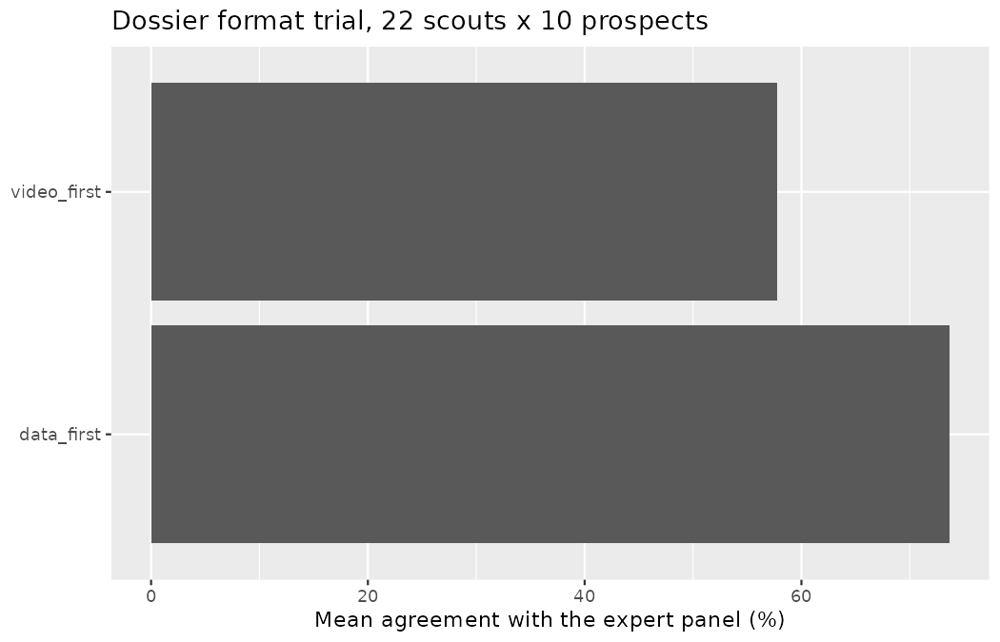
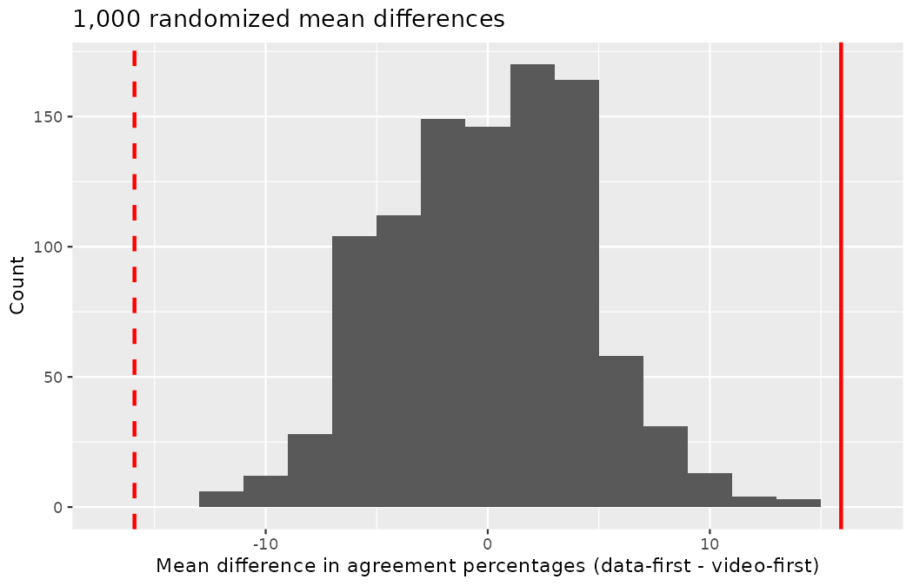
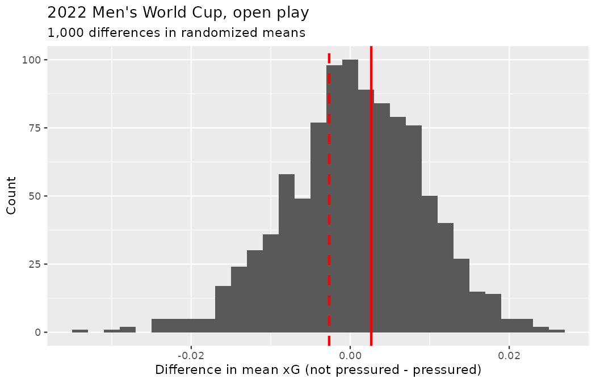
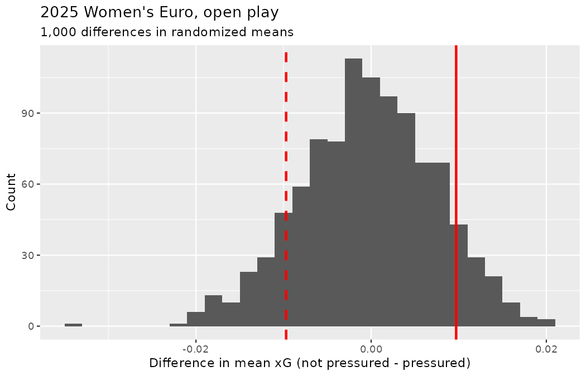

# Applications: Infer {#sec-inference-applications}

Seven chapters ago you held the foundations of inference — shuffle, resample, approximate — and a single flagship question about a proportion.
You now hold the club's full catalog: one proportion (@sec-inference-one-prop), two proportions (@sec-inference-two-props), two-way tables (@sec-inference-tables), one mean (@sec-inference-one-mean), two independent means (@sec-inference-two-means), paired means (@sec-inference-paired-means), and many means (@sec-inference-many-means).
As promised back in @sec-data-applications, the chapter that closes a part of this book introduces nothing new — no formula, no symbol, no vocabulary.
Instead it consolidates: a recap of the computational and mathematical machinery, a case study that runs a confidence interval, a paired test, and two independent-means tests back to back on one end-of-season agenda, a walkthrough with one lesson for each chapter of this part, and an unguided lab to close.

## Recap: Computational methods {#sec-comp-methods-summary}

The computational methods we have presented are used in two settings.
First, in many real life applications (as in those covered here), the mathematical model and computational model give identical conclusions.
When there are no differences in conclusions, the advantage of the computational method is that it gives the analyst a good sense for the logic of the statistical inference process.
Second, when there is a difference in the conclusions (seen primarily in methods beyond the scope of this text), it is often the case that the computational method relies on fewer technical conditions and is therefore more appropriate to use.
You have already watched both settings play out at Northbridge: in @sec-inference-two-means the bootstrap interval and the $t$-interval for the 18-forward drill experiment excluded zero side by side, and in @sec-inference-tables the permutation and chi-squared p-values (0.107 and 0.099) delivered one verdict in two accents — while in @sec-inference-one-prop the success-failure condition collapsed under Morocco's six one-on-ones and only the simulation route remained.

### Randomization

An important feature of randomization tests is that the data are permuted in such a way that the null hypothesis is true.
The randomization distribution provides a distribution of the statistic of interest under the null hypothesis, which is exactly the information needed to calculate a p-value --- where the p-value is the probability of obtaining the observed data or more extreme when the null hypothesis is true.
Although there are ways to adjust the randomization for settings other than the null hypothesis being true, they are not covered in this book and they are not used widely.
In approaching research questions with a randomization test, be sure to ask yourself what the null hypothesis represents and how it is that permuting the data is creating different possible null data representations.
Shuffling scout-report templates across the scouts who never saw them (@sec-rand2mean), flipping the sign of a GPS-vendor difference within a player (@sec-inference-paired-means), scattering position-group labels across shots (@sec-randANOVA) — each shuffle is a physical claim about what the null world looks like, and you should be able to say the claim out loud before you trust the p-value.

**Hypothesis tests.** When using a randomization test, we proceed as follows:

-   Write appropriate hypotheses.

-   Compute the observed statistic of interest.

-   Permute the data repeatedly, each time, recalculating the statistic of interest.

-   Compute the proportion of times the permuted statistics are as extreme as or more extreme than the observed statistic, this is the p-value.

-   Make a conclusion based on the p-value, and write the conclusion in context and in plain language so anyone can understand the result — Marta Vidal does not act on a number she cannot read.

### Bootstrapping

Bootstrapping, in contrast to randomization tests, represents a proxy sampling of the original population.
With bootstrapping, the analyst is not forcing the null hypothesis to be true (or false, for that matter), but instead, they are replicating the variability seen in taking repeated samples from a population.
Because there is no underlying true (or false) null hypothesis, bootstrapping is typically used for creating confidence intervals for the parameter of interest.
Bootstrapping can be used to test particular values of a parameter (e.g., by evaluating whether a particular value of interest is contained in the confidence interval), but generally, bootstrapping is used for interval estimation instead of testing.

**Confidence intervals.** The following is how we generally computed a confidence interval using bootstrapping:

-   Repeatedly resample the original data, with replacement, using the same sample size as the original data.

-   For each resample, calculate the statistic of interest.

-   Calculate the confidence interval using one of the following methods:

    -   Bootstrap percentile interval: Obtain the endpoints representing the middle (e.g., 95%) of the bootstrapped statistics.
        The endpoints will be the confidence interval.

    -   Bootstrap standard error (SE) interval: Find the SE of the bootstrapped statistics.
        The confidence interval will be given by the original observed statistic plus or minus some multiple (e.g., 2) of SEs.

-   Put the conclusions in context and in plain language so even non-statisticians and data scientists can understand the results.

Remember the two warnings this part attached to the bootstrap: the SE interval leans on symmetry it does not check — recall the negative lower bound it manufactured for a five-shot sample in @sec-boot1mean — and no amount of resampling rescues a sample too small or too skewed to carry the weight (@sec-inference-one-mean).

## Recap: Mathematical models {#sec-math-models-summary}

The mathematical models which have been used to produce inferential analyses follow a consistent framework for different parameters of interest.
As a way to contrast and compare the mathematical approach, we offer the following summaries in @tbl-zcompare and @tbl-tcompare.

### z-procedures

Generally, when the response variable is categorical (or binary) — a shot scores or it does not, a prospect is shortlisted or passed over — the summary statistic is a proportion and the model used to describe the proportion is the standard normal curve (also referred to as a $z$-curve or a $z$-distribution).
We provide @tbl-zcompare partly as a mechanism for understanding $z$-procedures and partly to highlight the extremely common usage of the $z$-distribution in practice.

|  | One sample | Two independent samples |
|:------------------|:--------------------------|:--------------------------|
| Response variable | Binary | Binary |
| Parameter of interest | Proportion: $p$ | Difference in proportions: $p_1 - p_2$ |
| Statistic of interest | Proportion: $\hat{p}$ | Difference in proportions: $\hat{p}_1 - \hat{p}_2$ |
| Standard error: HT | $\sqrt{\frac{p_0(1-p_0)}{n}}$ | $\sqrt{\hat{p}_{pool}\Big(1-\hat{p}_{pool}\Big)\Big(\frac{1}{n_1} + \frac{1}{n_2}\Big)}$ |
| Standard error: CI | $\sqrt{\frac{\hat{p}(1-\hat{p})}{n}}$ | $\sqrt{\frac{\hat{p}_1(1-\hat{p}_1)}{n_1} + \frac{\hat{p}_2(1-\hat{p}_2)}{n_2}}$ |
| Conditions | 1\. Independence, 2. Success-failure | 1\. Independence, 2. Success-failure |

: Similarities of z-methods across one sample and two independent samples analysis of a binary response variable. $p$ represents the population proportion, $\hat{p}$ represents the sample proportion, $p_0$ represents the null hypothesized proportion, $\hat{p}_{pool}$ represents the pooled proportion, and $n$ represents the sample size. The subscripts of 1 and 2 indicate that the values are measured separately for samples 1 and 2. {#tbl-zcompare}

The table encodes the substitution discipline drilled in @sec-one-prop-norm and @sec-test-prop-pool: a hypothesis test stands inside the null world, so its standard error is built from $p_0$ (or from $\hat{p}_{pool}$, the two-sample stand-in for a shared null value), while a confidence interval has no null to lean on and uses the observed $\hat{p}$ (or each group's own $\hat{p}_i$).

**Hypothesis tests.** When applying the $z$-distribution for a hypothesis test, we proceed as follows:

-   Write appropriate hypotheses.

-   Verify conditions for using the $z$-distribution.

    -   One-sample: the observations (or differences) must be independent. The success-failure condition of at least 10 success and at least 10 failures should hold.
    -   For a difference of proportions: each sample must separately satisfy the success-failure conditions, and the data in the groups must also be independent.

-   Compute the point estimate of interest and the standard error.

-   Compute the Z score and p-value.

-   Make a conclusion based on the p-value, and write a conclusion in context and in plain language so anyone can understand the result.

**Confidence intervals.** Similarly, the following is how we generally computed a confidence interval using a $z$-distribution:

-   Verify conditions for using the $z$-distribution. (See above.)
-   Compute the point estimate of interest, the standard error, and $z^{\star}.$
-   Calculate the confidence interval using the general formula:\
    point estimate $\pm\ z^{\star} SE.$
-   Put the conclusions in context and in plain language so even non-statisticians and data scientists can understand the results.

### t-procedures

With quantitative response variables — chance quality per shot, sprint distance, an assessment score — the $t$-distribution was applied as the appropriate mathematical model in three distinct settings.
Although the three data structures are different, their similarities and differences are worth pointing out.
We provide @tbl-tcompare partly as a mechanism for understanding $t$-procedures and partly to highlight the extremely common usage of the $t$-distribution in practice.

|  | One sample | Paired samples | Two independent samples |
|:---------------|:---------------|:---------------|:-----------------------|
| Response variable | Numeric | Numeric | Numeric |
| Parameter of interest | Mean: $\mu$ | Paired mean: $\mu_{diff}$ | Difference in means: $\mu_1 - \mu_2$ |
| Statistic of interest | Mean: $\bar{x}$ | Paired mean: $\bar{x}_{diff}$ | Difference in means: $\bar{x}_1 - \bar{x}_2$ |
| Standard error | $\frac{s}{\sqrt{n}}$ | $\frac{s_{diff}}{\sqrt{n_{diff}}}$ | $\sqrt{\frac{s_1^2}{n_1} + \frac{s_2^2}{n_2}}$ |
| Degrees of freedom | $n-1$ | $n_{diff} - 1$ | $\min(n_1 - 1, n_2 - 1)$ |
| Conditions | 1\. Independence, 2. Normality or large samples | 1\. Independence, 2. Normality or large samples | 1\. Independence, 2. Normality or large samples |

: Similarities of $t$-methods across one sample, paired sample, and two independent samples analysis of a numeric response variable. $\mu$ represents the population mean, $\bar{x}$ represents the sample mean, $s$ represents the standard deviation, and $n$ represents the sample size. The subscript of $diff$ indicates that the values are measured on the paired differences. The subscripts of $1$ and $2$ indicate that the values are measured separately on sample $1$ and sample $2$. {#tbl-tcompare}

The middle column is the one analysts forget: paired data are analyzed as a *single* sample of differences, which is why every entry is the one-sample entry with a $diff$ subscript — the entire argument of @sec-mathpaired in one column.
Two members of the mathematical catalog do not fit these two tables and deserve their reminder here: the chi-squared distribution for two-way tables, with its expected counts and $df = (R-1)(C-1)$ (@sec-mathchisq), and the $F$-distribution for comparing many means at once, with $df_G = k-1$ and $df_E = n-k$ (@sec-mathANOVA).

**Hypothesis tests.** When applying the $t$-distribution for a hypothesis test, we proceed as follows:

-   Write appropriate hypotheses.

-   Verify conditions for using the $t$-distribution.

    -   One-sample or differences from paired data: the observations (or differences) must be independent and nearly normal. For larger sample sizes, we can relax the nearly normal requirement, e.g., slight skew is okay for sample sizes of 15, moderate skew for sample sizes of 30, and strong skew for sample sizes of 60.
    -   For a difference of means when the data are not paired: each sample mean must separately satisfy the one-sample conditions for the $t$-distribution, and the data in the groups must also be independent.

-   Compute the point estimate of interest, the standard error, and the degrees of freedom. For $df,$ use $n-1$ for one sample, and for two samples use either statistical software or the smaller of $n_1 - 1$ and $n_2 - 1.$

-   Compute the T score and p-value.

-   Make a conclusion based on the p-value, and write a conclusion in context and in plain language so anyone can understand the result.

**Confidence intervals.** Similarly, the following is how we generally computed a confidence interval using a $t$-distribution:

-   Verify conditions for using the $t$-distribution. (See above.)
-   Compute the point estimate of interest, the standard error, the degrees of freedom, and $t^{\star}_{df}.$
-   Calculate the confidence interval using the general formula:
    $$\mbox{point estimate } \pm\ t_{df}^{\star} SE.$$
-   Put the conclusions in context and in plain language so even non-statisticians and data scientists can understand the results.

## Case study: the end-of-season review {#sec-case-study-redundant-adjectives}

Every June, Marta Vidal convenes the Northbridge United end-of-season review, and this year Priya Rao's agenda has three items that happen to exercise, in order, a confidence interval for a single mean, a paired mean test, and a pair of two-independent-means tests — the second half of this part's catalog, run back to back on one afternoon:

1.  **The benchmark.** The recruitment templates quote "elite tournament chance quality" as a single number. What is the mean chance quality per shot at an elite tournament — with honest uncertainty attached, and in which frame?
2.  **The format trial.** During the end-of-season workshop, Priya ran a randomized crossover experiment on 22 of Emil Sørensen's 48 regional scouts: does the *order of evidence* in a dossier — footage pages first or data pages first — change how scouts grade prospects?
3.  **The tournament questions.** Two questions on the club's desk: one it has never stopped circling since the inference chapters took it up (@sec-inference-two-means) — does defensive pressure move chance quality within a tournament? — and one circled since @sec-data-applications: do the two tournaments differ from each other at all?

::: {.callout-note title="Data"}
The `wc2022_shots` and `weuro2025_shots` data are real: one row per shot at the 2022 Men's World Cup and the 2025 Women's Euro, stored in `data/derived/` and built from StatsBomb open data.
The `format_trial` data are constructed for this case study in the seeded code below — a Northbridge scenario, not a real scouting network — and, as always in this book, every number in this chapter can be reproduced from the visible code.
:::

### Exploratory analysis

Item one on the agenda begins where every analysis in this book begins: with a look at the data, and with the frame decision that @sec-chp11-pens-out made a permanent fixture of the club's workflow.

```r
library(dplyr)
library(tidyr)
library(readr)
library(ggplot2)
library(infer)

wc2022_shots <- read_csv("data/derived/wc2022_shots.csv")
weuro2025_shots <- read_csv("data/derived/weuro2025_shots.csv")

wc2022_shots |>
  group_by(shot_type) |>
  summarize(
    shots   = n(),
    mean_xg = round(mean(statsbomb_xg), 4),
    sd_xg   = round(sd(statsbomb_xg), 4)
  )
#> # A tibble: 4 × 4
#>   shot_type shots mean_xg  sd_xg
#>   <chr>     <int>   <dbl>  <dbl>
#> 1 Corner        2  0.0002 0
#> 2 Free Kick    46  0.0433 0.0255
#> 3 Open Play  1382  0.0983 0.125
#> 4 Penalty      64  0.784  0

weuro2025_shots |>
  group_by(shot_type) |>
  summarize(
    shots   = n(),
    mean_xg = round(mean(statsbomb_xg), 4),
    sd_xg   = round(sd(statsbomb_xg), 4)
  )
#> # A tibble: 3 × 4
#>   shot_type shots mean_xg  sd_xg
#>   <chr>     <int>   <dbl>  <dbl>
#> 1 Free Kick    11  0.036  0.0283
#> 2 Open Play   851  0.0974 0.112
#> 3 Penalty      51  0.784  0
```

The tables are old friends by now.
Each tournament's penalty row has a standard deviation of exactly zero, because every penalty carries the stored chance quality 0.7835 — printed as 0.784 above, the display quirk @sec-data-applications warned about — and those identical spikes sit far above every other row.
The mean of *all* shots therefore depends heavily on whether the penalties are in the frame:

```r
wc2022_shots |>
  summarize(shots = n(), mean_xg = round(mean(statsbomb_xg), 4))
#> # A tibble: 1 × 2
#>   shots mean_xg
#>   <int>   <dbl>
#> 1  1494   0.126

wc2022_shots |>
  filter(shot_type == "Open Play") |>
  summarize(shots = n(), mean_xg = round(mean(statsbomb_xg), 4))
#> # A tibble: 1 × 2
#>   shots mean_xg
#>   <int>   <dbl>
#> 1  1382  0.0983
```

All shots: 0.1259 xG per shot, with the 64 penalty kicks in and flagged.
Open play: 0.0983.
Both numbers will be on the review table, each wearing its frame label, per the book's penalty convention.

Item two's data do not exist in any tournament file, so Priya built them.
At the workshop, each of the 22 attending scouts graded the *same ten shortlisted full-backs* twice, once from a *video-first* dossier (footage pages up front, derived data behind) and once from a *data-first* dossier (chance-quality and shot-mix pages up front, footage behind) — identical evidence, different order.
Which format each scout met first was randomized, eleven scouts per order — the crossover safeguard, though it is worth being precise about what it buys: randomizing the order *balances* learning effects across the two formats, it does not remove them, since a scout grading a full-back for the second time inevitably anchors on their own first grade, whichever format produced it.
Separately, the club's expert panel — Marta, Emil, and the senior analysts, with full data and unlimited time — fixed a reference grade for each full-back, and the outcome recorded for each scout, format, and prospect is whether the scout's grade *agreed* with the panel's.
The seeded code below constructs the whole scenario; in this built world the data-first pages genuinely help (agreement probability 0.74 against 0.55), scouts differ in baseline accuracy, and no order effect exists — the randomization is a design safeguard, not a patch for a known problem.

```r
set.seed(2301)
scout_ids <- sprintf("S%02d", 1:22)

format_order <- tibble(
  scout        = scout_ids,
  first_format = sample(rep(c("video_first", "data_first"), each = 11))
)

scout_skill <- tibble(
  scout = scout_ids,
  skill = rnorm(22, mean = 0, sd = 0.08)
)

format_trial <- expand_grid(
  scout    = scout_ids,
  format   = c("video_first", "data_first"),
  prospect = sprintf("P%02d", 1:10)
) |>
  left_join(scout_skill, by = "scout") |>
  mutate(
    p_agree = if_else(format == "data_first", 0.74, 0.55) + skill,
    p_agree = pmax(pmin(p_agree, 0.95), 0.05),
    agree   = rbinom(n(), size = 1, prob = p_agree)
  )

format_order |>
  count(first_format)
#> # A tibble: 2 × 2
#>   first_format     n
#>   <chr>        <int>
#> 1 data_first      11
#> 2 video_first     11
```

The observational unit for the analysis is a scout-format combination, and the response is the *percentage* of the ten prospects on which the scout agreed with the panel:

```r
format_scores <- format_trial |>
  group_by(scout, format) |>
  summarize(
    n_prospects = n(),
    agree_perc  = 100 * mean(agree),
    .groups = "drop"
  )

format_scores |>
  slice_head(n = 6)
#> # A tibble: 6 × 4
#>   scout format      n_prospects agree_perc
#>   <chr> <chr>             <int>      <dbl>
#> 1 S01   data_first           10         80
#> 2 S01   video_first          10         50
#> 3 S02   data_first           10         70
#> 4 S02   video_first          10         50
#> 5 S03   data_first           10         50
#> 6 S03   video_first          10         60

format_scores |>
  group_by(format) |>
  summarize(scouts = n(), mean_agree_perc = mean(agree_perc))
#> # A tibble: 2 × 3
#>   format      scouts mean_agree_perc
#>   <chr>        <int>           <dbl>
#> 1 data_first      22            73.6
#> 2 video_first     22            57.7
```

Note that the variable is a "percentage", and we are interested in the average percentage — therefore, we will use methods for *means*.
If the variable had been a single success-or-failure per scout ("agreed on a majority or didn't"), we would have used methods for proportions.
Data-first dossiers averaged 73.6% agreement with the panel against 57.7% for video-first — a gap of 15.9 points that a bar chart makes vivid:

```r
format_scores |>
  group_by(format) |>
  summarize(mean_agree_perc = mean(agree_perc)) |>
  ggplot(aes(y = format, x = mean_agree_perc)) +
  geom_col() +
  labs(
    x = "Mean agreement with the expert panel (%)",
    y = NULL,
    title = "Dossier format trial, 22 scouts x 10 prospects"
  )
```

{fig-alt="Horizontal bar chart of mean agreement with the expert panel by dossier format: the data-first bar reaches 73.6% while the video-first bar stops at 57.7%." width=85%}

Two horizontal bars, data-first reaching 73.6% and video-first stopping at 57.7%.
Whether that gap is evidence or noise is exactly what the paired test below will decide.

::: {.callout-tip title="Check your understanding"}
The review table holds two data sources.
Classify each as observational or experimental, and say what kind of claim each can support.

------------------------------------------------------------------------

The tournament shot files are observational: StatsBomb logged football that was going to happen anyway, nothing was assigned, and every pattern in them is an association — the discipline running from @sec-data-design through the causality caveats of @sec-inference-two-means.
The format trial is a randomized experiment — every scout graded identical evidence under both formats, with the order randomized — so a discernible difference *can* be attributed to the format itself.
Same afternoon, same review table, two entirely different scopes of inference.
:::

### Confidence interval for a single mean

The templates want one number for "elite tournament chance quality", and item one of the agenda asks for that number with uncertainty attached.
The parameter is the true mean chance quality per shot in elite tournament football of the kind the World Cup samples — the 1,494 shots on file are one edition's draw from that process, the same "one draw from the game of football" framing @sec-data-applications used when it first put two tournaments side by side.
Along with the sample average as a point estimate, we can construct a confidence interval via bootstrapping, resampling the 1,494 shots with replacement, per @sec-boot1mean.
First the all-shots frame:

```r
set.seed(2302)
boot_xg_all <- wc2022_shots |>
  specify(response = statsbomb_xg) |>
  generate(reps = 1000, type = "bootstrap") |>
  calculate(stat = "mean")

round(quantile(boot_xg_all$stat, c(0.025, 0.975)), 4)
#>   2.5%  97.5%
#> 0.1172 0.1357

xbar_all  <- mean(wc2022_shots$statsbomb_xg)
se_bs_all <- sd(boot_xg_all$stat)
round(c(xbar_all, se_bs_all), 4)
#> [1] 0.1259 0.0048

round(c(xbar_all - 2 * se_bs_all, xbar_all + 2 * se_bs_all), 4)
#> [1] 0.1162 0.1355
```

The 95% bootstrap percentile interval — the middle 95% of the 1,000 bootstrapped means — runs from 0.1172 to 0.1357 xG per shot.
The SE interval takes the observed mean plus or minus two bootstrap standard errors, $0.1259 \pm 2 \times 0.0048,$ giving $(0.1162, 0.1355).$
The two constructions nearly coincide, because with $n = 1,494$ the bootstrap distribution is symmetric and bell-shaped — contrast the five-shot sample of @sec-boot1mean, where the SE interval's blind faith in symmetry produced a negative chance quality.
Now the same machinery in the open-play frame:

```r
set.seed(2303)
boot_xg_open <- wc2022_shots |>
  filter(shot_type == "Open Play") |>
  specify(response = statsbomb_xg) |>
  generate(reps = 1000, type = "bootstrap") |>
  calculate(stat = "mean")

round(quantile(boot_xg_open$stat, c(0.025, 0.975)), 4)
#>   2.5%  97.5%
#> 0.0919 0.1047

xbar_open  <- mean(filter(wc2022_shots, shot_type == "Open Play")$statsbomb_xg)
se_bs_open <- sd(boot_xg_open$stat)
round(c(xbar_open - 2 * se_bs_open, xbar_open + 2 * se_bs_open), 4)
#> [1] 0.0918 0.1049
```

Open play: percentile interval $(0.0919, 0.1047),$ SE interval $(0.0918, 0.1049)$ around $\bar{x} = 0.0983.$
Put the two frames side by side and the deepest lesson of the section appears: the two intervals *do not overlap*.
Sampling variability moves the estimate by half a hundredth of xG in either direction; the frame decision moves it by nearly three hundredths — roughly six standard errors.
The 64 identical 0.7835 kicks do to this mean what @sec-chp11-pens-out showed them doing to a conversion gap and @sec-mathANOVA showed them doing to an $F$ statistic: here they *inflate* a single-mean benchmark that open-play recruitment work would then chase in vain.
Each interval is valid *for its own parameter*; the report's job is to say which parameter the club is buying.
As in every bootstrap of this book, the intervals also lean on a representativeness assumption — one tournament stands proxy for the process that generates elite tournament football, an assumption the walkthrough of @sec-inference-tutorials will keep probing.

::: {.callout-tip title="Check your understanding"}
A colleague reads the open-play result as "95% of open-play shots have a chance quality between 0.0919 and 0.1047."
What went wrong?

------------------------------------------------------------------------

The interval describes the plausible range of the *mean* chance quality, not of individual shots.
Individual open-play xG values routinely land at 0.02 and occasionally at 0.7 — their spread is the standard deviation of observations (about 0.125 here), not the standard error of the mean, the distinction @sec-one-mean-math drilled.
And per @sec-foundations-mathematical, the 95% lives in the procedure: across many intervals built this way, about 95% capture their parameter.
:::

Confidence intervals for the true mean agreement percentage under each dossier format could be built the same way, but they are not very meaningful on their own — "the true mean agreement of a video-first scout" is an abstract quantity to stare at.
As in most club work, the interesting questions are comparative: does agreement *differ* between formats?
Does chance quality *differ* under pressure, or between tournaments?
To answer those, we need hypothesis tests.

### Paired mean test

Start with the format trial: "Do the data provide convincing evidence of a difference in mean agreement percentages between data-first and video-first dossiers?"
Every scout graded under *both* formats, so the two columns of scores are not independent samples — they are paired by scout, and per @sec-inference-paired-means the variable of interest is each scout's *difference*:

```r
format_paired <- format_scores |>
  pivot_wider(
    id_cols = scout,
    names_from = format,
    names_prefix = "agree_",
    values_from = agree_perc
  ) |>
  mutate(diff_agree = agree_data_first - agree_video_first)

format_paired |>
  slice_head(n = 6)
#> # A tibble: 6 × 4
#>   scout agree_data_first agree_video_first diff_agree
#>   <chr>            <dbl>             <dbl>      <dbl>
#> 1 S01                 80                50         30
#> 2 S02                 70                50         20
#> 3 S03                 50                60        -10
#> 4 S04                100                80         20
#> 5 S05                 80                70         10
#> 6 S06                100                70         30

format_paired |>
  summarize(
    n_scouts  = n(),
    xbar_diff = round(mean(diff_agree), 2),
    s_diff    = round(sd(diff_agree), 2)
  )
#> # A tibble: 1 × 3
#>   n_scouts xbar_diff s_diff
#>      <int>     <dbl>  <dbl>
#> 1       22      15.9   13.0
```

Most scouts improved under the data-first format — though not all: S03 went the other way, a reminder that a real effect and individual variation coexist.
The statistic of interest is the average of the differences, $\bar{x}_{diff} = 15.91$ percentage points, and the hypotheses are the ones @sec-inference-paired-means taught:

$$H_0: \mu_{diff} = 0 \qquad H_A: \mu_{diff} \ne 0$$

where $\mu_{diff}$ is the true mean difference in agreement percentage (data-first minus video-first).
Recall that the computational method for a paired hypothesis shuffles the observed percentages across the two formats but **within** a single scout — equivalently, it flips the sign of each difference at random — so that every scout keeps one score in each format and the null world of "format is interchangeable" is built by construction.

```r
obs_diff_format <- format_paired |>
  specify(response = diff_agree) |>
  calculate(stat = "mean") |>
  as.numeric()

round(obs_diff_format, 2)
#> [1] 15.91

set.seed(2304)
null_format <- format_paired |>
  specify(response = diff_agree) |>
  hypothesize(null = "paired independence") |>
  generate(reps = 1000, type = "permute") |>
  calculate(stat = "mean")

null_format |>
  summarize(
    center    = round(mean(stat), 3),
    n_extreme = sum(abs(stat) >= 15.91),
    p_value   = mean(abs(stat) >= 15.91)
  )
#> # A tibble: 1 × 3
#>   center n_extreme p_value
#>    <dbl>     <int>   <dbl>
#> 1  0.083         0       0
```

```r
ggplot(null_format, aes(x = stat)) +
  geom_histogram(binwidth = 2) +
  geom_vline(xintercept = obs_diff_format, color = "red", linewidth = 1) +
  geom_vline(xintercept = -obs_diff_format, color = "red",
             linetype = "dashed", linewidth = 1) +
  labs(
    x = "Mean difference in agreement percentages (data-first - video-first)",
    y = "Count",
    title = "1,000 randomized mean differences"
  )
```

{fig-alt="Histogram of 1,000 randomized mean differences in agreement percentages, centered at zero and spanning roughly -12 to +15 points. Solid and dashed red vertical lines at +15.91 and -15.91 sit beyond every permuted difference." width=85%}

The histogram of 1,000 within-scout shuffles is centered at 0.083 — zero, up to simulation noise, exactly as the sign-flipping construction promises — and spans roughly $-12$ to $+15$ points.
The observed $\bar{x}_{diff} = 15.91$ (solid line) sits beyond every one of the 1,000 permuted differences, and its mirror image (dashed line) beyond every one on the left: not a single shuffle in a thousand was as extreme in either direction, so the two-sided p-value is below $1/1000.$
The mathematical route agrees, as the recap promised it usually would: $T = 15.91 / (12.97/\sqrt{22}) = 5.75$ with $df = 21$ gives a p-value near $0.00001.$
At any discernibility level the club uses, we reject $H_0$: the data provide convincing evidence that dossier format changes mean agreement with the panel — and because the design was a randomized crossover in which each scout served as their own control, the claim is causal, the pairing dividend @sec-inference-paired-means taught.
The same honesty owed in @sec-foundations-applications is owed here: the outcome measures agreement with the club's own expert panel — a panel that itself worked from the full derived data — so what the trial demonstrates is that data-first pages move scouts toward Northbridge's reference process, not toward ground truth about the ten full-backs, which no panel can certify.
Priya's recommendation writes itself; Marta's only quarrel is with the printing costs.

::: {.callout-tip title="Check your understanding"}
Why shuffle within each scout, rather than tossing all 44 scores into one urn and dealing them back out?

------------------------------------------------------------------------

Because the pairing is real structure, not decoration.
Scouts differ in baseline accuracy — S04 agreed on 80% even from footage, others hovered near half — and a full reshuffle would build a null world in which those between-scout differences masquerade as format effects, exactly the noise the paired design exists to remove (@sec-inference-paired-means).
Shuffling within a scout keeps each scout's overall accuracy fixed and asks only: given this scout's two scores, could their assignment to formats be coincidence?
:::

### Two independent means test

Item three moves back to the tournament files, and to the question this book has never stopped circling: is chance quality different when the shooter is under defensive pressure?
The club now holds two tournaments, and it is tempting to pour all $1{,}382 + 851$ open-play shots into one big test.
Resist the temptation: the two competitions are different populations — different fields, different tactical worlds, and per @sec-data-applications different penalty mixes and pattern profiles — so pooling would let between-tournament differences masquerade as pressure effects, the lurking-variable trap of @sec-data-applications in inferential clothing.
Therefore, to answer the pressure question, we conduct two parallel hypothesis tests, one per tournament, each with the hypotheses:

$$H_0: \mu_{prs} = \mu_{nop} \qquad H_A: \mu_{prs} \ne \mu_{nop}$$

where $\mu_{prs}$ and $\mu_{nop}$ are the true mean chance qualities of pressured and unpressured shots in that competition.
One frame declaration before any shuffling, and it is the book's canonical one: this comparison is run in the *open-play frame*.
@sec-math2samp taught why with the flip that made the pair famous — pens in, the World Cup's unpressured mean carries all 64 uncontested 0.7835 kicks and the test rejects resoundingly ($T = 4.27$); pens out, the same machinery returns $T = 0.37,$ $p = 0.71.$
We are not re-litigating that lesson; we are working in the honest frame it established.
The randomization here also differs from the paired setting in exactly the way @sec-rand2mean established: pressured and unpressured shots have no natural pairing, so we permute the pressure labels across *all* shots within the tournament.

```r
wc_open <- wc2022_shots |>
  filter(shot_type == "Open Play")

wc_open |>
  group_by(under_pressure) |>
  summarize(
    shots   = n(),
    mean_xg = round(mean(statsbomb_xg), 4),
    sd_xg   = round(sd(statsbomb_xg), 4)
  )
#> # A tibble: 2 × 4
#>   under_pressure shots mean_xg  sd_xg
#>   <lgl>          <int>   <dbl>  <dbl>
#> 1 FALSE           1144  0.0988 0.130
#> 2 TRUE             238  0.0961 0.0949

obs_wc_pressure <- wc_open |>
  mutate(pressure = if_else(under_pressure, "pressured", "not pressured")) |>
  specify(statsbomb_xg ~ pressure) |>
  calculate(stat = "diff in means", order = c("not pressured", "pressured")) |>
  as.numeric()

round(obs_wc_pressure, 4)
#> [1] 0.0027

set.seed(2305)
null_wc_pressure <- wc_open |>
  mutate(pressure = if_else(under_pressure, "pressured", "not pressured")) |>
  specify(statsbomb_xg ~ pressure) |>
  hypothesize(null = "independence") |>
  generate(reps = 1000, type = "permute") |>
  calculate(stat = "diff in means", order = c("not pressured", "pressured"))

null_wc_pressure |>
  summarize(
    n_extreme = sum(abs(stat) >= 0.0027),
    p_value   = mean(abs(stat) >= 0.0027)
  )
#> # A tibble: 1 × 2
#>   n_extreme p_value
#>       <int>   <dbl>
#> 1       743   0.743
```

And the same test on the second tournament:

```r
weuro_open <- weuro2025_shots |>
  filter(shot_type == "Open Play")

weuro_open |>
  group_by(under_pressure) |>
  summarize(
    shots   = n(),
    mean_xg = round(mean(statsbomb_xg), 4),
    sd_xg   = round(sd(statsbomb_xg), 4)
  )
#> # A tibble: 2 × 4
#>   under_pressure shots mean_xg sd_xg
#>   <lgl>          <int>   <dbl> <dbl>
#> 1 FALSE            526  0.101  0.119
#> 2 TRUE             325  0.0914 0.102

obs_we_pressure <- weuro_open |>
  mutate(pressure = if_else(under_pressure, "pressured", "not pressured")) |>
  specify(statsbomb_xg ~ pressure) |>
  calculate(stat = "diff in means", order = c("not pressured", "pressured")) |>
  as.numeric()

round(obs_we_pressure, 4)
#> [1] 0.0097

set.seed(2307)
null_we_pressure <- weuro_open |>
  mutate(pressure = if_else(under_pressure, "pressured", "not pressured")) |>
  specify(statsbomb_xg ~ pressure) |>
  hypothesize(null = "independence") |>
  generate(reps = 1000, type = "permute") |>
  calculate(stat = "diff in means", order = c("not pressured", "pressured"))

null_we_pressure |>
  summarize(
    n_extreme = sum(abs(stat) >= 0.0097),
    p_value   = mean(abs(stat) >= 0.0097)
  )
#> # A tibble: 1 × 2
#>   n_extreme p_value
#>       <int>   <dbl>
#> 1       213   0.213
```

```r
ggplot(null_wc_pressure, aes(x = stat)) +
  geom_histogram(binwidth = 0.002) +
  geom_vline(xintercept = obs_wc_pressure, color = "red", linewidth = 1) +
  geom_vline(xintercept = -obs_wc_pressure, color = "red",
             linetype = "dashed", linewidth = 1) +
  labs(
    x = "Difference in mean xG (not pressured - pressured)",
    y = "Count",
    title = "2022 Men's World Cup, open play",
    subtitle = "1,000 differences in randomized means"
  )

ggplot(null_we_pressure, aes(x = stat)) +
  geom_histogram(binwidth = 0.002) +
  geom_vline(xintercept = obs_we_pressure, color = "red", linewidth = 1) +
  geom_vline(xintercept = -obs_we_pressure, color = "red",
             linetype = "dashed", linewidth = 1) +
  labs(
    x = "Difference in mean xG (not pressured - pressured)",
    y = "Count",
    title = "2025 Women's Euro, open play",
    subtitle = "1,000 differences in randomized means"
  )
```

{fig-alt="Histogram of 1,000 differences in randomized mean xG for World Cup open-play shots (not pressured minus pressured). The observed difference of 0.0027, marked by a solid red line with its mirror image dashed, sits comfortably among the shuffled differences." width=85%}

{fig-alt="Histogram of 1,000 differences in randomized mean xG for Euro open-play shots (not pressured minus pressured). The observed difference of 0.0097, marked by a solid red line with its mirror image dashed, sits within the span of the shuffled differences." width=85%}

In both null distributions the observed difference (solid line) sits comfortably among the shuffled ones.
At the World Cup, the open-play gap is $0.0988 - 0.0961 = 0.0027$ xG per shot and 743 of 1,000 label-shuffles produced a difference at least that large in absolute value: $p = 0.743.$
At the Euro the gap is larger, $0.1011 - 0.0914 = 0.0097,$ but so is nothing else about the verdict: $p = 0.213.$
(The exercise thread of @sec-chp20-exercises ran this same Euro comparison with a different seed and obtained $0.222$ — the seed-to-seed gap @sec-foundations-applications taught you to expect, two estimates of one tail probability, same verdict.)
Neither tournament's pressure gap is statistically discernible in the honest frame, at $\alpha = 0.05$ or anywhere near it.
The two competitions *agree*: once the penalties leave the frame, defenders pressing a shooter does not measurably degrade the chance quality of the shots that get taken — and remember from @sec-chp11-pens-out that even a rejection here would have claimed association only, since nobody assigns pressure at random.
Contrast this consolidated calm with the pens-in fireworks the club once stared at: a World Cup "effect" of $T = 4.27$ and a Euro one rejected even more emphatically ($T = 6.27,$ not one permuted difference in a thousand as extreme, per @sec-chp20-exercises) — every point of which was 115 penalty kicks sitting on one side of the ledger.

The second tournament question is the one @sec-data-applications planted when it first set the two competitions side by side: their chance quality per shot — are they the same, or different?
Two tournaments, two independent groups of shots, one test each in the two frames the review demands.
The hypotheses: $H_0: \mu_{wc} = \mu_{we}$ against $H_A: \mu_{wc} \ne \mu_{we}.$

```r
both_shots <- bind_rows(wc2022_shots, weuro2025_shots)

both_shots |>
  group_by(competition) |>
  summarize(
    shots   = n(),
    mean_xg = round(mean(statsbomb_xg), 4),
    sd_xg   = round(sd(statsbomb_xg), 4)
  )
#> # A tibble: 2 × 4
#>   competition shots mean_xg sd_xg
#>   <chr>       <int>   <dbl> <dbl>
#> 1 wc2022       1494   0.126 0.184
#> 2 weuro2025     913   0.135 0.192

obs_comp_all <- both_shots |>
  specify(statsbomb_xg ~ competition) |>
  calculate(stat = "diff in means", order = c("weuro2025", "wc2022")) |>
  as.numeric()

round(obs_comp_all, 4)
#> [1] 0.0092

set.seed(2308)
null_comp_all <- both_shots |>
  specify(statsbomb_xg ~ competition) |>
  hypothesize(null = "independence") |>
  generate(reps = 1000, type = "permute") |>
  calculate(stat = "diff in means", order = c("weuro2025", "wc2022"))

null_comp_all |>
  summarize(
    n_extreme = sum(abs(stat) >= 0.0092),
    p_value   = mean(abs(stat) >= 0.0092)
  )
#> # A tibble: 1 × 2
#>   n_extreme p_value
#>       <int>   <dbl>
#> 1       255   0.255
```

All shots in: the Euro's mean sits 0.0092 higher (0.1350 against 0.1259), and 255 of 1,000 shuffles beat that gap — $p = 0.255,$ not statistically discernible.
The mathematical model concurs: $T = 1.15$ with $df = \min(1493, 912) = 912,$ $p = 0.25.$
Before the open-play rerun, pause on where that 0.0092 even comes from.
Penalties are 51 of the Euro's 913 shots but 64 of the World Cup's 1,494 — shares of 5.6% versus 4.3% — and each penalty drags its tournament's mean toward 0.7835.
A back-of-envelope check shows the mix difference alone accounts for essentially the entire observed gap:

```r
round((51 / 913 - 64 / 1494) * (0.7835 - 0.097), 4)
#> [1] 0.0089
```

::: {.callout-note title="Worked example"}
Read that one-liner out loud before the open-play run below confirms it.

------------------------------------------------------------------------

The Euro's penalty share exceeds the World Cup's by $51/913 - 64/1494 = 0.0130.$
Each extra penalty replaces a roughly 0.097-quality shot with a 0.7835 one, worth $0.7835 - 0.097 = 0.6865$ of xG.
So the mix difference alone predicts an all-shots gap of $0.0130 \times 0.6865 = 0.0089$ — against 0.0092 observed.
The tournaments do not differ in chance quality so much as in *how often their football put the ball on the spot*, which is a statement about refereeing events and shoot-outs, not about the shots teams engineer.
:::

```r
both_open <- both_shots |>
  filter(shot_type == "Open Play")

both_open |>
  group_by(competition) |>
  summarize(
    shots   = n(),
    mean_xg = round(mean(statsbomb_xg), 4),
    sd_xg   = round(sd(statsbomb_xg), 4)
  )
#> # A tibble: 2 × 4
#>   competition shots mean_xg sd_xg
#>   <chr>       <int>   <dbl> <dbl>
#> 1 wc2022       1382  0.0983 0.125
#> 2 weuro2025     851  0.0974 0.112

obs_comp_open <- both_open |>
  specify(statsbomb_xg ~ competition) |>
  calculate(stat = "diff in means", order = c("weuro2025", "wc2022")) |>
  as.numeric()

round(obs_comp_open, 4)
#> [1] -9e-04

set.seed(2309)
null_comp_open <- both_open |>
  specify(statsbomb_xg ~ competition) |>
  hypothesize(null = "independence") |>
  generate(reps = 1000, type = "permute") |>
  calculate(stat = "diff in means", order = c("weuro2025", "wc2022"))

null_comp_open |>
  summarize(
    n_extreme = sum(abs(stat) >= 0.0009),
    p_value   = mean(abs(stat) >= 0.0009)
  )
#> # A tibble: 1 × 2
#>   n_extreme p_value
#>       <int>   <dbl>
#> 1       869   0.869
```

Open play: 0.0983 against 0.0974 — a difference R can only bring itself to print in scientific notation, $-9 \times 10^{-4} = -0.0009$ xG per shot, with 869 of 1,000 shuffles beating it ($p = 0.869$; the $t$-route gives $T = -0.18,$ $p = 0.86$).
When @sec-data-applications first showed you these two numbers as 0.098 and 0.097, it asked whether "close" could be certified as "the same" and told you the machinery would arrive later.
It has: the difference is nowhere near statistically discernible, in either frame.
Elite men's and women's tournament football, three years apart, generate open-play chances of statistically indistinguishable average quality — and the only "difference" the all-shots frame ever hinted at was penalty bookkeeping.
Failing to reject is not proof of equality, as @sec-foundations-decision-errors insists; but with 2,233 open-play shots on the table, the plausible differences that remain are small enough that no recruitment policy should turn on them.

Based on the four p-values of this section (each a measure of deviation from its null claim), the review's tournament verdicts read: no discernible pressure effect on open-play chance quality in either competition, and no discernible overall difference between the competitions in either frame.
The one discernible result of the afternoon — the format trial — is also the one the club can act on causally, because it is the one the club randomized.

::: {.callout-tip title="Check your understanding"}
Marta, reading the four tournament p-values, asks: "So why not pool both tournaments' open-play shots into one 2,233-shot pressure test and get more power?"
What do you tell her?

------------------------------------------------------------------------

Pooling mixes two populations whose pressure shares differ — the Euro's open play is 38% pressured shots, the World Cup's 17% — so competition would become a lurking variable standing behind both the label and the outcome, the Simpson's-paradox structure of @sec-data-applications.
The clean designs are the ones this section ran (one test per tournament, verdicts compared), or a method that models competition explicitly, which is where the next part of this book (@sec-inf-model-slr and beyond) is headed.
:::

## Interactive walkthrough: seven questions, seven tools {#sec-inference-tutorials}

The case study ran on the computational engines; the recap's first promise — that the mathematical shortcuts agree when their conditions hold — deserves to be *your* verification, not our assertion.
So, as in @sec-foundations-applications, here is your walkthrough: Priya Rao's year-end quiz, seven club questions in the order of this part's seven chapters, each solved with that chapter's mathematical model.
Work each lesson at your keyboard; answers to the embedded questions follow immediately — commit to yours first.
One frame declaration up front so the lessons need not repeat it: every lesson below works in the *open-play frame* except where its question forces otherwise, and each lesson says which shots it holds.

### Lesson 1: one proportion

Marta's welcome-pack claims "one elite shot in three is struck first time."
Attach a 95% confidence interval to the World Cup's first-time share and judge her claim.
Penalties cannot be struck first time — the run-up rather rules it out — so the honest frame is open play, and the data agree that the choice matters:

```r
wc2022_shots |>
  filter(shot_type == "Penalty") |>
  count(first_time)
#> # A tibble: 1 × 2
#>   first_time     n
#>   <lgl>      <int>
#> 1 FALSE         64

round(mean(wc2022_shots$first_time), 4)
#> [1] 0.3133

wc_open |>
  summarize(shots = n(), first_time_shots = sum(first_time),
            p_hat = round(mean(first_time), 4))
#> # A tibble: 1 × 3
#>   shots first_time_shots p_hat
#>   <int>            <int> <dbl>
#> 1  1382              468 0.339

p_hat_ft <- 468 / 1382
se_ft <- sqrt(p_hat_ft * (1 - p_hat_ft) / 1382)
round(c(p_hat_ft, se_ft), 4)
#> [1] 0.3386 0.0127

round(c(p_hat_ft - 1.96 * se_ft, p_hat_ft + 1.96 * se_ft), 4)
#> [1] 0.3137 0.3636
```

All 64 penalties are logged `first_time = FALSE`, so the all-shots share (0.3133) mechanically dilutes the open-play one (0.3386).
The success-failure condition holds with room to spare (468 successes, 914 failures), the SE uses $\hat{p}$ because this is an interval, not a test (@tbl-zcompare's substitution discipline), and the 95% interval runs from 0.3137 to 0.3636.

::: {.callout-tip title="Check your understanding"}
Does the interval support Marta's "one in three"?
And what test verdict does it imply, without running the test?

------------------------------------------------------------------------

$1/3 = 0.3333$ sits inside $(0.3137, 0.3636),$ so the claim is consistent with the data.
By the duality of intervals and two-sided tests (@sec-one-prop-norm), a null of $p_0 = 1/3$ inside the 95% interval means a two-sided test at $\alpha = 0.05$ would fail to reject.
The welcome pack survives — provided it says *open play*.
:::

### Lesson 2: two proportions

The Euro final went to England Women's over Spain Women's on a shoot-out — the tournament's two best sides, separated by nothing across 120 minutes.
Were their open-play conversion rates over the whole campaign discernibly different?

```r
weuro_open |>
  filter(team %in% c("England Women's", "Spain Women's")) |>
  group_by(team) |>
  summarize(shots = n(), goals = sum(goal), conversion = round(mean(goal), 4))
#> # A tibble: 2 × 4
#>   team            shots goals conversion
#>   <chr>           <int> <int>      <dbl>
#> 1 England Women's   101    15      0.148
#> 2 Spain Women's     142    18      0.127

p_pool  <- (15 + 18) / (101 + 142)
se_pool <- sqrt(p_pool * (1 - p_pool) * (1 / 101 + 1 / 142))
z_fin   <- (15 / 101 - 18 / 142) / se_pool
round(c(p_pool, se_pool, z_fin, 2 * pnorm(-abs(z_fin))), 4)
#> [1] 0.1358 0.0446 0.4878 0.6257
```

This is a hypothesis test, so per @sec-test-prop-pool the standard error is built from the pooled proportion $\hat{p}_{pool} = 33/243 = 0.1358$ — under which the expected successes are $101 \times 0.1358 = 13.7$ and $142 \times 0.1358 = 19.3,$ both past 10, so the success-failure condition holds.
$Z = 0.49,$ two-sided $p = 0.63$: the finalists' conversion gap (0.1485 versus 0.1268) is exactly the kind of gap two equally sharp teams produce by chance.
The final's fine margins were not a disguise; the two attacks really were this alike.

### Lesson 3: two-way tables

Does the *body part* behind an open-play shot at the Euro travel with whether it scores — a three-level question no single proportion can hold?
First the frame's bookkeeping: four shots carry `body_part = "Other"`, and with expected counts far below the chi-squared conditions of @sec-mathchisq (a cell would expect fewer than one goal), we drop them and say so.

```r
weuro_open |>
  count(body_part)
#> # A tibble: 4 × 2
#>   body_part      n
#>   <chr>      <int>
#> 1 Head         151
#> 2 Left Foot    242
#> 3 Other          4
#> 4 Right Foot   454

weuro_bp <- weuro_open |>
  filter(body_part != "Other") |>
  mutate(result = if_else(goal, "goal", "no goal"))

table(weuro_bp$body_part, weuro_bp$result)
#>
#>              goal no goal
#>   Head         17     134
#>   Left Foot    24     218
#>   Right Foot   54     400

chisq.test(table(weuro_bp$body_part, weuro_bp$result))$expected
#>
#>                  goal  no goal
#>   Head       16.93625 134.0638
#>   Left Foot  27.14286 214.8571
#>   Right Foot 50.92090 403.0791

chisq.test(table(weuro_bp$body_part, weuro_bp$result))
#>
#> 	Pearson's Chi-squared test
#>
#> data:  table(weuro_bp$body_part, weuro_bp$result)
#> X-squared = 0.61986, df = 2, p-value = 0.7335
```

Every expected count clears 5 comfortably (the smallest is 16.9), $df = (3-1)(2-1) = 2,$ and $X^2 = 0.62$ lands a p-value of $0.73.$
The observed counts sit almost eerily close to the expected ones: headers converted 11.3% of the time, left feet 9.9%, right feet 11.9%, and none of that spread is discernible.
Note what the open-play frame quietly did here: the "headers convert worse" deficit that @sec-explore-categorical showed you in the all-shots World Cup table was always propped up by all-footed penalties — in the honest frame, at this tournament, the body-part story is no story at all.

### Lesson 4: one mean

Morocco — the surprise semifinalist whose low-block profile has been on the desk since @sec-data-hello — reached the last four on famously few chances.
Was their open-play chance quality *per shot* also thin, the way @sec-one-mean-math convicted Australia's?
Frame check first: Morocco's file holds 4 penalty kicks (all shoot-out kicks from the Spain tie, 3 scored) and 3 direct free kicks; the open-play sample is the other 59 shots.

```r
wc2022_shots |>
  filter(team == "Morocco") |>
  count(shot_type)
#> # A tibble: 3 × 2
#>   shot_type     n
#>   <chr>     <int>
#> 1 Free Kick     3
#> 2 Open Play    59
#> 3 Penalty       4

morocco_open <- wc_open |>
  filter(team == "Morocco")

morocco_open |>
  summarize(shots = n(), xbar = round(mean(statsbomb_xg), 4),
            s = round(sd(statsbomb_xg), 4))
#> # A tibble: 1 × 3
#>   shots   xbar     s
#>   <int>  <dbl> <dbl>
#> 1    59 0.0918 0.118

xbar_mor <- mean(morocco_open$statsbomb_xg)
se_mor   <- sd(morocco_open$statsbomb_xg) / sqrt(59)
round(c(xbar_mor - qt(0.975, df = 58) * se_mor,
        xbar_mor + qt(0.975, df = 58) * se_mor), 4)
#> [1] 0.0611 0.1225
```

With $n = 59$ the moderate right skew of xG is no obstacle (@sec-one-mean-math's sample-size ladder), $t^{\star}_{58} = 2.00,$ and the 95% interval for Morocco's true mean chance quality runs from 0.0611 to 0.1225 — comfortably straddling the tournament's open-play benchmark of 0.0983.
Contrast Australia in @sec-one-mean-math: same tool, same benchmark, but an interval of $(0.037, 0.084)$ sitting *entirely below* it.
Morocco's run was chance-thin in volume, not discernibly in quality: fewer shots, not worse ones.
Two low-block teams, two different verdicts — the tool separates what the eyeball lumps together.

### Lesson 5: two independent means

Now pay a debt.
When @sec-data-applications set the tournaments side by side, one pattern "visibly parted ways": counter-attacking shots averaged 0.159 xG at the World Cup against 0.091 at the Euro, and you were told to note it *as a question, not a finding*.
This part built the tool that answers it.

```r
counters <- bind_rows(wc2022_shots, weuro2025_shots) |>
  filter(play_pattern == "From Counter")

counters |>
  count(competition, shot_type)
#> # A tibble: 2 × 3
#>   competition shot_type     n
#>   <chr>       <chr>     <int>
#> 1 wc2022      Open Play    56
#> 2 weuro2025   Open Play    41

counters |>
  group_by(competition) |>
  summarize(shots = n(), mean_xg = round(mean(statsbomb_xg), 4),
            sd_xg = round(sd(statsbomb_xg), 4))
#> # A tibble: 2 × 4
#>   competition shots mean_xg sd_xg
#>   <chr>       <int>   <dbl> <dbl>
#> 1 wc2022         56  0.159  0.157
#> 2 weuro2025      41  0.0905 0.106

counter_stats <- counters |>
  group_by(competition) |>
  summarize(n = n(), xbar = mean(statsbomb_xg), s = sd(statsbomb_xg))

se_ctr <- sqrt(sum(counter_stats$s^2 / counter_stats$n))
t_ctr  <- (counter_stats$xbar[1] - counter_stats$xbar[2]) / se_ctr
round(c(se_ctr, t_ctr, 2 * pt(-abs(t_ctr), df = 40)), 4)
#> [1] 0.0268 2.5759 0.0138
```

Every counter-attack shot in both files is open play — no penalty can hide in this pattern, so for once the two frames coincide by construction.
$T = 2.58$ on $df = \min(55, 40) = 40$ gives a two-sided $p = 0.014$: statistically discernible at $\alpha = 0.05.$
Chapter 3's noted question graduates to a finding — World Cup counters carried discernibly higher chance quality than Euro counters — with two provisos worth writing in the same breath.
First, $p = 0.014$ clears 0.05 but not a stricter 0.01, so a more skeptical reviewer keeps the question open, the $\alpha$-sensitivity lesson of @sec-inference-two-means.
Second, these are observational tournaments: the gap describes how the two competitions' counters *were*, not what either would become under different coaching.

::: {.callout-tip title="Check your understanding"}
Why $df = 40$ and not $df = 95$?
And why does the SE add the two variance terms instead of pooling like Lesson 2 did?

------------------------------------------------------------------------

The min rule of @sec-math2samp uses the smaller group's $n - 1 = 41 - 1 = 40$ as a deliberately conservative df when working by hand.
And pooling was a *proportions* trick: under $H_0$ the two groups shared one success probability, which fixed one SE.
Means carry no such gift — equal means say nothing about equal spreads (0.157 versus 0.106 here) — so each group contributes its own $s_i^2/n_i,$ per @tbl-tcompare.
:::

### Lesson 6: paired means

Sixteen World Cup teams played both a group stage and a knockout stage.
Did open-play chance quality per shot *change* when the football turned to knockouts — comparing each team against itself, the pairing dividend of @sec-inference-paired-means?

```r
ko_teams <- wc2022_shots |>
  filter(stage != "Group Stage") |>
  distinct(team) |>
  pull(team)

phase_pair <- wc_open |>
  filter(team %in% ko_teams) |>
  mutate(phase = if_else(stage == "Group Stage", "group", "knockout")) |>
  group_by(team, phase) |>
  summarize(mean_xg = mean(statsbomb_xg), .groups = "drop") |>
  pivot_wider(id_cols = team, names_from = phase, values_from = mean_xg) |>
  mutate(xg_diff = knockout - group)

phase_pair |>
  slice_head(n = 4)
#> # A tibble: 4 × 4
#>   team       group knockout  xg_diff
#>   <chr>      <dbl>    <dbl>    <dbl>
#> 1 Argentina 0.108    0.106  -0.00177
#> 2 Australia 0.0549   0.0852  0.0304
#> 3 Brazil    0.0987   0.124   0.0253
#> 4 Croatia   0.143    0.0559 -0.0874

phase_pair |>
  summarize(pairs = n(), xbar_diff = round(mean(xg_diff), 4),
            s_diff = round(sd(xg_diff), 4))
#> # A tibble: 1 × 3
#>   pairs xbar_diff s_diff
#>   <int>     <dbl>  <dbl>
#> 1    16    -0.011 0.0415

xbar_ko <- mean(phase_pair$xg_diff)
s_ko    <- sd(phase_pair$xg_diff)
t_ko    <- xbar_ko / (s_ko / sqrt(16))
round(c(t_ko, 2 * pt(-abs(t_ko), df = 15)), 4)
#> [1] -1.0640  0.3042

round(c(xbar_ko - qt(0.975, df = 15) * s_ko / sqrt(16),
        xbar_ko + qt(0.975, df = 15) * s_ko / sqrt(16)), 4)
#> [1] -0.0331  0.0111
```

The average within-team change is $\bar{x}_{diff} = -0.011$ xG per shot — a slight decline into the knockouts — but $T = -1.06$ on $df = 15$ gives $p = 0.30,$ and the 95% interval $(-0.0331, 0.0111)$ holds zero without strain.
Sixteen pairs is a small sample, and the differences themselves are all over the map, from Croatia's $-0.087$ collapse in shot quality (they rode shoot-outs instead — hold that thought for the lab) to Australia's $+0.030$ recovery from the chance-starved group stage that @sec-one-mean-math dissected.
No discernible knockout effect; and, per @sec-foundations-decision-errors, no license to declare "knockout football doesn't change chance quality" either — with $n = 16,$ a real but modest shift would likely slip straight through as a Type II error.

::: {.callout-tip title="Check your understanding"}
A colleague proposes instead: pool all knockout-stage open-play shots, pool all group-stage ones, and run Lesson 5's two-sample test.
What does the paired design protect that this pooled test would surrender?

------------------------------------------------------------------------

The knockout pool is not the group pool plus a stage effect — it is a *different mix of teams* (only sides good enough to advance shoot in knockouts) taking different shot volumes.
Pooling lets that composition shift masquerade as a stage effect; pairing compares each team with itself, subtracting team quality out entirely, exactly the argument @sec-inference-paired-means made when it beat @sec-inference-two-means's pooled comparison on the pressure question.
:::

### Lesson 7: many means

Last tool: the Euro's open-play shots across its four stages — group stage, quarter-finals, semi-finals, final.
Four means at once is ANOVA's jurisdiction, and running the single $F$-test is what protects you from the data-snooping trap of @sec-inference-many-means: eyeball four stage means, test the two extremes, and your Type I rate silently multiplies.

```r
weuro_open |>
  count(stage)
#> # A tibble: 4 × 2
#>   stage              n
#>   <chr>          <int>
#> 1 Final             31
#> 2 Group Stage      650
#> 3 Quarter-finals   100
#> 4 Semi-finals       70

mod_stage <- lm(statsbomb_xg ~ stage, data = weuro_open)
anova(mod_stage)
#> Analysis of Variance Table
#>
#> Response: statsbomb_xg
#>            Df Sum Sq   Mean Sq F value Pr(>F)
#> stage       3  0.005 0.0016681  0.1314 0.9414
#> Residuals 847 10.753 0.0126949

weuro_open |>
  group_by(stage) |>
  summarize(shots = n(), mean_xg = round(mean(statsbomb_xg), 4))
#> # A tibble: 4 × 3
#>   stage          shots mean_xg
#>   <chr>          <int>   <dbl>
#> 1 Final             31  0.0974
#> 2 Group Stage      650  0.0979
#> 3 Quarter-finals   100  0.1
#> 4 Semi-finals       70  0.0897
```

Check the accounting the way @sec-mathANOVA taught: $df_G = k - 1 = 3,$ $df_E = n - k = 851 - 4 = 847.$
$F = MSG/MSE = 0.0017/0.0127 = 0.13,$ $p = 0.94$: about as null as tournament data ever look.
The four stage means span 0.0897 to 0.1000 — as the stakes rose from group dead-rubbers to a continental final, the average quality of the open-play chances teams engineered did not measurably move.
Stakes change legs and lungs; they do not, on this evidence, change geometry.

Seven lessons, seven verdicts, and one meta-lesson: every mathematical shortcut above could be swapped for the matching simulation from the case study's engines, and — conditions holding — the verdicts would stand, which is the recap's opening claim made concrete.

## Lab: the Croatia file, end to end {#sec-inference-labs}

To further apply the concepts from this part of the book, run one full dossier — unguided this time — on the team whose file is this dataset's best-laid trap: Croatia, losing semifinalist, winners of *two* penalty shoot-outs.
Lesson 6 showed you their knockout chance quality falling off a cliff; here is what the headline table shows instead.
Your materials:

```r
croatia <- wc2022_shots |>
  filter(team == "Croatia")

croatia |>
  count(shot_type)
#> # A tibble: 3 × 2
#>   shot_type     n
#>   <chr>     <int>
#> 1 Free Kick     1
#> 2 Open Play    78
#> 3 Penalty       8

croatia |>
  filter(shot_type == "Penalty") |>
  summarize(kicks = n(), shootout_kicks = sum(period == 5), scored = sum(goal))
#> # A tibble: 1 × 3
#>   kicks shootout_kicks scored
#>   <int>          <int>  <int>
#> 1     8              8      7

croatia |>
  summarize(shots = n(), goals = sum(goal),
            conversion = round(mean(goal), 4),
            mean_xg = round(mean(statsbomb_xg), 4))
#> # A tibble: 1 × 4
#>   shots goals conversion mean_xg
#>   <int> <int>      <dbl>   <dbl>
#> 1    87    15      0.172   0.151

croatia |>
  filter(shot_type == "Open Play") |>
  summarize(shots = n(), goals = sum(goal),
            conversion = round(mean(goal), 4),
            mean_xg = round(mean(statsbomb_xg), 4))
#> # A tibble: 1 × 4
#>   shots goals conversion mean_xg
#>   <int> <int>      <dbl>   <dbl>
#> 1    78     8      0.103  0.0884

wc_open |>
  filter(team != "Croatia") |>
  summarize(shots = n(), goals = sum(goal),
            conversion = round(mean(goal), 4),
            mean_xg = round(mean(statsbomb_xg), 4))
#> # A tibble: 1 × 4
#>   shots goals conversion mean_xg
#>   <int> <int>      <dbl>   <dbl>
#> 1  1304   142      0.109  0.0989
```

Work through the full procedure and write up what you find as if briefing Marta Vidal ahead of a bid for a Croatian forward:

1.  **The frame memo.** All 8 of Croatia's penalties are shoot-out kicks, and they scored 7. Explain, in two sentences a sporting director will actually read, how a team converting 10.3% of open-play shots shows 17.2% in the headline column — and which of the analyses below would be corrupted by the all-shots frame.
2.  **One proportion, categorical response.** Build a 95% confidence interval for Croatia's true open-play conversion. Check the success-failure condition first — count Croatia's open-play goals again before trusting $\hat{p} \pm 1.96 \times SE$ — and if it fails, take the simulation road that rescued @sec-one-prop-null-boot when Morocco's one-on-ones broke the same condition, with a stated seed.
3.  **Two proportions.** Test whether Croatia's open-play conversion differs from the rest of the field's (8/78 versus 142/1304). Justify pooled versus unpooled SE per @tbl-zcompare, or run it as a permutation test with a stated seed. Report a two-sided p-value and a verdict at $\alpha = 0.05.$
4.  **One mean, numerical response.** Give a 95% $t$-interval for Croatia's open-play mean chance quality and set it against the field's 0.0989. Does "they create bad chances" survive contact with the interval?
5.  **Two means.** Compare Croatia's open-play xG per shot with the rest of the tournament's using @tbl-tcompare's two-sample column, then once more with a permutation test (seed stated). Do the two roads agree, as the recap promised?
6.  **The verdict.** Close the way @sec-foundations-decision-errors closes: is any claim here causal or associational, and why? Given your verdicts, which error type does a bid most risk — signing a dud on shoot-out glamour, or passing on a gem because open-play polish hid in a low-volume file? Name the error types explicitly.

::: {.callout-note collapse="true" title="What a filed one-pager looks like (one worked exemplar)"}
Write your own dossier before opening this box.
Then compare it — not answer against answer, but habit against habit — with Priya Rao's filing for tasks 1–3, at the length and in the register Marta actually reads.

> **MEMO — Croatia file, conversion review** (P. Rao, for M. Vidal)
>
> **Frame.** Croatia's headline 17.2% conversion rests on 87 shots, 8 of which are shoot-out penalties — 7 scored. From open play they convert 8 of 78: 10.3%. Any analysis fed the headline column would be measuring shoot-out nerve, not chance-taking; both calculations below therefore run on the open-play frame.
>
> **Interval.** With only 8 open-play goals, the success-failure condition fails, so $\hat{p} \pm 1.96 \times SE$ is off the table; per @sec-one-prop-null-boot we go by simulation. A 1,000-rep bootstrap of the 78 shots (seed 2310) puts the 95% percentile interval for Croatia's true open-play conversion at $(0.0385, 0.1795)$ — wide, and comfortably straddling the field's 0.109.
>
> **Test.** Croatia 8/78 against the field 142/1304: the observed gap is $8/78 - 142/1304 = -0.0063.$ The same headcount problem rules out the pooled $Z$ route, so: permutation test, 1,000 shuffles (seed 2311). Every shuffle produced a gap at least as large — two-sided p-value $1.00,$ the most null-like result these margins can produce. Verdict at $\alpha = 0.05$: no discernible difference between Croatia's open-play conversion and the field's.
>
> **Risk.** Failing to reject on a 78-shot file leaves a Type II error live: real open-play polish (or rot) this sample is too small to see, at the cost of passing on a gem — or funding a bid on one. The Type I disaster on this file — paying a striker premium for shoot-out glamour — is closed by the frame, not by the test.
>
> **Caveat.** One observational tournament, 87 shots: association only, and no promise about next season's league.

The two seeded runs behind the memo's numbers:

```r
set.seed(2310)
croatia_boot <- croatia |>
  filter(shot_type == "Open Play") |>
  mutate(result = if_else(goal, "goal", "no goal")) |>
  specify(response = result, success = "goal") |>
  generate(reps = 1000, type = "bootstrap") |>
  calculate(stat = "prop")
round(quantile(croatia_boot$stat, c(0.025, 0.975)), 4)
#>   2.5%  97.5%
#> 0.0385 0.1795

set.seed(2311)
null_gaps <- wc_open |>
  mutate(side = if_else(team == "Croatia", "Croatia", "Field"),
         result = if_else(goal, "goal", "no goal")) |>
  specify(result ~ side, success = "goal") |>
  hypothesize(null = "independence") |>
  generate(reps = 1000, type = "permute") |>
  calculate(stat = "diff in props", order = c("Croatia", "Field"))
mean(abs(null_gaps$stat) >= abs(8/78 - 142/1304))
#> [1] 1
```

Notice the craft, because the craft is the lesson: the frame sentence comes first and names its cause; the condition check *chooses the route* instead of apologizing afterward; no estimate travels without its interval; the verdict is stated, not implied; the error type is named with its price to the club; and the caveat takes one line, not a paragraph.
Your tasks 4–6 belong in the same memo, in the same register — mean chance quality gets the identical discipline conversion got.
:::

## Chapter review {#sec-chp23-review}

### Summary

This chapter introduced no new methods, no new notation, and no new vocabulary.
Its work was consolidation: the two computational engines and their recipes, the $z$- and $t$-catalogs of @tbl-zcompare and @tbl-tcompare with the chi-squared and $F$ families alongside, and one end-of-season review that ran a bootstrap interval, a paired randomization test, and four two-sample tests on a single afternoon — with the book's penalty convention deciding, twice more, which frame told the truth.
If any step felt unfamiliar, the place to look is back, not ahead: @sec-inference-one-prop through @sec-inference-many-means each own one tool, and the walkthrough above maps a lesson to every one of them.
From the next chapter (@sec-inf-model-slr), the same inferential logic — statistic, null world, variability, verdict — climbs into regression models, where the parameters become slopes and the questions become the club's models themselves.

### Terms

No new terms were introduced in this chapter.
The terms below did the consolidation's work; all were introduced and defined in @sec-inference-one-prop through @sec-inference-many-means, and you should be able to recognize each one at work in the case study, the walkthrough, and the lab above.
If any feel unfamiliar, go back and review their definitions in those chapters.

|  |  |  |
|:-----------------------|:-----------------------|:----------------------|
| chi-squared test statistic | percentile interval | success-failure condition |
| degrees of freedom | point estimate | T score |
| expected counts | pooled proportion | t-distribution |
| F-test | SE difference in means | t-test |
| paired data | SE interval | Z score |

: Terms revisited in this chapter. {#tbl-terms-chp-23}

------------------------------------------------------------------------

Adapted from *Introduction to Modern Statistics* by Çetinkaya-Rundel & Hardin (CC BY-SA 4.0); this adaptation is likewise CC BY-SA 4.0. Match data: StatsBomb open data.
