# Inference for linear regression with a single predictor {#sec-inf-model-slr}

::: {.chapterintro}
We now bring together ideas of inferential analyses with the descriptive models seen in [Chapter -@sec-model-slr].
In particular, we will use the least squares regression line to test whether there is a relationship between two continuous variables.
Additionally, we will build confidence intervals which quantify the slope of the linear regression line.
The setting is now focused on predicting a numeric response variable (for linear models) or a binary response variable (for logistic models), and we continue to ask questions about the variability of the model from sample to sample.
The sampling variability will inform the conclusions about the population that can be drawn.

Many of the inferential ideas are remarkably similar to those covered in previous chapters.
The technical conditions for linear models are typically assessed graphically, although independence of observations continues to be of utmost importance.

We encourage the reader to think broadly about the models at hand without putting too much dependence on the exact p-values that are reported from the statistical software.
Inference on models with multiple explanatory variables can suffer from data snooping — the sin you saw an analyst commit with 32 squads in @sec-inference-many-means — which results in false positive claims.
We provide some guidance and hope the reader will further their statistical learning after working through the material in this text.
:::

For a scout, this chapter is where the two halves of the book finally shake hands.
[Chapter -@sec-model-slr] taught you to fit a line — goals on accumulated chance quality, asking price on age — and to read its slope as a statement about *this sample*.
The inference chapters since [Chapter -@sec-foundations-randomization] taught you to ask of any sample statistic: how much would this number move if the data had come out differently?
Here we ask that question of the slope itself — the business statisticians call **inference with single predictor regression** — with the same three tools as always: randomization, bootstrapping, and the mathematical model.
And because this is a modeling chapter, we finish with the conditions under which the mathematical answers can be trusted.

## Case study: The omniscient federation

### Observed data

We start the chapter with a constructed example describing the linear relationship between the structured training hours an academy prospect accumulates and the attacking output the same player later produces as a professional.
The constructed example serves the purpose of illustrating how a linear model varies from sample to sample.
Because we have made up the scenario and the data (and the entire population), we can take many, many samples from the population to visualize the variability.
Note that in real life, we always have exactly one sample (that is, one dataset), and through the inference process, we imagine what might have happened had we taken a different sample.
The change from sample to sample leads to an understanding of how the single observed dataset is different from the population of values, which is typically the fundamental goal of inference.

Here is the scenario, one of Priya Rao's teaching constructions.
Imagine a continental federation whose player-registration system logs, for every attacking prospect of one registration cohort who went on to a substantial senior career — the federation's cutoff is 5,000 senior minutes played — two numbers: the total structured training hours the academy delivered (in thousands of hours), and the expected goals the player accumulated across their first three professional seasons.
(Restricting the ledger to established professionals is what makes three-season xG outputs in the tens plausible; it also means training hours were not dealt at random — abler prospects both attract more structured hours and survive to senior football — so the line we are about to draw describes an association within this selected group, not a causal return on training.)
The federation is, for our purposes, *omniscient*: it holds the complete population — all 1,000 such prospects of the cohort — which is why it alone can plot the whole cloud and write down the true population line.
The seeded code below builds that population; as always with a constructed scenario, the code *is* the documentation, and no real federation database was harmed.

```r
library(dplyr)
library(tidyr)
library(readr)
library(ggplot2)
library(infer)
library(broom)

set.seed(2401)
prospects <- tibble(
  hours = rnorm(1000, mean = 4, sd = 1),
  xg3   = 12 + 4.7 * hours + rnorm(1000, mean = 0, sd = 8)
)

ggplot(prospects, aes(x = hours, y = xg3)) +
  geom_point(alpha = 0.5, size = 2) +
  geom_smooth(method = "lm", se = FALSE, fullrange = TRUE) +
  labs(
    x = "Academy training hours (thousands)",
    y = "xG across first three professional seasons",
    title = "One registration cohort",
    subtitle = "Constructed population of 1,000 prospects"
  )
```

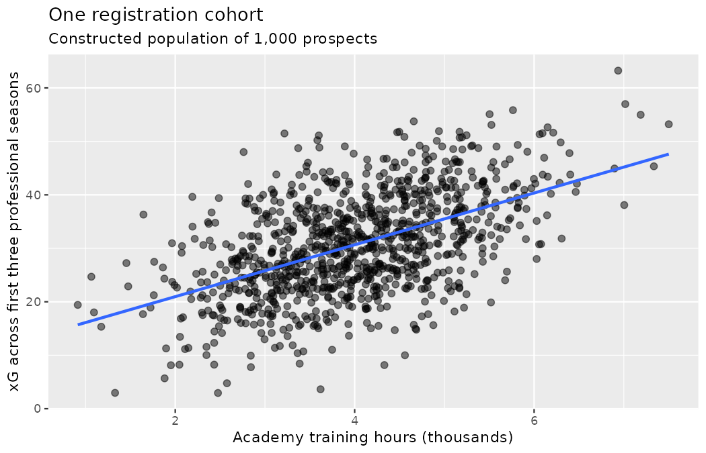{fig-alt="Scatterplot of the constructed population of 1,000 academy prospects, showing xG across the first three professional seasons against academy training hours. The points form a strong, positive, linear cloud with the fitted population line climbing steadily through the middle." width=85%}

The 1,000 points form a strong, positive, linear cloud: training hours run from roughly 0.9 to 7.5 thousand, three-season xG output from about 3 to 63, and the fitted line climbs steadily through the middle.

You may remember from @sec-model-slr that the population model is: $$y = \beta_0 + \beta_1 x + \varepsilon.$$

One new symbol has appeared, so take it apart before using it: $\varepsilon$ is the Greek letter *epsilon*, and it plays at the population level exactly the role the residual $e_i$ of @sec-resids played in the sample — the part of $y$ the line does not capture.
The pairing is the same Greek-for-population, Roman-for-sample convention that matches $\beta_1$ with $b_1$: the population line misses each individual by some error $\varepsilon$, and our fitted line's residuals $e_i$ are the sample-level shadows of those errors.

The omniscient federation (with the full population information) can write down the true population model, fit to all 1,000 prospects:

```r
coef(lm(xg3 ~ hours, data = prospects))
#> (Intercept)       hours
#>   11.266012    4.846277
```

$$\texttt{expected 3-season xG} = 11.27 + 4.85 \times \texttt{training hours (thousands)}.$$

### Variability of the statistic

Unfortunately, in our scenario, the federation will not part with the full database.
Under its data-sharing agreement, a club preparing a recruitment case — say, Marta Vidal deciding how heavily Northbridge should weight academy training volume — can request a random sample of just 20 prospects.

As with any numerical characteristic which describes a subset of the population, the estimated slope of a sample will vary from sample to sample.
The least squares regression model uses the data to find a sample linear fit, in the notation of @sec-model-slr: $$\hat{y} = b_0 + b_1 x.$$

The code below draws two random samples of 20 prospects and fits a line to each.

```r
set.seed(2403)
sample20_a <- prospects |> slice_sample(n = 20)
sample20_b <- prospects |> slice_sample(n = 20)

round(coef(lm(xg3 ~ hours, data = sample20_a)), 2)
#> (Intercept)       hours
#>       -5.71        8.38
round(coef(lm(xg3 ~ hours, data = sample20_b)), 2)
#> (Intercept)       hours
#>        9.84        5.28
```

Both sample fits show the positive linear trend of the population, but they are visibly different lines: the first sample happened to catch points that tilt its line to a slope of $8.38$ — nearly twice the true $4.85$ — while the second landed at $5.28.$
Plotted over one another, the two lines cross inside the data cloud and fan apart at the edges.
That is, there is **variability of the slope**: the regression line changes from sample to sample.
The concept of sampling variability is something you have seen before — for $\hat{p}$ in @sec-foundations-randomization, for $\bar{x}$ in @sec-inference-one-mean — but in this chapter you will focus on the variability of the line, usually measured through the variability of a single statistic: **the slope of the line**.

The code below fits least squares lines to 50 more random samples of 20 and draws them on one plot, with the population line on top.

```r
prospects_50 <- prospects |> rep_slice_sample(n = 20, reps = 50)

ggplot() +
  geom_smooth(
    data = prospects_50,
    aes(x = hours, y = xg3, group = replicate),
    method = "lm", se = FALSE, fullrange = TRUE,
    color = "gray", linewidth = 0.5
  ) +
  geom_smooth(
    data = prospects,
    aes(x = hours, y = xg3),
    method = "lm", se = FALSE, fullrange = TRUE, color = "red"
  ) +
  labs(
    x = "Academy training hours (thousands)",
    y = "xG across first three professional seasons",
    title = "One registration cohort",
    subtitle = "Least squares lines from 50 random samples of 20 prospects"
  )
```

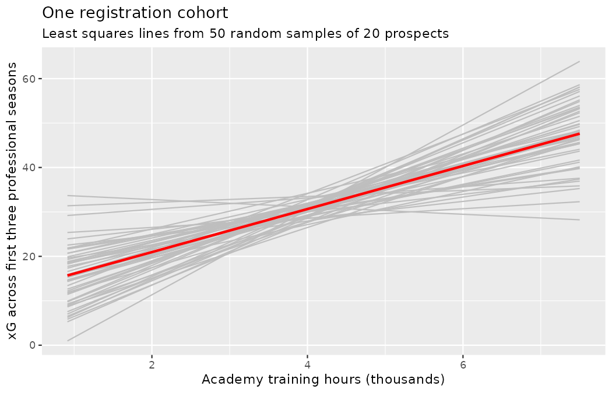{fig-alt="Least squares lines from 50 random samples of 20 prospects drawn in gray over the red population line. The gray lines form a bow-tie shape: tightly bundled in the middle of the data and splayed wide at the extremes." width=85%}

The 50 gray lines form a bow-tie around the red population line: tightly bundled in the middle of the data, splayed wide at the extremes.

::: {.callout-tip title="Check your understanding"}
You might notice that the $\hat{y}$ values given by the 50 lines are much more consistent in the middle of the dataset than at the ends.
Why?
And what does the shape imply for a scout using one sample's line to predict the output of a prospect with 6,500 training hours rather than 4,000?

------------------------------------------------------------------------

The data anchor each line: a least squares line must pass through the center of its own data cloud (recall from @sec-least-squares-regression that it passes through $(\bar{x}, \bar{y})$), so all 50 lines are pinned near the middle, where most prospects live, and free to tilt at the edges.
The effect of the fan-shaped lines is that predicted three-season xG for prospects near 4,000 training hours will be much more precise than predictions made for prospects with 1,500 or 6,500 hours — the sample-to-sample disagreement is largest exactly where the extrapolation-shy scout of @sec-model-slr already knew to tread carefully.
:::

The distribution of slopes (for samples of size $n = 20$) can be seen in the histogram drawn by the code below.

```r
prospects_50_slopes <- prospects_50 |>
  group_by(replicate) |>
  group_modify(~ tidy(lm(xg3 ~ hours, data = .x))) |>
  filter(term == "hours")

round(c(mean = mean(prospects_50_slopes$estimate),
        sd   = sd(prospects_50_slopes$estimate),
        min  = min(prospects_50_slopes$estimate),
        max  = max(prospects_50_slopes$estimate)), 2)
#>  mean    sd   min   max
#>  4.85  2.10 -0.83  9.55

ggplot(prospects_50_slopes, aes(x = estimate)) +
  geom_histogram(binwidth = 1) +
  labs(
    x = "Slope estimate",
    y = "Count",
    title = "Slopes from 50 random samples of 20 prospects"
  )
```

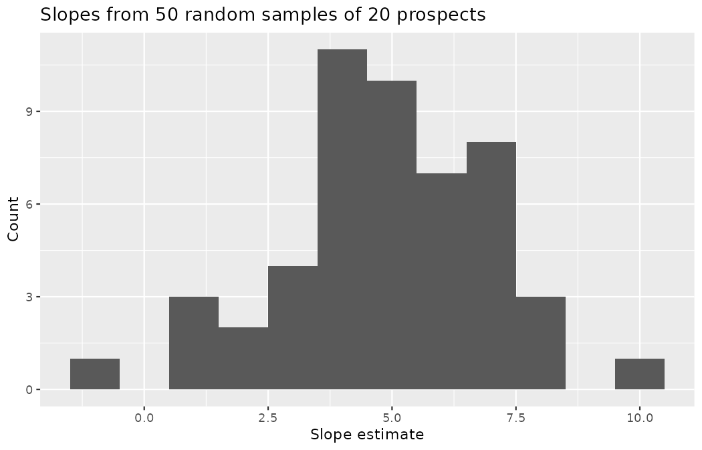{fig-alt="Histogram of the slope estimates from 50 random samples of 20 prospects: a reasonably bell-shaped heap centered near the true slope of 4.85, ranging from about -0.83 to 9.55." width=85%}

The 50 slope estimates pile up in a reasonably bell-shaped heap around the true slope of $4.85$, with a standard deviation of $2.10$ — and they range all the way from $-0.83$ to $9.55.$
Sit with that minimum for a moment: in a population where the true relationship is strongly positive, one honest random sample of 20 prospects produced a *negative* fitted slope.
A scout holding only that sample would have reported, in good faith, that academy hours do not pay off.

Recall that the example described in this case study is constructed.
That is, we created an entire population in order to demonstrate how the slope of a line would vary from sample to sample.
The tools in this textbook are designed to evaluate only one single sample of data.
With actual studies, we do not have repeated samples, so we are not able to use repeated samples to visualize the variability in slopes.
We have seen variability in samples throughout this text, so it should not come as a surprise that different samples will produce different linear models.
However, it is nice to visually consider the linear models produced by different slopes.
Additionally, as with measuring the variability of previous statistics (e.g., $\bar{x}_1 - \bar{x}_2$ in @sec-inference-two-means or $\hat{p}_1 - \hat{p}_2$ in @sec-inference-two-props), the histogram of the sample statistics can provide information related to inferential considerations.

In the following sections, the distribution (i.e., histogram) of $b_1$ (the estimated slope coefficient) will be constructed in the same three ways that, by now, are familiar to you.
First (in @sec-randslope), the distribution of $b_1$ when $\beta_1 = 0$ is constructed by randomizing (permuting) the response variable.
Next (in @sec-bootbeta1), we can bootstrap the data by taking random samples of size $n$ from the original dataset.
And last (in @sec-mathslope), we use mathematical tools to describe the variability using the $t$-distribution that was first encountered in @sec-one-mean-math.

## Randomization test for the slope {#sec-randslope}

Back, now, to real football and to the workhorse object of this book.
Recall the `team_match` dataset: one row per team per match at the 2022 Men's World Cup, aggregating that team's shots into counts, accumulated chance quality, and goals.
In @sec-model-slr we fit its flagship line — goals on total xG — and read the slope of $0.909$ as *this tournament's* exchange rate between chance quality and goals.
The inferential question we can now ask is the one Marta Vidal would put to any exchange rate: is it real, or could a slope that size arise from chance alone?

::: {.callout-note title="Data"}
The `team_match` data are derived from `data/derived/wc2022_shots.csv` (StatsBomb open data), rebuilt below with the same code as in @sec-explore-numerical and @sec-model-slr.
One honesty note travels with the object, per this book's penalty convention: the shot log includes in-game penalties and the shoot-out kicks of drawn knockout ties, so both `total_xg` and `goals` count them — on both sides of the model.
We keep the full log because `team_match` is the book's canonical object, and we read the model as describing *recorded attempts*, not only the run of play.
:::

```r
wc2022_shots <- read_csv("data/derived/wc2022_shots.csv")

team_match <- wc2022_shots |>
  group_by(match_id, team) |>
  summarize(
    n_shots = n(),
    total_xg = sum(statsbomb_xg),
    goals = sum(goal),
    prop_under_pressure = mean(under_pressure),
    prop_set_piece = mean(play_pattern %in%
      c("From Corner", "From Free Kick", "From Throw In")),
    .groups = "drop"
  )

nrow(team_match)
#> [1] 127
```

As always, 127 rows: Costa Rica's shotless outing against Spain is the one missing team-match.
The dataset is rich enough to offer several candidate predictors of a team's goals in a match.
The code below plots goals against four of them side by side.

```r
library(patchwork)

p_shots <- ggplot(team_match, aes(x = n_shots, y = goals)) +
  geom_jitter(height = 0.1, alpha = 0.6) +
  labs(x = "Number of shots", y = "Goals")
p_press <- ggplot(team_match, aes(x = prop_under_pressure, y = goals)) +
  geom_jitter(height = 0.1, alpha = 0.6) +
  labs(x = "Share of shots under pressure", y = "Goals")
p_setp <- ggplot(team_match, aes(x = prop_set_piece, y = goals)) +
  geom_jitter(height = 0.1, alpha = 0.6) +
  labs(x = "Share of shots from set pieces", y = "Goals")
p_xg <- ggplot(team_match, aes(x = total_xg, y = goals)) +
  geom_jitter(height = 0.1, alpha = 0.6) +
  labs(x = "Total xG", y = "Goals")

p_shots + p_press + p_setp + p_xg + plot_layout(ncol = 2)

team_match |>
  summarize(
    r_shots    = cor(goals, n_shots),
    r_pressure = cor(goals, prop_under_pressure),
    r_setpiece = cor(goals, prop_set_piece),
    r_xg       = cor(goals, total_xg)
  )
#> # A tibble: 1 × 4
#>   r_shots r_pressure r_setpiece  r_xg
#>     <dbl>      <dbl>      <dbl> <dbl>
#> 1   0.403     -0.156     -0.272 0.691
```

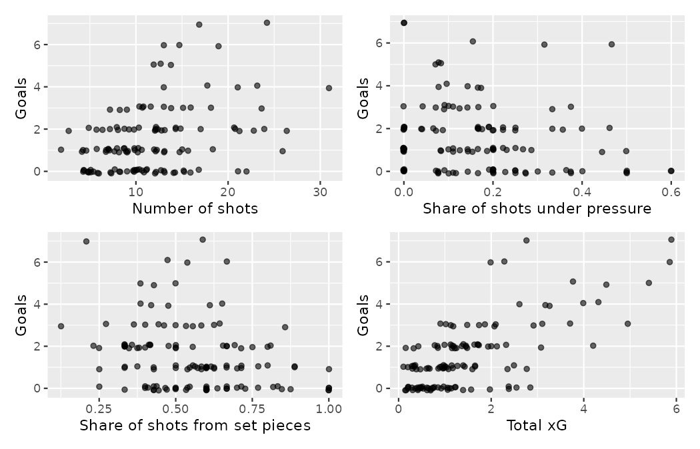{fig-alt="Four scatterplots of goals against candidate predictors across the 127 team-matches: number of shots, share of shots under pressure, share of shots from set pieces, and total xG. Total xG shows much the strongest positive relationship with goals." width=85%}

Shot volume shows a moderate positive relationship with goals $(r = 0.40),$ the two shot-mix shares drift weakly negative, and accumulated chance quality shows much the strongest linear relationship $(r = 0.691)$ — which is why `total_xg` carries the modeling weight in this book.

As you have seen previously, statistical inference typically relies on setting a null hypothesis which is hoped to be subsequently rejected.
In the linear model setting, we might hope to have a linear relationship between `total_xg` and `goals` in settings where chance quality is known and goals need to be predicted — which is precisely a scout's situation when projecting a team's output from its underlying numbers.

The relevant hypotheses for the linear model setting can be written in terms of the population slope parameter.
Here the population refers to the process that generates team performances at this level — one tournament's 127 team-matches standing in for how the sport behaves, our standard observational framing since @sec-foundations-randomization.

-   $H_0: \beta_1 = 0,$ there is no linear relationship between `goals` and `total_xg`.
-   $H_A: \beta_1 \ne 0,$ there is some linear relationship between `goals` and `total_xg`.

A candid aside before we test: nobody at Northbridge doubts which way this one will fall — a world in which accumulated chance quality told you *nothing* about goals would be a world where the "expected" in expected goals had failed spectacularly.
The value of running the test on this model is that you will see the machinery work on a relationship you trust, before we point it at relationships you should not trust (they arrive in @sec-bootbeta1 and @sec-mathslope).

Recall that for the randomization test, we permute one variable to eliminate any existing relationship between the variables.
That is, we set the null hypothesis to be true, and we measure the natural variability in the data due to sampling but **not** due to variables being correlated.
The code below permutes the `goals` column once and plots the result next to the original data.

```r
set.seed(2404)
team_match_perm1 <- team_match |>
  mutate(goals_permuted = sample(goals))

p_original <- ggplot(team_match, aes(x = total_xg, y = goals)) +
  geom_point(alpha = 0.6) +
  labs(x = "Total xG", y = "Goals", title = "Original data")

p_permuted <- ggplot(team_match_perm1, aes(x = total_xg, y = goals_permuted)) +
  geom_point(alpha = 0.6) +
  labs(x = "Total xG", y = "Permuted goals", title = "Permuted data")

p_original + p_permuted
```

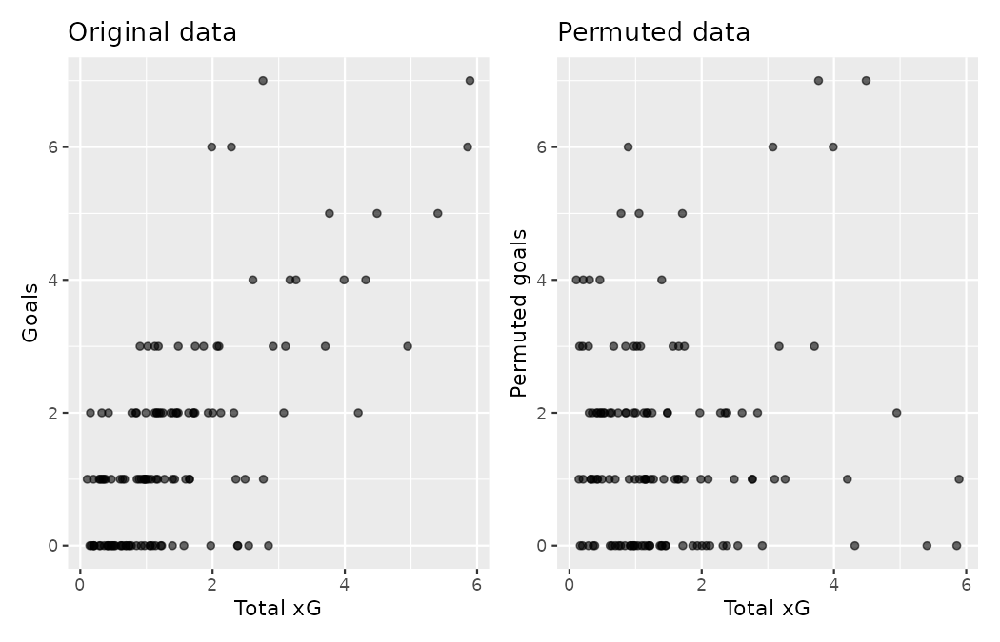{fig-alt="Two scatterplots side by side: the original data show goals sweeping upward with total xG, while in the permuted data the pairing is broken and the cloud becomes a formless band." width=85%}

The careful observer can see that each of the observed values for `goals` (and for `total_xg`) exists in both plots, but the pairing has been broken: each goal count is randomly reassigned to a new team-match's chance quality.
Spain's 7 goals might now sit on a $0.5$-xG performance; Canada's 0 on a $3$-xG one.
The upward sweep of the original cloud is gone — the permuted panel is a formless band.

By repeatedly permuting the response variable, any pattern in the linear model that is observed is due only to random chance (and not an underlying relationship).
The **randomization test for the slope** compares the slopes calculated from the permuted response variable with the observed slope.
If the observed slope is inconsistent with the slopes from permuting, we can conclude that there is some underlying relationship (and that the slope is not merely due to random chance).
And one caution, held over from @sec-chp11-observational: since nobody randomly assigned chance quality to teams, this is a permutation test on observational data — a rejected null will speak of association, not causation.

### Observed data

We will continue to use the `team_match` data to investigate the linear relationship between `goals` and `total_xg`.
The least squares model (see @sec-model-slr) describing the relationship is computed below and given in @tbl-ls-teammatch.
The columns of @tbl-ls-teammatch are further described in @sec-mathslope.

```r
fit_goals <- lm(goals ~ total_xg, data = team_match)
tidy(fit_goals)
#> # A tibble: 2 × 5
#>   term        estimate std.error statistic  p.value
#>   <chr>          <dbl>     <dbl>     <dbl>    <dbl>
#> 1 (Intercept)    0.190    0.163       1.17 2.45e- 1
#> 2 total_xg       0.909    0.0849     10.7  2.31e-19
```

| term        | estimate | std.error | statistic | p.value |
|:------------|---------:|----------:|----------:|--------:|
| (Intercept) |     0.19 |      0.16 |      1.17 |  0.2446 |
| total_xg    |     0.91 |      0.08 |     10.70 | <0.0001 |

: The least squares estimates of the intercept and slope for goals regressed on total xG across the 127 World Cup team-matches. The observed slope is 0.909. {#tbl-ls-teammatch}

::: {.callout-tip title="Check your understanding"}
Before the shuffling starts, confirm the fitted line still reads the way @sec-resids taught — data = fit + residual, one row at a time.
England's group-stage team-match against Iran carried an accumulated chance quality of 1.99 xG and produced 6 goals:

```r
team_match |>
  filter(team == "England", goals == 6) |>
  select(team, total_xg, goals)
#> # A tibble: 1 × 3
#>   team    total_xg goals
#>   <chr>      <dbl> <int>
#> 1 England     1.99     6
```

Use the estimates in @tbl-ls-teammatch to compute the fitted value and the residual for this row, and read both numbers in the created-versus-finished vocabulary of @sec-model-slr.

------------------------------------------------------------------------

The fitted value prices what England *created*: $\hat{y} = 0.190 + 0.909 \times 1.99 = 2.00$ goals' worth of chances.
The residual is the decomposition of @sec-resids applied to a single afternoon: $e = y - \hat{y} = 6 - 2.00 = 4.00.$
In scouting vocabulary, England created roughly two goals of chance quality and *finished* six — a four-goal finishing over-performance, among the largest at the tournament, and a quantity a scout files under finishing, not chance creation.
The inference that follows never touches this reading: the permutation test will interrogate the *slope* — the created-to-finished exchange rate across all 127 rows — while each residual keeps the job @sec-resids gave it, measuring who beat their chances.
:::

### Variability of the statistic

After permuting the data, the least squares estimate of the line can be computed.
Repeated permutations and slope calculations describe the variability in the line (i.e., in the slope) due only to the natural variability and not due to a relationship between `goals` and `total_xg`.
The code below runs two fresh permutations and fits a line to each.

```r
set.seed(2405)
team_match_perm2 <- team_match |> mutate(goals_permuted = sample(goals))
team_match_perm3 <- team_match |> mutate(goals_permuted = sample(goals))

round(c(
  slope_first  = unname(coef(lm(goals_permuted ~ total_xg, data = team_match_perm2))[2]),
  slope_second = unname(coef(lm(goals_permuted ~ total_xg, data = team_match_perm3))[2])
), 3)
#>  slope_first slope_second
#>       -0.025       -0.060
```

As you can see, sometimes the slope of the permuted data is positive, sometimes it is negative — here two shuffles happened to produce two small negative slopes, and further shuffles produce small positive ones.
Because the randomization happens under the condition of no underlying relationship (the response variable is completely mixed with the explanatory variable), we expect the center of the randomized slope distribution to be zero.

### Observed statistic vs. null statistics

The **infer** pipeline you have used since @sec-foundations-randomization computes 1,000 permuted slopes; the only novelty is `calculate(stat = "slope")`.

```r
set.seed(2406)
xg_slope_null <- team_match |>
  specify(goals ~ total_xg) |>
  hypothesize(null = "independence") |>
  generate(reps = 1000, type = "permute") |>
  calculate(stat = "slope")

obs_slope <- team_match |>
  specify(goals ~ total_xg) |>
  calculate(stat = "slope") |>
  pull() |>
  unname()
round(obs_slope, 4)
#> [1] 0.9087

ggplot(xg_slope_null, aes(x = stat)) +
  geom_histogram(binwidth = 0.05) +
  geom_vline(xintercept = obs_slope, color = "red") +
  labs(x = "Randomly generated slopes", y = "Count")

xg_slope_null |>
  summarize(
    min_slope = min(stat),
    max_slope = max(stat),
    n_extreme = sum(abs(stat) >= obs_slope)
  )
#> # A tibble: 1 × 3
#>   min_slope max_slope n_extreme
#>       <dbl>     <dbl>     <int>
#> 1    -0.305     0.406         0
```

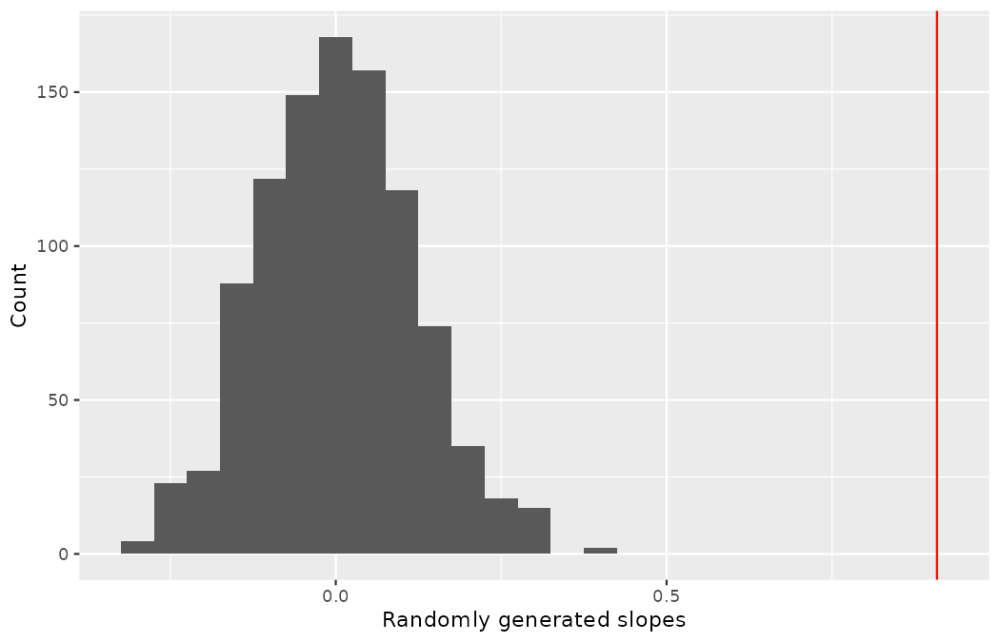{fig-alt="Histogram of 1,000 randomly generated slopes from permuting the goals variable, centered at zero and running from about -0.31 to +0.41, with a red vertical line marking the observed slope of 0.909 far to the right of the histogram." width=85%}

A slope estimate as extreme as the observed slope (the red line, far to the right of the histogram) never happened in 1,000 permutations of the `goals` variable.
That is, if there were truly no linear relationship between `goals` and `total_xg`, the natural variability of the slopes would produce estimates between approximately $-0.31$ and $+0.41.$
The observed $0.909$ is nowhere near that range.
We reject the null hypothesis and conclude that the slope observed in the original data is not due to natural variability: across team performances at this level, accumulated chance quality and goals scored are genuinely, linearly related.

::: {.callout-tip title="Check your understanding"}
None of the 1,000 permuted slopes reached the observed value.
Is the p-value therefore zero?
How should the result be reported — and what, precisely, is the scouting content of the conclusion?

------------------------------------------------------------------------

The p-value is not zero — a permuted slope of $0.909$ is not impossible, merely so rare that 1,000 shuffles never produced one.
The honest report is $p < 1/1000,$ or "p-value $< 0.001$": the resolution of a simulated p-value is limited by the number of permutations, a subtlety you first met with the seeded runs of @sec-foundations-randomization.
As for content: the test confirms *that* the relationship exists; the scouting substance lives in the estimate itself — a slope of $0.909,$ within touching distance of 1, is the tournament pricing one unit of accumulated xG at almost exactly one goal, the "expected" in expected goals earning its name.
The remainder of this chapter builds the interval machinery that says how precisely that exchange rate is pinned down.
:::

## Bootstrap confidence interval for the slope {#sec-bootbeta1}

As we have seen in previous chapters, we can use bootstrapping to estimate the sampling distribution of the statistic of interest (here, the slope) without the null assumption of no relationship (which was the condition in the randomization test); the resulting interval is a **bootstrap confidence interval for the slope**.
Because interest is now in creating a CI, there is no null hypothesis, so there won't be any reason to permute either of the variables.

### Observed data

At the end of @sec-fit-line-res-cor, a seductive scouting story was left dangling.
Across all 1,494 World Cup shots, chance quality correlates at $r = 0.238$ with the match clock — "chances get better as the match wears on!", says the fatigue-drift theory: tired defenders close down later, gaps open, the shots that arrive in minute 85 should be fatter than those of minute 5.
But @sec-model-slr also showed you the trap in that headline number, and this book's penalty convention (recall @sec-chp11-pens-out) makes the frame decision for us: the all-shots log ends with shoot-out penalties — maximal-xG kicks stamped at the very end of the clock — and sprinkles in-game penalties, awarded by fouls rather than fatigue, along the way.
If the question is about the run of play, the frame is open play, stated up front: `shot_type == "Open Play"`, 1,382 shots.

```r
open_play <- wc2022_shots |>
  filter(shot_type == "Open Play")

open_play |>
  summarize(n = n(), r = cor(statsbomb_xg, minute))
#> # A tibble: 1 × 2
#>       n      r
#>   <int>  <dbl>
#> 1  1382 0.0299
```

On the honest frame the correlation collapses to $r = 0.0299$ — but a correlation near zero in one sample does not by itself kill the theory.
Is `minute` a useful predictor of `statsbomb_xg`?
And if so, what is the relationship — how much chance quality does a minute of match clock buy?
The linear model regressing chance quality on the clock is provided in @tbl-ls-minute.

```r
ggplot(open_play, aes(x = minute, y = statsbomb_xg)) +
  geom_point(alpha = 0.3) +
  geom_smooth(method = "lm", se = FALSE) +
  labs(x = "Minute of the match", y = "Chance quality (xG)")

fit_minute <- lm(statsbomb_xg ~ minute, data = open_play)
tidy(fit_minute)
#> # A tibble: 2 × 5
#>   term        estimate std.error statistic  p.value
#>   <chr>          <dbl>     <dbl>     <dbl>    <dbl>
#> 1 (Intercept) 0.0913    0.00712      12.8  1.20e-35
#> 2 minute      0.000131  0.000118      1.11 2.67e- 1
```

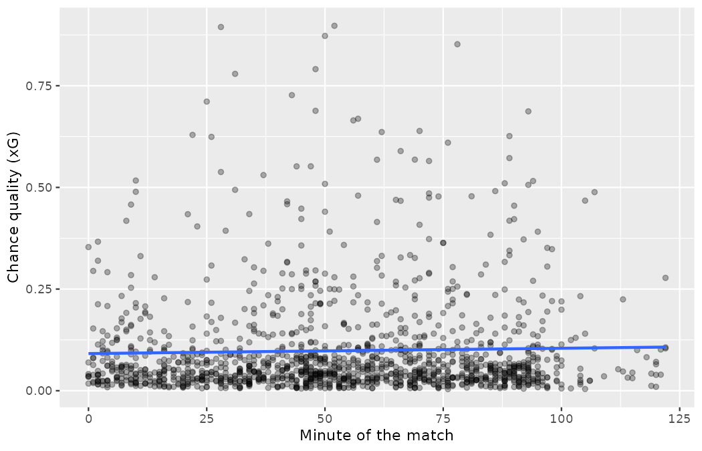{fig-alt="Scatterplot of open-play chance quality against the minute of the match: a nearly flat smear of right-skewed xG values at every point of the clock, with the fitted line drifting upward only very slightly." width=85%}

| term        | estimate | std.error | statistic | p.value |
|:------------|---------:|----------:|----------:|--------:|
| (Intercept) |  0.09135 |   0.00712 |     12.82 | <0.0001 |
| minute      |  0.00013 |   0.00012 |      1.11 |  0.2667 |

: The least squares estimates for open-play chance quality regressed on the minute of the match. The observed slope is 0.00013. {#tbl-ls-minute}

The scatterplot is a nearly flat smear — the right-skewed xG values you know from @sec-explore-numerical, at every point of the clock — and the fitted line drifts upward at $0.00013$ xG per minute.
Notice that the relationship between the clock and chance quality is nowhere near as strong as the relationship we saw between chance quality and goals.

### Variability of the statistic

Because the focus here is *not* on a null distribution, we sample with replacement $n = 1{,}382$ observations from the original dataset.
Recall that with bootstrapping the resample always has the same number of observations as the original dataset in order to mimic the process of taking a sample from the population.
When sampling in the linear model case, consider each observation to be a single dot: if the dot is resampled, *both* the `minute` and the `statsbomb_xg` measurement come along, because the measurements are linked to the dot (i.e., to the shot itself).
We resample rows, never columns.

```r
set.seed(2407)
open_play_boot1 <- open_play |>
  slice_sample(n = 1382, replace = TRUE)

nrow(distinct(open_play_boot1))
#> [1] 873

round(coef(lm(statsbomb_xg ~ minute, data = open_play_boot1)), 5)
#> (Intercept)      minute
#>     0.09014     0.00020
```

Plotted side by side, the original data and this bootstrap sample are difficult to tell apart — resampled shots land exactly on top of their originals.
The counts give the game away: only 873 distinct shots appear in the resample, meaning 509 of the original shots were left out while others were drawn two, three, or more times — the signature of sampling with replacement you first saw with the trialists of @sec-foundations-bootstrapping.
And the resampled line is a slightly different line: slope $0.00020$ instead of $0.00013.$

::: {.callout-tip title="Check your understanding"}
In @sec-randslope we shuffled one column; here we resample whole rows.
Why the difference?

------------------------------------------------------------------------

Permuting the response *breaks* the pairing on purpose: it manufactures the null world in which $\beta_1 = 0,$ which is exactly what a hypothesis test needs to calibrate against.
Bootstrapping has no null hypothesis to enforce — it must *preserve* the observed relationship, so each resampled dot keeps its (`minute`, `statsbomb_xg`) pair intact, and the variation across resamples estimates how the slope would vary from sample to sample.
Shuffle to destroy, resample to preserve.
:::

Repeating this resampling, the code below overlays fifty bootstrapped regression lines.

```r
set.seed(2408)
open_play_boot50 <- open_play |>
  rep_slice_sample(n = 1382, replace = TRUE, reps = 50)

boot50_slopes <- open_play_boot50 |>
  group_by(replicate) |>
  group_modify(~ tidy(lm(statsbomb_xg ~ minute, data = .x))) |>
  filter(term == "minute")

round(range(boot50_slopes$estimate), 5)
#> [1] -0.00006  0.00038

ggplot(open_play_boot50, aes(x = minute, y = statsbomb_xg, group = replicate)) +
  geom_smooth(method = "lm", se = FALSE, color = "steelblue",
              linewidth = 0.5, alpha = 0.3, fullrange = TRUE) +
  labs(x = "Minute of the match", y = "Chance quality (xG)")
```

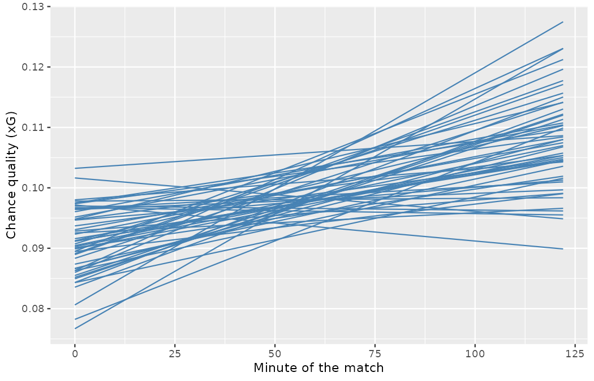{fig-alt="Fifty bootstrapped regression lines for open-play chance quality on the minute of the match, overlaid in blue. The slopes range from -0.00006 to +0.00038, so some of the resampled lines drift down while others drift up." width=85%}

Already the key fact is visible: the fifty bootstrapped slopes run from $-0.00006$ to $+0.00038$ — some of the resampled lines drift *down*.
Recall that in order to create a confidence interval for the slope, we need the range of values the statistic takes on across many bootstrap samples.
The code below runs 1,000.

```r
set.seed(2409)
minute_boot_slopes <- open_play |>
  specify(statsbomb_xg ~ minute) |>
  generate(reps = 1000, type = "bootstrap") |>
  calculate(stat = "slope")

ggplot(minute_boot_slopes, aes(x = stat)) +
  geom_histogram(binwidth = 0.00005) +
  labs(
    x = "Bootstrapped values of the slope for predicting open-play xG from the minute",
    y = "Count"
  )

round(quantile(minute_boot_slopes$stat, c(0.025, 0.975)), 5)
#>     2.5%    97.5%
#> -0.00007  0.00034
```

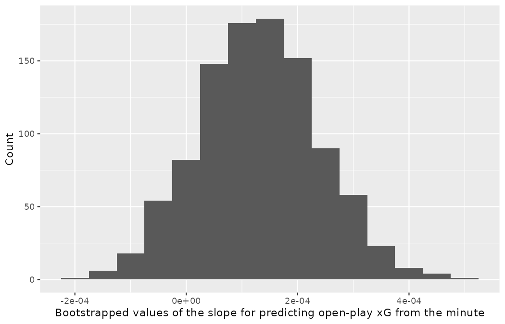{fig-alt="Histogram of 1,000 bootstrapped slopes for predicting open-play xG from the minute of the match: symmetric and bell-shaped, with the middle 95% running from -0.00007 to +0.00034." width=85%}

The histogram of bootstrapped slopes is symmetric and bell-shaped, and the middle 95% of it — the bootstrap percentile interval of @sec-foundations-bootstrapping, applied to a slope — runs from $-0.00007$ to $+0.00034.$
We are 95% confident that for the model describing the population of open-play shots at this level, predicting chance quality from the minute of the match, one additional minute of match clock is associated with a change in predicted average chance quality of between $-0.00007$ and $+0.00034$ xG.
Notice that the confidence interval contains zero, so the true relationship *might* be null!

Translate the endpoints into football before moving on.
Even taking the interval's most generous edge, ninety minutes of fatigue would raise the average open-play chance by $90 \times 0.00034 \approx 0.03$ xG — three hundredths of a goal — while the other edge says the drift may just as plausibly be slightly *downhill*.
The fatigue-drift story did not survive contact with its own confidence interval: what looked like signal in the all-shots frame was, once again, mostly penalties, and what remains is statistically indistinguishable from a flat line.
That is the point of this section, and it is a general scouting discipline: a story is only as good as an interval that excludes the boring answer.

::: {.callout-note title="Worked example"}
Using the bootstrapped slopes in `minute_boot_slopes`, calculate the bootstrap estimate for the standard error of the slope.
Using the bootstrap standard error, find a 95% bootstrap SE confidence interval for the true population slope, and interpret the interval in context.

------------------------------------------------------------------------

Notice that most of the bootstrapped slopes fall between $-0.00008$ and $+0.00034$ (a range of about $0.00042$).
Using the empirical rule from @sec-explore-numerical (with bell-shaped distributions, most observations are within two standard errors of the center), the standard error of the slopes is approximately $0.0001.$
The direct computation agrees:

```r
round(sd(minute_boot_slopes$stat), 5)
#> [1] 0.00011
```

The critical value for a 95% confidence interval is $z^{\star} = 1.96$ (recall from @sec-boot1mean that bootstrap SE intervals in this book keep the normal cutoffs), which leads to a confidence interval of
$$b_1 \pm 1.96 \cdot SE \rightarrow 0.00013 \pm 1.96 \cdot 0.00011 \rightarrow (-0.00009, 0.00035).$$
The bootstrap SE interval is almost identical to the bootstrap percentile interval — the bell-shaped histogram is exactly the situation where the two constructions agree (contrast the five-shot fiasco of @sec-boot1mean, where they did not).
In context: we are 95% confident that one additional minute of match clock is associated with a change in predicted average open-play chance quality of between $-0.00009$ and $+0.00035$ xG.
Zero sits comfortably inside — the interval politely declines to endorse the fatigue-drift theory.
:::

## Mathematical model for testing the slope {#sec-mathslope}

When certain technical conditions apply, it is convenient to use mathematical approximations to test and estimate the slope parameter.
The approximations will build on the $t$-distribution which was described in @sec-one-mean-math, and the **t-distribution for the slope** works remarkably like the one for a single mean.
The mathematical model is often correct and is usually easy to implement computationally.
The validity of the technical conditions will be considered in detail in @sec-tech-cond-linmod.

In this section, we discuss uncertainty in the estimates of the slope and y-intercept for a regression line.
Just as we identified standard errors for point estimates in previous chapters, we start by discussing standard errors for these estimates, and one new subscript carries the whole idea: $SE_{b_1}$ is the familiar standard error of @sec-foundations-mathematical — the standard deviation of a statistic from sample to sample — with the subscript naming *which* statistic's variability is meant: the slope estimate $b_1.$
The fan of fifty gray lines in the federation case study is the picture; $SE_{b_1}$ is its number.
(Likewise $SE_{b_0}$ for the intercept; in general $SE_{b_i},$ where the index $i$ picks out coefficient $i.$)

### Observed data

**Goal margins and shooting under pressure**

Here is a theory Emil Sørensen hears in some form after every international window: "tight matches are pressure matches."
When defenders contest a high share of the shots, the theory runs, the match stays close — so the share of a match's shots taken under defensive pressure should predict the final margin, and a scouting department that believed this could grade fixture difficulty from pressure counts alone.
The 2022 Men's World Cup's 64 matches can put the theory on trial.

::: {.callout-note title="Data"}
Margins come from `data/derived/wc2022_matches.csv`: the absolute difference of the recorded final scores, which cover regulation and extra time but not shoot-outs.
The pressure share for each match is computed from `data/derived/wc2022_shots.csv` on the open-play frame, stated per this book's penalty convention: a penalty kick cannot be contested by law, and the shoot-out kicks of drawn knockout ties would flood eight matches' denominators with uncontestable shots.
(StatsBomb open data.)
:::

```r
wc2022_matches <- read_csv("data/derived/wc2022_matches.csv")

match64 <- wc2022_matches |>
  mutate(margin = abs(home_score - away_score)) |>
  left_join(
    wc2022_shots |>
      filter(shot_type == "Open Play") |>
      group_by(match_id) |>
      summarize(prop_pressured = mean(under_pressure)),
    by = "match_id"
  )

match64 |>
  summarize(
    matches = n(),
    mean_margin = mean(margin),
    r = cor(margin, prop_pressured)
  )
#> # A tibble: 1 × 3
#>   matches mean_margin       r
#>     <int>       <dbl>   <dbl>
#> 1      64        1.41 -0.0726

ggplot(match64, aes(x = prop_pressured, y = margin)) +
  geom_jitter(height = 0.08, alpha = 0.7) +
  geom_smooth(method = "lm", se = FALSE, fullrange = TRUE) +
  labs(
    x = "Share of the match's open-play shots taken under pressure",
    y = "Goal margin"
  )
```

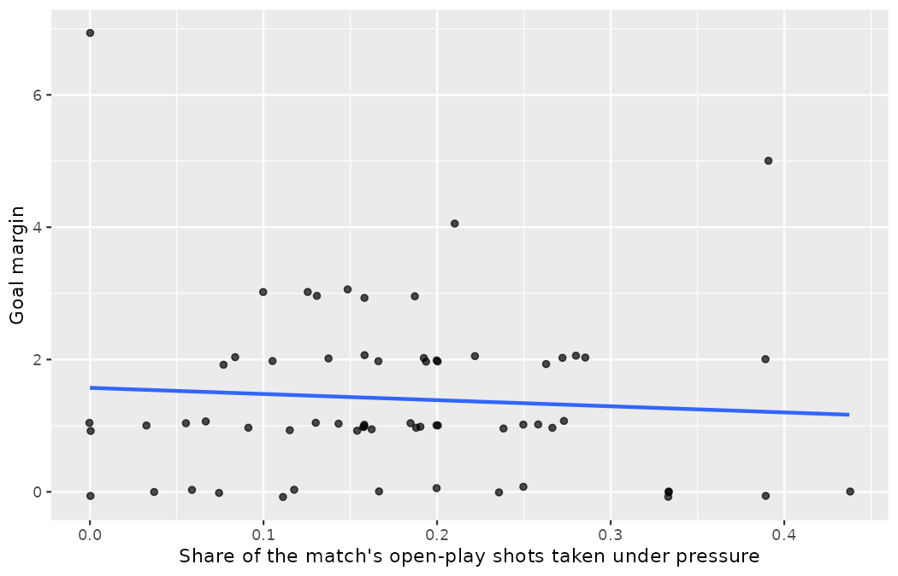{fig-alt="Scatterplot of goal margin against the share of the match's open-play shots taken under pressure for the 64 World Cup matches, with margins from 0 to 7 and the least squares line drifting gently downhill." width=85%}

The 64 points scatter with margins from 0 to 7 and pressure shares from 0 to 0.44, and the least squares line drifts gently downhill:

$$
\widehat{\texttt{margin}} = 1.57 - 0.93 \times \texttt{pressure share}
$$

The direction at least agrees with the theory — more contested shooting, slightly tighter matches — but the drift is shallow $(r = -0.073),$ and 64 matches is not a large sample.
Examining the data, there are no clear deviations from linearity (see @sec-resids for using residuals to judge fit); the matches were played by rotating casts of teams across a single tournament, and we will treat the 64 margins as independent observations of tournament football at this level.

::: {.callout-tip title="Check your understanding"}
Two matches stand apart from the rest of the cloud: the tournament's only blowouts of five or more.

```r
match64 |>
  filter(margin >= 5) |>
  select(home_team, away_team, stage, margin, prop_pressured)
#> # A tibble: 2 × 5
#>   home_team away_team   stage       margin prop_pressured
#>   <chr>     <chr>       <chr>        <dbl>          <dbl>
#> 1 Portugal  Switzerland Round of 16      5          0.391
#> 2 Spain     Costa Rica  Group Stage      7          0
```

Notice where they sit: Spain's 7--0 played out with *none* of the open-play shots pressured — the extreme left edge of the x-axis — while Portugal's 6--1 sits close to the extreme right at a pressure share of 0.391.
Should these two matches be removed from the analysis?

------------------------------------------------------------------------

The answer relies on the idea that statistical data analysis is somewhat of an art: in many situations, there is no single "right" answer, and the judgment sharpens only with practice.
Two contrasting considerations, in the language of @sec-outliers-in-regression.
On one hand, both blowouts are extreme in the response, and each also sits at an edge of the predictor's range — high-leverage positions from which a single match can pull hard on a least squares line fit to only 64 points; margins of 5+ may not help us understand ordinary matches.
On the other hand, blowouts are real football — a recruitment department that deletes its extreme matches, like one that deletes its super-subs, systematically blinds itself to exactly the fixtures that decide tournaments.
The book's standing practice applies: present both analyses.
Removing the two blowouts moves the fitted slope from $-0.93$ to $-0.65$ (with p-value $0.62$) — the conclusion you are about to reach does not change, which is itself worth reporting.
:::

There is a negative slope in the fitted line, but this slope (and the y-intercept) are only estimates of the parameter values.
We might wonder, is this convincing evidence that the "true" linear model has a negative slope?
That is, do the data provide strong evidence that the pressure theory is accurate, where the share of contested shots is a useful predictor of the final margin?
We can frame this investigation as a statistical hypothesis test:

-   $H_0:$ $\beta_1 = 0.$ The true linear model has slope zero: a match's pressure share tells us nothing, linearly, about its margin.
-   $H_A:$ $\beta_1 \neq 0.$ The true linear model has a slope different than zero: the pressure share is predictive of how tight the match finishes.

We would reject $H_0$ in favor of $H_A$ if the data provide strong evidence that the true slope parameter is different than zero.
To assess the hypotheses, we identify a standard error for the estimate, compute an appropriate test statistic, and identify the p-value.

### Variability of the statistic

Just like other point estimates we have seen before, we can compute a standard error and test statistic for $b_1.$
We will generally label the test statistic using a $T,$ since — exactly as for the single mean in @sec-inference-one-mean — it follows the $t$-distribution once its standard error is estimated from the data.

We will rely on statistical software to compute $SE_{b_1}$ and leave the explanation of how this standard error is determined to a second or third statistics course.
@tbl-margin-pressure shows the software output for the least squares regression fit above.
The row labeled `prop_pressured` includes all relevant information about the slope estimate: the coefficient itself, its standard error, the T statistic, and the corresponding p-value.

```r
fit_margin <- lm(margin ~ prop_pressured, data = match64)
tidy(fit_margin)
#> # A tibble: 2 × 5
#>   term           estimate std.error statistic   p.value
#>   <chr>             <dbl>     <dbl>     <dbl>     <dbl>
#> 1 (Intercept)       1.57      0.332     4.74  0.0000131
#> 2 prop_pressured   -0.929     1.62     -0.573 0.569
```

| term           | estimate | std.error | statistic | p.value |
|:---------------|---------:|----------:|----------:|--------:|
| (Intercept)    |     1.57 |      0.33 |      4.74 | <0.0001 |
| prop_pressured |    -0.93 |      1.62 |     -0.57 |  0.5688 |

: Output for the regression modeling the goal margin as a response to the share of the match's open-play shots taken under pressure. {#tbl-margin-pressure}

::: {.callout-note title="Worked example"}
What do the first and second numeric columns of @tbl-margin-pressure represent?

------------------------------------------------------------------------

The entries in the `estimate` column are the least squares estimates, $b_0$ and $b_1,$ and the values in the `std.error` column are their standard errors, $SE_{b_0}$ and $SE_{b_1}.$
Using the estimates, we could write the equation for the least squares regression line as

$$ \hat{y} = 1.57 - 0.93 x $$

where $\hat{y}$ in this case represents the predicted goal margin and $x$ represents the share of the match's open-play shots taken under pressure.
The standard error column says how much each estimate would wobble from tournament to tournament — for the slope, a wobble of $1.62,$ nearly twice the size of the estimate itself.
:::

We previously used a $t$-test statistic for hypothesis testing in the context of numerical data.
Regression is very similar.
In the hypotheses we consider, the null value for the slope is 0, so we can compute the test statistic using the T score formula, exactly as in @sec-inference-one-mean:

$$
T \ = \ \frac{\text{estimate} - \text{null value}}{\text{SE}} = \ \frac{-0.93 - 0}{1.62} = \ -0.57
$$

The T score we calculated corresponds to the `statistic` column of @tbl-margin-pressure.

::: {.callout-note title="Worked example"}
Use @tbl-margin-pressure to determine the p-value for the hypothesis test, and conclude in context.

------------------------------------------------------------------------

The last column of the table gives the p-value for the two-sided hypothesis test for the coefficient of the pressure share: $0.5688.$
That is, the data do not provide convincing evidence that a higher share of contested shots has any correspondence with tighter or wider margins.
If there was no linear relationship between the two variables (i.e., if $\beta_1 = 0$), then we would expect to see linear models as or more extreme than the observed one roughly 57% of the time.
Check complete: the on-field call — "pressure share tells you nothing about margins" — stands, which, per @sec-foundations-randomization, is not the same as proving it correct.
Emil's fixture-difficulty shortcut should not ship.
:::

Per the penalty convention, the same test was rerun with the pressure share computed on all shots (penalties and shoot-out kicks included): the slope becomes $-0.77$ with a p-value of $0.658.$
Both frames return the same verdict here — but you only know that because both were run, and the open-play frame remains the one that matches the question.

### Observed statistic vs. null statistics

As the final step in a mathematical hypothesis test for the slope, we use the information provided to make a conclusion about whether the data could have come from a population where the true slope was zero (i.e., $\beta_1 = 0$).
Before evaluating the formal hypothesis claim, sometimes it is important to check your intuition.
Based on everything you have seen describing the variability of a line from sample to sample, ask yourself if the linear relationship given by the data could have come from a population in which the slope was truly zero.

::: {.callout-note title="Worked example"}
Recall the veteran-market survey of @sec-least-squares-regression: 50 listed strikers aged 28 and older, asking price against age, the fitted line falling at $-1.44$ million euros per year of age.
Examine that scatterplot again (or rebuild it with the code below).
Are you convinced that the slope is discernibly different from zero?
That is, do you think a formal hypothesis test would reject the claim that the true slope of the line should be zero?

------------------------------------------------------------------------

While the relationship between the variables is not perfect — the survey's correlation was $r = -0.534$ — there is an evident decreasing trend in the data: the cloud slides visibly downhill from the 28-year-olds near €17M to the 35-year-olds clustered in the low single digits, a couple of them on the €0.5M listing floor.
Such a distinct trend suggests that the hypothesis test will reject the null claim that the slope is zero.
:::

::: {.callout-note title="Data"}
The `veteran_market` data are the constructed market survey of @sec-least-squares-regression — a scouting scenario built entirely by the seeded code below (seed 701), not real listings; the code regenerates it exactly.
:::

The tools in this section help you go beyond a visual interpretation of the linear relationship toward a formal mathematical claim about whether the slope estimate is meaningfully different from 0 to suggest that the true population slope is different from 0.

```r
set.seed(701)
veteran_market <- tibble(
  age = sample(28:35, 50, replace = TRUE),
  asking_price = round(pmax(0.5, 17 - 2.0 * (age - 28) + rnorm(50, 0, 5.3)), 1)
)

fit_veteran <- lm(asking_price ~ age, data = veteran_market)
tidy(fit_veteran)
#> # A tibble: 2 × 5
#>   term        estimate std.error statistic    p.value
#>   <chr>          <dbl>     <dbl>     <dbl>      <dbl>
#> 1 (Intercept)    56.4     10.4        5.43 0.00000186
#> 2 age            -1.44     0.329     -4.37 0.0000655
```

| term        | estimate | std.error | statistic | p.value |
|:------------|---------:|----------:|----------:|--------:|
| (Intercept) |    56.44 |     10.40 |      5.43 | <0.0001 |
| age         |    -1.44 |      0.33 |     -4.37 | <0.0001 |

: Summary of the least squares fit for the veteran-market survey, predicting a listed striker's asking price (million euros) from his age. {#tbl-veteran-inference}

::: {.callout-tip title="Check your understanding"}
@tbl-veteran-inference shows the statistical software output from fitting the least squares regression line to the veteran-market survey.
Use the output to formally evaluate the following hypotheses:

-   $H_0:$ The true coefficient for age is zero.
-   $H_A:$ The true coefficient for age is not zero.

------------------------------------------------------------------------

We look in the second row, corresponding to the age variable.
The point estimate of the slope is $-1.44,$ the standard error of this estimate is $SE_{b_1} = 0.329,$ and the $t$-test statistic is $T = -4.37.$
The p-value corresponds exactly to the two-sided test we are interested in: $0.0000655,$ far below any discernibility level in use.
We reject the null hypothesis and conclude that in this veteran market, age and asking price are negatively associated and the true slope parameter is indeed less than 0 — just as our eyes suggested in the worked example above.
:::

::: {.callout-important title="Inference for regression"}
We usually rely on statistical software to identify point estimates, standard errors, test statistics, and p-values in practice.
However, be aware that software will not generally check whether the method is appropriate, meaning we must still verify that the conditions are met.
See @sec-tech-cond-linmod.
:::

## Mathematical model, interval for the slope

Similar to how we can conduct a hypothesis test for a model coefficient using regression output, we can also construct confidence intervals for the slope and intercept coefficients.

::: {.callout-important title="Confidence intervals for coefficients"}
Confidence intervals for model coefficients (e.g., the intercept or the slope) can be computed using the $t$-distribution:

$$ b_i \ \pm\ t_{df}^{\star} \times SE_{b_{i}} $$

where $t_{df}^{\star}$ is the appropriate $t^{\star}$ cutoff corresponding to the confidence level with the model's degrees of freedom, $df = n - 2.$
:::

Every piece of this formula is one you own, assembled in a new place — walk through it once.
The subscript $i$ indexes the coefficient: $i = 0$ gives an interval for the intercept, $i = 1$ for the slope, each pairing an estimate $b_i$ with *its own* standard error $SE_{b_i}$ from the regression output.
The cutoff $t^{\star}_{df}$ is the critical value you met in @sec-inference-one-mean — the star for a cutoff, the subscript recording which $t$-distribution supplied it.
What is genuinely new is the degrees of freedom: $df = n - 2,$ where the single mean used $n - 1.$
The accounting is the same as ever: the residuals must satisfy one constraint for every parameter estimated from the data, and a regression line estimates *two* — $b_0$ and $b_1$ — so of $n$ residuals only $n - 2$ are free to vary.
Each parameter you ask the data to estimate costs you one degree of freedom; a line costs two.

::: {.callout-note title="Worked example"}
Compute the 95% confidence interval for the age coefficient using the regression output from @tbl-veteran-inference.

------------------------------------------------------------------------

The point estimate is $b_1 = -1.44$ and the standard error is $SE_{b_1} = 0.33.$
When constructing a confidence interval for a model coefficient, we generally use a $t$-distribution.
The degrees of freedom are $df = n - 2 = 50 - 2 = 48,$ allowing us to identify the cutoff for 95% confidence:

```r
qt(0.975, df = 48)
#> [1] 2.010635
```

That is, $t^{\star}_{48} = 2.01.$
We can now construct the confidence interval in the usual way:

$$
\begin{aligned}
\text{point estimate} &\pm t_{48}^{\star} \times SE_{b_1} \\
-1.44 &\pm 2.01 \times 0.33 \\
(-2.10 &, -0.78)
\end{aligned}
$$

R's `confint()` agrees up to the rounding of the hand calculation:

```r
round(confint(fit_veteran, "age"), 4)
#>       2.5 %  97.5 %
#> age -2.1029 -0.7783
```

We are 95% confident that, in this veteran market, each additional year of age is associated with an asking price lower on average by between €0.78M and €2.10M.
That interval is a *pricing instrument*: when an agent quotes Marta Vidal a fee for a 33-year-old that discounts only €0.3M per year off his 30-year-old comparables, the quote sits outside anything the market survey considers plausible — and Marta can say so with a number.
:::

::: {.callout-tip title="Check your understanding"}
The 95% confidence interval $(-2.10, -0.78)$ does not contain zero, and the hypothesis test above rejected $H_0: \beta_1 = 0$ at $\alpha = 0.05.$
Coincidence?

------------------------------------------------------------------------

No — the two computations are two views of the same $t$-distribution.
A 95% confidence interval for $\beta_1$ contains exactly those null values that a two-sided test at $\alpha = 0.05$ would *fail* to reject; zero falling outside the interval and $p < 0.05$ are the same event.
(You saw the identical duality for proportions in @sec-inference-one-prop.)
Contrast the fatigue-drift model of @sec-bootbeta1: there the intervals straddled zero, and the corresponding p-value, $0.2667$ in @tbl-ls-minute, duly failed to reject.
:::

On the topic of intervals in this book, we have focused exclusively on confidence intervals for model *parameters*.
However, there are other types of intervals that may be of interest (and are outside the scope of this book), including prediction intervals for a response value — "how many goals might *this particular* team-match produce?" — and confidence intervals for a mean response value in the context of regression.

## Checking model conditions {#sec-tech-cond-linmod}

In the previous sections, we used randomization and bootstrapping to perform inference when the mathematical model was not necessarily valid due to violations of the technical conditions.
In this section, we'll provide details for when the mathematical model is appropriate and a discussion of the **technical conditions** needed for the randomization and bootstrapping procedures.
Recall from @sec-resids that residual plots can be used to visualize how well a linear model fits the data.

### What are the technical conditions for the mathematical model?

When fitting a least squares line, we generally require the following:

-   **Linearity.** The data should show a linear trend.
    If there is a nonlinear trend (e.g., the first panel of the gallery below), an advanced regression method from another book or later course should be applied.

-   **Independent observations.** Be cautious about applying regression to data that are sequential observations in time, such as a player's GPS training load logged day after day.
    Such data may have an underlying structure that should be considered in a different type of model and analysis.
    An example of a dataset where successive observations are not independent is the fourth panel below.
    There are also other instances where correlations within the data are important, which is further discussed in @sec-inf-model-mlr.

-   **Nearly normal residuals.** Generally, the residuals should be nearly normal.
    When this condition is found to be unreasonable, it is often because of outliers or concerns about influential points, which we talked about in @sec-outliers-in-regression.
    An example of a residual that would be potentially concerning is in the second panel below, where one observation is clearly much further from the regression line than the others.
    Outliers should be treated extremely carefully: do not automatically remove an outlier if it truly belongs in the dataset, but be honest about its impact on the analysis — the two-analyses practice, one with and one without, remains the standard.
    Additionally, a type of violation of normality happens when the positive residuals are smaller in magnitude than the negative residuals (or vice versa) — that is, when the residuals are not symmetrically distributed around the line $y = 0.$

-   **Constant or equal variability.** The variability of points around the least squares line remains roughly constant.
    An example of non-constant variability is the third panel below, which shows the most common pattern when this condition fails: the variability of $y$ is larger when $x$ is larger.

Priya Rao keeps a four-panel gallery of exactly these failures for training new analysts — each one a shape she has met in real recruitment data.
The seeded code below builds all four (constructed scenarios, as ever); for each, the figure shows the scatterplot with its least squares line on top and the residual plot beneath, tipped flat as in @sec-resids.

```r
set.seed(2402)
age_hump <- tibble(
  age   = runif(60, 17, 35),
  value = 22 - 0.20 * (age - 26)^2 + rnorm(60, 0, 1.8)
)
wonderkid <- tibble(
  chances = runif(59, 10, 90),
  fee     = 1 + 0.11 * chances + rnorm(59, 0, 1.1)
) |>
  add_row(chances = 24, fee = 36.6)
youth_fees <- tibble(
  age = runif(60, 16, 22),
  fee = pmax(0.2, -37.4 + 2.4 * age + rnorm(60, 0, 1) * (age - 15.5))
)
gps_load <- tibble(
  day  = 1:60,
  load = 620 + cumsum(rnorm(60, mean = 0, sd = 18))
)

# For each dataset: scatterplot with least squares line on top,
# residual plot (fitted vs residual) underneath, e.g., for the first:
ggplot(age_hump, aes(x = age, y = value)) +
  geom_point() +
  geom_smooth(method = "lm", se = FALSE)

tibble(
  fitted = fitted(lm(value ~ age, data = age_hump)),
  residual = resid(lm(value ~ age, data = age_hump))
) |>
  ggplot(aes(x = fitted, y = residual)) +
  geom_point() +
  geom_hline(yintercept = 0, linetype = "dashed")
```

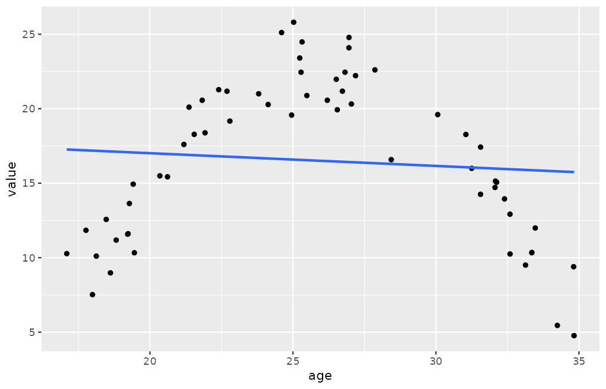{fig-alt="Scatterplot of the constructed age and market-value data with its least squares line: value rises to a peak near age 26 and falls away, while the fitted line comes out nearly flat — the linearity failure of the first gallery panel." width=85%}

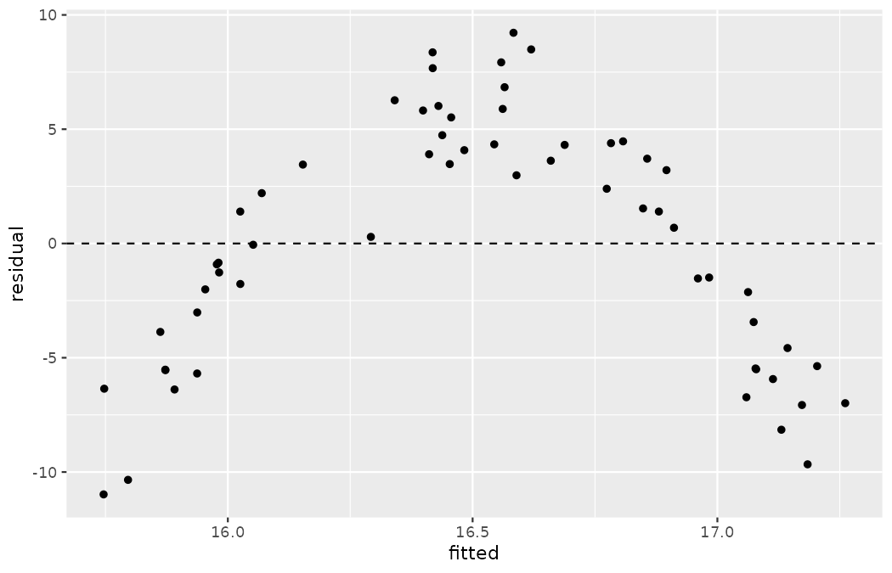{fig-alt="Residual plot for the age-value fit, with residuals against fitted values and a dashed horizontal line at zero. The residuals form the telltale arch — negative at both ends, positive in the middle." width=85%}

Read the four panels left to right:

1.  **Linearity fails.** The age–market-value curve from @sec-model-slr yet again: value rises to a peak near 26 and falls away, the fitted line comes out nearly flat, and the residual plot shows the telltale arch — negative at both ends, positive in the middle.

2.  **An outlier breaks normality.** Fifty-nine loan-market fees track chances created at about €0.11M per chance — and one *mis-entered wonderkid* sits at €36.6M where the trend expects about €3.6M: a data-entry slip of one decimal place, the kind that survives in scouting databases for months.
    His residual of roughly $+32$ dwarfs every other, and he alone drags the fitted slope from $0.117$ down to $0.094$:

    ```r
    round(c(
      slope_with    = unname(coef(lm(fee ~ chances, data = wonderkid))[2]),
      slope_without = unname(coef(lm(fee ~ chances, data = slice_head(wonderkid, n = 59)))[2])
    ), 3)
    #>    slope_with slope_without
    #>         0.094         0.117
    ```

    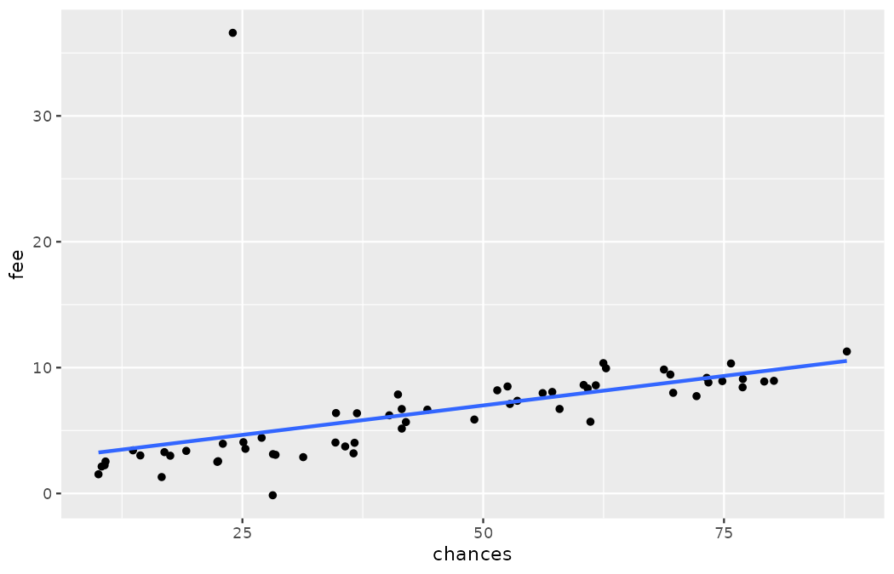{fig-alt="Scatterplot of loan-market fee against chances created with its least squares line: fifty-nine points hug a rising trend of about 0.11 million euros per chance, while one mis-entered point sits at 36.6 million euros, far above the line." width=85%}

    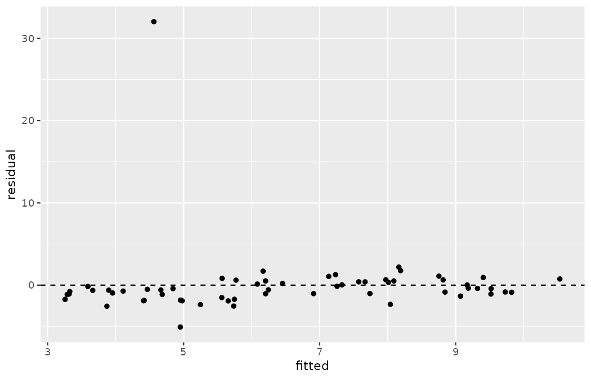{fig-alt="Residual plot for the fee on chances fit: fifty-nine residuals cluster in a tight band around the dashed zero line while the mis-entered wonderkid's residual of roughly plus 32 sits alone at the top — the normality failure of the second gallery panel." width=85%}

3.  **Variability grows with $x$.** Transfer fees for prospects aged 16 to 22: the trend rises, but so does the spread — sixteen-year-olds are priced within a euro-tight band while twenty-two-year-olds scatter across tens of millions.
    The residual plot fans open from left to right.

    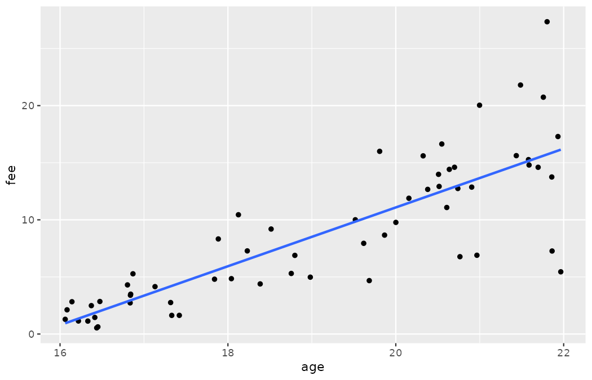{fig-alt="Scatterplot of transfer fee against age for prospects aged 16 to 22 with its least squares line: fees rise with age, but the points sit in a euro-tight band at 16 and scatter ever more widely toward 22." width=85%}

    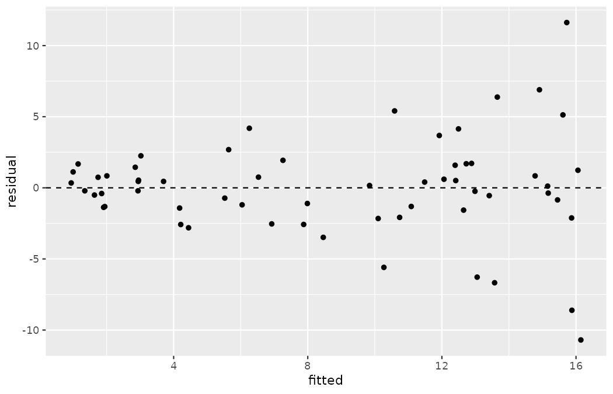{fig-alt="Residual plot for the youth-fee fit, with a dashed horizontal line at zero: the residuals fan open from left to right, tightly packed at low fitted values and widely dispersed at high ones — the equal-variability failure of the third gallery panel." width=85%}

4.  **Successive observations are correlated.** Sixty consecutive days of one player's GPS training load, which drifts like a random walk: today's load is yesterday's plus a nudge.
    The residuals snake — long runs above the line, then long runs below (their day-to-day correlation is $0.85$) — because the observations remember each other, which is precisely what independence forbids.

    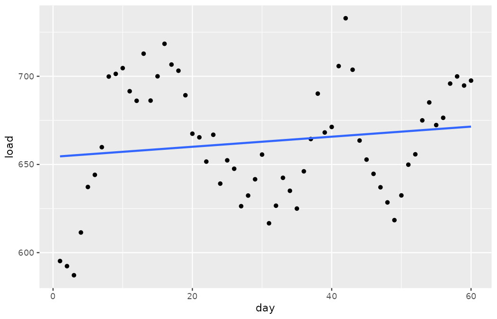{fig-alt="Scatterplot of sixty consecutive days of one player's GPS training load with a least squares line: the load wanders like a random walk, drifting away from the line for long stretches rather than scattering around it." width=85%}

    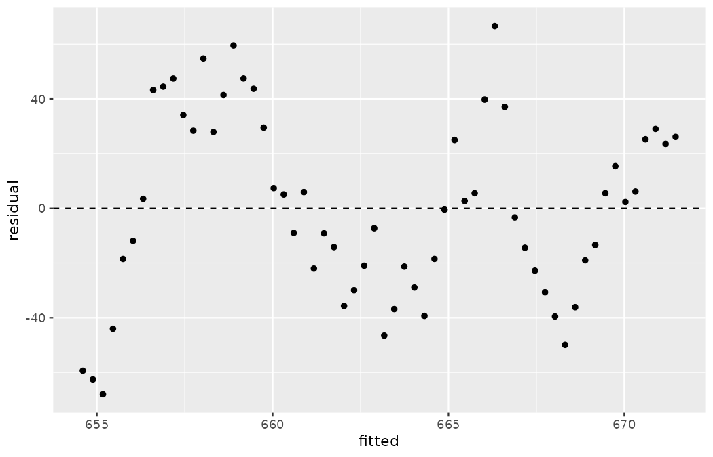{fig-alt="Residual plot for the GPS-load fit, with a dashed horizontal line at zero: the residuals snake in long runs above the line and then long runs below it instead of alternating randomly — the independence failure of the fourth gallery panel." width=85%}

::: {.callout-tip title="Check your understanding"}
Should we have concerns about applying least squares regression — and the $t$-based inference of @sec-mathslope — to the veteran-market data?

------------------------------------------------------------------------

The trend appears linear across ages 28–35 (the market's hump lives at younger ages, outside this survey's window), the points fall around the line with no obvious outliers, and the variance is roughly constant — the €0.5M listing floor grazes only a few points at the oldest ages.
The data are 50 different listed strikers, not a time series or repeated quotes on one player, so independence is reasonable.
Least squares regression, and its $t$-based inference, can be applied to these data.
:::

The technical conditions are often remembered using the **LINE** mnemonic — and this is the checklist to run, in order, before trusting any regression p-value or interval in a scouting report.
The linearity, normality, and equality-of-variance conditions usually can be assessed through residual plots, as in the gallery above.
A careful consideration of the study design should be undertaken to confirm that the observations are independent.

-   L: **linear** model
-   I: **independent** observations
-   N: points are **normally** distributed around the line
-   E: **equal** variability around the line for all values of the explanatory variable

### Why do we need technical conditions?

As with other inferential techniques we have covered in this text, if the technical conditions above do not hold, then it is not possible to make concluding claims about the population.
That is, without the technical conditions, the T score will not have the assumed $t$-distribution.
That said, it is almost always impossible to check the conditions precisely, so we look for large deviations from the conditions.
If there are large deviations, we will be unable to trust the calculated p-value or the endpoints of the resulting confidence interval.

**The model based on linearity**

The linearity condition is among the most important if your goal is to understand a linear model between $x$ and $y.$
For example, the value of the slope will not be at all meaningful if the true relationship between $x$ and $y$ is quadratic, as in the age-curve panel above: the nearly flat fitted slope of the age hump "summarizes" a market in which value first rises steeply and then falls steeply, describing neither.
Not only should we be cautious about the inference — the model *itself* is not an accurate portrayal of the relationship between the variables.
An extended discussion of modeling functional forms other than linear is outside the scope of this text.

**The importance of independence**

The technical condition describing the independence of the observations is often the most crucial but also the most difficult to diagnose.
It is also extremely difficult to gather a dataset which is a true random sample from the population of interest.

Dependent observations can bias results in ways that produce fundamentally flawed analyses.
Think of the scout who logs shots only at the matches of the club across town: the linear model fit to that notebook is surely not a representation of the league.
At best it describes shots at one stadium — taken by teams that chose to play a certain way against one opponent, watched on the days that scout could attend.
The GPS-load panel is the within-player version of the same failure: sixty numbers from one body are not sixty independent pieces of evidence, and treating them as such makes every standard error in the output a fiction.

In lieu of trying to answer whether your observations are a true random sample, you might instead focus on whether you believe your observations are representative of the population of interest.
Humans are notoriously bad at implementing random procedures, so you should be wary of any process that used human intuition to balance the data — a shortlist "balanced by eye" across leagues and ages is not a random sample of any market.

**Some thoughts on normality**

The normality condition requires that points vary symmetrically around the line, spreading out in a bell-shaped fashion.
You should consider the "bell" of the normal distribution as sitting on top of the line (coming off the page in a 3-D sense), indicating that points are dense close to the line and disperse gradually as they get farther from it.

The normality condition is less important than linearity or independence, for a few reasons.
First, the linear model fit with least squares will still be an unbiased estimate of the true population model; however, the distribution of the estimate will be unknown.
Fortunately the Central Limit Theorem (described in @sec-one-mean-math) tells us that most of the analyses (e.g., SEs, p-values, confidence intervals) done using the mathematical model will still hold — even if the data are not normally distributed around the line — as long as the sample size is large enough.
One analysis method that *does* require normality, regardless of sample size, is creating intervals which predict the response of individual outcomes at a given $x$ value.
One additional reason to worry slightly less about normality is that neither the randomization test nor the bootstrapping procedures require the data to be normal around the line.

**Equal variability for inference in particular**

As with normality, the equal variability condition (that points are spread out in similar ways around the line for all values of $x$) will not cause problems for the *estimate* of the linear model.
That said, the **inference** on the model (e.g., computing p-values) will be incorrect if the variability around the line is extremely heterogeneous.
Data that exhibit non-equal variance across the range of $x$-values will have the potential to seriously mis-estimate the variability of the slope, with consequences for hypothesis tests and confidence intervals — the youth-fees panel is the standing warning.

In many cases, the inference results for both a randomization test and a bootstrap confidence interval are robust to the equal variability condition, so they provide the analyst a set of methods to use when the data are heteroskedastic (that is, exhibit unequal variability around the regression line).
Although randomization tests and bootstrapping allow us to analyze data using fewer conditions, some technical conditions are required for all methods described in this text (e.g., independent observations).
When the equal variability condition is violated and a mathematical analysis (e.g., a p-value from a T score) is needed, there are other existing methods (outside the scope of this text) which can handle the unequal variance, such as weighted least squares.

**A violation hiding in plain sight: binary outcomes**

One more residual plot belongs in this section, because the book's own data supply the most instructive violation of all.
Suppose an eager analyst regresses the *goal* indicator itself — 1 if the shot scored, 0 if not — on chance quality, treating a binary outcome as if it were numeric:

```r
shots_lpm <- wc2022_shots |>
  mutate(goal01 = as.numeric(goal))

fit_shot <- lm(goal01 ~ statsbomb_xg, data = shots_lpm)
tidy(fit_shot)
#> # A tibble: 2 × 5
#>   term         estimate std.error statistic   p.value
#>   <chr>           <dbl>     <dbl>     <dbl>     <dbl>
#> 1 (Intercept)    0.0108   0.00902      1.20 2.31e-  1
#> 2 statsbomb_xg   0.951    0.0405      23.5  2.97e-104

shots_lpm |>
  mutate(residual = resid(fit_shot)) |>
  group_by(goal) |>
  summarize(n = n(), min_resid = min(residual), max_resid = max(residual))
#> # A tibble: 2 × 4
#>   goal      n min_resid max_resid
#>   <lgl> <int>     <dbl>     <dbl>
#> 1 FALSE  1299    -0.756   -0.0110
#> 2 TRUE    195     0.136    0.982
```

The fit looks seductively sensible — a slope of $0.95$ says recorded xG converts to goal probability nearly one-for-one across all 1,494 shots, a shape-invariant conclusion in any frame — but draw the residual plot and the illusion collapses: every residual lies in one of exactly two descending bands, the 195 goals in a strip between $+0.14$ and $+0.98,$ the 1,299 misses in a strip between $-0.76$ and $-0.01,$ with an empty gulf between.
Nothing about that picture is bell-shaped around zero, and the spread changes systematically along the line: with a binary response, the N and E conditions are not merely strained, they are impossible.
The estimated line still has descriptive value, but the $t$-based standard errors, p-values, and intervals of this chapter do not apply.
The honest tool for a binary response is the logistic regression you met in @sec-model-logistic — and inference for *that* model is exactly the business of @sec-inf-model-logistic.

### What if all the technical conditions are met?

When the technical conditions are met, the least squares regression model and its inference are provided by virtually all statistical software.
In addition to being ubiquitous, an additional advantage of the least squares regression model (and related inference) is that the linear model has important extensions, which are not trivial to implement with bootstrapping and randomization tests.
In particular, random effects models (natural when shots nest within players and players within teams), repeated measures (a player observed across many sessions, as in the GPS panel), and interactions between predictors are all linear model extensions which require the above technical conditions — though all three are a later course's tools, not this book's (@sec-inf-model-mlr says the same of interactions explicitly).
When the technical conditions hold, these extensions can provide important insight into the data and the research question at hand.
We will discuss some of the extended modeling and associated inference in @sec-inf-model-mlr and @sec-inf-model-logistic.
Many of the techniques used to deal with technical condition violations are outside the scope of this text, but they are taught in universities in the very next class after this one.
If you are working with linear models or are curious to learn more, we recommend that you continue learning about statistical methods applicable to a larger class of datasets.

## Chapter review {#sec-chp24-review}

### Summary

Recall that early in the text we presented graphical techniques which communicated relationships across multiple variables, and we used modeling to formalize those relationships — for this book, always with a scout's questions underneath: does chance quality buy goals, does age discount a fee, does the clock fatten a chance.
Many chapters were then dedicated to inferential methods which allowed claims about the population to be made based on samples of data.
Not only did we present the mathematical model for each of the inferential techniques, but when appropriate, we also presented bootstrapping and permutation methods.

In this chapter we brought all of those ideas together by considering inferential claims on linear models through randomization tests (the slope of $0.909$ for goals on chance quality, far outside every permuted slope), bootstrapping (the fatigue-drift slope whose interval straddled zero and killed its own story), and mathematical modeling (the pressure-share theory that failed to reject, and the veteran market's €0.78M–€2.10M per year of age).
We continue to emphasize the importance of study design in making conclusions about research claims: only the constructed Northbridge experiments license causal language, while every tournament dataset speaks of association — recall the distinction between random sampling and random allocation from @sec-data-hello and @sec-data-design.
And the chapter closed with the discipline that guards all of it: the LINE conditions, checked with residual plots and honest questions about how the data arose, plus this book's own standing check — state the frame, because penalties moved every headline number they touched.

| Question | Answer |
|:---------------------------------------|:------------------------------|
| What is the statistic? | The sample slope $b_1,$ estimating the population slope $\beta_1$ of $y = \beta_0 + \beta_1 x + \varepsilon.$ |
| How is the null distribution built? | Permute the response values, refit the line each time: slopes when $\beta_1 = 0$ is true. |
| How is a CI built without formulas? | Resample rows (pairs) with replacement, refit; percentile or SE interval of the bootstrapped slopes. |
| What is the mathematical model? | $T = (b_1 - 0)/SE_{b_1}$ on a $t$-distribution with $df = n - 2$; interval $b_i \pm t^{\star}_{df} \times SE_{b_i}.$ |
| What are the conditions? | LINE: linearity, independence, nearly normal residuals, equal variability — checked graphically, with independence judged from the design. |

: Summary of inference for the slope of a linear model. {#tbl-chp24-summary}

### Terms

The terms introduced in this chapter are presented below, alphabetized.
If you're not sure what some of these terms mean, we recommend you go back in the text and review their definitions.
You should be able to easily spot them as **bolded text**.

|  |  |  |
|:-----------------------|:-----------------------|:----------------------|
| bootstrap confidence interval for the slope | randomization test for the slope | technical conditions |
| inference with single predictor regression | t-distribution for the slope | variability of the slope |
| LINE |  |  |

: Terms introduced in this chapter. {#tbl-terms-chp-24}

## Exercises {#sec-chp24-exercises}

Answers to odd-numbered exercises can be found in [Appendix -@sec-exercise-solutions-24]. Final answers to the even-numbered exercises are in [Appendix -@sec-appendix-even-answers].

::: {.exercises}

:::

------------------------------------------------------------------------

Adapted from *Introduction to Modern Statistics* by Çetinkaya-Rundel & Hardin (CC BY-SA 4.0); this adaptation is likewise CC BY-SA 4.0. Match data: StatsBomb open data.
