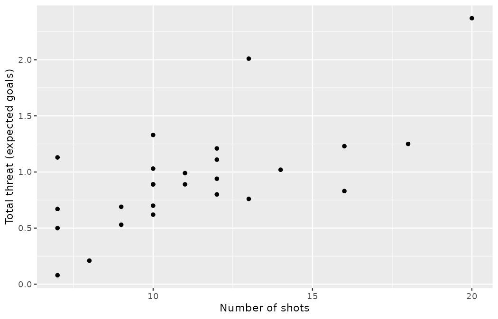
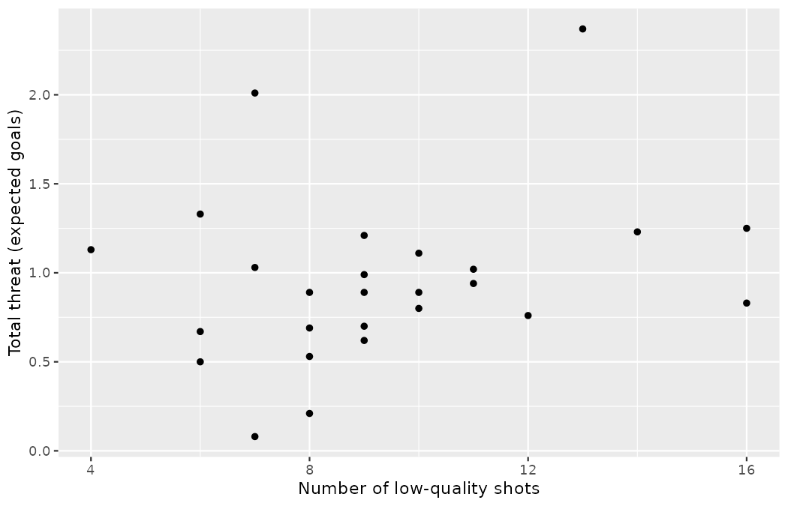
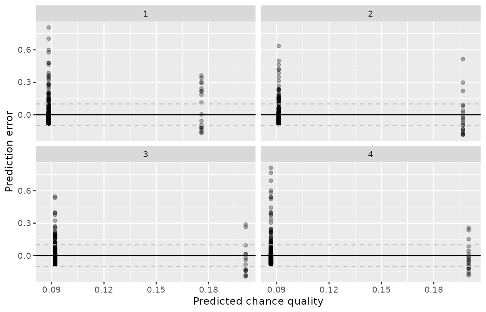

# Inference for linear regression with multiple predictors {#sec-inf-model-mlr}

::: {.chapterintro}
In [Chapter -@sec-model-mlr], the least squares regression method was used to estimate linear models which predicted a particular response variable given more than one explanatory variable — the chance quality of a World Cup shot, predicted from the full set of tags a scout can log from the stands.
Here, we discuss whether each of the variables individually is a statistically discernible predictor of the outcome or whether the model might be just as strong without that variable.
That is, as before, we apply inferential methods to ask whether a variable could have come from a population where the particular coefficient at hand was zero.
If one of the linear model coefficients is truly zero (in the population), then the estimate of the coefficient (using least squares) will vary around zero.
The inference task at hand is to decide whether the coefficient's difference from zero is large enough to decide that the data cannot possibly have come from a model where the true population coefficient is zero.
Both the derivations from the mathematical model and the randomization model are beyond the scope of this book, but we are able to calculate p-values using statistical software.
We will discuss interpreting p-values in the multiple regression setting — **inference on multiple linear regression** — and note some scenarios where careful understanding of the context and the relationship between variables is important.
We use cross-validation as a method for independent assessment of the multiple linear regression model, and we close by doing what @sec-model-application promised: validating a model fit on one tournament against a second tournament it has never seen.
:::

## Multiple regression output from software {#sec-inf-mult-reg-soft}

Recall the `shots_wc` data from [Chapter -@sec-model-mlr].

::: {.callout-note title="Data"}
The raw file `wc2022_shots.csv` in `data/derived/` holds all 1,494 shots of the 2022 Men's World Cup.
As in @sec-model-mlr, we state the frame before we model: we keep *open-play* shots only — penalties (fixed by law at a chance quality of roughly 0.78) and direct free kicks are priced by the routine, not by the shot characteristics we want to study — and we drop the handful of shots whose body part or possession pattern is logged only as `Other`.
That filter leaves the same **1,365 shots** modeled throughout @sec-model-mlr, with `under_pressure` and `one_on_one` recoded as 0/1 indicator variables.
We will refer to this modified dataset as `shots_wc`, and we rebuild it with exactly the same code.
:::

```r
library(dplyr)
library(readr)
library(ggplot2)
library(broom)

wc2022_shots <- read_csv("data/derived/wc2022_shots.csv")

shots_wc <- wc2022_shots |>
  filter(
    shot_type == "Open Play",
    body_part != "Other",
    play_pattern != "Other"
  ) |>
  mutate(
    body_part = factor(body_part, levels = c("Right Foot", "Left Foot", "Head")),
    technique = relevel(factor(technique), ref = "Normal"),
    play_pattern = relevel(factor(play_pattern), ref = "Regular Play"),
    under_pressure = if_else(under_pressure, 1, 0),
    one_on_one = if_else(one_on_one, 1, 0)
  ) |>
  select(
    statsbomb_xg, body_part, technique, under_pressure,
    one_on_one, play_pattern, minute
  )

nrow(shots_wc)
#> [1] 1365
```

Now, our goal is to create a model where `statsbomb_xg` can be predicted using the variables `under_pressure`, `one_on_one`, and `minute` — three tags Marta Vidal singled out because a regional scout can log all three without replaying the footage.
As you learned in @sec-model-mlr, least squares can be used to find the coefficient estimates for the linear model.
The unknown population model can be written as:

$$
\begin{aligned}
E[\texttt{statsbomb\_xg}] = \beta_0 &+ \beta_1\times \texttt{under\_pressure} \\
&+ \beta_2 \times \texttt{one\_on\_one}\\
&+ \beta_3 \times \texttt{minute}\\
\end{aligned}
$$

A population-level regression model is written with one new piece of notation, the expectation operator $E[\cdot],$ read "the expected value of": the population average of whatever quantity sits inside the brackets.
Around it stand old friends — the Greek $\beta$'s in place of the sample estimates $b_0, b_1, \dots$ from @sec-model-slr and @sec-model-mlr, exactly as in @sec-inf-model-slr's population line; beyond $E[\cdot]$ itself, what is new is only that there are now three slope parameters at once.

```r
m_shot_tags <- lm(statsbomb_xg ~ under_pressure + one_on_one + minute,
                  data = shots_wc)
tidy(m_shot_tags)
#> # A tibble: 4 × 5
#>   term            estimate std.error statistic  p.value
#>   <chr>              <dbl>     <dbl>     <dbl>    <dbl>
#> 1 (Intercept)    0.0832     0.00693    12.0    1.09e-31
#> 2 under_pressure 0.0000906  0.00840     0.0108 9.91e- 1
#> 3 one_on_one     0.104      0.0141      7.36   3.06e-13
#> 4 minute         0.000118   0.000111    1.06   2.89e- 1
```

The estimated equation for the regression model may be written as a model with three predictor variables:

$$
\begin{aligned}
\widehat{\texttt{statsbomb\_xg}} = 0.0832 &+ 0.00009 \times \texttt{under\_pressure} \\
&+ 0.1040 \times \texttt{one\_on\_one} \\
&+ 0.00012 \times \texttt{minute}
\end{aligned}
$$

Not only does the regression output provide the estimates for the coefficients, it also provides information on the inference analysis (i.e., hypothesis testing) which is the focus of this chapter.

In @sec-inf-model-slr, you learned that the hypothesis test for a linear model with **one predictor**[^25-inf-model-mlr-1] can be written as:

[^25-inf-model-mlr-1]: In previous sections, the term **explanatory variable** was used instead of **predictor**.
    The words are synonymous and are used separately in the different sections to be consistent with how most analysts use them: explanatory variable for testing, predictor for modeling.

> if only one predictor, $H_0: \beta_1 = 0.$

That is, if the true population slope is zero, the p-value measures how likely it would be to select data which produced the observed slope $(b_1)$ value.

With **multiple predictors**, the hypothesis is similar, however, it is now conditioned on each of the other variables remaining in the model.

> if multiple predictors, $H_0: \beta_i = 0$ given other variables in the model

This is the notation this chapter runs on, so take it apart piece by piece before using it.
Every symbol except one is a recall: $H_0$ is the null hypothesis of @sec-foundations-randomization, the skeptical baseline claim; $\beta$ is a population coefficient, the unknown quantity that the sample statistic $b$ estimates (@sec-model-slr); and the subscript $i$ indexes *which* of the $k$ predictor coefficients the claim is about — the same predictor-indexing subscript you met in $x_1, \dots, x_k$ in @sec-model-mlr, not the observation subscript of $x_i$ in @sec-explore-numerical.
The genuinely new piece is the clause at the end: **given other variables in the model**.
The claim being tested is *not* "predictor $i$ is unrelated to the response."
It is the narrower, sharper claim that predictor $i$ contributes nothing *beyond* the variables already sitting in the model — that once the other predictors have said their piece, the coefficient on predictor $i$ could be zero.
Change the other variables, and you change the claim; the same predictor can fail this test in one model and pass it in another, as the next section will demonstrate.

Using the example above and focusing on each of the variable p-values (here we won't discuss the p-value associated with the intercept), we can write out the three different hypotheses:

-   $H_0: \beta_1 = 0$, given `one_on_one` and `minute` are included in the model
-   $H_0: \beta_2 = 0$, given `under_pressure` and `minute` are included in the model
-   $H_0: \beta_3 = 0$, given `under_pressure` and `one_on_one` are included in the model

The software output gives each of these hypotheses its own p-value, and — unlike a tidy textbook example where every predictor matters — our three tags receive three very different verdicts.

Consider first the p-value on $H_0: \beta_2 = 0.$
The p-value of $3.1 \times 10^{-13}$ says that it would be extraordinarily unlikely to see data that produce a coefficient on `one_on_one` as large as 0.1040 if the true relationship between `one_on_one` and `statsbomb_xg` was non-existent (i.e., if $\beta_2 = 0$) and the model also included `under_pressure` and `minute`.
You might notice that 0.1040 looks like a small number, but in the units of the problem it is enormous: chance quality is a probability, so the model prices a one-on-one at more than *ten additional goals per hundred shots*, holding the other two tags constant — it's all about context!

Now consider the p-value on $H_0: \beta_1 = 0,$ which is $0.991.$
Data like ours would be utterly unsurprising if the pressure tag contributed nothing, given that `one_on_one` and `minute` are already in the model; the estimated coefficient, $0.00009,$ is about as close to zero as a coefficient can land.
Note carefully what this does and does not say.
It does not say defensive pressure is irrelevant to football; it says the pressure tag tells this model nothing about StatsBomb's *price* for an open-play chance once the other two tags are known — the same verdict that backward elimination reached by adjusted $R^2$ in @sec-model-application, now wearing a formal p-value.
And recall from @sec-foundations-randomization that failing to reject $H_0$ is not evidence that $H_0$ is true: check complete, the null stands.

The p-value on `minute` $(0.289)$ is interpreted similarly: a coefficient of 0.00012 per minute — about one hundredth of a goal across a full match — is comfortably the kind of estimate that arises by chance when $\beta_3 = 0,$ given the other two variables are in the model.
The fatigue-drift story dies here just as it died in @sec-inf-model-slr's interval for the same variable.

::: {.callout-tip title="Check your understanding"}
In @sec-model-mlr's full model — the one with all six tag variables — the coefficient on `under_pressure` was $-0.0052$ with a p-value of $0.577.$
In the three-variable model above it is $0.00009$ with a p-value of $0.991.$
Is this a contradiction?
Write out, in words, the null hypothesis each of those two p-values assesses.

------------------------------------------------------------------------

No contradiction — the two p-values assess *different hypotheses*.
The first: the coefficient on `under_pressure` is zero, *given* `body_part`, `technique`, `one_on_one`, `play_pattern`, and `minute` are included in the model.
The second: the coefficient on `under_pressure` is zero, *given* `one_on_one` and `minute` are included in the model.
Both the estimate and its p-value are statements conditioned on the rest of the model; change the model and you change the question, so there is no reason the numbers should agree.
(Here both verdicts point the same way, but the next section shows a predictor whose *sign* flips between models.)
:::

Sometimes a set of predictor variables can impact the model in unusual ways, often due to the predictor variables themselves being correlated.

## Multicollinearity {#sec-inf-mult-reg-collin}

In practice, there will almost always be some degree of correlation between the explanatory variables in a multiple regression model.
For regression models, it is important to understand the entire context of the model, particularly for correlated variables.
Our discussion will focus on interpreting coefficients (and their signs) in relationship to other variables as well as the discernibility (i.e., the p-value) of each coefficient.

Consider an exercise Priya Rao runs with Emil Sørensen's trainee scouts at Northbridge United.
A trainee in the stands has no data feed; what they *can* do is count.
Priya trains them to tally every shot the observed team takes into one of four classes, each with a calibration price in expected goals — deliberately mirroring how a handful of coin denominations add up to an amount of money:

| Shot class | Typical chance quality |
|:---|---:|
| hopeful hit (speculative strike from distance) | 0.01 |
| half-chance (crowded box, poor angle) | 0.05 |
| decent look (a real sight of goal) | 0.10 |
| big chance (the finish expected as often as not missed) | 0.25 |

: The four tally classes and their calibration prices, in expected goals per shot. {#tbl-tally-classes}

The question Priya poses: can the club predict how much total threat a team generated in a match based only on the trainee's counts?
For 26 matches covered by the trainee network, she collects the **total threat** (the sum of `statsbomb_xg` over the team's open-play shots, pulled from the data feed afterwards), the **total number of shots**, and the **number of low-quality shots**.[^25-inf-model-mlr-2]
The number of low-quality shots is the number of shots minus the number of big chances (a big chance is the most valuable class in the tally, at about 0.25 expected goals — the analyst's quarter).
As an illustration in the spirit of @tbl-tally-classes: a match log with 5 hopeful hits, 3 half-chances, 2 decent looks, and 6 big chances holds 16 shots, 10 of them low-quality, and a total threat of $5 \times 0.01 + 3 \times 0.05 + 2 \times 0.10 + 6 \times 0.25 = 1.90$ expected goals.

[^25-inf-model-mlr-2]: In all honesty, this particular dataset is constructed — the seeded code below builds it, and no real trainee tallies were collected.
    The structure of the example mirrors the coin-dish illustration in *Introduction to Modern Statistics*, an idea originally due to Jeff Witmer at Oberlin College; we have swapped pennies, nickels, dimes, and quarters for shot classes priced in expected goals.

The seeded code below constructs the `threat26` data: class counts for each match, the derived shot counts, and a total threat equal to the class prices plus per-shot noise (a real "big chance" is worth *about* 0.25, not exactly).

```r
set.seed(2501)
threat26 <- tibble(
  n_hopeful = rpois(26, lambda = 4),
  n_half    = rpois(26, lambda = 3),
  n_decent  = rpois(26, lambda = 2),
  n_big     = rpois(26, lambda = 2)
) |>
  mutate(
    n_shots = n_hopeful + n_half + n_decent + n_big,
    n_low_quality = n_shots - n_big,
    total_threat = round(
      0.01 * n_hopeful + 0.05 * n_half + 0.10 * n_decent + 0.25 * n_big +
        rnorm(26, mean = 0, sd = 0.08),
      2
    )
  )

threat26 |> slice_head(n = 5)
#> # A tibble: 5 × 7
#>   n_hopeful n_half n_decent n_big n_shots n_low_quality total_threat
#>       <int>  <int>    <int> <int>   <int>         <int>        <dbl>
#> 1         4      2        4     2      12            10         1.11
#> 2         2      6        3     1      12            11         0.94
#> 3         5      3        2     2      12            10         0.8
#> 4         5      7        4     0      16            16         0.83
#> 5         4      3        1     2      10             8         0.89
```

The 26 match logs range from 7 to 20 shots and from 0.08 to 2.37 expected goals of total threat — numbers any scout of @sec-explore-numerical's team-match distributions will recognize as realistic.
The collected data show that `total_threat` is more highly correlated with the total `n_shots` than it is with `n_low_quality`.
We also note that `n_shots` and `n_low_quality` are positively correlated — a match with many shots tends to contain many low-quality shots, for the simple reason that low-quality shots are most of what shots are.

```r
threat26 |>
  summarize(
    r_shots     = cor(total_threat, n_shots),
    r_low       = cor(total_threat, n_low_quality),
    r_shots_low = cor(n_shots, n_low_quality)
  )
#> # A tibble: 1 × 3
#>   r_shots r_low r_shots_low
#>     <dbl> <dbl>       <dbl>
#> 1   0.681 0.251       0.867

ggplot(threat26, aes(y = total_threat, x = n_shots)) +
  geom_point() +
  labs(x = "Number of shots", y = "Total threat (expected goals)")

ggplot(threat26, aes(y = total_threat, x = n_low_quality)) +
  geom_point() +
  labs(x = "Number of low-quality shots", y = "Total threat (expected goals)")
```

{fig-alt="Scatterplot of total threat in expected goals against the total number of shots for the 26 match logs, climbing clearly up and to the right." width=85%}

{fig-alt="Scatterplot of total threat in expected goals against the number of low-quality shots, a much looser cloud than the relationship with total shots." width=85%}

The first scatterplot climbs clearly up and to the right $(r = 0.681);$ the second is a much looser cloud $(r = 0.251).$
As you might expect, the total threat is more strongly associated with how many shots there were than with how many *poor* shots there were.

Using the total `n_shots` as the predictor variable, the model output below provides the least squares estimate of the coefficient as 0.10.
For every additional shot in the match log, we would predict that the team generated 0.10 expected goals more.
The $b_1 = 0.10$ coefficient has a small p-value associated with it, suggesting we would not have seen data like this if `n_shots` and `total_threat` were not linearly related.

$$\widehat{\texttt{total\_threat}} = -0.14 + 0.10 \times \texttt{n\_shots}$$

```r
m_threat_shots <- lm(total_threat ~ n_shots, data = threat26)
tidy(m_threat_shots)
#> # A tibble: 2 × 5
#>   term        estimate std.error statistic  p.value
#>   <chr>          <dbl>     <dbl>     <dbl>    <dbl>
#> 1 (Intercept)  -0.136     0.248     -0.546 0.590
#> 2 n_shots       0.0959    0.0211     4.55  0.000130
```

Using `n_low_quality` as the predictor variable, the model output below provides the least squares estimate of the coefficient as 0.04.
For every additional low-quality shot in the log, we would predict 0.04 expected goals more.
The $b_1 = 0.04$ coefficient has a large p-value associated with it $(0.217),$ suggesting we could easily have seen data like ours even if `n_low_quality` and `total_threat` were not at all linearly related.

$$\widehat{\texttt{total\_threat}} = 0.58 + 0.04 \times \texttt{n\_low\_quality}$$

```r
m_threat_low <- lm(total_threat ~ n_low_quality, data = threat26)
tidy(m_threat_low)
#> # A tibble: 2 × 5
#>   term          estimate std.error statistic p.value
#>   <chr>            <dbl>     <dbl>     <dbl>   <dbl>
#> 1 (Intercept)     0.576     0.308       1.87  0.0738
#> 2 n_low_quality   0.0399    0.0315      1.27  0.217
```

::: {.callout-note title="Worked example"}
Come up with an example of two match logs that have the same number of low-quality shots but a number of total shots that differs by one.
What is the difference in total threat?

------------------------------------------------------------------------

Take a log with one shot of each class — 4 shots, 3 of them low-quality, and a total threat of $0.01 + 0.05 + 0.10 + 0.25 = 0.41.$
Now add one more shot *without changing the low-quality count*: the added shot must be a big chance, giving 5 shots, still 3 low-quality, and a total threat of $0.66.$
Holding the number of low-quality shots constant, one extra shot is necessarily one extra big chance — worth 0.25.
:::

::: {.callout-note title="Worked example"}
Come up with an example of two match logs that have the same total number of shots but a different number of low-quality shots.
What is the difference in total threat?

------------------------------------------------------------------------

Start from the same 4-shot log (3 low-quality, total threat $0.41$).
Replace the big chance with a second hopeful hit: still 4 shots, but now all 4 are low-quality, and the total threat is $0.01 + 0.01 + 0.05 + 0.10 = 0.17.$
Holding the number of shots constant, one extra low-quality shot means a big chance was *swapped out* for a hopeful hit, half-chance, or decent look — the threat falls.
:::

Using both the total `n_shots` and `n_low_quality` as predictor variables, the model output below provides the least squares estimates of both coefficients as 0.26 and $-0.22.$
Now, with two variables in the model, the interpretation is more nuanced.

-   A coefficient interpretation always indicates a change in one variable while keeping the other variable(s) constant.
    For every additional shot in the log **while** `n_low_quality` stays constant, we would predict 0.26 expected goals more.
    Re-considering the phrase "every additional shot **while** the number of low-quality shots stays constant" makes us realize that each increase is a single additional big chance — which is why the coefficient lands near the big-chance price of 0.25 (larger sample sizes would push $b_1$ still closer to 0.25, because of the deterministic relationship described here).
-   For every additional low-quality shot in the log **while** the total `n_shots` stays constant, we would predict 0.22 expected goals *less*.
    Re-considering the phrase "every additional low-quality shot **while** the total number of shots stays constant" makes us realize that a big chance is being swapped out for a hopeful hit, half-chance, or decent look.

Considering the coefficients across the three model outputs within the context and knowledge we have of the tally classes allows us to understand the correlation between variables and why the signs of the coefficients would change depending on the model: alone, `n_low_quality` carries a *positive* coefficient (more low-quality shots ride along with more shots of every kind); alongside `n_shots`, its coefficient is *negative* and strongly discernible.
Note also that the p-value for the `n_low_quality` coefficient changed from 0.217 in its own model to $1.9 \times 10^{-11}$ in the two-variable model.
It makes sense that the variable describing `n_low_quality` provides more information about `total_threat` when it is part of a model which also includes `n_shots` than it does when it is used as a single variable in a simple linear regression model: on its own it is a muddled proxy for volume; next to the volume itself, it becomes a precise statement about *composition*.

$$
\begin{aligned}
\widehat{\texttt{total\_threat}} = 0.01 &+ 0.26 \times \texttt{n\_shots} \\
&- 0.22 \times \texttt{n\_low\_quality}
\end{aligned}
$$

```r
m_threat_both <- lm(total_threat ~ n_shots + n_low_quality, data = threat26)
tidy(m_threat_both)
#> # A tibble: 3 × 5
#>   term          estimate std.error statistic  p.value
#>   <chr>            <dbl>     <dbl>     <dbl>    <dbl>
#> 1 (Intercept)    0.00895    0.0943    0.0949 9.25e- 1
#> 2 n_shots        0.263      0.0159   16.5    2.99e-14
#> 3 n_low_quality -0.218      0.0180  -12.1    1.87e-11
```

When working with multiple regression models, interpreting the model coefficients is not always as straightforward as it was with the tally example, where the class prices told us exactly what each swap was worth.
However, we encourage you to always think carefully about the variables in the model, consider how they might be correlated among themselves, and work through different models to see how using different sets of variables might produce different relationships for predicting the response variable of interest.

::: {.callout-important title="Multicollinearity"}
**Multicollinearity** happens when the predictor variables are correlated within themselves.
When the predictor variables themselves are correlated, the coefficients in a multiple regression model can be difficult to interpret.
:::

::: {.callout-tip title="Check your understanding"}
In @sec-model-mlr, the coefficient on `one_on_one` was 0.1039 in a model by itself but 0.0872 in the full model with all six tag variables.
Using the language of this section, explain what happened — and state whether either number is "wrong."

------------------------------------------------------------------------

The predictors are multicollinear: one-on-ones arise disproportionately from counter-attacks and long balls over the top, and are finished disproportionately with lobs, so the single-predictor coefficient credited some of that situational value to the one-on-one tag itself.
Neither number is wrong — they answer different conditional questions.
0.1039 is the one-on-one premium *ignoring* everything else; 0.0872 is the premium *given* body part, technique, pressure, possession pattern, and minute are already in the model.
Just as with the tally data, the coefficient's meaning depends on which other variables are held constant.
:::

Although diving into the details are beyond the scope of this text, we will provide one more reflection about multicollinearity.
If the predictor variables have some degree of correlation, it can be quite difficult to interpret the value of the coefficient or evaluate whether the variable is a statistically discernible predictor of the outcome.
However, even a model that suffers from high multicollinearity will likely lead to unbiased predictions of the response variable.
So if the task at hand is only to do prediction (and not to interpret coefficients), multicollinearity is likely to not cause you substantial problems — a distinction that matters at a club, where "what is this team's expected threat next week?" is a prediction task and "does pressing *cause* worse chances?" is emphatically not.

## Cross-validation for prediction error {#sec-inf-mult-reg-cv}

In @sec-inf-mult-reg-soft, p-values were calculated on each of the model coefficients.
The p-value gives a sense of which variables are important to the model; however, a more extensive treatment of variable selection is warranted in a follow-up course or textbook.
Here, we use **cross-validation** **prediction error** to focus on which variable(s) are important for predicting the response variable of interest.
In general, linear models are also used to make predictions of individual observations.
In addition to model building, cross-validation provides a method for generating predictions that are not overfit to the particular dataset at hand.
We continue to encourage you to take up further study on the topic of cross-validation, as it is among the most important ideas in modern data analysis, and we are only able to scratch the surface here.

Cross-validation is a computational technique which removes some observations before a model is run, then assesses the model accuracy on the held-out sample.
By removing some observations, we provide ourselves with an independent evaluation of the model (that is, the removed observations do not contribute to finding the parameters which minimize the least squares equation).
Cross-validation can be used in many different ways (as an independent assessment), and here we will just scratch the surface with respect to one way the technique can be used to compare models.

The procedure runs as follows.
The dataset is broken into $k$ *folds* — $k$ non-overlapping groups of (nearly) equal size, assigned at random, which together account for every observation exactly once.
One at a time, a model is built using the other $k - 1$ folds, and predictions are calculated on the single held-out fold, which is completely independent of the model estimation.
With $k = 4$: fit on folds 2–3–4 and predict fold 1; fit on 1–3–4 and predict fold 2; fit on 1–2–4 and predict fold 3; fit on 1–2–3 and predict fold 4.
At the end, every shot in the dataset has received exactly one prediction, and *no shot's prediction used that shot's own data*.

One notational warning before we go on, because this book has now made the letter $k$ do three different jobs.
In @sec-model-mlr, $k$ counted the *predictors* in a regression model (as in $n - k - 1$ degrees of freedom); in @sec-inference-many-means, $k$ counted the *groups* in an ANOVA (as in $df_G = k - 1$); here, $k$ counts the *folds* in a cross-validation.
The three usages never appear in the same formula, and each chapter says which is meant — but when you read "$k = 4$" in this chapter, it is folds, not predictors and not groups.
Re-using a small pool of letters is a habit statistics shares with football, where "a number 6" may be a position, a shirt, or a squad-list slot; context disambiguates, but only if you ask.

Our goal in this section is to compare two different regression models which both seek to predict the chance quality of a shot — the same task a Northbridge tag sheet faces every match.
The first model predicts `statsbomb_xg` by using only `one_on_one`, the single most informative tag of @sec-model-application.
The second model predicts `statsbomb_xg` by using `one_on_one`, `under_pressure`, `body_part`, `technique`, and `play_pattern`.
(The clock variables earned their exit in @sec-model-mlr's stepwise selection, and we do not re-invite them here.)

::: {.callout-important title="Prediction error"}
The prediction error (also previously called the **residual**) is the difference between the observed value and the predicted value (from the regression model).

$$\text{prediction error}_i = e_i = y_i - \hat{y}_i$$
:::

The notation is all recall — $e_i$, $y_i$, and $\hat{y}_i$ are exactly the residual, observed value, and predicted value of @sec-model-slr — but the *source* of the prediction is about to change, and that change is the entire point of this section.

### Comparing two models to predict chance quality

The question we will seek to answer is whether the predictions of `statsbomb_xg` are substantially better when `one_on_one`, `under_pressure`, `body_part`, `technique`, and `play_pattern` are used in the model, as compared with a model on `one_on_one` only.

We refer to the model given with only `one_on_one` as the **smaller** model.
It is seen below with coefficient estimates of the parameters as well as standard errors and p-values.
We refer to the model with all five tag variables as the **larger** model.
Given what we learned in @sec-model-application about how weakly the tags price a chance individually, it is *not* a foregone conclusion that all of the larger model's variables earn their place: `one_on_one`, most `technique` levels, and the counter-attack pattern carry small p-values, while `under_pressure` and several other levels do not — each p-value, as always now, conditioned on the other variables in the model.
In this section, we go beyond the p-values to consider independent predictions of `statsbomb_xg` as a way to compare the smaller and larger models.

**The smaller model:**

$$
\begin{aligned}
E[\texttt{statsbomb\_xg}] &= \ \beta_0 + \beta_1 \times \texttt{one\_on\_one}\\
\widehat{\texttt{statsbomb\_xg}} &= \ 0.0896 + 0.1039 \times \texttt{one\_on\_one}\\
\end{aligned}
$$

```r
m_small <- lm(statsbomb_xg ~ one_on_one, data = shots_wc)
tidy(m_small)
#> # A tibble: 2 × 5
#>   term        estimate std.error statistic   p.value
#>   <chr>          <dbl>     <dbl>     <dbl>     <dbl>
#> 1 (Intercept)   0.0896   0.00327     27.4  5.03e-132
#> 2 one_on_one    0.104    0.0141       7.35 3.36e- 13
```

**The larger model:**

$$
\begin{aligned}
E[\texttt{statsbomb\_xg}] = \beta_0 &+ \beta_1 \times \texttt{one\_on\_one} \\
&+ \beta_2 \times \texttt{under\_pressure} \\
&+ \beta_3 \times \texttt{body\_part}_{\texttt{Left Foot}} + \beta_4 \times \texttt{body\_part}_{\texttt{Head}} \\
&+ \beta_5 \times \texttt{technique}_{\texttt{Backheel}} + \cdots + \beta_{10} \times \texttt{technique}_{\texttt{Volley}} \\
&+ \beta_{11} \times \texttt{play\_pattern}_{\texttt{From Corner}} + \cdots + \beta_{17} \times \texttt{play\_pattern}_{\texttt{From Throw In}}
\end{aligned}
$$

```r
m_large <- lm(
  statsbomb_xg ~ one_on_one + under_pressure + body_part + technique +
    play_pattern,
  data = shots_wc
)
tidy(m_large) |> print(n = 18)
#> # A tibble: 18 × 5
#>    term                       estimate std.error statistic  p.value
#>    <chr>                         <dbl>     <dbl>     <dbl>    <dbl>
#>  1 (Intercept)                 0.0807    0.00664    12.1   2.67e-32
#>  2 one_on_one                  0.0869    0.0144      6.05  1.91e- 9
#>  3 under_pressure             -0.00514   0.00924    -0.556 5.78e- 1
#>  4 body_partLeft Foot          0.00345   0.00722     0.478 6.33e- 1
#>  5 body_partHead               0.0199    0.0105      1.90  5.77e- 2
#>  6 techniqueBackheel          -0.0251    0.0521     -0.483 6.29e- 1
#>  7 techniqueDiving Header      0.0774    0.0322      2.40  1.63e- 2
#>  8 techniqueHalf Volley        0.0283    0.00909     3.11  1.92e- 3
#>  9 techniqueLob                0.137     0.0329      4.18  3.16e- 5
#> 10 techniqueOverhead Kick     -0.0184    0.0441     -0.417 6.76e- 1
#> 11 techniqueVolley             0.0382    0.0130      2.95  3.23e- 3
#> 12 play_patternFrom Corner     0.00106   0.0103      0.103 9.18e- 1
#> 13 play_patternFrom Counter    0.0553    0.0166      3.33  8.85e- 4
#> 14 play_patternFrom Free Kick -0.0193    0.00945    -2.04  4.13e- 2
#> 15 play_patternFrom Goal Kick  0.0145    0.0142      1.02  3.07e- 1
#> 16 play_patternFrom Keeper     0.0141    0.0259      0.543 5.87e- 1
#> 17 play_patternFrom Kick Off  -0.0113    0.0288     -0.392 6.95e- 1
#> 18 play_patternFrom Throw In  -0.0133    0.00872    -1.52  1.28e- 1
```

In order to compare the smaller and larger models in terms of their **ability to predict chance quality**, we need to build models that can provide independent predictions based on the shots in the holdout samples created by cross-validation.
To reiterate, each of the predictions that (when combined together) will allow us to distinguish between the smaller and larger models is independent of the data which were used to build the model.
In this example, using cross-validation, we remove one quarter of the data before running the least squares calculations.
Then the least squares model is used to predict the `statsbomb_xg` of the shots in the holdout sample.
Here we use a 4-fold cross-validation (meaning that one quarter of the data is removed each time) to produce four different versions of each model (other times it might be more appropriate to use 2-fold or 10-fold, or even to run the model separately after removing each individual data point one at a time).
The fold assignment is random, so we seed it:

```r
set.seed(2502)
shots_wc_cv <- shots_wc |>
  mutate(fold = sample(rep(1:4, length.out = n())))

shots_wc_cv |> count(fold)
#> # A tibble: 4 × 2
#>    fold     n
#>   <int> <int>
#> 1     1   342
#> 2     2   341
#> 3     3   341
#> 4     4   341
```

To see one arm of the procedure in isolation: the code below fits the smaller model to the 1,023 shots of folds 2, 3, and 4 — note the slight differences in coefficients as compared to the fit on all 1,365 shots — after which predictions can be made on the 342 held-out shots of fold 1.

```r
m_small_f1 <- lm(statsbomb_xg ~ one_on_one,
                 data = shots_wc_cv |> filter(fold != 1))
tidy(m_small_f1)
#> # A tibble: 2 × 5
#>   term        estimate std.error statistic   p.value
#>   <chr>          <dbl>     <dbl>     <dbl>     <dbl>
#> 1 (Intercept)   0.0883   0.00363     24.4  1.20e-103
#> 2 one_on_one    0.0875   0.0156       5.60 2.81e-  8
```

Repeating the process for each holdout quarter in a loop, every shot receives a prediction from a model that never saw it:

```r
pred_small <- rep(NA_real_, 1365)
for (f in 1:4) {
  held_out <- shots_wc_cv$fold == f
  fit <- lm(statsbomb_xg ~ one_on_one, data = shots_wc_cv[!held_out, ])
  pred_small[held_out] <- predict(fit, newdata = shots_wc_cv[held_out, ])
}

ggplot(
  shots_wc_cv |> mutate(predicted = pred_small,
                        error = statsbomb_xg - predicted),
  aes(x = predicted, y = error)
) +
  geom_point(alpha = 0.3) +
  geom_hline(yintercept = 0) +
  geom_hline(yintercept = 0.1, lty = 2, color = "grey") +
  geom_hline(yintercept = -0.1, lty = 2, color = "grey") +
  facet_wrap(~fold) +
  labs(
    x = "Predicted chance quality",
    y = "Prediction error"
  )
```

{fig-alt="Cross-validated prediction errors for the smaller model in four panels, one per held-out fold. Each panel shows two vertical strips — ordinary shots near a predicted value of 0.09 and one-on-ones between 0.18 and 0.20 — with errors centered around zero and most falling inside the dashed plus-or-minus 0.1 band." width=85%}

The plot shows four panels, one per held-out quarter.
Because the smaller model's only predictor is a two-level tag, each panel is two vertical strips — the ordinary shots near a predicted value of 0.09 and the one-on-ones between 0.18 and 0.20 — exactly the geometry you saw in @sec-model-application's residual plot for this model.
In every panel the errors are centered around zero, which shows the independent predictions are not systematically biased; about 86% of them fall within the dashed $\pm 0.1$ band, but the upper tail straggles to $+0.81$ — point-blank chances the tag cannot see — while the floor at $-\hat{y}_i$ (chance quality cannot be negative) cuts the errors off at $-0.19.$

The cross-validation SSE is the sum of squared error associated with the predictions.
Let $\hat{y}_{cv,i}$ be the prediction for the $i^{th}$ observation where the $i^{th}$ observation was in the hold-out fold and the other three folds were used to create the linear model.
This symbol is new, so decompose it before using it.
The base $\hat{y}$ is the familiar predicted value of @sec-model-slr — the hat, as always, marking a quantity estimated from data.
The first subscript, $cv$, records *how* the prediction was produced: by a cross-validation fit, one which never saw observation $i$.
The second subscript, $i$, indexes which observation was predicted, exactly as in $y_i$.
Read $\hat{y}_{cv,i}$ as: "the model's prediction for observation $i$, made without observation $i$."
The comma merely separates the two subscripts; nothing is being multiplied or conditioned inside them.
For the model using only `one_on_one` to predict `statsbomb_xg`, the CV SSE is 18.91:

```r
sum((pred_small - shots_wc_cv$statsbomb_xg)^2)
#> [1] 18.90923
```

::: {.callout-important title="Cross-validation SSE"}
The prediction error from the cross-validated model can be used to calculate a single numerical summary of the model.
The cross-validation SSE is the sum of squared cross-validation prediction errors.

$$\mbox{CV SSE} = \sum_{i=1}^n (\hat{y}_{cv,i} - y_i)^2$$

Each piece is familiar: $\Sigma$ sums over all $n$ observations (@sec-explore-numerical), and each term squares a prediction error, just as in the SSE of @sec-model-slr.
What distinguishes CV SSE from the ordinary SSE is *which* prediction sits inside the parentheses: $\hat{y}_{cv,i}$ comes from a model fit without observation $i$'s fold, so no observation gets to flatter a model that was tuned to it.
:::

::: {.callout-tip title="Check your understanding"}
The first three shots of fold 1 have observed chance qualities $0.062,$ $0.070,$ and $0.112,$ and none is a one-on-one, so the fold-1 smaller model predicts $\hat{y}_{cv,i} = 0.0883$ for all three.
Compute these three shots' contribution to the CV SSE.

------------------------------------------------------------------------

$(0.0883 - 0.062)^2 + (0.0883 - 0.070)^2 + (0.0883 - 0.112)^2 \approx 0.000715 + 0.000340 + 0.000576 \approx 0.0016.$
Summing such terms over all 1,365 shots — each predicted by the model that excluded its fold — gives the CV SSE of 18.91.
:::

The same process is repeated for the larger number of explanatory variables — the same seeded folds, so the two models face identical holdout samples.

```r
pred_large <- rep(NA_real_, 1365)
for (f in 1:4) {
  held_out <- shots_wc_cv$fold == f
  fit <- lm(
    statsbomb_xg ~ one_on_one + under_pressure + body_part + technique +
      play_pattern,
    data = shots_wc_cv[!held_out, ]
  )
  pred_large[held_out] <- predict(fit, newdata = shots_wc_cv[held_out, ])
}

sum((pred_large - shots_wc_cv$statsbomb_xg)^2)
#> [1] 18.5571
```

The corresponding residual plot for the larger model (built with the same code as before, swapping in `pred_large`) replaces the two strips with a proper cloud — predictions now spread from about 0.03 to 0.31 — but its vertical scatter is barely distinguishable from the smaller model's: about 85% of errors within $\pm 0.1,$ an upper tail reaching $+0.82.$

For the model using all five tags to predict `statsbomb_xg`, the CV SSE is 18.56 (as compared to a CV SSE of 18.91 for the smaller model).
Consistent with visually comparing the two sets of residual plots, the sum of squared prediction errors is smaller for the model which uses more predictor variables — but read the magnitude honestly, as this book has trained you to: the larger model's independent predictions are better by about 2%, not by the factor of five a naive reading of "sixteen extra coefficients" might hope for.
The larger model is the better model according to the cross-validated prediction error criteria, and the criteria deserve credit for the *size* of the verdict as well as its direction: most of what prices a chance is where on the pitch it is taken from, no arrangement of stand-side tags can substitute for coordinates, and cross-validation says so in a single number.
Two further quantities complete the picture.
The larger model's *in-sample* SSE — its residuals on the very shots it was fit to — is 18.01, noticeably smaller than its CV SSE of 18.56; the smaller model's in-sample SSE, 18.81, is nearly identical to its CV SSE of 18.91.
A gap between in-sample and cross-validated error is the signature of a model flattering itself, and it widens as models grow.

### Validating on a second tournament

Cross-validation holds out shots, but every fold still comes from the same tournament: the same teams, the same ball, the same vintage of StatsBomb's own pricing model.
@sec-model-application ended with a prediction that went badly wrong precisely because a model fit on the 2022 Men's World Cup was applied, unexamined, to a shot from the 2025 Women's Euro — and it promised that *external validation* would make that examination formal.
The club has a second tournament in its files, so the promise is cheap to keep: fit both models on all 1,365 World Cup shots, then predict every shot of the Women's Euro — a holdout not of one quarter of the data, but of an entire competition.
We build the Euro frame with the same filters and the same code as `shots_wc`, so the two frames differ only in which tournament they hold:

```r
weuro2025_shots <- read_csv("data/derived/weuro2025_shots.csv")

shots_we <- weuro2025_shots |>
  filter(
    shot_type == "Open Play",
    body_part != "Other",
    play_pattern != "Other"
  ) |>
  mutate(
    body_part = factor(body_part, levels = c("Right Foot", "Left Foot", "Head")),
    technique = relevel(factor(technique), ref = "Normal"),
    play_pattern = relevel(factor(play_pattern), ref = "Regular Play"),
    under_pressure = if_else(under_pressure, 1, 0),
    one_on_one = if_else(one_on_one, 1, 0)
  ) |>
  select(
    statsbomb_xg, body_part, technique, under_pressure,
    one_on_one, play_pattern, minute
  )

nrow(shots_we)
#> [1] 844
```

The models `m_small` and `m_large` were fit on the full World Cup frame and have never touched these 844 shots.
The external-validation SSE is computed exactly like a CV SSE — a sum of squared independent prediction errors — with the Euro playing the role of one giant held-out fold:

```r
pred_we_small <- predict(m_small, newdata = shots_we)
pred_we_large <- predict(m_large, newdata = shots_we)

c(
  small = sum((pred_we_small - shots_we$statsbomb_xg)^2),
  large = sum((pred_we_large - shots_we$statsbomb_xg)^2)
)
#>    small    large
#> 10.12302 10.53733
```

The order has *reversed*: on the external holdout, the smaller model out-predicts the larger one.
Because the two comparisons involve different numbers of shots (1,365 cross-validated, 844 held out), put them on a per-shot scale before comparing:

```r
tibble(
  model = c("small", "large"),
  cv_mse_wc = c(
    mean((pred_small - shots_wc_cv$statsbomb_xg)^2),
    mean((pred_large - shots_wc_cv$statsbomb_xg)^2)
  ),
  holdout_mse_weuro = c(
    mean((pred_we_small - shots_we$statsbomb_xg)^2),
    mean((pred_we_large - shots_we$statsbomb_xg)^2)
  )
)
#> # A tibble: 2 × 3
#>   model cv_mse_wc holdout_mse_weuro
#>   <chr>     <dbl>             <dbl>
#> 1 small    0.0139            0.0120
#> 2 large    0.0136            0.0125
```

Within the World Cup, the larger model wins narrowly; across tournaments, it loses.
The sixteen extra coefficients bought a 2% improvement at home and gave back more than that abroad, because some of what they learned was not football — it was *that tournament*.
One coefficient makes the mechanism concrete.
The World Cup's 13 open-play lobs averaged a chance quality of 0.251 — think of the delicate finishes over stranded goalkeepers that tournament served up — so the larger model learned a lob premium of $+0.137$ and duly predicts around $0.23$ for a lobbed chance.
The Women's Euro also produced exactly 13 open-play lobs, and they averaged $0.053$: mostly hopeful chips from distance.
The smaller model, knowing nothing of technique, predicts $0.09$ for those same shots and misses them by far less.
A pattern estimated from 13 shots in one competition is not a law of the game, and external validation is the instrument that catches the difference.
Note also, with some satisfaction, that both per-shot errors are *lower* on the Euro than at home — the Euro's open-play chance qualities happen to be slightly easier to predict — which is a useful reminder that external validation measures transfer, not difficulty ranking.

::: {.callout-tip title="Check your understanding"}
The larger model beat the smaller model under 4-fold cross-validation on the World Cup, yet lost to it on the Women's Euro holdout.
Explain how both results can be correct, and what each one is evidence about.

------------------------------------------------------------------------

Cross-validation holds out *shots* but not the *competition*: all four folds share the World Cup's teams, styles, and pricing vintage, so patterns specific to that tournament (like its high-value lobs) help predict its own held-out folds.
The CV comparison is therefore evidence about predicting *more shots like these* — and there, the extra tags add a little.
The external comparison is evidence about predicting shots from a *different* competition, where tournament-specific patterns become liabilities rather than assets.
Both numbers are correct answers to different questions, and a scouting department that quotes a model across competitions — Marta's stated ambition since @sec-model-mlr — must weigh the second question at least as heavily as the first.
:::

We have provided a very brief overview to and example of using cross-validation, and of its sterner sibling, validation against a genuinely external dataset.
Cross-validation is a computational approach to model building and model validation as an alternative to reliance on p-values.
While p-values have a role to play in understanding model coefficients, throughout this text, we have continued to present computational methods that broaden statistical approaches to data analysis.
Cross-validation will be used again in @sec-inf-model-logistic with logistic regression — where the response is whether the shot went in, and the club's shortlist depends on the answer.
We encourage you to consider both standard inferential methods (such as p-values) and computational approaches (such as cross-validation) as you build and use multivariable models of all varieties.

## Chapter review {#sec-chp25-review}

### Summary

Building on the modeling ideas from @sec-model-mlr, we have now introduced methods for evaluating coefficients (based on p-values) and evaluating models (cross-validation).
The p-value attached to each coefficient in a multiple regression assesses a *conditional* claim — $H_0: \beta_i = 0$ given the other variables in the model — and our three-tag model showed the full range of verdicts a single output can hold, from `one_on_one`'s $3.1 \times 10^{-13}$ to `under_pressure`'s $0.991.$
There are many important aspects to consider when working with multiple variables in a single model, and we have only glanced at a few topics.
Remember, multicollinearity can make coefficient interpretation difficult: the tally-sheet threat data showed a predictor whose coefficient was positive alone and negative — and far more discernible — once its partner entered the model.
Cross-validation replaced in-sample flattery with independent predictions, summarized by the CV SSE, and the external check on a second tournament sharpened the lesson: a model can win at home and lose abroad, because some of what it learns is the tournament rather than the game.
A topic not covered in this text but important for multiple regression models is interaction, and we hope that you learn more about how variables work together as you continue to build up your modeling skills.

### Terms

The terms introduced in this chapter are presented below, alphabetized.
If you're not sure what some of these terms mean, we recommend you go back in the text and review their definitions.
You should be able to easily spot them as **bolded text**.

|  |  |  |
|:-----------------------|:-----------------------|:----------------------|
| cross-validation | multicollinearity | prediction error |
| inference on multiple linear regression | multiple predictors | predictor |

: Terms introduced in this chapter. {#tbl-terms-chp-25}

## Exercises {#sec-chp25-exercises}

Answers to odd-numbered exercises can be found in [Appendix -@sec-exercise-solutions-25]. Final answers to the even-numbered exercises are in [Appendix -@sec-appendix-even-answers].

::: {.exercises}

:::

------------------------------------------------------------------------

Adapted from *Introduction to Modern Statistics* by Çetinkaya-Rundel & Hardin (CC BY-SA 4.0); this adaptation is likewise CC BY-SA 4.0. Match data: StatsBomb open data.
