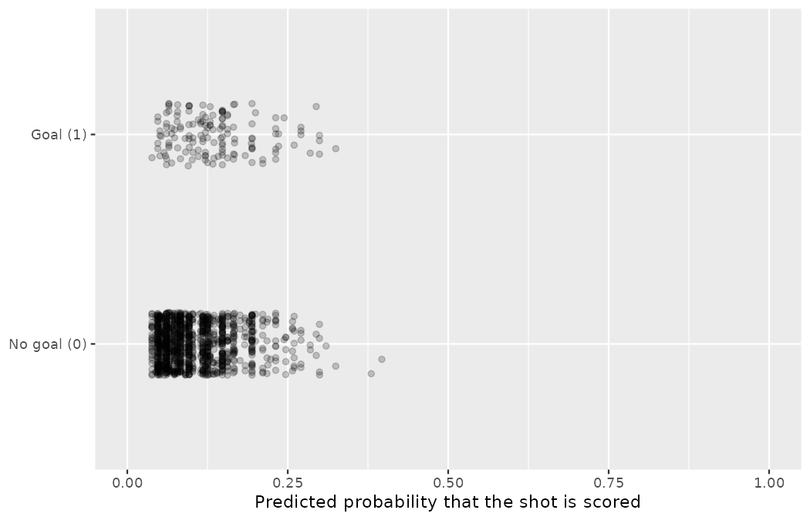
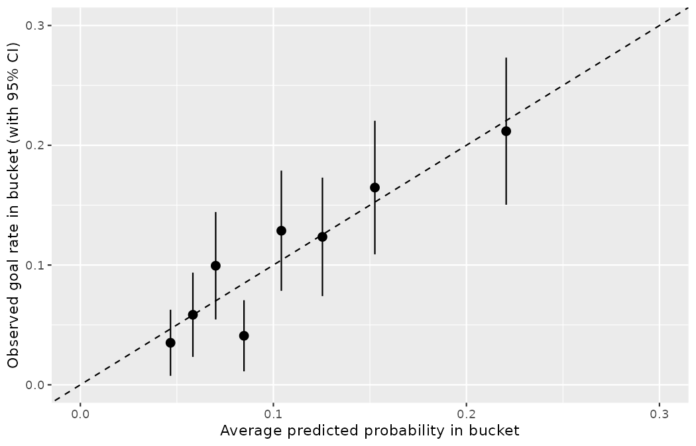
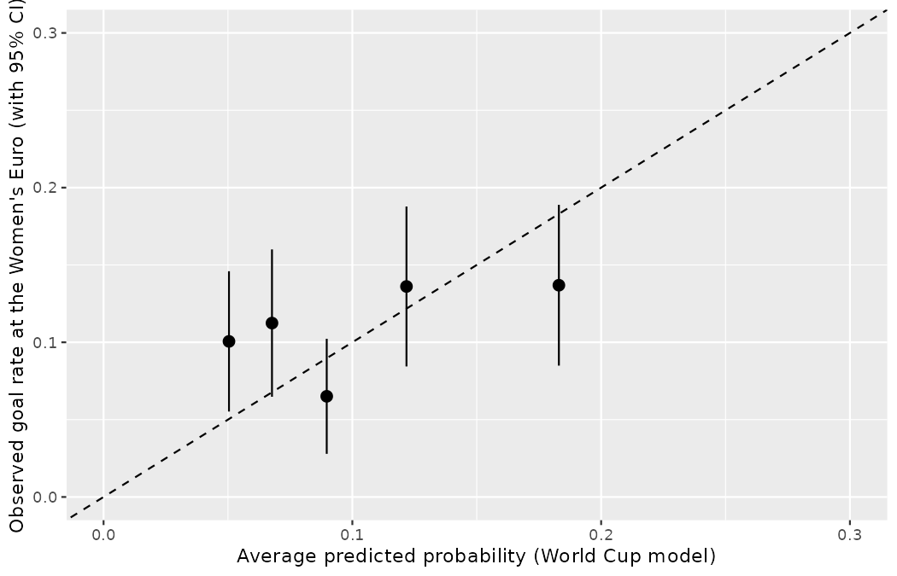

# Inference for logistic regression {#sec-inf-model-logistic}

::: {.chapterintro}
Combining ideas from @sec-model-logistic on logistic regression, @sec-foundations-mathematical on inference with mathematical models, and @sec-inf-model-slr and @sec-inf-model-mlr which apply inferential techniques to the linear model, we wrap up the book's core material by considering inferential methods applied to a logistic regression model.
Additionally, we use cross-validation as a method for independent assessment of the logistic regression model.
:::

As with multiple linear regression, the inference aspect for logistic regression will focus on interpretation of coefficients and relationships between explanatory variables.
Both p-values and cross-validation will be used for assessing a logistic regression model — this is **inference on logistic regression**, the last tool the book adds to your kit.

The dataset is one you know well, and the model is one you were promised.
When @sec-model-logistic fit a logistic regression of `goal` on the circumstances of each 2022 Men's World Cup shot, it closed with a warning: *we have quietly ignored the `p.value` column*, and the full treatment of inference for logistic regression waits until @sec-inf-model-logistic — where this very goal model returns as the centerpiece.
The wait ends here — with one upgrade to the promised model: following @sec-model-mlr's frame, the possession pattern replaces the strike technique among the predictors.

The scouting question comes from Priya Rao.
A tournament produces more shot clips than Northbridge's video team can re-watch with full attention, and Marta Vidal will not pay for analysts to study 1,365 hopeful hits from thirty yards.
What Priya wants is an automated *shortlist*: using only the logged circumstances of each shot — was the striker pressured, was it struck first time, was it a one-on-one, which body part, what possession pattern — flag the shots most likely to be goals, so that scarce viewing time lands on the chances that matter.
Which of the variables describing each shot are important for predicting whether it becomes a goal?

Before any model is fit, the frame must be fixed, and here the book's penalty convention does its usual work.
@sec-model-logistic fit this goal model both ways and concluded that for modeling what makes a contested shot a goal, *the open-play frame is the honest default*: penalties convert at $0.672$ from an uncontested twelve yards and sit inside the reference cell of every indicator, quietly inflating the baseline (you watched them drag a p-value from $0.385$ to $0.084$ in @sec-chp11-pens-out).
So this chapter works on the frame of @sec-model-mlr — open play only, dropping the 13 shots logged with an `Other` body part and the 4 open-play shots with possession pattern `Other` — and, per the convention, the penalties-in companion will be refit and read side by side at the moment it matters most in this chapter: when the p-values are on the table.

```r
library(dplyr)
library(readr)
library(tidyr)
library(broom)
library(ggplot2)

wc2022_shots <- read_csv("data/derived/wc2022_shots.csv")

shots_open <- wc2022_shots |>
  filter(
    shot_type == "Open Play",
    body_part != "Other",
    play_pattern != "Other"
  ) |>
  mutate(
    body_part = factor(body_part, levels = c("Right Foot", "Left Foot", "Head")),
    play_pattern = relevel(factor(play_pattern), ref = "Regular Play")
  )

shots_open |>
  summarize(shots = n(), goals = sum(goal), conversion = mean(goal))
#> # A tibble: 1 × 3
#>   shots goals conversion
#>   <int> <int>      <dbl>
#> 1  1365   147      0.108

wc2022_shots |>
  summarize(shots = n(), goals = sum(goal), conversion = mean(goal))
#> # A tibble: 1 × 3
#>   shots goals conversion
#>   <int> <int>      <dbl>
#> 1  1494   195      0.131
```

Keep the class imbalance in view from the start, because the whole second half of this chapter turns on it: 147 of the 1,365 open-play shots were scored, a rate of $0.108$ (against $0.131$ with the 64 penalties and other dead-ball strikes back in).
Roughly one shot in nine is a goal.
A "model" that predicts *no goal* for every shot ever taken would be right about 89% of the time and would be perfectly useless to Priya, who is hunting precisely for the ninth shot.
The variables available for the hunt are described in @tbl-goal-model-variables.

| variable | description |
|:---|:------------------------------------------|
| `goal` | Indicator for whether the shot was scored. The response variable. |
| `under_pressure` | Indicator for whether the shot was taken under defensive pressure. |
| `first_time` | Indicator for whether the shot was struck first time. |
| `one_on_one` | Indicator for whether the striker faced only the goalkeeper. |
| `body_part` | Body part used: `Right Foot` (reference), `Left Foot`, or `Head`. |
| `play_pattern` | Possession pattern the shot arose from: `Regular Play` (reference), `From Corner`, `From Counter`, `From Free Kick`, `From Goal Kick`, `From Keeper`, `From Kick Off`, or `From Throw In`. |
| `statsbomb_xg` | The vendor's chance-quality number for the shot. Held in reserve until the final section, where the model it comes from goes on trial itself. |

: Variables and their descriptions for the `shots_open` dataset, the open-play frame of the 2022 Men's World Cup shot data. The first three predictors are indicator variables, taking the value 1 (TRUE) if the characteristic is present and 0 (FALSE) otherwise. {#tbl-goal-model-variables}

## Model diagnostics

Before looking at the hypothesis tests associated with the coefficients (turns out they are very similar to those in linear regression!), it is valuable to understand the technical conditions that underlie the inference applied to the logistic regression model.
Generally, as you've seen in the logistic regression modeling examples, it is imperative that the response variable is binary.
Additionally, the key technical condition for logistic regression has to do with the relationship between the predictor variables ($x_i$ values) and the probability the outcome will be a success.
It turns out, the relationship is a specific functional form called a logit function, where $\text{logit}(p) = \log_e\left(\frac{p}{1-p}\right)$ — the transformation you took apart piece by piece in @sec-modelingTheProbabilityOfAnEvent.
The function may feel complicated, and memorizing the formula of the logit is not necessary for understanding logistic regression.
What you do need to remember is that the probability of the outcome being a success is a function of a linear combination of the explanatory variables.

::: {.callout-important title="Logistic regression conditions"}
There are two key **technical conditions** for fitting a logistic regression model:

1.  Each outcome $Y_i$ is independent of the other outcomes.
2.  Each predictor $x_i$ is linearly related to logit$(p_i)$ if all other predictors are held constant.
:::

The first logistic regression model condition — independence of the outcomes — deserves more suspicion here than it did for Priya's audit dossiers in @sec-model-logistic, where profiles were generated independently by design.
Shots are events inside matches: a parried shot can produce a rebound two seconds later, and the two outcomes are plainly linked.
Such clusters are a small minority of the 1,365 shots, and shots from different matches carry no such linkage, so we proceed treating independence as a reasonable approximation — but state the caveat, as you would in any memo.

The second condition of the logistic regression model is not easily checked without a fairly sizable amount of data.
Luckily, we have 1,365 shots in the dataset!
Let's first visualize these data by plotting the true classification of the shots against the model's fitted probabilities.
We fit the model with all five predictors of @tbl-goal-model-variables — the formal presentation of the fit waits for @sec-inf-log-reg-soft — and attach each shot's fitted probability $\hat{p}_i$ with `predict()`:

```r
goal_fit <- glm(
  goal ~ under_pressure + first_time + one_on_one + body_part + play_pattern,
  data = shots_open, family = binomial
)

shots_open <- shots_open |>
  mutate(p_hat = predict(goal_fit, type = "response"))

summary(shots_open$p_hat)
#>    Min. 1st Qu.  Median    Mean 3rd Qu.    Max.
#> 0.03844 0.06109 0.09611 0.10769 0.13959 0.39659

ggplot(shots_open,
       aes(x = p_hat,
           y = factor(goal, levels = c(FALSE, TRUE),
                      labels = c("No goal (0)", "Goal (1)")))) +
  geom_point(position = position_jitter(height = 0.15, seed = 2600),
             alpha = 0.2) +
  coord_cartesian(xlim = c(0, 1)) +
  labs(
    x = "Predicted probability that the shot is scored",
    y = NULL
  )
```

{fig-alt="Jittered plot of the true shot outcomes against the model's fitted probabilities: two horizontal bands with the no-goal shots along the bottom and the goals along the top. Every fitted probability lies between 0.038 and 0.397, but the goal band sits visibly further right than the no-goal band." width=85%}

The plot shows two horizontal bands of points — the no-goal shots along the bottom, the goals along the top, jittered so that shots with nearly identical values aren't plotted exactly on top of one another.
The predictions do not remotely separate the two bands: every fitted probability lives between $0.038$ and $0.397$, and both bands are thickest at the low end.
But look closely at where each band carries its weight: the goal band sits visibly further right than the no-goal band.
The model cannot *call* goals, but it does *rank* shots — which, for a shortlist, is the property that matters.

We'd like to assess the quality of the model.
For example, we might ask: if we look at shots that we modeled as having a 10% chance of being scored, do we find out 10% of them actually are goals?
We can check this for groups of the data by constructing a plot as follows:

1.  Bucket the observations into groups based on their predicted probabilities.
2.  Compute the average predicted probability for each group.
3.  Compute the observed probability for each group, along with a 95% confidence interval for the true probability of success for those individuals — built exactly as in @sec-foundations-mathematical, as the point estimate $\pm\ 1.96 \times SE$ with $SE = \sqrt{\hat{p}(1-\hat{p})/n}$ from @sec-inference-one-prop.
4.  Plot the observed probabilities (with 95% confidence intervals) against the average predicted probabilities for each group.

If the model does a good job describing the data, the plotted points should fall close to the line $y = x$, since the predicted probabilities should be similar to the observed probabilities.
We can use the confidence intervals to roughly gauge whether anything might be amiss.

```r
wc_buckets <- shots_open |>
  mutate(bucket = ntile(p_hat, 8)) |>
  group_by(bucket) |>
  summarize(
    shots = n(),
    avg_pred = mean(p_hat),
    obs_rate = mean(goal),
    lower = obs_rate - 1.96 * sqrt(obs_rate * (1 - obs_rate) / shots),
    upper = obs_rate + 1.96 * sqrt(obs_rate * (1 - obs_rate) / shots)
  )
wc_buckets
#> # A tibble: 8 × 6
#>   bucket shots avg_pred obs_rate   lower  upper
#>    <int> <int>    <dbl>    <dbl>   <dbl>  <dbl>
#> 1      1   171   0.0467   0.0351 0.00751 0.0627
#> 2      2   171   0.0583   0.0585 0.0233  0.0936
#> 3      3   171   0.0701   0.0994 0.0546  0.144
#> 4      4   171   0.0848   0.0409 0.0112  0.0706
#> 5      5   171   0.104    0.129  0.0785  0.179
#> 6      6   170   0.125    0.124  0.0741  0.173
#> 7      7   170   0.153    0.165  0.109   0.220
#> 8      8   170   0.221    0.212  0.150   0.273

ggplot(wc_buckets, aes(x = avg_pred, y = obs_rate)) +
  geom_abline(slope = 1, intercept = 0, linetype = "dashed") +
  geom_pointrange(aes(ymin = lower, ymax = upper)) +
  coord_cartesian(xlim = c(0, 0.3), ylim = c(0, 0.3)) +
  labs(
    x = "Average predicted probability in bucket",
    y = "Observed goal rate in bucket (with 95% CI)"
  )
```

{fig-alt="Calibration plot of observed goal rate with 95% confidence intervals against average predicted probability for eight equal-count buckets. The points climb alongside the dashed y equals x line, and seven of the eight intervals cover it — bucket 4 is the one miss." width=85%}

The eight equal-count buckets climb from an average prediction of $0.047$ to $0.221$, and the observed goal rates climb with them, from $0.035$ to $0.212$.
The dashed $y = x$ line is inside the confidence bound of the 95% confidence intervals for seven of the eight buckets, suggesting the logistic fit is reasonable; the exception is bucket 4, where shots predicted at $0.085$ scored only $0.041$ of the time and the interval $(0.011, 0.071)$ misses the line.
With eight separate 95% intervals, one miss is roughly the accounting you should expect from chance alone — worth an eyebrow, not an alarm.
(Two honesty notes on the intervals themselves: the lowest bucket holds only 6 goals, straining the success-failure condition of @sec-inference-one-prop, so treat its interval as rough; and this bucketing check is exactly the chance-quality-band idea you met in the exercises of @sec-model-logistic, now upgraded with confidence intervals.)

A plot like this helps to better understand the deviations.
Additional diagnostics may be created that are similar to those featured in @sec-tech-cond-linmod.
For instance, we could compute residuals as the observed outcome minus the expected outcome,

$$e_i = Y_i - \hat{p}_i,$$

and then we could create plots of these residuals against each predictor.
This is a new equation built entirely from old parts, so take it apart before using it.
The letter $e$ with subscript $i$ is the same residual notation you have carried since @sec-model-slr: the leftover for observation $i$, computed as *observed minus fitted*.
$Y_i$ is the binary outcome of @sec-model-logistic — capital $Y$, the response itself, equal to 1 if shot $i$ was scored and 0 if not.
And $\hat{p}_i$ is that chapter's fitted probability: the model's data-based estimate of shot $i$'s scoring probability.
What has changed since @sec-model-slr is not the recipe but the *scales of its ingredients*: there, $y_i$ and $\hat{y}_i$ both lived on the response's own scale, and residuals could land anywhere; here the observed value is always exactly 0 or 1 while the fitted value is a probability strictly between them.
So a logistic residual can only take one of two values for a given shot: $e_i = 1 - \hat{p}_i$ if the shot was scored, or $e_i = -\hat{p}_i$ if it was not.
The first two shots in the dataset show the pair:

```r
shots_open |>
  slice(1:2) |>
  select(player, goal, p_hat) |>
  mutate(e_i = as.numeric(goal) - p_hat)
#> # A tibble: 2 × 4
#>   player            goal  p_hat    e_i
#>   <chr>             <lgl> <dbl>  <dbl>
#> 1 Mark Anthony Kaye FALSE 0.184 -0.184
#> 2 Hakim Ziyech      TRUE  0.156  0.844
```

Kaye's unscored shot leaves a small negative residual; Ziyech's goal, priced at $0.156$, leaves a residual of $+0.844$.
Plotted against any predictor, logistic residuals therefore form two drifting stripes rather than the even scatter of @sec-model-slr — exactly the striped picture @sec-tech-cond-linmod showed when a binary outcome was forced through the linear machinery, and the reason that chapter sent you here.

::: {.callout-tip title="Check your understanding"}
A shot carries a fitted probability of $\hat{p}_i = 0.25.$
What are the two possible values of its residual $e_i$?
And which shots produce the largest *positive* residuals in the whole dataset?

------------------------------------------------------------------------

If the shot is scored, $e_i = 1 - 0.25 = 0.75$; if not, $e_i = 0 - 0.25 = -0.25.$
The largest positive residuals belong to goals the model priced lowest — an unpressured, non-first-time, right-footed shot from regular play that went in anyway would carry $e_i \approx 1 - 0.06 = 0.94.$
In scouting language: the positive stripe is where the model's surprises live, and a striker who keeps appearing there is either running hot or seeing something the tags cannot.
:::

## Multiple logistic regression output from software {#sec-inf-log-reg-soft}

As in @sec-model-mlr and @sec-model-logistic, software finds the coefficient estimates — for a logistic model by optimizing the likelihood rather than by least squares.
The unknown population model for our five predictors can be written as:

$$
\begin{aligned}
\log_e\bigg(\frac{p}{1-p}\bigg) = \beta_0 &+ \beta_1 \times \texttt{under\_pressure} + \beta_2 \times \texttt{first\_time} + \beta_3 \times \texttt{one\_on\_one} \\
&+ \beta_4 \times \texttt{body\_part}_{\texttt{Left Foot}} + \beta_5 \times \texttt{body\_part}_{\texttt{Head}} \\
&+ \beta_6 \times \texttt{play\_pattern}_{\texttt{From Corner}} + \cdots + \beta_{12} \times \texttt{play\_pattern}_{\texttt{From Throw In}}
\end{aligned}
$$

The two categorical predictors enter through level indicators, exactly as in @sec-model-mlr: one coefficient per non-reference level, so `body_part` contributes two ($\beta_4, \beta_5$) and `play_pattern` seven ($\beta_6$ through $\beta_{12}$), each measured against the reference shot — right-footed, from regular play.
The estimated equation, using the higher-precision coefficients from `round(coef(goal_fit), 4)`, is:

$$
\begin{aligned}
\log_e\bigg(\frac{\hat{p}}{1-\hat{p}}\bigg) = -2.7323 &- 0.0695 \times \texttt{under\_pressure} + 0.9832 \times \texttt{first\_time} \\
&+ 1.1256 \times \texttt{one\_on\_one} + 0.3273 \times \texttt{body\_part}_{\texttt{Left Foot}} \\
&+ 0.7566 \times \texttt{body\_part}_{\texttt{Head}} - 0.4870 \times \texttt{play\_pattern}_{\texttt{From Corner}} \\
&+ 0.4304 \times \texttt{play\_pattern}_{\texttt{From Counter}} - 0.1960 \times \texttt{play\_pattern}_{\texttt{From Free Kick}} \\
&+ 0.5476 \times \texttt{play\_pattern}_{\texttt{From Goal Kick}} - 0.1829 \times \texttt{play\_pattern}_{\texttt{From Keeper}} \\
&- 0.0281 \times \texttt{play\_pattern}_{\texttt{From Kick Off}} - 0.2651 \times \texttt{play\_pattern}_{\texttt{From Throw In}}
\end{aligned}
$$

```r
tidy(goal_fit)
#> # A tibble: 13 × 5
#>    term                       estimate std.error statistic  p.value
#>    <chr>                         <dbl>     <dbl>     <dbl>    <dbl>
#>  1 (Intercept)                 -2.73       0.224  -12.2    2.78e-34
#>  2 under_pressureTRUE          -0.0695     0.261   -0.266  7.90e- 1
#>  3 first_timeTRUE               0.983      0.209    4.70   2.62e- 6
#>  4 one_on_oneTRUE               1.13       0.322    3.49   4.81e- 4
#>  5 body_partLeft Foot           0.327      0.202    1.62   1.05e- 1
#>  6 body_partHead                0.757      0.295    2.56   1.04e- 2
#>  7 play_patternFrom Corner     -0.487      0.308   -1.58   1.14e- 1
#>  8 play_patternFrom Counter     0.430      0.390    1.10   2.69e- 1
#>  9 play_patternFrom Free Kick  -0.196      0.265   -0.740  4.59e- 1
#> 10 play_patternFrom Goal Kick   0.548      0.339    1.62   1.06e- 1
#> 11 play_patternFrom Keeper     -0.183      0.768   -0.238  8.12e- 1
#> 12 play_patternFrom Kick Off   -0.0281     0.777   -0.0362 9.71e- 1
#> 13 play_patternFrom Throw In   -0.265      0.257   -1.03   3.03e- 1
```

Not only does the summary table provide the estimates for the coefficients, it also provides the information for the inference analysis (i.e., hypothesis testing) which is the focus of this chapter.

Now the debt this book has carried since @sec-model-slr comes due.
Every `tidy()` table you have seen — for chance-quality lines, for the six-tag model of @sec-model-mlr, for the audit and goal models of @sec-model-logistic — has printed `std.error`, `statistic`, and `p.value` columns you were asked to set aside.
Here is what they have meant all along.
The `std.error` column is the standard error of each coefficient estimate, in exactly the sense of @sec-foundations-mathematical: the typical sample-to-sample wobble of $b_i$.
The `statistic` column is the coefficient measured in units of its own standard error,

$$Z = \frac{b_i - 0}{SE(b_i)},$$

the number of standard errors the estimate sits from the null value of zero — check it on the `first_time` row: $0.9832 / 0.209 = 4.70.$
And `p.value` is that statistic's two-sided tail probability.
For the linear models of @sec-inf-model-slr and @sec-inf-model-mlr, the reference distribution was a $t$-distribution; for logistic regression the statistic is read on the standard normal curve of @sec-foundations-mathematical, and the resulting test is known as a *Wald test*.[^26-inf-model-logistic-1]
Nothing about the logic is new — point estimate, standard error, standardized statistic, tail probability — you have simply earned, chapter by chapter since @sec-foundations-randomization, every piece the software was silently printing.

[^26-inf-model-logistic-1]: Named for Abraham Wald.
    The Wald statistic $Z = b_i / SE(b_i)$ and its normal reference distribution are the standard large-sample output of `glm()`; with 1,365 shots, the approximation is comfortable here.

As in @sec-inf-model-mlr, with **multiple predictors**, each hypothesis test (for each of the explanatory variables) is conditioned on each of the other variables remaining in the model.

> if multiple predictors $H_0: \beta_i = 0$ given other variables in the model

Using the output above and focusing on each of the variable p-values (here we won't discuss the p-value associated with the intercept), we can write out the hypotheses associated with each row of the table:

-   $H_0: \beta_1 = 0$ given `first_time`, `one_on_one`, `body_part`, and `play_pattern` are included in the model
-   $H_0: \beta_2 = 0$ given `under_pressure`, `one_on_one`, `body_part`, and `play_pattern` are included in the model
-   $H_0: \beta_3 = 0$ given `under_pressure`, `first_time`, `body_part`, and `play_pattern` are included in the model
-   and one hypothesis for each of the nine level-indicator coefficients, stated against the reference level: for example, $H_0: \beta_5 = 0$ — headers score at the same rate as right-footed shots — given `under_pressure`, `first_time`, `one_on_one`, the `Left Foot` indicator, and `play_pattern` are included in the model.

The p-values sort the tournament's folklore with one pass of the eye.
At the discernibility level of 0.05, three rows act as statistically discernible in the model, despite the inclusion of any of the other variables: `first_time` $(p\text{-value} \approx 2.6 \times 10^{-6})$, `one_on_one` $(p\text{-value} \approx 0.0005)$, and the `Head` level indicator $(p\text{-value} = 0.010)$ — *holding the other predictors constant*, headers score discernibly more often than right-footed shots.
Recall @sec-data-design's warning that any raw header comparison is confounded with the delivery patterns headers arrive from; this coefficient is the header effect *after* `play_pattern` is held fixed, which is exactly the adjustment that warning demanded.
Consider the p-value on $H_0: \beta_2 = 0.$
The low p-value says that it would be extremely unlikely to observe data that yield a coefficient on `first_time` at least as far from 0 as $0.983$ (i.e., $|b_2| > 0.983$) if the true relationship between `first_time` and `goal` was non-existent (i.e., if $\beta_2 = 0$) **and** the model also included the other four predictors.
Note also that the coefficient on `one_on_one` $(1.1256)$ is *larger* than the coefficient on `first_time` $(0.9832)$, yet its p-value is larger too.
The explanation sits in the `std.error` column: in units of standard errors, `first_time` is $4.70$ from zero while `one_on_one` — estimated from only 73 one-on-ones — is $3.49$ from zero.
The magnitude of a coefficient is not its evidence; it's all about context, and the context is the standard error.

And then there is `under_pressure`: an estimate of $-0.0695$, a Wald statistic of $-0.27$, a p-value of $0.79.$
Given the other four predictors, defensive pressure is nowhere near a statistically discernible predictor of scoring in open play.
You should feel the whole book converge on that row: the permutation test of @sec-chp11-pens-out found no discernible open-play pressure effect on conversion $(p = 0.385)$, the open-play refit in @sec-model-logistic watched the pressure coefficient all but vanish, and @sec-model-application dropped the pressure tag from its chance-quality model entirely.
Four chapters, three toolkits, one consistent verdict — and one more reminder that a claim every scout repeats ("pressure ruins the shot") can fail to survive contact with the data frame that actually tests it.

We remind you that although p-values provide some information about the importance of each of the predictors in the model, there are many, arguably more important, aspects to consider when choosing the best model.
And the conclusions are, as always with this dataset, associational: nobody randomly assigned pressure, body parts, or possession patterns to shots.

::: {.callout-note title="Worked example"}
Use the estimated equation to find the probability that a first-time header from a corner — no pressure, no one-on-one — is scored.
Then compare it with the same header not struck first time.

------------------------------------------------------------------------

Sum the relevant coefficients:

$$-2.7323 + 0.9832 + 0.7566 - 0.4870 = -1.4795$$

Back-transform, as in @sec-modelingTheProbabilityOfAnEvent:

$$\hat{p} = \frac{e^{-1.4795}}{1 + e^{-1.4795}} = \frac{0.2278}{1.2278} = 0.1855$$

Without the first-time strike the log odds are $-2.7323 + 0.7566 - 0.4870 = -2.4627$, giving $\hat{p} = 0.0785.$
R agrees, without the rounding:

```r
corner_headers <- tibble(
  under_pressure = FALSE,
  first_time = c(TRUE, FALSE),
  one_on_one = FALSE,
  body_part = factor("Head", levels = levels(shots_open$body_part)),
  play_pattern = factor("From Corner", levels = levels(shots_open$play_pattern))
)
round(predict(goal_fit, corner_headers, type = "response"), 4)
#>      1      2
#> 0.1855 0.0785
```

The classic near-post flick is, by this model, more than twice the chance of the header from the same delivery that waits on the ball.
:::

::: {.callout-tip title="Check your understanding"}
Verify the `statistic` and `p.value` entries for the `one_on_one` row from `estimate` and `std.error`, and state precisely what the hypothesis being tested is.

------------------------------------------------------------------------

$Z = 1.1256 / 0.3222 = 3.49,$ matching the `statistic` column.
The p-value is the two-sided normal tail, $2 \times P(Z \geq 3.49) \approx 0.0005,$ matching `p.value`.
The hypothesis is *conditional*: $H_0: \beta_3 = 0$ *given that* `under_pressure`, `first_time`, `body_part`, and `play_pattern` remain in the model — the test asks whether the one-on-one tag adds discernible signal beyond those variables, not whether one-on-ones are associated with scoring on their own.
:::

Per the book's penalty convention, before these p-values travel into any memo, the companion fit must be shown: the identical model on all 1,494 shots, penalties in.
The `Other` levels of `body_part` and `play_pattern` return to the data — and the play-pattern bucket labeled `Other` is precisely where the data file logs all 64 penalty kicks.

```r
shots_all <- wc2022_shots |>
  mutate(
    body_part = relevel(factor(body_part), ref = "Right Foot"),
    play_pattern = relevel(factor(play_pattern), ref = "Regular Play")
  )

goal_fit_all <- glm(
  goal ~ under_pressure + first_time + one_on_one + body_part + play_pattern,
  data = shots_all, family = binomial
)
tidy(goal_fit_all)
#> # A tibble: 15 × 5
#>    term                       estimate std.error statistic  p.value
#>    <chr>                         <dbl>     <dbl>     <dbl>    <dbl>
#>  1 (Intercept)                 -2.63       0.213  -12.3    5.43e-35
#>  2 under_pressureTRUE          -0.104      0.260   -0.402  6.88e- 1
#>  3 first_timeTRUE               0.857      0.198    4.32   1.55e- 5
#>  4 one_on_oneTRUE               0.576      0.322    1.79   7.39e- 2
#>  5 body_partHead                0.774      0.288    2.69   7.20e- 3
#>  6 body_partLeft Foot           0.292      0.189    1.54   1.22e- 1
#>  7 body_partOther               1.26       0.703    1.80   7.21e- 2
#>  8 play_patternFrom Corner     -0.571      0.307   -1.86   6.27e- 2
#>  9 play_patternFrom Counter     0.465      0.386    1.20   2.28e- 1
#> 10 play_patternFrom Free Kick  -0.155      0.250   -0.619  5.36e- 1
#> 11 play_patternFrom Goal Kick   0.637      0.330    1.93   5.37e- 2
#> 12 play_patternFrom Keeper     -0.189      0.766   -0.246  8.06e- 1
#> 13 play_patternFrom Kick Off   -0.0297     0.775   -0.0383 9.69e- 1
#> 14 play_patternFrom Throw In   -0.271      0.256   -1.06   2.89e- 1
#> 15 play_patternOther            3.02       0.316    9.54   1.43e-21
```

Read the pair of tables the way @sec-chp11-pens-out taught you, and two findings stand out.
First, the single most discernible slope in the penalties-in table — $b = 3.02,$ $Z = 9.54,$ a p-value of order $10^{-21}$ — belongs to `play_patternOther`, the indicator whose main job is to hold 64 uncontested kicks converting at $0.672.$
The model has not discovered football insight; it has rediscovered the penalty spot.
Second, and more dangerous: the *verdict on a real predictor flips*.
The one-on-one coefficient halves from $1.126$ to $0.576$ and its p-value rises from $0.0005$ to $0.074$ — not statistically discernible at $\alpha = 0.05$ — because six penalties carry the one-on-one tag (a data quirk flagged back in @sec-model-mlr) and the `Other` indicator now absorbs credit that the open-play frame attributed to genuine breakaways.
Same tournament, same machinery, one frame decision — and a shortlist built on the penalties-in table would have discarded the tag this chapter will shortly show to be the single most useful one.
The open-play fit remains the frame this chapter teaches, with the companion on the record.

As with linear regression (see @sec-inf-mult-reg-collin), existence of predictors that are correlated with each other can affect both the coefficient estimates and the associated p-values: one-on-ones arise disproportionately on counters, headers arrive from corners — the entanglements you have tracked since @sec-data-design.
However, investigating multicollinearity in a logistic regression model is saved for a text which provides more detail about logistic regression.
Next, as a model building alternative (or enhancement) to p-values, we revisit cross-validation, within the context of predicting the outcome of each of the individual shots.

## Cross-validation for prediction error {#sec-inf-log-reg-cv}

The p-value is a probability measure under a setting of no relationship.
That p-value provides information about the degree of the relationship (e.g., above we measured the relationship between `goal` and `first_time` using a p-value), but the p-value does not measure how well the model will predict the individual shots (e.g., the accuracy of the model).
Depending on the goal of the research project, you might be inclined to focus on variable importance (through p-values) or you might be inclined to focus on prediction accuracy (through cross-validation).
Priya's shortlist is squarely the second kind of project: Marta does not care whether $\beta_3$ is zero; she cares how many of next tournament's goals the flagged clips will contain.

Here we present a method for using **cross-validation** **accuracy** to determine which variables (if any) should be used in a model which predicts whether a shot becomes a goal.
A full treatment of cross-validation and logistic regression models is beyond the scope of this text.
Using $k$-fold cross-validation, we can build $k$ different models which are used to predict the observations in each of the $k$ holdout samples — the same fold-and-holdout discipline you applied to linear models in @sec-inf-mult-reg-cv.
As there, we compare a smaller logistic regression model to a larger logistic regression model.
The smaller model uses only the `one_on_one` variable; the complete dataset (not cross-validated) model output is:

**The smaller model:**

$$\log_e\bigg(\frac{\hat{p}}{1-\hat{p}}\bigg) = -2.1818 + 0.9114 \times \texttt{one\_on\_one}$$

```r
goal_small <- glm(goal ~ one_on_one, data = shots_open, family = binomial)
tidy(goal_small)
#> # A tibble: 2 × 5
#>   term           estimate std.error statistic   p.value
#>   <chr>             <dbl>     <dbl>     <dbl>     <dbl>
#> 1 (Intercept)      -2.18     0.0922    -23.7  6.66e-124
#> 2 one_on_oneTRUE    0.911    0.298       3.06 2.19e-  3

shots_open |>
  group_by(one_on_one) |>
  summarize(shots = n(), goals = sum(goal), conversion = mean(goal))
#> # A tibble: 2 × 4
#>   one_on_one shots goals conversion
#>   <lgl>      <int> <int>      <dbl>
#> 1 FALSE       1292   131      0.101
#> 2 TRUE          73    16      0.219
```

With a single binary predictor the model simply reproduces the two group conversion rates — back-transforming $-2.1818$ gives $0.101$ and $-2.1818 + 0.9114 = -1.2704$ gives $0.219$, a fact you proved for yourself in @sec-modelingTheProbabilityOfAnEvent.
For the cross-validation we split the 1,365 shots into $k = 4$ folds, seeded so you can reproduce every number that follows, and fit each model four times, always predicting for the quarter of the data the model has never seen:

```r
set.seed(2601)
shots_cv <- shots_open |>
  mutate(fold = sample(rep(1:4, length.out = n())))

shots_cv |>
  count(fold)
#> # A tibble: 4 × 2
#>    fold     n
#>   <int> <int>
#> 1     1   342
#> 2     2   341
#> 3     3   341
#> 4     4   341

cv_predictions <- function(model_formula, data) {
  predictions <- vector("list", 4)
  for (f in 1:4) {
    train <- filter(data, fold != f)
    test  <- filter(data, fold == f)
    fold_fit <- glm(model_formula, data = train, family = binomial)
    predictions[[f]] <- test |>
      mutate(p_cv = predict(fold_fit, newdata = test, type = "response"))
  }
  bind_rows(predictions)
}

cv_small <- cv_predictions(goal ~ one_on_one, shots_cv)
```

For each cross-validated model, the coefficients change slightly, and the model is used to make independent predictions on the holdout sample.
The model built without fold 1, for instance, has estimates close to — but not equal to — the full-data fit above:

```r
glm(goal ~ one_on_one, data = filter(shots_cv, fold != 1),
    family = binomial) |>
  tidy() |>
  select(term, estimate)
#> # A tibble: 2 × 2
#>   term           estimate
#>   <chr>             <dbl>
#> 1 (Intercept)      -2.12
#> 2 one_on_oneTRUE    0.815
```

To turn a predicted probability into a shortlist decision, we need a cutoff, and here the class imbalance rules.
The software default of $0.5$ would be absurd: no fitted probability in this dataset even reaches $0.4$, so a $0.5$ cutoff flags nothing and reproduces the useless 89%-accurate "no goal, ever" model.
Because the purpose is a shortlist — where the expensive error is *missing* a goal-like chance, the scouting department's version of passing on a gem (@sec-foundations-decision-errors) — we instead use a low cutoff of $0.10$, just below the frame's base rate of $0.108$, and predict "goal" for any shot whose cross-validated probability exceeds it.
In the tables that follow, `goalTP` is the proportion of true goals that were predicted to be goals, and `nongoalTP` is the proportion of true non-goals that were predicted to be non-goals.

```r
cv_small |>
  mutate(pred_goal = p_cv > 0.10) |>
  group_by(fold) |>
  summarize(
    count = n(),
    accuracy = mean(goal == pred_goal),
    nongoalTP = sum(!goal & !pred_goal) / sum(!goal),
    goalTP = sum(goal & pred_goal) / sum(goal)
  )
#> # A tibble: 4 × 5
#>    fold count accuracy nongoalTP goalTP
#>   <int> <int>    <dbl>     <dbl>  <dbl>
#> 1     1   342   0.0906     0     1
#> 2     2   341   0.839      0.953 0.0682
#> 3     3   341   0.836      0.936 0.119
#> 4     4   341   0.0880     0     1
```

Something strange has happened, and it is worth slowing down for, because it is the single-predictor model's failure mode laid bare.
A model with one binary predictor can price a shot at only *two* values — one for ordinary shots, one for one-on-ones.
Here are those two prices, for each fold's training fit:

```r
cv_small |>
  distinct(fold, one_on_one, p_cv) |>
  pivot_wider(names_from = one_on_one, values_from = p_cv,
              names_prefix = "p_cv_1v1_") |>
  mutate(across(starts_with("p_cv"), \(x) round(x, 4)))
#> # A tibble: 4 × 3
#>    fold p_cv_1v1_FALSE p_cv_1v1_TRUE
#>   <int>          <dbl>         <dbl>
#> 1     1         0.107          0.213
#> 2     2         0.093          0.232
#> 3     3         0.0964         0.224
#> 4     4         0.109          0.208
```

The ordinary-shot price hovers exactly at the cutoff: sampling variability across training sets puts it *above* $0.10$ for folds 1 and 4 and *below* for folds 2 and 3.
When it lands above, the model flags every single shot — `goalTP` is a perfect $1$, `nongoalTP` collapses to $0$, and the "shortlist" is the entire tournament.
When it lands below, only the one-on-ones are flagged, and the shortlist misses roughly nine goals in ten.
Either way the smaller model is useless for Priya's purpose, and the fold-to-fold flip is itself the lesson: a one-tag model classifying at a cutoff near the base rate sits on a knife edge, and chance decides which side of it each refit falls.
(Notice, too, how the `accuracy` column seesaws between $0.09$ and $0.84$ while describing the *same* useless model — with an 89/11 class split, accuracy alone is the wrong yardstick, which is exactly why the two TP columns are in the table.)

The larger model uses all five predictors — `under_pressure`, `first_time`, `one_on_one`, `body_part`, and `play_pattern` — as laid out in @sec-inf-log-reg-soft.
Its cross-validated shortlist, at the same $0.10$ cutoff:

**The larger model:**

```r
cv_large <- cv_predictions(
  goal ~ under_pressure + first_time + one_on_one + body_part + play_pattern,
  shots_cv
)

cv_large |>
  mutate(pred_goal = p_cv > 0.10) |>
  group_by(fold) |>
  summarize(
    count = n(),
    accuracy = mean(goal == pred_goal),
    nongoalTP = sum(!goal & !pred_goal) / sum(!goal),
    goalTP = sum(goal & pred_goal) / sum(goal)
  )
#> # A tibble: 4 × 5
#>    fold count accuracy nongoalTP goalTP
#>   <int> <int>    <dbl>     <dbl>  <dbl>
#> 1     1   342    0.570     0.579  0.484
#> 2     2   341    0.584     0.579  0.614
#> 3     3   341    0.589     0.595  0.548
#> 4     4   341    0.472     0.441  0.8
```

Somewhat expected, the larger model was able to capture more nuance in the shots, which leads to a usable trade-off where the smaller model offered none: fold by fold, the shortlist now catches roughly half to four-fifths of the goals (`goalTP` between $0.48$ and $0.80$) while correctly leaving out roughly half of the non-goals (`nongoalTP` between $0.44$ and $0.60$).
In classification language, `goalTP` is the model's *recall* (or *sensitivity*) — the share of the things we care about that we actually caught — and `nongoalTP` is its *specificity* — the share of the dross correctly filtered away.
At this cutoff, Priya's analysts would re-watch roughly half the tournament's clips to find well over half of its goals; a blunt instrument, but a real one, and an honest reflection of how much (and how little) five context tags know about finishing.
However, it is not true that adding variables will always lead to better predictions, as correlated or noise variables may dampen the signal from the set of variables that truly predict the outcome — you saw AIC police exactly this appetite in @sec-model-logistic.

::: {.callout-tip title="Check your understanding"}
The recall/specificity balance is set by the cutoff, not by the model.
Here is the larger model again, cross-validated identically but classified at $0.15$:

```r
cv_large |>
  mutate(pred_goal = p_cv > 0.15) |>
  group_by(fold) |>
  summarize(
    count = n(),
    accuracy = mean(goal == pred_goal),
    nongoalTP = sum(!goal & !pred_goal) / sum(!goal),
    goalTP = sum(goal & pred_goal) / sum(goal)
  )
#> # A tibble: 4 × 5
#>    fold count accuracy nongoalTP goalTP
#>   <int> <int>    <dbl>     <dbl>  <dbl>
#> 1     1   342    0.711     0.752  0.290
#> 2     2   341    0.780     0.872  0.159
#> 3     3   341    0.730     0.789  0.310
#> 4     4   341    0.742     0.759  0.567

```

Accuracy rose in every fold. Should Priya raise the cutoff?

------------------------------------------------------------------------

Almost certainly not, and the two TP columns say why: specificity improved (fewer wasted clips), but recall collapsed — in fold 2, the $0.15$ shortlist caught barely one goal in six.
For a screening tool whose costly error is the missed gem, trading recall for accuracy is trading the objective for the yardstick.
The right cutoff is a *decision* about error costs, in exactly the sense of @sec-foundations-decision-errors — it belongs to Marta's budget sheet, not to the software's defaults.
:::

### Taking the model abroad: external validation {#sec-chp26-external}

Cross-validation estimates how the model performs on shots *from the same tournament* that it never saw.
It cannot answer the question @sec-model-application taught you to fear when a men's World Cup model met Grace Geyoro's Euro goal: what happens when the model leaves home?
Following the external-validation discipline of @sec-inf-mult-reg-cv, we train the larger model on the entire 2022 Men's World Cup frame — that is `goal_fit`, already in hand — and test it, once, on the open-play shots of the 2025 Women's Euro, built with the identical filter (which drops 7 of the 851 open-play shots: 4 with body part `Other`, 3 with pattern `Other`):

```r
weuro2025_shots <- read_csv("data/derived/weuro2025_shots.csv")

weuro_open <- weuro2025_shots |>
  filter(
    shot_type == "Open Play",
    body_part != "Other",
    play_pattern != "Other"
  ) |>
  mutate(
    body_part = factor(body_part, levels = levels(shots_open$body_part)),
    play_pattern = factor(play_pattern, levels = levels(shots_open$play_pattern))
  )

weuro_open <- weuro_open |>
  mutate(p_hat = predict(goal_fit, newdata = weuro_open, type = "response"))

weuro_open |>
  summarize(shots = n(), goals = sum(goal), conversion = mean(goal))
#> # A tibble: 1 × 3
#>   shots goals conversion
#>   <int> <int>      <dbl>
#> 1   844    93      0.110

weuro_open |>
  mutate(pred_goal = p_hat > 0.10) |>
  summarize(
    count = n(),
    flagged = sum(pred_goal),
    accuracy = mean(goal == pred_goal),
    nongoalTP = sum(!goal & !pred_goal) / sum(!goal),
    goalTP = sum(goal & pred_goal) / sum(goal)
  )
#> # A tibble: 1 × 5
#>   count flagged accuracy nongoalTP goalTP
#>   <int>   <int>    <dbl>     <dbl>  <dbl>
#> 1   844     342    0.594     0.606  0.495
```

(Note the `levels =` lines: the Euro's factor levels are pinned to the World Cup model's, and it is worth checking — as this code implicitly does — that the new competition produced no possession pattern the training data never saw, since the model would have no coefficient for it.)

The result should be read with some satisfaction: at the same $0.10$ cutoff, the exported shortlist flags 342 of 844 clips, catches $49.5\%$ of the Euro's open-play goals, and filters out $60.6\%$ of its non-goals — squarely inside the fold-to-fold ranges the cross-validation reported at home $(0.48$–$0.80$ and $0.44$–$0.60).$
Cross-validation told the truth: this is roughly how blunt the instrument is, at home or abroad.
It helps that the two competitions convert open play at nearly identical rates ($0.110$ versus $0.108$) — the base rates travelled, so the cutoff did too.

Classification rates, however, are a coarse summary.
The sharper external question is the one the bucket diagnostic asked in-sample: *do the exported probabilities mean what they say?*
We bucket the 844 Euro shots by the World Cup model's predicted probability, five equal-count groups this time, with 95% intervals as before:

```r
weuro_buckets <- weuro_open |>
  mutate(bucket = ntile(p_hat, 5)) |>
  group_by(bucket) |>
  summarize(
    shots = n(),
    avg_pred = mean(p_hat),
    obs_rate = mean(goal),
    lower = obs_rate - 1.96 * sqrt(obs_rate * (1 - obs_rate) / shots),
    upper = obs_rate + 1.96 * sqrt(obs_rate * (1 - obs_rate) / shots)
  )
weuro_buckets
#> # A tibble: 5 × 6
#>   bucket shots avg_pred obs_rate  lower upper
#>    <int> <int>    <dbl>    <dbl>  <dbl> <dbl>
#> 1      1   169   0.0504   0.101  0.0552 0.146
#> 2      2   169   0.0677   0.112  0.0648 0.160
#> 3      3   169   0.0897   0.0651 0.0279 0.102
#> 4      4   169   0.122    0.136  0.0844 0.188
#> 5      5   168   0.183    0.137  0.0849 0.189

ggplot(weuro_buckets, aes(x = avg_pred, y = obs_rate)) +
  geom_abline(slope = 1, intercept = 0, linetype = "dashed") +
  geom_pointrange(aes(ymin = lower, ymax = upper)) +
  coord_cartesian(xlim = c(0, 0.3), ylim = c(0, 0.3)) +
  labs(
    x = "Average predicted probability (World Cup model)",
    y = "Observed goal rate at the Women's Euro (with 95% CI)"
  )
```

{fig-alt="Calibration of the exported World Cup model on the Women's Euro: five bucket points with 95% intervals whose observed goal rates barely move while the predictions span 0.050 to 0.183 — the slope of the points is visibly shallower than the dashed y equals x line." width=85%}

The picture is humbling in a specific, instructive way.
The model's predictions span $0.050$ to $0.183$ across the buckets, but the observed goal rates barely move: $0.101,$ $0.112,$ $0.065,$ $0.136,$ $0.137.$
The shots the model is most pessimistic about score at twice the predicted rate — bucket 1's interval $(0.055, 0.146)$ excludes its own average prediction of $0.050$ — while the top bucket scores below its billing.
Four of the five intervals technically cover the $y = x$ line, but the *slope* of the points is unmistakably shallower than the line: the exported probabilities exaggerate.
Hold both findings at once, because together they are the honest export report: the World Cup tag model still *ranks* Euro shots well enough to run a shortlist (the classification rates above), but its *probabilities* are mis-calibrated on the new competition — the tags do not mean quite the same thing in a tournament with, for instance, a very different rate of pressure tagging.
A number that travels is not the same thing as a number that is still true on arrival.

The natural follow-up, and the payoff of this whole diagnostic: Northbridge does not actually rely on home-grown tag models to price chances — it buys `statsbomb_xg`, a probability estimated by the vendor's far richer model.
The same bucket machinery puts the vendor on trial.
*Is the xG model honest?*
If `statsbomb_xg` means what it claims — an estimated probability of scoring — then shots priced around $0.06$ should score about 6% of the time, at a tournament the vendor's model was never tuned to flatter:

```r
xg_buckets <- weuro_open |>
  mutate(bucket = ntile(statsbomb_xg, 5)) |>
  group_by(bucket) |>
  summarize(
    shots = n(),
    avg_xg = mean(statsbomb_xg),
    obs_rate = mean(goal),
    lower = obs_rate - 1.96 * sqrt(obs_rate * (1 - obs_rate) / shots),
    upper = obs_rate + 1.96 * sqrt(obs_rate * (1 - obs_rate) / shots)
  )
xg_buckets
#> # A tibble: 5 × 6
#>   bucket shots avg_xg obs_rate    lower  upper
#>    <int> <int>  <dbl>    <dbl>    <dbl>  <dbl>
#> 1      1   169 0.0186   0.0178 -0.00216 0.0377
#> 2      2   169 0.0383   0.0355  0.00760 0.0634
#> 3      3   169 0.0599   0.0888  0.0459  0.132
#> 4      4   169 0.0936   0.0947  0.0505  0.139
#> 5      5   168 0.271    0.315   0.245   0.386
```

This is what calibration looks like.
Every one of the five intervals covers its bucket's average xG; the observed rates rise from $0.018$ to $0.315$ in step with the vendor's prices from $0.019$ to $0.271$; and where our tag model compressed all of open play into a $0.04$-to-$0.40$ smear, xG spreads real credit across a fifteen-fold range.
(Small print: the lowest bucket holds 3 goals in 169 shots, so its success-failure condition fails and the symmetric interval even dips below zero — the same rough edge you met in @sec-inference-one-mean's bootstrap discussion; read that interval qualitatively.)
On open play at the 2025 Women's Euro, the vendor's number is honest.

One frame remains, and the penalty convention will not let us skip it.
The Euro's 51 penalty kicks all carry the same xG — the stored penalty value of $0.7835,$ printing as $0.784$ here, that you have watched spike every histogram since @sec-data-applications:

```r
weuro2025_shots |>
  filter(shot_type == "Penalty") |>
  summarize(
    kicks = n(),
    goals = sum(goal),
    conversion = mean(goal),
    mean_xg = mean(statsbomb_xg)
  )
#> # A tibble: 1 × 4
#>   kicks goals conversion mean_xg
#>   <int> <int>      <dbl>   <dbl>
#> 1    51    28      0.549   0.784

round(28/51 + c(-1.96, 1.96) * sqrt((28/51) * (1 - 28/51) / 51), 4)
#> [1] 0.4125 0.6856
```

Twenty-eight of 51 scored — $0.549,$ with a 95% interval of $(0.412, 0.686)$ that sits entirely below the advertised $0.784.$
Taken alone, that reads like the one dishonest line in the vendor's ledger.
Do not convict yet.
The count is 51 kicks from a single tournament, many from shootouts; and the men's World Cup's own penalties went $43/64 = 0.672$ with interval $(0.557, 0.787)$ — which covers $0.784,$ if barely.
And the mechanism has a name: most of the Euro's 51 kicks are shoot-out kicks — period 5 in these data — and shoot-out conversion is known to run below in-game penalty conversion, so a vendor stamping every period-5 kick with the same in-game $0.7835$ is taking a nameable modeling shortcut, not hiding an unknowable flaw.
The professional conclusion is the cautious one: the open-play calibration is clean, the penalty line is worth a query to the vendor and more data, and — as everywhere in this book — the two frames must be reported as a pair, because a single blended number would have hidden both facts.

::: {.callout-tip title="Check your understanding"}
Your colleague summarizes the external validation as: "the World Cup model works at the Euro — it caught half the goals, just as cross-validation promised."
What is missing from that summary?

------------------------------------------------------------------------

The calibration finding.
The exported model's *classification* held up (recall and specificity inside the cross-validated ranges), but its *probabilities* did not: bucketed against outcomes, the predictions spread far wider than the observed goal rates, and the lowest-priced bucket scored at double its billing.
A shortlist survives mis-calibration, because it only uses the ranking; any use that takes the probabilities at face value — pricing chances, projecting goal counts, comparing players across competitions — would not.
Validation is a property of a model *and* a use, not of a model alone.
:::

## Chapter review {#sec-chp26-review}

### Summary

Throughout the text, we have presented a modern view of introductory statistics for the scouting professional.
Earlier, we presented graphical techniques which communicated relationships across multiple variables; we also used modeling to formalize those relationships.
In this chapter we considered inferential claims on models which include many variables used to predict the probability of a binary outcome — a goal, a shortlisted dossier.
The Wald output of the software finally repaid the glm-side promise of @sec-model-logistic — the lm side of that patience was repaid in @sec-inf-model-slr: `statistic` is the coefficient in units of its standard error, `p.value` its two-sided normal tail, and each hypothesis is conditional on the other variables in the model.
Cross-validation and a deliberately low cutoff turned the same model into a shortlist whose recall/specificity trade-off is a decision about error costs, not a software default; external validation and calibration buckets then tested what survives the trip to a new competition — the ranking did, the probabilities did not, and the vendor's xG passed the honesty check that our tag model failed.
We continue to emphasize the importance of study design in making conclusions about research claims: every coefficient in this chapter was associational, variability can come from different sources (random sampling vs. random allocation, see @tbl-randsampValloc), and the penalties-in companion fit showed once more that the frame decision can move a verdict further than the football does.

As you might guess, this text has only scratched the surface of the world of statistical analyses that can be applied to different datasets.
In particular, to do justice to the topic, the linear models and generalized linear models we have introduced can each be covered with their own course or book.
Hierarchical models (shots nest within matches, matches within teams — structure this book's independence conditions politely ignored), alternative methods for fitting parameters, and advanced computational methods applied to multivariable models are all beyond the scope of this book.
However, your successful understanding of the ideas we have covered has set you up perfectly to move on to a higher level of statistical modeling and inference — the closing case study of @sec-inf-model-applications now puts the full inferential toolkit through one last scouting workflow.
Enjoy!

### Terms

The terms introduced in this chapter are presented below, alphabetized.
If you're not sure what some of these terms mean, we recommend you go back in the text and review their definitions.
You should be able to easily spot them as **bolded text**.

|  |  |  |
|:-----------------------|:-----------------------|:----------------------|
| accuracy | inference on logistic regression | technical conditions |
| cross-validation | multiple predictors |  |

: Terms introduced in this chapter. {#tbl-terms-chp-26}

## Exercises {#sec-chp26-exercises}

Answers to odd-numbered exercises can be found in [Appendix -@sec-exercise-solutions-26]. Final answers to the even-numbered exercises are in [Appendix -@sec-appendix-even-answers].

::: {.exercises}

:::

------------------------------------------------------------------------

Adapted from *Introduction to Modern Statistics* by Çetinkaya-Rundel & Hardin (CC BY-SA 4.0); this adaptation is likewise CC BY-SA 4.0. Match data: StatsBomb open data.
