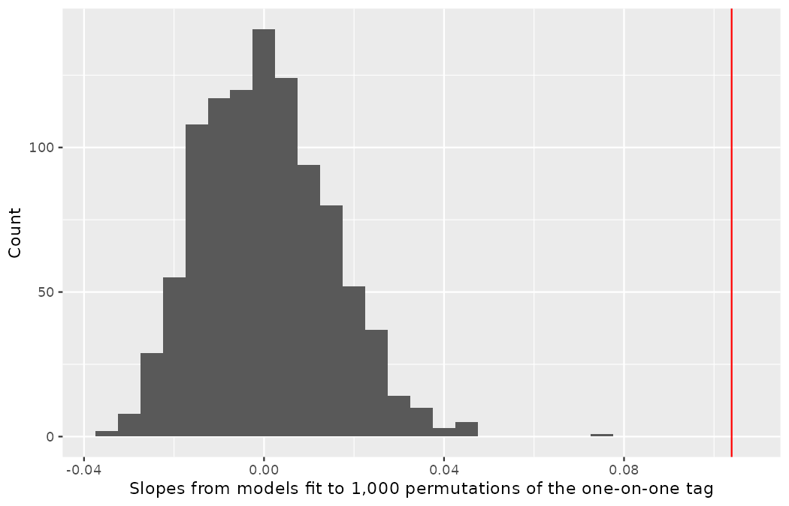
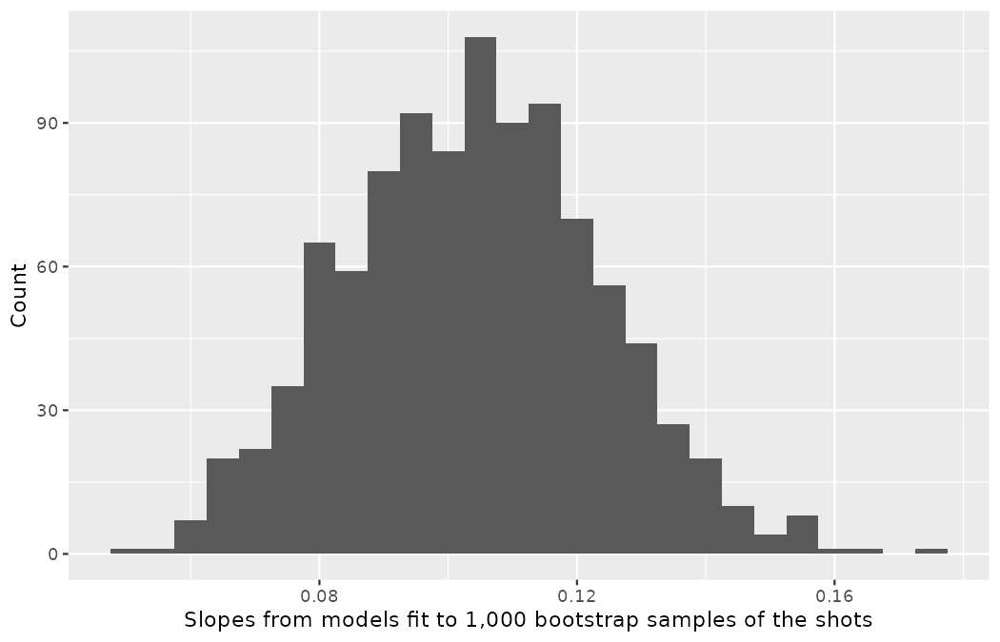
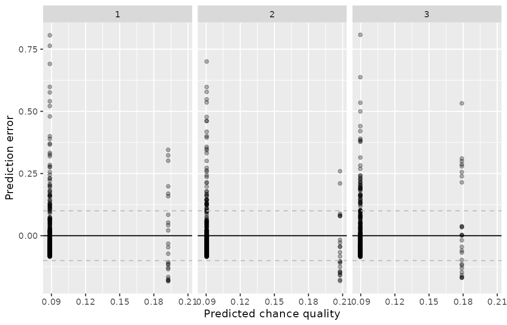
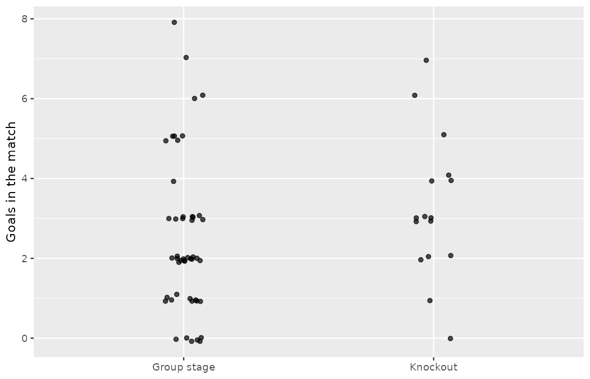

# Applications: Model and infer {#sec-inf-model-applications}

This is the last applications chapter, and the last chapter of the book.
As with every applications chapter since @sec-data-applications, there are no new formulas, no new notation, and no new vocabulary here — only consolidation: one case study worked end to end with the inferential modeling tools of @sec-inf-model-slr, @sec-inf-model-mlr, and @sec-inf-model-logistic, a short walkthrough to run at your own keyboard, and a closing lab that sends the whole toolkit abroad.
The case study takes up a debt this book has carried since @sec-model-slr: the club has been quoting a price for the one-on-one ever since we first fit an indicator variable, and the number has never been put on trial.
It is time to audit it properly — with a stated frame, a permutation test, a bootstrap interval, and a cross-validated prediction check.

## Case study: pricing the one-on-one {#sec-case-study-mario-cart}

In this case study, we consider the chance quality of shots at the 2022 Men's World Cup.
The outcome variable of interest is `statsbomb_xg`, the vendor's estimate of each shot's scoring probability, and the question is one Marta Vidal has asked in some form since @sec-model-slr: *what is a one-on-one worth?*
We will try to determine how chance quality is related to the one-on-one tag while simultaneously controlling for other variables.
For instance, all other circumstances held constant, are first-time strikes priced higher or lower?
And, on average, how much more chance quality does a shot carry when the striker faces only the goalkeeper?
Multiple regression — now equipped with the inference of @sec-inf-model-slr and @sec-inf-model-mlr — will help us answer these and other questions.

::: {.callout-note title="Data"}
The shots come from `data/derived/wc2022_shots.csv` (StatsBomb open data).
The chapter's working dataset, `shots27`, is built below on the identical open-play frame as @sec-model-mlr, @sec-inf-model-mlr, and @sec-inf-model-logistic — `shot_type == "Open Play"`, dropping the handful of shots whose body part or possession pattern is logged only as `Other` — so that every count and coefficient lines up with those chapters' 1,365 shots.
The one difference is bookkeeping: this chapter keeps the `first_time` column, which those chapters' object set aside, and recodes it as a 0/1 indicator like the other tags.
:::

```r
library(dplyr)
library(tidyr)
library(readr)
library(ggplot2)
library(infer)
library(broom)

wc2022_shots <- read_csv("data/derived/wc2022_shots.csv")
```

The number on trial first.
In @sec-categorical-predictor-two-levels we fit the book's first indicator-variable model to all 1,494 shots of the tournament, and its two coefficients have followed the club around ever since:

```r
lm(statsbomb_xg ~ one_on_one, data = wc2022_shots) |>
  tidy()
#> # A tibble: 2 × 5
#>   term           estimate std.error statistic   p.value
#>   <chr>             <dbl>     <dbl>     <dbl>     <dbl>
#> 1 (Intercept)       0.119   0.00485     24.5  1.62e-111
#> 2 one_on_oneTRUE    0.127   0.0203       6.25 5.49e- 10
```

An ordinary shot is priced at $0.119$; a one-on-one at $0.119 + 0.127 = 0.246$ — roughly a one-in-four chance against a one-in-eight baseline.
But before that slope of $0.127$ goes anywhere near a recruitment memo, this book's penalty convention demands one question be answered out loud: *which shots are in the frame?*
A count of shot types against the indicator — the evidence first assembled in @sec-ind-and-cat-predictors — shows that penalties sit on both sides of the tag:

```r
wc2022_shots |>
  count(shot_type, one_on_one)
#> # A tibble: 6 × 3
#>   shot_type one_on_one     n
#>   <chr>     <lgl>      <int>
#> 1 Corner    TRUE           2
#> 2 Free Kick FALSE         46
#> 3 Open Play FALSE       1305
#> 4 Open Play TRUE          77
#> 5 Penalty   FALSE         58
#> 6 Penalty   TRUE           6

wc2022_shots |>
  filter(shot_type == "Penalty") |>
  summarize(kicks = n(), mean_xg = mean(statsbomb_xg))
#> # A tibble: 1 × 2
#>   kicks mean_xg
#>   <int>   <dbl>
#> 1    64   0.784
```

Every penalty is stamped at a chance quality of $0.784$ — several times the mean of either group — and the 6 penalties carrying the one-on-one tag make up $6/85 \approx 7\%$ of the small one-on-one group, while the other 58 make up only $58/1409 \approx 4\%$ of the large ordinary-shot group.
The penalty spike therefore inflates the one-on-one side of the comparison more than the baseline, and @sec-ind-and-cat-predictors showed exactly what that costs: on the open-play frame the premium falls from $0.127$ to $0.104$ $(0.1269$ to $0.1039$ at four decimals$).$
The one-on-one Marta wants priced is the breakaway, not the spot kick, so the open-play frame carries this chapter — with the all-shots fit above on the record, as the convention requires, and one more appearance to make before the case study ends.

```r
shots27 <- wc2022_shots |>
  filter(
    shot_type == "Open Play",
    body_part != "Other",
    play_pattern != "Other"
  ) |>
  mutate(
    play_pattern = relevel(factor(play_pattern), ref = "Regular Play"),
    one_on_one = if_else(one_on_one, 1, 0),
    under_pressure = if_else(under_pressure, 1, 0),
    first_time = if_else(first_time, 1, 0)
  ) |>
  select(statsbomb_xg, one_on_one, under_pressure, first_time, play_pattern)

nrow(shots27)
#> [1] 1365

shots27 |>
  slice_head(n = 4)
#> # A tibble: 4 × 5
#>   statsbomb_xg one_on_one under_pressure first_time play_pattern
#>          <dbl>      <dbl>          <dbl>      <dbl> <fct>
#> 1       0.0389          0              1          1 Regular Play
#> 2       0.0245          0              0          1 From Throw In
#> 3       0.0616          0              0          0 From Corner
#> 4       0.279           0              0          1 From Counter
```

Notice that `one_on_one`, `under_pressure`, and `first_time` are all indicator variables in the sense of @sec-categorical-predictor-two-levels, and `play_pattern` is the eight-level categorical variable whose reference level, `Regular Play`, was installed back in @sec-model-mlr.
The variables are described in @tbl-1v1-var-def.

| Variable | Description |
|:---|:------------------------------------------|
| `statsbomb_xg` | The vendor's chance-quality estimate for the shot. The response variable. |
| `one_on_one` | Indicator variable for whether the striker faced only the goalkeeper: 1 for *yes*, 0 for *no*. |
| `under_pressure` | Indicator variable for whether the shot was taken under defensive pressure. |
| `first_time` | Indicator variable for whether the shot was struck first time, without a controlling touch. |
| `play_pattern` | The possession pattern the shot arose from: `Regular Play` (reference) plus seven further levels, `From Corner` through `From Throw In`. |

: Variables and their descriptions for the `shots27` dataset, the open-play frame of the 2022 Men's World Cup shot data. {#tbl-1v1-var-def}

### Mathematical approach to linear models

We first refit the one-predictor model on the chapter's frame — the mathematical linear regression of @sec-mathslope, with the game's biggest tag as the predictor:

$$E[\texttt{statsbomb\_xg}] = \beta_0 + \beta_1\times \texttt{one\_on\_one}$$

Results of the model are summarized in @tbl-1v1-slr:

```r
m_1v1 <- lm(statsbomb_xg ~ one_on_one, data = shots27)
tidy(m_1v1)
#> # A tibble: 2 × 5
#>   term        estimate std.error statistic   p.value
#>   <chr>          <dbl>     <dbl>     <dbl>     <dbl>
#> 1 (Intercept)   0.0896   0.00327     27.4  5.03e-132
#> 2 one_on_one    0.104    0.0141       7.35 3.36e- 13
```

| term        | estimate | std.error | statistic | p.value |
|:------------|---------:|----------:|----------:|--------:|
| (Intercept) |   0.0896 |    0.0033 |     27.40 | <0.0001 |
| one_on_one  |   0.1039 |    0.0141 |      7.35 | <0.0001 |

: Summary of a linear model for predicting open-play chance quality based on `one_on_one`. The observed slope — the sample 1v1 premium — is 0.1039. {#tbl-1v1-slr}

::: {.callout-tip title="Check your understanding"}
Write down the equation for the model, note whether the slope is statistically discernible from zero, and interpret the coefficient.

------------------------------------------------------------------------

The equation for the line may be written as $\widehat{\texttt{statsbomb\_xg}} = 0.0896 + 0.1039 \times \texttt{one\_on\_one}.$
Examining the regression output in @tbl-1v1-slr, the p-value for `one_on_one` is very close to zero $(3.4 \times 10^{-13}),$ indicating strong evidence that the coefficient is different from zero when using this one-variable model — statistically discernible at any level in use.
The variable `one_on_one` takes value 1 when the striker faced only the goalkeeper and 0 otherwise, so the model prices a one-on-one at $0.1039$ more chance quality than an ordinary open-play shot: $0.0896 + 0.1039 = 0.1935,$ roughly a one-in-five chance against a one-in-eleven baseline.
:::

Sometimes there are underlying structures or relationships between predictor variables — the multicollinearity of @sec-inf-mult-reg-collin.
The tags in this dataset are entangled in ways any touchline observer would predict, and two of the entanglements matter here:

```r
shots27 |>
  group_by(one_on_one) |>
  summarize(
    shots = n(),
    prop_first_time = mean(first_time),
    prop_counter = mean(play_pattern == "From Counter"),
    prop_goal_kick = mean(play_pattern == "From Goal Kick")
  )
#> # A tibble: 2 × 5
#>   one_on_one shots prop_first_time prop_counter prop_goal_kick
#>        <dbl> <int>           <dbl>        <dbl>          <dbl>
#> 1          0  1292           0.359       0.0372         0.0534
#> 2          1    73           0           0.0959         0.137
```

First, one-on-ones arise disproportionately from counter-attacks $(9.6\%$ versus $3.7\%)$ and long goal-kick possessions $(13.7\%$ versus $5.3\%)$ — situations that raise the price of *any* shot taken from them.
Second, and more striking: not one of the frame's 73 one-on-ones was struck first time, while $35.9\%$ of ordinary shots were — 73 rather than the 77 in the raw open-play count earlier, because `shots27` also drops the four 1v1s finished with an `Other`-coded body part, exactly as @sec-model-mlr's 1,365-shot frame did.
A striker clean through has, almost by definition, brought the ball under control — and first-time strikes carry their own premium:

```r
shots27 |>
  group_by(first_time) |>
  summarize(shots = n(), mean_xg = mean(statsbomb_xg))
#> # A tibble: 2 × 3
#>   first_time shots mean_xg
#>        <dbl> <int>   <dbl>
#> 1          0   901  0.0753
#> 2          1   464  0.134
```

We would like a model that accounts for the one-on-one tag while simultaneously accounting for the other logged circumstances, so that the coefficient on `one_on_one` describes the tag's own contribution rather than the company it keeps:

$$
\begin{aligned}
E[\texttt{statsbomb\_xg}] = \beta_0 &+ \beta_1 \times \texttt{one\_on\_one} + \beta_2 \times \texttt{under\_pressure} + \beta_3 \times \texttt{first\_time} \\
&+ \beta_4 \times \texttt{play\_pattern}_{\texttt{From Corner}} + \cdots + \beta_{10} \times \texttt{play\_pattern}_{\texttt{From Throw In}}
\end{aligned}
$$

The seven level indicators for `play_pattern` work exactly as in @sec-model-mlr: one coefficient per non-reference level, each measured against a shot from regular play.
@tbl-1v1-full summarizes the full model.

```r
m_full <- lm(statsbomb_xg ~ one_on_one + under_pressure + first_time +
               play_pattern, data = shots27)
tidy(m_full)
#> # A tibble: 11 × 5
#>    term                       estimate std.error statistic  p.value
#>    <chr>                         <dbl>     <dbl>     <dbl>    <dbl>
#>  1 (Intercept)                 0.0621    0.00608    10.2   1.19e-23
#>  2 one_on_one                  0.127     0.0139      9.18  1.57e-19
#>  3 under_pressure              0.0136    0.00828     1.65  9.97e- 2
#>  4 first_time                  0.0706    0.00665    10.6   2.40e-25
#>  5 play_patternFrom Corner     0.0103    0.00946     1.09  2.75e- 1
#>  6 play_patternFrom Counter    0.0477    0.0161      2.96  3.16e- 3
#>  7 play_patternFrom Free Kick -0.0171    0.00907    -1.89  5.91e- 2
#>  8 play_patternFrom Goal Kick  0.0147    0.0138      1.07  2.87e- 1
#>  9 play_patternFrom Keeper     0.0107    0.0251      0.424 6.71e- 1
#> 10 play_patternFrom Kick Off  -0.00645   0.0278     -0.232 8.17e- 1
#> 11 play_patternFrom Throw In  -0.00774   0.00843    -0.918 3.59e- 1
```

| term | estimate | std.error | statistic | p.value |
|:---------------------------|---------:|----------:|----------:|--------:|
| (Intercept)                |   0.0621 |    0.0061 |     10.22 | <0.0001 |
| one_on_one                 |   0.1273 |    0.0139 |      9.18 | <0.0001 |
| under_pressure             |   0.0136 |    0.0083 |      1.65 |  0.0997 |
| first_time                 |   0.0706 |    0.0067 |     10.62 | <0.0001 |
| play_patternFrom Corner    |   0.0103 |    0.0095 |      1.09 |  0.2746 |
| play_patternFrom Counter   |   0.0477 |    0.0161 |      2.96 |  0.0032 |
| play_patternFrom Free Kick |  -0.0171 |    0.0091 |     -1.89 |  0.0591 |
| play_patternFrom Goal Kick |   0.0147 |    0.0138 |      1.07 |  0.2866 |
| play_patternFrom Keeper    |   0.0107 |    0.0251 |      0.42 |  0.6713 |
| play_patternFrom Kick Off  |  -0.0064 |    0.0278 |     -0.23 |  0.8167 |
| play_patternFrom Throw In  |  -0.0077 |    0.0084 |     -0.92 |  0.3589 |

: Summary of a linear model for predicting open-play chance quality based on `one_on_one`, `under_pressure`, `first_time`, and `play_pattern`. {#tbl-1v1-full}

Each p-value in @tbl-1v1-full assesses the conditional hypothesis of @sec-inf-mult-reg-soft — $H_0: \beta_i = 0$ *given the other variables in the model* — and the verdicts span the familiar range: `one_on_one` and `first_time` are overwhelmingly discernible, `From Counter` earns its keep, and `under_pressure` $(p = 0.0997)$ once again fails to clear the bar, the same verdict that tag has now collected in @sec-model-application, @sec-inf-mult-reg-soft, and @sec-inf-model-logistic.
One numerical coincidence is worth disarming before it circulates: the $0.1273$ in @tbl-1v1-full sits next door to the $0.127$ of the all-shots single-predictor fit that opened this case study — and the proximity means nothing, being an accident of these particular data: different frame (open play against all 1,494 shots), different model (four predictors against one), different estimand (a conditional premium against a marginal one), and no arithmetic that connects the two, so a memo treating either number as confirming the other has been fooled by chance.

::: {.callout-tip title="Check your understanding"}
Write out the model's equation using the point estimates from @tbl-1v1-full.
How many predictors are there in the model?
How many coefficients are estimated?

------------------------------------------------------------------------

$$
\begin{aligned}
\widehat{\texttt{statsbomb\_xg}} = 0.0621 &+ 0.1273 \times \texttt{one\_on\_one} + 0.0136 \times \texttt{under\_pressure} \\
&+ 0.0706 \times \texttt{first\_time} + 0.0103 \times \texttt{play\_pattern}_{\texttt{From Corner}} \\
&+ 0.0477 \times \texttt{play\_pattern}_{\texttt{From Counter}} - 0.0171 \times \texttt{play\_pattern}_{\texttt{From Free Kick}} \\
&+ 0.0147 \times \texttt{play\_pattern}_{\texttt{From Goal Kick}} + 0.0107 \times \texttt{play\_pattern}_{\texttt{From Keeper}} \\
&- 0.0064 \times \texttt{play\_pattern}_{\texttt{From Kick Off}} - 0.0077 \times \texttt{play\_pattern}_{\texttt{From Throw In}}
\end{aligned}
$$

There are 4 predictor variables but 11 estimated coefficients: the intercept, one coefficient for each of the three indicator tags, and seven level indicators for the eight-level `play_pattern` — the level-indicator accounting of @sec-model-mlr.
:::

::: {.callout-tip title="Check your understanding"}
What does $\beta_1,$ the coefficient of the variable `one_on_one`, represent?
What is the point estimate of $\beta_1?$

------------------------------------------------------------------------

In the population of open-play shots at this level, $\beta_1$ is the average difference in chance quality between one-on-ones and ordinary shots *when holding pressure, timing, and possession pattern constant*.
The point estimate is $b_1 = 0.1273.$
:::

::: {.callout-tip title="Check your understanding"}
Compute the residual of the first shot in the `shots27` excerpt above, using the equation from @tbl-1v1-full.

------------------------------------------------------------------------

The first shot is a pressured, first-time strike from regular play — no one-on-one — so its predicted chance quality is $\hat{y}_1 = 0.0621 + 0.0136 + 0.0706 = 0.1463.$
The residual, in the notation carried since @sec-model-slr, is $e_1 = y_1 - \hat{y}_1 = 0.0389 - 0.1463 = -0.1074:$ the model expected a chance nearly four times as fat as the vendor's price for this particular shot.
:::

::: {.callout-note title="Worked example"}
In @tbl-1v1-slr, we estimated the coefficient for `one_on_one` as $b_1 = 0.1039$ with a standard error of $SE_{b_1} = 0.0141$ when using simple linear regression.
In @tbl-1v1-full the estimate is $0.1273.$
Why might there be a difference between the two estimates — and which way did our earlier frame decision move the same coefficient?

------------------------------------------------------------------------

If we examine the data carefully, we see multicollinearity among the predictors, and fitting the intermediate models makes the mechanics visible:

```r
round(c(
  alone        = unname(coef(lm(statsbomb_xg ~ one_on_one, data = shots27))[2]),
  with_pattern = unname(coef(lm(statsbomb_xg ~ one_on_one + play_pattern,
                                data = shots27))[2]),
  with_timing  = unname(coef(lm(statsbomb_xg ~ one_on_one + first_time,
                                data = shots27))[2]),
  all_four     = unname(coef(m_full)[2])
), 4)
#>        alone with_pattern  with_timing     all_four
#>       0.1039       0.1014       0.1286       0.1273
```

Two entanglements pull in opposite directions.
Controlling for `play_pattern` *shrinks* the premium slightly $(0.1039 \rightarrow 0.1014):$ part of what the single-variable model credited to the tag was really the counter-attacks and long goal kicks that one-on-ones ride in on — confounding in exactly the sense of @sec-inf-mult-reg-collin.
Controlling for `first_time` *raises* it $(0.1039 \rightarrow 0.1286):$ no open-play one-on-one is ever struck first time, so the single-variable model was comparing one-on-ones against a baseline flattered by 464 first-time strikes worth $+0.07$ apiece — the entanglement had been *masking* part of the premium, not inflating it.
Adjustment is direction-agnostic: it removes whatever bias the correlation structure created, and the sign of that bias is an empirical fact, not a promise.

And this is the multiple-regression version of a correction the case study already made once, *before* any model was fit.
The largest confounder of all was the penalty spot: penalties ride with the one-on-one tag disproportionately $(7\%$ versus $4\%)$ at a fixed price of $0.784,$ and moving to the open-play frame stripped that bias out of the slope $(0.127 \rightarrow 0.104).$
Choosing the frame and adding a control variable are two tools for the same job — one removes the confounded shots, the other models them — and this book has taught you to reach for the frame first when the confounder is a different game being played (a free shot from twelve yards), and for the model when it is the same game in different circumstances.
Nor is $0.1273$ "the" premium any more than $0.1039$ was: @sec-ind-and-cat-predictors's six-tag model, which can also see technique — the lobs that finish so many breakaways — put the coefficient at $0.0872.$
Each estimate answers its own conditional question, which is why the number Marta quotes must always travel with the model, and the frame, that produced it.
:::

::: {.callout-note title="One new word for an old idea (optional)"}
The applications chapters of this book define no new terms, and the review below will say so truthfully — so we break the no-new-terms rule by exactly one word, deliberately.
The quantity you decided to estimate — which shots are in the frame, which population they stand for, and whether the premium is averaged across everything in that frame or read off among shots held alike — is what the wider statistical literature calls the **estimand**.
The word has appeared exactly once before in this book, unglossed, in the coincidence memo above; it has earned its definition, because choosing it is what you have been doing all along.
The *marginal* premium — the $0.1039$ of the single-predictor open-play fit — is the one-on-one tag's average worth across all open-play shots, whatever pattern and tempo they arrive with.
The *conditional* premium — the $0.1273$ of the four-predictor model — is the tag's worth among shots alike in pattern and tempo: a different estimand answering a different question, not a better estimate of the same one.
This book's frame convention — which shots, stated out loud, before any model is fit — has been a 27-chapter course in choosing the estimand deliberately, and the causal-inference literature, where these choices carry names like the *average treatment effect* and the *effect on the treated*, builds on exactly this discipline; see @sec-appendix-further for where to read more.
:::

### Computational approach to linear models

Previously, using a mathematical model, we investigated the coefficients associated with `one_on_one` when predicting chance quality in a linear model.
The computational tools of @sec-randslope now let us ask the same question without leaning on the $t$-distribution: could a premium of $0.1039$ arise by chance if the tag meant nothing?

We permute the one-on-one labels across the 1,365 shots — severing any real connection between tag and chance quality, so that the null hypothesis $H_0: \beta_1 = 0$ is true by construction — and refit the line 1,000 times:

```r
obs_premium <- shots27 |>
  specify(statsbomb_xg ~ one_on_one) |>
  calculate(stat = "slope") |>
  pull()
round(obs_premium, 4)
#> one_on_one
#>     0.1039

set.seed(2701)
premium_null <- shots27 |>
  specify(statsbomb_xg ~ one_on_one) |>
  hypothesize(null = "independence") |>
  generate(reps = 1000, type = "permute") |>
  calculate(stat = "slope")

ggplot(premium_null, aes(x = stat)) +
  geom_histogram(binwidth = 0.005) +
  geom_vline(xintercept = obs_premium, color = "red") +
  labs(
    x = "Slopes from models fit to 1,000 permutations of the one-on-one tag",
    y = "Count"
  )

premium_null |>
  summarize(
    min_slope = min(stat),
    max_slope = max(stat),
    n_extreme = sum(abs(stat) >= obs_premium)
  )
#> # A tibble: 1 × 3
#>   min_slope max_slope n_extreme
#>       <dbl>     <dbl>     <int>
#> 1   -0.0329    0.0747         0
```

{fig-alt="Histogram of slopes from models fit to 1,000 permutations of the one-on-one tag, piled up around zero and running from about -0.033 to +0.075, with a red vertical line marking the observed slope of 0.1039 entirely outside the null distribution." width=85%}

The histogram of permuted slopes piles up around zero, running from about $-0.033$ to $+0.075,$ and the red line marking the observed slope of $0.1039$ sits entirely outside it.

::: {.callout-note title="Worked example"}
The red line (the observed slope) is far from the bulk of the histogram.
Explain why the randomly permuted datasets produce slopes that are quite different from the observed slope.

------------------------------------------------------------------------

The null hypothesis is that, in the population of open-play shots at this level, there is no linear relationship between chance quality and the one-on-one tag.
When the data are permuted, chance-quality values are randomly reassigned to tagged and untagged shots, so the null hypothesis is forced to be true: any slope that survives the shuffle is pure chance variation.
In the actual data, one-on-ones really do carry more chance quality — strikers clean through face an unguarded expanse the vendor's model prices accordingly — so the slope describing the observed relationship is not one that a shuffled dataset is likely to produce.
Shuffle to destroy, resample to preserve, as @sec-bootbeta1 put it — this is the destroying half.
:::

::: {.callout-tip title="Check your understanding"}
Using the permutation results, find the p-value and conclude the hypothesis test in the context of the problem.

------------------------------------------------------------------------

None of the 1,000 permuted slopes reached $\pm 0.1039,$ and — recall the discipline of @sec-randslope — that makes the honest report $p < 1/1000,$ not $p = 0:$ a permuted slope that size is not impossible, merely so rare that 1,000 shuffles never produced one.
At any discernibility level in use, we reject $H_0$ and conclude that the one-on-one tag and chance quality are genuinely, linearly related in open play.
One caution travels with the conclusion, as it has since @sec-foundations-randomization: nobody randomly assigns one-on-ones — they emerge from the run of play — so this is association, not causation.
:::

::: {.callout-tip title="Check your understanding"}
Is the conclusion based on the histogram of permuted slopes consistent with the conclusion obtained using the mathematical model?
Explain.

------------------------------------------------------------------------

The p-value in @tbl-1v1-slr is $3.4 \times 10^{-13}$ — also essentially zero — so the null hypothesis is rejected under the mathematical approach as well.
Often, the mathematical and computational approaches to inference give quite similar answers; when they do not, @sec-tech-cond-linmod told you where to look, and the bootstrap below will hand you a live example.
:::

Knowing the relationship exists, a scout's interest shifts to the size of the premium — the business question is *how much*, not *whether*.
In the notation of the chapters just past: $\beta_1$ is the population 1v1 premium, the average difference in chance quality between one-on-ones and ordinary open-play shots at this level, and a confidence interval for it is a bootstrap job.
Following @sec-bootbeta1, we resample the 1,365 shots with replacement — whole rows, each keeping its tag and its price together — and refit the line 1,000 times:

```r
set.seed(2702)
premium_boot <- shots27 |>
  specify(statsbomb_xg ~ one_on_one) |>
  generate(reps = 1000, type = "bootstrap") |>
  calculate(stat = "slope")

ggplot(premium_boot, aes(x = stat)) +
  geom_histogram(binwidth = 0.005) +
  labs(
    x = "Slopes from models fit to 1,000 bootstrap samples of the shots",
    y = "Count"
  )

premium_boot |>
  summarize(mean_slope = mean(stat), sd_slope = sd(stat))
#> # A tibble: 1 × 2
#>   mean_slope sd_slope
#>        <dbl>    <dbl>
#> 1      0.104   0.0195
```

{fig-alt="Histogram of slopes from models fit to 1,000 bootstrap samples of the shots: bell-shaped, symmetric, and centered at the observed one-on-one premium of 0.104." width=85%}

The histogram of bootstrapped slopes is bell-shaped, symmetric, and centered at the observed value of $0.104$ — a bootstrap distribution inherits the center of the sample, as @sec-foundations-bootstrapping taught.

::: {.callout-note title="Worked example"}
Using the histogram, estimate the standard error of the slope.
Is your estimate similar to the value of the standard error of the slope in @tbl-1v1-slr?

------------------------------------------------------------------------

Most of the bootstrapped slopes fall between about $0.065$ and $0.145,$ a spread of roughly $0.08.$
Using the empirical rule from @sec-explore-numerical — with bell-shaped distributions, most observations sit within two standard errors of the center — a rough approximation of the standard error is $0.02.$
The direct computation agrees:

```r
round(sd(premium_boot$stat), 4)
#> [1] 0.0195
```

But the standard error in @tbl-1v1-slr is $0.0141$ — noticeably *smaller* than the bootstrap's $0.0195,$ a wider gap than the friendly agreement you saw in @sec-bootbeta1.
The gap is diagnostic, not a malfunction.
The regression formula behind @tbl-1v1-slr assumes equal variability around the line — the E of the LINE conditions (@sec-tech-cond-linmod) — and this dataset violates it:

```r
shots27 |>
  group_by(one_on_one) |>
  summarize(shots = n(), mean_xg = mean(statsbomb_xg), sd_xg = sd(statsbomb_xg))
#> # A tibble: 2 × 4
#>   one_on_one shots mean_xg sd_xg
#>        <dbl> <int>   <dbl> <dbl>
#> 1          0  1292  0.0896 0.114
#> 2          1    73  0.193  0.166
```

The 73 one-on-ones are both few and far more variable $(s = 0.166$ versus $0.114),$ so pooling the variability understates how much the premium wobbles.
Indeed, a slope on a 0/1 indicator is just a difference in group means (@sec-categorical-predictor-two-levels), and the unpooled standard error of @sec-inference-two-means reproduces the bootstrap almost exactly:
$$\sqrt{\frac{0.166^2}{73} + \frac{0.114^2}{1292}} = 0.0197$$
When the formula and the bootstrap disagree, trust the one whose assumptions you can defend — here, the bootstrap, which @sec-tech-cond-linmod told you is robust to exactly this violation.
:::

::: {.callout-tip title="Check your understanding"}
Use the bootstrap results to create a 90% standard error bootstrap confidence interval for the true 1v1 premium.
Interpret the interval in context.

------------------------------------------------------------------------

For 90% confidence the normal cutoff is $z^{\star} = 1.645$ (recall the cutoff catalog of @sec-inference-one-prop, and recall from @sec-boot1mean that bootstrap SE intervals in this book keep the normal cutoffs), which gives
$$b_1 \pm 1.645 \cdot SE_{BS} \rightarrow 0.1039 \pm 1.645 \cdot 0.0195 \rightarrow (0.0718, 0.1360).$$
For open-play shots at this level, we are 90% confident that one-on-ones carry, on average, between $0.072$ and $0.136$ more chance quality than ordinary shots — between roughly seven and fourteen extra goals per hundred shots.
:::

::: {.callout-tip title="Check your understanding"}
Create a 90% bootstrap percentile confidence interval for the true 1v1 premium and interpret it in context.

------------------------------------------------------------------------

With 1,000 bootstrap resamples, we look for the cutoffs leaving 50 bootstrapped slopes below, 900 in the middle, and 50 above:

```r
round(quantile(premium_boot$stat, c(0.05, 0.95)), 4)
#>     5%    95%
#> 0.0724 0.1367
```

The 90% percentile interval is $(0.0724, 0.1367)$ — almost identical to the SE interval, as expected from a bell-shaped bootstrap distribution.
Same interpretation, same units: with 90% confidence, the 1v1 premium at this level lies between about $0.07$ and $0.14$ expected goals per shot.
Zero is nowhere in sight, in agreement with both tests above.
:::

### Cross-validation

In @sec-model-mlr, models were compared using $R^2_{adj}.$
In @sec-inf-mult-reg-cv, however, a computational approach was introduced: remove chunks of data one at a time, fit the model to the rest, and grade it on the held-out shots — predictions written as $\hat{y}_{cv,i}$ and summarized by the CV SSE, notation you own from that chapter.
We close the case study by asking the prediction question of the two models above: does the four-predictor model of @tbl-1v1-full actually predict chance quality better than the bare one-on-one tag of @tbl-1v1-slr?

Here we apply 3-fold cross-validation — $k = 3$ in the folds sense of @sec-inf-mult-reg-cv, not the predictors or groups sense — so one third of the data is removed while two thirds of the observations are used to build each model.
The fold assignment is random, so we seed it:

```r
set.seed(2703)
shots27_cv <- shots27 |>
  mutate(fold = sample(rep(1:3, length.out = n())))

shots27_cv |> count(fold)
#> # A tibble: 3 × 2
#>    fold     n
#>   <int> <int>
#> 1     1   455
#> 2     2   455
#> 3     3   455

pred_small <- rep(NA_real_, 1365)
for (f in 1:3) {
  held_out <- shots27_cv$fold == f
  fit <- lm(statsbomb_xg ~ one_on_one, data = shots27_cv[!held_out, ])
  pred_small[held_out] <- predict(fit, newdata = shots27_cv[held_out, ])
}

sum((pred_small - shots27_cv$statsbomb_xg)^2)
#> [1] 18.86891
```

Note that each time one third of the data is removed, the resulting model produces slightly different coefficients.
With one binary predictor, each fold's model prices every shot at one of exactly two values, and the pair drifts from fold to fold — the coefficient-wobble you watched decide everything at a classification cutoff in @sec-inf-log-reg-cv, here on display with no cutoff to trip over:

```r
shots27_cv |>
  mutate(pred = round(pred_small, 4)) |>
  distinct(fold, one_on_one, pred) |>
  pivot_wider(names_from = one_on_one, values_from = pred,
              names_prefix = "pred_1v1_") |>
  arrange(fold)
#> # A tibble: 3 × 3
#>    fold pred_1v1_0 pred_1v1_1
#>   <int>      <dbl>      <dbl>
#> 1     1     0.0886      0.193
#> 2     2     0.0905      0.208
#> 3     3     0.0896      0.179
```

The same seeded folds now grade the larger model, so the two models face identical holdout samples:

```r
pred_large <- rep(NA_real_, 1365)
for (f in 1:3) {
  held_out <- shots27_cv$fold == f
  fit <- lm(statsbomb_xg ~ one_on_one + under_pressure + first_time +
              play_pattern, data = shots27_cv[!held_out, ])
  pred_large[held_out] <- predict(fit, newdata = shots27_cv[held_out, ])
}

sum((pred_large - shots27_cv$statsbomb_xg)^2)
#> [1] 17.52404
```

The residual plots tell the visual story — build one for each model, as in @sec-inf-mult-reg-cv, with the prediction on the x-axis and the prediction error on the y-axis:

```r
cv_results <- shots27_cv |>
  mutate(
    predicted_small = pred_small,
    error_small = statsbomb_xg - predicted_small,
    predicted_large = pred_large,
    error_large = statsbomb_xg - predicted_large
  )

ggplot(cv_results, aes(x = predicted_small, y = error_small)) +
  geom_point(alpha = 0.3) +
  geom_hline(yintercept = 0) +
  geom_hline(yintercept = 0.1, lty = 2, color = "grey") +
  geom_hline(yintercept = -0.1, lty = 2, color = "grey") +
  facet_wrap(~fold) +
  labs(x = "Predicted chance quality", y = "Prediction error")

# ... and the same plot with predicted_large / error_large.

cv_results |>
  pivot_longer(c(error_small, error_large),
               names_to = "model", values_to = "error") |>
  group_by(model) |>
  summarize(
    min_error = min(error),
    max_error = max(error),
    within_0.1 = mean(abs(error) <= 0.1)
  )
#> # A tibble: 2 × 4
#>   model       min_error max_error within_0.1
#>   <chr>           <dbl>     <dbl>      <dbl>
#> 1 error_large    -0.231     0.763      0.793
#> 2 error_small    -0.183     0.808      0.856
```

{fig-alt="Cross-validated prediction errors for the one-predictor model in three panels, one per fold: two vertical strips of predictions with errors centered at zero and a heavy upward straggle from the point-blank chances no stand-side tag can see." width=85%}

The smaller model's plot is two vertical strips — the two prices in the table above — while the larger model's predictions spread from about $0.04$ to $0.25.$
In both, the errors are centered at zero with a heavy upward straggle: the point-blank chances no stand-side tag can see.

::: {.callout-tip title="Check your understanding"}
The single worst under-prediction from the cross-validated larger model is isolated below:

```r
cv_results |>
  slice_max(error_large, n = 1) |>
  select(fold, statsbomb_xg, predicted_large, error_large,
         first_time, play_pattern)
#> # A tibble: 1 × 6
#>    fold statsbomb_xg predicted_large error_large first_time play_pattern
#>   <int>        <dbl>           <dbl>       <dbl>      <dbl> <fct>
#> 1     3        0.897           0.134       0.763          1 Regular Play
```

(a) State the observed and predicted values for this shot, and write its prediction error in the notation of @sec-inf-mult-reg-cv.
(b) Which cross-validation fold(s) were used to build the model that made this prediction?

------------------------------------------------------------------------

(a) The observed value is $y_i = 0.897$ — close to a certain goal by the vendor's reckoning — while the cross-validated prediction is $\hat{y}_{cv,i} = 0.134,$ giving $e_i = y_i - \hat{y}_{cv,i} = 0.763.$
A first-time shot from regular play with no other tags is priced like a routine half-chance; the tags cannot know this one was struck from a yard out.
(b) The shot sits in fold 3, so the model that priced it was built on folds 1 and 2 — the prediction used none of fold 3's shots, which is the entire point of the construction.
:::

::: {.callout-tip title="Check your understanding"}
(a) By noting the spread of the cross-validated prediction errors, can you decide which model should be chosen for a final report on these data?
(b) Using the summary statistic cross-validation sum of squared errors (CV SSE), which model should be chosen, and how big is the win?

------------------------------------------------------------------------

(a) Honestly: barely.
The larger model has the smaller worst-case straggle ($+0.763$ versus $+0.808$) but *fewer* errors inside the $\pm 0.1$ band ($79.3\%$ versus $85.6\%$) — the smaller model predicts about $0.09$ for nearly everything, and since most open-play chance qualities are small, small errors are cheap for it.
The eye cannot settle this comparison, which is precisely why a single-number criterion exists.
(b) The CV SSE decides: $17.52$ for the four-predictor model against $18.87$ for the one-predictor model — the larger model's independent predictions are better by about $7\%.$
Read that magnitude the way @sec-inf-mult-reg-cv trained you to.
It is a real improvement, several times the gain that chapter's five-tag model managed, because `first_time` turns out to be the single most informative tag on the sheet — and it is still nowhere near the transformation more coefficients naively promise, because most of what prices a chance is where it was struck from, and no arrangement of stand-side tags can substitute for coordinates.
The overfitting signature is present and correct, too: the larger model's in-sample SSE flatters it by $0.41$ against its cross-validated $17.52,$ while the smaller model's gap is only $0.05:$

```r
round(c(
  in_sample_small = sum(resid(m_1v1)^2),
  in_sample_large = sum(resid(m_full)^2)
), 2)
#> in_sample_small in_sample_large
#>           18.81           17.11
```

Choose the larger model for prediction at this tournament — and before quoting it anywhere else, remember what @sec-inf-mult-reg-cv and @sec-chp26-external proved: a model that wins at home can lose abroad.
The lab at the end of this chapter sends you to check.
:::

## Interactive walkthrough: sixty-four matches, one indicator {#sec-inf-model-tutorials}

Reading a consolidated case study is not the same as running one, so here is a short exercise to work at your own keyboard before the lab asks for a full report.
It also changes altitude deliberately: after 1,365 shots, Marta Vidal's final commission of the season arrives at the *match* level, where the club's samples are small and the intervals honest about it.
The question, prompted by a board discussion of tournament modeling: do knockout matches produce different goal totals than group-stage matches?

::: {.callout-note title="Data"}
The matches come from `data/derived/wc2022_matches.csv` (StatsBomb open data): 64 rows, one per match.
Frame notes, stated per the book's convention: the recorded scores cover regulation and extra time but not shoot-out kicks; they include own goals, which no shot file ever sees; and several knockout matches ran 120 minutes, so "goals per match" quietly mixes exposure — a caveat that belongs in any memo built on this variable.
:::

The explanatory variable is an indicator — the same device as `one_on_one`, from @sec-categorical-predictor-two-levels — equal to 1 for the 16 knockout matches and 0 for the 48 group-stage matches:

```r
wc2022_matches <- read_csv("data/derived/wc2022_matches.csv")

ko_matches <- wc2022_matches |>
  mutate(
    total_goals = home_score + away_score,
    knockout = if_else(stage == "Group Stage", 0, 1)
  )

ko_matches |>
  group_by(knockout) |>
  summarize(matches = n(), mean_goals = mean(total_goals),
            sd_goals = sd(total_goals))
#> # A tibble: 2 × 4
#>   knockout matches mean_goals sd_goals
#>      <dbl>   <int>      <dbl>    <dbl>
#> 1        0      48       2.5      1.91
#> 2        1      16       3.25     1.77

ggplot(ko_matches,
       aes(x = factor(knockout, labels = c("Group stage", "Knockout")),
           y = total_goals)) +
  geom_jitter(width = 0.08, height = 0.1, alpha = 0.7) +
  labs(x = NULL, y = "Goals in the match")

fit_ko <- lm(total_goals ~ knockout, data = ko_matches)
tidy(fit_ko)
#> # A tibble: 2 × 5
#>   term        estimate std.error statistic  p.value
#>   <chr>          <dbl>     <dbl>     <dbl>    <dbl>
#> 1 (Intercept)    2.5       0.271      9.22 3.18e-13
#> 2 knockout       0.750     0.543      1.38 1.72e- 1
```

{fig-alt="Jittered plot of goals per match for the group-stage and knockout matches: knockout matches average three quarters of a goal more, but the two clouds of match totals overlap heavily." width=85%}

Knockout matches averaged three quarters of a goal more $(3.25$ versus $2.50),$ but the $t$-based p-value of $0.172$ already warns that 16 matches cannot pin down a difference of this size.
The bootstrap says the same thing in interval form:

```r
set.seed(2704)
ko_boot <- ko_matches |>
  specify(total_goals ~ knockout) |>
  generate(reps = 1000, type = "bootstrap") |>
  calculate(stat = "slope")

ko_boot |>
  summarize(mean_slope = mean(stat), sd_slope = sd(stat))
#> # A tibble: 1 × 2
#>   mean_slope sd_slope
#>        <dbl>    <dbl>
#> 1      0.746    0.525

round(quantile(ko_boot$stat, c(0.05, 0.95)), 3)
#>     5%    95%
#> -0.104  1.622
```

The 90% percentile interval runs from $-0.104$ to $+1.622$ goals per match; the SE version, $0.75 \pm 1.645 \times 0.525 \rightarrow (-0.114, 1.614),$ agrees.
Both straddle zero: on this evidence, knockout football at the 2022 World Cup is compatible with anything from a tenth of a goal *fewer* per match to a goal and a half more.

Now put this interval next to the case study's.
The 1v1 premium's 90% interval, $(0.0724, 0.1367),$ has a width of about $62\%$ of its point estimate — a number Marta can plan around.
The knockout interval's width is about $2.3$ *times* its point estimate — $\left(1.622 - (-0.104)\right)/0.75 \approx 2.3$ — a plausible range so wide it contains the boring answer and both interesting ones.
Nothing about the machinery changed between the two analyses; what changed is $n.$
Standard errors shrink with the square root of the sample size (@sec-foundations-mathematical), and 64 matches — only 16 of them knockouts — buy far less precision than 1,365 shots.
Match-level questions are the ones club boards most love to ask, and they are precisely the questions a single tournament answers worst.

::: {.callout-tip title="Check your understanding"}
(a) A colleague summarizes the analysis as: "knockout football is worth three quarters of a goal more per match — tell the video team to expect it."
What should the report actually say?
(b) In one sentence: why is this interval so much wider, relative to its estimate, than the 1v1 premium's?

------------------------------------------------------------------------

(a) The difference is not statistically discernible $(p = 0.172,$ and both 90% intervals include zero$),$ so the honest sentence is the interval itself: somewhere between $-0.1$ and $+1.6$ goals per match, on 16 knockout matches, with the extra-time exposure caveat attached.
Per @sec-foundations-decision-errors, a failure to reject is not a demonstration that stages are identical — if a real difference exists, this is exactly the Type II territory where a small sample passes on a gem — but a memo that "banks" $0.75$ is quoting the noise, not the signal.
(b) Because the standard error is driven by sample size and group balance: 16 knockout matches against 48 group matches, with goal counts whose standard deviation rivals their mean, cannot compete with 1,365 shots — the machinery is identical, the data are simply fewer.
:::

## Lab: the premium, abroad {#sec-inf-model-labs}

To close the book, run the case study's entire arc — unguided this time — on the second tournament.
An agent, quoting the club's own methods back at it, claims the 2025 Women's Euro shows one-on-ones are worth *far more* than Northbridge's World Cup number: "a 0.23 premium — nearly double yours."
Her fit, reproduced from the raw file:

```r
weuro2025_shots <- read_csv("data/derived/weuro2025_shots.csv")

lm(statsbomb_xg ~ one_on_one, data = weuro2025_shots) |>
  tidy()
#> # A tibble: 2 × 5
#>   term           estimate std.error statistic  p.value
#>   <chr>             <dbl>     <dbl>     <dbl>    <dbl>
#> 1 (Intercept)       0.128   0.00631     20.2  1.45e-75
#> 2 one_on_oneTRUE    0.228   0.0354       6.44 1.87e-10

weuro2025_shots |>
  group_by(one_on_one) |>
  summarize(shots = n(), mean_xg = mean(statsbomb_xg))
#> # A tibble: 2 × 3
#>   one_on_one shots mean_xg
#>   <lgl>      <int>   <dbl>
#> 1 FALSE        884   0.128
#> 2 TRUE          29   0.356
```

Work through the full audit and write up what you find as if reporting to Marta Vidal:

1.  State the parameter of interest and the hypotheses, in symbols and in words. Per @sec-two-sided-hypotheses, default to the two-sided alternative.
2.  Decide which shots belong in the frame, and defend the decision — *before* trusting the agent's slope. Recall where this dataset files its penalty kicks, and recall the memo trap of @sec-inference-one-mean: at this tournament, the penalty share of the one-on-one group is far worse than the World Cup's. Rerun the fit under `shot_type == "Open Play"` and report how much of the agent's headline survives.
3.  Run the permutation test for the slope with 1,000 shuffles (seed of your choice, stated) in your chosen frame. Report the p-value with the resolution it actually has.
4.  Bootstrap the premium: 1,000 resamples, then both a 90% SE interval and a 90% percentile interval. With only about two dozen one-on-ones in the frame, expect the two constructions to be tested harder than they were at the World Cup — say which you trust and why.
5.  Close the report the way the case study did: compare your interval with the World Cup's $(0.0724, 0.1367)$ and answer the agent directly — same phenomenon, or genuinely richer one-on-ones? State whether your conclusion is causal or associational and why, name the error type you most risk, and put the frame sentence — which shots, which tournament, which model — above the number.

## Chapter review {#sec-chp27-review}

### Summary

This chapter introduced no new methods, no new notation, and no new vocabulary.
Its work was consolidation: one number the club has quoted since @sec-model-slr — the one-on-one premium — audited with every inferential modeling tool in the book.
The frame decision came first, because the all-shots frame — six penalty kicks at a fixed $0.784$ chief among its distortions — was worth two points of fake premium; the multiple regression then showed adjustment working in both directions, shrinking the coefficient toward the counters that carry one-on-ones and raising it for the first-time strikes that one-on-ones never are.
The permutation test put the observed slope outside a thousand shuffled worlds $(p < 1/1000);$ the bootstrap priced the premium at $(0.072, 0.137)$ with 90% confidence and, in disagreeing with the formula's standard error, diagnosed an unequal-variability violation the LINE checklist had warned about; cross-validation preferred the four-tag model by an honest $7\%;$ and sixty-four matches closed the chapter with the widest interval in it, because no amount of machinery buys precision that the sample size will not fund.
If any step felt unfamiliar, the place to look is not ahead but back: @sec-inf-model-slr for inference on a slope, @sec-inf-model-mlr for conditional hypotheses and cross-validation, @sec-inf-model-logistic for the binary-response version of all of it, and @sec-foundations-randomization through @sec-foundations-decision-errors for the logic underneath.

Return, finally, to Northbridge United, where this book has kept its office.
Emil Sørensen's scouts will go on filing reports that say a striker is electric, a market is overheating, a drill is working; Marta Vidal will go on making sign-or-pass calls she cannot take back.
What you now bring to that building is a discipline: every claim a scout makes can be given a number, every number an interval, and every interval a stated frame — which shots, which competition, which model, association or causation.
Sometimes the discipline will confirm what the touchline already believed, as it did for the one-on-one; sometimes it will dissolve a story on contact, as it did for fatigue drift and the pressure tag; sometimes it will hold a finding steady through every re-examination, as it has the nationality audit's, whose scheduled replication is the club's next calibration exercise; most often it will return the honest middle answer — an effect, this size, give or take that much, under these conditions.
Priya Rao's job, and now yours, is to make sure the club is never certain by accident.
That is the whole trade, and it is yours to practice.

### Terms

No new terms were introduced in this chapter.
The terms below did the audit's work; all were introduced and defined in earlier chapters — the modeling terms in @sec-model-slr and @sec-model-mlr, the inferential ones in @sec-inf-model-slr through @sec-inf-model-logistic, and the shared testing vocabulary in @sec-foundations-randomization — and you should be able to recognize each one at work in the case study, walkthrough, and lab above.
If any feel unfamiliar, go back and review their definitions in those chapters.

|  |  |  |
|:-----------------------|:-----------------------|:----------------------|
| bootstrap confidence interval for the slope | multicollinearity | randomization test for the slope |
| cross-validation | multiple predictors | t-distribution for the slope |
| indicator variable | p-value | technical conditions |
| inference on multiple linear regression | prediction error | variability of the slope |

: Terms revisited in this chapter. {#tbl-terms-chp-27}

------------------------------------------------------------------------

Adapted from *Introduction to Modern Statistics* by Çetinkaya-Rundel & Hardin (CC BY-SA 4.0); this adaptation is likewise CC BY-SA 4.0. Match data: StatsBomb open data.
