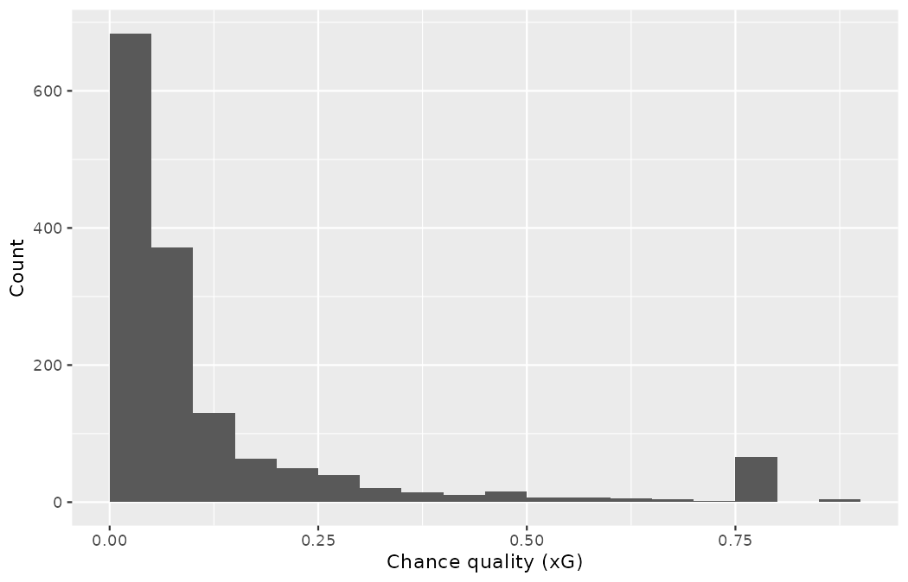

# Getting set up {#sec-appendix-setup}

The welcome chapter made you a promise: *you will compute everything*.
This appendix is where that promise becomes practical.
It exists because the promise has a prerequisite the chapters themselves never pause to state, so let us state it now, prominently, before a single formula.

::: {.callout-important title="This book assumes you compute with R"}
Every worked example, every `#>` output line, and every exercise solution in this book was produced in R, and the book provides **no statistical tables** — no z-table, no t-table, no chi-squared table in any appendix.
When a chapter needs a tail area or a critical value, it computes one: `pnorm()`, `pt()`, `pchisq()`, `qt()`.
If you cannot yet run R code, you cannot yet check a single number in this book against your own machine — so work through this appendix first.
It takes perhaps half an hour, and everything after it assumes it.
:::

None of this requires prior programming experience.
The chapters introduce each R idiom as it is needed; your job here is only to build the workshop — install two programs, install nine packages, download one folder of data, and run one script end to end.

## Install R, then RStudio {#sec-appendix-install}

Two separate installations, in this order.
**R** is the language and the engine; **RStudio Desktop** is the workbench you will drive it from.
Both are free.

**R** — from the R Project at [r-project.org](https://www.r-project.org) (follow the CRAN download link):

-   *Windows:* download the "base" installer (`.exe`), run it, and accept the defaults.
-   *macOS:* download the `.pkg` installer that matches your machine (Apple silicon or Intel — the download page labels them) and run it.
-   *Linux:* install from your distribution's package manager (e.g., `sudo apt install r-base` on Ubuntu/Debian), or add CRAN's repository per the instructions on the download page if you want the current release.

This book's output was produced with R 4.6.1; any reasonably current release will reproduce it.

**RStudio Desktop** — from Posit at [posit.co](https://posit.co/download/rstudio-desktop/): download the installer for your operating system and run it.
When you open RStudio it finds your R installation by itself.
The pane you will live in at first is the **Console** — the prompt marked `>` — where a line of R is executed the moment you press Enter.

## Install the book's packages {#sec-appendix-packages}

R's base installation is deliberately lean; the tools this book leans on arrive as *packages*.
The book uses nine.
Install them all with one line pasted into the Console:

```r
install.packages(c("dplyr", "tidyr", "readr", "ggplot2", "infer",
                   "broom", "purrr", "patchwork", "ggridges"))
```

For orientation: `readr` reads the data files, `dplyr` and `tidyr` reshape and summarize them, `purrr` repeats computations (bootstrap loops), `ggplot2` draws every figure — with `patchwork` and `ggridges` supplying figure layouts and ridge plots — `infer` runs the randomization and bootstrap pipelines of the inference chapters, and `broom` tidies model output into tables.

Two verbs, one distinction, endless beginner grief: `install.packages()` downloads a package onto your machine **once**; `library()` loads an installed package into the current session and must be rerun **every time you restart R**.
That is why the chapters' code blocks open with `library()` calls and never with `install.packages()`.

## Coming from spreadsheets {#sec-appendix-spreadsheets}

If your current tool is Excel or Google Sheets, you already think in most of the operations this book's code performs — only the names change.
The bridge below covers the bulk of what the chapters do with data:

| In a spreadsheet you reach for... | In this book's R it is | In one line |
|:-------------------------|:----------------|:------------------------------|
| `VLOOKUP` / `XLOOKUP` | `left_join()` | matches rows across two tables by a shared key column |
| a pivot table | `group_by()` + `summarize()` | one row of output per group — the book's single most common pattern |
| filtering rows | `filter()` | keeps only the rows meeting a condition; the book's frame decisions (penalties in or out) are one `filter()` line |
| a new calculated column | `mutate()` | adds a column computed from existing ones, all rows at once |
| sorting | `arrange()` | orders rows by one or more columns (`desc()` for descending) |
| hiding columns | `select()` | keeps only the named columns |

: The spreadsheet-to-R bridge. {#tbl-appendix-spreadsheets}

The chapters introduce each of these properly the first time it is needed, and the quick reference's idiom index (@sec-r-idioms) points back to where every recurring construction is first explained.

## Get the book's materials {#sec-appendix-materials}

The data ship in the book's companion repository — a single folder you download once and keep.

<!-- TODO: insert repository URL when published -->

Inside it, the only path the chapters ever read from is `data/derived/`, which holds the four CSV files that power every real-data example:

| File | Contents |
|:--------------------------|:-------------------------------------------|
| `wc2022_shots.csv` | every shot at the 2022 Men's World Cup (one row per shot) |
| `wc2022_matches.csv` | the 64 matches of that tournament |
| `weuro2025_shots.csv` | every shot at the 2025 Women's Euro |
| `weuro2025_matches.csv` | the 31 matches of that tournament |

Download (or clone) the repository and note where you put it.
That top-level folder — the one that *contains* `data/` — is the **repository root**, and it matters more than any other setup detail, as the next section explains.

## Work from the repository root {#sec-appendix-wd}

Every code block in this book reads data with a *relative* path:

```r
wc2022_shots <- read_csv("data/derived/wc2022_shots.csv")
```

A relative path is resolved against R's **working directory**, so this line succeeds only when the working directory is the repository root.
Set that up once, in either of two ways:

-   **The RStudio-project way (recommended).** In RStudio: *File \> New Project \> Existing Directory*, and choose the repository root.
    From then on, open the project (the `.Rproj` file) and RStudio sets the working directory correctly every session, forever.
-   **The `setwd()` way.** At the start of a session, point R there yourself, with the path adjusted to your machine:

```r
setwd("~/projects/scouting-book")   # your path to the repository root
```

Either way, verify before you trust it: `getwd()` prints the current working directory, and `file.exists("data/derived/wc2022_shots.csv")` must return `TRUE`.
If it returns `FALSE`, nothing else in this book will run — see the troubleshooting table below.

## Your first script {#sec-appendix-first-script}

Now the whole toolchain, end to end.
In RStudio, *File \> New File \> R Script* gives you an editor pane; paste the script below, save it in the repository root, and run it line by line (Ctrl+Enter on Windows/Linux, Cmd+Return on macOS sends the current line to the Console).

The first time `read_csv()` runs, it prints a message — `Rows: 1494 Columns: 21`, followed by a column specification.
That message is information, not an error: it is `readr` telling you what it found, and its row count is your first data check.

```r
library(readr)
library(dplyr)
library(ggplot2)

wc2022_shots <- read_csv("data/derived/wc2022_shots.csv")

wc2022_shots |>
  summarize(
    shots      = n(),
    goals      = sum(goal),
    conversion = mean(goal)
  )
#> # A tibble: 1 × 3
#>   shots goals conversion
#>   <int> <int>      <dbl>
#> 1  1494   195      0.131

ggplot(wc2022_shots, aes(x = statsbomb_xg)) +
  geom_histogram(binwidth = 0.05, boundary = 0) +
  labs(x = "Chance quality (xG)", y = "Count")
```

{fig-alt="Histogram of the chance quality of all 1,494 shots at the 2022 Men's World Cup in bins of width 0.05. The leftmost bar holds 684 shots and the bars fall away steeply to the right — a strongly right-skewed shape — except for one isolated spike of 66 shots near 0.78." width=85%}

If your Console shows the same tibble — 1,494 shots, 195 goals, conversion 0.131 — and the same histogram appears in the Plots pane, your setup is complete and every number in this book is now within your reach.
Two features of this first picture will follow you through the whole book: chance quality is strongly right-skewed (most shots are poor chances), and that lone spike near 0.78 is not noise — it is the tournament's 64 penalty kicks, all priced identically by the xG model, and the reason for the book's standing penalty convention (@sec-chp11-pens-out, and the summary table in @sec-pens-at-a-glance).

::: {.callout-tip title="Check your understanding"}
Rerun the script with one change: read `data/derived/weuro2025_shots.csv` instead.
Predict first — should the counts match the World Cup's?
Then run it and see.

Answer: no — it is a different tournament with half the matches.
You should see `Rows: 913` from `read_csv()`, then 913 shots, 123 goals, conversion 0.135, and a histogram with the same right-skewed shape and the same penalty spike near 0.78.
If you got that, you have just replicated your first analysis across competitions — a move the book makes constantly.
:::

## When something goes wrong {#sec-appendix-troubleshooting}

Three failures account for nearly every setup problem.

| Symptom (what R says) | What it means | The fix |
|:-----------------------------|:----------------------|:-----------------------|
| `there is no package called 'dplyr'` | The package is not installed on this machine (or its name is mistyped — case matters). | Run `install.packages("dplyr")` once. If `library()` still fails, check the spelling exactly. |
| `could not find function "read_csv"` | The package is installed but not loaded in *this* session. | Run the script's `library()` lines again — after every restart of R. |
| `cannot open file 'data/derived/wc2022_shots.csv': No such file or directory` | Almost never a missing file — it is the wrong **working directory**: R is not sitting at the repository root. | Open the `.Rproj` project, or `setwd()` to the repository root; confirm with `getwd()` and `file.exists("data/derived/wc2022_shots.csv")`. |
| Player names print garbled (`Sørensen` for `Sørensen`) | A locale/encoding mismatch: the data files are UTF-8, and your system is displaying them in another encoding. | Use `read_csv()` (UTF-8 by default), not `read.csv()`. On Windows, a current R (4.2+) uses UTF-8 natively; failing that, `Sys.setlocale()` or RStudio's *Tools \> Global Options \> Code \> Saving* encoding setting set to UTF-8. |

: The three (and a half) failures that account for nearly every setup problem. {#tbl-appendix-troubleshooting}

One habit will spare you most of this table: start every session by opening the project, and start every script with its `library()` lines.
The workshop is built; the statistics can now begin.

------------------------------------------------------------------------

This appendix is original to this adaptation, licensed CC BY-SA 4.0. Match data: StatsBomb open data.
