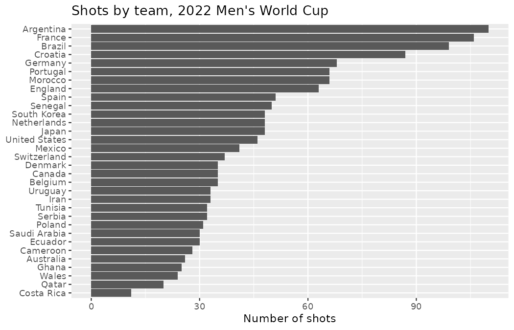
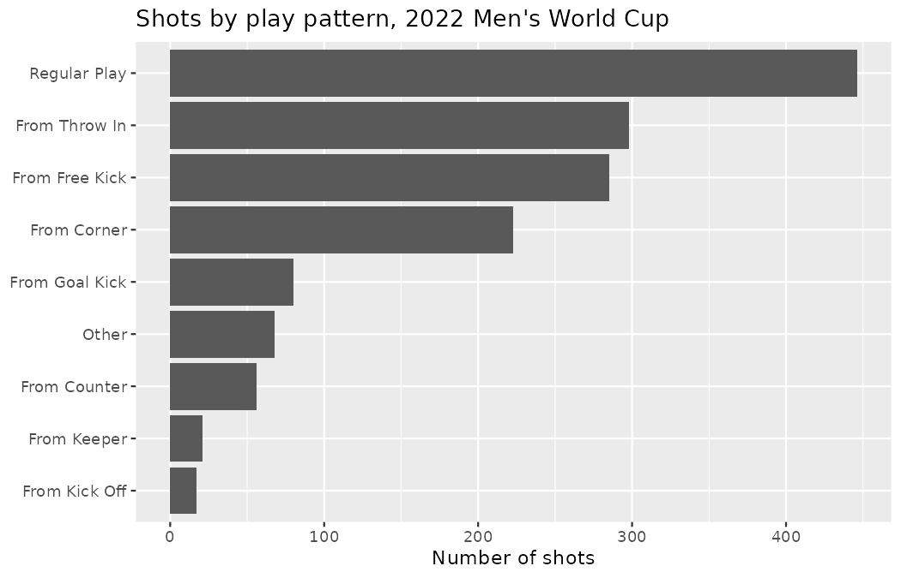
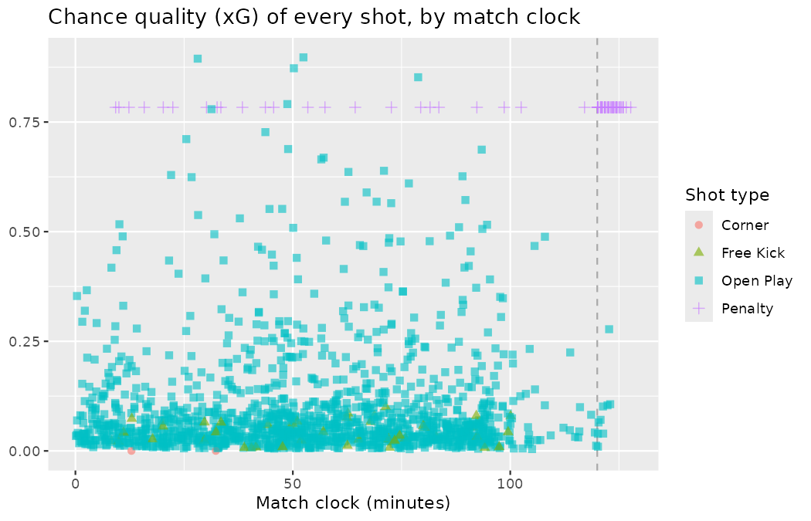
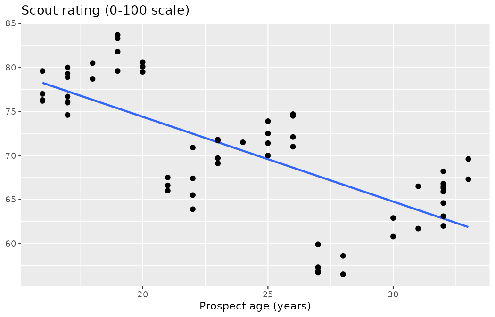
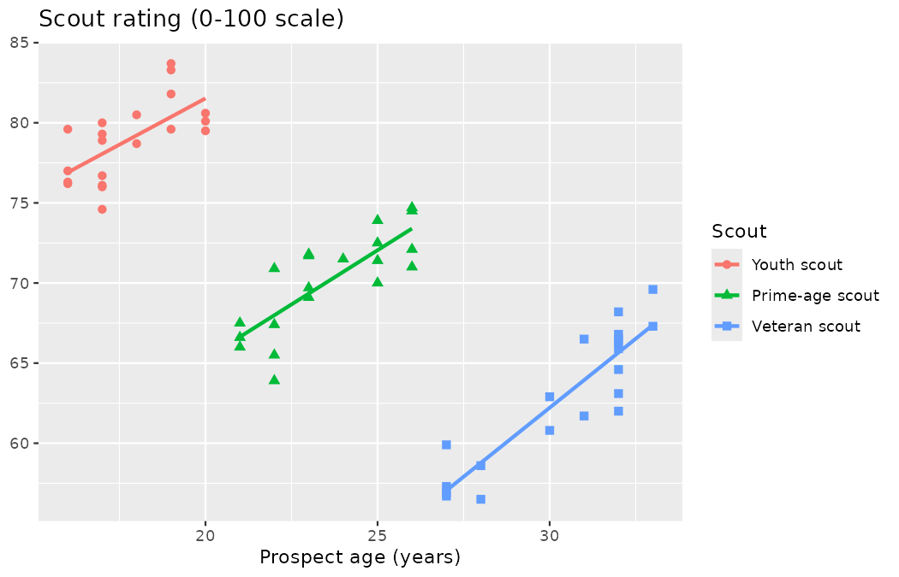

# Applications: Data {#sec-data-applications}

You have spent two chapters learning the vocabulary of data — observational units and variables in @sec-data-hello, study designs and sampling schemes in @sec-data-design.
In this chapter we put that vocabulary to work.
There are no new formulas here; instead, you will watch an analyst meet a dataset for the first time and do, in order, the things a careful analyst always does.
Every chapter in this book that ends a part will follow this "applications" format: a case study on real data, an interactive walkthrough for you to work along with, and a review.

## Case study: shots at the 2022 World Cup {#sec-case-study-paralympics}

While much of the footballing public is glued to the Men's World Cup every four years, other major tournaments hold the same competitive thrills — and for a scouting department, often better value.
The Women's European Championship has been contested since 1984, and the 2025 edition in Switzerland produced some of the most-watched elite international football in the women's game.
Throughout this book we will keep both tournaments on the desk: the **2022 Men's World Cup** as our workhorse dataset, and the **2025 Women's Euro** as the second competition we return to whenever we want to ask, "does the pattern hold somewhere else?"

In this case study we introduce the dataset of every shot taken at the 2022 Men's World Cup.
The goal of the case study is to walk you through what a data analyst at a club does when they first get hold of a dataset — the very first hour of work, before any modeling, before any recommendation to Marta Vidal.
We also provide some "foreshadowing" of concepts and techniques we'll introduce in the next few chapters on exploratory data analysis.
Last, we introduce **Simpson's paradox** and discuss the importance of understanding the impact of multiple variables in an analysis.

::: {.callout-note title="Data"}
The `wc2022_shots` and `weuro2025_shots` data are stored as CSV files in `data/derived/`, built from StatsBomb open data.
Each file contains one row per shot taken in the corresponding tournament.
:::

When you encounter a new dataset, taking a peek at the last few rows should be instinctual.
Below we load the data and look at the final five shots in the file (we display a handful of the columns so the output fits on the page; the full set of columns is described shortly).

```r
library(dplyr)
library(readr)
library(tidyr)
library(ggplot2)
library(purrr)

wc2022_shots <- read_csv("data/derived/wc2022_shots.csv")

wc2022_shots |>
  slice_tail(n = 5) |>
  select(stage, team, player, minute, second, statsbomb_xg, outcome)
#> # A tibble: 5 × 7
#>   stage       team        player              minute second statsbomb_xg outcome
#>   <chr>       <chr>       <chr>                <dbl>  <dbl>        <dbl> <chr>
#> 1 Group Stage Portugal    Rafael Alexandre C…     71     22       0.0298 Off T
#> 2 Group Stage South Korea Kang-In Lee             73     25       0.0237 Off T
#> 3 Group Stage Portugal    João Maria Lobo Al…     80     14       0.0210 Blocked
#> 4 Group Stage Portugal    João Pedro Cavaco …     89     41       0.0443 Blocked
#> 5 Group Stage South Korea Hee-Chan Hwang          90     28       0.422  Goal
```

Notice something already: the last rows of the file are *group-stage* shots, from a Portugal versus South Korea match.
The file is not ordered from the opening match through to the final — the rows follow StatsBomb's internal match identifiers, not the calendar.
This is a small observation with a large moral: never assume a dataset's row order means anything until you have checked.

It can be helpful to look at the first few rows of the data as well, to get a sense of aspects of the data which may not be apparent in the last few rows.

```r
wc2022_shots |>
  slice_head(n = 5) |>
  select(stage, team, player, minute, second, statsbomb_xg, outcome)
#> # A tibble: 5 × 7
#>   stage       team    player            minute second statsbomb_xg outcome
#>   <chr>       <chr>   <chr>              <dbl>  <dbl>        <dbl> <chr>
#> 1 Group Stage Canada  Mark Anthony Kaye      2      5       0.0389 Blocked
#> 2 Group Stage Morocco Hakim Ziyech           3     29       0.0245 Goal
#> 3 Group Stage Morocco Abdelhamid Sabiri      8     18       0.0221 Blocked
#> 4 Group Stage Morocco Sofiane Boufal         9      9       0.0616 Wayward
#> 5 Group Stage Canada  Tajon Buchanan        14      7       0.279  Off T
```

The first rows come from Canada against Morocco — the same Morocco whose surprise run to the semi-finals will keep them on our desk for much of this book.
At this stage it's also useful to think about how the data were collected, as that will inform the scope of any inference you can make based on your analysis.

::: {.callout-tip title="Check your understanding"}
Do these data come from an observational study or an experiment?

------------------------------------------------------------------------

This is an observational study.
StatsBomb analysts logged every shot as the matches unfolded; nothing about the play was assigned or manipulated by anyone doing research.
Recall from @sec-data-design that this means the data can reveal *associations*, but cannot by themselves establish that one variable causes another.
:::

How big is the dataset?

```r
dim(wc2022_shots)
#> [1] 1494   21
```

::: {.callout-tip title="Check your understanding"}
There are 1,494 rows and 21 columns in the dataset.
What does each row and each column represent?

------------------------------------------------------------------------

Each row represents one shot taken at the 2022 Men's World Cup — the observational unit here is a shot, not a match or a player.
Each column represents a variable containing one piece of information about each shot.
:::

Once you've identified the rows and columns, it's useful to review the **data dictionary** to learn what each column in the dataset represents.
The data dictionary for `wc2022_shots` (and its sibling `weuro2025_shots`, which has identical columns) is provided in @tbl-wc2022-var-def.

| Variable | Description |
|:---|:------------------|
| `competition` | Competition identifier: `wc2022` (2022 Men's World Cup) or `weuro2025` (2025 Women's Euro). |
| `match_id` | StatsBomb identifier of the match in which the shot occurred. |
| `match_date` | Date the match was played. |
| `stage` | Tournament stage (`Group Stage`, `Round of 16`, ..., `Final`). |
| `team` | Team taking the shot. |
| `opponent` | The opposing team. |
| `player` | Name of the shooter. |
| `position` | The shooter's listed position at the time of the shot (22 StatsBomb position labels, e.g., `Center Forward`, `Left Wing`). |
| `period` | Phase of play the shot occurred in: 1 (first half), 2 (second half), 3 and 4 (extra-time halves), 5 (penalty shoot-out). |
| `minute` | Match-clock minute at the moment of the shot. |
| `second` | Second within that minute. |
| `play_pattern` | The passage of play the shot arose from (`Regular Play`, `From Corner`, `From Throw In`, ...; 9 levels). |
| `shot_type` | `Open Play`, `Free Kick`, `Corner`, or `Penalty`. |
| `body_part` | `Right Foot`, `Left Foot`, `Head`, or `Other`. |
| `technique` | Striking technique (`Normal`, `Volley`, `Half Volley`, `Lob`, ...). |
| `first_time` | Whether the shot was struck first time, without controlling the ball (`TRUE`/`FALSE`). |
| `under_pressure` | Whether the shooter was under defensive pressure (`TRUE`/`FALSE`). |
| `one_on_one` | Whether the shooter was one-on-one with the goalkeeper (`TRUE`/`FALSE`). |
| `statsbomb_xg` | StatsBomb's expected-goals value: the model's estimate, made before the outcome is known, of the probability that the shot scores. We call this the shot's *chance quality*. |
| `outcome` | Result of the shot (`Goal`, `Saved`, `Blocked`, `Off T`, `Wayward`, `Post`, ...). |
| `goal` | Whether the shot scored (`TRUE`/`FALSE`). |

: Variables and their descriptions for the `wc2022_shots` dataset. {#tbl-wc2022-var-def}

::: {.callout-important title="What `play_pattern` does and does not record"}
`play_pattern` records how the *possession* started, not how the chance was created.
A shot arriving twenty-five passes after a throw-in is still logged as `From Throw In`; a header directly from a corner delivery and a shot at the end of a long move that merely *began* with a corner both read `From Corner`.
When a question is about the delivery that produced the shot itself — the cross, the cutback, the set-piece routine — this variable can only approximate the answer, and any report built on it should say so.
:::

We now have a better sense of what each column represents, but we do not yet know much about the characteristics of each of the variables.

::: {.callout-note title="Worked example"}
Determine whether each variable in the `wc2022_shots` dataset is numerical or categorical.
For numerical variables, further classify them as continuous or discrete.
For categorical variables, determine if the variable is ordinal.

------------------------------------------------------------------------

The numerical variables are `statsbomb_xg` (continuous — a probability can land anywhere between 0 and 1), and `minute` and `second` (discrete — the clock is recorded in whole units).
The categorical variables are `competition`, `team`, `opponent`, `player`, `position`, `play_pattern`, `shot_type`, `body_part`, `technique`, and `outcome`; among these, `stage` is ordinal (a quarter-final comes after the round of 16), and the logical variables `first_time`, `under_pressure`, `one_on_one`, and `goal` are categorical with exactly two levels.

Two variables are trickier to classify.
`match_id` is stored as a number, but it is an identifier — computing its average would be meaningless — so we treat it as categorical.
`period` is also stored as a number, and it is genuinely ordered (period 2 follows period 1), but the gaps between its values carry no numeric meaning: it is an ordinal categorical variable wearing a numeric costume.
Sometimes the data dictionary (presented in @tbl-wc2022-var-def) isn't sufficient for a complete analysis, and we need to go back to the data source and try to understand the data better before we can proceed with the analysis meaningfully.
:::

### The match clock: a cautionary tale {#sec-wc-match-clock}

The `period` variable earns its keep the moment you try to use the match clock.
You might expect `minute` alone to tell you when in a match a shot happened.
Let's check that expectation against the data:

```r
wc2022_shots |>
  group_by(period) |>
  summarize(
    shots = n(),
    first_minute = min(minute),
    last_minute = max(minute)
  )
#> # A tibble: 5 × 4
#>   period shots first_minute last_minute
#>    <dbl> <int>        <dbl>       <dbl>
#> 1      1   607            0          55
#> 2      2   801           45         102
#> 3      3    20           91         106
#> 4      4    25          105         122
#> 5      5    41          120         127
```

Read that table slowly, because it contains two traps.
First, the clock ranges *overlap*: period 1 runs as late as minute 55 (first-half stoppage time), while period 2 begins at minute 45.
A shot logged at minute 47 might be a first-half stoppage-time chance or an early second-half one — `minute` alone cannot tell you which.
In fact, 61 shots in this dataset were taken in first-half stoppage time:

```r
wc2022_shots |>
  filter(period == 1, minute >= 45) |>
  summarize(shots = n())
#> # A tibble: 1 × 1
#>   shots
#>   <int>
#> 1    61
```

Second, there is a fifth period, with 41 shots and clock readings from minute 120 to 127.
Period 5 is the penalty shoot-out — and yes, shoot-out kicks are logged as shots in this dataset.
Hold that thought; it returns with a vengeance later in the case study.

To get a genuinely continuous "when did this happen" variable you must combine columns — for example, `minute + second / 60` gives the clock in decimal minutes — and you must still carry `period` alongside it to break the ties.
This is the same lesson every analyst learns eventually: a variable's name tells you what the collector *intended*; only the data tell you what it *is*.

::: {.callout-tip title="Check your understanding"}
A scout's notes say a chance fell "on 45+2".
Which combination of variables in `wc2022_shots` would identify shots from that moment, and why is `minute == 47` alone not enough?

------------------------------------------------------------------------

You need `period == 1` together with `minute == 47` (the clock in this dataset keeps counting past 45 in the first half, so "45+2" is stored as minute 47 of period 1).
`minute == 47` alone would also capture ordinary second-half shots taken two minutes after the restart, since period 2 begins at minute 45.
:::

### Getting to know the categorical variables {#sec-wc-categorical-look}

Next, let's try to get to know each variable a little bit better.
For categorical variables, this involves figuring out what their levels are and how commonly represented they are in the data.
Two categorical variables a scouting department cares about immediately are `team` (who is generating the shots?) and `play_pattern` (what kind of football do shots come from?).

```r
wc2022_shots |>
  count(team, sort = TRUE)
#> # A tibble: 32 × 2
#>    team          n
#>    <chr>     <int>
#>  1 Argentina   110
#>  2 France      106
#>  3 Brazil       99
#>  4 Croatia      87
#>  5 Germany      68
#>  6 Morocco      66
#>  7 Portugal     66
#>  8 England      63
#>  9 Spain        51
#> 10 Senegal      50
#> # ℹ 22 more rows

wc2022_shots |>
  count(team, sort = TRUE) |>
  slice_tail(n = 3)
#> # A tibble: 3 × 2
#>   team           n
#>   <chr>      <int>
#> 1 Wales         24
#> 2 Qatar         20
#> 3 Costa Rica    11
```

```r
wc2022_shots |>
  count(play_pattern, sort = TRUE)
#> # A tibble: 9 × 2
#>   play_pattern       n
#>   <chr>          <int>
#> 1 Regular Play     446
#> 2 From Throw In    298
#> 3 From Free Kick   285
#> 4 From Corner      223
#> 5 From Goal Kick    80
#> 6 Other             68
#> 7 From Counter      56
#> 8 From Keeper       21
#> 9 From Kick Off     17
```

Both distributions are easier to take in as bar plots, which you will learn more about in @sec-explore-categorical.

```r
wc2022_shots |>
  count(team) |>
  ggplot(aes(y = reorder(team, n), x = n)) +
  geom_col() +
  labs(
    x = "Number of shots",
    y = NULL,
    title = "Shots by team, 2022 Men's World Cup"
  )

wc2022_shots |>
  count(play_pattern) |>
  ggplot(aes(y = reorder(play_pattern, n), x = n)) +
  geom_col() +
  labs(
    x = "Number of shots",
    y = NULL,
    title = "Shots by play pattern, 2022 Men's World Cup"
  )
```

{fig-alt="A horizontal bar chart with 32 bars, one per team, sorted by shot count: Argentina at the top with 110 shots, just ahead of France with 106 and Brazil with 99, tapering steadily down to Costa Rica's 11 at the bottom." width=85%}

{fig-alt="A horizontal bar chart of the 9 play patterns: Regular Play towers over the rest with 446 shots, followed by throw-ins, free kicks, and corners, with kick-offs and keeper distributions barely registering." width=85%}

The first plot shows 32 bars, one per team, sorted by shot count: Argentina sits at the top with 110 shots, just ahead of France with 106 and Brazil with 99, and the bars taper steadily down to Costa Rica's 11 at the bottom — a full ten-to-one ratio between the most and least prolific teams.
The second plot shows the 9 play patterns: `Regular Play` towers over the rest with 446 shots, followed by throw-ins (298), free kicks (285), and corners (223), with kick-offs (17) and keeper distributions (21) barely registering.

::: {.callout-tip title="Check your understanding"}
Argentina tops the shot chart.
Can we conclude that Argentina played the most attacking football at the tournament?

------------------------------------------------------------------------

Not from this plot.
Argentina reached the final, so they played 7 matches while eliminated group-stage teams played only 3 — the raw count mixes together *shots per match* and *matches played*.
Croatia's 87 shots (also a deep run, losing semi-finalist) versus Spain's 51 (out in the round of 16) reflect the same entanglement.
To compare attacking intent we would need a rate, such as shots per match — a standardization idea we develop properly in @sec-explore-numerical.
:::

### Getting to know the numerical variables {#sec-wc-numerical-look}

Similarly, we can examine the distributions of the numerical variables.
The variable a modern scouting department stares at most is `statsbomb_xg`, the chance quality of each shot.
We already know from the head and tail of the data that most shots carry small values — 0.02 here, 0.28 there.
Let's break chance quality down by `shot_type`:

```r
wc2022_shots |>
  group_by(shot_type) |>
  summarize(
    shots = n(),
    mean = round(mean(statsbomb_xg), 3),
    min = round(min(statsbomb_xg), 3),
    max = round(max(statsbomb_xg), 3)
  )
#> # A tibble: 4 × 5
#>   shot_type shots  mean   min   max
#>   <chr>     <int> <dbl> <dbl> <dbl>
#> 1 Corner        2 0     0     0
#> 2 Free Kick    46 0.043 0.007 0.1
#> 3 Open Play  1382 0.098 0.004 0.897
#> 4 Penalty      64 0.783 0.783 0.783
```

Three things deserve comment.
First, the two shots with `shot_type == "Corner"` are attempts scored directly from the corner kick itself — so rare (2 of 1,494) that their summary statistics mean little; small groups will always need this caveat.
Second, direct free kicks average a chance quality of only 0.043 — roughly one goal per 23 attempts — a number worth quoting the next time a trialist's agent leads with "elite set-piece delivery".
Third, look at the `Penalty` row: mean, minimum, and maximum agree in every digit.
Every penalty in the dataset carries the *identical* xG value: the stored number is exactly 0.7835.
(Displays round it — to 0.783 in the table above, where we rounded to three decimals, and to 0.784 wherever software prints three significant digits instead — so both roundings of the one stored value 0.7835 will appear in output throughout this book.)
That is not a fluke of the tournament; it is a property of the xG model, which treats all penalties as the same standardized situation.
Keep this in mind whenever you summarize chance quality: penalties form a spike of identical values at 0.7835, far to the right of almost every open-play shot.

We can also ask how chance quality varies by the shooter's position.
With 22 position labels, many represented by only a handful of shots, we restrict attention to positions with at least 75 shots so that the group summaries rest on reasonable sample sizes:

```r
wc2022_shots |>
  group_by(position) |>
  summarize(shots = n(), mean_xg = round(mean(statsbomb_xg), 3)) |>
  filter(shots >= 75) |>
  arrange(desc(mean_xg))
#> # A tibble: 8 × 3
#>   position                  shots mean_xg
#>   <chr>                     <int>   <dbl>
#> 1 Right Center Forward         82   0.185
#> 2 Center Forward              235   0.167
#> 3 Left Center Forward          77   0.152
#> 4 Right Wing                  154   0.117
#> 5 Left Wing                   184   0.11
#> 6 Center Attacking Midfield    80   0.104
#> 7 Right Defensive Midfield     90   0.099
#> 8 Left Defensive Midfield      93   0.096
```

The gradient is beautifully clean: the three center-forward roles average the best chances (0.152 to 0.185 xG per shot), wingers sit in the middle, and defensive midfielders shoot from the worst positions (below 0.10).

::: {.callout-tip title="Check your understanding"}
Does the table above show that center forwards are better *finishers* than defensive midfielders?

------------------------------------------------------------------------

No.
`statsbomb_xg` measures the quality of the *chance*, assessed before the shot is struck — it says nothing about how well the shot was then executed.
The table shows that center forwards shoot from more dangerous situations, which is exactly what their role asks of them.
Whether a player converts *more or less often than their chances warrant* is a different question, about finishing skill, that we will need models (@sec-model-slr and beyond) to pose properly.
:::

### Two tournaments, side by side {#sec-wc-weuro-divisions}

A single tournament is one draw from the game of football.
Before a scouting department builds any rule of thumb on these numbers, it should ask whether the same structure appears in a different competition.
So let's place our second tournament alongside the first, treating the 2022 Men's World Cup and the 2025 Women's Euro as two "divisions" of the same sport, and break down chance quality by competition and play pattern:

```r
weuro2025_shots <- read_csv("data/derived/weuro2025_shots.csv")

both_shots <- bind_rows(wc2022_shots, weuro2025_shots)

both_shots |>
  group_by(competition, play_pattern) |>
  summarize(
    shots = n(),
    mean = round(mean(statsbomb_xg), 3),
    min = round(min(statsbomb_xg), 3),
    max = round(max(statsbomb_xg), 3),
    .groups = "drop"
  ) |>
  arrange(play_pattern, competition) |>
  print(n = 18)
#> # A tibble: 18 × 6
#>    competition play_pattern   shots  mean   min   max
#>    <chr>       <chr>          <int> <dbl> <dbl> <dbl>
#>  1 wc2022      From Corner      223 0.102 0     0.895
#>  2 weuro2025   From Corner      160 0.084 0.006 0.532
#>  3 wc2022      From Counter      56 0.159 0.008 0.791
#>  4 weuro2025   From Counter      41 0.091 0.006 0.417
#>  5 wc2022      From Free Kick   285 0.081 0.005 0.873
#>  6 weuro2025   From Free Kick   104 0.085 0.005 0.686
#>  7 wc2022      From Goal Kick    80 0.12  0.006 0.852
#>  8 weuro2025   From Goal Kick    35 0.142 0.007 0.672
#>  9 wc2022      From Keeper       21 0.106 0.008 0.367
#> 10 weuro2025   From Keeper       22 0.062 0.024 0.157
#> 11 wc2022      From Kick Off     17 0.095 0.004 0.475
#> 12 weuro2025   From Kick Off     10 0.089 0.019 0.28
#> 13 wc2022      From Throw In    298 0.085 0.006 0.552
#> 14 weuro2025   From Throw In    177 0.104 0.005 0.723
#> 15 wc2022      Other             68 0.748 0.036 0.783
#> 16 weuro2025   Other             54 0.755 0.123 0.783
#> 17 wc2022      Regular Play     446 0.098 0.004 0.897
#> 18 weuro2025   Regular Play     310 0.1   0.004 0.725
```

The shot *counts* are uniformly smaller at the Women's Euro, but that is context, not signal: the World Cup had 64 matches and 32 teams, the Euro 31 matches and 16 teams, so the counts should be taken in terms of the size of each tournament — compare the means, not the totals.
And the means are strikingly stable across the two competitions for most patterns: regular play averages 0.098 versus 0.100, free kicks 0.081 versus 0.085.
The one pattern where the tournaments visibly part ways is the counter-attack: 0.159 per shot at the World Cup against 0.091 at the Euro.
Note it in your notebook — but note it as a *question*, not a finding.
Whether a gap like that reflects something real about the two competitions, or is the kind of difference two samples can show by chance alone, is precisely the question the inference chapters of this book (starting in @sec-foundations-randomization) will teach you to answer.

And do you see the oddity hiding in rows 15 and 16?
The `Other` play pattern averages 0.748 and 0.755 — seven times the chance quality of regular play, in *both* tournaments.
A level called "Other" should be a dull miscellaneous bucket, not the most dangerous passage of play in football.
When a boring category produces a spectacular number, do not write it up; investigate it.
The investigation takes one line:

```r
both_shots |>
  filter(play_pattern == "Other") |>
  count(competition, shot_type)
#> # A tibble: 4 × 3
#>   competition shot_type     n
#>   <chr>       <chr>     <int>
#> 1 wc2022      Open Play     4
#> 2 wc2022      Penalty      64
#> 3 weuro2025   Open Play     3
#> 4 weuro2025   Penalty      51
```

Mystery solved: `Other` is where this data source files penalty kicks — 64 of the 68 World Cup `Other` shots and 51 of the 54 at the Euro are penalties, each carrying the stored penalty value 0.7835 — so the "most dangerous passage of play" is simply the penalty spot wearing a dull label.

A detail worth pausing on: exploring a dataset in this way often uncovers facts about the context in which the data were collected.
Let's plot every shot's chance quality against the match clock, marking shot types:

```r
wc2022_shots |>
  mutate(clock = minute + second / 60) |>
  ggplot(aes(x = clock, y = statsbomb_xg, color = shot_type, shape = shot_type)) +
  geom_vline(xintercept = 120, color = "darkgrey", lty = 2, lwd = 0.5) +
  geom_point(size = 2, alpha = 0.6) +
  labs(
    x = "Match clock (minutes)",
    y = NULL,
    color = "Shot type",
    shape = "Shot type",
    title = "Chance quality (xG) of every shot, by match clock"
  )
```

{fig-alt="A scatterplot of every shot's chance quality against the match clock, colored and shaped by shot type. Most points hug the bottom of the plot, a perfectly horizontal band of penalty points slices across at the stored value 0.7835, and a dense cluster of penalties sits to the right of the dashed line at minute 120." width=85%}

The picture is unmistakable.
The vast majority of points hug the bottom of the plot — open-play shots rarely exceed 0.4, with the single best open-play chance of the tournament at 0.897.
Slicing across the plot at the stored penalty value 0.7835 is a perfectly horizontal band of penalty points: every penalty, identical xG.
And to the right of the dashed line at minute 120, where regulation football has ended, sits a dense cluster of penalties.
Those are the shoot-outs we spotted in the `period` table, and the data confirm it:

```r
wc2022_shots |>
  filter(period == 5) |>
  summarize(kicks = n(), scored = sum(goal), matches = n_distinct(match_id))
#> # A tibble: 1 × 3
#>   kicks scored matches
#>   <int>  <int>   <int>
#> 1    41     26       5

wc2022_shots |>
  filter(period == 5) |>
  count(stage)
#> # A tibble: 3 × 2
#>   stage              n
#>   <chr>          <int>
#> 1 Final              8
#> 2 Quarter-finals    18
#> 3 Round of 16       15
```

Five matches went to shoot-outs — two in the round of 16, two quarter-finals, and the final itself, where Argentina beat France from the spot.
Those 41 shoot-out kicks (26 of them scored) sit in the dataset alongside ordinary shots, each carrying the flat 0.7835 penalty xG.
Whether to keep them depends entirely on your question: an analyst studying *how teams create chances* should almost certainly filter them out (`shot_type == "Open Play"`, or `period <= 4`, and say so in the report); an analyst studying *tournament outcomes* had better keep them, since they decided who lifted the trophy.
The dataset does not make this decision for you.
Knowing your data well enough to even see the decision — that is what this first hour of work buys you.

So far we examined aspects of some of the individual variables, and we have broken down chance quality by shot type, position, and competition.
You might have already wondered how summaries like these behave when a third variable enters the picture.
A constructed scouting scenario will let us explore an important statistical concept, Simpson's paradox.

## Simpson's paradox

Simpson's paradox is a description of three (or more) variables.
The paradox happens when a third variable reverses the relationship between the first two variables.
As always, the formal statement comes first, and the demonstration follows.

::: {.callout-important title="Simpson's paradox"}
**Simpson's paradox** happens when an association or relationship between two variables in one direction (e.g., positive) reverses (e.g., becomes negative) when a third variable is considered.
:::

To see it happen, we will build a scenario inside Northbridge United.
This is a constructed dataset — no real scouting records were used — and, as always in this book, we generate it in seeded R code so that every number below can be reproduced exactly.

Here is the story.
Marta Vidal, reviewing the club's scouting database at the end of the season, notices something alarming: across all rated prospects, *the older the player, the lower the rating*.
"Do my scouts believe footballers get worse every year from age sixteen?" she asks Priya Rao.
Priya knows one structural fact about the database that Marta has forgotten: Northbridge assigns each scout a market segment by age.
One scout covers the youth market (ages 16–20), one covers prime-age players (21–26), and one covers the veteran market (27–33).
Each scout has rated 20 prospects on the club's 0–100 scale.
The code below constructs ratings with exactly this structure:

```r
set.seed(301)
scout_ratings <- tibble(
  scout  = factor(rep(c("Youth scout", "Prime-age scout", "Veteran scout"), each = 20),
                  levels = c("Youth scout", "Prime-age scout", "Veteran scout")),
  age_lo = rep(c(16, 21, 27), each = 20),
  age_hi = rep(c(20, 26, 33), each = 20)
) |>
  mutate(
    age    = map2_int(age_lo, age_hi, \(lo, hi) sample(lo:hi, size = 1)),
    rating = round(
      rep(c(76, 67, 58), each = 20) + 1.5 * (age - age_lo) + rnorm(60, mean = 0, sd = 2),
      1
    )
  ) |>
  select(scout, age, rating)

scout_ratings
#> # A tibble: 60 × 3
#>    scout         age rating
#>    <fct>       <int>  <dbl>
#>  1 Youth scout    19   79.6
#>  2 Youth scout    17   78.9
#>  3 Youth scout    20   80.6
#>  4 Youth scout    20   80.1
#>  5 Youth scout    16   76.3
#>  6 Youth scout    20   79.5
#>  7 Youth scout    17   76.1
#>  8 Youth scout    19   81.8
#>  9 Youth scout    16   76.2
#> 10 Youth scout    16   79.6
#> # ℹ 50 more rows
```

Read the construction: each scout's ratings start from a different baseline (76, 67, 58), climb by 1.5 points per year of age *within* their assigned band, and are jittered by random noise.
One piece of code deserves the same symbol-by-symbol care we give the mathematics: read `\(lo, hi)` as "a tiny unnamed function of `lo` and `hi`" — R's shorthand for a rule applied per row, which here draws one random age between each scout's band limits.
The three scouts are not equally generous — the youth scout grades on potential, the veteran scout grades on resale value — and their prospects occupy entirely different age ranges:

```r
scout_ratings |>
  group_by(scout) |>
  summarize(
    prospects = n(),
    age_range = paste(min(age), max(age), sep = "-"),
    mean_rating = round(mean(rating), 1)
  )
#> # A tibble: 3 × 4
#>   scout           prospects age_range mean_rating
#>   <fct>               <int> <chr>           <dbl>
#> 1 Youth scout            20 16-20            78.9
#> 2 Prime-age scout        20 21-26            70.1
#> 3 Veteran scout          20 27-33            62.9
```

Let's start where Marta started: by considering how ratings relate to age across the whole database.
The code below draws a scatterplot of rating against age with a line of best fit (to the entire dataset) superimposed (see @sec-model-slr, where we will present fitting a line to a scatterplot).

```r
ggplot(scout_ratings, aes(x = age, y = rating)) +
  geom_smooth(method = "lm", se = FALSE) +
  geom_point(size = 2) +
  labs(
    x = "Prospect age (years)",
    y = NULL,
    title = "Scout rating (0-100 scale)"
  )
```

{fig-alt="A scatterplot of 60 scout ratings against prospect age, drifting downward from teenagers rated in the high 70s and low 80s at the upper left to thirty-somethings rated around 60 at the lower right, with a single line of best fit sloping clearly downward." width=85%}

The plot shows 60 points drifting downward from the upper left (teenagers rated in the high 70s and low 80s) to the lower right (thirty-somethings rated around 60), and the line of best fit through them slopes clearly *downward*.
Notice that the line of best fit shows a *negative* relationship between rating and age.
We can quantify it:

```r
lm(rating ~ age, data = scout_ratings) |>
  coef() |>
  round(2)
#> (Intercept)         age
#>       93.67       -0.96
```

Taken at face value: each additional year of age costs a prospect about one rating point.
Marta's alarm looks justified.

Of course, both your eye and your intuition should be telling you that it doesn't make sense to model all three scouts' ratings together, any more than it made sense in @sec-wc-weuro-divisions to pool shoot-out penalties with open play.
Instead, let's look at the three scouts separately, fitting a line of best fit within each scout's assigned market:

```r
ggplot(scout_ratings,
       aes(x = age, y = rating, group = scout, color = scout, shape = scout)) +
  geom_point(size = 2) +
  geom_smooth(method = "lm", se = FALSE) +
  labs(
    x = "Prospect age (years)",
    y = NULL,
    color = "Scout",
    shape = "Scout",
    title = "Scout rating (0-100 scale)"
  )
```

{fig-alt="The same 60 ratings colored and shaped by scout, resolving into three separate clouds — the youth scout's high and to the left, the prime-age scout's in the middle, the veteran scout's low and to the right — with the fitted line within each cloud sloping upward." width=85%}

The picture transforms.
The 60 points resolve into three separate clouds — the youth scout's cloud sitting high and to the left, the prime-age scout's in the middle, the veteran scout's low and to the right — and *within each cloud the fitted line slopes upward*.
Notice that within each scout's market, the relationship between rating and age is now *positive*:

```r
scout_ratings |>
  group_by(scout) |>
  summarize(slope = round(coef(lm(rating ~ age))[2], 2))
#> # A tibble: 3 × 2
#>   scout           slope
#>   <fct>           <dbl>
#> 1 Youth scout      1.16
#> 2 Prime-age scout  1.35
#> 3 Veteran scout    1.72
```

Every single scout rates *older* prospects within their market more highly — slopes of +1.16, +1.35, and +1.72 rating points per year — while the pooled data showed ratings *falling* by 0.96 points per year.
The relationship did not merely weaken when we accounted for the third variable; it reversed — exactly the phenomenon the definition at the start of this section named.

Simpson's paradox was seen in the scout-rating data because the aggregate data showed a negative relationship (negative slope) between age and rating but a positive relationship (positive slope) between age and rating when broken down by the scout doing the rating.

Simpson's paradox is observed with categorical data and with numeric data.
Often the paradox happens because the third variable (here, the scout) is imbalanced.
There are either more observations in one group or the observations happen at different intervals across the groups.
In the rating data, each scout's prospects occupy a different age interval, and the scouts' baseline generosity differs: the veteran scout's prospects are both generally older and generally rated lower than the youth scout's.
Stack three upward-sloping clouds at successively lower heights as you move right, and a line through all of them together tilts down.

In the rating analysis, it would be most prudent to report the trends separately for each scout — that is the comparison that actually informs a signing decision, since any prospect was rated by the scout who covers their market.
However, in other situations, it might be better to aggregate the data and report the overall trend.
Deciding which trend is the honest one requires understanding *how the third variable came to be related to the other two* — here, that scout assignment is determined by age — and no amount of computation substitutes for that understanding.
Many additional examples of Simpson's paradox and a further exploration are given in Witmer (2021).

::: {.callout-tip title="Check your understanding"}
On the strength of the pooled scatterplot, Marta proposes a rule: "when in doubt, sign the younger prospect — our own database shows ratings decline with age."
What should Priya tell her?

------------------------------------------------------------------------

That the database shows the opposite, once you condition on the lurking third variable.
Within every scout's market — and every prospect was rated by exactly one scout, assigned by age band — older players receive *higher* ratings.
The pooled decline is an artifact of structure: older prospects are rated by the scout with the lowest baseline.
Comparing a 19-year-old's 79 from the youth scout against a 30-year-old's 63 from the veteran scout compares the *scouts' scales* as much as the players.
Marta's rule would encode a clerical artifact into transfer policy.
:::

### Scope of inference, one more time {#sec-wc-scope-inference}

Let's close the case study where we began: with how the data were collected.
The shot data are purely observational — StatsBomb recorded football that was going to happen anyway.
No one assigned Argentina 110 shots, or assigned a shot to arrive from a counter-attack.
So every pattern we found today — the position gradient in chance quality, the counter-attack gap between tournaments, the penalty spike — is an *association*, a fact about how variables travel together in these two tournaments.
None of it, by itself, tells us what would happen if a coach *intervened*: instructing a team to counter more would not necessarily buy them 0.159-quality chances, because the teams that countered often may differ from other teams in a dozen ways at once — the confounding problem of @sec-data-design.

The rating scenario sharpens the same point.
The paradox had teeth precisely because scout assignment was *not* random: age determined which scout, and scout determined the rating scale.
If Northbridge instead randomized prospects across scouts — a design fully within the club's power, of the kind Priya Rao will build repeatedly in this book — the link between age and rating scale would be severed by design, and the pooled trend would become trustworthy.
When the club can randomize, it should; when it cannot, it must reason carefully about third variables.
That, in one sentence, is the discipline the next several chapters build.

In this case study, we introduced you to the very first steps a data analyst takes when they start working with a new dataset: peek at the rows, count them, read the data dictionary, interrogate the suspicious variables, summarize one variable at a time, then two, then worry about the third.
In the next few chapters, we will introduce exploratory data analysis, and you'll learn more about the various types of data visualizations and summary statistics you can make to get to know your data better.

Before you move on, we encourage you to think about whether the following questions can be answered with this dataset, and if yes, how you might go about answering them.
It is fine if your answer is "I'm not sure": the purpose at this stage is to practice framing questions the data might answer, ahead of the tools the coming chapters will supply.

1.  Did any team play an entire match at the 2022 World Cup without registering a single shot?
2.  Do the play-pattern profiles of individual teams — how much of their shooting comes from corners, counters, and open play — differ as sharply as their shot totals do?
3.  Is there a ceiling on the chance quality of a single shot — can any shot, short of the ball sitting on the goal line, ever be a certain goal?

## Interactive walkthrough: a second first hour {#sec-data-tutorials}

Reading about an analyst's first hour with a dataset is not the same as having one yourself.
So here is yours.
Priya Rao has just handed you the second file on the club's desk — `weuro2025_shots`, every shot of the 2025 Women's Euro — and asked you to repeat, on your own, the ritual you just watched her perform on the World Cup data.
Work through the four lessons below at your keyboard; all you need is R and the two CSV files.
Each lesson mirrors a step of the case study, and each ends with a question whose answer follows immediately after the rule — try to answer before you read on.

### Lesson 1: the language of data

Load the file and establish the basics: how big is it, and what does a row mean?

```r
weuro2025_shots <- read_csv("data/derived/weuro2025_shots.csv")

dim(weuro2025_shots)
#> [1] 913  21
```

There are 913 rows and 21 columns — the same 21 columns as `wc2022_shots`, described in @tbl-wc2022-var-def, so the data dictionary carries over unchanged.
Each row is one shot taken at the 2025 Women's Euro; the observational unit is again a shot.

Now interrogate a categorical variable, exactly as we did for the World Cup:

```r
weuro2025_shots |>
  count(team, sort = TRUE) |>
  print(n = 16)
#> # A tibble: 16 × 2
#>    team                    n
#>    <chr>               <int>
#>  1 Spain Women's         149
#>  2 England Women's       115
#>  3 Germany Women's        90
#>  4 France Women's         74
#>  5 Sweden Women's         72
#>  6 Italy Women's          69
#>  7 Switzerland Women's    52
#>  8 Norway Women's         43
#>  9 WNT Finland            36
#> 10 Iceland Women's        35
#> 11 Netherlands Women's    34
#> 12 Poland Women's         34
#> 13 Denmark Women's        33
#> 14 Portugal Women's       32
#> 15 Belgium Women's        28
#> 16 Wales W                17
```

Spain lead the tournament with 149 shots — nearly nine times Wales's 17 — and England, the eventual champions, sit second with 115.
But look past the counts at the *labels*.
Fourteen teams are written as "... Women's", one is "WNT Finland", and one is "Wales W".
The levels of this variable were not entered consistently.

::: {.callout-tip title="Check your understanding"}
The inconsistent team labels look cosmetic.
When would they actually break an analysis?

------------------------------------------------------------------------

The moment you match this table against any other source.
If you join these shots to a squad list, a fixture file, or the World Cup data where the same federation appears as plain "Netherlands", a label like "WNT Finland" will silently fail to match and the team's rows will drop out without an error message.
This is the same moral as the match clock in @sec-wc-match-clock: a variable's values tell you what the collector *did*, not what you may assume they did.
Check the levels of every categorical variable before you rely on them.
:::

### Lesson 2: types of studies

Before summarizing anything else, settle the scope of inference.
Nobody assigned Spain 149 shots; StatsBomb analysts coded football that was going to happen anyway.
Like its World Cup sibling, this is an observational dataset, so — recalling @sec-data-design — every pattern you find in it is an association until a design like Priya's randomized interventions says otherwise.

Now test whether the strangest finding of the case study replicates.
At the World Cup, every penalty carried the identical stored chance quality of 0.7835.
Was that a quirk of one tournament?

```r
weuro2025_shots |>
  group_by(shot_type) |>
  summarize(
    shots = n(),
    mean = round(mean(statsbomb_xg), 3),
    min = round(min(statsbomb_xg), 3),
    max = round(max(statsbomb_xg), 3)
  )
#> # A tibble: 3 × 5
#>   shot_type shots  mean   min   max
#>   <chr>     <int> <dbl> <dbl> <dbl>
#> 1 Free Kick    11 0.036 0.009 0.095
#> 2 Open Play   851 0.097 0.004 0.725
#> 3 Penalty      51 0.783 0.783 0.783
```

It replicates perfectly: all 51 penalties at the Women's Euro carry exactly the stored value 0.7835 — which the rounded table above displays as 0.783 — the same value as all 64 at the World Cup.
That settles it — the spike is a property of the xG *model*, which treats every penalty as the same standardized situation, not a property of either tournament.
Notice also what is *missing*: this table has three rows, not four.
No shot at the Women's Euro was attempted directly from a corner kick, so the `Corner` level of `shot_type` simply does not appear.

::: {.callout-tip title="Check your understanding"}
Open-play chance quality averages 0.097 here versus 0.098 at the World Cup.
May you conclude that open-play chances "are the same" in men's and women's tournament football?

------------------------------------------------------------------------

No — and not only because these are observational data.
Two sample means being close is not evidence that the underlying quantities are equal; two samples from *identical* populations would rarely produce exactly equal means, and two samples from *different* populations can easily produce nearly equal ones.
Quantifying how close is "close enough" is precisely the machinery of inference, which begins in @sec-foundations-randomization.
For now, record it as: the pattern is consistent across the two competitions.
:::

### Lesson 3: the traps you already know to check

The case study taught you two traps in the World Cup file: the overlapping match clock and the shoot-out kicks hiding among the shots.
An analyst's first hour with a *second* dataset goes faster because the suspect list is already written.
Check both:

```r
weuro2025_shots |>
  group_by(period) |>
  summarize(
    shots = n(),
    first_minute = min(minute),
    last_minute = max(minute)
  )
#> # A tibble: 5 × 4
#>   period shots first_minute last_minute
#>    <dbl> <int>        <dbl>       <dbl>
#> 1      1   376            0          49
#> 2      2   463           45          98
#> 3      3    18           91         106
#> 4      4    19          107         122
#> 5      5    37          120         131
```

Both traps are here too.
The clock overlaps again — period 1 runs to minute 49 while period 2 starts at minute 45:

```r
weuro2025_shots |>
  filter(period == 1, minute >= 45) |>
  summarize(shots = n())
#> # A tibble: 1 × 1
#>   shots
#>   <int>
#> 1    20
```

Twenty shots were taken in first-half stoppage time.
And period 5 appears again, with 37 shoot-out kicks logged on clock readings from minute 120 all the way to 131.

```r
weuro2025_shots |>
  filter(period == 5) |>
  summarize(kicks = n(), scored = sum(goal), matches = n_distinct(match_id))
#> # A tibble: 1 × 3
#>   kicks scored matches
#>   <int>  <int>   <int>
#> 1    37     20       3

weuro2025_shots |>
  filter(period == 5) |>
  count(stage)
#> # A tibble: 2 × 2
#>   stage              n
#>   <chr>          <int>
#> 1 Final              9
#> 2 Quarter-finals    28
```

Three matches went to shoot-outs — two quarter-finals and the final itself, where England beat Spain from the spot after a 1–1 draw.
Those 37 kicks (20 scored) each carry the flat 0.7835 penalty xG, and the same decision confronts you as in the case study: filter them for a chance-creation question, keep them for a tournament-outcome question, and say in your report which you did.

::: {.callout-tip title="Check your understanding"}
Suppose Emil Sørensen's travel budget covers scouts at only 8 of the Women's Euro's 31 matches, and he wants shot data representative of the whole tournament.
Using the vocabulary of @sec-data-design, what kind of sampling scheme is "pick 8 matches at random and log every shot in them", and what is the cluster?

------------------------------------------------------------------------

That is cluster sampling: the matches are the clusters, 8 of them are sampled at random, and every observational unit (shot) inside a sampled cluster is recorded.
If the scouts instead logged only a random subset of the shots within each sampled match, the scheme would be multistage sampling.
Since we happen to hold the full census of 913 shots, we could even *simulate* Emil's scheme against the truth — an idea the inference chapters will exploit relentlessly.
:::

### Lesson 4: does the position gradient hold?

The prettiest finding of the case study was the position gradient: at the World Cup, center forwards shot from the best positions and defensive midfielders from the worst, in a clean staircase.
Your final task is the question every finding must eventually face — does it hold somewhere else?
The Euro is a smaller tournament, so we lower the inclusion threshold from 75 shots to 40 to keep a comparable number of position groups:

```r
weuro2025_shots |>
  group_by(position) |>
  summarize(shots = n(), mean_xg = round(mean(statsbomb_xg), 3)) |>
  filter(shots >= 40) |>
  arrange(desc(mean_xg))
#> # A tibble: 8 × 3
#>   position                  shots mean_xg
#>   <chr>                     <int>   <dbl>
#> 1 Center Forward              143   0.176
#> 2 Center Attacking Midfield    60   0.159
#> 3 Right Wing                   76   0.151
#> 4 Left Center Midfield         56   0.139
#> 5 Right Center Midfield        62   0.134
#> 6 Right Center Forward         41   0.11
#> 7 Left Wing                   107   0.106
#> 8 Left Center Forward          51   0.094
```

The headline survives: `Center Forward` again tops the table, averaging 0.176 xG per shot from 143 attempts, close to the World Cup's 0.167.
But the clean staircase does not.
Attacking midfielders here average *better* chances (0.159) than they did at the World Cup (0.104), and the two wide center-forward roles — near the top of the World Cup table — sit at the *bottom* of this one, with `Left Center Forward` last at 0.094.
Some of that is football (positional labels map onto different tactical jobs in different teams and competitions) and some of it is chance (several of these groups contain only 40-odd shots).

This is the honest condition of real scouting data: patterns replicate in outline and disagree in detail, and with the tools you have so far you cannot yet say which disagreements are signal.
Sit with that discomfort.
Calibrating exactly how much two samples should be expected to disagree by chance alone is what the rest of this book is for.

## Lab: the match-level files {#sec-data-labs}

To further apply the concepts from this part of the book, conduct your own first hour — unguided this time — on the two datasets we have so far ignored: the match-level files.

```r
wc2022_matches <- read_csv("data/derived/wc2022_matches.csv")
weuro2025_matches <- read_csv("data/derived/weuro2025_matches.csv")

dim(wc2022_matches)
#> [1] 64  9

dim(weuro2025_matches)
#> [1] 31  9
```

One row per match — 64 at the World Cup, 31 at the Women's Euro — with columns `competition`, `match_id`, `match_date`, `stage`, `home_team`, `away_team`, `home_score`, `away_score`, and `result`.
Work through the full ritual and write up what you find as if reporting to Marta Vidal:

1.  State the observational unit and write a data dictionary in the style of @tbl-wc2022-var-def, classifying every variable as numerical (continuous or discrete) or categorical (ordinal or not). Decide, and defend, how to treat `match_id`.
2.  Get to know the categorical variables: tabulate `stage` and `result` in each competition. Do the counts match what you know about tournament formats (how many group matches *must* a 32-team World Cup have)?
3.  Get to know the numerical variables: summarize `home_score` and `away_score`. In a tournament played at neutral venues, what would it even mean for "home" teams to score more?
4.  Join a match file to its shot file by `match_id` and count shots per team per match. Is there a team-match with *zero* shots hiding in the data — one that a shots-only analysis would never reveal? (This ghost will matter when we build the `team_match` dataset in @sec-explore-numerical.)
5.  The team labels in Lesson 1 were inconsistent. Before you join anything, check whether the match files share the shot files' naming conventions — and describe what would go wrong if they did not.

## Chapter review {#sec-chp3-review}

### Summary

This chapter added no new formulas; it added a discipline.
When a dataset lands on your desk, you now know the first hour's ritual: peek at the head and the tail (and distrust the row order); count the rows and columns and say aloud what the observational unit is; read the **data dictionary**, then interrogate the variables it undersells — the clock that overlaps, the identifier dressed as a number, the shoot-out kicks filed among the shots; summarize the categorical variables and the numerical ones, one at a time, then two at a time; and ask of every summary how the data's origin — observational here, always — limits what it can mean.
We then met **Simpson's paradox**, where a third variable (the scout doing the rating) reversed the relationship between two others (age and rating), and saw that choosing between the pooled and the within-group trend is not a computation but an act of understanding how the third variable is entangled with the first two.
Finally, you repeated the ritual yourself on the 2025 Women's Euro, where the penalty spike replicated exactly, the position gradient replicated only in outline, and the team labels reminded you to trust nothing you have not checked.

### Terms

The terms introduced in this chapter are presented below, alphabetized.
If you're not sure what some of these terms mean, we recommend you go back in the text and review their definitions.
You should be able to easily spot them as **bolded text**.

|  |  |
|:-----------------------|:-----------------------|
| data dictionary | Simpson's paradox |

: Terms introduced in this chapter. {#tbl-terms-chp-3}

------------------------------------------------------------------------

Adapted from *Introduction to Modern Statistics* by Çetinkaya-Rundel & Hardin (CC BY-SA 4.0); this adaptation is likewise CC BY-SA 4.0. Match data: StatsBomb open data.

