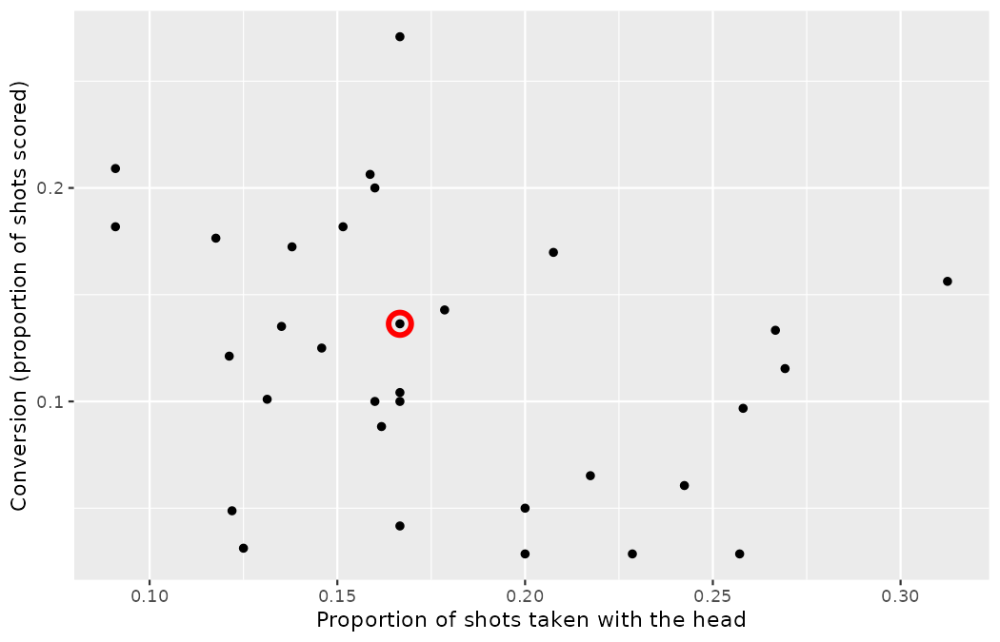
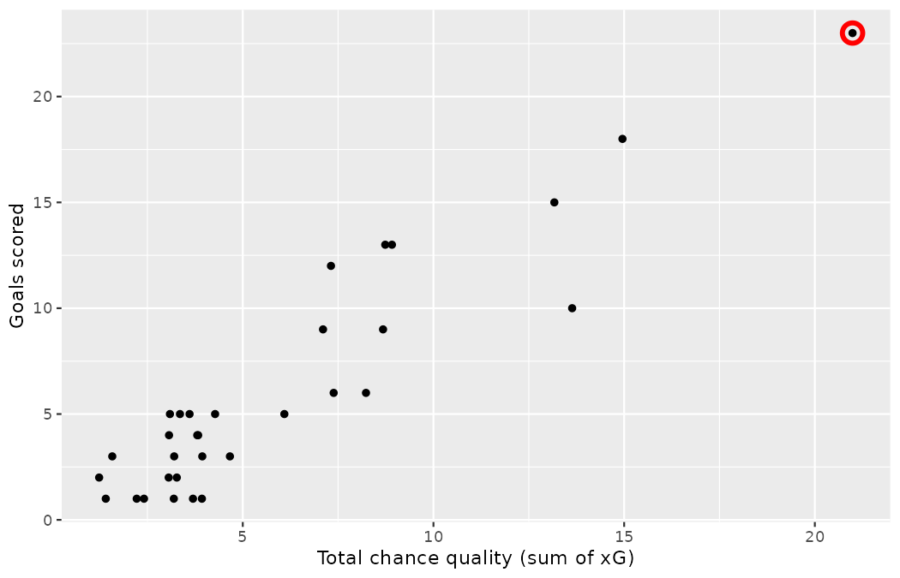

# Hello data {#sec-data-hello}

::: {.chapterintro}
Scouts and analysts seek to answer questions using rigorous methods and careful observations.
These observations -- collected from the likes of match logs, event-tagging systems, and trial-ground experiments -- form the backbone of a statistical investigation and are called **data**.
Statistics is the study of how best to collect, analyze, and draw conclusions from data.
In this first chapter, we focus on both the properties of data and on the collection of data.
:::

You are the newest analyst at Northbridge United FC, a mid-table club with a modest budget and, in Marta Vidal, a sporting director who asks precise questions and expects defensible answers.
Everything in this book is in service of one professional obligation: when the club is about to commit money, minutes, or a squad place on the basis of what somebody saw, you must be able to say what the data do and do not support.
We begin, as every analysis should, with the data themselves.

## Case study: a finishing program that backfired {#sec-case-study-stents-strokes}

In this section we introduce a classic challenge in statistics: evaluating the efficacy of an intervention.
Terms in this section, and indeed much of this chapter, will all be revisited later in the text.
The plan for now is simply to get a sense of the role statistics can play in practice.

Jonas Beck, Northbridge's academy director, was approached by a vendor selling a new high-intensity finishing program: shorter, sharper shooting sessions at near-match tempo, promised to raise young forwards' conversion in front of goal.
Before rolling it out, the club and a group of partner academies agreed to test it properly.
We start by writing the principal question the study hopes to answer:

> Does the high-intensity finishing program improve young players' finishing?

To be clear at the outset: this is a constructed scenario -- no such multi-academy trial was actually run -- and we will build the dataset ourselves in R code, in the open, so that every number in this section can be reproduced.
The design, however, is exactly how such a question *should* be studied.
The academies enrolled 451 age-eligible players.
Each volunteer player was randomly assigned to one of two groups:

-   **Treatment group**. Players in the treatment group received the new high-intensity finishing program alongside their regular development plan. The regular plan included ordinary technical sessions, strength work, and individual video review.
-   **Control group**. Players in the control group received the same regular development plan as the treatment group, but they did not receive the new finishing program.

The coaches randomly assigned 224 players to the treatment group and 227 to the control group.
In this study, the control group provides a reference point against which we can measure the impact of the finishing program in the treatment group.

The staff assessed every player at two time points: 30 days after enrollment and at the end of the season.
At each assessment, a player's finishing was measured against a fixed academy benchmark (a standardized battery of match-realistic finishing situations), and the player was recorded as `below benchmark` or `met benchmark`.
The code below constructs the `drill_trial` data -- one row per player -- and a seeded sample shows the results for 5 players.

```r
library(dplyr)
library(tidyr)
library(readr)
library(ggplot2)

drill_trial <- tibble(
  group = c(rep("finishing program", 224), rep("standard training", 227)),
  day30 = c(rep("below benchmark", 33), rep("met benchmark", 191),
            rep("below benchmark", 13), rep("met benchmark", 214)),
  season_end = c(rep("below benchmark", 45), rep("met benchmark", 179),
                 rep("below benchmark", 28), rep("met benchmark", 199))
)

set.seed(103)
drill_trial |>
  slice_sample(n = 5) |>
  arrange(group) |>
  mutate(player = 1:n()) |>
  relocate(player)
#> # A tibble: 5 × 4
#>   player group             day30         season_end
#>    <int> <chr>             <chr>         <chr>
#> 1      1 finishing program met benchmark below benchmark
#> 2      2 finishing program met benchmark met benchmark
#> 3      3 standard training met benchmark met benchmark
#> 4      4 standard training met benchmark met benchmark
#> 5      5 standard training met benchmark below benchmark
```

It would be difficult to answer a question about the impact of the program on **all** 451 players using these *individual* observations.
This question is better addressed by performing a statistical data analysis of *all* observations.
The code below counts outcomes at each time point, and @tbl-drill-trial-summary summarizes the raw data in a more helpful way.

```r
drill_trial |>
  count(group, day30) |>
  pivot_wider(names_from = day30, values_from = n)
#> # A tibble: 2 × 3
#>   group             `below benchmark` `met benchmark`
#>   <chr>                         <int>           <int>
#> 1 finishing program                33             191
#> 2 standard training                13             214

drill_trial |>
  count(group, season_end) |>
  pivot_wider(names_from = season_end, values_from = n)
#> # A tibble: 2 × 3
#>   group             `below benchmark` `met benchmark`
#>   <chr>                         <int>           <int>
#> 1 finishing program                45             179
#> 2 standard training                28             199
```

|                   | 30 days: below | 30 days: met | Season end: below | Season end: met |
|:------------------|---------------:|-------------:|------------------:|----------------:|
| finishing program |             33 |          191 |                45 |             179 |
| standard training |             13 |          214 |                28 |             199 |
| Total             |             46 |          405 |                73 |             378 |

: Descriptive statistics for the finishing program trial. {#tbl-drill-trial-summary}

In this table, we can quickly see what happened over the entire study.
For instance, to identify the number of players in the treatment group who were below benchmark 30 days in, we look in the leftmost count column, in the finishing program row: 33.
To identify the number of control players who met the benchmark at season end, we look at the rightmost column, in the standard training row: 199.

::: {.callout-tip title="Check your understanding"}
Of the 224 players in the treatment group, 45 were below the benchmark at the end of the season.
Using these two numbers, compute the proportion of players in the treatment group who were below the benchmark at season end.

------------------------------------------------------------------------

The proportion is $45/224 \approx 0.20.$
Take the notation apart, because proportions will follow us through the entire book: the numerator, 45, counts the players with the outcome of interest; the denominator, 224, counts everyone in the group; their ratio, written as the fraction $45/224,$ is the *proportion*, a number between 0 and 1; multiplying a proportion by 100 re-expresses it as a *percent*, here $20\%.$
Fraction, decimal, and percent are three costumes for the same quantity, and we will switch freely among them.
One more small symbol has just made its first appearance and will follow us everywhere: $\approx$, read "is approximately equal to", which we use whenever a decimal has been rounded — as most of ours will be; $45/224$ is really $0.2009,$ so an honest equals sign was never available.
:::

We can compute summary statistics from the table to give us a better idea of how the impact of the finishing program differed between the two groups.
A **summary statistic** is a single number summarizing data from a sample.
For instance, the primary results of the study at season end could be described by two summary statistics: the proportion of players below benchmark in the treatment and control groups.

```r
45/224
#> [1] 0.2008929
28/227
#> [1] 0.123348
```

-   Proportion below benchmark in the treatment (finishing program) group: $45/224 \approx 0.20 = 20\%.$
-   Proportion below benchmark in the control group: $28/227 \approx 0.12 = 12\%.$

These two summary statistics are useful in looking for differences in the groups, and we are in for a surprise: an additional 8% of players in the treatment group finished the season below the benchmark!
This is important for two reasons.
First, it is contrary to what the coaches expected, which was that the program would *reduce* the rate of substandard finishing.
Second, it leads to a statistical question: do the data show a "real" difference between the groups?

This second question is subtle, and it is worth building the intuition with a single striker.
Suppose a forward's true, long-run conversion rate is exactly 10%: over a career, one shot in ten becomes a goal.
Now give her a 100-shot season.
While her chance of scoring on any given shot is 10%, we probably won't observe exactly 10 goals.
We can simulate such seasons directly:

```r
set.seed(104)
rbinom(10, size = 100, prob = 0.10)
#>  [1]  9 12 12 16 12  7  9  8 13  9
```

Ten simulated 100-shot seasons for a striker whose true rate never changes: her goal tallies wander from 7 to 16, and not one season lands on exactly 10.
(The recipe behind `rbinom()` gets its proper name — the binomial distribution — in @sec-binomial-named.)
Extending the simulation shows how rarely the "true" number appears:

```r
set.seed(104)
seasons <- rbinom(10000, size = 100, prob = 0.10)
mean(seasons == 10)
#> [1] 0.1373
range(seasons)
#> [1]  1 25
```

Only about 14% of 10,000 simulated seasons produce exactly 10 goals, and the tallies range from 1 all the way to 25 -- from "release him" to "sell for a fortune," with no change whatsoever in the underlying player.
This type of variation is part of almost any data generating process.
It is possible that the 8% difference in the finishing trial is due to this natural variation.
However, the larger the difference we observe (for a particular sample size), the less believable it is that the difference is due to chance.
So, what we are really asking is the following: if in fact the program has no effect, how likely is it that we observe such a large difference?

While we do not yet have statistical tools to fully address this question on our own -- they arrive in @sec-foundations-randomization -- we can comprehend the conclusion the study's analysts reached: there was compelling evidence of *harm* from the high-intensity program in this trial.
The intervention backfired.

**Be careful:** Do not generalize the results of this study to all players and all finishing programs.
This study looked at players in a specific age band, at specific academies, who volunteered for the trial and who may not be representative of young forwards in general.
In addition, there are many ways to structure high-tempo finishing work, and this study only considered one vendor's specific program.
However, this study does leave us with an important lesson, one every scouting department should frame on the wall: we should keep our eyes open for surprises, because interventions that "obviously" help sometimes hurt.

## Data basics {#sec-data-basics}

Effective presentation and description of data is a first step in most analyses.
This section introduces one structure for organizing data as well as some terminology that will be used throughout this book.

### Observations, variables, and data matrices

Here we leave the constructed trial behind and pick up the dataset that will do the heaviest lifting in this book: every shot recorded at the 2022 Men's World Cup, 1,494 rows of real event data.
One convention to fix before the first summary is computed: those 1,494 shots — and the 195 goals among them — include penalty kicks and the period-5 shoot-out kicks (the data's fifth playing period — the shoot-out) that settled drawn knockout ties, and because such uncontested kicks can tilt a headline total or conversion rate, this book flags them wherever they matter (the penalty lesson itself is taught in @sec-data-applications, which also dissects the match clock).
From it we draw a random sample of 50 shots, seeded so that you can reproduce it exactly, and call the result `shots50`.
This is the sample a scout might realistically have logged personally across the tournament, and we will return to it in @sec-explore-numerical.

```r
wc2022_shots <- read_csv("data/derived/wc2022_shots.csv")

set.seed(101)
shots50 <- wc2022_shots |>
  slice_sample(n = 50)

shots50 |>
  select(player, team, minute, play_pattern, body_part, statsbomb_xg, outcome) |>
  slice_head(n = 6)
#> # A tibble: 6 × 7
#>   player                        team     minute play_pattern  body_part  statsbomb_xg outcome
#>   <chr>                         <chr>     <dbl> <chr>         <chr>             <dbl> <chr>
#> 1 Bruno Miguel Borges Fernandes Portugal     44 From Throw In Right Foot      0.00671 Post
#> 2 Ousmane Dembélé               France       39 From Throw In Right Foot      0.0810  Off T
#> 3 Daniel Olmo Carvajal          Spain        95 From Throw In Right Foot      0.00852 Off T
#> 4 Daniel Olmo Carvajal          Spain         6 Regular Play  Right Foot      0.0321  Saved to Post
#> 5 Kylian Mbappé Lottin          France       67 Regular Play  Head            0.141   Goal
#> 6 Sebastián Coates Nión         Uruguay      96 Regular Play  Right Foot      0.103   Off T
```

Each row in the table represents a single shot.
The formal name for a row is a **case** or **observation** or **unit of observation**.
The columns represent characteristics of each shot, where each column is referred to as a **variable**.
For example, the first row represents a 44th-minute shot by Bruno Fernandes of Portugal, struck with the right foot from a throw-in sequence, carrying a chance quality (`statsbomb_xg`) of about 0.007 -- and it hit the post.

Be precise about the unit of observation, always.
In `shots50` the case is *a shot* -- not a player, not a match.
Daniel Olmo appears in two rows because he took two of the sampled shots; that is two cases, not one.
Later in this chapter we will meet a dataset where the case is a *team*, and confusing the two levels is one of the most common ways a scouting report goes quietly wrong.

::: {.callout-tip title="Check your understanding"}
What is the play pattern of the first shot in the `shots50` output above?
And what was the outcome of that first shot?

------------------------------------------------------------------------

The first shot arose from a throw-in sequence (`From Throw In`), and its outcome was `Post` -- it struck the woodwork and did not count as a goal.
:::

In practice, it is especially important to ask clarifying questions to ensure important aspects of the data are understood.
For instance, it is always important to be sure we know what each variable means and its units of measurement.
An analyst who does not know whether `minute` restarts at halftime, or what exactly `statsbomb_xg` measures, will produce confident nonsense.
Descriptions of the main variables in the `shots50` dataset are given in @tbl-shots50-variables; the full dataset carries 21 variables per shot.

| Variable | Description |
|:---------------|:------------------------------------------------------|
| `player` | Name of the player taking the shot. |
| `team` | The shooting player's national team. |
| `minute` | Match minute in which the shot was taken, as a whole number. |
| `play_pattern` | The passage of play the shot arose from, e.g., `Regular Play`, `From Corner`, `From Throw In`, `From Counter`. |
| `body_part` | Body part used: `Right Foot`, `Left Foot`, `Head`, or `Other`. |
| `statsbomb_xg` | StatsBomb's expected-goals value: the estimated probability, between 0 and 1, that a shot like this one is scored. We call this the shot's *chance quality*. |
| `outcome` | What became of the shot: `Goal`, `Saved`, `Saved to Post`, `Saved Off Target`, `Post`, `Blocked`, `Off T` (off target), or `Wayward`. |
| `first_time` | Whether the shot was struck first time, `TRUE` or `FALSE`. |
| `under_pressure` | Whether the shooter was under defensive pressure, `TRUE` or `FALSE`. |
| `goal` | Whether the shot was scored, `TRUE` or `FALSE`. |

: Variables and their descriptions for the `shots50` dataset. {#tbl-shots50-variables}

The data in the `shots50` display represent a **data frame**, which is a convenient and common way to organize data, especially if collecting data in a spreadsheet.
A data frame where each row is a unique case (observational unit), each column is a variable, and each cell is a single value is commonly referred to as **tidy data**.

When recording data, use a tidy data frame unless you have a very good reason to use a different structure.
This structure allows new cases to be added as rows or new variables as new columns and facilitates visualization, summarization, and other statistical analyses.

::: {.callout-tip title="Check your understanding"}
Emil Sørensen's 48 regional scouts each file a match report grading every prospect they watched on several attributes.
How might you organize a season of the network's grades using a data frame?
Describe the observational units and variables.

------------------------------------------------------------------------

There are multiple strategies that can be followed.
One common strategy is to have each row represent one *scout-evaluation* -- one scout grading one prospect after one match -- with columns for the scout, the prospect, the match date, and one column per graded attribute (finishing, pressing, positioning, and so on).
Under this setup, it is easy to filter to a single prospect and review their full evaluation history.
There should also be columns for context, such as the competition and the opponent.
:::

::: {.callout-tip title="Check your understanding"}
We consider data for the 32 teams at the 2022 World Cup, which includes the name of each team, its shot count, its goals, and several characteristics of its shot mix: the share of its shots that were headers, struck first time, taken under pressure, and so on.
How might these data be organized in a data frame?

------------------------------------------------------------------------

Each team may be viewed as a case, and there are several pieces of information recorded for each case.
A table with 32 rows -- one per team -- and one column per characteristic could hold these data.
Note the change of observational unit: in `shots50` a row was a shot; here a row is a *team*, with each team's shots collapsed into summary values.
:::

The data described in the Check your understanding above form the `team_profile` dataset, which we build directly from the shot-level data -- this is your first *derived* dataset, and the code that derives it should always be visible:

```r
team_profile <- wc2022_shots |>
  group_by(team) |>
  summarize(
    n_shots         = n(),
    goals           = sum(goal),
    total_xg        = sum(statsbomb_xg),
    conversion      = mean(goal),
    mean_xg         = mean(statsbomb_xg),
    prop_headers    = mean(body_part == "Head"),
    prop_first_time = mean(first_time),
    prop_pressure   = mean(under_pressure),
    prop_corner     = mean(play_pattern == "From Corner"),
    prop_open_play  = mean(play_pattern == "Regular Play")
  )

team_profile |>
  select(team, n_shots, goals, total_xg, conversion, prop_headers) |>
  slice_head(n = 6)
#> # A tibble: 6 × 6
#>   team      n_shots goals total_xg conversion prop_headers
#>   <chr>       <int> <int>    <dbl>      <dbl>        <dbl>
#> 1 Argentina     110    23    21.0      0.209        0.0909
#> 2 Australia      26     3     1.58     0.115        0.269
#> 3 Belgium        35     1     3.69     0.0286       0.2
#> 4 Brazil         99    10    13.6      0.101        0.131
#> 5 Cameroon       28     4     3.07     0.143        0.179
#> 6 Canada         35     1     3.93     0.0286       0.229
```

One line of that code deserves a pause before we move on: `goal` is a logical variable, and R averages a logical by counting each `TRUE` as 1 and each `FALSE` as 0 — which is exactly the proportion of `TRUE`s, so `conversion = mean(goal)` is the proportion of shots scored, and every `prop_` share above is computed by the same stroke.

Note, per the convention fixed when we first met these data, that these team totals count period-5 shoot-out kicks as shots: Argentina's 110 shots and 23 goals include 9 shoot-out kicks, 8 of them converted.

The variables of `team_profile` are described in @tbl-team-profile-variables.

| Variable | Description |
|:------------------|:---------------------------------------------------|
| `team` | Name of the national team. |
| `n_shots` | Number of shots the team took in the tournament. |
| `goals` | Number of goals the team scored from those shots. |
| `total_xg` | Sum of the chance quality (`statsbomb_xg`) of all the team's shots. |
| `conversion` | Proportion of the team's shots that were scored. |
| `mean_xg` | Average chance quality per shot. |
| `prop_headers` | Proportion of the team's shots taken with the head. |
| `prop_first_time` | Proportion of the team's shots struck first time. |
| `prop_pressure` | Proportion of the team's shots taken under defensive pressure. |
| `prop_corner` | Proportion of the team's shots arising from corner sequences. |
| `prop_open_play` | Proportion of the team's shots arising in regular open play. |

: Variables and their descriptions for the `team_profile` dataset. {#tbl-team-profile-variables}

### Types of variables {#sec-variable-types}

Examine the `statsbomb_xg`, `minute`, `team`, and `outcome` variables in the shot data.
Each of these variables is inherently different from the other three, yet some share certain characteristics.

First consider `statsbomb_xg`, which is said to be a **numerical** variable since it can take a wide range of numerical values, and it is sensible to add, subtract, or take averages with those values.
On the other hand, we would not classify a variable reporting shirt numbers as numerical since the average, sum, and difference of shirt numbers do not have any clear meaning -- the number 9 does not sit "between" 7 and 11 in any footballing sense.
Instead, we would consider shirt number a categorical variable.

The `minute` variable is also numerical, although it seems to be a little different than `statsbomb_xg`.
The match minute can only take whole non-negative numbers (0, 1, 2, ...).
For this reason, the minute variable is said to be **discrete** since it can only take numerical values with jumps.
On the other hand, the chance quality variable is said to be **continuous**: between any two xG values, another is possible.

The variable `team` can take up to 32 values in this tournament: Argentina, Australia, ..., and Wales.
Because the responses themselves are categories, `team` is called a **categorical** variable, and the possible values (teams) are called the variable's **levels** (e.g., Argentina, Australia, Belgium, etc.).

Finally, consider the `outcome` variable, which describes what became of each shot and takes values `Goal`, `Saved`, `Saved to Post`, `Saved Off Target`, `Post`, `Blocked`, `Off T`, or `Wayward`.
This variable seems to be a hybrid: it is a categorical variable, but the levels have a natural (if debatable) ordering -- a saved shot came closer to a goal than a blocked one, which came closer than one dragged wayward.
A variable with these properties is called an **ordinal** variable, while a regular categorical variable without this type of special ordering is called a **nominal** variable.
The `play_pattern` variable, whose levels (`Regular Play`, `From Corner`, `From Throw In`, ...) admit no sensible ordering, is nominal.
To simplify analyses, any categorical variable in this book will be treated as a nominal (unordered) categorical variable.

The taxonomy is worth committing to memory, because the type of a variable dictates every summary, plot, and model available for it:

-   **all variables** split into **numerical** and **categorical**;
-   numerical variables are either **discrete** (values with jumps: `minute`, `goals`) or **continuous** (`statsbomb_xg`, `conversion`);
-   categorical variables are either **ordinal** (ordered levels: `outcome`, arguably) or **nominal** (unordered levels: `team`, `play_pattern`, `body_part`).

One more type deserves a note: the logical variables `first_time`, `under_pressure`, and `goal` take only the values `TRUE` and `FALSE`.
A logical variable is simply a categorical variable with two levels, and we will treat it as such.

::: {.callout-note title="Worked example"}
Data were collected about trialists at a Northbridge academy open day.
Three variables were recorded for each trialist: number of senior appearances, top sprint speed (in km/h), and whether the trialist had previously been registered with a professional club.
Classify each of the variables as continuous numerical, discrete numerical, or categorical.

------------------------------------------------------------------------

The number of senior appearances and the top sprint speed represent numerical variables.
Because the number of appearances is a count, it is discrete.
Sprint speed varies continuously, so it is a continuous numerical variable.
The last variable classifies trialists into two categories -- those who have and those who have not been registered with a professional club -- which makes this variable categorical.
:::

::: {.callout-tip title="Check your understanding"}
Recall the finishing program trial from @sec-case-study-stents-strokes.
A `group` variable indicated each player's experiment group: finishing program or standard training.
Suppose the staff had also recorded `goals_scored`, the number of goals each player scored in the season-end assessment battery.
Classify each variable as either numerical or categorical.

------------------------------------------------------------------------

The `group` variable can take just one of two group names, making it categorical.
The `goals_scored` variable describes a count of goals, which is an outcome where basic arithmetic is sensible, which means it is numerical; more specifically, since it represents a count, `goals_scored` is a discrete numerical variable.
:::

### Relationships between variables {#sec-variable-relations}

Many analyses are motivated by an analyst looking for a relationship between two or more variables.
Marta Vidal might put any of the following to the data team:

> Do teams that take a larger share of their shots with the head tend to convert their shots at a lower rate?

> If a team's total chance quality is above the tournament average, will its goal tally tend to be above or below the average?

> How much can a team's total chance quality explain of its final goal count?

To answer these questions, data must be collected, such as the `team_profile` dataset built above.
Examining **summary statistics** can provide numerical insights about the specifics of each of these questions.
Alternatively, graphs can be used to visually explore the data, potentially providing more insight than a summary statistic.

**Scatterplots** are one type of graph used to study the relationship between two numerical variables.
The code below plots each team's header share against its conversion rate, and highlights Morocco -- the tournament's surprise semifinalist and a team we will keep returning to.

```r
team_profile |>
  filter(team == "Morocco") |>
  select(team, n_shots, prop_headers, conversion)
#> # A tibble: 1 × 4
#>   team    n_shots prop_headers conversion
#>   <chr>     <int>        <dbl>      <dbl>
#> 1 Morocco      66        0.167      0.136

ggplot(team_profile, aes(x = prop_headers, y = conversion)) +
  geom_point() +
  geom_point(
    data = team_profile |> filter(team == "Morocco"),
    size = 4, shape = 1, stroke = 2, color = "red"
  ) +
  labs(
    x = "Proportion of shots taken with the head",
    y = "Conversion (proportion of shots scored)"
  )
```

{fig-alt="A scatterplot of 32 points, one per team, of conversion rate against the proportion of shots taken with the head. The cloud drifts loosely downward from left to right, and Morocco is highlighted with a red circle near the middle of the cloud." width=85%}

The plot shows 32 points, one per team.
The ranges on the two axes can be computed directly:

```r
team_profile |>
  summarize(
    min_headers = min(prop_headers), max_headers = max(prop_headers),
    min_conversion = min(conversion), max_conversion = max(conversion)
  )
#> # A tibble: 1 × 4
#>   min_headers max_headers min_conversion max_conversion
#>         <dbl>       <dbl>          <dbl>          <dbl>
#> 1      0.0909       0.312         0.0286          0.271
```

Header shares run from under a tenth of a team's shots (0.091) to nearly a third (0.312), and conversion rates from around 3% (0.029) up to 27% (0.271).
The cloud drifts downward from left to right: teams whose shot diet contains more headers tend, loosely, to convert at lower rates.
The drift is genuine but loose -- the points scatter widely around it, and individual teams cut against it.
Morocco, highlighted, sits near the middle of the cloud: 16.7% of its 66 shots were headers, and it converted 13.6% of its shots.
We might brainstorm as to why the downward tendency exists -- headed chances are typically contested, at awkward angles, from crosses -- and investigate each idea to determine which are the most reasonable explanations.

The header share and conversion rate are said to be associated because the plot shows a discernible pattern.
When two variables show some connection with one another, they are called **associated** variables.

Because the pattern here is loose, this is also the right moment for a warning about how *not* to read an association: as a rule that binds every case.
It does not.

```r
team_profile |>
  arrange(desc(prop_headers)) |>
  select(team, prop_headers, conversion) |>
  slice_head(n = 1)
#> # A tibble: 1 × 3
#>   team   prop_headers conversion
#>   <chr>         <dbl>      <dbl>
#> 1 Serbia        0.312      0.156
```

Serbia had the highest header share in the tournament -- 31.2% of its shots -- yet converted 15.6% of its shots, *above* the tournament's overall rate.
An association is a statement about a tendency across the whole collection of cases, not a verdict on any single one.
A scout who dismisses a team (or a player) because "headers don't convert" has mistaken a tendency for a law.

::: {.callout-tip title="Check your understanding"}
Examine the variables in the `team_profile` dataset, which are described in @tbl-team-profile-variables.
Create two questions about possible relationships between variables in `team_profile` that are of interest to you.

------------------------------------------------------------------------

Two example questions: (1) What is the relationship between the share of shots taken under pressure and a team's mean chance quality per shot?
(2) If a team takes an above-average share of its shots from corner sequences, will its conversion rate tend to be above or below the average?
:::

::: {.callout-note title="Worked example"}
This example examines the relationship between a team's total chance quality and its goal tally, visualized by the code below.
Are these variables associated?

```r
ggplot(team_profile, aes(x = total_xg, y = goals)) +
  geom_point() +
  geom_point(
    data = team_profile |> filter(team == "Argentina"),
    size = 4, shape = 1, stroke = 2, color = "red"
  ) +
  labs(
    x = "Total chance quality (sum of xG)",
    y = "Goals scored"
  )
```

{fig-alt="A scatterplot of goals scored against total chance quality for the 32 teams. The points sweep tightly upward from a bottom-left cluster of group-stage exits to Argentina, highlighted with a red circle at the top right with about 21 total xG and 23 goals." width=85%}

------------------------------------------------------------------------

The larger a team's total chance quality, the higher the goal tally observed for the team.
The 32 points sweep tightly upward from the bottom-left cluster of group-stage exits with a handful of goals to the highlighted point at the top right: Argentina, whose 110 shots accumulated a total chance quality of about 21.0 and who scored 23 goals on their way to the title (both values visible in the `team_profile` display above) — 23 including their 8 shoot-out conversions; 15 came in open play and set pieces during periods 1–4.
While it isn't true that every team with a higher total chance quality has a higher goal tally, the trend in the plot is evident, and visibly tighter than in the headers plot.
Since there is some relationship between the variables, they are associated.
:::

Because there is a downward trend in the headers plot -- teams with more of their shots coming from headers are associated with lower conversion -- these variables are said to be **negatively associated**.
A **positive association** is shown in the relationship between `total_xg` and `goals`, where teams that create more total chance quality tend to score more goals.

If two variables are not associated, then they are said to be **independent**.
Independence is a property of the underlying population or process, not of any one plot: two variables are independent if knowing the value of one tells you nothing about the distribution of the other.

::: {.callout-important title="Associated or independent, not both"}
At the population level, a pair of variables are either related in some way (associated) or not (independent).
No pair of variables is both associated and independent.
A sample, however, can only supply evidence *for* association — the absence of an evident relationship in our data is not proof of independence.
@sec-foundations-randomization makes this precise: independence is the null hypothesis a permutation test interrogates.
:::

The strength of an association can be quantified -- we will do so properly in @sec-model-slr -- but even now the computer can put a number beside what the eye sees.
The correlations confirm the visual impression: a loose negative relationship in the first plot and a strong positive one in the second.

```r
cor(team_profile$prop_headers, team_profile$conversion)
#> [1] -0.2852878
cor(team_profile$total_xg, team_profile$goals)
#> [1] 0.9281508
```

### Explanatory and response variables

When we ask questions about the relationship between two variables, we sometimes also want to determine if the change in one variable causes a change in the other.
Consider the following rephrasing of an earlier question about the `team_profile` dataset:

> If a team increases the total chance quality it creates, does this drive an increase in its goal tally?

In this question, we are asking whether one variable affects another.
If this is our underlying belief, then *total chance quality* is the **explanatory variable**, and the *goal tally* is the **response variable** in the hypothesized relationship.[^01-data-hello-1]

[^01-data-hello-1]: In some disciplines, it's customary to refer to the explanatory variable as the **independent variable** and the response variable as the **dependent variable**.
    However, this becomes confusing since a *pair* of variables might be independent or dependent, so we avoid this language.

::: {.callout-important title="Explanatory and response variables"}
When we suspect one variable might causally affect another, we label the first variable the explanatory variable and the second the response variable.
We also use the terms **explanatory** and **response** to describe variables where the **response** might be predicted using the **explanatory** even if there is no causal relationship.

<center>explanatory variable $\rightarrow$ *might affect* $\rightarrow$ response variable</center>

<br> For many pairs of variables, there is no hypothesized relationship, and these labels would not be applied to either variable in such cases.
:::

Read the little diagram above with care, because it is our first piece of statistical notation and it earns its place in every chapter that follows.
The arrow $\rightarrow$ is not an equals sign and not a promise: it records the *direction of the hypothesized influence*, running from the variable we suspect (or use) as the driver to the variable whose behavior we want to explain or predict.
The words "might affect" sit on the arrow deliberately.
Labeling `total_xg` explanatory and `goals` response records which way our question points -- nothing more.

Bear in mind that the act of labeling the variables in this way does nothing to guarantee that a causal relationship exists.
A formal evaluation to check whether one variable causes a change in another requires an experiment.

### Observational studies and experiments

There are two primary types of data collection: experiments and observational studies.

When researchers want to evaluate the effect of particular traits, treatments, or conditions, they conduct an **experiment**.
For instance, Northbridge's performance staff may suspect that chewing caffeine gum during the break before extra time improves late-match running.
To check if there really is a causal relationship between the explanatory variable (whether the player chewed caffeine gum or not) and the response variable (distance covered at sprint intensity in extra time), the staff identify a sample of players and split them into groups.
The individuals in each group are *assigned* a treatment.
When individuals are randomly assigned to a group, the experiment is called a **randomized experiment**.
Random assignment balances the groups on all characteristics *in expectation*: on average, no variable that might affect the outcome (e.g., fitness level, position, minutes already played) favors either group — but any single draw can come out lopsided, which is precisely why the blocking technique exists. (See @sec-principles-experimental-design for more information on confounding variables and blocking.)
For example, each player in the experiment could be randomly assigned, perhaps by flipping a coin, into one of two groups: the first group receives a **placebo** (fake treatment, in this case identical-tasting caffeine-free gum) and the second group receives the caffeine gum.
See the case study in @sec-case-study-stents-strokes for another example of an experiment, though that study did not employ a placebo -- there was no sham drill program.

Researchers perform an **observational study** when they collect data in a way that does not directly interfere with how the data arise.
For instance, a scouting department may collect information via questionnaires to its scouts, review the club's historical recruitment records, or follow a **cohort** of an entire academy intake for years to form hypotheses about why some players reach the first team and others do not.
The tournament shot data we used to build `shots50` and `team_profile` are exactly this kind of data: nobody assigned Serbia its header share -- football simply happened, and StatsBomb wrote it down.
In each of these situations, researchers merely observe the data that arise.
In general, observational studies can provide evidence of a naturally occurring association between variables, but they cannot by themselves show a causal connection as they do not offer a mechanism for controlling for confounding variables. (See @sec-principles-experimental-design for more information on confounding variables.)

::: {.callout-important title="Association ≠ Causation"}
In general, association does not imply causation.
An advantage of a randomized experiment is that it is easier to establish causal relationships with such a study.
The main reason for this is that observational studies do not control for confounding variables, and hence establishing causal relationships with observational studies requires advanced statistical methods (that are beyond the scope of this book).
We revisit ideas of confounding when we discuss experiments in @sec-principles-experimental-design.
:::

This inequality is the single most consequential sentence in the chapter, so let us pin it to our two data sources.
The finishing trial was a randomized experiment: because a coin decided who got the program, the study design lets us lay the 8-percentage-point gap at the program's door — once the machinery of @sec-foundations-randomization confirms that a gap this size is not simply chance's work, as the trial's analysts concluded.
The headers-and-conversion pattern is observational: heading a lot travels together with converting less, but nothing in the data says the headers *cause* the lower conversion -- teams that head often may simply be teams forced to attack from crosses against packed defenses.
When a finding from `team_profile` lands on Marta Vidal's desk, the verb must be "is associated with," never "causes."

::: {.callout-tip title="Check your understanding"}
An analyst finds, in tournament data, that players who take more first-time shots have higher conversion rates, and recommends coaching every academy forward to shoot first time.
What is the flaw in jumping from this finding to that recommendation?

------------------------------------------------------------------------

The finding is observational: nobody randomly assigned first-time shots.
Players attempt first-time finishes disproportionately in situations that already favor scoring (a cutback arriving in the six-yard box, say), so the situation -- not the technique -- may drive the association.
Only a randomized experiment, like the academy trial designs in this chapter, could establish that coaching the technique *causes* better conversion.
:::

## Chapter review {#sec-chp1-review}

### Summary

This chapter introduced you to the world of data.
Data can be organized in many ways but tidy data, where each row represents an observation and each column represents a variable, lends itself most easily to statistical analysis -- whether the observation is a single World Cup shot, as in `shots50`, or a whole team's tournament, as in `team_profile`.
Always be able to say what the unit of observation is, what type each variable is, and whether the data arose from an experiment or observationally -- the last distinction controls whether "causes" may ever appear in your report.
And keep the finishing trial in mind: a well-designed study is allowed to surprise you.
Many of the ideas from this chapter will be revisited as we move on to doing end-to-end data analyses.
In the next chapter you're going to learn about how we can design studies to collect the data we need to make conclusions with the desired scope of inference.

### Terms

The terms introduced in this chapter are presented below, alphabetized.
If you're not sure what some of these terms mean, we recommend you go back in the text and review their definitions.
You should be able to easily spot them as **bolded text**.

|  |  |  |
|:-----------------------|:-----------------------|:----------------------|
| associated | experiment | ordinal |
| case | explanatory variable | placebo |
| categorical | independent | positive association |
| cohort | level | randomized experiment |
| continuous | negative association | response variable |
| data | nominal | summary statistic |
| data frame | numerical | tidy data |
| dependent | observation | unit of observation |
| discrete | observational study | variable |

: Terms introduced in this chapter. {#tbl-terms-chp-1}

## Exercises {#sec-chp1-exercises}

Answers to odd-numbered exercises can be found in [Appendix -@sec-exercise-solutions-01]. Final answers to the even-numbered exercises are in [Appendix -@sec-appendix-even-answers].

::: {.exercises}

:::

------------------------------------------------------------------------

Adapted from *Introduction to Modern Statistics* by Çetinkaya-Rundel & Hardin (CC BY-SA 4.0); this adaptation is likewise CC BY-SA 4.0. Match data: StatsBomb open data.
